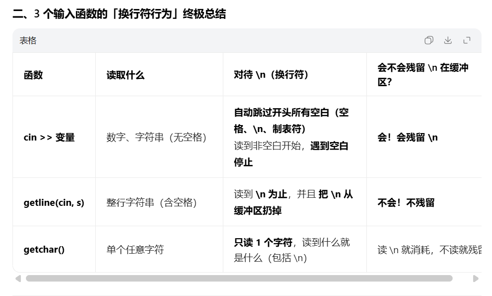
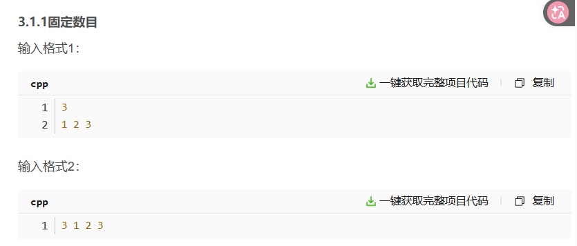

# ACM输入输出模式


## 输入
### 指定输入个数


```c
int n;
cin >> n; // 读入3，说明数组的大小是3
vector<int> nums(n); // 创建大小为3的vector<int>
for(int i = 0; i < n; i++) {
	cin >> nums[i];
}

// 验证是否读入成功
for(int i = 0; i < nums.size(); i++) {
	cout << nums[i] << " ";
}
cout << endl;

```
### 不指定输入个数，以换行符 "\n" 结束
## 输出