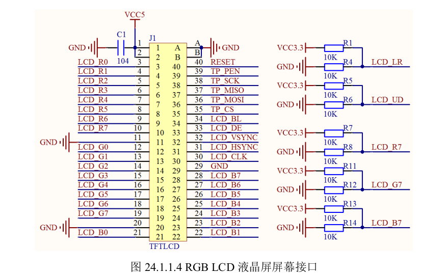

## lcd屏幕的分辨率
**定义**：
分辨率指的是绝对像素尺寸，比如
1. 1080p = 1920 px (x)* 1080px(y)

所以
1. 同尺寸，分辨率越高越清晰
2. 同分辨率，屏幕尺寸越小月清晰

## lcd像素格式
一个像素px，由r,g,b三个小灯控制，每个小灯8bit
所以一个像素 为 3*8=24bit = 3byte. 成为 RGB888

若再加一个8bit的透明通道A，则变成32bit的 4byte的 ARGB8888

## lcd屏幕的信号线接口
我们所使用的imx6ull + ATK屏幕1024*600. 采用的是RGB接口，接口连线有：
1. R[0:7]
2. G[0:7]
3. B[0:7]
4. DE 数据使能
5. VSYNC 垂直同步信号（表示新的一帧画面）
6. HSYNC 行同步信号 （表示新的一行）
7. PCLK 时钟信号

- 我们目前的LCD屏幕有两种驱动模式：
  - DE模式（用DE线， 可以不用HSYNC线）
  - HV模式（不用DE线）

## 外设接口原理图

## LCD屏幕的时间参数(协议)

每一帧图像的渲染，是按照从左到右，从上到下的顺序进行扫描的。所以是一行一行组成的。

**时间参数**：
1. **HSYNC**：（信号线）
    行同步信号，产生表示显示新行
2. **VSYNC**：（信号线）
    帧同步信号，产生表示显示新一帧图像
3. **HBP**：（时间）
    当显示完一行后会发出HSYNC信号，电子枪关闭，移动到屏幕左边，从HSYNC信号结束，到等待电子枪重新打开的这段延时=HBP
4. **HFP**：（时间）
    当显示完一行之后，电子枪关闭，到HSYNC信号产生之间的延时=HFP。

5. **VFP**：（时间）
    当显示完一帧图像之后，电子枪关闭，到VSYNC信号产生之间的延时
6. **VBP**：（时间）
    当VSYNC信号结束，到电子枪打开的这段延时

HBP，HFP，VFP，VBP，这四个屏幕的参数，具体多少，需要参考LCD数据手册。

7. **HSPW**：（时间）
    这个是HSYNC信号的时钟宽度
8. **VSPW**：（时间）
    这个是VSYNC信号的时钟宽度
9. **LINE**：（时间）
    显示完一帧图像所需时间
10. **HOZVAL**：（时间）
    显示完一行数据所需时间

11. **像素时钟**：
    就是LCD的时钟信号，即显示一帧图片需要多少个时钟数（因为频率已经确定了）
    所以pxclk = (VSPW+VSB+LINE+VFP)*（HSPW+HBP+HOZVAL+HFP）= 853440个时钟。

    所以要保持60hz，就需要51.2Mhz时钟信号。

- 所以需要配置LCD屏幕的时钟源

## LCD屏幕的显存
一个px = 4byte(ARGB8888)
所以一帧图片就是1024*600*4byte = 2.4MB

因为这款LCD内部没有存储器。所以需要从DDR3（我们板子的外置ROM）中分配。

## LCD屏幕的eLCDIF接口
这个eLCDIF是IMX6U自带的液晶屏接口，用于连接RGB LCD（可以把他想成是SOC上的连接至CA核心的外设）

eLCDIF支持3种接口：
1. MPU接口（SOC和LCD屏幕直接传输数据和指令，如STM32的MCU屏幕）
2. VSYNC接口
3. **DOTCLK接口**（这个接口是用来连接RGBLCD的，包括VSYNC，HSYNC，DOTCLK，ENABLE这4个信号。也叫做RGB接口）

**所以配置LCD驱动的关键，在于配置SOC上的eLCDIF的相关寄存器，配置好上面的一些时间参数。**

主要配置一些：
1. eLCDIF软复位（复位LCD，不是复位eLCDIF接口寄存器）
2. 工作模式（DOTCLK）
3. 数据大端小端
4. 数据总线宽度
5. 像素数据格式
6. eLCDIF工作模式
7. 使能位
8. 数据线极性位
9. 数据线使能位
10. 脉冲宽度位
11. 像素个数等等

## LCD 屏幕驱动配置
1. 初始化LCD的IO
   配置所有IO，复用为eLCDIF的IO口
2. 设置LCD的时钟源
3. 配置eLCDIF接口（SOC的接口外设，所有外设驱动适配，本质都是设置SOC的内置外设寄存器）、
4. 编写对外使用接口

## 总结：驱动配置思路
我们所有**配置驱动**，都是在配置SOC内部连接在外设总线上的**SOC外设**，也叫资源
1. **时钟**
2. **IO**
3. **协议->SOC内部寄存器->**
   1. CR
   2. DR
   3. SR

所以，在适配外设的时候，要先搞清楚，外部设备是什么，实际的SOC外设资源是什么
比如

SOC内部外设资源-----------------------------实际的外部设备
eLCDIF----------------------------------------------LCD
uart------------------------------------------------uart
gpio------------------------------------------------led,beep,key
exti------------------------------------------------key