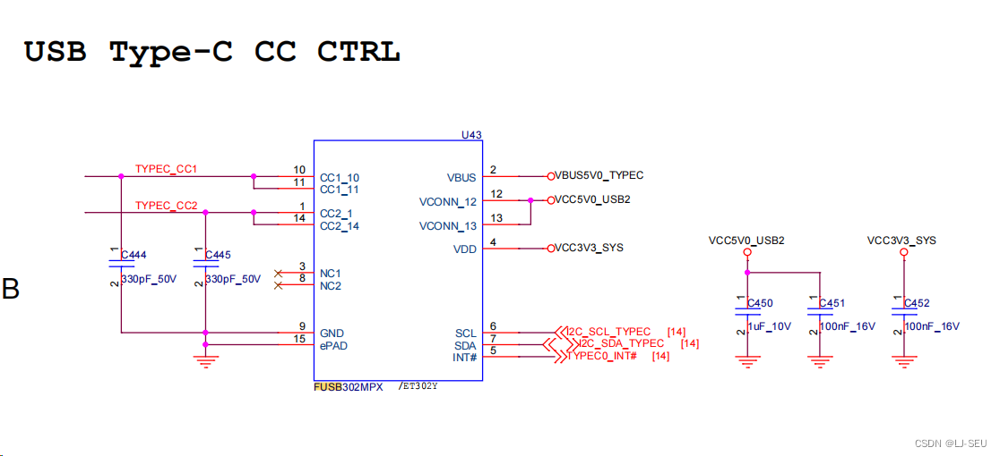
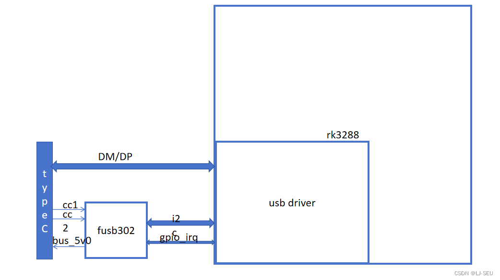
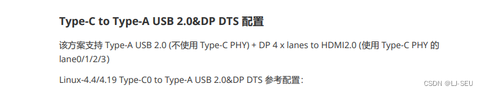
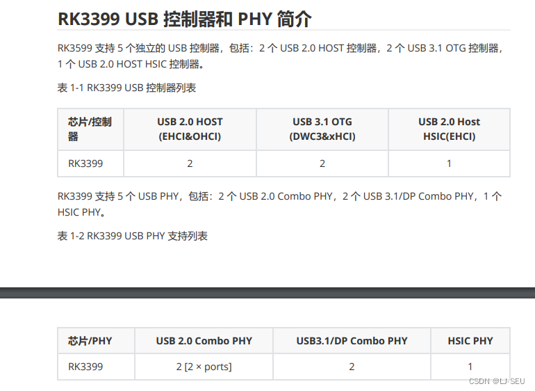

- [背景](#背景)
- [需求](#需求)
- [调试过程](#调试过程)
  - [查看原理图](#查看原理图)
  - [尝试寻找 sysfs里面的可能的设置接口](#尝试寻找-sysfs里面的可能的设置接口)
  - [尝试修改fusb302 驱动来静态切换 host 和 device模式](#尝试修改fusb302-驱动来静态切换-host-和-device模式)
  - [尝试反复insmod rmmod fusb302驱动来实现切换](#尝试反复insmod-rmmod-fusb302驱动来实现切换)
  - [尝试释放fusb302对vbus的控制，以及对中断信号的控制来静态手动切换模式](#尝试释放fusb302对vbus的控制以及对中断信号的控制来静态手动切换模式)
  - [Redmine求助，了解rk3399 内部 usb架构](#redmine求助了解rk3399-内部-usb架构)
  - [尝试使用typeC拆分 usb2.0, 仿照RK3288的otg usb口](#尝试使用typec拆分-usb20-仿照rk3288的otg-usb口)
    - [测试方案1，虚拟一个typeC 控制驱动节点，来通知USB2.0 控制器](#测试方案1虚拟一个typec-控制驱动节点来通知usb20-控制器)
    - [重新理清除整个usb架构](#重新理清除整个usb架构)
      - [概念扫盲](#概念扫盲)
- [](#)
    - [回头分析方案](#回头分析方案)
    - [测试方案2， 直接拆分usb2.0](#测试方案2-直接拆分usb20)
  - [UI 状态栏控制选项添加](#ui-状态栏控制选项添加)


## 背景
RK3399 二合一板子在工厂装机试生产的时候发现一些bug，其中有一个bug是 RK3399 板卡的type C口 插上延长线后，外接一个U盘无法进行读取，但是插上双头USB线连接电脑是可以进行adb调试的。typeC 口无法实现OTG功能，自动识别外设。但是在公司内部我们使用一个typeC转USB口的转换器是可以识别我们的U盘的。

## 需求
需要让 RK3399 二合一的板卡的type C实现otg的功能，能够自动识别外设，切换host和device模式

## 调试过程
###  查看原理图
知道了fusb302的存在，这是一个typeC 的控制芯片，然后通过网上调研，了解了typeC如何实现otg功能，后来发现了问题的原因，是因为我们硬件上的typeC转usb的延长线里面的硬件接线只有4根线（D+，D-，VCC，GND），而 typeC 的otg功能的识别是需要通过CC1 CC2的引脚来识别的。我们的硬件上没有这几根线，所以无法进行识别U盘进入host模式。

以下就是我们RK3399 的硬件原理图（typeC 控制部分）

下图是我们的typeC 的原理图，我们的typeC 转usb2.0 的转换延长线，只有TYPEC0_DM，TYPEC0_DP，这两个做差分信号线，VBUS5V0_TYPEC做供电线。

但是typeC 实现真正的otg是通过TYPEC_CC1, TYPEC_CC2这两根引脚来判断是工作在host模式还是工作在device模式。

由于我们没有接，所以我们实际上是无法得知插入的设备是host还是device的


fusb302 typeC 的控制芯片，输入引脚是cc1， cc2 来检测插入的设备是host设备还是device设备。然后通过i2c 与cpu交互，来把rk3288配置成host模式，或者是device模式，并控制vbus供电给外部连接的设备。

（因为我们的cc1 cc2没有接，所以对于这个typeC 的控制芯片来说，其实就是没有输入，那么我们的转接线接了就和没有接一样了。所以我们用转接线接U盘是无法被识别成device设备的）




此时对这个usb 架构的理解是这个


### 尝试寻找 sysfs里面的可能的设置接口
此时想尝试有没有文件系统里面的接口，像是Android6 里面设置 force_usb_mode 这种，然后网上搜索了以下，都失败了，写入后没有反应。
### 尝试修改fusb302 驱动来静态切换 host 和 device模式
由于fusb302这是一个typeC 的控制芯片，rk3288通过这个芯片来实现typeC 的otg的，简言之，是fusb302通过cc1 cc2引脚来识别外部设备是host还是device,然后通过i2c的中断信号来通知rk3288来动态切换usb mode。

所以既然这个芯片没有输入，我便想尝试能否修改fusb302这个芯片的驱动的逻辑，来跳过cc1 cc2引脚状态的检测，然后通过在驱动中增加sysfs的接口方式来动态配置fusb302的状态。
，以下是fusb302.c 的probe函数

```c
static int fusb30x_probe(struct i2c_client *client,
			 const struct i2c_device_id *id)
{
	struct fusb30x_chip *chip;
	struct PD_CAP_INFO *pd_cap_info;
	int ret;
	char *string[2];

	chip = devm_kzalloc(&client->dev, sizeof(*chip), GFP_KERNEL);
	if (!chip)
		return -ENOMEM;

	if (fusb30x_port_used == 0xff)
		return -1;

	chip->port_num = fusb30x_port_used++;
	fusb30x_port_info[chip->port_num] = chip;

	chip->dev = &client->dev;
	// 初始化i2c
	chip->regmap = devm_regmap_init_i2c(client, &fusb302_regmap_config);
	if (IS_ERR(chip->regmap)) {
		dev_err(&client->dev, "Failed to allocate regmap!\n");
		return PTR_ERR(chip->regmap);
	}
	// 初始化gpio
	ret = fusb_initialize_gpio(chip);
	if (ret)
		return ret;

	fusb_initialize_timer(chip);

	// 创建了工作队列 fusb302_wq, 并设置回调函数 fusb302_work_func
	chip->fusb30x_wq = create_workqueue("fusb302_wq");
	INIT_WORK(&chip->work, fusb302_work_func);

	chip->role = ROLE_MODE_NONE;
	chip->try_role = ROLE_MODE_NONE;
	if (!of_property_read_string(chip->dev->of_node, "fusb302,role",
				     (const char **)&string[0])) {
		if (!strcmp(string[0], "ROLE_MODE_DRP"))
			chip->role = ROLE_MODE_DRP;
		else if (!strcmp(string[0], "ROLE_MODE_DFP"))
			chip->role = ROLE_MODE_DFP;
		else if (!strcmp(string[0], "ROLE_MODE_UFP"))
			chip->role = ROLE_MODE_UFP;
	}

	if (chip->role == ROLE_MODE_NONE) {
		dev_warn(chip->dev,
			 "Can't get property of role, set role to default DRP\n");
		chip->role = ROLE_MODE_DRP;
		string[0] = "ROLE_MODE_DRP";
	}

	if (!of_property_read_string(chip->dev->of_node, "fusb302,try_role",
				     (const char **)&string[1])) {
		if (!strcmp(string[1], "ROLE_MODE_DFP"))
			chip->try_role = ROLE_MODE_DFP;
		else if (!strcmp(string[1], "ROLE_MODE_UFP"))
			chip->try_role = ROLE_MODE_UFP;
	}

	if (chip->try_role == ROLE_MODE_NONE)
		string[1] = "ROLE_MODE_NONE";

	// 这里发现，在probe中有设置初始状态是unattached，表示什么都没有接。
	chip->vconn_supported = true;
	tcpm_init(chip);
	tcpm_set_rx_enable(chip, 0);
	chip->conn_state = unattached;
	tcpm_set_cc(chip, chip->role);

// 下面一堆配置很多，没看太懂，有点复杂，没时间看
/*
	chip->n_caps_used = 1;
	chip->source_power_supply[0] = 0x64;
	chip->source_max_current[0] = 0x96;

	pd_cap_info = &chip->pd_cap_info;
	pd_cap_info->dual_role_power = 1;
	pd_cap_info->data_role_swap = 1;

	pd_cap_info->externally_powered = 1;
	pd_cap_info->usb_suspend_support = 0;
	pd_cap_info->usb_communications_cap = 0;
	pd_cap_info->supply_type = 0;
	pd_cap_info->peak_current = 0;

	chip->extcon = devm_extcon_dev_allocate(&client->dev, fusb302_cable);
	if (IS_ERR(chip->extcon)) {
		dev_err(&client->dev, "allocat extcon failed\n");
		return PTR_ERR(chip->extcon);
	}

	ret = devm_extcon_dev_register(&client->dev, chip->extcon);
	if (ret) {
		dev_err(&client->dev, "failed to register extcon: %d\n",
			ret);
		return ret;
	}

	ret = extcon_set_property_capability(chip->extcon, EXTCON_USB,
					     EXTCON_PROP_USB_TYPEC_POLARITY);
	if (ret) {
		dev_err(&client->dev,
			"failed to set USB property capability: %d\n",
			ret);
		return ret;
	}

	ret = extcon_set_property_capability(chip->extcon, EXTCON_USB_HOST,
					     EXTCON_PROP_USB_TYPEC_POLARITY);
	if (ret) {
		dev_err(&client->dev,
			"failed to set USB_HOST property capability: %d\n",
			ret);
		return ret;
	}

	ret = extcon_set_property_capability(chip->extcon, EXTCON_DISP_DP,
					     EXTCON_PROP_USB_TYPEC_POLARITY);
	if (ret) {
		dev_err(&client->dev,
			"failed to set DISP_DP property capability: %d\n",
			ret);
		return ret;
	}

	ret = extcon_set_property_capability(chip->extcon, EXTCON_USB,
					     EXTCON_PROP_USB_SS);
	if (ret) {
		dev_err(&client->dev,
			"failed to set USB USB_SS property capability: %d\n",
			ret);
		return ret;
	}

	ret = extcon_set_property_capability(chip->extcon, EXTCON_USB_HOST,
					     EXTCON_PROP_USB_SS);
	if (ret) {
		dev_err(&client->dev,
			"failed to set USB_HOST USB_SS property capability: %d\n",
			ret);
		return ret;
	}

	ret = extcon_set_property_capability(chip->extcon, EXTCON_DISP_DP,
					     EXTCON_PROP_USB_SS);
	if (ret) {
		dev_err(&client->dev,
			"failed to set DISP_DP USB_SS property capability: %d\n",
			ret);
		return ret;
	}

	ret = extcon_set_property_capability(chip->extcon, EXTCON_CHG_USB_FAST,
					     EXTCON_PROP_USB_TYPEC_POLARITY);
	if (ret) {
		dev_err(&client->dev,
			"failed to set USB_PD property capability: %d\n", ret);
		return ret;
	}

	i2c_set_clientdata(client, chip);

	spin_lock_init(&chip->irq_lock);
	chip->enable_irq = 1;
*/

// 这里是申请gpio, 作为一个中断gpio， dts里面有配置一个gpio给他
	chip->gpio_int_irq = gpiod_to_irq(chip->gpio_int);
	if (chip->gpio_int_irq < 0) {
		dev_err(&client->dev,
			"Unable to request IRQ for INT_N GPIO! %d\n",
			ret);
		ret = chip->gpio_int_irq;
		goto IRQ_ERR;
	}

	ret = devm_request_threaded_irq(&client->dev,
					chip->gpio_int_irq,
					NULL,
					cc_interrupt_handler,
					IRQF_ONESHOT | IRQF_TRIGGER_LOW,
					client->name,
					chip);
	if (ret) {
		dev_err(&client->dev, "irq request failed\n");
		goto IRQ_ERR;
	}

	dev_info(chip->dev,
		 "port %d probe success with role %s, try_role %s\n",
		 chip->port_num, string[0], string[1]);

	chip->input = devm_input_allocate_device(&client->dev);
	if (!chip->input) {
		dev_err(chip->dev, "Can't allocate input dev\n");
		ret = -ENOMEM;
		goto IRQ_ERR;
	}

	chip->input->name = "Typec_Headphone";
	chip->input->phys = "fusb302/typec";

	input_set_capability(chip->input, EV_SW, SW_HEADPHONE_INSERT);

	ret = input_register_device(chip->input);
	if (ret) {
		dev_err(chip->dev, "Can't register input device: %d\n", ret);
		goto IRQ_ERR;
	}
	return 0;
IRQ_ERR:
	destroy_workqueue(chip->fusb30x_wq);
	return ret;
}
```

这个是fusb302的驱动的工作队列的回调函数，可以看到 里面通过 传进来的work结构体，借用 container_of 来找到父节点的chip，然后调用
state_machine_typec（chip）这个函数来对chip做处理。
```c
static void fusb302_work_func(struct work_struct *work)
{
	struct fusb30x_chip *chip;

	chip = container_of(work, struct fusb30x_chip, work);
	if (!chip->suspended)
		state_machine_typec(chip);
}


```
调用probe里面创建的工作队列，往里面加任务的地方很多，其中有一个地方是 cc_interupt_handler 这里看起来挺像是cc1 cc2 引脚触发的句柄回调函数。然后看到probe里面有注册这个句柄函数，然后触发了之后 会添加任务到工作队列，然后触发 state_machine_typec 这个状态机函数。

```c
static irqreturn_t cc_interrupt_handler(int irq, void *dev_id)
{
	struct fusb30x_chip *chip = dev_id;

	queue_work(chip->fusb30x_wq, &chip->work);
	fusb_irq_disable(chip);
	return IRQ_HANDLED;
}

//probe 里面，有注册这个软中断。
	ret = devm_request_threaded_irq(&client->dev,
					chip->gpio_int_irq,
					NULL,
					cc_interrupt_handler,
					IRQF_ONESHOT | IRQF_TRIGGER_LOW,
					client->name,
					chip);
	if (ret) {
		dev_err(&client->dev, "irq request failed\n");
		goto IRQ_ERR;
	}
```

下面这个就是在工作队列的回调处理函数中触发的状态机函数，可以看到里面有很多case， 包括了我们开头看到的 unattached。但是下面有很多policy什么的我就看不懂了，反正就看得懂3个
unattached
attached_source
attached_sink
表示当前状态时未接设备，接入host设备，接入device设备。

我当时想是不是只要执行对应的case里面的内容就可以实现这个静态的设置usb mode 了。
```c
static void state_machine_typec(struct fusb30x_chip *chip)
{
	u32 evt = 0;

	tcpc_alert(chip, &evt);
	mux_alert(chip, &evt);
	if (!evt)
		goto BACK;

	if (chip->notify.is_cc_connected)
		if (evt & (EVENT_CC | EVENT_DELAY_CC))
			fusb_try_detach(chip);

	if (evt & EVENT_RX) {
		tcpm_get_message(chip);
		if (PACKET_IS_CONTROL_MSG(chip->rec_head, CMT_SOFTRESET)) {
			if (chip->notify.power_role)
				set_state(chip, policy_src_softrst);
			else
				set_state(chip, policy_snk_softrst);
		}
	}

	if (evt & EVENT_TX) {
		if (chip->tx_state == tx_success)
			chip->msg_id++;
	}
	switch (chip->conn_state) {
	case disabled:
		fusb_state_disabled(chip, evt);
		break;
	case error_recovery:
		set_state_unattached(chip);
		break;
	case unattached:
		fusb_state_unattached(chip, evt);
		break;
	case attach_wait_sink:
		fusb_state_attach_wait_sink(chip, evt);
		break;
	case attach_wait_source:
		fusb_state_attach_wait_source(chip, evt);
		break;
	case attached_source:
		fusb_state_attached_source(chip, evt);
		break;
	case attached_sink:
		fusb_state_attached_sink(chip, evt);
		break;
	case attach_try_src:
		fusb_state_try_attach(chip, evt, ROLE_MODE_DFP);
		break;
	case attach_try_snk:
		fusb_state_try_attach(chip, evt, ROLE_MODE_UFP);
		break;
		
	case attach_wait_audio_acc:
		fusb_state_attach_wait_audio_acc(chip, evt);
		break;
	case attached_audio_acc:
		fusb_state_attached_audio_acc(chip, evt);
		break;

	/* POWER DELIVERY */
	/*
	case policy_src_startup:
		fusb_state_src_startup(chip, evt);
		break;
	case policy_src_discovery:
		fusb_state_src_discovery(chip, evt);
		break;
	case policy_src_send_caps:
		fusb_state_src_send_caps(chip, evt);
		if (chip->conn_state != policy_src_negotiate_cap)
			break;
	case policy_src_negotiate_cap:
		fusb_state_src_negotiate_cap(chip, evt);

	case policy_src_transition_supply:
		fusb_state_src_transition_supply(chip, evt);
		break;
	case policy_src_cap_response:
		fusb_state_src_cap_response(chip, evt);
		break;
	case policy_src_transition_default:
		fusb_state_src_transition_default(chip, evt);
		break;
	case policy_src_ready:
		fusb_state_src_ready(chip, evt);
		break;
	case policy_src_get_sink_caps:
		fusb_state_src_get_sink_cap(chip, evt);
		break;
	case policy_src_send_hardrst:
		fusb_state_src_send_hardreset(chip, evt);
		break;
	case policy_src_send_softrst:
		fusb_state_src_send_softreset(chip, evt);
		break;
	case policy_src_softrst:
		fusb_state_src_softreset(chip);
		break;
		*/

	/* UFP */
	/*
	case policy_snk_startup:
		fusb_state_snk_startup(chip, evt);
		break;
	case policy_snk_discovery:
		fusb_state_snk_discovery(chip, evt);
		break;
	case policy_snk_wait_caps:
		fusb_state_snk_wait_caps(chip, evt);
		break;
	case policy_snk_evaluate_caps:
		fusb_state_snk_evaluate_caps(chip, evt);
		/* without break */
		/*
	case policy_snk_select_cap:
		fusb_state_snk_select_cap(chip, evt);
		break;
	case policy_snk_transition_sink:
		fusb_state_snk_transition_sink(chip, evt);
		break;
	case policy_snk_transition_default:
		fusb_state_snk_transition_default(chip, evt);
		break;
	case policy_snk_ready:
		fusb_state_snk_ready(chip, evt);
		break;
	case policy_snk_send_hardrst:
		fusb_state_snk_send_hardreset(chip, evt);
		break;
	case policy_snk_send_softrst:
		fusb_state_snk_send_softreset(chip, evt);
		break;
	case policy_snk_softrst:
		fusb_state_snk_softreset(chip);
		break;

	/*
	 * PD Spec 1.0: PR SWAP: chap 8.3.3.6.3.1/2
	 *		VC SWAP: chap 8.3.3.7.1/2
	 */
	 /*
	case policy_src_prs_evaluate:
	case policy_snk_prs_evaluate:
		fusb_state_prs_evaluate(chip, evt);
		break;
	case policy_snk_prs_accept:
	case policy_src_prs_accept:
		fusb_state_prs_accept(chip, evt);
		break;
	case policy_snk_prs_reject:
	case policy_src_prs_reject:
	case policy_vcs_ufp_reject:
	case policy_drs_dfp_reject:
	case policy_drs_ufp_reject:
		fusb_state_prs_reject(chip, evt);
		break;
	case policy_src_prs_transition_to_off:
		fusb_state_src_prs_transition_to_off(chip, evt);
		break;
	case policy_src_prs_assert_rd:
		fusb_state_src_prs_assert_rd(chip, evt);
		break;
	case policy_src_prs_source_off:
		fusb_state_src_prs_source_off(chip, evt);
		break;
	case policy_snk_prs_send_swap:
	case policy_src_prs_send_swap:
		fusb_state_send_swap(chip, evt, CMT_PR_SWAP);
		break;
	case policy_snk_prs_transition_to_off:
		fusb_state_snk_prs_transition_to_off(chip, evt);
		break;
	case policy_snk_prs_assert_rp:
		fusb_state_snk_prs_assert_rp(chip, evt);
		break;
	case policy_snk_prs_source_on:
		fusb_state_snk_prs_source_on(chip, evt);
		break;
	case policy_vcs_ufp_evaluate_swap:
		fusb_state_vcs_ufp_evaluate_swap(chip, evt);
		break;
	case policy_vcs_ufp_accept:
		fusb_state_vcs_ufp_accept(chip, evt);
		break;
	case policy_vcs_ufp_wait_for_dfp_vconn:
	case policy_vcs_dfp_wait_for_ufp_vconn:
		fusb_state_vcs_wait_for_vconn(chip, evt);
		break;
	case policy_vcs_ufp_turn_off_vconn:
	case policy_vcs_dfp_turn_off_vconn:
		fusb_state_vcs_set_vconn(chip, evt, false);
		break;
	case policy_vcs_ufp_turn_on_vconn:
	case policy_vcs_dfp_turn_on_vconn:
		fusb_state_vcs_set_vconn(chip, evt, true);
		break;
	case policy_vcs_ufp_send_ps_rdy:
	case policy_vcs_dfp_send_ps_rdy:
		fusb_state_vcs_send_ps_rdy(chip, evt);
		break;
	case policy_vcs_dfp_send_swap:
		fusb_state_send_swap(chip, evt, CMT_VCONN_SWAP);
		break;
	case policy_drs_ufp_evaluate:
	case policy_drs_dfp_evaluate:
		fusb_state_drs_evaluate(chip, evt);
		break;
	case policy_drs_dfp_accept:
	case policy_drs_ufp_accept:
		fusb_state_drs_send_accept(chip, evt);
		break;
	case policy_drs_dfp_change:
	case policy_drs_ufp_change:
		fusb_state_drs_role_change(chip, evt);
		break;
	case policy_drs_ufp_send_swap:
	case policy_drs_dfp_send_swap:
		fusb_state_send_swap(chip, evt, CMT_DR_SWAP);
		break;

	default:
		break;
	}

BACK:
	if (chip->work_continue) {
		queue_work(chip->fusb30x_wq, &chip->work);
		return;
	}

	if (!platform_get_device_irq_state(chip))
		fusb_irq_enable(chip);
	else
		queue_work(chip->fusb30x_wq, &chip->work);
}
*/
```

之后我先测试了一下，我把probe里面设置的初始状态的unattached，改成attached_source，编译烧录后，发现插入转接线加U盘是可以识别的，然后改成attached_sink， 然后接adb 发现也是可以接入的。

很惊喜，感觉快成功了

然后我通过chatgpt写了一个在sysfs中创建一个文件的方式（/sys/class/liangji/test），通过读取这个flag文件的值，来切换fusb302的状态。触发的回调函数里面执行的就是 状态机里面切换状态做的操作。

但是后来发现，只能切换一次，也就是 从device模式切换成host模式可以，再切换成device模式也可以，但是再切换成host模式就没有效果了。研究了很久也不明白为什么，怀疑可能是fusb302芯片内部的寄存器需要某种设置，发现上面状态机函数里面的各个状态是嵌套的，不是切换完就退出的，是在没办法追踪下去各个状态到底是干嘛的。

发现这个方法太复杂，后来就放弃了。

### 尝试反复insmod rmmod fusb302驱动来实现切换
在上一个方法中，我发现直接修改probe的初始状态似乎可以直接配置fusb302的默认连接状态，当时猜想是不是可以编译两个fusb302的ko驱动文件，然后我要什么mode，就insmod什么状态的ko就行了。
想法很美好，现实很残酷。
当我insmod第一个的时候，确实可以设置typeC 的usb mode , 但是当我rmmod ， 在insmod另一个的时候，直接重启了。

又失败了。
### 尝试释放fusb302对vbus的控制，以及对中断信号的控制来静态手动切换模式
尝试修改fusb302的驱动看来过于复杂，于是我把眼光放在 fusb302和rk3288的连接上。看看能不能跨过fusb302，来做点手脚。
查看dts配置

```c
	fusb0: fusb30x@22 {
		compatible = "fairchild,fusb302";
		reg = <0x22>;
		pinctrl-names = "default";
		pinctrl-0 = <&fusb0_int>;
		vbus-5v-gpios = <&gpio1 RK_PA3 GPIO_ACTIVE_HIGH>;
		int-n-gpios = <&gpio1 RK_PA2 GPIO_ACTIVE_HIGH>;
		//discharge-gpios = <&gpio0 RK_PB4 GPIO_ACTIVE_HIGH>;
		charge-dev = <&bq25700>;
		support-uboot-charge = <1>;
		port-num = <0>;
		fusb302,role = "ROLE_MODE_DRP";
		fusb302,try_role = "ROLE_MODE_DFP";
		status = "disabled";
	};
```

我尝试是否能够把vbus5v的供电gpio 释放出来自己控制，给外设供电，看看能不能触发什么，后来发现，虽然能够控制供电，但是依然是不识别，这个时候想想，这个识别逻辑到底是怎么回事呢？
### Redmine求助，了解rk3399 内部 usb架构
向RK官方咨询后，他们提供了一份文档，里面讲解了 3399 的usb控制器的架构，以及typeC 的 相关拆分方案，当时没有太细看。只看了一个框架的图

这边大致搞懂了typeC 既可以用来当usb2.0传输usb数据，也可以做DP接口传出视频信号，以及 usb phy芯片的左右是用来转换usb信号为差分信号的。当时只是知道里面有这样的区分。接着就直接往下找解决办法了。

### 尝试使用typeC拆分 usb2.0, 仿照RK3288的otg usb口
当时听从了蒋工的建议，看这个文档里面，使用typeC 接口拆分usb2.0应该就行了，我当时就想，反正把里面typeC 拆分的每一个方法都试一试就行了。
#### 测试方案1，虚拟一个typeC 控制驱动节点，来通知USB2.0 控制器
第一次尝试使用的是



看他这边弄得还挺简单的，当时就无脑照抄了，抄上去发现也编译过了，但是测试还是无效，后来又看了看这个里面的内容，好像dp是搞显示数据的，和我这边的usb2.0数据关联好像不大，最后没办法，只能老老实实的把usb开发手册从头到尾整体看一遍
#### 重新理清除整个usb架构

##### 概念扫盲
https://blog.csdn.net/guoruibin123/article/details/134267833
以下是硬件接口形式 和 usb协议的关系图，
从软件上来讲，就是usb2.0, 3.0 这个表示usb协议
从硬件上来讲，就是usb接口有的几种形式（个人感觉可以把这种硬件接口理解成把支持的数据引脚全部打了个包）

那么所谓的typeC 拆分就是只是用usb2.0这一个功能。

以下是3399支持的usb控制器和phy的表格，在这里我知道了rk3399里面实现usb，是靠两个部分，usb控制器 + usb_phy

> 上面是rk3399支持的usb控制器和phy芯片，结合下面的连接框图可以看出rk3399内部usb控制的框架。可以看出
> 抛开只有一个的显示的DP控制器，我们有两组usb控制链路0 和 1。
> 
> ------
> 
> 以0 组为例，其中USB2 HOST_0_Controller（usb2.0 控制器host0）直接接的是 USB2 Comb PHY_O port1(usb2.0的phy0的port1端口)出来直接接一个TYPEA的2.0接口。
> 
> ----
> 
>  其中USB3 OTG_0 Controller 有两条路，一条是usb3.0 使用usb2.0链路，接到USB2 Comb PHY_0 port0（usb2.0的phy0的port0端口），从Type-C0 这个typeC 接口出去。（我们走的是这条链路）
>  
>  ----
>  
>  另一条就是USB3 OTG_0 Controller 走 USB3 PIPE， 和DP控制器一起进入MUX，然后走 USB3&DP CombPHY_0， 也走typeC
>  


---

> 下图是文档中描述的协议和硬件接口的对应关系，其中有详细解释了typeC 的引脚定义。可以看到里面有
> 标出我们需要的USB2.0 interface的引脚，另外还有高速数据这些估计是3.0的还有DP显示需要的，这些我们不管
> 也就是说，所谓的typeC 接口拆分USB2.0 接口，其实就是把typeC 当成 usb2.0的接口来使用，我们只用里面的2.0的引脚。


#### 回头分析方案
此时，我们已经理清了usb2.0的链路，并且，我们可以把上面测试方案1的方法放到框图中理解，发现他绕了一大圈，他试图通过typeC 接口走上面的DP控制器的链路，再走下面的usb3.0 otg usb2.0的链路来实现所谓的otg模式的切换，也许最终是可以的，但是后来我搞懂了之后去测试发现，设置成host模式发现报错：供电失败什么的

后来觉得这个方法太绕圈了，就尝试下面的方法了


#### 测试方案2， 直接拆分usb2.0

> 下面是直接走usb3.0 otg 的usb2.0链路直接到typeC 接口的链路，


### UI 状态栏控制选项添加