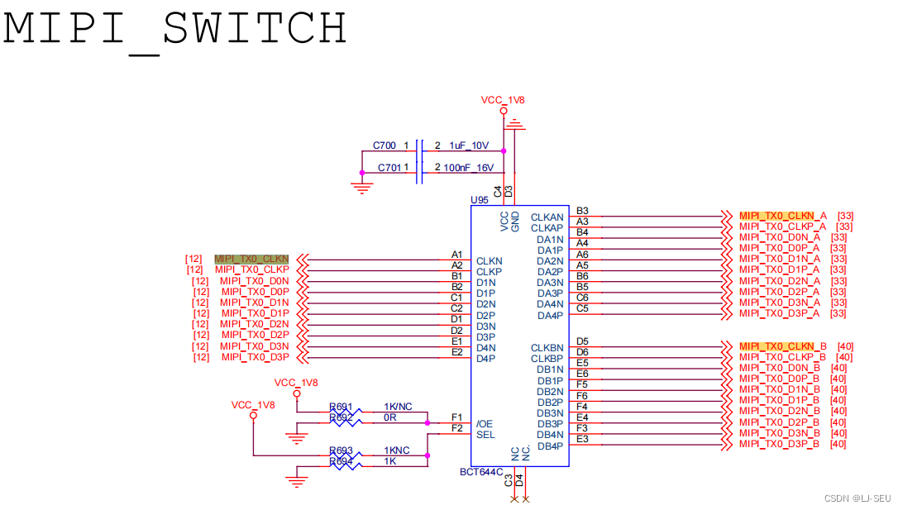
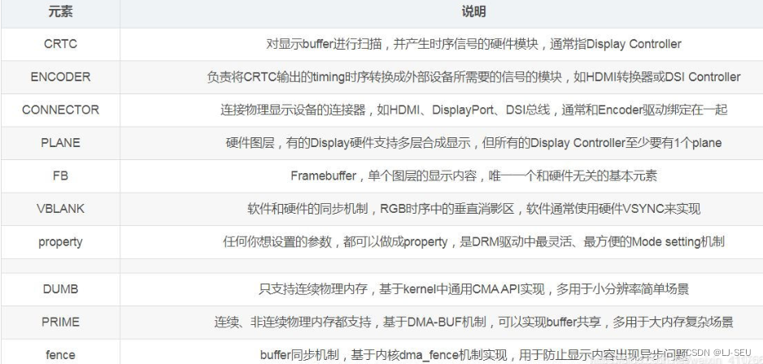
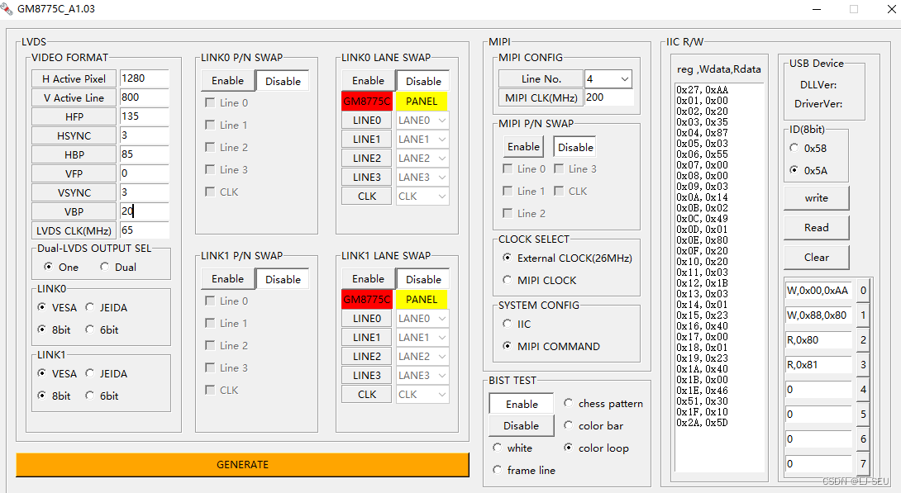

## 项目背景
舜宇的rk3399的Android10 二合一 新板卡，需求是使用mipi输出信号，通过GM8775C 转成 lvds信号适配10.1寸屏幕，主要记录踩坑记录

第一次尝试调试mipi屏幕，首先需要梳理原理图的链路，确保原理图的线路和芯片输出端口，每个使用到的芯片，确认供电，使能，时钟，确认芯片配置的电阻NC正确。确认dts使用的节点对应原理图的输出端口，先确保有信号输出，整个链路有信号，然后调试

## 原理图分析
**这个原理图是有错误的，rk3399的dsi有两个通道，dsi 和dsi1, 要输出mipi信号，点亮单个mipi屏幕，有两种方法。
1.单通道方式，只支持使用dsi输出mipi信号
2.双通道方式，同时使用dsi和dsi1通道，两个通道都要供电
所以这个原理图的设计有问题，只供电使用了dsi1，原理上无法输出mipi信号**

所以只能让板卡供应商改板

RK3399 dsi1的输出端口


mipi信号的高速转换芯片，输出A通道直接mipi屏幕，B通道转接GM8775C转成lvds信号



GM8775C。该芯片需要根据供应商提供的配置工具生成对应屏幕的mipi或i2c控制指令。
（mipi指令需要通过写在dts内，通过dsi的驱动，由mipi信号线路直接写入8775的configs寄存器中）
（i2c控制指令通过i2c直接写入。这个用于后端进入测试模式调试屏幕）


lvds接口，这里需要注意背光使能，pwm波输出的gpio引脚配置


## 数据信号链路分析
### **图像显示,以单通道为例**
vopb -> dsi -> switch -> GM8775 -> lvds接口 -> 10.1寸lvds屏幕

### **显示链路结构**



connector 后面一般接 bridge或者直接panel

### **dts timing屏幕参数解析**

## 调试记录
### GM8775C 后端链路测试输出
一开始使用8775C配置工具生成的i2c指令，通过自己写的gm8775的驱动，用i2c将该指令写入到gm8775C的configs寄存器中。

当时没有注意到勾选的是测试模式，误打误撞驱动8775测试模式点亮了lvds屏幕，屏幕亮色彩条。

和供应商确认，如果8775的测试模式正常，那么后端的链路就正常了，因为8775的测试模式不需要mipi信号输入就能让lvds屏幕亮特定图案。
### 前端mipi信号测试
一开始先拿的光韬的写到一半的dts来用。

在GM8775C后端链路确认正常后，开始测试8775c的输入端。发现没有信号。

发现前面switch的片选电阻NC错了，导致信号走了A通道，没有走B通道。遂修改NC电阻，但还是没有信号。

和供应商沟通，说是8775C的时钟要选择使用MIPI时钟，不用参考时钟，而我们8775当时的参考时钟连接的是外部时钟芯片，所以又把参考时钟接地。还是没有信号。

之后怀疑是dts配置有问题。
dts有几个主要的节点，dsi, route_dsi(显示boot图片的)， dsi_in_vopb, vop_out_dsi. dsi_out_panel, panel_in_dsi，这几个节点定义了信号出来的链路，这个要确保正确。

检查了之后，发现还是没有信号，发现我们的原理图上RK3399的MIPI信号是选用的MIPI_TX1/RX1，而dts里面使用的dsi。以为是dsi通道选错了，然后改成dsi1。但是还是不行。

然后去查询驱动，驱动主要两块，kernel/driver/gpu/drm/rockchip/dw-mipi-dsi.c 和 kernel/driver/gpu/drm/panel/panel-simple.c
这两块主要是负责dsi节点和panel节点的驱动。

在加入日志调试后，发现mipi指令的发送在panel->prepare里面，这个在encoder->enable里面，但是这个没有被调用过。即使追到drm_atomic_helper.c甚至修改驱动，让其强行进入也不行。

以为是dts的问题。咨询RK，给了一个只使用dsi1点亮mipi屏的案例，以为和我们的一样，都是使用dsi1作为信号输出。但是还是没有信号。

后来经过RK，说是dsi接口使用的要求，说是我们的dsi的输出接口没有供电

如果使用单通道，即dts里面只使能一个dsi节点，必须使用dsi节点。
如果使用双通道，则必须两个通道都要供电。

所以我们的板卡的设计就有问题，只用一个通道就只能走dsi，想要用两个通道，然后dsi1接屏幕，dsi通道也需要供电。（因为MIPI_TX1/RX1和MIPI_TX0在芯片内部共用一个pll，所以要用dsi1就必须要把dsi0的电也给供上）。

结果是硬件改版

待续

-----------------
### 改板后调试成功
2023_09_12号，新改版的rk3399二合一板已经到了，这次改版，将dsi0，dsi1都进行了供电，然后数据走dsi0。
[项目资料](https://download.csdn.net/download/A08118139/88346812)

因为我们数据是直接从dsi0走出来的，所以不再需要之前redmine上提供的使用dsi1的patch包了。

 1. 确认数据链路 vopb->dsi0->switch->gm8775->lvds_panel
 2. 确认背光是否打开（发现原理图上背光的电阻没有开）
 3. 确认后端链路是否正常，switch芯片切换，示波器抓信号，发现有变化。说明switch芯片是好的
 4. gm8775c用gm8775c的i2c驱动直接写入参数，发现能通过gm8775c的测试模式直接驱动屏幕。后端链路正常


5. 通过改换成mipi_dsi的驱动，将panel-init-sequence写入gm8775c来让gm8775测试模式驱动，也可以通过i2cdetect，i2cdump来读取挂载到i2c总线上的gm8775c的寄存器的值来确认是否成功写入。发现前端链读通路正常
6. 直接disabled掉测试模式，代码结构不变，之后就一发点亮了。
7. 屏幕调参，需要同步修改gm8775c的参数，直接使用gm8775c的测试模式来调参比较方便。
patch
```bash
From 9da946433967d11f1665f77a049372419385cfc9 Mon Sep 17 00:00:00 2001
From: liangji <liangji@keenon.com>
Date: Thu, 14 Sep 2023 10:50:45 +0800
Subject: [PATCH 1/2] feat: support mipi2lvds_10.1 use gm8775c

Change-Id: Ie3e7e6d18d3a6c744694279ed452c2ce1662c139
Signed-off-by: liangji <liangji@keenon.com>
---
 arch/arm64/boot/dts/rockchip/Makefile              |   1 +
 .../boot/dts/rockchip/rk3399-keenon-common.dtsi    |   4 +
 arch/arm64/boot/dts/rockchip/rk3399-keenon-w3s.dts | 198 +++++
 arch/arm64/configs/keenon_tablet_w3s_defconfig     | 943 +++++++++++++++++++++
 mk.sh                                              |   8 +-
 5 files changed, 1152 insertions(+), 2 deletions(-)
 create mode 100644 arch/arm64/boot/dts/rockchip/rk3399-keenon-w3s.dts
 create mode 100644 arch/arm64/configs/keenon_tablet_w3s_defconfig

diff --git a/arch/arm64/boot/dts/rockchip/Makefile b/arch/arm64/boot/dts/rockchip/Makefile
index e2d67d5..66f9abe 100644
--- a/arch/arm64/boot/dts/rockchip/Makefile
+++ b/arch/arm64/boot/dts/rockchip/Makefile
@@ -66,6 +66,7 @@ dtb-$(CONFIG_ARCH_ROCKCHIP) += rk3399-sapphire-excavator-linux.dtb
 dtb-$(CONFIG_ARCH_ROCKCHIP) += rk3399-sapphire-excavator-lp4-linux.dtb
 dtb-$(CONFIG_ARCH_ROCKCHIP) += rk3399-tve1030g-avb.dtb
 dtb-$(CONFIG_ARCH_ROCKCHIP) += rk3399-keenon-w3.dtb
+dtb-$(CONFIG_ARCH_ROCKCHIP) += rk3399-keenon-w3s.dtb
 dtb-$(CONFIG_ARCH_ROCKCHIP) += rk3399pro-evb-lp4-v11-linux.dtb
 dtb-$(CONFIG_ARCH_ROCKCHIP) += rk3399pro-evb-v10-linux.dtb
 dtb-$(CONFIG_ARCH_ROCKCHIP) += rk3399pro-evb-v11-linux.dtb
diff --git a/arch/arm64/boot/dts/rockchip/rk3399-keenon-common.dtsi b/arch/arm64/boot/dts/rockchip/rk3399-keenon-common.dtsi
index 95850d8..79f144e 100644
--- a/arch/arm64/boot/dts/rockchip/rk3399-keenon-common.dtsi
+++ b/arch/arm64/boot/dts/rockchip/rk3399-keenon-common.dtsi
@@ -794,6 +794,10 @@
 		bl_en: bl-en {
 			rockchip,pins = <1 RK_PA1 RK_FUNC_GPIO &pcfg_pull_none>;
 		};
+        bl_en1: bl-en1 {
+			rockchip,pins = <1 RK_PA0 RK_FUNC_GPIO &pcfg_pull_none>;
+		};
+
 	};
 
 	leds {
diff --git a/arch/arm64/boot/dts/rockchip/rk3399-keenon-w3s.dts b/arch/arm64/boot/dts/rockchip/rk3399-keenon-w3s.dts
new file mode 100644
index 0000000..5760fee
--- /dev/null
+++ b/arch/arm64/boot/dts/rockchip/rk3399-keenon-w3s.dts
@@ -0,0 +1,198 @@
+// SPDX-License-Identifier: (GPL-2.0+ OR MIT)
+/*
+ * Copyright (c) 2018 Fuzhou Rockchip Electronics Co., Ltd
+ */
+
+/dts-v1/;
+#include "rk3399-keenon-common.dtsi"
+
+&edp{
+	status = "disabled";
+};
+
+&pwm0{
+	status = "disabled";
+};
+
+&pwm1{
+	status = "okay";
+};
+
+&backlight {
+	enable-gpios = <&gpio1 0 GPIO_ACTIVE_HIGH>;
+	pinctrl-names = "default";
+	pinctrl-0 = <&bl_en1>;
+	pwms = <&pwm1 0 1000000 0>;
+};
+
+&hdmi {
+    status = "disabled";
+};
+
+&sdio0 {
+    status = "disabled";
+};
+
+&dsi_in_vopb {
+	status = "okay";
+};
+
+&dsi_in_vopl {
+	status = "disabled";
+};
+
+&route_dsi {
+	connect = <&vopb_out_dsi>;
+	status = "okay";
+};
+
+&dsi {
+	status = "okay";
+	rockchip,lane-rate = <1000>;
+
+	dsi_panel: panel@0 {
+		status = "okay";
+		compatible = "simple-panel-dsi";
+		reg = <0>;
+		backlight = <&backlight>;
+		enable-gpios = <&gpio2 RK_PD4 GPIO_ACTIVE_HIGH>;
+		//reset-gpios = <&gpio3 RK_PA4 GPIO_ACTIVE_LOW>;
+		reset-delay-ms = <120>;
+		enable-delay-ms = <120>;
+		prepare-delay-ms = <120>;
+		unprepare-delay-ms = <120>;
+		disable-delay-ms = <120>;
+		dsi,flags = <(MIPI_DSI_MODE_VIDEO | MIPI_DSI_MODE_VIDEO_BURST |
+			MIPI_DSI_MODE_LPM | MIPI_DSI_MODE_EOT_PACKET)>;
+		dsi,format = <MIPI_DSI_FMT_RGB888>;
+		dsi,lanes  = <4>;
+		panel-init-sequence = [
+			23 00 02 27 AA
+			23 00 02 01 00
+			23 00 02 02 20
+			23 00 02 03 35
+			23 00 02 04 87
+			23 00 02 05 03
+			23 00 02 06 55
+			23 00 02 07 00
+			23 00 02 08 00
+			23 00 02 09 03
+			23 00 02 0A 14
+			23 00 02 0B 02
+			23 00 02 0C 49
+			23 00 02 0D 01
+			23 00 02 0E 80
+			23 00 02 0F 20
+			23 00 02 10 20
+			23 00 02 11 03
+			23 00 02 12 1B
+			23 00 02 13 03
+			23 00 02 14 01
+			23 00 02 15 23
+			23 00 02 16 40
+			23 00 02 17 00
+			23 00 02 18 01
+			23 00 02 19 23
+			23 00 02 1A 40
+			23 00 02 1B 00
+			23 00 02 1E 46
+			23 00 02 51 30
+			23 00 02 1F 10
+			23 00 02 2A 01
+		];
+
+		panel-exit-sequence = [
+			05 00 01 28
+			05 00 01 10
+		];
+
+		disp_timings: display-timings {
+			native-mode = <&timing_lvds101>;
+			//native-mode = <&timing_lvds101>;
+            // 7" 1024x600 LVDS panel
+			timing_lvds7: timing0 {
+                clock-frequency = <52000000>;
+                hactive = <1024>;
+                vactive = <600>;
+                hfront-porch = <160>;
+                hsync-len = <10>;
+                hback-porch = <150>;
+                vfront-porch = <12>;
+                vsync-len = <1>;
+                vback-porch = <22>;
+                hsync-active = <0>;
+                vsync-active = <0>;
+                de-active = <0>;
+                pixelclk-active = <1>;
+			};
+			// 10.1" 1280x800 LVDS panel
+			timing_lvds101: timing1 {
+                clock-frequency = <65000000>;
+                hactive = <1280>;
+                vactive = <800>;
+                hback-porch = <85>;
+                hfront-porch = <135>;
+                vback-porch = <20>;
+                vfront-porch = <0>;
+                hsync-len = <3>;
+                vsync-len = <3>;
+                hsync-active = <0>;
+                vsync-active = <0>;
+                de-active = <0>;
+                pixelclk-active = <1>;
+			};
+
+            // test mipi
+			timing_test: timing2 {
+                clock-frequency = <132000000>;
+                hactive = <1080>;
+                vactive = <1920>;
+                hback-porch = <30>;
+                hfront-porch = <15>;
+                vback-porch = <15>;
+                vfront-porch = <15>;
+                hsync-len = <2>;
+                vsync-len = <2>;
+                hsync-active = <0>;
+                vsync-active = <0>;
+                de-active = <0>;
+                pixelclk-active = <1>;
+			};
+		};
+
+		ports {
+			#address-cells = <1>;
+			#size-cells = <0>;
+
+			port@0 {
+				reg = <0>;
+				panel_in_dsi: endpoint {
+					remote-endpoint = <&dsi_out_panel>;
+				};
+			};
+		};
+	};
+
+	ports {
+		#address-cells = <1>;
+		#size-cells = <0>;
+
+		port@1 {
+			reg = <1>;
+			dsi_out_panel: endpoint {
+				remote-endpoint = <&panel_in_dsi>;
+			};
+		};
+	};
+};
+
+&i2c3 { //这是I2C的dts配置，我GM8775C是挂载到I2C1上的。
+	status = "okay";
+    clock-frequency = <400000>;
+	
+       gm8775c@2d {
+               compatible = "gm8775";
+               reg = <0x2d>;
+               status = "okay";
+       };
+};
diff --git a/arch/arm64/configs/keenon_tablet_w3s_defconfig b/arch/arm64/configs/keenon_tablet_w3s_defconfig
new file mode 100644
index 0000000..6cd3537
--- /dev/null
+++ b/arch/arm64/configs/keenon_tablet_w3s_defconfig
@@ -0,0 +1,943 @@
+# CONFIG_LOCALVERSION_AUTO is not set
+CONFIG_AUDIT=y
+# CONFIG_AUDITSYSCALL is not set
+CONFIG_NO_HZ=y
+CONFIG_HIGH_RES_TIMERS=y
+CONFIG_PREEMPT=y
+CONFIG_IRQ_TIME_ACCOUNTING=y
+CONFIG_TASKSTATS=y
+CONFIG_TASK_DELAY_ACCT=y
+CONFIG_TASK_XACCT=y
+CONFIG_TASK_IO_ACCOUNTING=y
+CONFIG_PSI=y
+CONFIG_IKCONFIG=y
+CONFIG_IKCONFIG_PROC=y
+CONFIG_IKHEADERS=m
+CONFIG_LOG_BUF_SHIFT=19
+CONFIG_CGROUPS=y
+CONFIG_MEMCG=y
+CONFIG_MEMCG_SWAP=y
+CONFIG_BLK_CGROUP=y
+CONFIG_CGROUP_SCHED=y
+CONFIG_CGROUP_FREEZER=y
+CONFIG_CPUSETS=y
+CONFIG_CGROUP_CPUACCT=y
+CONFIG_CGROUP_BPF=y
+CONFIG_NAMESPACES=y
+# CONFIG_PID_NS is not set
+CONFIG_SCHED_TUNE=y
+CONFIG_BLK_DEV_INITRD=y
+# CONFIG_RD_BZIP2 is not set
+# CONFIG_RD_LZMA is not set
+# CONFIG_RD_XZ is not set
+# CONFIG_RD_LZO is not set
+# CONFIG_RD_LZ4 is not set
+CONFIG_INITRD_ASYNC=y
+# CONFIG_ROCKCHIP_ONE_INITRD is not set
+# CONFIG_SYSFS_SYSCALL is not set
+# CONFIG_FHANDLE is not set
+CONFIG_KALLSYMS_ALL=y
+CONFIG_BPF_SYSCALL=y
+CONFIG_BPF_JIT_ALWAYS_ON=y
+CONFIG_EMBEDDED=y
+# CONFIG_SLUB_DEBUG is not set
+# CONFIG_COMPAT_BRK is not set
+CONFIG_PROFILING=y
+CONFIG_ARCH_ROCKCHIP=y
+CONFIG_PCI=y
+CONFIG_PCIEPORTBUS=y
+CONFIG_PCIE_ROCKCHIP_HOST=y
+CONFIG_PCIE_DW_ROCKCHIP=y
+# CONFIG_ARM64_ERRATUM_826319 is not set
+# CONFIG_ARM64_ERRATUM_827319 is not set
+# CONFIG_ARM64_ERRATUM_824069 is not set
+# CONFIG_ARM64_ERRATUM_819472 is not set
+# CONFIG_ARM64_ERRATUM_832075 is not set
+# CONFIG_CAVIUM_ERRATUM_22375 is not set
+# CONFIG_CAVIUM_ERRATUM_23154 is not set
+# CONFIG_CAVIUM_ERRATUM_27456 is not set
+# CONFIG_CAVIUM_ERRATUM_30115 is not set
+# CONFIG_QCOM_FALKOR_ERRATUM_1003 is not set
+# CONFIG_QCOM_FALKOR_ERRATUM_1009 is not set
+# CONFIG_QCOM_QDF2400_ERRATUM_0065 is not set
+# CONFIG_SOCIONEXT_SYNQUACER_PREITS is not set
+# CONFIG_HISILICON_ERRATUM_161600802 is not set
+# CONFIG_QCOM_FALKOR_ERRATUM_E1041 is not set
+CONFIG_SCHED_MC=y
+CONFIG_NR_CPUS=8
+CONFIG_HZ_300=y
+CONFIG_SECCOMP=y
+CONFIG_ARMV8_DEPRECATED=y
+CONFIG_SWP_EMULATION=y
+CONFIG_CP15_BARRIER_EMULATION=y
+CONFIG_SETEND_EMULATION=y
+CONFIG_ARM64_SW_TTBR0_PAN=y
+CONFIG_RANDOMIZE_BASE=y
+# CONFIG_EFI is not set
+CONFIG_COMPAT=y
+CONFIG_PM_WAKELOCKS=y
+CONFIG_PM_WAKELOCKS_LIMIT=0
+# CONFIG_PM_WAKELOCKS_GC is not set
+CONFIG_PM_DEBUG=y
+CONFIG_PM_ADVANCED_DEBUG=y
+CONFIG_ENERGY_MODEL=y
+CONFIG_CPU_IDLE=y
+CONFIG_ARM_CPUIDLE=y
+CONFIG_CPU_FREQ=y
+CONFIG_CPU_FREQ_STAT=y
+CONFIG_CPU_FREQ_TIMES=y
+CONFIG_CPU_FREQ_DEFAULT_GOV_INTERACTIVE=y
+CONFIG_CPU_FREQ_GOV_POWERSAVE=y
+CONFIG_CPU_FREQ_GOV_USERSPACE=y
+CONFIG_CPU_FREQ_GOV_ONDEMAND=y
+CONFIG_CPU_FREQ_GOV_CONSERVATIVE=y
+CONFIG_CPU_FREQ_GOV_SCHEDUTIL=y
+CONFIG_CPUFREQ_DT=y
+CONFIG_ARM_ROCKCHIP_CPUFREQ=y
+CONFIG_ARM_SCMI_PROTOCOL=y
+CONFIG_ROCKCHIP_SIP=y
+CONFIG_ARM64_CRYPTO=y
+CONFIG_CRYPTO_SHA1_ARM64_CE=y
+CONFIG_CRYPTO_SHA2_ARM64_CE=y
+CONFIG_CRYPTO_GHASH_ARM64_CE=y
+CONFIG_CRYPTO_CRC32_ARM64_CE=y
+CONFIG_CRYPTO_AES_ARM64_CE_CCM=y
+CONFIG_CRYPTO_AES_ARM64_CE_BLK=y
+CONFIG_JUMP_LABEL=y
+CONFIG_MODULES=y
+CONFIG_MODULE_UNLOAD=y
+CONFIG_MODVERSIONS=y
+CONFIG_BLK_INLINE_ENCRYPTION=y
+CONFIG_BLK_INLINE_ENCRYPTION_FALLBACK=y
+CONFIG_PARTITION_ADVANCED=y
+CONFIG_CMDLINE_PARTITION=y
+# CONFIG_IOSCHED_DEADLINE is not set
+CONFIG_CFQ_GROUP_IOSCHED=y
+CONFIG_IOSCHED_BFQ=y
+CONFIG_BFQ_GROUP_IOSCHED=y
+# CONFIG_CORE_DUMP_DEFAULT_ELF_HEADERS is not set
+CONFIG_DEFAULT_MMAP_MIN_ADDR=32768
+CONFIG_CMA=y
+CONFIG_ZSMALLOC=y
+CONFIG_NET=y
+CONFIG_PACKET=y
+CONFIG_UNIX=y
+CONFIG_XFRM_USER=y
+CONFIG_XFRM_INTERFACE=y
+CONFIG_XFRM_STATISTICS=y
+CONFIG_NET_KEY=y
+CONFIG_INET=y
+CONFIG_IP_MULTICAST=y
+CONFIG_IP_ADVANCED_ROUTER=y
+CONFIG_IP_MULTIPLE_TABLES=y
+CONFIG_IP_ROUTE_VERBOSE=y
+CONFIG_IP_PNP=y
+CONFIG_IP_PNP_DHCP=y
+CONFIG_NET_IPGRE_DEMUX=y
+CONFIG_SYN_COOKIES=y
+CONFIG_NET_IPVTI=y
+CONFIG_INET_AH=y
+CONFIG_INET_ESP=y
+CONFIG_INET_IPCOMP=y
+CONFIG_INET_UDP_DIAG=y
+CONFIG_INET_DIAG_DESTROY=y
+CONFIG_IPV6_ROUTER_PREF=y
+CONFIG_IPV6_ROUTE_INFO=y
+CONFIG_IPV6_OPTIMISTIC_DAD=y
+CONFIG_INET6_AH=y
+CONFIG_INET6_ESP=y
+CONFIG_INET6_IPCOMP=y
+CONFIG_IPV6_MIP6=y
+CONFIG_IPV6_VTI=y
+CONFIG_IPV6_MULTIPLE_TABLES=y
+CONFIG_IPV6_SUBTREES=y
+CONFIG_NETFILTER=y
+CONFIG_BRIDGE_NETFILTER=y
+CONFIG_NF_CONNTRACK=y
+CONFIG_NF_CONNTRACK_SECMARK=y
+CONFIG_NF_CONNTRACK_EVENTS=y
+CONFIG_NF_CONNTRACK_AMANDA=y
+CONFIG_NF_CONNTRACK_FTP=y
+CONFIG_NF_CONNTRACK_H323=y
+CONFIG_NF_CONNTRACK_IRC=y
+CONFIG_NF_CONNTRACK_NETBIOS_NS=y
+CONFIG_NF_CONNTRACK_PPTP=y
+CONFIG_NF_CONNTRACK_SANE=y
+CONFIG_NF_CONNTRACK_TFTP=y
+CONFIG_NF_CT_NETLINK=y
+CONFIG_NETFILTER_XT_TARGET_CLASSIFY=y
+CONFIG_NETFILTER_XT_TARGET_CONNMARK=y
+CONFIG_NETFILTER_XT_TARGET_CONNSECMARK=y
+CONFIG_NETFILTER_XT_TARGET_CT=y
+CONFIG_NETFILTER_XT_TARGET_IDLETIMER=y
+CONFIG_NETFILTER_XT_TARGET_LOG=y
+CONFIG_NETFILTER_XT_TARGET_MARK=y
+CONFIG_NETFILTER_XT_TARGET_NFLOG=y
+CONFIG_NETFILTER_XT_TARGET_NFQUEUE=y
+CONFIG_NETFILTER_XT_TARGET_TPROXY=y
+CONFIG_NETFILTER_XT_TARGET_TRACE=y
+CONFIG_NETFILTER_XT_TARGET_SECMARK=y
+CONFIG_NETFILTER_XT_TARGET_TCPMSS=y
+CONFIG_NETFILTER_XT_MATCH_BPF=y
+CONFIG_NETFILTER_XT_MATCH_COMMENT=y
+CONFIG_NETFILTER_XT_MATCH_CONNLIMIT=y
+CONFIG_NETFILTER_XT_MATCH_CONNMARK=y
+CONFIG_NETFILTER_XT_MATCH_CONNTRACK=y
+CONFIG_NETFILTER_XT_MATCH_HASHLIMIT=y
+CONFIG_NETFILTER_XT_MATCH_HELPER=y
+CONFIG_NETFILTER_XT_MATCH_IPRANGE=y
+CONFIG_NETFILTER_XT_MATCH_LENGTH=y
+CONFIG_NETFILTER_XT_MATCH_LIMIT=y
+CONFIG_NETFILTER_XT_MATCH_MAC=y
+CONFIG_NETFILTER_XT_MATCH_MARK=y
+CONFIG_NETFILTER_XT_MATCH_MULTIPORT=y
+CONFIG_NETFILTER_XT_MATCH_OWNER=y
+CONFIG_NETFILTER_XT_MATCH_POLICY=y
+CONFIG_NETFILTER_XT_MATCH_PKTTYPE=y
+CONFIG_NETFILTER_XT_MATCH_QUOTA=y
+CONFIG_NETFILTER_XT_MATCH_QUOTA2=y
+CONFIG_NETFILTER_XT_MATCH_QUOTA2_LOG=y
+CONFIG_NETFILTER_XT_MATCH_SOCKET=y
+CONFIG_NETFILTER_XT_MATCH_STATE=y
+CONFIG_NETFILTER_XT_MATCH_STATISTIC=y
+CONFIG_NETFILTER_XT_MATCH_STRING=y
+CONFIG_NETFILTER_XT_MATCH_TIME=y
+CONFIG_NETFILTER_XT_MATCH_U32=y
+CONFIG_IP_NF_IPTABLES=y
+CONFIG_IP_NF_MATCH_AH=y
+CONFIG_IP_NF_MATCH_ECN=y
+CONFIG_IP_NF_MATCH_RPFILTER=y
+CONFIG_IP_NF_MATCH_TTL=y
+CONFIG_IP_NF_FILTER=y
+CONFIG_IP_NF_TARGET_REJECT=y
+CONFIG_IP_NF_NAT=y
+CONFIG_IP_NF_TARGET_MASQUERADE=y
+CONFIG_IP_NF_TARGET_NETMAP=y
+CONFIG_IP_NF_TARGET_REDIRECT=y
+CONFIG_IP_NF_MANGLE=y
+CONFIG_IP_NF_RAW=y
+CONFIG_IP_NF_SECURITY=y
+CONFIG_IP_NF_ARPTABLES=y
+CONFIG_IP_NF_ARPFILTER=y
+CONFIG_IP_NF_ARP_MANGLE=y
+CONFIG_IP6_NF_IPTABLES=y
+CONFIG_IP6_NF_MATCH_RPFILTER=y
+CONFIG_IP6_NF_FILTER=y
+CONFIG_IP6_NF_TARGET_REJECT=y
+CONFIG_IP6_NF_MANGLE=y
+CONFIG_IP6_NF_RAW=y
+CONFIG_BRIDGE_NF_EBTABLES=y
+CONFIG_BRIDGE_EBT_BROUTE=y
+CONFIG_L2TP=y
+CONFIG_BRIDGE=y
+CONFIG_NET_SCHED=y
+CONFIG_NET_SCH_HTB=y
+CONFIG_NET_SCH_PRIO=y
+CONFIG_NET_SCH_NETEM=y
+CONFIG_NET_SCH_INGRESS=y
+CONFIG_NET_CLS_FW=y
+CONFIG_NET_CLS_U32=y
+CONFIG_CLS_U32_MARK=y
+CONFIG_NET_CLS_FLOW=y
+CONFIG_NET_CLS_BPF=y
+CONFIG_NET_EMATCH=y
+CONFIG_NET_EMATCH_CMP=y
+CONFIG_NET_EMATCH_NBYTE=y
+CONFIG_NET_EMATCH_U32=y
+CONFIG_NET_EMATCH_META=y
+CONFIG_NET_EMATCH_TEXT=y
+CONFIG_NET_CLS_ACT=y
+CONFIG_BPF_JIT=y
+CONFIG_CAN=y
+CONFIG_CAN_MCP251X=y
+CONFIG_BT=y
+CONFIG_BT_RFCOMM=y
+CONFIG_BT_RFCOMM_TTY=y
+CONFIG_BT_BNEP=y
+CONFIG_BT_BNEP_MC_FILTER=y
+CONFIG_BT_BNEP_PROTO_FILTER=y
+CONFIG_BT_HIDP=y
+CONFIG_BT_HCIUART=y
+CONFIG_BT_HCIUART_H4=y
+CONFIG_RFKILL=y
+CONFIG_DEVTMPFS=y
+CONFIG_FW_LOADER_USER_HELPER=y
+# CONFIG_FW_CACHE is not set
+CONFIG_MALI_MEMORY_GROUP_MANAGER=y
+CONFIG_DMA_CMA=y
+CONFIG_ZRAM=y
+CONFIG_BLK_DEV_LOOP=y
+CONFIG_BLK_DEV_LOOP_MIN_COUNT=16
+CONFIG_BLK_DEV_RAM=y
+CONFIG_BLK_DEV_RAM_SIZE=8192
+CONFIG_BLK_DEV_NVME=y
+CONFIG_SRAM=y
+CONFIG_UID_SYS_STATS=y
+CONFIG_BLK_DEV_SD=y
+CONFIG_CHR_DEV_SG=y
+CONFIG_CHR_DEV_SCH=y
+CONFIG_SCSI_CONSTANTS=y
+CONFIG_SCSI_LOGGING=y
+CONFIG_SCSI_SCAN_ASYNC=y
+CONFIG_ATA=y
+CONFIG_SATA_AHCI=y
+CONFIG_SATA_AHCI_PLATFORM=y
+# CONFIG_ATA_SFF is not set
+CONFIG_MD=y
+CONFIG_BLK_DEV_DM=y
+CONFIG_DM_CRYPT=y
+CONFIG_DM_DEFAULT_KEY=y
+CONFIG_DM_SNAPSHOT=y
+CONFIG_DM_UEVENT=y
+CONFIG_DM_VERITY=y
+CONFIG_DM_VERITY_AVB=y
+CONFIG_DM_VERITY_FEC=y
+CONFIG_DM_BOW=y
+CONFIG_DM_ANDROID_VERITY_AT_MOST_ONCE_DEFAULT_ENABLED=y
+CONFIG_NETDEVICES=y
+CONFIG_DUMMY=y
+CONFIG_TUN=y
+CONFIG_VETH=y
+# CONFIG_NET_VENDOR_3COM is not set
+# CONFIG_NET_VENDOR_ADAPTEC is not set
+# CONFIG_NET_VENDOR_AGERE is not set
+# CONFIG_NET_VENDOR_ALACRITECH is not set
+# CONFIG_NET_VENDOR_ALTEON is not set
+# CONFIG_NET_VENDOR_AMAZON is not set
+# CONFIG_NET_VENDOR_AMD is not set
+# CONFIG_NET_VENDOR_AQUANTIA is not set
+# CONFIG_NET_VENDOR_ARC is not set
+# CONFIG_NET_VENDOR_ATHEROS is not set
+# CONFIG_NET_VENDOR_AURORA is not set
+# CONFIG_NET_VENDOR_BROADCOM is not set
+# CONFIG_NET_VENDOR_BROCADE is not set
+# CONFIG_NET_VENDOR_CADENCE is not set
+# CONFIG_NET_VENDOR_CAVIUM is not set
+# CONFIG_NET_VENDOR_CHELSIO is not set
+# CONFIG_NET_VENDOR_CISCO is not set
+# CONFIG_NET_VENDOR_CORTINA is not set
+# CONFIG_NET_VENDOR_DEC is not set
+# CONFIG_NET_VENDOR_DLINK is not set
+# CONFIG_NET_VENDOR_EMULEX is not set
+# CONFIG_NET_VENDOR_EZCHIP is not set
+# CONFIG_NET_VENDOR_HISILICON is not set
+# CONFIG_NET_VENDOR_HP is not set
+# CONFIG_NET_VENDOR_HUAWEI is not set
+# CONFIG_NET_VENDOR_INTEL is not set
+# CONFIG_NET_VENDOR_MARVELL is not set
+# CONFIG_NET_VENDOR_MELLANOX is not set
+# CONFIG_NET_VENDOR_MICREL is not set
+# CONFIG_NET_VENDOR_MICROCHIP is not set
+# CONFIG_NET_VENDOR_MICROSEMI is not set
+# CONFIG_NET_VENDOR_MYRI is not set
+# CONFIG_NET_VENDOR_NATSEMI is not set
+# CONFIG_NET_VENDOR_NETERION is not set
+# CONFIG_NET_VENDOR_NETRONOME is not set
+# CONFIG_NET_VENDOR_NI is not set
+# CONFIG_NET_VENDOR_NVIDIA is not set
+# CONFIG_NET_VENDOR_OKI is not set
+# CONFIG_NET_VENDOR_PACKET_ENGINES is not set
+# CONFIG_NET_VENDOR_QLOGIC is not set
+# CONFIG_NET_VENDOR_QUALCOMM is not set
+# CONFIG_NET_VENDOR_RDC is not set
+# CONFIG_NET_VENDOR_REALTEK is not set
+# CONFIG_NET_VENDOR_RENESAS is not set
+# CONFIG_NET_VENDOR_ROCKER is not set
+# CONFIG_NET_VENDOR_SAMSUNG is not set
+# CONFIG_NET_VENDOR_SEEQ is not set
+# CONFIG_NET_VENDOR_SOLARFLARE is not set
+# CONFIG_NET_VENDOR_SILAN is not set
+# CONFIG_NET_VENDOR_SIS is not set
+# CONFIG_NET_VENDOR_SMSC is not set
+# CONFIG_NET_VENDOR_SOCIONEXT is not set
+CONFIG_STMMAC_ETH=y
+# CONFIG_DWMAC_GENERIC is not set
+# CONFIG_NET_VENDOR_SUN is not set
+# CONFIG_NET_VENDOR_SYNOPSYS is not set
+# CONFIG_NET_VENDOR_TEHUTI is not set
+# CONFIG_NET_VENDOR_TI is not set
+# CONFIG_NET_VENDOR_VIA is not set
+# CONFIG_NET_VENDOR_WIZNET is not set
+CONFIG_ROCKCHIP_PHY=y
+CONFIG_PPP=y
+CONFIG_PPP_BSDCOMP=y
+CONFIG_PPP_DEFLATE=y
+CONFIG_PPP_FILTER=y
+CONFIG_PPP_MPPE=y
+CONFIG_PPP_MULTILINK=y
+CONFIG_PPPOE=y
+CONFIG_PPTP=y
+CONFIG_PPPOL2TP=y
+CONFIG_PPP_ASYNC=y
+CONFIG_PPP_SYNC_TTY=y
+CONFIG_SLIP=y
+CONFIG_SLIP_COMPRESSED=y
+CONFIG_SLIP_MODE_SLIP6=y
+CONFIG_USB_CATC=y
+CONFIG_USB_KAWETH=y
+CONFIG_USB_PEGASUS=y
+CONFIG_USB_RTL8150=y
+CONFIG_USB_RTL8152=y
+CONFIG_USB_USBNET=y
+CONFIG_USB_NET_CDC_EEM=y
+CONFIG_USB_NET_CDC_MBIM=y
+CONFIG_USB_NET_DM9601=y
+CONFIG_USB_NET_SMSC75XX=y
+CONFIG_USB_NET_SMSC95XX=y
+CONFIG_USB_NET_GL620A=y
+CONFIG_USB_NET_PLUSB=y
+CONFIG_USB_NET_MCS7830=y
+CONFIG_USB_NET_RNDIS_HOST=y
+CONFIG_USB_ALI_M5632=y
+CONFIG_USB_AN2720=y
+CONFIG_USB_EPSON2888=y
+CONFIG_USB_KC2190=y
+CONFIG_USB_NET_CX82310_ETH=y
+CONFIG_USB_NET_KALMIA=y
+# CONFIG_USB_NET_QMI_WWAN is not set
+CONFIG_USB_HSO=y
+CONFIG_USB_NET_INT51X1=y
+CONFIG_USB_IPHETH=y
+CONFIG_USB_SIERRA_NET=y
+# CONFIG_WLAN_VENDOR_ADMTEK is not set
+# CONFIG_WLAN_VENDOR_ATH is not set
+# CONFIG_WLAN_VENDOR_ATMEL is not set
+# CONFIG_WLAN_VENDOR_BROADCOM is not set
+# CONFIG_WLAN_VENDOR_CISCO is not set
+# CONFIG_WLAN_VENDOR_INTEL is not set
+# CONFIG_WLAN_VENDOR_INTERSIL is not set
+# CONFIG_WLAN_VENDOR_MARVELL is not set
+# CONFIG_WLAN_VENDOR_MEDIATEK is not set
+# CONFIG_WLAN_VENDOR_RALINK is not set
+# CONFIG_WLAN_VENDOR_REALTEK is not set
+# CONFIG_WLAN_VENDOR_RSI is not set
+# CONFIG_WLAN_VENDOR_ST is not set
+# CONFIG_WLAN_VENDOR_TI is not set
+# CONFIG_WLAN_VENDOR_ZYDAS is not set
+# CONFIG_WLAN_VENDOR_QUANTENNA is not set
+CONFIG_WL_ROCKCHIP=y
+CONFIG_WIFI_BUILD_MODULE=y
+CONFIG_RTL8821CU=m
+CONFIG_LTE=y
+CONFIG_LTE_RM310=y
+CONFIG_INPUT_EVDEV=y
+CONFIG_KEYBOARD_ADC=y
+# CONFIG_KEYBOARD_ATKBD is not set
+CONFIG_KEYBOARD_GPIO=y
+# CONFIG_INPUT_MOUSE is not set
+CONFIG_INPUT_JOYSTICK=y
+CONFIG_JOYSTICK_XPAD=y
+CONFIG_JOYSTICK_XPAD_FF=y
+CONFIG_JOYSTICK_XPAD_LEDS=y
+CONFIG_INPUT_TABLET=y
+CONFIG_TABLET_USB_ACECAD=y
+CONFIG_TABLET_USB_AIPTEK=y
+CONFIG_TABLET_USB_GTCO=y
+CONFIG_TABLET_USB_HANWANG=y
+CONFIG_TABLET_USB_KBTAB=y
+CONFIG_INPUT_TOUCHSCREEN=y
+CONFIG_TOUCHSCREEN_GSLX6801=y
+CONFIG_TOUCHSCREEN_GSLX680_PAD=y
+CONFIG_TOUCHSCREEN_GSLX680_VR=y
+CONFIG_TOUCHSCREEN_GSL3673=y
+CONFIG_TOUCHSCREEN_GSL3673_800X1280=y
+CONFIG_TOUCHSCREEN_GSL3676=y
+CONFIG_TOUCHSCREEN_GT9XX=y
+CONFIG_TOUCHSCREEN_ILI2511=y
+CONFIG_TOUCHSCREEN_HYN_CST2XX=y
+CONFIG_TOUCHSCREEN_WACOM_W9013=y
+# CONFIG_TOUCHSCREEN_GT1X is not set
+CONFIG_TOUCHSCREEN_FTS=y
+CONFIG_TOUCHSCREEN_CYPRESS_CYTTSP5=y
+CONFIG_TOUCHSCREEN_CYPRESS_CYTTSP5_DEVICETREE_SUPPORT=y
+CONFIG_TOUCHSCREEN_CYPRESS_CYTTSP5_I2C=y
+CONFIG_TOUCHSCREEN_CYPRESS_CYTTSP5_DEVICE_ACCESS=y
+CONFIG_TOUCHSCREEN_CYPRESS_CYTTSP5_LOADER=y
+CONFIG_ROCKCHIP_REMOTECTL=y
+CONFIG_ROCKCHIP_REMOTECTL_PWM=y
+CONFIG_SENSOR_DEVICE=y
+CONFIG_GSENSOR_DEVICE=y
+CONFIG_GS_MMA8452=y
+CONFIG_MPU6880_ACC=y
+CONFIG_MPU6500_ACC=y
+CONFIG_GS_KXTJ9=y
+CONFIG_GS_LIS3DH=y
+CONFIG_GS_MMA7660=y
+CONFIG_GS_MC3230=y
+CONFIG_GS_SC7660=y
+CONFIG_GS_SC7A20=y
+CONFIG_GS_SC7A30=y
+CONFIG_GS_MXC6655XA=y
+CONFIG_GS_LSM303D=y
+CONFIG_LSM330_ACC=y
+CONFIG_BMA2XX_ACC=y
+CONFIG_GS_DA223=y
+CONFIG_COMPASS_DEVICE=y
+CONFIG_COMPASS_AK8975=y
+CONFIG_COMPASS_AK8963=y
+CONFIG_GYROSCOPE_DEVICE=y
+CONFIG_GYRO_L3G4200D=y
+CONFIG_GYRO_L3G20D=y
+CONFIG_GYRO_EWTSA=y
+CONFIG_GYRO_MPU6500=y
+CONFIG_GYRO_MPU6880=y
+CONFIG_GYRO_LSM330=y
+CONFIG_LIGHT_DEVICE=y
+CONFIG_LS_CM3217=y
+CONFIG_LS_CM3218=y
+CONFIG_LS_STK3410=y
+CONFIG_PROXIMITY_DEVICE=y
+CONFIG_PS_STK3410=y
+CONFIG_HALL_DEVICE=y
+CONFIG_HS_MH248=y
+CONFIG_INPUT_MISC=y
+CONFIG_INPUT_UINPUT=y
+CONFIG_INPUT_RK805_PWRKEY=y
+# CONFIG_SERIO is not set
+# CONFIG_VT is not set
+# CONFIG_LEGACY_PTYS is not set
+CONFIG_SERIAL_8250=y
+# CONFIG_SERIAL_8250_DEPRECATED_OPTIONS is not set
+CONFIG_SERIAL_8250_CONSOLE=y
+# CONFIG_SERIAL_8250_PCI is not set
+CONFIG_SERIAL_8250_NR_UARTS=10
+CONFIG_SERIAL_8250_RUNTIME_UARTS=10
+CONFIG_SERIAL_8250_DW=y
+CONFIG_HW_RANDOM=y
+# CONFIG_HW_RANDOM_CAVIUM is not set
+CONFIG_HW_RANDOM_ROCKCHIP=y
+# CONFIG_DEVPORT is not set
+CONFIG_I2C_CHARDEV=y
+CONFIG_I2C_GPIO=y
+CONFIG_I2C_RK3X=y
+CONFIG_SPI=y
+CONFIG_SPI_ROCKCHIP=y
+CONFIG_SPI_SPIDEV=y
+CONFIG_PINCTRL_RK805=y
+CONFIG_GPIO_SYSFS=y
+CONFIG_GPIO_INIT=y
+CONFIG_POWER_AVS=y
+CONFIG_ROCKCHIP_IODOMAIN=y
+CONFIG_POWER_RESET_GPIO=y
+CONFIG_SYSCON_REBOOT_MODE=y
+CONFIG_TEST_POWER=y
+CONFIG_CHARGER_BQ25700=y
+CONFIG_BATTERY_CW2015=y
+CONFIG_BATTERY_RK817=y
+CONFIG_CHARGER_RK817=y
+CONFIG_BATTERY_RK818=y
+CONFIG_CHARGER_RK818=y
+CONFIG_THERMAL=y
+CONFIG_THERMAL_WRITABLE_TRIPS=y
+CONFIG_THERMAL_DEFAULT_GOV_POWER_ALLOCATOR=y
+CONFIG_THERMAL_GOV_FAIR_SHARE=y
+CONFIG_THERMAL_GOV_STEP_WISE=y
+CONFIG_THERMAL_GOV_USER_SPACE=y
+CONFIG_CPU_THERMAL=y
+CONFIG_DEVFREQ_THERMAL=y
+CONFIG_ROCKCHIP_THERMAL=y
+CONFIG_RK3368_THERMAL=y
+CONFIG_WATCHDOG=y
+CONFIG_DW_WATCHDOG=y
+CONFIG_MFD_RK618=y
+CONFIG_MFD_RK628=y
+CONFIG_MFD_RK630_I2C=y
+CONFIG_MFD_RK808=y
+CONFIG_FUSB_30X=y
+CONFIG_REGULATOR=y
+CONFIG_REGULATOR_FIXED_VOLTAGE=y
+CONFIG_REGULATOR_ACT8865=y
+CONFIG_REGULATOR_FAN53555=y
+CONFIG_REGULATOR_GPIO=y
+CONFIG_REGULATOR_LP8752=y
+CONFIG_REGULATOR_MP8865=y
+CONFIG_REGULATOR_PWM=y
+CONFIG_REGULATOR_RK808=y
+CONFIG_REGULATOR_TPS65132=y
+CONFIG_REGULATOR_XZ3216=y
+CONFIG_REGULATOR_DIO5632=y
+CONFIG_MEDIA_SUPPORT=y
+CONFIG_MEDIA_CAMERA_SUPPORT=y
+CONFIG_MEDIA_CEC_SUPPORT=y
+CONFIG_MEDIA_CONTROLLER=y
+CONFIG_VIDEO_V4L2_SUBDEV_API=y
+CONFIG_MEDIA_USB_SUPPORT=y
+CONFIG_USB_VIDEO_CLASS=y
+CONFIG_V4L_PLATFORM_DRIVERS=y
+CONFIG_VIDEO_ROCKCHIP_CIF=y
+CONFIG_VIDEO_ROCKCHIP_ISP1=y
+CONFIG_VIDEO_ROCKCHIP_ISP=y
+# CONFIG_MEDIA_SUBDRV_AUTOSELECT is not set
+CONFIG_VIDEO_DW9714=y
+CONFIG_VIDEO_VM149C=y
+CONFIG_VIDEO_TC35874X=y
+CONFIG_VIDEO_RK628_CSI=y
+CONFIG_VIDEO_OV2680=y
+CONFIG_VIDEO_OV5648=y
+CONFIG_VIDEO_OV5695=y
+CONFIG_VIDEO_OV8858=y
+CONFIG_VIDEO_OV13850=y
+CONFIG_VIDEO_GC0312=y
+CONFIG_VIDEO_GC032A=y
+CONFIG_VIDEO_GC2145=y
+CONFIG_VIDEO_GC2355=y
+CONFIG_VIDEO_GC2385=y
+CONFIG_VIDEO_GC4C33=y
+CONFIG_VIDEO_GC8034=y
+CONFIG_VIDEO_SGM3784=y
+# CONFIG_VGA_ARB is not set
+CONFIG_DRM=y
+CONFIG_DRM_IGNORE_IOTCL_PERMIT=y
+CONFIG_DRM_LOAD_EDID_FIRMWARE=y
+CONFIG_DRM_ROCKCHIP=y
+CONFIG_ROCKCHIP_ANALOGIX_DP=y
+CONFIG_ROCKCHIP_CDN_DP=y
+CONFIG_ROCKCHIP_DW_HDMI=y
+CONFIG_ROCKCHIP_DW_MIPI_DSI=y
+CONFIG_ROCKCHIP_INNO_HDMI=y
+CONFIG_ROCKCHIP_LVDS=y
+CONFIG_ROCKCHIP_DRM_TVE=y
+CONFIG_ROCKCHIP_RGB=y
+CONFIG_DRM_ROCKCHIP_RK618=y
+CONFIG_DRM_ROCKCHIP_RK628=y
+CONFIG_DRM_PANEL_SIMPLE=y
+CONFIG_DRM_RK630_TVE=y
+CONFIG_DRM_RK1000_TVE=y
+CONFIG_DRM_SII902X=y
+CONFIG_DRM_DW_HDMI_I2S_AUDIO=y
+CONFIG_DRM_DW_HDMI_CEC=y
+CONFIG_MALI400=y
+CONFIG_MALI450=y
+# CONFIG_MALI400_PROFILING is not set
+CONFIG_MALI_SHARED_INTERRUPTS=y
+CONFIG_MALI_DT=y
+CONFIG_MALI_DEVFREQ=y
+CONFIG_MALI_MIDGARD=y
+CONFIG_MALI_EXPERT=y
+CONFIG_MALI_PLATFORM_THIRDPARTY=y
+CONFIG_MALI_PLATFORM_THIRDPARTY_NAME="rk"
+CONFIG_MALI_DEBUG=y
+CONFIG_MALI_PWRSOFT_765=y
+CONFIG_MALI_BIFROST=y
+CONFIG_MALI_BIFROST_DEVFREQ=y
+CONFIG_MALI_PLATFORM_NAME="rk"
+CONFIG_MALI_BIFROST_EXPERT=y
+CONFIG_MALI_BIFROST_DEBUG=y
+CONFIG_BACKLIGHT_LCD_SUPPORT=y
+# CONFIG_LCD_CLASS_DEVICE is not set
+CONFIG_BACKLIGHT_CLASS_DEVICE=y
+# CONFIG_BACKLIGHT_GENERIC is not set
+CONFIG_BACKLIGHT_PWM=y
+CONFIG_ROCKCHIP_RGA2=y
+CONFIG_IEP=y
+CONFIG_ROCKCHIP_MPP_SERVICE=y
+CONFIG_ROCKCHIP_MPP_RKVDEC=y
+CONFIG_ROCKCHIP_MPP_RKVDEC2=y
+CONFIG_ROCKCHIP_MPP_RKVENC=y
+CONFIG_ROCKCHIP_MPP_VDPU1=y
+CONFIG_ROCKCHIP_MPP_VEPU1=y
+CONFIG_ROCKCHIP_MPP_VDPU2=y
+CONFIG_ROCKCHIP_MPP_VEPU2=y
+CONFIG_ROCKCHIP_MPP_IEP2=y
+CONFIG_ROCKCHIP_MPP_JPGDEC=y
+CONFIG_SOUND=y
+CONFIG_SND=y
+CONFIG_SND_DYNAMIC_MINORS=y
+# CONFIG_SND_SUPPORT_OLD_API is not set
+CONFIG_SND_VERBOSE_PRINTK=y
+# CONFIG_SND_DRIVERS is not set
+# CONFIG_SND_PCI is not set
+# CONFIG_SND_SPI is not set
+CONFIG_SND_USB_AUDIO=y
+CONFIG_SND_SOC=y
+CONFIG_SND_SOC_ROCKCHIP=y
+CONFIG_SND_SOC_ROCKCHIP_I2S_TDM=y
+CONFIG_SND_SOC_ROCKCHIP_PDM=y
+CONFIG_SND_SOC_ROCKCHIP_SPDIF=y
+CONFIG_SND_SOC_ROCKCHIP_MULTICODECS=y
+CONFIG_SND_SOC_ROCKCHIP_RT5651=y
+CONFIG_SND_SOC_BT_SCO=y
+CONFIG_SND_SOC_CX2072X=y
+CONFIG_SND_SOC_DUMMY_CODEC=y
+CONFIG_SND_SOC_ES7202=y
+CONFIG_SND_SOC_ES7210=y
+CONFIG_SND_SOC_ES7243E=y
+# CONFIG_SND_SOC_ES8311 is not set
+CONFIG_SND_SOC_ES8316=y
+# CONFIG_SND_SOC_ES8396 is not set
+CONFIG_SND_SOC_RK3328=y
+CONFIG_SND_SOC_RK817=y
+CONFIG_SND_SOC_RK_CODEC_DIGITAL=y
+# CONFIG_SND_SOC_RT5640 is not set
+CONFIG_SND_SOC_SPDIF=y
+CONFIG_SND_SIMPLE_CARD=y
+CONFIG_HIDRAW=y
+CONFIG_UHID=y
+CONFIG_HID_A4TECH=y
+CONFIG_HID_ACRUX=y
+CONFIG_HID_ACRUX_FF=y
+CONFIG_HID_APPLE=y
+CONFIG_HID_APPLEIR=y
+CONFIG_HID_AUREAL=y
+CONFIG_HID_BELKIN=y
+CONFIG_HID_CHERRY=y
+CONFIG_HID_CHICONY=y
+CONFIG_HID_PRODIKEYS=y
+CONFIG_HID_CYPRESS=y
+CONFIG_HID_DRAGONRISE=y
+CONFIG_DRAGONRISE_FF=y
+CONFIG_HID_EMS_FF=y
+CONFIG_HID_ELECOM=y
+CONFIG_HID_EZKEY=y
+CONFIG_HID_HOLTEK=y
+CONFIG_HID_KEYTOUCH=y
+CONFIG_HID_KYE=y
+CONFIG_HID_UCLOGIC=y
+CONFIG_HID_WALTOP=y
+CONFIG_HID_GYRATION=y
+CONFIG_HID_ICADE=y
+CONFIG_HID_TWINHAN=y
+CONFIG_HID_KENSINGTON=y
+CONFIG_HID_LCPOWER=y
+CONFIG_HID_LENOVO=y
+CONFIG_HID_LOGITECH=y
+CONFIG_HID_LOGITECH_DJ=y
+CONFIG_LOGITECH_FF=y
+CONFIG_LOGIRUMBLEPAD2_FF=y
+CONFIG_LOGIG940_FF=y
+CONFIG_HID_MAGICMOUSE=y
+CONFIG_HID_MICROSOFT=y
+CONFIG_HID_MONTEREY=y
+CONFIG_HID_MULTITOUCH=y
+CONFIG_HID_NINTENDO=y
+CONFIG_HID_NTRIG=y
+CONFIG_HID_ORTEK=y
+CONFIG_HID_PANTHERLORD=y
+CONFIG_PANTHERLORD_FF=y
+CONFIG_HID_PETALYNX=y
+CONFIG_HID_PICOLCD=y
+CONFIG_HID_PRIMAX=y
+CONFIG_HID_ROCCAT=y
+CONFIG_HID_SAITEK=y
+CONFIG_HID_SAMSUNG=y
+CONFIG_HID_SONY=y
+CONFIG_HID_SPEEDLINK=y
+CONFIG_HID_STEAM=y
+CONFIG_HID_STEELSERIES=y
+CONFIG_HID_SUNPLUS=y
+CONFIG_HID_GREENASIA=y
+CONFIG_GREENASIA_FF=y
+CONFIG_HID_SMARTJOYPLUS=y
+CONFIG_SMARTJOYPLUS_FF=y
+CONFIG_HID_TIVO=y
+CONFIG_HID_TOPSEED=y
+CONFIG_HID_THINGM=y
+CONFIG_HID_THRUSTMASTER=y
+CONFIG_HID_WACOM=y
+CONFIG_HID_WIIMOTE=y
+CONFIG_HID_ZEROPLUS=y
+CONFIG_HID_ZYDACRON=y
+CONFIG_HID_ALPS=y
+CONFIG_USB_HIDDEV=y
+CONFIG_I2C_HID=y
+CONFIG_USB_ANNOUNCE_NEW_DEVICES=y
+CONFIG_USB_MON=y
+CONFIG_USB_XHCI_HCD=y
+CONFIG_USB_EHCI_HCD=y
+CONFIG_USB_EHCI_HCD_PLATFORM=y
+CONFIG_USB_OHCI_HCD=y
+# CONFIG_USB_OHCI_HCD_PCI is not set
+CONFIG_USB_OHCI_HCD_PLATFORM=y
+CONFIG_USB_ACM=y
+CONFIG_USB_PRINTER=y
+CONFIG_USB_STORAGE=y
+CONFIG_USB_STORAGE_DATAFAB=y
+CONFIG_USB_STORAGE_FREECOM=y
+CONFIG_USB_STORAGE_ISD200=y
+CONFIG_USB_STORAGE_USBAT=y
+CONFIG_USB_STORAGE_SDDR09=y
+CONFIG_USB_STORAGE_SDDR55=y
+CONFIG_USB_STORAGE_JUMPSHOT=y
+CONFIG_USB_STORAGE_ALAUDA=y
+CONFIG_USB_STORAGE_ONETOUCH=y
+CONFIG_USB_STORAGE_KARMA=y
+CONFIG_USB_STORAGE_CYPRESS_ATACB=y
+CONFIG_USB_STORAGE_ENE_UB6250=y
+CONFIG_USB_UAS=y
+CONFIG_USB_DWC3=y
+CONFIG_USB_DWC2=y
+CONFIG_USB_SERIAL=y
+CONFIG_USB_SERIAL_GENERIC=y
+CONFIG_USB_SERIAL_CH341=y
+CONFIG_USB_SERIAL_CP210X=y
+CONFIG_USB_SERIAL_PL2303=y
+CONFIG_USB_SERIAL_OPTION=y
+CONFIG_USB_TRANCEVIBRATOR=y
+CONFIG_USB_GADGET=y
+CONFIG_USB_GADGET_DEBUG_FILES=y
+CONFIG_USB_GADGET_VBUS_DRAW=500
+CONFIG_USB_CONFIGFS=y
+CONFIG_USB_CONFIGFS_UEVENT=y
+CONFIG_USB_CONFIGFS_ACM=y
+CONFIG_USB_CONFIGFS_RNDIS=y
+CONFIG_USB_CONFIGFS_MASS_STORAGE=y
+CONFIG_USB_CONFIGFS_F_FS=y
+CONFIG_USB_CONFIGFS_F_ACC=y
+CONFIG_USB_CONFIGFS_F_AUDIO_SRC=y
+CONFIG_USB_CONFIGFS_F_MIDI=y
+CONFIG_USB_CONFIGFS_F_UVC=y
+CONFIG_MMC=y
+CONFIG_MMC_BLOCK_MINORS=32
+CONFIG_MMC_CRYPTO=y
+CONFIG_SDIO_KEEPALIVE=y
+CONFIG_MMC_SDHCI=y
+CONFIG_MMC_SDHCI_PLTFM=y
+CONFIG_MMC_SDHCI_OF_ARASAN=y
+CONFIG_MMC_SDHCI_OF_DWCMSHC=y
+CONFIG_MMC_DW=y
+CONFIG_MMC_DW_ROCKCHIP=y
+CONFIG_LEDS_CLASS_FLASH=y
+CONFIG_LEDS_GPIO=y
+CONFIG_LEDS_RGB13H=y
+CONFIG_LEDS_TRIGGER_TIMER=y
+CONFIG_LEDS_TRIGGER_HEARTBEAT=y
+CONFIG_LEDS_TRIGGER_BACKLIGHT=y
+CONFIG_LEDS_TRIGGER_DEFAULT_ON=y
+CONFIG_RTC_CLASS=y
+# CONFIG_RTC_DRV_RK808 is not set
+CONFIG_RTC_DRV_HYM8563=y
+CONFIG_DMADEVICES=y
+CONFIG_PL330_DMA=y
+CONFIG_SW_SYNC=y
+CONFIG_STAGING=y
+CONFIG_ASHMEM=y
+CONFIG_ION=y
+CONFIG_ION_SYSTEM_HEAP=y
+CONFIG_ION_CMA_HEAP=y
+CONFIG_ION_FORCE_DMA_SYNC=y
+CONFIG_FIQ_DEBUGGER=y
+CONFIG_FIQ_DEBUGGER_NO_SLEEP=y
+CONFIG_FIQ_DEBUGGER_CONSOLE=y
+CONFIG_FIQ_DEBUGGER_CONSOLE_DEFAULT_ENABLE=y
+CONFIG_FIQ_DEBUGGER_TRUST_ZONE=y
+CONFIG_RK_CONSOLE_THREAD=y
+CONFIG_POWERVR_ROGUE_N=y
+CONFIG_COMMON_CLK_RK808=y
+CONFIG_COMMON_CLK_SCMI=y
+# CONFIG_COMMON_CLK_XGENE is not set
+CONFIG_COMMON_CLK_PWM=y
+CONFIG_MAILBOX=y
+CONFIG_RK3368_MBOX=y
+CONFIG_RK3368_SCPI_PROTOCOL=y
+CONFIG_ROCKCHIP_IOMMU=y
+CONFIG_CPU_PX30=y
+CONFIG_CPU_RK3328=y
+CONFIG_CPU_RK3368=y
+CONFIG_CPU_RK3399=y
+CONFIG_CPU_RK3568=y
+CONFIG_ANDROID_VERSION=0x08000000
+CONFIG_ROCKCHIP_PM_DOMAINS=y
+CONFIG_ROCKCHIP_PVTM=y
+CONFIG_ROCKCHIP_SUSPEND_MODE=y
+CONFIG_ROCKCHIP_VENDOR_STORAGE_UPDATE_LOADER=y
+CONFIG_PM_DEVFREQ=y
+CONFIG_DEVFREQ_GOV_PERFORMANCE=y
+CONFIG_DEVFREQ_GOV_POWERSAVE=y
+CONFIG_DEVFREQ_GOV_USERSPACE=y
+CONFIG_ARM_ROCKCHIP_BUS_DEVFREQ=y
+CONFIG_ARM_ROCKCHIP_DMC_DEVFREQ=y
+CONFIG_ARM_ROCKCHIP_DMC_DEBUG=y
+CONFIG_DEVFREQ_EVENT_ROCKCHIP_NOCP=y
+CONFIG_IIO=y
+CONFIG_IIO_BUFFER=y
+CONFIG_IIO_BUFFER_CB=y
+CONFIG_IIO_KFIFO_BUF=y
+CONFIG_IIO_TRIGGER=y
+CONFIG_ROCKCHIP_SARADC=y
+CONFIG_PWM=y
+CONFIG_PWM_ROCKCHIP=y
+CONFIG_PHY_ROCKCHIP_CSI2_DPHY=y
+CONFIG_PHY_ROCKCHIP_EMMC=y
+CONFIG_PHY_ROCKCHIP_INNO_HDMI_PHY=y
+CONFIG_PHY_ROCKCHIP_INNO_MIPI_DPHY=y
+CONFIG_PHY_ROCKCHIP_INNO_USB2=y
+CONFIG_PHY_ROCKCHIP_INNO_USB3=y
+CONFIG_PHY_ROCKCHIP_INNO_VIDEO_COMBO_PHY=y
+CONFIG_PHY_ROCKCHIP_NANENG_COMBO_PHY=y
+CONFIG_PHY_ROCKCHIP_NANENG_EDP=y
+CONFIG_PHY_ROCKCHIP_PCIE=y
+CONFIG_PHY_ROCKCHIP_SNPS_PCIE3=y
+CONFIG_PHY_ROCKCHIP_TYPEC=y
+CONFIG_PHY_ROCKCHIP_USB=y
+CONFIG_ANDROID=y
+CONFIG_ANDROID_BINDER_IPC=y
+CONFIG_ROCKCHIP_EFUSE=y
+CONFIG_ROCKCHIP_OTP=y
+CONFIG_TEE=y
+CONFIG_OPTEE=y
+CONFIG_RK_NAND=y
+CONFIG_RK_HEADSET=y
+CONFIG_ROCKCHIP_RKNPU=y
+CONFIG_EXT4_FS=y
+CONFIG_EXT4_FS_POSIX_ACL=y
+CONFIG_EXT4_FS_SECURITY=y
+CONFIG_EXT4_ENCRYPTION=y
+CONFIG_F2FS_FS=y
+CONFIG_F2FS_FS_SECURITY=y
+CONFIG_F2FS_FS_ENCRYPTION=y
+CONFIG_FS_ENCRYPTION_INLINE_CRYPT=y
+CONFIG_FS_VERITY=y
+CONFIG_FS_VERITY_BUILTIN_SIGNATURES=y
+CONFIG_QUOTA=y
+CONFIG_QUOTA_NETLINK_INTERFACE=y
+CONFIG_QFMT_V2=y
+CONFIG_FUSE_FS=y
+CONFIG_OVERLAY_FS=y
+CONFIG_INCREMENTAL_FS=y
+CONFIG_ISO9660_FS=y
+CONFIG_JOLIET=y
+CONFIG_ZISOFS=y
+CONFIG_UDF_FS=y
+CONFIG_MSDOS_FS=y
+CONFIG_VFAT_FS=y
+CONFIG_TMPFS=y
+CONFIG_TMPFS_POSIX_ACL=y
+CONFIG_SDCARD_FS=y
+CONFIG_PSTORE=y
+CONFIG_PSTORE_CONSOLE=y
+CONFIG_PSTORE_PMSG=y
+CONFIG_PSTORE_RAM=y
+CONFIG_CIFS=y
+CONFIG_CIFS_XATTR=y
+CONFIG_CIFS_POSIX=y
+# CONFIG_CIFS_DEBUG is not set
+CONFIG_NLS_CODEPAGE_437=y
+CONFIG_NLS_ASCII=y
+CONFIG_NLS_ISO8859_1=y
+CONFIG_NLS_UTF8=y
+CONFIG_UNICODE=y
+CONFIG_SECURITY_PERF_EVENTS_RESTRICT=y
+CONFIG_SECURITY=y
+CONFIG_SECURITY_NETWORK=y
+CONFIG_LSM_MMAP_MIN_ADDR=4096
+CONFIG_HARDENED_USERCOPY=y
+CONFIG_STATIC_USERMODEHELPER=y
+CONFIG_STATIC_USERMODEHELPER_PATH=""
+CONFIG_SECURITY_SELINUX=y
+CONFIG_TEE_SUPPORT=y
+CONFIG_CRYPTO_TWOFISH=y
+CONFIG_CRYPTO_LZ4=y
+CONFIG_CRYPTO_ANSI_CPRNG=y
+CONFIG_CRYPTO_DEV_ROCKCHIP=y
+CONFIG_PRINTK_TIME=y
+CONFIG_DEBUG_INFO=y
+CONFIG_DEBUG_FS=y
+CONFIG_MAGIC_SYSRQ=y
+CONFIG_SOFTLOCKUP_DETECTOR=y
+CONFIG_DEFAULT_HUNG_TASK_TIMEOUT=10
+CONFIG_PANIC_TIMEOUT=5
+CONFIG_SCHEDSTATS=y
+CONFIG_SCHED_STACK_END_CHECK=y
+# CONFIG_DEBUG_PREEMPT is not set
+CONFIG_ENABLE_DEFAULT_TRACERS=y
+CONFIG_BUG_ON_DATA_CORRUPTION=y
diff --git a/mk.sh b/mk.sh
index 1330a4c..7d87f13 100755
--- a/mk.sh
+++ b/mk.sh
@@ -11,7 +11,7 @@ usage() {
     echo "mk.sh [-h][-p PLATFORM][-d DEVICE]"
     echo "Description:"
     echo "    -p PLATFORM: rk3288 or rk3399"
-    echo "    -d DEVICE  : a30, w3"
+    echo "    -d DEVICE  : a30, w3, w3s"
     echo "    -h show this help"
     exit
 }
@@ -35,7 +35,11 @@ if [ $PLATFORM = "rk3288" ]; then
     KERNEL_DTS="rk3288-keenon-$DEVICE"
 elif [ $PLATFORM = "rk3399" ]; then
     KERNEL_ARCH=arm64
-    KERNEL_DEFCONFIG="keenon_tablet_defconfig android-10.config rk3399.config"
+    if [ $DEVICE = "w3s"  ]; then
+        KERNEL_DEFCONFIG="keenon_tablet_w3s_defconfig android-10.config rk3399.config"
+    else
+        KERNEL_DEFCONFIG="keenon_tablet_defconfig android-10.config rk3399.config"
+    fi
     KERNEL_DTS="rk3399-keenon-$DEVICE"
 else
     KERNEL_ARCH=arm
-- 
2.7.4


```


### 后续问题修复
后来在测试的时候发现屏幕有时候在板子上电的时候不亮，当时看gm8775C的芯片手册，想要通过里面的寄存器来让芯片重启，后续调试发现，mipi写入寄存器的值是在 uboot的 panel_simple.c 里面去写入的，但是我通过写入寄存器的值来重置芯片似乎无法修复。

后来我通过向供应商要了一个最新版本的寄存器配置生成工具，生成出来的寄存器的值多了两个寄存器的配置，但是该配置在芯片手册里面也没有详细说明。但是通过更新mipi的寄存器配置后，就可以修复板子概率性出现的上电不亮的问题了。