- [基础语法](#基础语法)
	- [变量](#变量)
	- [常量](#常量)
	- [关键字](#关键字)
	- [标识符命名规则](#标识符命名规则)
	- [数据类型](#数据类型)
		- [整形（short, int, long, long long）](#整形short-int-long-long-long)
		- [sizeof 关键字](#sizeof-关键字)
		- [实型（浮点型）](#实型浮点型)
		- [字符型](#字符型)
		- [转义字符](#转义字符)
		- [字符串型](#字符串型)
		- [布尔类型bool](#布尔类型bool)
		- [数据的输入](#数据的输入)
	- [运算符](#运算符)
		- [算数运算符](#算数运算符)
		- [赋值运算符](#赋值运算符)
		- [比较运算符](#比较运算符)
		- [逻辑运算符](#逻辑运算符)
	- [程序流程结构](#程序流程结构)
	- [数组](#数组)
		- [一维数组](#一维数组)
			- [定义方式](#定义方式)
			- [数组名](#数组名)
			- [冒泡排序](#冒泡排序)
		- [二维数组](#二维数组)
			- [定义方式](#定义方式-1)
			- [数组名](#数组名-1)
	- [函数](#函数)
		- [定义](#定义)
		- [调用](#调用)
		- [值传递](#值传递)
		- [函数常见样式](#函数常见样式)
		- [函数声明](#函数声明)
		- [函数的分文件编写](#函数的分文件编写)
	- [指针](#指针)
		- [指针变量的定义和使用](#指针变量的定义和使用)
		- [指针所占内存空间](#指针所占内存空间)
		- [空指针，野指针](#空指针野指针)
		- [const修饰指针](#const修饰指针)
		- [指针和数组](#指针和数组)
		- [指针和函数](#指针和函数)
		- [指针，数组，函数](#指针数组函数)
	- [结构体](#结构体)
		- [定义和使用](#定义和使用)
		- [结构体数组](#结构体数组)
		- [结构体指针](#结构体指针)
		- [结构体嵌套结构体](#结构体嵌套结构体)
		- [结构体大小](#结构体大小)
		- [结构体做函数参数](#结构体做函数参数)
		- [结构体中const使用场景](#结构体中const使用场景)
- [程序的内存模型](#程序的内存模型)
	- [内存4区](#内存4区)
		- [代码区](#代码区)
		- [全局区](#全局区)
		- [栈区](#栈区)
		- [堆区](#堆区)
		- [**总结**](#总结)
		- [new运算符](#new运算符)
	- [引用](#引用)
		- [基本使用](#基本使用)
		- [注意事项](#注意事项)
		- [引用做函数参数](#引用做函数参数)
		- [引用做函数返回值](#引用做函数返回值)
		- [引用的本质](#引用的本质)
		- [常量引用](#常量引用)
	- [函数的提高](#函数的提高)
		- [函数默认参数](#函数默认参数)
		- [函数占位参数](#函数占位参数)
		- [函数重载](#函数重载)
			- [概述](#概述)
			- [注意事项](#注意事项-1)
- [类和对象](#类和对象)
	- [封装](#封装)
		- [为什么要封装](#为什么要封装)
		- [struct和class区别](#struct和class区别)
		- [成员属性设置为私有](#成员属性设置为私有)
	- [对象的初始化和清理](#对象的初始化和清理)
		- [构造函数和析构函数](#构造函数和析构函数)
		- [构造函数的分类及调用](#构造函数的分类及调用)
		- [拷贝构造函数调用时机](#拷贝构造函数调用时机)
		- [**构造函数 默认创建规则**](#构造函数-默认创建规则)
		- [深拷贝与浅拷贝](#深拷贝与浅拷贝)
		- [初始化列表](#初始化列表)
		- [类对象作为成员变量](#类对象作为成员变量)
		- [**静态成员 static xxx**](#静态成员-static-xxx)
	- [c++对象模型和this指针](#c对象模型和this指针)
		- [成员变量 和 成员函数 分开存储](#成员变量-和-成员函数-分开存储)
		- [this指针概念](#this指针概念)
		- [空指针访问成员函数](#空指针访问成员函数)
		- [const修饰成员函数](#const修饰成员函数)
	- [友元](#友元)
	- [运算符重载](#运算符重载)
		- [+ 重载](#-重载)
		- [\<\< 左移运算符 重载](#-左移运算符-重载)
		- [++ 递增运算符 重载](#-递增运算符-重载)
		- [= 赋值运算符 重载](#-赋值运算符-重载)
		- [关系运算符 == \< \> 重载](#关系运算符----重载)
		- [() 函数调用运算符 重载](#-函数调用运算符-重载)
	- [继承](#继承)
		- [基本语法](#基本语法)
		- [继承的3种方式](#继承的3种方式)
		- [继承中的对象模型](#继承中的对象模型)
		- [继承中构造和析构顺序](#继承中构造和析构顺序)
		- [继承同名成员处理方式](#继承同名成员处理方式)
		- [继承同名静态成员处理方式](#继承同名静态成员处理方式)
		- [多继承语法（一子多父）](#多继承语法一子多父)
		- [菱形继承（虚继承）](#菱形继承虚继承)
	- [多态](#多态)
		- [多态的基本概念](#多态的基本概念)
		- [纯虚函数 和 抽象类  (开始定义**接口类**了)](#纯虚函数-和-抽象类--开始定义接口类了)
		- [虚析构和纯虚析构](#虚析构和纯虚析构)
	- [c++文件操作](#c文件操作)
		- [文本文件](#文本文件)
			- [写文件](#写文件)
			- [读文件](#读文件)
		- [二进制文件](#二进制文件)
			- [写二进制文件](#写二进制文件)
			- [读二进制文件](#读二进制文件)
		- [总结](#总结-1)
	- [模板 （泛型编程）](#模板-泛型编程)
		- [模板的概念](#模板的概念)
		- [函数模板](#函数模板)
			- [基本语法](#基本语法-1)
			- [注意事项](#注意事项-2)
			- [普通函数 vs 函数模板](#普通函数-vs-函数模板)
				- [调用优先级规则](#调用优先级规则)
			- [局限性](#局限性)
		- [类模板](#类模板)
			- [基础语法](#基础语法-1)
			- [类模板 vs 函数模板](#类模板-vs-函数模板)
			- [**类模板对象做函数参数**](#类模板对象做函数参数)
			- [类模板与继承](#类模板与继承)
			- [类模板成员函数类外实现](#类模板成员函数类外实现)
			- [类模板分文件编写](#类模板分文件编写)
			- [类模板与友元](#类模板与友元)
			- [demo: 实现一个数组类的封装](#demo-实现一个数组类的封装)
- [STL](#stl)
	- [定位](#定位)
	- [基本概念](#基本概念)
	- [STL 六大组件](#stl-六大组件)
	- [容器，迭代器，算法的关系](#容器迭代器算法的关系)
	- [STL 常用容器](#stl-常用容器)
		- [string 容器（字符串）](#string-容器字符串)
		- [vector 容器（动态数组）](#vector-容器动态数组)
		- [deque 容器（双端队列）](#deque-容器双端队列)
		- [stack 容器（栈）](#stack-容器栈)
		- [queue 容器（队列）](#queue-容器队列)
		- [list 容器（双向链表）](#list-容器双向链表)
		- [set/multiset 容器（有序集合）](#setmultiset-容器有序集合)
		- [map/multimap 容器（键值对）](#mapmultimap-容器键值对)
	- [STL 函数**对象**（仿函数）](#stl-函数对象仿函数)
		- [函数对象 基本概念](#函数对象-基本概念)
		- [谓词](#谓词)
			- [一元谓词](#一元谓词)
			- [二元谓词](#二元谓词)
		- [内建函数对象](#内建函数对象)
	- [STL 常用算法](#stl-常用算法)

# 基础语法
## 变量
```c
变量创建方法：

数据类型 变量名 = 变量初始值;
```
> 变量的作用是方便操作内存

## 常量
> 作用：记录程序中不可修改的数据

```c
c++定义常量的两种方式：
1. #define 宏常量
    #define 常量名 常量值
2. const修饰变量
    const 数据类型 常量名 = 常量值
    //通常在变量定义前+关键字 const， 修饰该变量为常量，不可修改。
```

## 关键字
> 作用：关键字是C++中预先保留的单词（标识符）
>
> 在定义变量名，常量名的时候，就不要用这些名字了

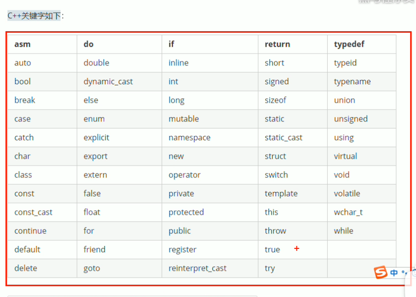


## 标识符命名规则
> 作用：c++规定，给标识符（变量，常量）命名时，有一套自己的规则（命名规则）
> 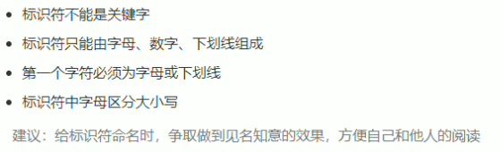


## 数据类型
>  数据类型存在意义： 给变量分配合适的内存空间
### 整形（short, int, long, long long）
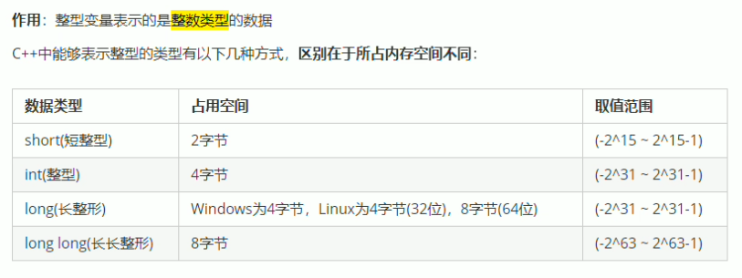

### sizeof 关键字

### 实型（浮点型）
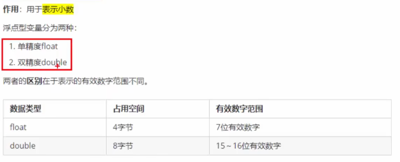
> 整数部分，和小数部分，都算有效数字，比如
>
> 3.14，是3位有效数字
>
> double比float更加精准一些

```c
float f1 = 3.14f;   //一般在float的值后面加一个f，表示float，如果不加，编译器会认为3.14是double类型
double f2 = 3.1415926;

// 注意，无论你赋值的小数有多少位，cout输出最多就只有6位有效数字
// 如果要多点有效数字，需要额外配置。
```
另外小数还有科学计数法的表示方法：
```c
float f2 = 3e2;
float f3 = 3e-2;
// 表示3*10^多少次方
```


### 字符型
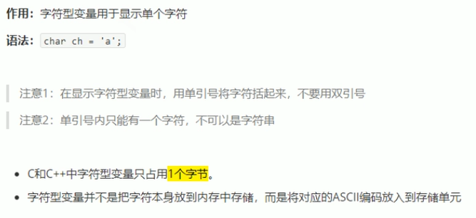

> 字符型变量 对应 ASCII 编码：
>
> a - 97
> A - 67
> ```c
>cout << (int)ch << endl;
> ```


### 转义字符


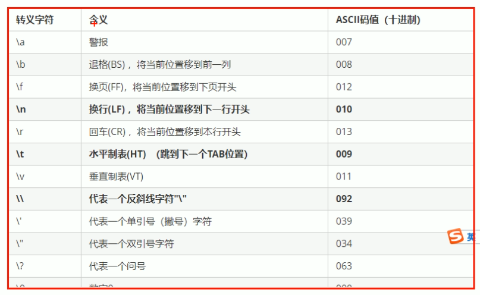


### 字符串型

>作用: 用于表示一串字符

**两种风格**
1. C风格字符串： `char 变量名[] = "xxxxx"`
2. C++风格字符串：  `string 变量名 = "xxxxxx"`
   1. 需要`#include<string>`


```c
char str1[] = "123456789";
```
> 注意：str1的占内存字节数为里面的字符数+1，因为还有一个\0，所以`sizeof(str1) = 10`


### 布尔类型bool
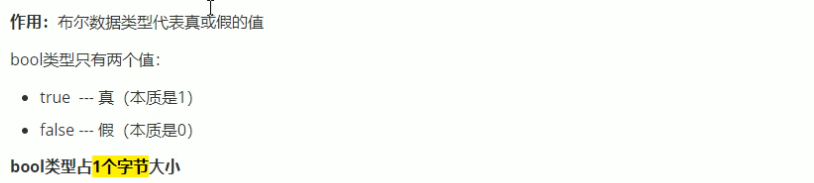


### 数据的输入
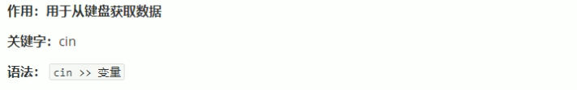
```c
	int a = 0;
	int b = 0;
	cin >> a>>b;
	cout << a <<endl<<b<< endl;

    //回车执行一次cin输入
```


## 运算符
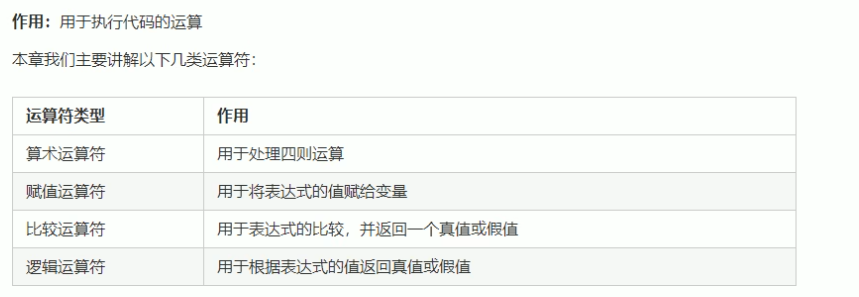
### 算数运算符
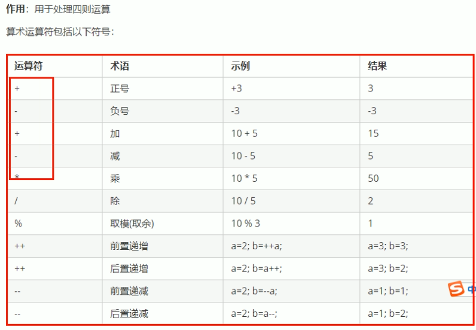
### 赋值运算符
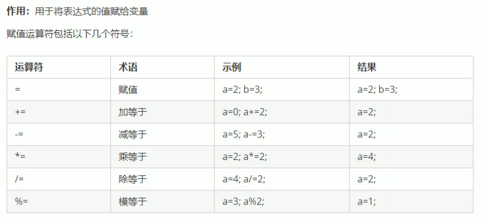
### 比较运算符
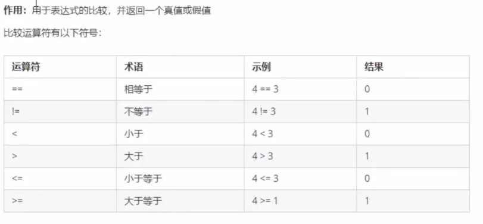
```c
	int a = 9;
	int b = 9;
	cout << (a == b) << endl;   //输出1， 表示条件真，满足
```

### 逻辑运算符
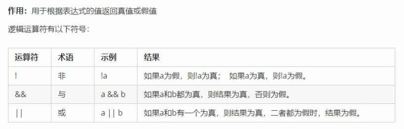


## 程序流程结构
- 顺序结构
- 选择结构
  - `if`
  - `switch(变量){case 1: xxx;break;}`
- 循环结构
  - `while(循环条件){}`
  - `do{循环语句} while(循环条件);`
  - for

- 跳转语句
  - break
  - continue
  - goto


## 数组
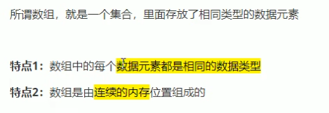
### 一维数组
#### 定义方式
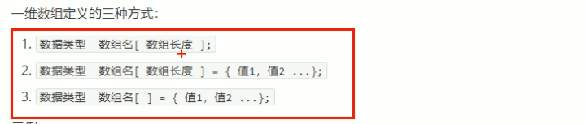
```c
	char str[4] = { 'a', 'b', 'c','\0'};
	cout << sizeof(str) << endl;        // 输出4
	cout << str << endl;                //输出abc
    //如果就定义str[3] = {'a', 'b', 'c'} sizeof输出还是3，但是cout<<str就是有乱码。
```

```c
	char str[4] = { 'a', 'b', 'c','\0'};
	cout << sizeof(str) << endl;
	cout << str << endl;

	char str2[] = { 'a', 'b', 'c' };
	cout << sizeof(str2) << endl;
	cout << str2 << endl;

	char str3[] = "abc";
	cout << sizeof(str3) << endl;
	cout << str3 << endl;

	int arr[] = { 1,2,3 };
	cout << sizeof(arr) << endl;
	cout << sizeof(arr) / sizeof(arr[0]) << endl;
	cout << arr << endl;
```
```c
4
abc
3
abc烫烫烫烫烫烫烫烫烫烫烫烫烫烫烫烫烫烫烫烫烫烫烫烫烫烫烫烫烫烫烫烫烫烫烫烫烫烫烫烫烫烫烫烫烫烫烫烫烫烫烫烫烫烫烫烫烫烫烫烫烫烫烫烫
4
abc
12
3
0000006BF9CFF798
```
> 注意，string是一个类，它不是单纯的字符数组，里面估计是有动态分配的，然后用指针，所以sizeof无论如何都是40


#### 数组名
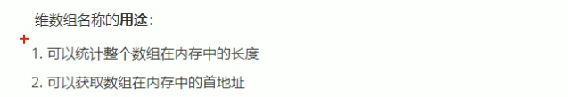
#### 冒泡排序
### 二维数组
#### 定义方式
> 二维数组，就是在一维数组上，多加一个维度。


#### 数组名
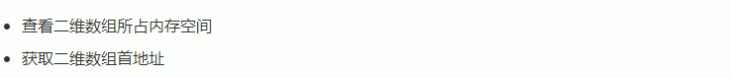
```c
	char str[][4] = { {'1', '2', 'c', '\0'},
					{'a', 'c', 'b', '\0'}};

	cout << sizeof(str) << endl;
	cout << (int)(str[0]) << endl;
	cout << (int)(str[1]) << endl;
```
```c
8
1200618424
1200618428
```

## 函数
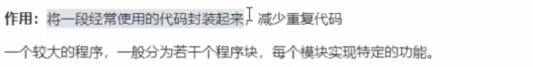

### 定义
函数的定义，分为5个步骤：
- 返回值类型
- 函数名
- 参数表列
- 函数体语句
- return 表达式
### 调用

### 值传递


### 函数常见样式

> 这里的返回，是指的返回值，不是LR的返回
### 函数声明

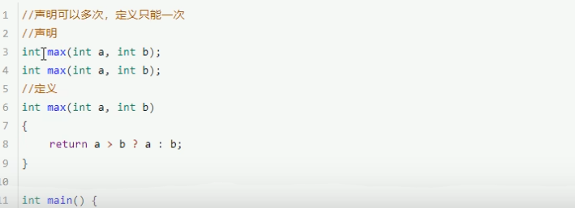
### 函数的分文件编写


## 指针

说白了，就是内存地址。
### 指针变量的定义和使用

### 指针所占内存空间
地址多少个字节，指针就是多少个字节
- 32位系统，指针就是4个字节
- 64位系统，指针就是8个字节
### 空指针，野指针
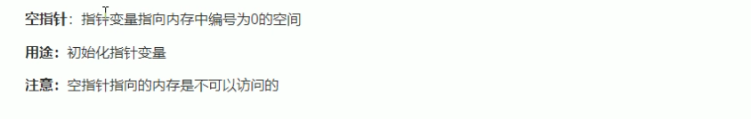
`int *p = NULL;`
- 但是这个是不能进行*访问的，因为0-255之间的内存地址，是系统占用的，无法访问
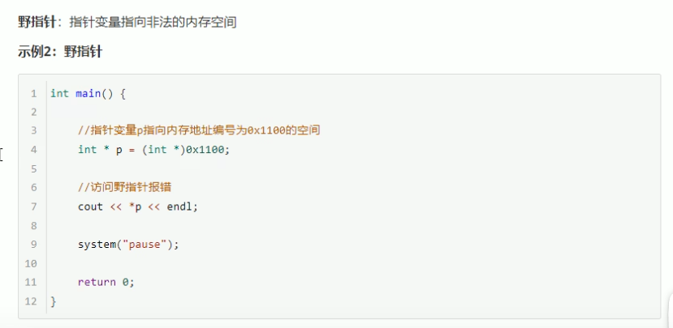

>  **总结**：空指针，野指针，都不是我们申请的空间，因此不要访问。


### const修饰指针
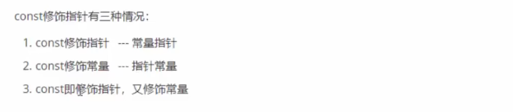

**1. const修饰指针：常量指针**
```c
const int * p = &a;     //常量指针，指针指向的地址，可以修改，但是指向的值不可以修改
//即p可以重定向，但是被指定的a不可以修改。
```
```c
	int a = 10;
	int b = 20;
	const int* p;
	p = &a;
	p = &b;
	cout << *p << endl;     //指针重定向ok

	b = 30;
	cout << *p << endl;     //目标内存变量修改ok

	*p = 40;                //无法通过指针取值来修改内存。说明要把const int结合起来看

```

**2. const修饰常量：指针常量**
```c
int * const p = &a;
```
```c
	int a = 10;
	int b = 20;
	//int* const p;         //p是指针，也是常量，说明指向的地址不变，所以必须赋初值

	int* const p = &a;      
	*p = 20;                //内存内容可修改
	cout << *p << endl; 

	//p = &b;               //无法重定向
```

**3. const既修饰指针，也修饰常量**
```c
const int * const p = &a;
```
> 既不可以重定向，也不可以通过指针改值


### 指针和数组
> 指针和数组的配合使用
> 
>


```c
	int arr[] = { 1,2,3,4,5,6,7,8,9,10 };
	int* p = arr;
	for (int i = 0; i < 10; i++) {
		cout << *p << endl;
		p++;        //p++, 自增的是指针指向的单个数据类型的字节数，int指针，就后移4字节。char指针，就后移1字节。
	}
```

### 指针和函数
> 这里主要讲的是指针作为参数传参
>
>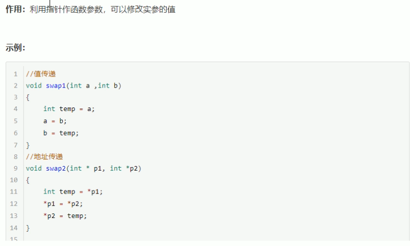
### 指针，数组，函数
这里就是上面两个的综合使用了。


## 结构体
结构体属于自定义的数据类型，允许用户存储不同的数据类型

### 定义和使用
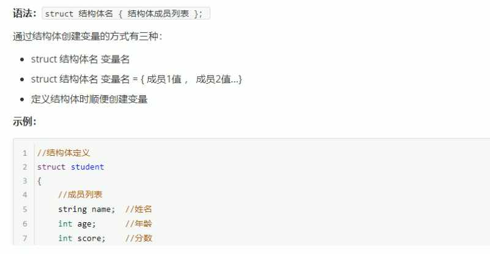

```c
struct student {
	string name;
	int age;
	int score;
} s3;	//第三种创建结构体变量

int main()
{
	//第一种创建结构体变量
	struct student s1;
	s1.age = 12;
	s1.name = "test";
	s1.score = 30;
	cout << "s1 = " << s1.name << s1.age << s1.score << endl;

	//第二种创建结构体变量
	struct student s2 = { "liangji", 12, 13 };
	cout << "s2 = " << s2.name << s2.age << s2.score << endl;

	
	return 0;
}
```
### 结构体数组
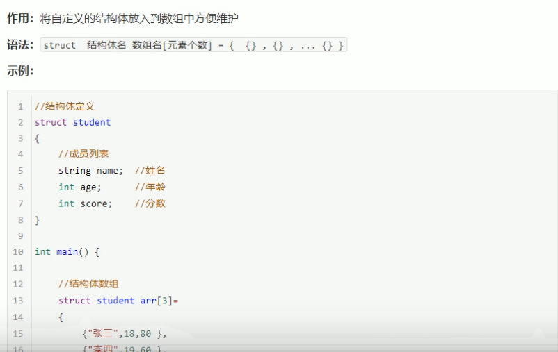


### 结构体指针
```c
struct student{
    //...
};

struct student * p = &s1;
```
### 结构体嵌套结构体
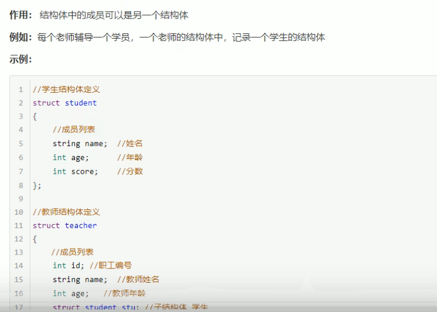

### 结构体大小
```c
struct student {};      //空结构体，占1字节

struct student {        //占1字节
	char name;
};

struct student {        //占2字节
	char name;
	char name2;
};

struct student {        //占4字节
	int a;
};

struct student {        //占8字节，因为4字节对齐。
	char b;
	int a;
};
```
### 结构体做函数参数

比较简单，没什么好说的
### 结构体中const使用场景
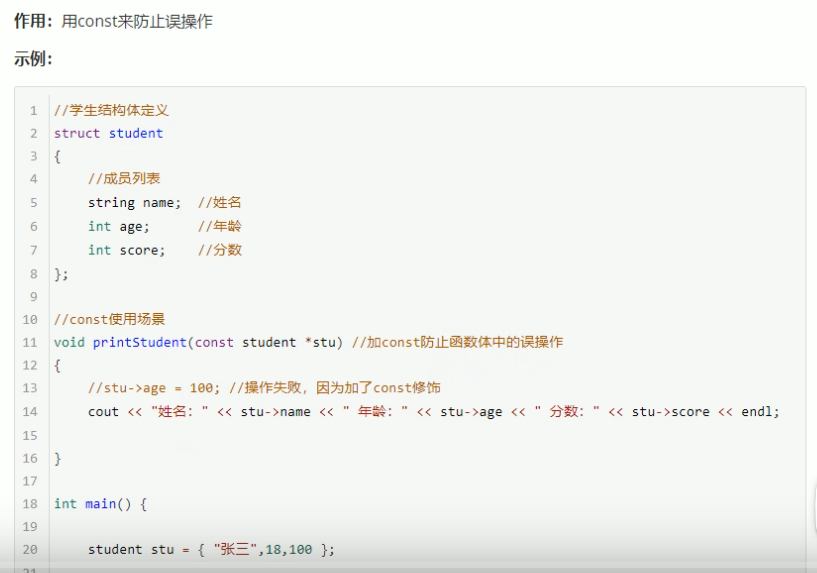

用常量指针，你无法通过函数传入的指针，来修改内存。好处是可以防止误操作

# 程序的内存模型

## 内存4区
和链接脚本里面的.text, .rodata, .data, .bss有什么关系？为什么有全局区？
```c
C++ 内存分区	    对应链接脚本段	            存放内容	                        生命周期
代码区	            .text	            函数体的二进制代码	                程序运行期间
全局区	        .data、.bss、.rodata	全局变量、静态变量、字符串常量等	    程序启动到结束
栈区	            栈段（Stack）	    函数参数、局部变量	                函数调用期间
堆区	            堆段（Heap）	        动态分配的内存（new/malloc）        	手动分配 / 释放
```


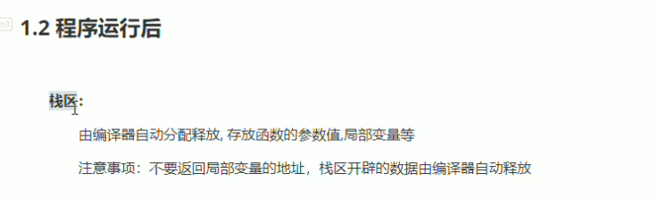
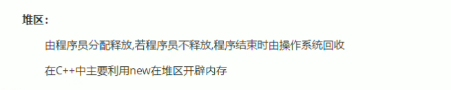
### 代码区
**.text**

### 全局区
**.rodata**
**.data**
**.bss**
> 全局变量，静态变量，
> 
> - 常量：
>   - 字符串常量：全局区
>   - const修饰全局变量：全局区
>   - const修饰局部变量：**栈区**
> 
### 栈区
**stack中**
> 局部变量，形参
### 堆区
**heap**
> 程序员自己申请，c++中，利用new，返回的是指针

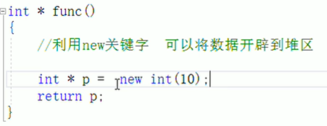

> p指针还是在栈中，因为是局部变量，但是里面的地址，指向的是堆区的int(10);


### **总结**


### new运算符
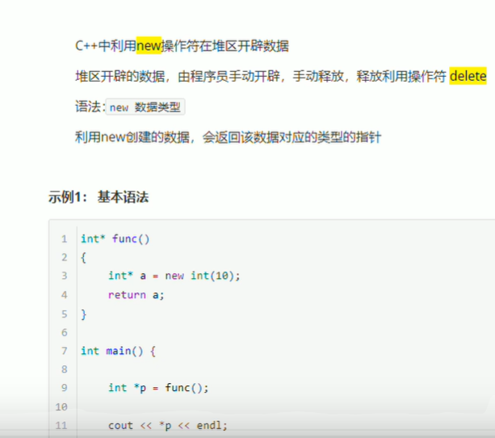

> 这里主要学习new的语法，以及在堆区开辟一个数组。

```c
//1. 在堆区创建整形数据
// new 返回是该数据类型的指针
int * p = new int(10);

// 如果想释放堆区的数据，利用关键字delete
delete p;


//2. 在堆区里面，开辟一个数组
int * arr = new int[10];	//10代表数组有10个元素
// arr就是栈中这个数组的数组名。

//释放堆区数组
delete[] arr;
```

## 引用
### 基本使用


```c
int a = 10;	//栈中4字节内存。

//现在想要换一个名称b，来操作这块内存。
//引用的本质：给变量（内存名称）起别名

int & b = a;

```


### 注意事项
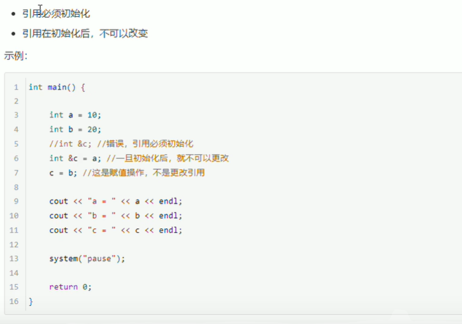

> 一上来就要告诉这个别名是谁的别名
> 一旦引用初始化后，就不可以改成别的变量的别名
### 引用做函数参数
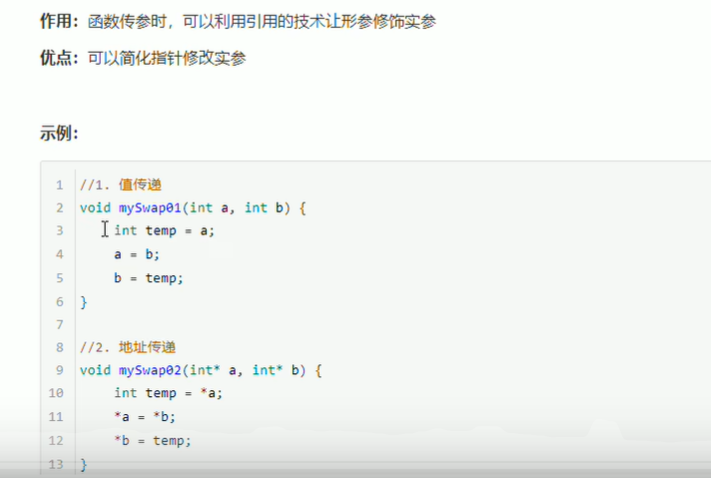

> 就是当指针来用，可以省掉指针的繁琐操作。
### 引用做函数返回值
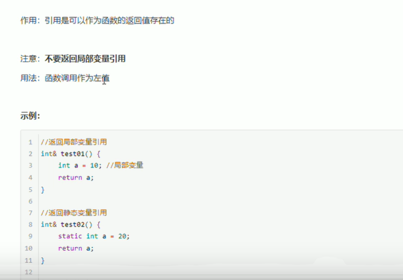

```c
int& func()
{
	int a = 10;
	return a;
}

int main()
{
	int& b = func();
	cout << b << endl;
	cout << b << endl;

	return 0;
}
```
> 返回的是局部变量的引用，所以，最终输出，只会有第一次是正确的，因为编译器会做保留，但是这个和版本有关，新版本里面，会一直做保留。
>
> 所以尽量不要让函数返回局部变量的引用。因为这块内存会被释放
>
> 正确的写法是下面这样。

```c
int& func()
{
	static int a = 10;	//全局区，不在栈中了，
	return a;
}

int main()
{
	int& b = func();
	cout << b << endl;
	cout << b << endl;

	return 0;
}
```

还有一种用法，是把`返回值为引用的函数`，作为左值，这样也能修改对应内存, 相当于省掉一个中间别名变量。
```c
int& func()
{
	static int a = 10;	//全局区，不在栈中了，
	return a;
}

int main()
{
	int& b = func();
	cout << b << endl;
	cout << b << endl;

	func() = 1000;
	cout << b << endl;


	return 0;
}
```

### 引用的本质
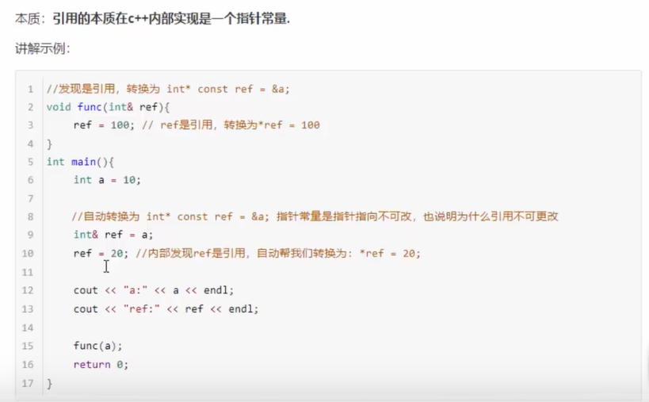
### 常量引用
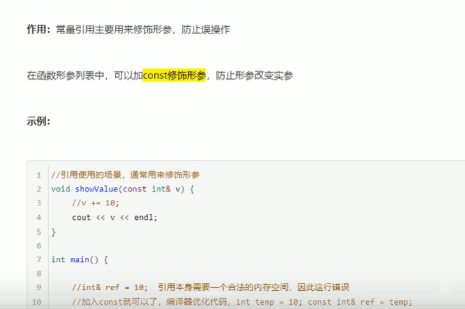
> 用来修饰函数的形参，防止误操作，就像常量指针一样，防止你修改

```c
	//int & b = 10;//错误，因为引用必须是一块合法的内存空间

	const int & b = 10;	//和前面的指针一样，要把const连起来看，const int， 所以对于b来说，这块内存是一个const int，但是实际是因为编译器做了优化，编译器操作： int temp = 10; const int & b = temp; 只是你看不到temp，对于b来说，temp这块内存是const，无法修改，但是还是栈区的。


	cout << b << endl;
```

```c
	void func(const int & temp)
	{
		//不允许修改temp别名指定的内存
	}

	int a = 10;
	func(a);
```


## 函数的提高
### 函数默认参数
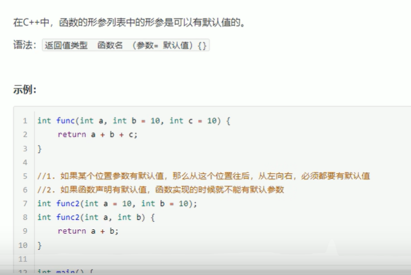
> 实验看下来，必须是靠左的优先判定缺省。
```c
void func(int a,int b = 20, int c = 30)
{
	cout << a + b + c << endl;
}

int main()
{
	func(2,2);


	return 0;
}
```


> **注意事项1**：如果某个位置已经有了默认参数，那么从这个位置往后，从左到右，都必须有默认值
>
> **注意事项2**：如果函数声明有默认参数，函数实现就不能有默认参数了。 声明和实现，只能有一个有默认参数


### 函数占位参数


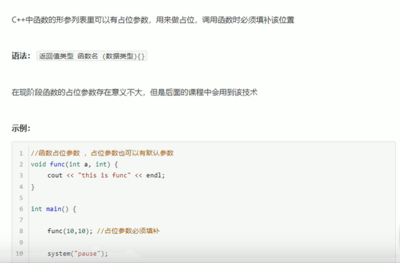

> 说白了，就是保留一个形参传参，但是函数里面还没有使用，就叫占位。
### 函数重载
#### 概述

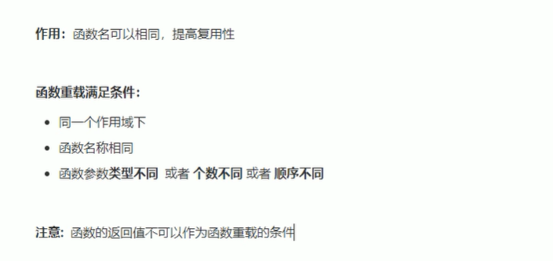
- 同作用域（你放在main外面，都是全局作用域）
- 同名函数
- 函数参数列表不同。（不包含返回值作为条件。）
#### 注意事项
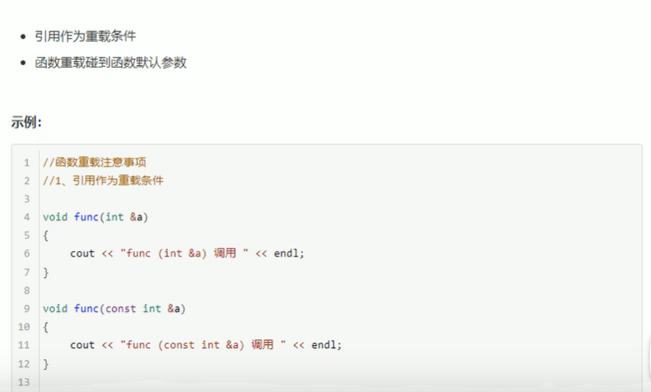
**1. 引用作为函数重载条件**
```c

void func(int & a)
{
	cout << "func1()" << endl;
}

void func(const int& a)
{
	cout << "func2()" << endl;
}

int main()
{

	int a = 10;
	func(a);//实际上两个都可以走，默认走简单的那一个

	func(10);//只能走const int & b 那一个
	return 0;
}
```
> 1. const修饰引用，也会发生函数参数列表不同，发生重载。
> 2. 传参调用哪一个：
> func(10), 如果是第一个函数，那么会发生：int & a = 10, 语法不通过
> 对于第二个函数，const int & a =10， 则可以通过，所以func(10)只会走const int & a的函数。
>
> 而对于func(a)，两个都可以，编译器默认走简单的。


**2. 函数重载碰到默认参数**
```c
void func(int a) {
	cout << "func1 " << a << endl;
}

void func(int a = 10)
{
	cout << "func2 " << a << endl;
}

int main()
{
	int a = 11;
	func(a);	//当函数重载，碰到默认参数，出现二义性，需要避免这种情况出现

	return 0;
}
```


# 类和对象
c++面向对象的三大特性：
- 封装
- 继承
- 多态

> c++认为万物皆可为对象，对象上有其属性和行为

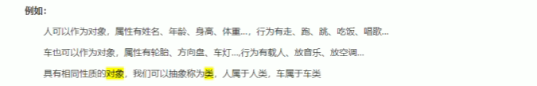

## 封装
### 为什么要封装
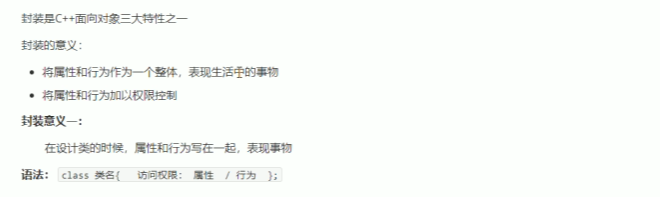
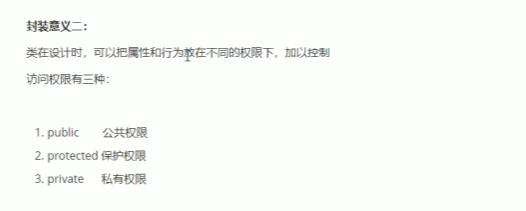
权限：
- public: 公共
  - 类内，类外都可以访问
- protected: 保护
  - 类内可以访问，类外不可以访问
  - >（和private的区别体现在继承上）
  - 子可以访问父
- private: 私有
  - 类内可以访问，类外不可以访问
  - 子不可以访问父

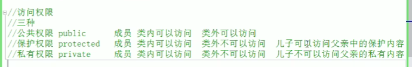
### struct和class区别
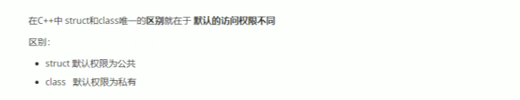
### 成员属性设置为私有
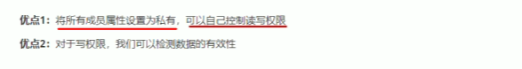
## 对象的初始化和清理
就是对象的出厂设置。
- 创建对象，希望他有一个自动初始化的动作
  - **构造函数**
- 释放对象，希望他有一个自动释放内部资源的动作
  - **析构函数**

### 构造函数和析构函数
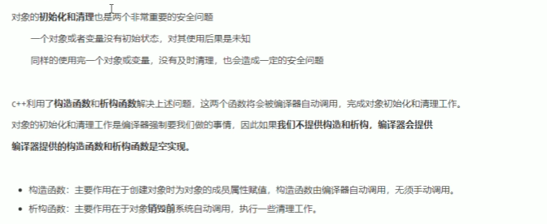

> 这两个函数是编译器自动调用的，来完成对象初始化和清理工作。
> 
> 就算我们不提供，编译器也会自动补充

**函数语法**

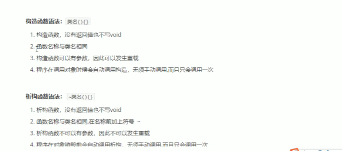

```c
class person {

public:
	person() {
		cout << "construct fun1" << endl;
	}

	~person() {
		cout << "destruct fun" << endl;
	}
};

int main()
{
	person p;	//在stack中
	
	return 0;
}
```

### 构造函数的分类及调用
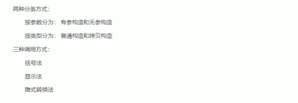

 **先说分类**
 ```c
 class person {

public:
//按参数分类
	//无参构造函数（默认构造函数）
	person()
	{
		//构造函数
	}

	//有参构造函数
	person(int a)
	{
		//构造函数
	}

//按类型分类
	//普通构造函数
	person(int a){
		//就是普通有参构造
	}

	//拷贝构造函数(不能改变传参，同时不能太耗资源)
	person(const person &p){
		this->age = p.age
	}

	~person()
	{
		//析构
	}

 };
 ```

 **调用**
 ```c
 //1. 括号调用
 person p;	//调用默认构造函数（想要调用默认构造，不能加空括号）
 //person p(); //编译器会认为他是一个函数声明
 person p2(10);	//调用有参构造（普通构造函数）
 person p3(p2); //调用拷贝构造函数


//2. 显示调用
person p1;
person p2 = person(10);//直接调用有参构造
person p3 = person(p1);//直接嗲用拷贝构造
//注意1：	=右侧叫做匿名对象，就是编译器自己创建的临时变量，在栈区
//注意2：	不要利用拷贝构造函数初始化匿名对象

//3. 隐式调用
person p4 = 10;	//相当于 person p4 = person(10)有参构造
person p4 = p5;	//相当于person p4 = person(p5)拷贝构造

 ```


### 拷贝构造函数调用时机

**什么时候会用到拷贝构造函数**
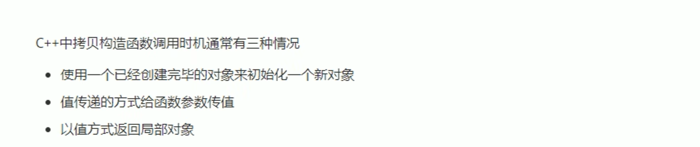

```c
//1. 已经创建的对象来初始化新对象
person p1(20);
person p2(p1);

//2. 值传递方式给函数传参
void dowork(person p){}

	//说白了就是实参传给形参，创建临时副本
person p;
dowork(p);


//3. 以值方式返回局部对象
void dowork(){person p1; return p1}
person p3 = dowork();
	//返回局部对象，相当于传值了。

```


### **构造函数 默认创建规则**

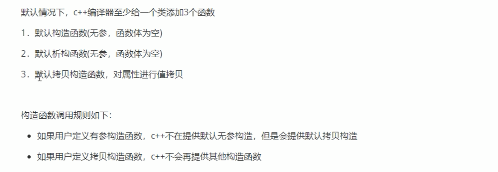


### 深拷贝与浅拷贝
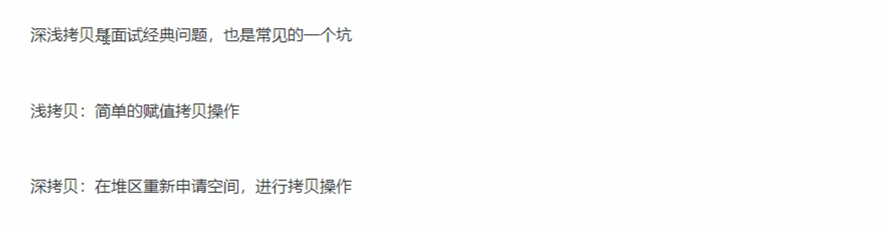
就是拷贝成员变量（指针，指向一段内存）

浅拷贝：只拷贝指针，实际还是指向同一块内存
深拷贝：不仅拷贝指针，同时也拷贝一块内存。
### 初始化列表
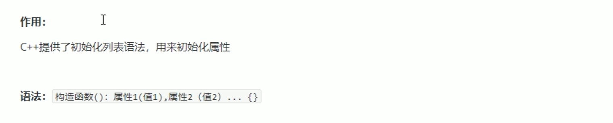

> 想要初始化对象，除了构造函数内部初始化，还有初始化列表的形式
```c
class person{

public:
	//无参构造，只有一种初始值，不够灵活
	person(): age(1), name("liangji") {

	}

	//有参构造+初始化列表
	person(int a, string b): age(a), name(b) {

	}
};
```


### 类对象作为成员变量
```c
class A{};
class B{
private:
	A;
};
```
> 当创建B对象的时候，现有B还是现有A，构造函数的先后顺序
> - A构造
> - B构造
> - B析构
> - A析构


### **静态成员 static xxx**
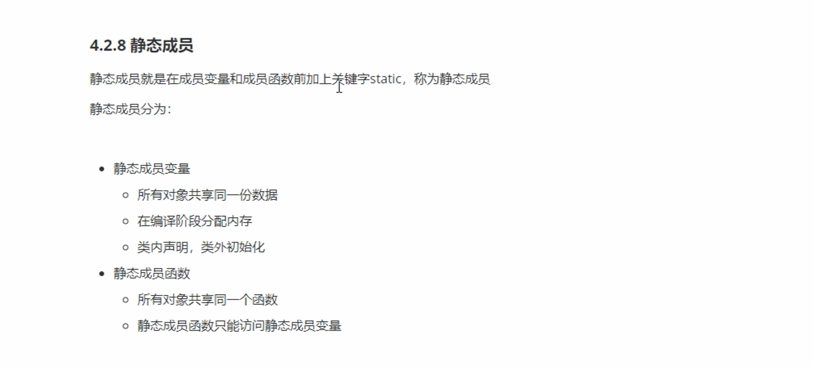
```c
class person{
public:
	//1. 编译阶段分配内存，所以在RW数据段
	//2. 所有对象共享同一份数据
	//3. 必须要类内声明+类外初始化，才能操作，此时仅类内声明
	//4. 可以直接通过类名访问该静态变量： person::a 即可访问。
	//5. 这个静态变量也是有访问权限的，private，类外就无权限访问
	static int a;

};

//3. 类外初始化， 这样之后，其他地方才能访问这个变量

int person::a = 1;
```

静态成员变量

静态成员函数（static 成员函数）是 C++ 面向对象编程中非常实用的特性，它的核心价值在于**不依赖对象**就能**访问类的静态资源**，同时能**封装和类相关、但和具体对象无关的逻辑**
```c
//所有的对象共享同一个函数
//只能访问静态成员变量
class person{
public：
	static void func(){
		a = 1;//仅能访问静态成员变量a，因为非静态的成员变量，你访问了不知道是哪个对象的非静态成员变量
	}

	static int a;
};

int person::a = 1;

person p;
//1. 通过对象进行访问
p.func();

//2. 直接通过类名来访问
person::func();
```


## c++对象模型和this指针
### 成员变量 和 成员函数 分开存储
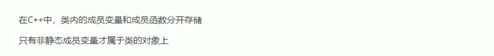

> 这里说的是类对象的内存分布，只有非静态成员变量，才是一个类对象上面（栈），静态成员变量在RW段，成员函数属于代码段

```c
class person{

}p;

//空对象，大小为1字节
//c++编译器，给每个空对象，也分配1byte空间，是为了区分空对象占内存的位置（相当于实际分配一个最小的内存空间，表示实际存在的对象）
sizeof(p) == 1
```

```c
class person {
	int a;
}p;

//已经不是空的了，那么就按成员变量大小分配内存
sizeof(p) == 4;
```

```c
class person{
	static int b;
}p;
int person::b =10;

//因为静态成员变量不属于类对象
sizeof(p) == 1;
```
```c
class person{
	void func(){};
}p;

//非静态成员函数，他和成员变量是分开存储的，不是存在类对象的内存上， 
sizeof(p) == 1;
```
```c
class person{
	static void func(){};
}p;

//静态成员变量，也不在对象内存上
sizeof(p) == 1;

```


### this指针概念
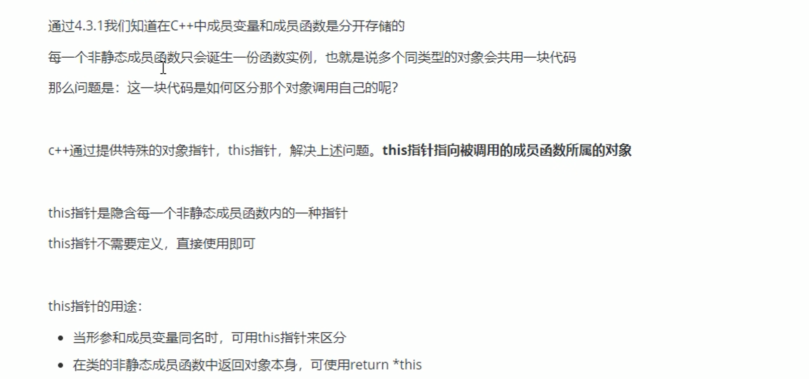
**this指针，指向对象的那一块内存的指针**

- 非静态成员函数，存储在代码段，通过this来区分是谁来调用这一块的代码，

- 静态成员函数，不属于任何对象。用不了this

用处之一就是链式编程思想
```c
class person{
public:
	int a;

	//注意，返回引用，不然一直返回的都是临时变量，需要占用栈区，开销大
	person& add(const person & b){
		return *this;
	}
};

person p1(10);
person p2(10);

//链式编程思想
person p3 = p2.add(p1).add(p1).add(p1);
```

### 空指针访问成员函数
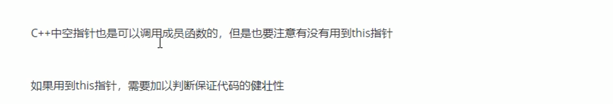
```c
class person{
public:
	void func(){
		//不含this，进不相干逻辑
	};

	void func2(){
		//需要提高健壮性：
		if(this == NULL)
		{
			return;
		}
		//含this，内部成员变量
	}
};

person* p = NULL;
p->func();	//仅能调用不含this的, 成员变量的，因为没有实际对象内存


```

### const修饰成员函数

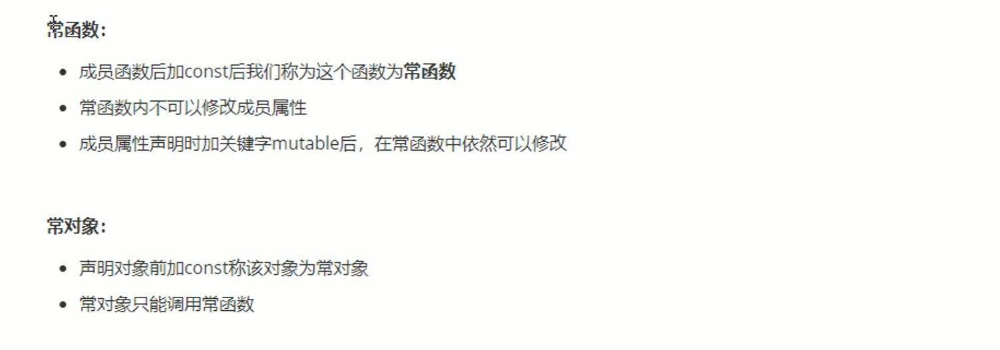

- 常函数
  - 成员函数后面+ const，表示不能修改成员变量
  - 如果在还要修改，只能在成员变量前面+mutable（表示常函数也能修改）
- 常对象
  - const + 声明对象（类对象）
  - 常对象只能调用常函数

**常函数**
```c
class person{
public:
	int a;
	mutable int b;
	void func1(){
		//修改成员变量
	}

	void func2() const {
		//不可以修改成员变量a

		//任何成员函数内部都有this指针，本质是指针常量（person * const this, 不可以重定向，但是可以改值，常函数+const后，变成const person * const this）

		//但是可以修改成员变量b,因为有mutable
	}

};
```

**常对象**
```c
const person p;		//常对象，不可以修改p内部普通成员变量，但是同样可以修改mutable的成员变量

p.b = 10;		//mutable int b;

p.func1();		//常对象不能调用普通成员函数，因为会修改成员变量
p.func2();		//常对象只能调用常函数
```
## 友元
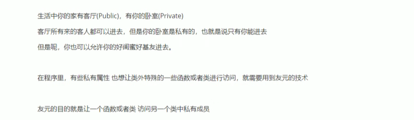
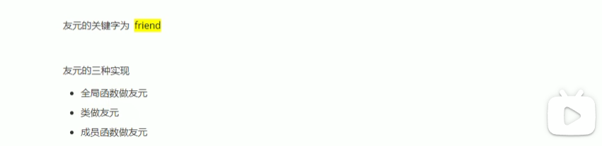

> 说白了，友元，就是在类的私有域里面，事先声明好谁还有权限来访问

**1. 全局函数做友元**
```c
class person {

	//1. 类内声明全局函数为友元
	friend void goodgay(person * p);

private:
	int a;
public:
	int b;
};

//1. 全局函数做友元
void goodgay(person * p){
	cout << p->a << endl;
}


//测试
person p;
goodgay(&p);
```

2. 类做友元
> B 类声明为 A 类友元，B 类可直接访问 A 类的私有成员
```c
#include <iostream>
using namespace std;

// 提前声明友元类
class FriendClass;

// 被访问的类
class MyClass {
	// 声明FriendClass为友元类
    friend class FriendClass;
private:
    int private_num = 99;  // 私有成员

};

// 友元类
class FriendClass {
public:
    void accessPrivate(MyClass& obj) {
        // 直接访问MyClass的私有成员
        cout << "访问到私有成员：" << obj.private_num << endl;
    }
};

int main() {
    MyClass mc;
    FriendClass fc;
    fc.accessPrivate(mc);  // 调用友元类的函数访问私有成员
    return 0;
}
```

3. 成员函数做友元
> 只允许指定的某个成员函数访问私有成员，而非整个类的所有函数
>
> **核心：只声明FriendClass的accessPrivate函数为友元**
```c
#include <iostream>
using namespace std;

// 1. 提前声明被访问的类（因为FriendClass里要用到它）
class MyClass;

// 2. 声明友元类（因为要指定它的成员函数为友元）
class FriendClass {
public:
    // 先声明成员函数（函数体后面写，避免未定义MyClass）
    void accessPrivate(MyClass& obj); 
};

// 3. 被访问的类（拥有私有成员）
class MyClass {
private:
    int private_num = 88;
    
    // 核心：只声明FriendClass的accessPrivate函数为友元
    friend void FriendClass::accessPrivate(MyClass& obj);
};

// 4. 定义友元类的成员函数（此时MyClass已完整定义，可访问其成员）
void FriendClass::accessPrivate(MyClass& obj) {
    // 只有这个函数能访问MyClass的私有成员
    cout << "成员函数访问私有成员：" << obj.private_num << endl;
}

// 测试
int main() {
    MyClass mc;
    FriendClass fc;
    fc.accessPrivate(mc); // 输出：成员函数访问私有成员：88
    return 0;
}
```


## 运算符重载
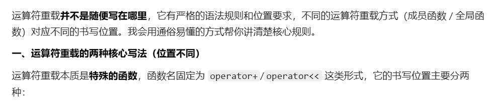
主要有两个地方：
- 作为类的成员函数（写在类内部）
  - 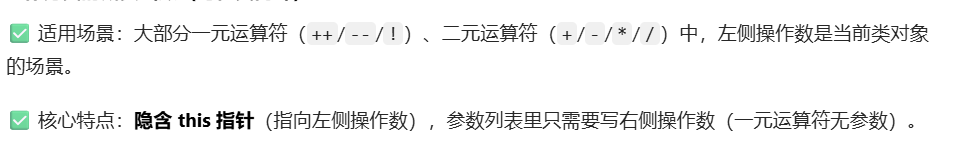
- 作为全局函数（写在类外部，通常需要友元）
  - 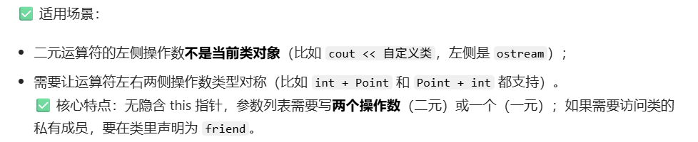


### + 重载
> 核心：实现**两个自定义对象的加法**，通常用成员函数或全局友元函数实现
```c
class Point {
public:
    int x, y;
    Point(int x=0, int y=0) : x(x), y(y) {}
    
    // 成员函数重载 +
    Point operator+(const Point& other) {
        return Point(x + other.x, y + other.y);
    }
};

int main() {
    Point a(1,2), b(3,4);
    Point c = a + b; // 等价于 a.operator+(b)
    cout << c.x << "," << c.y << endl; // 输出 4,6
    return 0;
}
```

### << 左移运算符 重载
> 核心：用于**自定义对象的cout输出**，必须是**全局友元函数**（因为左操作数是ostream）
```c
class Point {
public:
    int x, y;
    Point(int x=0, int y=0) : x(x), y(y) {}
    
    // 声明为友元，以便访问私有成员
    friend ostream& operator<<(ostream& os, const Point& p);
};

// 全局函数重载 <<
ostream& operator<<(ostream& os, const Point& p) {
    os << "(" << p.x << "," << p.y << ")";
    return os; // 支持链式调用
}

int main() {
    Point p(2,3);
    cout << p << endl; // 输出 (2,3)
    return 0;
}
```

### ++ 递增运算符 重载
> 核心：区分前置 ++（返回引用）和后置 ++（返回值，用int占位）
```c
class Counter {
public:
    int n;
    Counter(int n=0) : n(n) {}
    
    // 前置++：返回引用
    Counter& operator++() {
        ++n;
        return *this;
    }
    
    // 后置++：返回旧值，int参数仅作区分
    Counter operator++(int) {
        Counter temp = *this;
        ++n;
        return temp;
    }
};

int main() {
    Counter c(5);
    cout << (c++).n << endl; // 输出 5（后置先返回旧值）
    cout << (++c).n << endl; // 输出 7（前置先自增）
    return 0;
}
```

### = 赋值运算符 重载
> 核心：默认浅拷贝可能导致内存泄漏 / 重复释放，需手动实现深拷贝（这里用简单示例演示语法）
```c
class Data {
public:
    int* p;
    Data(int val) { p = new int(val); }
    ~Data() { delete p; }
    
    // 重载赋值运算符
    Data& operator=(const Data& other) {
        if (this == &other) return *this; // 防止自赋值
        delete p; // 释放旧内存
        p = new int(*other.p); // 深拷贝
        return *this;
    }
};

int main() {
    Data a(10), b(20);
    a = b; // 调用 operator=
    cout << *a.p << endl; // 输出 20
    return 0;
}
```

### 关系运算符 == < > 重载
> 核心：返回bool，用于对象之间的比较
```c
class Point {
public:
    int x, y;
    Point(int x=0, int y=0) : x(x), y(y) {}
    
    // 重载 ==
    bool operator==(const Point& other) {
        return x == other.x && y == other.y;
    }
    
    // 重载 <
    bool operator<(const Point& other) {
        return x < other.x || (x == other.x && y < other.y);
    }
};

int main() {
    Point a(1,2), b(1,2), c(2,3);
    cout << (a == b) << endl; // 输出 1（true）
    cout << (a < c) << endl;  // 输出 1（true）
    return 0;
}
```

### () 函数调用运算符 重载
> 核心：让类对象可以像函数一样调用，也叫仿函数
```c
class Add {
public:
    // 重载 ()，让对象像函数一样使用
    int operator()(int a, int b) {
        return a + b;
    }
};

int main() {
    Add add;
    int res = add(3, 5); // 等价于 add.operator()(3,5)
    cout << res << endl; // 输出 8
    return 0;
}
```

## 继承
### 基本语法
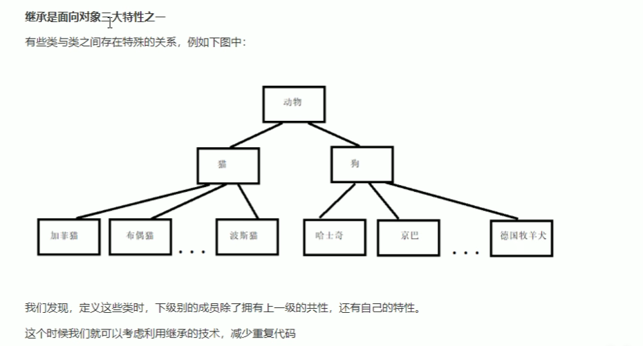

```c
class Base {
public:
    int m_A;
protected:
    int m_B;
private:
    int m_C;
};

// 派生类 Son 公共继承 Base
class Son : public Base {
public:
    int m_D;
};
```

```c
class 派生类 : 继承方式 基类1, 继承方式 基类2, ... {
    // 新增成员
};
```

### 继承的3种方式
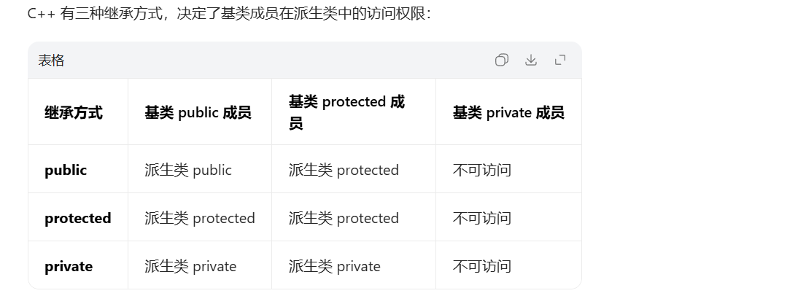

```c
class Base {
public:
    int pub;
protected:
    int pro;
private:
    int pri;
};

// 公共继承
class PublicDerived : public Base {
    void func() {
        pub = 1;  // 可访问（public）
        pro = 2;  // 可访问（protected）
        // pri = 3; // 不可访问
    }
};

// 保护继承
class ProtectedDerived : protected Base {
    void func() {
        pub = 1;  // 变为 protected
        pro = 2;  // 变为 protected
        // pri = 3; // 不可访问
    }
};

// 私有继承
class PrivateDerived : private Base {
    void func() {
        pub = 1;  // 变为 private
        pro = 2;  // 变为 private
        // pri = 3; // 不可访问
    }
};
```
### 继承中的对象模型
派生类对象会完整包含基类的成员变量，并在内存中按 “基类部分 → 派生类部分” 的顺序排列。

```c
class Base {
public:
    int m_A;
};

class Son : public Base {
public:
    int m_B;
};

int main() {
    Son s;
    s.m_A = 10;  // 继承自 Base
    s.m_B = 20;  // 自身成员
    // 内存布局：[m_A][m_B]
    return 0;
}
```
### 继承中构造和析构顺序
- 构造顺序：先调用基类构造函数，再调用派生类构造函数
- 析构顺序：先调用派生类析构函数，再调用基类析构函数（与构造顺序相反）

```c
class Base {
public:
    Base() { cout << "Base 构造" << endl; }
    ~Base() { cout << "Base 析构" << endl; }
};

class Son : public Base {
public:
    Son() { cout << "Son 构造" << endl; }
    ~Son() { cout << "Son 析构" << endl; }
};

int main() {
    Son s;
    // 输出：
    // Base 构造
    // Son 构造
    // Son 析构
    // Base 析构
    return 0;
}
```

若基类有带参构造函数，派生类必须在初始化列表中显式调用基类构造：

```c
class Base {
public:
    Base(int a) : m_A(a) {}
private:
    int m_A;
};

class Son : public Base {
public:
    // 显式调用基类带参构造
    Son(int a, int b) : Base(a), m_B(b) {}
private:
    int m_B;
};
```
### 继承同名成员处理方式

当派生类与基类有同名成员时，默认访问派生类成员；若要访问基类成员，需加基类作用域 Base::

```c
class Base {
public:
    int m_A = 10;
};

class Son : public Base {
public:
    int m_A = 20;
    void func() {
        cout << m_A << endl;       // 输出 20（派生类）
        cout << Base::m_A << endl; // 输出 10（基类）
    }
};
```

```c
class Base {
public:
    void func() { cout << "Base::func()" << endl; }
};

class Son : public Base {
public:
    void func() { cout << "Son::func()" << endl; }
    void callBaseFunc() {
        func();                // 调用 Son::func()
        Base::func();          // 调用 Base::func()
    }
};
```

> 注意：派生类的同名函数会隐藏基类的所有同名函数（包括重载版本），若想继承基类重载函数，可使用 using Base::func; 声明
### 继承同名静态成员处理方式
静态成员的处理与非静态成员类似，只是访问方式多了类名访问：


### 多继承语法（一子多父）
一个子类，同时继承多个父类
```c
class 派生类 : 继承方式 基类1, 继承方式 基类2, ... { ... };
```

```c
class Base1 {
public:
    int m_A = 10;
};

class Base2 {
public:
    int m_B = 20;
};

class Son : public Base1, public Base2 {
public:
    int m_C = 30;
};

int main() {
    Son s;
    cout << s.m_A << endl; // 10（来自 Base1）
    cout << s.m_B << endl; // 20（来自 Base2）
    cout << s.m_C << endl; // 30（自身）
    return 0;
}
```
**多继承可能导致成员名冲突，需用 Base1::m_A 明确指定**

### 菱形继承（虚继承）

菱形继承指：**两个派生类继承同一个基类**，又有**一个类同时继承这两个派生类**，导致基类成员被重复继承，**引发数据冗余与二义性**
```c
class Animal {
public:
    int m_Age;
};

// 羊类
class Sheep : public Animal {};
// 驼类
class Tuo : public Animal {};
// 羊驼类（继承 Sheep 和 Tuo）
class SheepTuo : public Sheep, public Tuo {};

int main() {
    SheepTuo st;
    st.Sheep::m_Age = 10;
    st.Tuo::m_Age = 20;
    // 存在两份 m_Age，数据冗余
    return 0;
}
```

**解决方案：虚继承**

使用 virtual 关键字修饰继承，使基类变为虚基类，只保留一份成员：
```c
class Animal {
public:
    int m_Age;
};

// 虚继承
class Sheep : virtual public Animal {};
class Tuo : virtual public Animal {};

class SheepTuo : public Sheep, public Tuo {};

int main() {
    SheepTuo st;
    st.m_Age = 10; // 只有一份 m_Age
    cout << st.m_Age << endl; // 输出 10
    return 0;
}
```

## 多态
多态是面向对象编程的**核心特性**之一，核心思想是“**同一接口，多种实现**”，即**基类指针** / 引用可以根据实际**指向的派生类对象**，**调用对应的函数实现**。

### 多态的基本概念
**多态的分类**
- **静态多态（编译期多态）**：函数重载、运算符重载，在编译阶段确定函数地址。
- **动态多态（运行期多态）**：通过虚函数实现，在运行阶段根据对象实际类型确定函数地址。

**动态多态的满足条件**
- **继承关系**：必须存在基类与派生类。
- **虚函数重写**：派生类重写基类的虚函数（函数名、参数列表、返回值类型完全一致，C++11 后协变返回类型也允许）。
- **基类指针** / **引用调用**：通过基类指针或引用调用虚函数。

> 核心就是靠基类指针，来指向子类对象，然后调用基类虚函数，来实际运行子类的实现方法，实际运行中，这样就实现了靠**指针指谁用谁**，接口不变，**龙生九子，各有不同，但接口名称一样，指针指谁用谁**

```c
class Base {
public:
    // 虚函数：virtual 关键字修饰
    virtual void func() { cout << "Base::func()" << endl; }
};

class Derived : public Base {
public:
    // 重写基类虚函数（override显式标记）
    void func() override { cout << "Derived::func()" << endl; }
};

int main() {
    Base* p = new Derived();
    p->func(); // 运行时绑定，调用 Derived::func()
    delete p;
    return 0;
}
```


> 人的工作视角就是基类，因为我只关心基类这个东西，子类只是用来实现一些方法的。比如我的一个解法，**我就可以自己写一个子类，然后重写里面的solution()方法**。这样就可以通过基类指针来选择调用我的子类实现。

```c
#include <iostream>
using namespace std;

class base {
protected:
	int a;
	int b;
public:
	base(int x, int y) :a(x), b(y) {
		cout << "base construction" << endl;
	}

	virtual ~base() {
		cout << "base析构" << endl;
	}

	virtual void cal() {
		cout << "a = " << a << " b = " << b << endl;
		cout << "this is base, not real calculator" << endl;
	}
};

class add_cal : public base{
public:
	add_cal(int x, int y) : base(x, y) {
		cout << "add_cal construction" << endl;
	}

	~add_cal() override {
		cout << "add_cal 析构" << endl;
	}

	void cal() override {
		cout << "a + b = " << a + b << endl;
	}
};

class mul_cal : public base {
public:
	mul_cal(int x, int y) : base(x, y) {
		cout << "mul_cal construction" << endl;
	}

	~mul_cal() override {
		cout << "mul_cal 析构" << endl;
	}


	void cal() override {
		cout << "a * b = " << a * b << endl;
	}
};


int main()
{
	base* p = new add_cal(1, 2);
	p->cal();
	delete p;

	p = new mul_cal(2, 3);
	p->cal();
	delete p;

	return 0;
}
```


### 纯虚函数 和 抽象类  (开始定义**接口类**了)
**纯虚函数**：
- 语法：virtual 返回值类型 函数名(参数列表) = 0;
- 特点：**没有函数体，必须在派生类中重写**，否则派生类也为抽象类。

**抽象类**
- 包含至少一个纯虚函数的类称为抽象类。
- 特点：**无法实例化对象**，只能作为接口被继承，强制派生类实现纯虚函数

> 说白了，**抽象类**彻底变成一个**接口类**

```c
// 抽象类
class AbstractClass {
public:
    // 纯虚函数
    virtual void pureFunc() = 0;
    // 普通虚函数
    virtual void normalFunc() { cout << "Base normalFunc()" << endl; }
};

// 派生类必须实现纯虚函数
class ConcreteClass : public AbstractClass {
public:
    void pureFunc() override {
        cout << "ConcreteClass pureFunc()" << endl;
    }
};

int main() {
    // AbstractClass a; // 错误！抽象类不能实例化
    AbstractClass* p = new ConcreteClass();
    p->pureFunc(); // 调用派生类实现
    p->normalFunc(); // 调用基类实现
    delete p;
    return 0;
}
```


### 虚析构和纯虚析构
> 这里说白了就是，必须强制让基类指针指向的子类对象释放的时候，强制调用子类实现的析构函数，不然会自动调用基类的析构函数（因为是基类指针）
> 
> （virtual只是一个重定向的过程。）
>
> **基类**，定义基本的抽象的接口需要的功能，虚函数virtual来让基类指针自动重定向内部函数的调用。（linux的gpio子系统）
> 
> **子类A**，是A实现的接口，A厂的原厂驱动实现
> **子类B**，B厂的原厂驱动实现

在多态场景下，**基类指针指向派生类对象时**，若基类析构函数不是虚函数，会导致**派生类对象无法被正确释放**，造成内存泄漏。

**虚析构函数**
- 语法：virtual ~类名() {}
- 作用：保证基类指针删除时，能正确调用派生类析构函数。
纯虚析构函数
- 语法：virtual ~类名() = 0;
- 特点：必须在类外提供实现，否则链接错误；包含**纯虚析构的类也是抽象类**

```c
class Base {
public:
    Base() { cout << "Base 构造" << endl; }
    // 虚析构函数
    virtual ~Base() { cout << "Base 析构" << endl; }
};

class Derived : public Base {
public:
    Derived() { cout << "Derived 构造" << endl; }
    ~Derived() override { cout << "Derived 析构" << endl; }
};

int main() {
    Base* p = new Derived();
    delete p; // 先调用 Derived 析构，再调用 Base 析构
    return 0;
}
```

> 纯虚析构函数注意事项

```c
class AbstractBase {
public:
    virtual ~AbstractBase() = 0;
};
// 纯虚析构必须在类外实现
AbstractBase::~AbstractBase() {}
```

## c++文件操作
C++ 通过**文件流类**（fstream 家族）实现文件读写，文件分为**文本文件**和**二进制文件**两种类型

### 文本文件
文本文件以字符形式存储数据，**人类可读**，适合存储字符串、数字等文本内容

```c
#include <fstream>  // 文件流类
#include <iostream>
using namespace std;
```

#### 写文件
**步骤：**
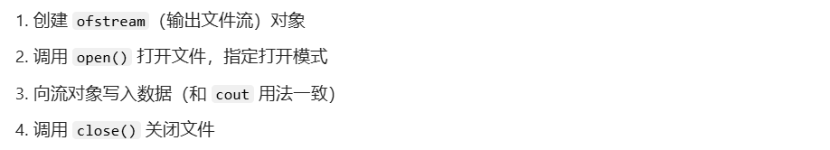
```c
#include <fstream>
using namespace std;

int main() {
    // 1. 创建输出流对象
    ofstream ofs;
    // 2. 打开文件：ios::out 表示写模式，文件不存在则创建，存在则清空
    ofs.open("test.txt", ios::out);
    // 3. 写入数据
    ofs << "姓名：张三" << endl;
    ofs << "年龄：18" << endl;
    ofs << "性别：男" << endl;
    // 4. 关闭文件
    ofs.close();
    return 0;
}
```

**文件打开模式：**
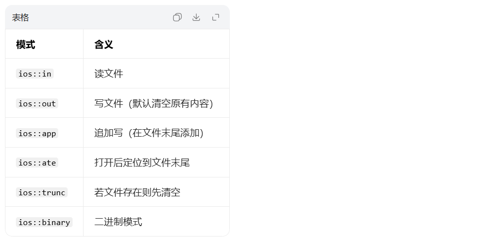

#### 读文件
**步骤：**
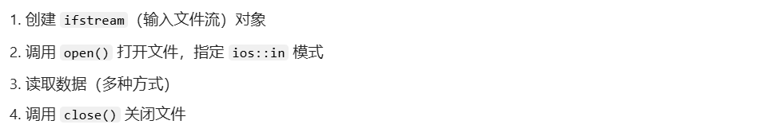

```c
#include <fstream>
#include <string>
using namespace std;

int main() {
    ifstream ifs;
    ifs.open("test.txt", ios::in);
    // 判断是否打开成功
    if (!ifs.is_open()) {
        cout << "文件打开失败！" << endl;
        return 1;
    }

    // 方式1：逐字符读取
    char c;
    while ((c = ifs.get()) != EOF) {  // EOF 表示文件结束
        cout << c;
    }

    // 方式2：逐行读取（推荐）
    char buf[1024] = {0};
    while (ifs.getline(buf, sizeof(buf))) {
        cout << buf << endl;
    }

    // 方式3：逐行读取（string 版）
    string line;
    while (getline(ifs, line)) {
        cout << line << endl;
    }

    // 方式4：一次性读取到缓冲区（不推荐大文件）
    char buf2[1024] = {0};
    ifs.read(buf2, sizeof(buf2));
    cout << buf2 << endl;

    ifs.close();
    return 0;
}
```

### 二进制文件
**二进制文件**以**字节**形式存储数据，**不可直接阅读**，适合存储自定义数据类型（如类、结构体），读写速度更快、数据更紧凑。

#### 写二进制文件

```c
#include <fstream>
using namespace std;

class Person {
public:
    char m_Name[64];
    int m_Age;
};

int main() {
    ofstream ofs;
    ofs.open("person.bin", ios::out | ios::binary);
    Person p = {"张三", 18};
    // 写入二进制数据：(const char*)&p 是数据地址，sizeof(p) 是数据大小
    ofs.write((const char*)&p, sizeof(p));
    ofs.close();
    return 0;
}
```

#### 读二进制文件


```c
#include <fstream>
using namespace std;

class Person {
public:
    char m_Name[64];
    int m_Age;
};

int main() {
    ifstream ifs;
    ifs.open("person.bin", ios::in | ios::binary);
    if (!ifs.is_open()) {
        cout << "文件打开失败！" << endl;
        return 1;
    }
    Person p;
    ifs.read((char*)&p, sizeof(p));
    cout << "姓名：" << p.m_Name << " 年龄：" << p.m_Age << endl;
    ifs.close();
    return 0;
}
```

### 总结

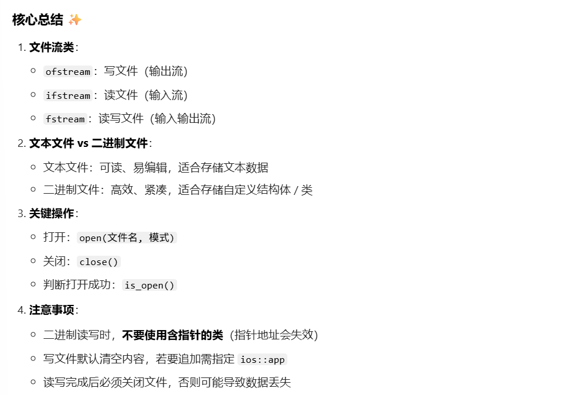

> 辨析
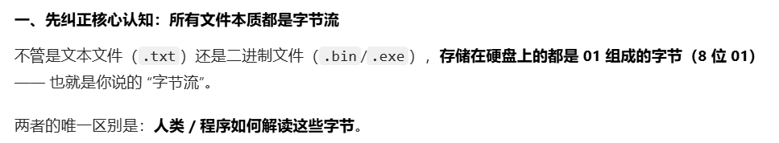
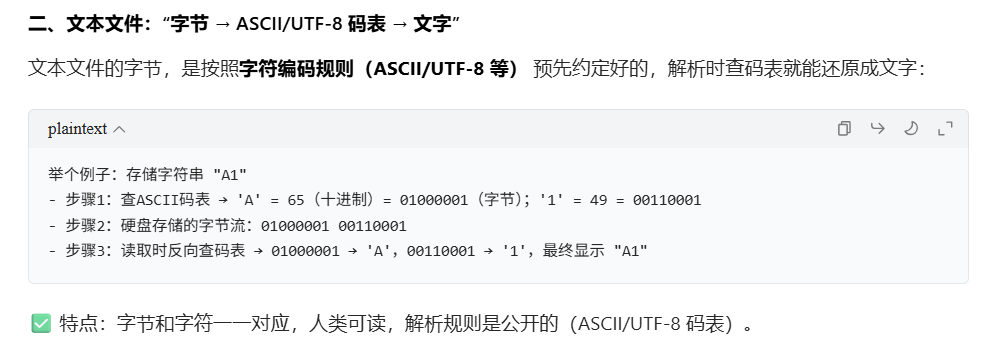
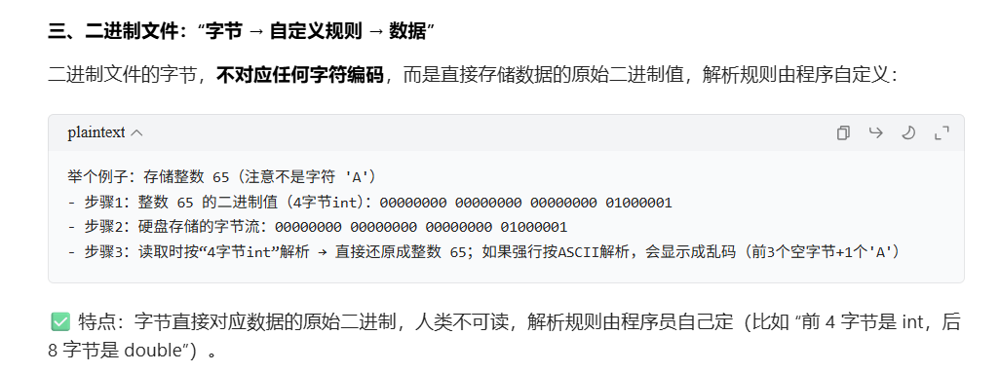
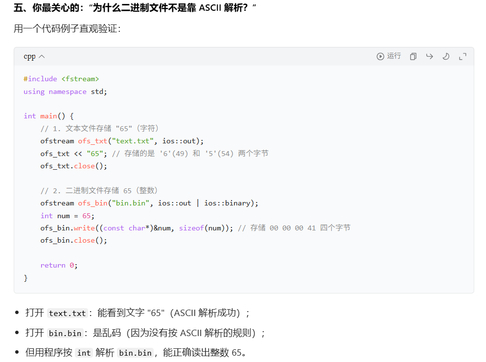


## 模板 （泛型编程）
模板是 C++ 实现**泛型编程**的核心机制，核心思想是“**一套代码，多种数据类型**”，通过**参数化类型**实现代码复用，避免为每种类型重复编写逻辑

### 模板的概念
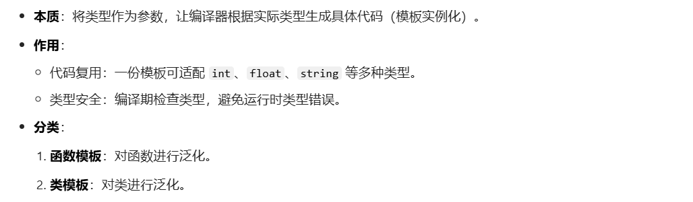
### 函数模板
#### 基本语法
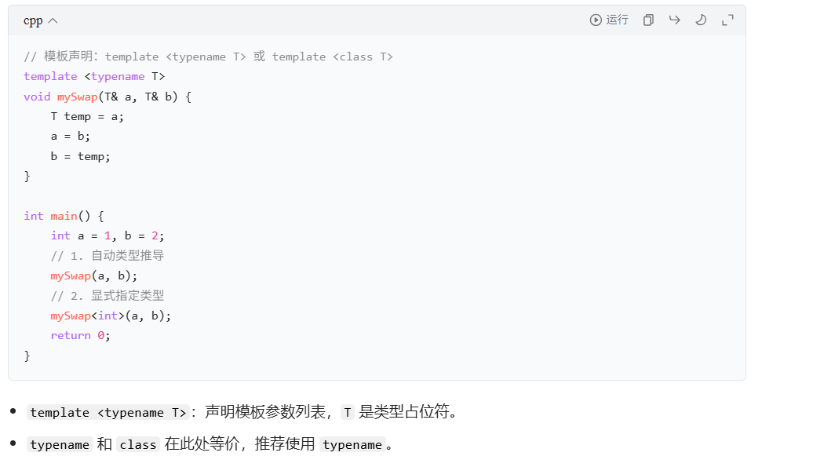

#### 注意事项
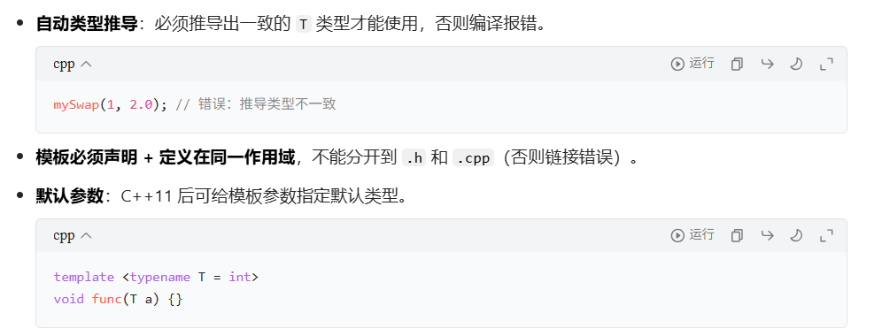

#### 普通函数 vs 函数模板
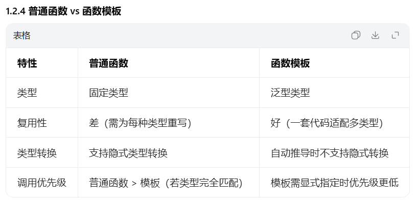

##### 调用优先级规则
- 若普通函数和函数模板都可匹配，**优先调用普通函数**。
- 可通过 `mySwap<>(a, b)` **强制调用模板**。
- 若模板能生成更匹配的版本，则调用模板。】

```c
void mySwap(int& a, int& b) { ... } // 普通函数
template <typename T> void mySwap(T& a, T& b) { ... } // 模板
mySwap(1, 2); // 优先调用普通函数
mySwap(1.0, 2.0); // 调用模板（普通函数不匹配）
```

#### 局限性
模板**无法处理所有类型**, 比如自定义的类型之间的运算需要自己重载运算符

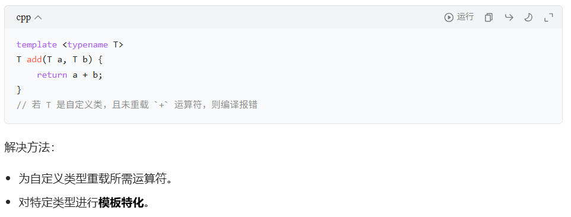

### 类模板

#### 基础语法
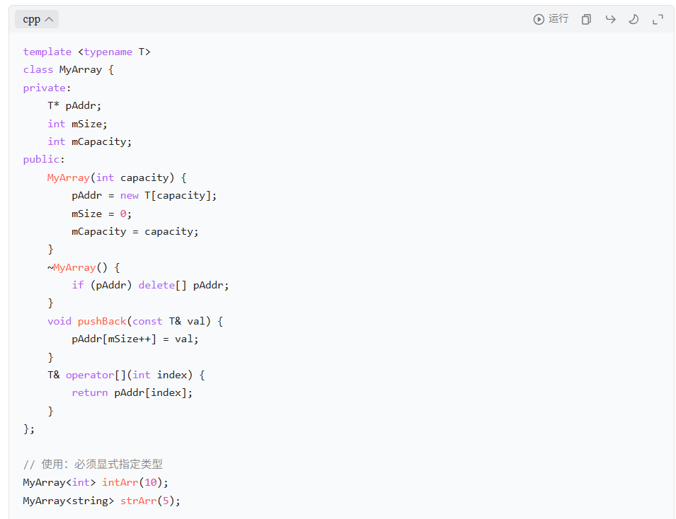

#### 类模板 vs 函数模板
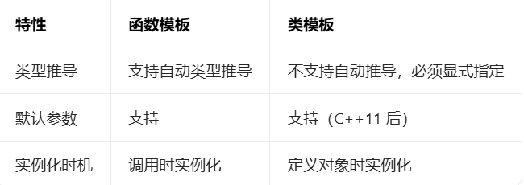
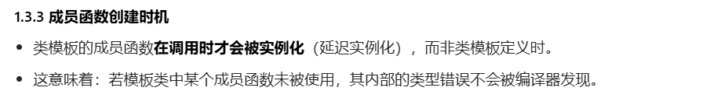


#### **类模板对象做函数参数**
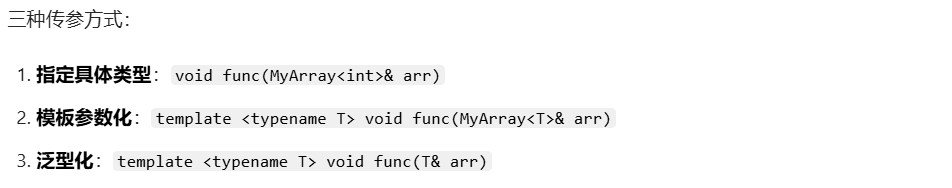

#### 类模板与继承
> 子类继承类模板时，**必须指定父类的模板类型**，或让**子类也成为模板**

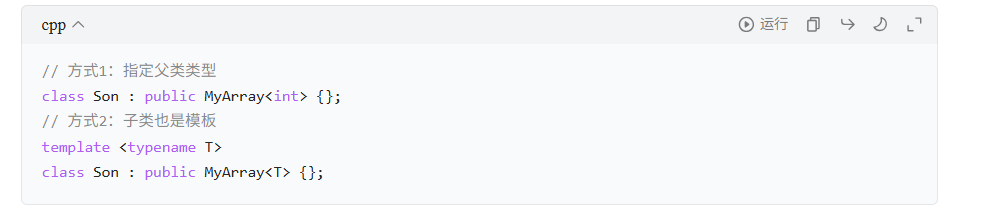


#### 类模板成员函数类外实现

需在**类外** 声明模板参数列表
> 说白了，一次声明模板参数，只能用一次

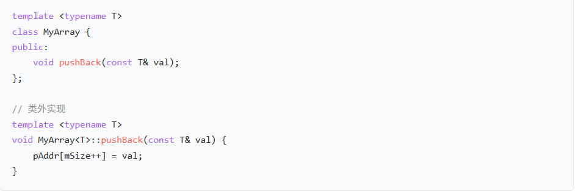

#### 类模板分文件编写
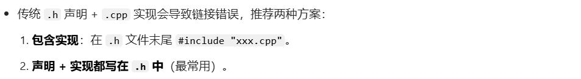


#### 类模板与友元
**全局友元函数**需在**类内声明**、**类外实现**，并**提前声明模板**

> 注意必须提前声明，步骤如下：
> - 提前声明**模板类**，声明**模板函数** operator<<
> - 类内声明友元，模板函数operator<< (因为外面可以靠template<typename T>来表示下面是模板，类内没办法，所以编译器只能用operator<< <T>来告诉编译器，他是个模板函数)
> - 类外实现模板函数operator<<

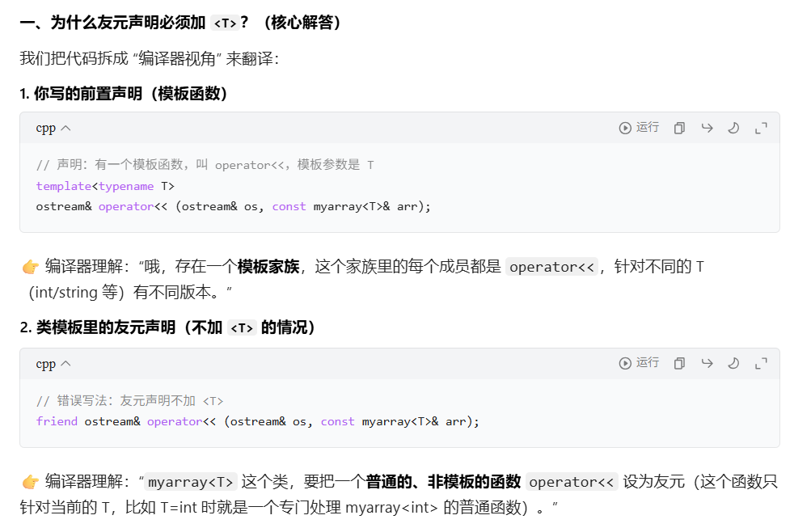
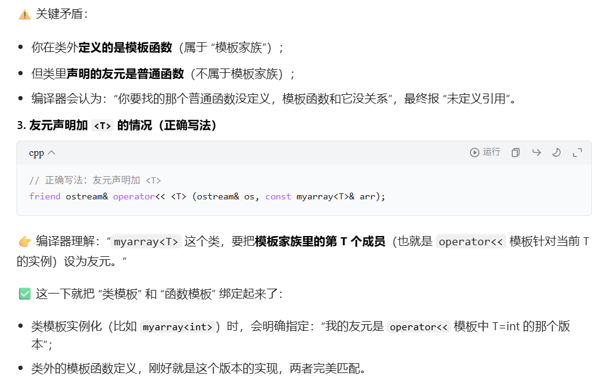
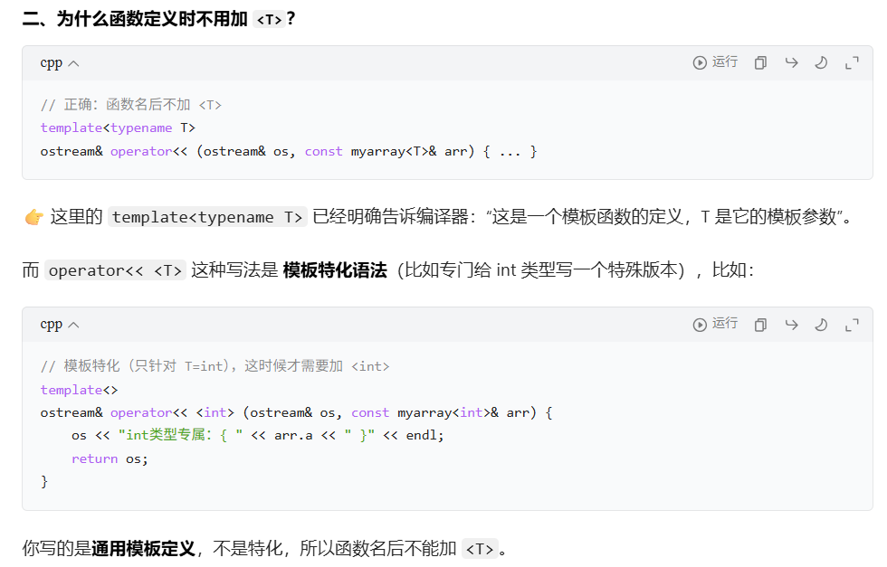

#### demo: 实现一个数组类的封装
实现一个通用数组类，支持：
- 动态扩容
- 尾插、尾删
- 下标访问
- 打印输出
- **深拷贝（避免内存泄漏）**

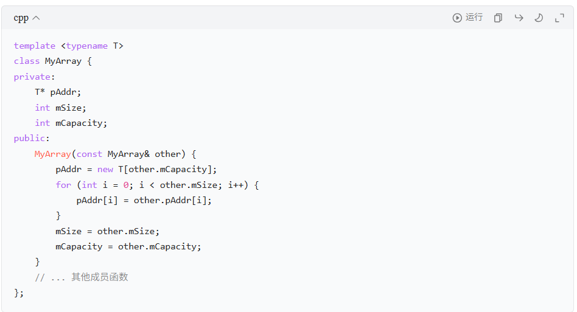


# STL

## 定位
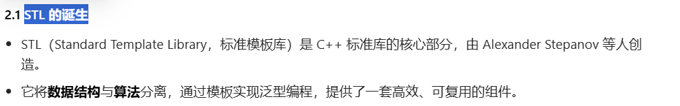

## 基本概念
- **容器（Container）**：管理一组元素的集合（如 `vector`、`list`、`map`）。
- **算法（Algorithm）**：**操作容器元素**的**通用函数**（如 `sort`、`find`、`for_each`）。
- **迭代器（Iterator）**：连接容器与算法的 “**指针**”，提供**统一的遍历方式**。
- 核心思想：容器与算法通过迭代器解耦，一套算法可适配多种容器。

## STL 六大组件
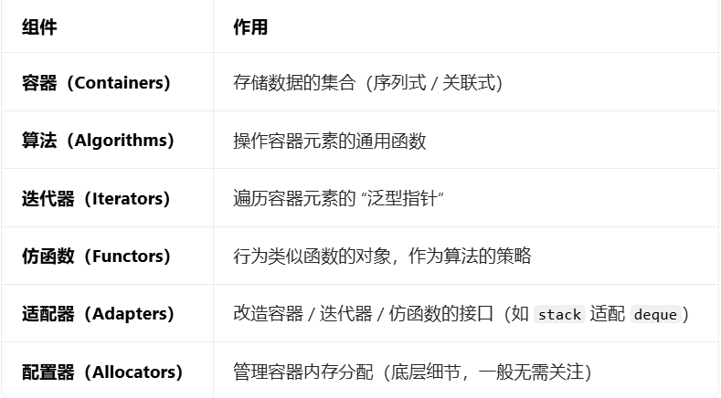

## 容器，迭代器，算法的关系
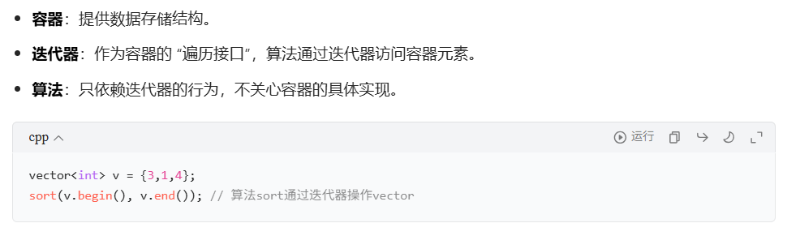

## STL 常用容器
### string 容器（字符串）
`string` 是管理**字符序列**的容器，替代 C 风格 `char*`，更安全易用。

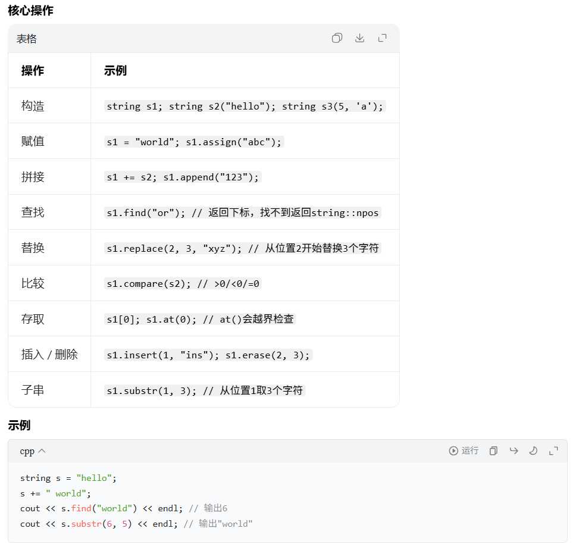

```c
#include <iostream>
#include <string>
using namespace std;

int main() {
    // 1. 构造
    string s1;                // 空字符串
    string s2("hello");       // 从C字符串构造
    string s3(5, 'a');        // 5个'a'
    string s4(s2);            // 拷贝构造
    cout << "=== 构造结果 ===" << endl;
    cout << "s2: " << s2 << endl;  // hello
    cout << "s3: " << s3 << endl;  // aaaaa
    cout << "s4: " << s4 << endl;  // hello

    // 2. 赋值
    s1 = "world";             // 直接赋值
    s1.assign("abc");         // assign赋值
    cout << "\n=== 赋值结果 ===" << endl;
    cout << "s1: " << s1 << endl;  // abc

    // 3. 拼接
    s1 += s2;                 // += 拼接
    s1.append("123");         // append拼接
    cout << "\n=== 拼接结果 ===" << endl;
    cout << "s1: " << s1 << endl;  // abchello123

    // 4. 查找
    size_t pos = s1.find("hello");  // 查找子串
    cout << "\n=== 查找结果 ===" << endl;
    if (pos != string::npos) {
        cout << "\"hello\" 位置: " << pos << endl;  // 3
    } else {
        cout << "未找到" << endl;
    }

    // 5. 替换
    s1.replace(3, 5, "xyz");   // 从位置3开始，替换5个字符为"xyz"
    cout << "\n=== 替换结果 ===" << endl;
    cout << "s1: " << s1 << endl;  // abcxyz123

    // 6. 比较
    int cmp_res = s1.compare("abcxyz123");
    cout << "\n=== 比较结果 ===" << endl;
    if (cmp_res == 0) {
        cout << "s1 等于 \"abcxyz123\"" << endl;
    } else if (cmp_res > 0) {
        cout << "s1 大于 \"abcxyz123\"" << endl;
    } else {
        cout << "s1 小于 \"abcxyz123\"" << endl;
    }

    // 7. 存取
    cout << "\n=== 存取结果 ===" << endl;
    cout << "s1[0]: " << s1[0] << endl;    // a（不检查越界）
    cout << "s1.at(0): " << s1.at(0) << endl;  // a（会抛异常）
    try {
        // s1.at(100);  // 越界会抛出out_of_range异常
    } catch (out_of_range& e) {
        cout << "越界异常: " << e.what() << endl;
    }

    // 8. 插入 / 删除
    s1.insert(1, "ins");       // 在位置1插入"ins"
    cout << "\n=== 插入结果 ===" << endl;
    cout << "s1: " << s1 << endl;  // ainsbcxyz123

    s1.erase(2, 3);            // 从位置2删除3个字符
    cout << "\n=== 删除结果 ===" << endl;
    cout << "s1: " << s1 << endl;  // aibcxyz123

    // 9. 子串
    string sub = s1.substr(1, 3);  // 从位置1取3个字符
    cout << "\n=== 子串结果 ===" << endl;
    cout << "sub: " << sub << endl;  // ibc

    return 0;
}
```
```c
=== 构造结果 ===
s2: hello
s3: aaaaa
s4: hello

=== 赋值结果 ===
s1: abc

=== 拼接结果 ===
s1: abchello123

=== 查找结果 ===
"hello" 位置: 3

=== 替换结果 ===
s1: abcxyz123

=== 比较结果 ===
s1 等于 "abcxyz123"

=== 存取结果 ===
s1[0]: a
s1.at(0): a

=== 插入结果 ===
s1: ainsbcxyz123

=== 删除结果 ===
s1: aibcxyz123

=== 子串结果 ===
sub: ibc
```
> 注意，.at(),  .replace(), .erase(), 这些不是迭代器，而是容器类的成员函数
> 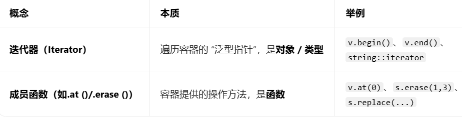
> 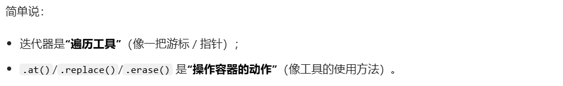


### vector 容器（动态数组）
`vector` 是**单端动态数组**，支持**随机访问**，尾部插入 / 删除高效。

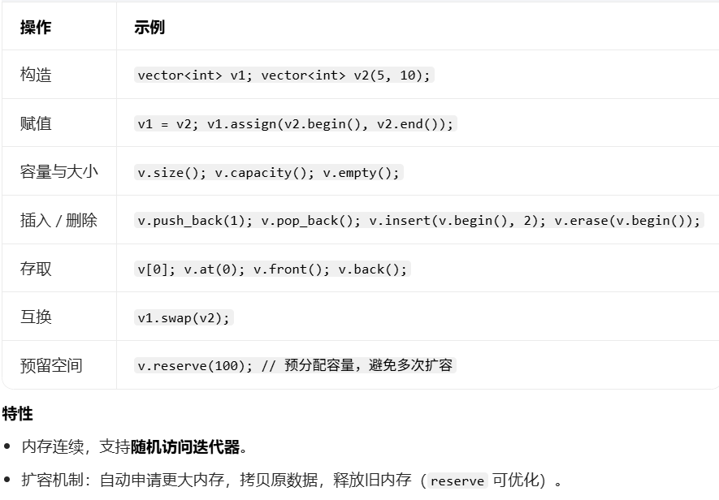

```c
#include <iostream>
#include <vector>
using namespace std;

int main() {
    // 1. 构造
    vector<int> v1;                // 空vector
    vector<int> v2(5, 10);        // 5个元素，每个值为10
    vector<int> v3(v2.begin(), v2.end()); // 迭代器区间构造
    vector<int> v4(v2);            // 拷贝构造
    cout << "=== 构造结果 ===" << endl;
    cout << "v2: ";
    for (int x : v2) cout << x << " ";  // 10 10 10 10 10
    cout << endl;

    // 2. 赋值
    v1 = v2;                      // 拷贝赋值
    vector<int> v5;
    v5.assign(v2.begin(), v2.end()); // assign区间赋值
    v5.assign(3, 20);             // assign填充赋值（3个20）
    cout << "\n=== 赋值结果 ===" << endl;
    cout << "v1: ";
    for (int x : v1) cout << x << " ";  // 10 10 10 10 10
    cout << "\nv5: ";
    for (int x : v5) cout << x << " ";  // 20 20 20
    cout << endl;

    // 3. 容量与大小
    cout << "\n=== 容量与大小 ===" << endl;
    cout << "v2.size() = " << v2.size() << endl;     // 5
    cout << "v2.capacity() = " << v2.capacity() << endl; // >=5（具体看编译器实现）
    cout << "v2.empty() = " << v2.empty() << endl;   // 0（false）

    // 4. 插入 / 删除
    v1.push_back(1);              // 尾部插入1
    v1.pop_back();                // 尾部删除
    v1.insert(v1.begin(), 2);     // 头部插入2
    v1.erase(v1.begin());         // 删除头部元素
    cout << "\n=== 插入/删除结果 ===" << endl;
    cout << "v1: ";
    for (int x : v1) cout << x << " ";  // 10 10 10 10 10（和原v2一致）
    cout << endl;

    // 5. 存取
    cout << "\n=== 存取结果 ===" << endl;
    cout << "v2[0] = " << v2[0] << endl;        // 10（不检查越界）
    cout << "v2.at(0) = " << v2.at(0) << endl;  // 10（会抛异常）
    cout << "v2.front() = " << v2.front() << endl; // 10
    cout << "v2.back() = " << v2.back() << endl;   // 10
    try {
        // v2.at(100);  // 越界会抛出out_of_range异常
    } catch (out_of_range& e) {
        cout << "越界异常: " << e.what() << endl;
    }

    // 6. 互换
    v1.swap(v5);
    cout << "\n=== 互换结果 ===" << endl;
    cout << "v1: ";
    for (int x : v1) cout << x << " ";  // 20 20 20
    cout << "\nv5: ";
    for (int x : v5) cout << x << " ";  // 10 10 10 10 10
    cout << endl;

    // 7. 预留空间（优化扩容）
    vector<int> v6;
    v6.reserve(100); // 预分配100个元素的容量，避免多次自动扩容
    cout << "\n=== 预留空间结果 ===" << endl;
    cout << "v6.size() = " << v6.size() << endl;     // 0
    cout << "v6.capacity() = " << v6.capacity() << endl; // 100

    return 0;
}
```

```c
=== 构造结果 ===
v2: 10 10 10 10 10 

=== 赋值结果 ===
v1: 10 10 10 10 10 
v5: 20 20 20 

=== 容量与大小 ===
v2.size() = 5
v2.capacity() = 5
v2.empty() = 0

=== 插入/删除结果 ===
v1: 10 10 10 10 10 

=== 存取结果 ===
v2[0] = 10
v2.at(0) = 10
v2.front() = 10
v2.back() = 10

=== 互换结果 ===
v1: 20 20 20 
v5: 10 10 10 10 10 

=== 预留空间结果 ===
v6.size() = 0
v6.capacity() = 100
```

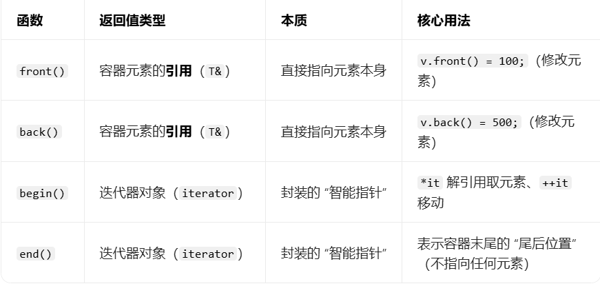
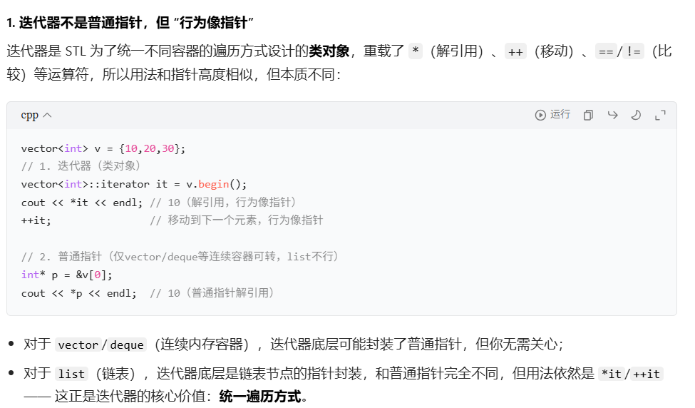

> 所以迭代器的真正意义，在于无视底层容器的数据结构，统一遍历方式。

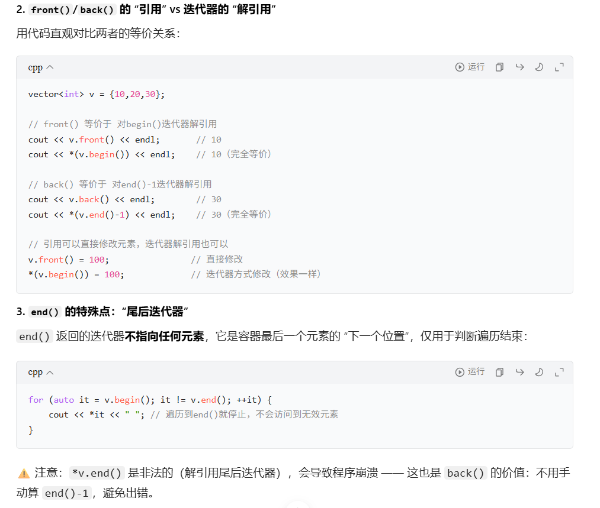


### deque 容器（双端队列）
`deque` 是**双端动态数组**，支持首尾快速插入 / 删除，同时支持随机访问。

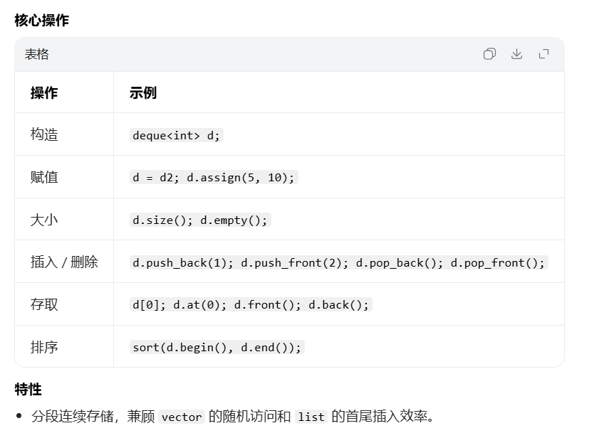

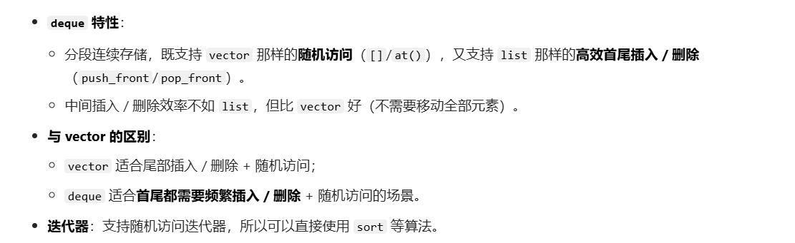


### stack 容器（栈）
stack 是 **后进先出（LIFO** 的适配器容器，默认**底层用 deque 实现**。

**核心接口**
```c
stack<int> s;
s.push(1);    // 入栈
s.pop();       // 出栈（不返回值）
s.top();       // 获取栈顶
s.empty();     // 是否为空
s.size();      // 元素个数
```
```c
#include <iostream>
#include <stack>
using namespace std;

int main() {
    // 1. 构造空栈
    stack<int> s;

    // 2. 入栈 push()
    s.push(10);
    s.push(20);
    s.push(30);
    cout << "=== 入栈后 ===" << endl;
    cout << "栈顶元素：" << s.top() << endl;  // 30（最后入栈的元素）
    cout << "元素个数：" << s.size() << endl; // 3
    cout << "是否为空：" << s.empty() << endl; // 0（false）

    // 3. 出栈 pop() —— 注意：pop() 不返回值，要先通过 top() 取值再 pop()
    cout << "\n=== 出栈操作 ===" << endl;
    while (!s.empty()) {
        // 先获取栈顶元素
        cout << "弹出：" << s.top() << endl;
        // 再删除栈顶
        s.pop();
    }
    cout << "出栈后元素个数：" << s.size() << endl; // 0
    cout << "是否为空：" << s.empty() << endl; // 1（true）

    // 4. 完整使用示例：逆序输出
    stack<int> s2;
    int arr[] = {1, 2, 3, 4, 5};
    for (int i = 0; i < 5; ++i) {
        s2.push(arr[i]);
    }
    cout << "\n=== 逆序输出（利用栈 LIFO 特性）===" << endl;
    while (!s2.empty()) {
        cout << s2.top() << " "; // 5 4 3 2 1
        s2.pop();
    }
    cout << endl;

    return 0;
}
```
```c
=== 入栈后 ===
栈顶元素：30
元素个数：3
是否为空：0

=== 出栈操作 ===
弹出：30
弹出：20
弹出：10
出栈后元素个数：0
是否为空：1

=== 逆序输出（利用栈 LIFO 特性）===
5 4 3 2 1 
```


### queue 容器（队列）
`queue` 是 **先进先出（FIFO）** 的适配器容器，默认底层用 `deque` 实现。

```c
queue<int> q;
q.push(1);    // 入队
q.pop();      // 出队（不返回值）
q.front();    // 获取队头
q.back();     // 获取队尾
q.empty();    // 是否为空
q.size();     // 元素个数
```
```c
#include <iostream>
#include <queue>
using namespace std;

int main() {
    // 1. 构造空队列
    queue<int> q;

    // 2. 入队 push()
    q.push(10);
    q.push(20);
    q.push(30);
    cout << "=== 入队后 ===" << endl;
    cout << "队头元素：" << q.front() << endl;  // 10（最先入队的元素）
    cout << "队尾元素：" << q.back() << endl;   // 30（最后入队的元素）
    cout << "元素个数：" << q.size() << endl;   // 3
    cout << "是否为空：" << q.empty() << endl;  // 0（false）

    // 3. 出队 pop() —— 注意：pop() 不返回值，要先通过 front() 取值再 pop()
    cout << "\n=== 出队操作 ===" << endl;
    while (!q.empty()) {
        // 先获取队头元素
        cout << "弹出：" << q.front() << endl;
        // 再删除队头
        q.pop();
    }
    cout << "出队后元素个数：" << q.size() << endl;  // 0
    cout << "是否为空：" << q.empty() << endl;       // 1（true）

    // 4. 完整使用示例：模拟排队
    queue<string> q2;
    q2.push("张三");
    q2.push("李四");
    q2.push("王五");
    cout << "\n=== 模拟排队叫号 ===" << endl;
    while (!q2.empty()) {
        cout << "当前叫号：" << q2.front() << endl;
        q2.pop();
    }

    return 0;
}
```

```c
=== 入队后 ===
队头元素：10
队尾元素：30
元素个数：3
是否为空：0

=== 出队操作 ===
弹出：10
弹出：20
弹出：30
出队后元素个数：0
是否为空：1

=== 模拟排队叫号 ===
当前叫号：张三
当前叫号：李四
当前叫号：王五
```
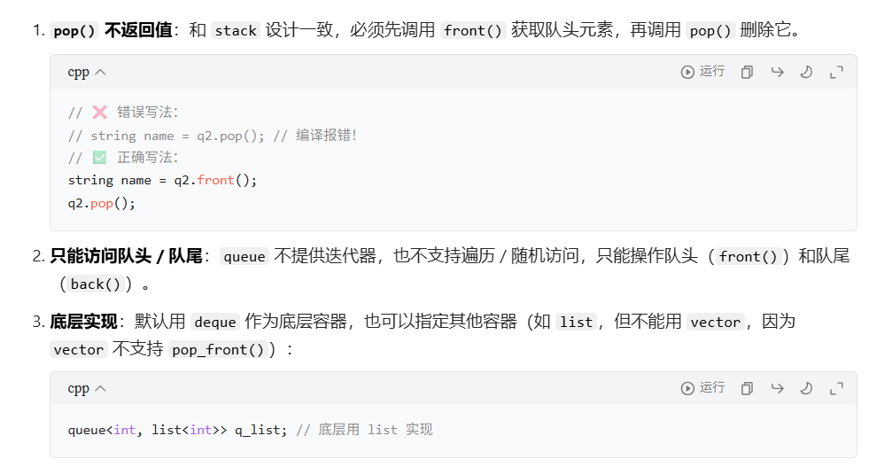

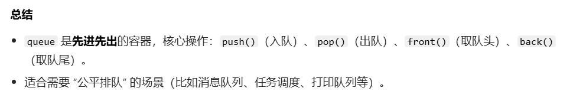


### list 容器（双向链表）
list 是**双向链表**，支持任意位置**高效插入 / 删除**，但**不支持随机访问**
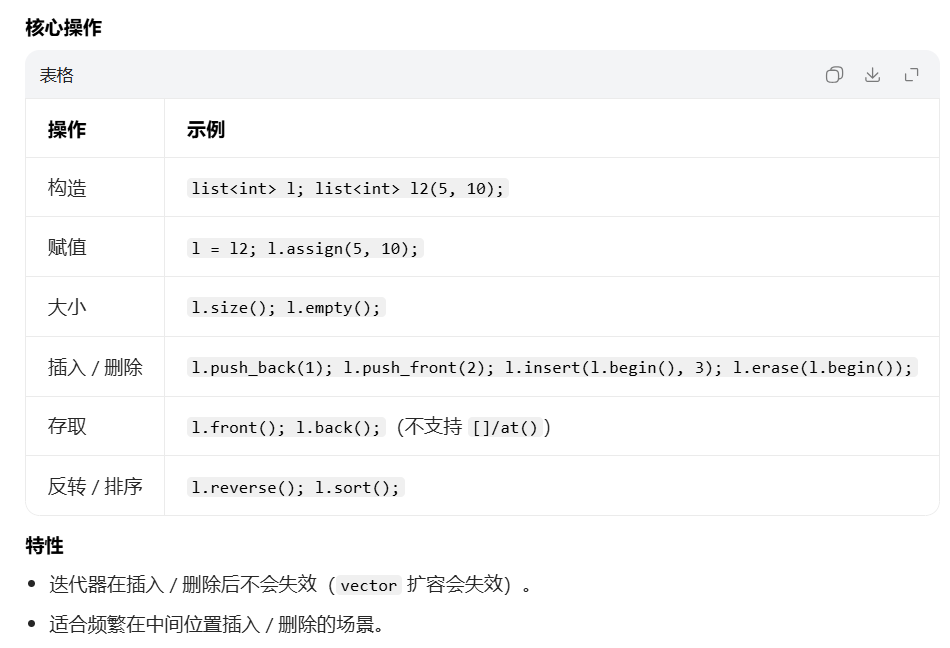

```c
#include <iostream>
#include <list>
#include <algorithm>
using namespace std;

int main() {
    // 1. 构造
    list<int> l;                // 空list
    list<int> l2(5, 10);        // 5个元素，每个值为10
    list<int> l3(l2.begin(), l2.end()); // 迭代器区间构造
    list<int> l4(l2);            // 拷贝构造
    cout << "=== 构造结果 ===" << endl;
    cout << "l2: ";
    for (int x : l2) cout << x << " ";  // 10 10 10 10 10
    cout << endl;

    // 2. 赋值
    l = l2;                      // 拷贝赋值
    list<int> l5;
    l5.assign(5, 20);            // assign填充赋值（5个20）
    cout << "\n=== 赋值结果 ===" << endl;
    cout << "l: ";
    for (int x : l) cout << x << " ";    // 10 10 10 10 10
    cout << "\nl5: ";
    for (int x : l5) cout << x << " ";  // 20 20 20 20 20
    cout << endl;

    // 3. 大小操作
    cout << "\n=== 大小操作 ===" << endl;
    cout << "l.size() = " << l.size() << endl;     // 5
    cout << "l.empty() = " << l.empty() << endl;   // 0（false）

    // 4. 插入 / 删除（list优势：任意位置高效插入/删除）
    l.push_back(1);              // 尾部插入1
    l.push_front(2);             // 头部插入2
    l.insert(l.begin(), 3);      // 在头部前插入3
    l.erase(l.begin());          // 删除头部元素（即刚插入的3）
    cout << "\n=== 插入/删除结果 ===" << endl;
    cout << "l: ";
    for (int x : l) cout << x << " ";  // 2 10 10 10 10 10 1
    cout << endl;

    // 5. 存取（注意：list不支持[]/at()，只能访问首尾）
    cout << "\n=== 存取结果 ===" << endl;
    cout << "l.front() = " << l.front() << endl; // 2
    cout << "l.back() = " << l.back() << endl;   // 1
    // 错误示例：cout << l[0] << endl; // 编译报错！

    // 6. 反转 / 排序（list自带成员函数，性能更优）
    l.reverse();                 // 反转链表
    cout << "\n=== 反转结果 ===" << endl;
    cout << "l: ";
    for (int x : l) cout << x << " ";  // 1 10 10 10 10 10 2
    cout << endl;

    l.sort();                    // 默认升序排序
    cout << "\n=== 排序结果 ===" << endl;
    cout << "l: ";
    for (int x : l) cout << x << " ";  // 1 2 10 10 10 10 10
    cout << endl;

    // 7. 迭代器特性验证（插入/删除后迭代器不失效）
    auto it = l.begin();
    ++it; // 指向元素2
    l.insert(it, 100); // 在2前插入100
    cout << "\n=== 迭代器验证 ===" << endl;
    cout << "原迭代器仍指向：" << *it << endl; // 输出2，迭代器未失效

    return 0;
}
```
```c
=== 构造结果 ===
l2: 10 10 10 10 10 

=== 赋值结果 ===
l: 10 10 10 10 10 
l5: 20 20 20 20 20 

=== 大小操作 ===
l.size() = 5
l.empty() = 0

=== 插入/删除结果 ===
l: 2 10 10 10 10 10 1 

=== 存取结果 ===
l.front() = 2
l.back() = 1

=== 反转结果 ===
l: 1 10 10 10 10 10 2 

=== 排序结果 ===
l: 1 2 10 10 10 10 10 

=== 迭代器验证 ===
原迭代器仍指向：2
```

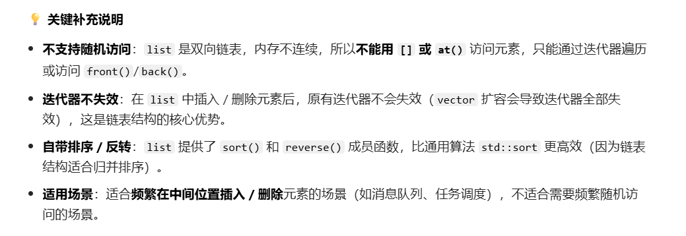

### set/multiset 容器（有序集合）
`set/multiset` 是**有序关联容器**，底层为**红黑树**，**元素自动排序**。

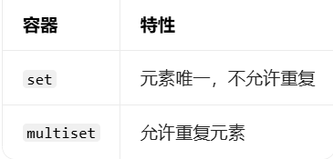

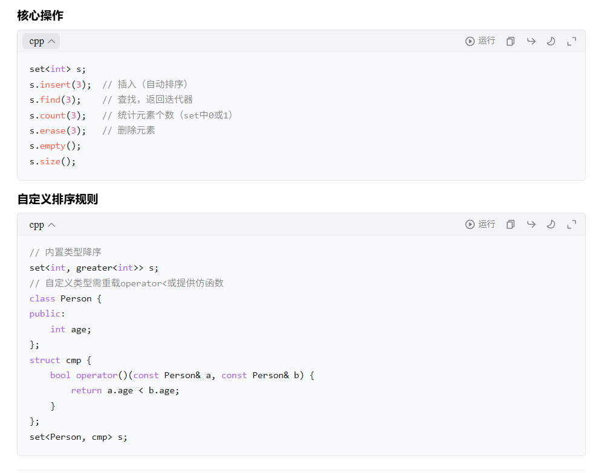

> 总的来说，无论什么样的数据结构，其类内部提供的方法，无非就是增删改查。
>
> 对于集合的排序，`set<集合元素类型，排序用的比较规则>`
>
> 这里的自定义排序规则，其实是，比较规则。告诉内置的排序算法，如何来比较自定义数据类型的大小关系。
```c
#include <iostream>
#include <set>
using namespace std;

// 自定义类型：Person
class Person {
public:
    int age;
    string name;
    Person(string n, int a) : name(n), age(a) {}
};

// 自定义排序仿函数：按 age 升序
struct cmp {
    bool operator()(const Person& a, const Person& b) const {
        return a.age < b.age;
    }
};

int main() {
    // ======================================
    // 1. set 容器（元素唯一，自动排序）
    // ======================================
    set<int> s;
    // 插入（自动升序排序，重复元素会被忽略）
    s.insert(3);
    s.insert(1);
    s.insert(4);
    s.insert(1); // 重复插入，不会生效
    cout << "=== set 插入结果 ===" << endl;
    for (int x : s) cout << x << " ";  // 1 3 4
    cout << endl;

    // 查找
    auto it = s.find(3);
    if (it != s.end()) {
        cout << "找到元素：" << *it << endl; // 3
    } else {
        cout << "未找到元素" << endl;
    }

    // 统计（set 中 count 只能是 0 或 1）
    cout << "元素 1 的个数：" << s.count(1) << endl; // 1

    // 删除
    s.erase(3);
    cout << "=== set 删除后 ===" << endl;
    for (int x : s) cout << x << " ";  // 1 4
    cout << endl;

    // 大小与空判断
    cout << "size: " << s.size() << ", empty: " << s.empty() << endl; // 2, 0

    // ======================================
    // 2. multiset 容器（允许重复元素）
    // ======================================
    multiset<int> ms;
    ms.insert(3);
    ms.insert(1);
    ms.insert(3); // 允许重复
    ms.insert(4);
    cout << "\n=== multiset 插入结果 ===" << endl;
    for (int x : ms) cout << x << " ";  // 1 3 3 4
    cout << endl;
    cout << "元素 3 的个数：" << ms.count(3) << endl; // 2

    // ======================================
    // 3. 自定义排序规则：内置类型降序
    // ======================================
    set<int, greater<int>> s_desc;
    s_desc.insert(3);
    s_desc.insert(1);
    s_desc.insert(4);
    cout << "\n=== set 降序排序 ===" << endl;
    for (int x : s_desc) cout << x << " ";  // 4 3 1
    cout << endl;

    // ======================================
    // 4. 自定义类型 + 自定义排序规则
    // ======================================
    set<Person, cmp> s_person;
    s_person.insert(Person("张三", 20));
    s_person.insert(Person("李四", 18));
    s_person.insert(Person("王五", 25));
    cout << "\n=== 自定义类型按 age 升序 ===" << endl;
    for (const Person& p : s_person) {
        cout << p.name << "(" << p.age << ") ";
    }
    // 输出：李四(18) 张三(20) 王五(25)
    cout << endl;

    return 0;
}
```

```c
=== set 插入结果 ===
1 3 4 
找到元素：3
元素 1 的个数：1
=== set 删除后 ===
1 4 
size: 2, empty: 0

=== multiset 插入结果 ===
1 3 3 4 
元素 3 的个数：2

=== set 降序排序 ===
4 3 1 

=== 自定义类型按 age 升序 ===
李四(18) 张三(20) 王五(25) 
```


### map/multimap 容器（键值对）

`map/multimap` 是**有序键值对**容器，底层为`红黑树`，**按键自动排序**

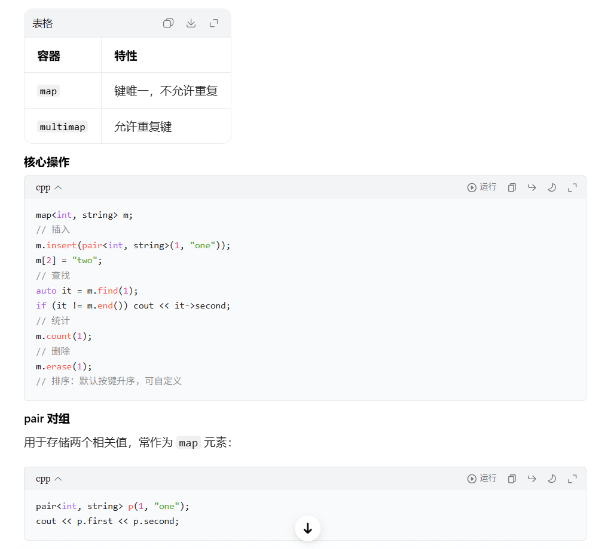

这是图中核心操作的完整演示，包含了 **map（键唯一）**和 **multimap（允许重复键）**的使用场景.

```c
#include <iostream>
#include <map>
#include <string>
using namespace std;

int main() {
    // ======================================
    // 1. map 容器（键唯一，自动按键升序排序）
    // ======================================
    map<int, string> m;

    // 插入方式一：insert 插入 pair
    m.insert(pair<int, string>(1, "one"));
    m.insert(pair<int, string>(3, "three"));
    
    // 插入方式二：用 [] 运算符（最常用，键不存在则插入，存在则修改）
    m[2] = "two"; 
    m[4] = "four";
    
    // 注意：尝试插入重复键（key=1），会被忽略（map 不允许重复）
    m.insert(pair<int, string>(1, "New_One")); 
    
    cout << "=== map 插入结果（自动排序） ===" << endl;
    // 遍历：map 是有序的，输出顺序为 1, 2, 3, 4
    for (auto& p : m) {
        cout << p.first << ": " << p.second << " ";
    }
    cout << endl;

    // 查找
    auto it = m.find(2);
    if (it != m.end()) {
        cout << "找到 key=2，value = " << it->second << endl; // 输出 two
    } else {
        cout << "未找到 key=2" << endl;
    }

    // 统计（map 中 count 只能返回 0 或 1，因为键唯一）
    cout << "key=1 的个数: " << m.count(1) << endl; // 1
    cout << "key=5 的个数: " << m.count(5) << endl; // 0

    // 删除
    m.erase(3); // 删除 key=3 的元素
    cout << "\n=== map 删除 key=3 后 ===" << endl;
    for (auto& p : m) {
        cout << p.first << ": " << p.second << " ";
    }
    cout << endl;

    // ======================================
    // 2. multimap 容器（允许重复键）
    // ======================================
    multimap<int, string> mm;
    
    // 插入重复键：key=1 可以插入多次
    mm.insert(pair<int, string>(1, "Apple"));
    mm.insert(pair<int, string>(1, "Banana"));
    mm.insert(pair<int, string>(2, "Cat"));

    cout << "\n=== multimap 插入结果（支持重复键） ===" << endl;
    for (auto& p : mm) {
        cout << p.first << ": " << p.second << " ";
    }
    cout << endl;
    
    // 统计（multimap 中 count 可以返回具体次数）
    cout << "key=1 出现的次数: " << mm.count(1) << endl; // 2

    // 删除（会删除所有 key=1 的元素）
    mm.erase(1);
    cout << "=== multimap 删除 key=1 后 ===" << endl;
    for (auto& p : mm) {
        cout << p.first << ": " << p.second << " ";
    }
    cout << endl;

    return 0;
}
```

```c
=== map 插入结果（自动排序） ===
1: one 2: two 3: three 4: four 
找到 key=2，value = two
key=1 的个数: 1
key=5 的个数: 0

=== map 删除 key=3 后 ===
1: one 2: two 4: four 

=== multimap 插入结果（支持重复键） ===
1: Apple 1: Banana 2: Cat 
key=1 出现的次数: 2
=== multimap 删除 key=1 后 ===
2: Cat 
```
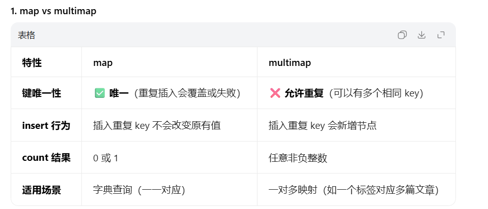

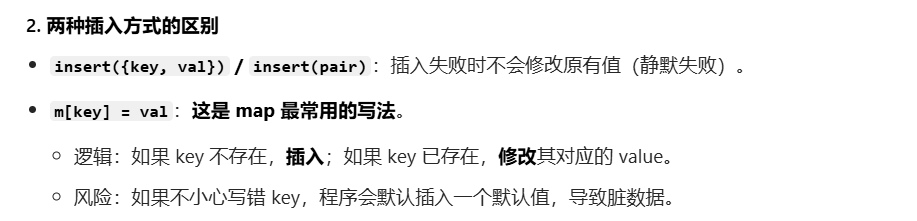

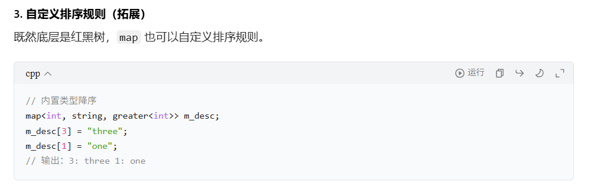

> map 和set 都是有序容器，所以内部会自动进行排序。自然也可以指定比较规则，来应对自定义的数据类型

> 下面这里有说，`map<key, value>`, **key的类型要可比较**，value无要求。

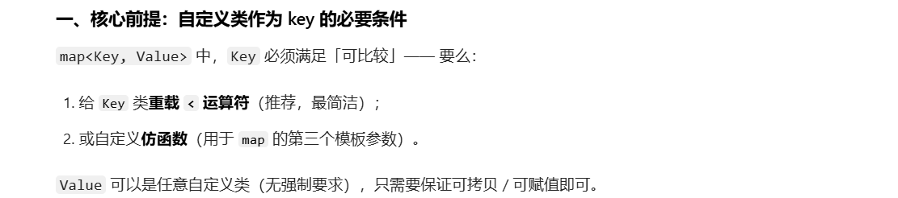


## STL 函数**对象**（仿函数）
### 函数对象 基本概念
- 重载 `operator()` 的**类对象**，行为**类似函数**，又称**仿函数**。
- 作为**算法的策略参数**(指定自定义变量的比较规则)，比普通函数更灵活（**可携带状态**）。

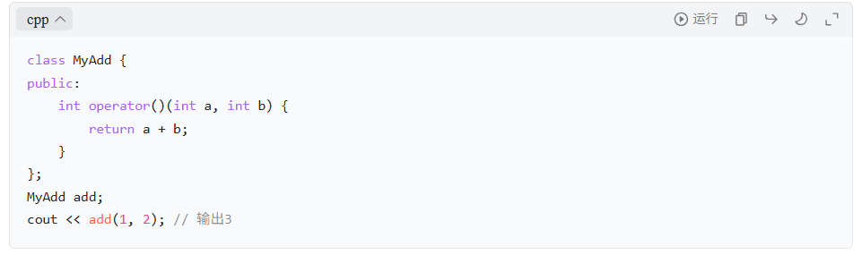

### 谓词
#### 一元谓词
- **一元谓词**：接受**一个参数**，**返回 bool**，用于筛选。
- 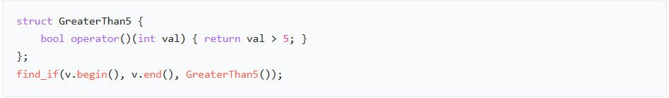
#### 二元谓词
- **二元谓词**：接受**两个参数**，**返回 bool**，用于**比较 / 排序**


### 内建函数对象
STL 提供了**预定义仿函数**，包含在 `<functional>` 头文件：
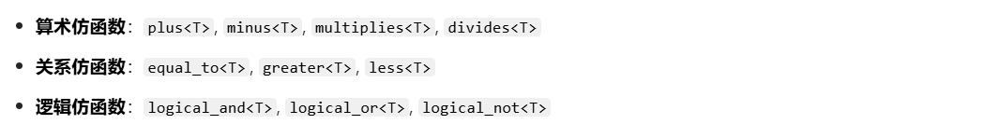


## STL 常用算法
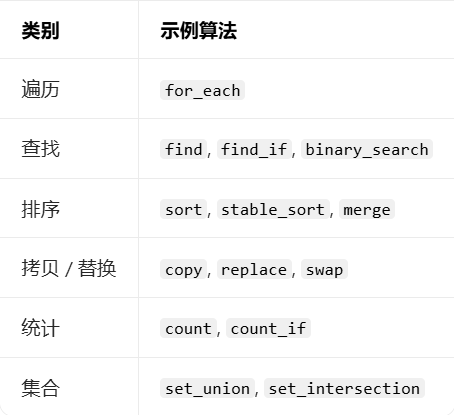


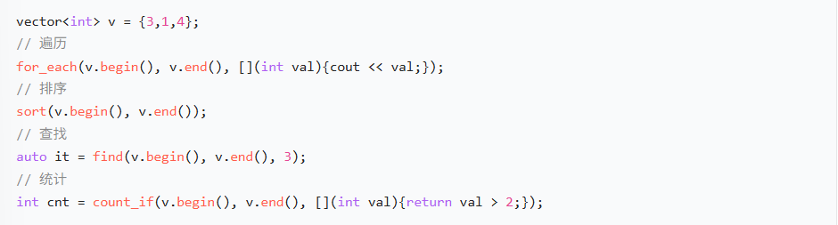

