# 基础语法
## 变量
```c
变量创建方法：

数据类型 变量名 = 变量初始值;
```
> 变量的作用是方便操作内存

## 常量
> 作用：记录程序中不可修改的数据

```c
c++定义常量的两种方式：
1. #define 宏常量
    #define 常量名 常量值
2. const修饰变量
    const 数据类型 常量名 = 常量值
    //通常在变量定义前+关键字 const， 修饰该变量为常量，不可修改。
```

## 关键字
> 作用：关键字是C++中预先保留的单词（标识符）
>
> 在定义变量名，常量名的时候，就不要用这些名字了


## 标识符命名规则
> 作用：c++规定，给标识符（变量，常量）命名时，有一套自己的规则（命名规则）
> 


## 数据类型
>  数据类型存在意义： 给变量分配合适的内存空间
### 整形（short, int, long, long long）


### sizeof 关键字
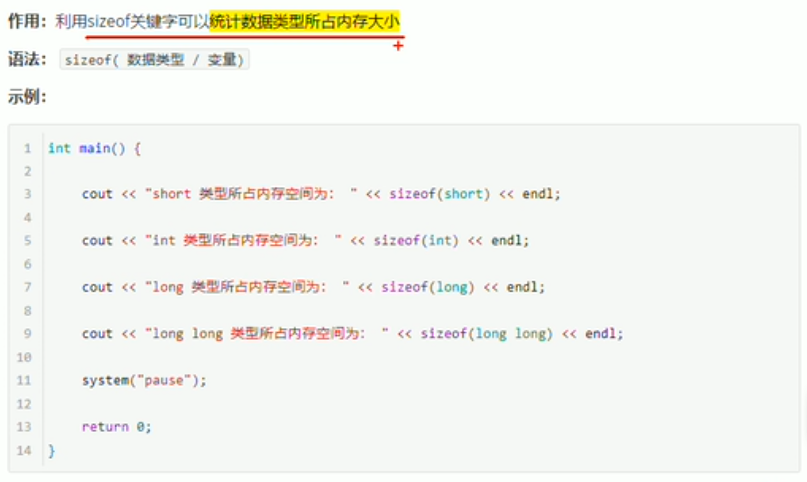
### 实型（浮点型）

> 整数部分，和小数部分，都算有效数字，比如
>
> 3.14，是3位有效数字
>
> double比float更加精准一些

```c
float f1 = 3.14f;   //一般在float的值后面加一个f，表示float，如果不加，编译器会认为3.14是double类型
double f2 = 3.1415926;

// 注意，无论你赋值的小数有多少位，cout输出最多就只有6位有效数字
// 如果要多点有效数字，需要额外配置。
```
另外小数还有科学计数法的表示方法：
```c
float f2 = 3e2;
float f3 = 3e-2;
// 表示3*10^多少次方
```


### 字符型
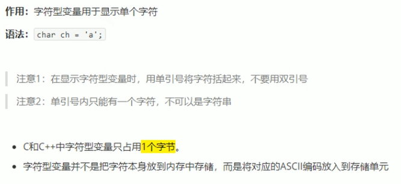

> 字符型变量 对应 ASCII 编码：
>
> a - 97
> A - 67
> ```c
>cout << (int)ch << endl;
> ```


### 转义字符

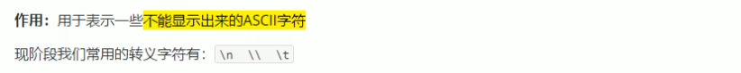


### 字符串型

>作用: 用于表示一串字符

**两种风格**
1. C风格字符串： `char 变量名[] = "xxxxx"`
2. C++风格字符串：  `string 变量名 = "xxxxxx"`
   1. 需要`#include<string>`


```c
char str1[] = "123456789";
```
> 注意：str1的占内存字节数为里面的字符数+1，因为还有一个\0，所以`sizeof(str1) = 10`


### 布尔类型bool


### 数据的输入
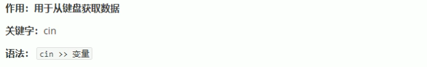
```c
	int a = 0;
	int b = 0;
	cin >> a>>b;
	cout << a <<endl<<b<< endl;

    //回车执行一次cin输入
```


## 运算符

### 算数运算符

### 赋值运算符

### 比较运算符

```c
	int a = 9;
	int b = 9;
	cout << (a == b) << endl;   //输出1， 表示条件真，满足
```

### 逻辑运算符


## 程序流程结构
- 顺序结构
- 选择结构
  - `if`
  - `switch(变量){case 1: xxx;break;}`
- 循环结构
  - `while(循环条件){}`
  - `do{循环语句} while(循环条件);`
  - for

- 跳转语句
  - break
  - continue
  - goto


## 数组
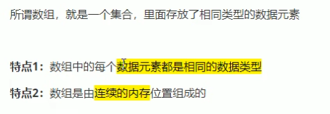
### 一维数组
#### 定义方式

```c
	char str[4] = { 'a', 'b', 'c','\0'};
	cout << sizeof(str) << endl;        // 输出4
	cout << str << endl;                //输出abc
    //如果就定义str[3] = {'a', 'b', 'c'} sizeof输出还是3，但是cout<<str就是有乱码。
```

```c
	char str[4] = { 'a', 'b', 'c','\0'};
	cout << sizeof(str) << endl;
	cout << str << endl;

	char str2[] = { 'a', 'b', 'c' };
	cout << sizeof(str2) << endl;
	cout << str2 << endl;

	char str3[] = "abc";
	cout << sizeof(str3) << endl;
	cout << str3 << endl;

	int arr[] = { 1,2,3 };
	cout << sizeof(arr) << endl;
	cout << sizeof(arr) / sizeof(arr[0]) << endl;
	cout << arr << endl;
```
```c
4
abc
3
abc烫烫烫烫烫烫烫烫烫烫烫烫烫烫烫烫烫烫烫烫烫烫烫烫烫烫烫烫烫烫烫烫烫烫烫烫烫烫烫烫烫烫烫烫烫烫烫烫烫烫烫烫烫烫烫烫烫烫烫烫烫烫烫烫
4
abc
12
3
0000006BF9CFF798
```
> 注意，string是一个类，它不是单纯的字符数组，里面估计是有动态分配的，然后用指针，所以sizeof无论如何都是40


#### 数组名
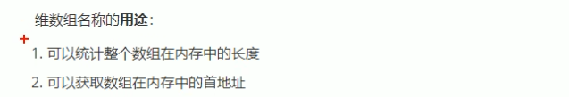
#### 冒泡排序
### 二维数组
#### 定义方式
> 二维数组，就是在一维数组上，多加一个维度。
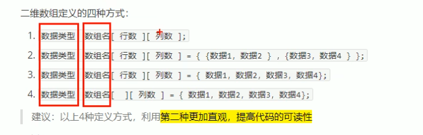

#### 数组名

```c
	char str[][4] = { {'1', '2', 'c', '\0'},
					{'a', 'c', 'b', '\0'}};

	cout << sizeof(str) << endl;
	cout << (int)(str[0]) << endl;
	cout << (int)(str[1]) << endl;
```
```c
8
1200618424
1200618428
```

## 函数


### 定义
函数的定义，分为5个步骤：
- 返回值类型
- 函数名
- 参数表列
- 函数体语句
- return 表达式
### 调用

### 值传递
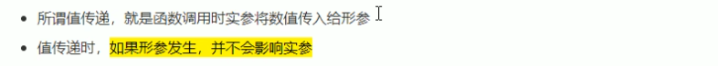


### 函数常见样式
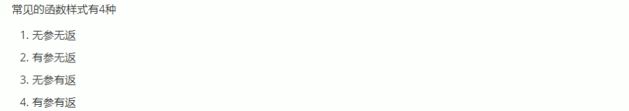
> 这里的返回，是指的返回值，不是LR的返回
### 函数声明
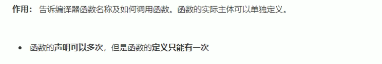

### 函数的分文件编写
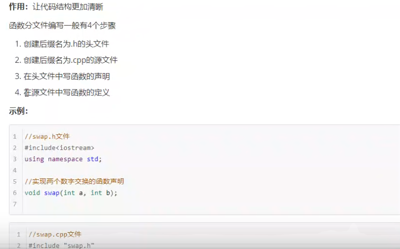

## 指针
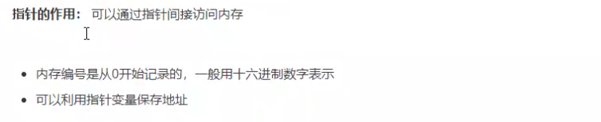
说白了，就是内存地址。
### 指针变量的定义和使用

### 指针所占内存空间
地址多少个字节，指针就是多少个字节
- 32位系统，指针就是4个字节
- 64位系统，指针就是8个字节
### 空指针，野指针

`int *p = NULL;`
- 但是这个是不能进行*访问的，因为0-255之间的内存地址，是系统占用的，无法访问


>  **总结**：空指针，野指针，都不是我们申请的空间，因此不要访问。


### const修饰指针


**1. const修饰指针：常量指针**
```c
const int * p = &a;     //常量指针，指针指向的地址，可以修改，但是指向的值不可以修改
//即p可以重定向，但是被指定的a不可以修改。
```
```c
	int a = 10;
	int b = 20;
	const int* p;
	p = &a;
	p = &b;
	cout << *p << endl;     //指针重定向ok

	b = 30;
	cout << *p << endl;     //目标内存变量修改ok

	*p = 40;                //无法通过指针取值来修改内存。说明要把const int结合起来看

```

**2. const修饰常量：指针常量**
```c
int * const p = &a;
```
```c
	int a = 10;
	int b = 20;
	//int* const p;         //p是指针，也是常量，说明指向的地址不变，所以必须赋初值

	int* const p = &a;      
	*p = 20;                //内存内容可修改
	cout << *p << endl; 

	//p = &b;               //无法重定向
```

**3. const既修饰指针，也修饰常量**
```c
const int * const p = &a;
```
> 既不可以重定向，也不可以通过指针改值


### 指针和数组
> 指针和数组的配合使用
> 
>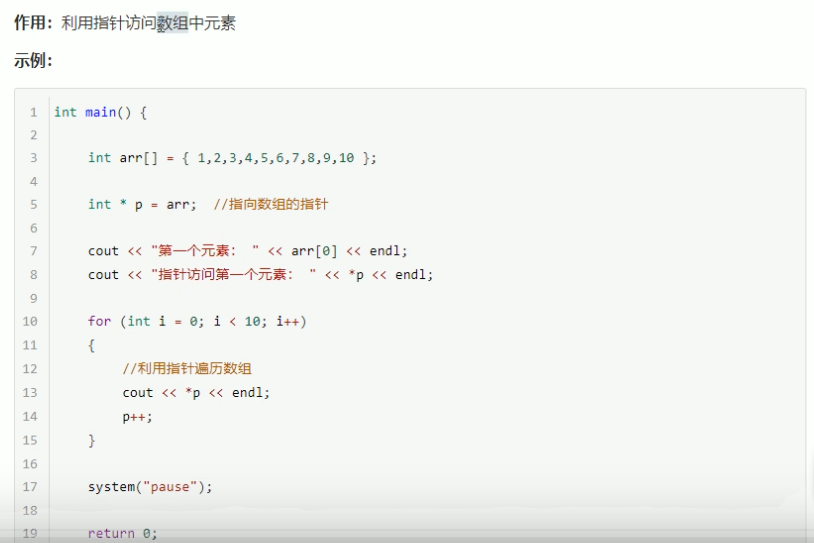


```c
	int arr[] = { 1,2,3,4,5,6,7,8,9,10 };
	int* p = arr;
	for (int i = 0; i < 10; i++) {
		cout << *p << endl;
		p++;        //p++, 自增的是指针指向的单个数据类型的字节数，int指针，就后移4字节。char指针，就后移1字节。
	}
```

### 指针和函数
> 这里主要讲的是指针作为参数传参
>
>
### 指针，数组，函数
这里就是上面两个的综合使用了。


## 结构体
结构体属于自定义的数据类型，允许用户存储不同的数据类型

### 定义和使用


```c
struct student {
	string name;
	int age;
	int score;
} s3;	//第三种创建结构体变量

int main()
{
	//第一种创建结构体变量
	struct student s1;
	s1.age = 12;
	s1.name = "test";
	s1.score = 30;
	cout << "s1 = " << s1.name << s1.age << s1.score << endl;

	//第二种创建结构体变量
	struct student s2 = { "liangji", 12, 13 };
	cout << "s2 = " << s2.name << s2.age << s2.score << endl;

	
	return 0;
}
```
### 结构体数组


### 结构体指针
```c
struct student{
    //...
};

struct student * p = &s1;
```
### 结构体嵌套结构体


### 结构体大小
```c
struct student {};      //空结构体，占1字节

struct student {        //占1字节
	char name;
};

struct student {        //占2字节
	char name;
	char name2;
};

struct student {        //占4字节
	int a;
};

struct student {        //占8字节，因为4字节对齐。
	char b;
	int a;
};
```
### 结构体做函数参数
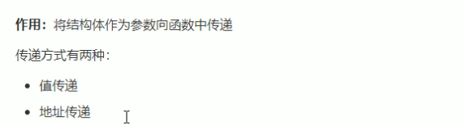
比较简单，没什么好说的
### 结构体中const使用场景


用常量指针，你无法通过函数传入的指针，来修改内存。好处是可以防止误操作

# 程序的内存模型
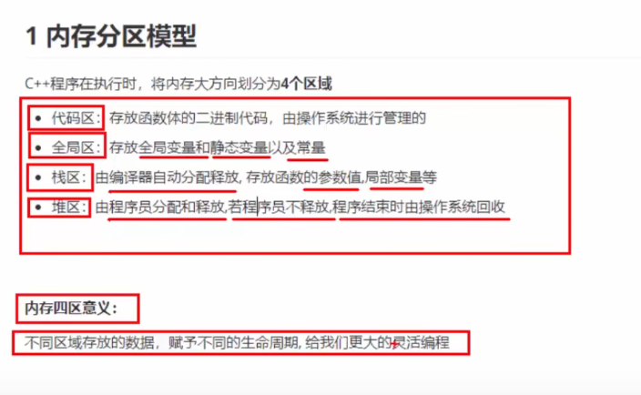
## 内存4区
和链接脚本里面的.text, .rodata, .data, .bss有什么关系？为什么有全局区？
```c
C++ 内存分区	    对应链接脚本段	            存放内容	                        生命周期
代码区	            .text	            函数体的二进制代码	                程序运行期间
全局区	        .data、.bss、.rodata	全局变量、静态变量、字符串常量等	    程序启动到结束
栈区	            栈段（Stack）	    函数参数、局部变量	                函数调用期间
堆区	            堆段（Heap）	        动态分配的内存（new/malloc）        	手动分配 / 释放
```

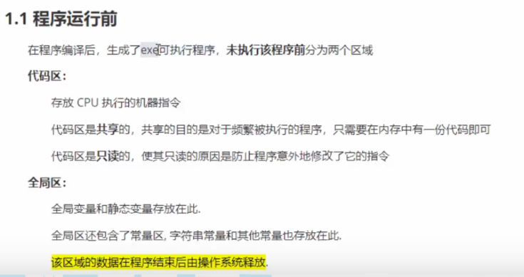


### 代码区
**.text**

### 全局区
**.rodata**
**.data**
**.bss**
> 全局变量，静态变量，
> 
> - 常量：
>   - 字符串常量：全局区
>   - const修饰全局变量：全局区
>   - const修饰局部变量：**栈区**
> 
### 栈区
**stack中**
> 局部变量，形参
### 堆区
**heap**
> 程序员自己申请，c++中，利用new

### **总结**
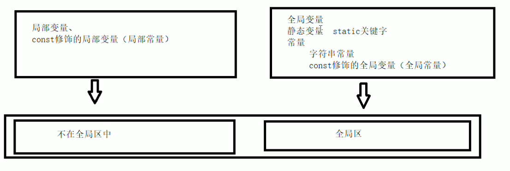
# 面向对象
# 泛型编程，STL
