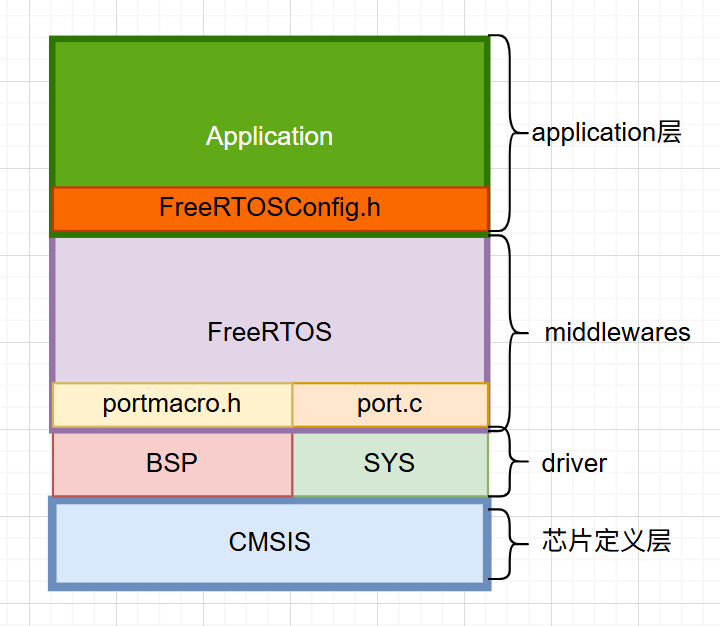
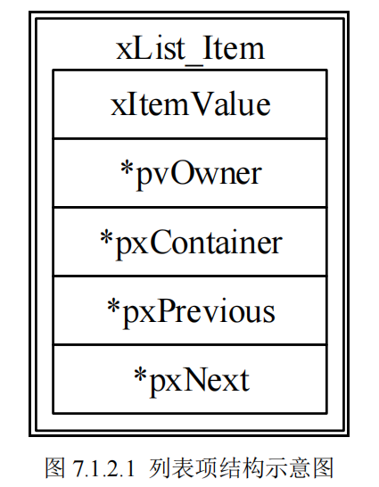
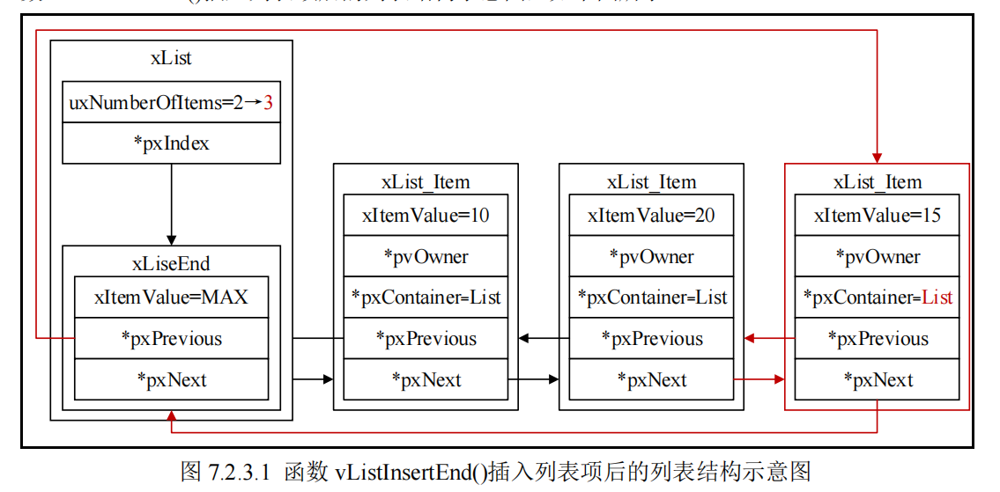
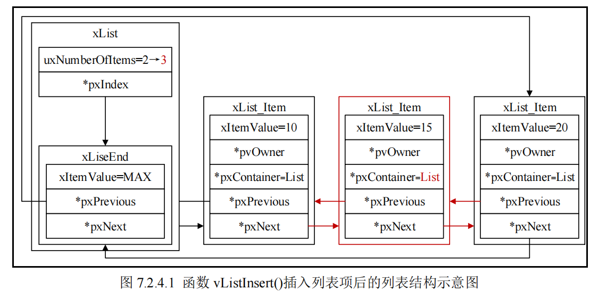
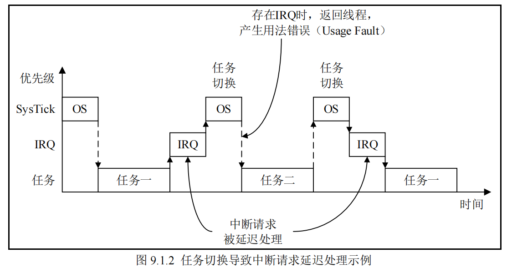

# Freertos 基础实现
## freertos 代码结构分析

## stm32中，freertos内存分布预览
stm32f103zet6 rtos的内存分布
```c
[ 高地址 (High Address) ]  0x2001 0000 (SRAM 结束/64KB)
          |
          v
+------------------------------------------+
|          System Stack (MSP)              | <--- 栈顶(Top), 向下生长 ↓
| (用于中断服务 ISR、启动前的 main 函数)      |
+------------------------------------------+
|                (空闲区)                   |
+------------------------------------------+
|        FreeRTOS Heap (ucHeap[])          | <--- 这里的管理是源码阅读重点
|  +------------------------------------+  |
|  | [空闲堆内存] (Free Heap Block)      |  |
|  +------------------------------------+  |
|  | Task B Stack (任务B栈)              |  |
|  | Task B TCB (任务B控制块)            |  |
|  +------------------------------------+  |
|  | Task A Stack (任务A栈)              |  |
|  | Task A TCB (任务A控制块)            |  |
|  +------------------------------------+  |
+------------------------------------------+
|          .bss (未初始化的全局变量)         | <--- 包括上面的 ucHeap 数组
+------------------------------------------+
|          .data (已初始化的全局变量)         |
+------------------------------------------+
   [ 低地址 (Low Address) ]   0x2000 0000 (SRAM 起始)


----------------- 物理分界线 (SRAM vs Flash) -----------------


   [ 高地址 (High Address) ]  0x0808 0000 (Flash 结束/512KB)
          |
+------------------------------------------+
|          .rodata (只读常量)               |
+------------------------------------------+
|          .text (程序代码/FreeRTOS源码)     |
+------------------------------------------+
|          Vector Table (中断向量表)        |
+------------------------------------------+
   [ 低地址 (Low Address) ]   0x0800 0000 (Flash 起始)
```

## (前置知识)，CM3中断
rtos本质上是要依赖mcu的中断来实现的，所以有必要先复习一下cm3内核的中断相关的知识了。

> **中断**是 CPU 的一种常见特性，中断一般由硬件产生，当中断发生后，会中断 CPU 当前正
在执行的程序而跳转到中断对应的服务程序种去执行
>
>ARM Cortex-M 内核的 MCU 具有一个用于中断管理的嵌套向量中断控制器（**NVIC**，全称：Nested vectored interrupt controller）。

STM32的NVIC 最多支持**256个中断源**（`16个系统中断` + `240个外部中断`）

(zet6只用到了10个系统中断 + 60个外部中断)

**1. 外部中断优先级配置**

NVIC这个外设，在芯片定义层的结构体定义：我们主要使用`IP`，来设置`外部中断优先级`，**一共240个字节，刚好对应240个外部中断**
``` c
typedef struct
{
 __IOM uint32_t ISER[8U]; /* 中断使能寄存器 */
 uint32_t RESERVED0[24U];
 __IOM uint32_t ICER[8U]; /* 中断除能寄存器 */
 uint32_t RSERVED1[24U];
 __IOM uint32_t ISPR[8U]; /* 中断使能挂起寄存器 */
 uint32_t RESERVED2[24U];
 __IOM uint32_t ICPR[8U]; /* 中断除能挂起寄存器 */
 uint32_t RESERVED3[24U];
 __IOM uint32_t IABR[8U]; /* 中断有效位寄存器 */
 uint32_t RESERVED4[56U];
 __IOM uint8_t IP[240U]; /* 中断优先级寄存器 */
 uint32_t RESERVED5[644U];
 __OM uint32_t STIR; /* 软件触发中断寄存器 */
} NVIC_Type;
```

IP的每一个字节，对应一种外部中断的优先级，但是**8位只用到了高4位**（里面又可以**再细分为抢占优先级+子优先级**），一般设置成抢占式4位，子优先级不用，这样最简单。

**2. 系统中断优先级配置**

`系统中断优先级配置`，由独立的`SHPR1、SHPR2、SHPR3`来进行配置，不是通过NVIC（因为不是嵌套嘛）。
里面，比较重要的就是`PendSV`中断和 `SysTick` 中断，`SVCall` 中断优先级

**3. 三个中断屏蔽寄存器**

1. PRIMASK
   1. 屏蔽除 NMI 和 HardFault 外的所有异常和中断，
2. FAULTMASK 
   1. 屏蔽除 NMI 外的所有异常和中断
3. BASEPRI
   1. 中断优先级`低于` BASEPRI `阈值`的中断就都会被屏蔽掉

我们主要关注的是BASEPRI这个
> 除了NMI 和 hardfault， reset这些中断是无法设置优先级的外
> 
> 剩下的所有中断（系统中断（由CM3自己受理） + 外部中断（由st的NVIC受理）），他们对外都是一致的，
> 也就是都可以被上面3个屏蔽寄存器屏蔽。
>
> 也就意味着freertos可以通过设置systick中断+pendSV中断（系统中断）的优先级为15（最低），
> 同时设置阈值5-15为rtos可控制中断，在进入临界区的时候，就可以关中断+关闭任务调度了。

**总结**：

`中断的“两个家族”`

在 Cortex-M3 内核中，所有的中断统称为“异常（Exception）”，但管理上分为两派：

- 系统异常 (System Exceptions)： 由 ARM 内核定义（如 `SVC`, `PendSV`, `SysTick`），由 `SCB `寄存器管理。

- 外部中断 (External Interrupts/IRQs)： 由芯片厂家（如 ST）定义（如 UART, Timer, DMA），由 `NVIC` 寄存器管理。

> 统一规则： 无论属于哪个家族，优先级逻辑是通用的——数字越小，优先级越高。**对外地位等价**

` 核心机制`：

- BASEPRI 与“围栏”BASEPRI 寄存器： 是 FreeRTOS 实现临界区保护的“秘密武器”。
- **工作原理**： 当 RTOS 进入临界区，会将 BASEPRI 设为 0x50。此时，硬件会自动屏蔽掉所有优先级 $\ge 5$ 的中断。
- 系统心脏： **SysTick 和 PendSV 必须被设为最低优先级 (15)**。这样它们永远不会打断硬件中断。它们在临界区内会**被一起屏蔽**，保证任务切换时内核数据（如就绪列表）的绝对安全。
- API 调用禁区： 如果在 0-4 级中断里调用了 API，会破坏 RTOS 内部链表的原子性，导致系统崩溃（通常卡在 configASSERT）。


## A. freertos 中断配置
根据freertos的框图架构，可以看出，freertos，利用NVIC和SHPR寄存器来配置内核中断+外部中断的优先级，

**pendSV 中断和systick中断优先级配置**

在port.c中
``` c
//在port.c中，定义好pendSV, systick这两个内核中断的优先级
#define portNVIC_PENDSV_PRI                   ( ( ( uint32_t ) configKERNEL_INTERRUPT_PRIORITY ) << 16UL )
#define portNVIC_SYSTICK_PRI                  ( ( ( uint32_t ) configKERNEL_INTERRUPT_PRIORITY ) << 24UL )

//这个才是实际的启动调度器，调度器内部会开始设置任务调度所需的任务的优先级。
BaseType_t xPortStartScheduler( void )
{
 /* ... */
 
 /* 设置 PendSV 和 SysTick 的中断优先级为最低中断优先级 */
 portNVIC_SHPR3_REG |= portNVIC_PENDSV_PRI;
 portNVIC_SHPR3_REG |= portNVIC_SYSTICK_PRI;
 
 /* ... */
}

//configKERNEL_INTERRUPT_PRIORITY 这个在FreeRTOSConfig.h中定义，内核中断优先级为15
```

**开关中断的接口**

``` c

//portmacro.h 中定义实际用BASEPRI来控制可控制的中断
    #define portDISABLE_INTERRUPTS()                  vPortRaiseBASEPRI()
    #define portENABLE_INTERRUPTS()                   vPortSetBASEPRI( 0 )
```

**freertos进出临界区api分两套**：
1. 普通任务进出临界区：
   1. 可嵌套
   2. 无需备份之前的basepri
2. 中断进出临界区：
   1. 不可以嵌套
   2. 需要备份之前的basepri


## B. freertos 任务
在传统的裸机开发中，一般是一个while大循环，然后里面顺序的执行函数（后台），当中断来临，这时候进入中断服务程序（前台）。

但是这在大型嵌入式系统设计中，实时性严重不足

**多任务系统**的多个任务可以“`同时`”运行，是从宏观的角度而言的，对于单核
的 CPU 而言，CPU 在同一时刻只能够处理一个任务


多任务系统的**任务也是具有优先级的**，高优先
级的任务可以像中断的抢占一样，抢占低优先级任务的 CPU 使用权

**任务调度**则分为`抢占式调度`+`时间片轮询`


**任务的状态**
1. `运行态`（正在占用cpu）
2. `就绪态`（排队等待执行）（当前有同或更高优先级的任务）
3. `阻塞态`（延时一段时间`vTaskDelay()`；等待外部事件发生(超时时间)）
4. `挂起态`（通过函数 `vTaskSuspend()`和函数 `vTaskResums()`进入和退出挂起态）


**任务优先级**

每一个任务都被分配一个`0~(configMAX_PRIORITIES-1)`的任务优先级，宏 `configMAX_PRIORITIES` 在 `FreeRTOSConfig.h`文件中定义

宏 `configMAX_PRIORITIES 的值不能超过 32`,原因是freertos里面有选择是否用硬件计算前导0指令，最大支持32位

任务优先级**高低**与其对应的优先级数值，是成**正比的**


### 任务task
在rtos中，task由TCB和栈空间组成。

`TCB结构体`如下：

``` c
typedef struct tskTaskControlBlock
{
 /* 指向任务栈栈顶的指针 */
 volatile StackType_t * pxTopOfStack;
 
#if ( portUSING_MPU_WRAPPERS == 1 )
 /* MPU 相关设置 */
 xMPU_SETTINGS xMPUSettings;
#endif
 
 /* 任务状态列表项 */
 ListItem_t xStateListItem;
 /* 任务等待事件列表项 */
 ListItem_t xEventListItem;
 /* 任务的任务优先级 */
 UBaseType_t uxPriority;
 /* 任务栈的起始地址 */
 StackType_t * pxStack;
 /* 任务的任务名 */
 char pcTaskName[ configMAX_TASK_NAME_LEN ];
 
#if ( ( portSTACK_GROWTH > 0 ) || ( configRECORD_STACK_HIGH_ADDRESS == 1 ) )
 /* 指向任务栈栈底的指针 */
 StackType_t * pxEndOfStack;
#endif
 
#if ( portCRITICAL_NESTING_IN_TCB == 1 )
 /* 记录任务独自的临界区嵌套次数 */
 UBaseType_t uxCriticalNesting;
#endif
 
#if ( configUSE_TRACE_FACILITY == 1 )
/* 由系统分配（每创建一个任务，值增加一），分配任务的值都不同，用于调试 */
 UBaseType_t uxTCBNumber;
 /* 由函数 vTaskSetTaskNumber()设置，用于调试 */
 UBaseType_t uxTaskNumber;
#endif
 
#if ( configUSE_MUTEXES == 1 )
 /* 保存任务原始优先级，用于互斥信号量的优先级翻转 */
 UBaseType_t uxBasePriority;
 /* 记录任务获取的互斥信号量数量 */
 UBaseType_t uxMutexesHeld;
#endif
 
#if ( configUSE_APPLICATION_TASK_TAG == 1 )
 /* 用户可自定义任务的钩子函数用于调试 */
 TaskHookFunction_t pxTaskTag;
#endif
 
#if ( configNUM_THREAD_LOCAL_STORAGE_POINTERS > 0 )
 /* 保存任务独有的数据 */
 void *pvThreadLocalStoragePointers[configNUM_THREAD_LOCAL_STORAGE_POINTERS];
#endif
 
#if ( configGENERATE_RUN_TIME_STATS == 1 )
 /* 记录任务处于运行态的时间 */
 configRUN_TIME_COUNTER_TYPE ulRunTimeCounter;
#endif
 
#if ( configUSE_NEWLIB_REENTRANT == 1 )
 /* 用于 Newlib */
 struct _reent xNewLib_reent;
#endif
 
#if ( configUSE_TASK_NOTIFICATIONS == 1 )
 /* 任务通知值 */
 volatile uint32_t ulNotifiedValue[ configTASK_NOTIFICATION_ARRAY_ENTRIES ];
 /* 任务通知状态 */
 volatile uint8_t ucNotifyState[ configTASK_NOTIFICATION_ARRAY_ENTRIES ];
#endif
 
#if ( tskSTATIC_AND_DYNAMIC_ALLOCATION_POSSIBLE != 0 )
 /* 任务静态创建标志 */
 uint8_t ucStaticallyAllocated;
#endif
 
#if ( INCLUDE_xTaskAbortDelay == 1 )
 /* 任务被中断延时标志 */
 uint8_t ucDelayAborted;
#endif
 
#if ( configUSE_POSIX_ERRNO == 1 )
 /* 用于 POSIX */
 int iTaskErrno;
#endif
} tskTCB;

/* The old tskTCB name is maintained above then typedefed to the new TCB_t name
 * below to enable the use of older kernel aware debuggers. */
typedef tskTCB TCB_t;

typedef struct tskTaskControlBlock * TaskHandle_t;
```

可以理解为，一个TCB（任务控制块），就是一个`任务的本体`。
一个任务TCB，里面包含了比如任务栈空间`栈顶的指针`，`优先级`，`临界区的嵌套次数`等等。

> 可以看到**所谓的任务句柄**，实际上就是**TCB内存块的指针**。

而**栈空间**，是和一个任务在运行过程中，和函数的局部变量，函数调用的现场和返回地址有关的，所以是在**创建过程**中开辟的一段内存。

#### task创建

`通过静态创建，可以很清晰的看出一个任务的内存分布和内部结构。`

**1. 静态创建**
``` c
#if ( configSUPPORT_STATIC_ALLOCATION == 1 )

    TaskHandle_t xTaskCreateStatic( TaskFunction_t pxTaskCode,
                                    const char * const pcName, 
                                    const uint32_t ulStackDepth,// 栈空间长度（StackType_t（4字节） 的个数）
                                    void * const pvParameters,
                                    UBaseType_t uxPriority,
                                    StackType_t * const puxStackBuffer,
                                    StaticTask_t * const pxTaskBuffer )
    {
        TCB_t * pxNewTCB; //先声明一个指向TCB任务本体内存区域的指针
        TaskHandle_t xReturn;

        configASSERT( puxStackBuffer != NULL ); //校验参数：任务栈空间的起始地址
        configASSERT( pxTaskBuffer != NULL );//校验参数：TCB内存起始地址

        #if ( configASSERT_DEFINED == 1 )
            {
               //校验开辟的TCB内存大小是否符合sizeof(TCB_t)
                volatile size_t xSize = sizeof( StaticTask_t );
                configASSERT( xSize == sizeof( TCB_t ) );
                ( void ) xSize; /* Prevent lint warning when configASSERT() is not used. */
            }
        #endif /* configASSERT_DEFINED */

        if( ( pxTaskBuffer != NULL ) && ( puxStackBuffer != NULL ) )
        {
            //指定这块内存作为TCB，记录下他的起始地址
            pxNewTCB = ( TCB_t * ) pxTaskBuffer; 
            //在这块内存（TCB）中记录，属于这个任务的栈空间的起始地址
            pxNewTCB->pxStack = ( StackType_t * ) puxStackBuffer;

            #if ( tskSTATIC_AND_DYNAMIC_ALLOCATION_POSSIBLE != 0 ) 
                    pxNewTCB->ucStaticallyAllocated = tskSTATICALLY_ALLOCATED_STACK_AND_TCB;
                }
            #endif /* tskSTATIC_AND_DYNAMIC_ALLOCATION_POSSIBLE */

            //初始化这块TCB，把其他剩余的TCB参数补全，并获得句柄
            prvInitialiseNewTask( pxTaskCode, pcName, ulStackDepth, pvParameters, uxPriority, &xReturn, pxNewTCB, NULL );

            //将这个新task（TCB内存空间的指针）加入就绪链表
            prvAddNewTaskToReadyList( pxNewTCB );
        }
        else
        {
            xReturn = NULL;
        }

         //返回task句柄
        return xReturn;
    }

#endif /* SUPPORT_STATIC_ALLOCATION */
```
> 注意：如果是选择静态创建，那么之后所有的任务创建都只能使用静态，包括空闲任务IDLE task， 和软件定时器服务任务
可以看开启调度器的逻辑：
```c
void vTaskStartScheduler( void )
{
    BaseType_t xReturn;

    //如果选择静态创建
    #if ( configSUPPORT_STATIC_ALLOCATION == 1 )
        {
            StaticTask_t * pxIdleTaskTCBBuffer = NULL;
            StackType_t * pxIdleTaskStackBuffer = NULL;
            uint32_t ulIdleTaskStackSize;

            //需要这个函数来获取你申请的IDLE任务的TCB，栈空间的内存
            vApplicationGetIdleTaskMemory( &pxIdleTaskTCBBuffer, &pxIdleTaskStackBuffer, &ulIdleTaskStackSize );

            //调度器自动帮你静态创建IDLE任务
            xIdleTaskHandle = xTaskCreateStatic( prvIdleTask,
                                                 configIDLE_TASK_NAME,
                                                 ulIdleTaskStackSize,
                                                 ( void * ) NULL,       
                                                 portPRIVILEGE_BIT,    
                                                 pxIdleTaskStackBuffer,
                                                 pxIdleTaskTCBBuffer ); 

            if( xIdleTaskHandle != NULL )
            {
                xReturn = pdPASS;
            }
            else
            {
                xReturn = pdFAIL;
            }
        }
    #else /* if ( configSUPPORT_STATIC_ALLOCATION == 1 ) */
        {
            //自动动态创建IDLE任务
            xReturn = xTaskCreate( prvIdleTask,
                                   configIDLE_TASK_NAME,
                                   configMINIMAL_STACK_SIZE,
                                   ( void * ) NULL,
                                   portPRIVILEGE_BIT,  
                                   &xIdleTaskHandle ); 
        }
    #endif /* configSUPPORT_STATIC_ALLOCATION */

　　//使用定时器
        #if ( configUSE_TIMERS == 1 )
        {
            if( xReturn == pdPASS )
            {
                xReturn = xTimerCreateTimerTask();
            }
            else
            {
                mtCOVERAGE_TEST_MARKER();
            }
        }
    #endif /* configUSE_TIMERS */
    //...
```
调度器如果启用了定时器`xTimerCreateTimerTask()`，则需要创建定时器任务
```c
    BaseType_t xTimerCreateTimerTask( void )
    {
        BaseType_t xReturn = pdFAIL;

        prvCheckForValidListAndQueue();

        if( xTimerQueue != NULL )
        {
            //静态创建
            #if ( configSUPPORT_STATIC_ALLOCATION == 1 )
                {
                    StaticTask_t * pxTimerTaskTCBBuffer = NULL;
                    StackType_t * pxTimerTaskStackBuffer = NULL;
                    uint32_t ulTimerTaskStackSize;

                    //和IDLE一样，需要你自己手动申请定时器任务的TCB，stack内存空间
                    vApplicationGetTimerTaskMemory( &pxTimerTaskTCBBuffer, &pxTimerTaskStackBuffer, &ulTimerTaskStackSize );
                    xTimerTaskHandle = xTaskCreateStatic( prvTimerTask,
                                                          configTIMER_SERVICE_TASK_NAME,
                                                          ulTimerTaskStackSize,
                                                          NULL,
                                                          ( ( UBaseType_t ) configTIMER_TASK_PRIORITY ) | portPRIVILEGE_BIT,
                                                          pxTimerTaskStackBuffer,
                                                          pxTimerTaskTCBBuffer );

                    if( xTimerTaskHandle != NULL )
                    {
                        xReturn = pdPASS;
                    }
                }
            #else /* if ( configSUPPORT_STATIC_ALLOCATION == 1 ) */
                {
                    //动态创建
                    xReturn = xTaskCreate( prvTimerTask,
                                           configTIMER_SERVICE_TASK_NAME,
                                           configTIMER_TASK_STACK_DEPTH,
                                           NULL,
                                           ( ( UBaseType_t ) configTIMER_TASK_PRIORITY ) | portPRIVILEGE_BIT,
                                           &xTimerTaskHandle );
                }
            #endif /* configSUPPORT_STATIC_ALLOCATION */
        }
        else
        {
            mtCOVERAGE_TEST_MARKER();
        }

        configASSERT( xReturn );
        return xReturn;
    }
```

**2. 动态创建**

```c
#if ( configSUPPORT_DYNAMIC_ALLOCATION == 1 )

    BaseType_t xTaskCreate( TaskFunction_t pxTaskCode,
                            const char * const pcName, 
                            const configSTACK_DEPTH_TYPE usStackDepth,//直接就是表示任务栈空间的大小（字）
                            void * const pvParameters,
                            UBaseType_t uxPriority,
                            TaskHandle_t * const pxCreatedTask )//最后这个参数返回自动创建的任务的TCB的地址
    {
        TCB_t * pxNewTCB;
        BaseType_t xReturn;

        //portmacro.h中定义#define portSTACK_GROWTH          ( -1 )
        //表示栈是向下增长的。

        #if ( portSTACK_GROWTH > 0 )
            {
                //忽略
            }
        #else /* portSTACK_GROWTH */
            {
                StackType_t * pxStack;

                // 用port里面绑定的heap_4.c中的方法，分配栈空间
                pxStack = pvPortMallocStack( ( ( ( size_t ) usStackDepth ) * sizeof( StackType_t ) ) ); 

                if( pxStack != NULL )
                {
                    //开始开辟TCB的内存区域
                    pxNewTCB = ( TCB_t * ) pvPortMalloc( sizeof( TCB_t ) ); 

                    if( pxNewTCB != NULL )
                    {
                        //在这个TCB中记录好该任务的栈空间起始地址
                        pxNewTCB->pxStack = pxStack;
                    }
                    else
                    {
                        vPortFreeStack( pxStack );
                    }
                }
                else
                {
                    pxNewTCB = NULL;
                }
            }
        #endif /* portSTACK_GROWTH */

        if( pxNewTCB != NULL )
        {
            #if ( tskSTATIC_AND_DYNAMIC_ALLOCATION_POSSIBLE != 0 )
                {

                    pxNewTCB->ucStaticallyAllocated = tskDYNAMICALLY_ALLOCATED_STACK_AND_TCB;
                }
            #endif /* tskSTATIC_AND_DYNAMIC_ALLOCATION_POSSIBLE */

            //和静态创建一样，开始初始化这个新的任务TCB，并返回该TCB的地址
            prvInitialiseNewTask( pxTaskCode, pcName, ( uint32_t ) usStackDepth, pvParameters, uxPriority, pxCreatedTask, pxNewTCB, NULL );
            //将该TCB的地址加入就绪任务链表
            prvAddNewTaskToReadyList( pxNewTCB );
            xReturn = pdPASS;
        }
        else
        {
            xReturn = errCOULD_NOT_ALLOCATE_REQUIRED_MEMORY;
        }

        return xReturn;
    }

#endif /* configSUPPORT_DYNAMIC_ALLOCATION */
```


**3. 删除任务**
```c
#if ( INCLUDE_vTaskDelete == 1 )

    void vTaskDelete( TaskHandle_t xTaskToDelete )
    {
        TCB_t * pxTCB;

        //进入临界区，关可控中断，关调度
        taskENTER_CRITICAL();
        {

            //获取要删除任务的TCB内存指针
            pxTCB = prvGetTCBFromHandle( xTaskToDelete );

            /* Remove task from the ready/delayed list. */
            if( uxListRemove( &( pxTCB->xStateListItem ) ) == ( UBaseType_t ) 0 )
            {
                taskRESET_READY_PRIORITY( pxTCB->uxPriority );
            }
            else
            {
                mtCOVERAGE_TEST_MARKER();
            }

            /* Is the task waiting on an event also? */
            if( listLIST_ITEM_CONTAINER( &( pxTCB->xEventListItem ) ) != NULL )
            {
                ( void ) uxListRemove( &( pxTCB->xEventListItem ) );
            }
            else
            {
                mtCOVERAGE_TEST_MARKER();
            }

            /* Increment the uxTaskNumber also so kernel aware debuggers can
             * detect that the task lists need re-generating.  This is done before
             * portPRE_TASK_DELETE_HOOK() as in the Windows port that macro will
             * not return. */
            uxTaskNumber++;

            if( pxTCB == pxCurrentTCB )
            {
                /* A task is deleting itself.  This cannot complete within the
                 * task itself, as a context switch to another task is required.
                 * Place the task in the termination list.  The idle task will
                 * check the termination list and free up any memory allocated by
                 * the scheduler for the TCB and stack of the deleted task. */
                vListInsertEnd( &xTasksWaitingTermination, &( pxTCB->xStateListItem ) );

                /* Increment the ucTasksDeleted variable so the idle task knows
                 * there is a task that has been deleted and that it should therefore
                 * check the xTasksWaitingTermination list. */
                ++uxDeletedTasksWaitingCleanUp;

                /* Call the delete hook before portPRE_TASK_DELETE_HOOK() as
                 * portPRE_TASK_DELETE_HOOK() does not return in the Win32 port. */
                traceTASK_DELETE( pxTCB );

                /* The pre-delete hook is primarily for the Windows simulator,
                 * in which Windows specific clean up operations are performed,
                 * after which it is not possible to yield away from this task -
                 * hence xYieldPending is used to latch that a context switch is
                 * required. */
                portPRE_TASK_DELETE_HOOK( pxTCB, &xYieldPending );
            }
            else
            {
                --uxCurrentNumberOfTasks;
                traceTASK_DELETE( pxTCB );

                /* Reset the next expected unblock time in case it referred to
                 * the task that has just been deleted. */
                prvResetNextTaskUnblockTime();
            }
        }
        taskEXIT_CRITICAL();

        /* If the task is not deleting itself, call prvDeleteTCB from outside of
         * critical section. If a task deletes itself, prvDeleteTCB is called
         * from prvCheckTasksWaitingTermination which is called from Idle task. */
        if( pxTCB != pxCurrentTCB )
        {
            prvDeleteTCB( pxTCB );
        }

        /* Force a reschedule if it is the currently running task that has just
         * been deleted. */
        if( xSchedulerRunning != pdFALSE )
        {
            if( pxTCB == pxCurrentTCB )
            {
                configASSERT( uxSchedulerSuspended == 0 );
                portYIELD_WITHIN_API();
            }
            else
            {
                mtCOVERAGE_TEST_MARKER();
            }
        }
    }

#endif /* INCLUDE_vTaskDelete */
```


> 任务挂起和恢复则需要结合任务列表一起分析，见下


### 任务链表与任务节点
FreeRTOS 中的列表和列表项就是数据结构中的**链表**和**节点**。

**链表**

FreeRTOS 中的**链表**是一个**双向链表**，具体定义如下：
``` c
typedef struct xLIST
{
    listFIRST_LIST_INTEGRITY_CHECK_VALUE /* 校验值 */
    volatile UBaseType_t uxNumberOfItems; /* 列表中列表项的数量 */
    ListItem_t * configLIST_VOLATILE pxIndex; /* 用于遍历列表 */
    MiniListItem_t xListEnd; /* 最后一个列表项 */
    listSECOND_LIST_INTEGRITY_CHECK_VALUE /* 校验值 */
} List_t;
```
- 这里面的两个校验值，只是用来检查链表的数据是否遭到破坏
- 成员变量 `xListEnd` 是一个`迷你链表项`（详见 7.1.3 小节），链表中迷你链表项的值一般被设置为最大值，用于将链表中的所有链表项按升序排序时，排在最末尾；同时 xListEnd 也用于挂载其他插入到链表中的链表项。
> 所以`xListEnd` 仅仅只是作为链表的末尾节点存在，不计入链表节点的个数。
- `ListItem_t`, 也就是用于遍历链表的pxIndex的指针类型，才是链表节点的真是类型。

freertos中链表的结构示意图如下：


**节点**：

freertos中链表节点的定义
```c
struct xLIST_ITEM
{
    listFIRST_LIST_ITEM_INTEGRITY_CHECK_VALUE /* 用于检测列表项的数据完整性 */
    configLIST_VOLATILE TickType_t xItemValue; /* 列表项的值 */
    struct xLIST_ITEM * configLIST_VOLATILE pxNext; /* 下一个列表项 */
    struct xLIST_ITEM * configLIST_VOLATILE pxPrevious; /* 上一个列表项 */

    void * pvOwner; /* 列表项的拥有者 */
    struct xLIST * configLIST_VOLATILE pxContainer; /* 列表项所在列表 */
    listSECOND_LIST_ITEM_INTEGRITY_CHECK_VALUE /* 用于检测列表项的数据完整性 */
};
typedef struct xLIST_ITEM ListItem_t;/* 重定义成 ListItem_t */
```

- 可以看到，每个链表节点，都拥有一个`前向指针`和一个`后向指针`,也就是双向。
- `xItemValue` 为列表项的值，这个值多用于按`升序`对链表中的节点进行排序。
- 每个链表节点，都知道，自己是属于哪一个链表的。
- `pxOwner` 用于指向包含列表项的对象（通常是任务控制块）,**这样就可以把任务TCB和链表节点挂钩**


节点结构的示意图如下：



**迷你链表项**

前面在链表的组成结构中，我们发现，每个链表都持有一个迷你链表项。

> 仅用于**标记列表的末尾**和挂载其他**插入**列表中的列表项，**用户是用不到迷你列表项的**

定义如下：
```c
struct xMINI_LIST_ITEM
{
    listFIRST_LIST_ITEM_INTEGRITY_CHECK_VALUE/* 用于检测列表项的数据完整性 */
    configLIST_VOLATILE TickType_t xItemValue; /* 列表项的值 */
    struct xLIST_ITEM * configLIST_VOLATILE pxNext; /* 下一个列表项 */
    struct xLIST_ITEM * configLIST_VOLATILE pxPrevious; /* 上一个列表项 */
};
typedef struct xMINI_LIST_ITEM MiniListItem_t;/* 重定义成 MiniListItem_t */
```

可以看出：
1. 迷你列表项支持检测数据完整性
2. xItemValue 为列表项的值，用于升序排序到最后
3. pxNext 和 pxPrevious用于指向上一个和下一个链表节点
4. 只用于标记列表的末尾和挂载其他插入列表中的列表项，因此不需要成员变量 pxOwner 和 pxContainer


以上总结了，freertos中，链表和节点的组成部分

### 链表，节点的使用

**1. 链表的初始化**：

就是写初始化List_t的内容，因为是空的，多数都是0，指向最后的迷你节点
```c
void vListInitialise(
 List_t * const pxList)
{
    /* 初始化时，列表中只有 xListEnd，因此 pxIndex 指向 xListEnd */
    pxList->pxIndex = ( ListItem_t * ) &( pxList->xListEnd );
    
    /* xListEnd 的值初始化为最大值，用于列表项升序排序时，排在最后 */
    pxList->xListEnd.xItemValue = portMAX_DELAY;
    
    /* 初始化时，列表中只有 xListEnd，因此上一个和下一个列表项都为 xListEnd 本身 */
    pxList->xListEnd.pxNext = ( ListItem_t * ) &( pxList->xListEnd );
    pxList->xListEnd.pxPrevious = ( ListItem_t * ) &( pxList->xListEnd );
    
    /*初始化时，列表中的列表项数量为 0（不包含 xListEnd） */
    pxList->uxNumberOfItems = ( UBaseType_t ) 0U;
    
    /* 初始化用于检测列表数据完整性的校验值 */
    listSET_LIST_INTEGRITY_CHECK_1_VALUE( pxList );
    listSET_LIST_INTEGRITY_CHECK_2_VALUE( pxList );
}
```


**2. 链表节点的初始化**

可以看到，也仅仅只是初始化一个空的节点，既没有指向TCB内容，也没有归属那个链表
```c
void vListInitialiseItem(
 ListItem_t * const pxItem)
{
    /* 初始化时，列表项所在列表设为空 */
    pxItem->pxContainer = NULL;
    
    /* 初始化用于检测列表项数据完整性的校验值 */
    listSET_FIRST_LIST_ITEM_INTEGRITY_CHECK_VALUE( pxItem );
    listSET_SECOND_LIST_ITEM_INTEGRITY_CHECK_VALUE( pxItem );
}
```

**3. vListInsertEnd插入到end**

是一种无序的插入方法
```c
void vListInsertEnd(
 List_t * const pxList,
 ListItem_t * const pxNewListItem)
{
    /* 获取列表 pxIndex 指向的列表项 */
    ListItem_t * const pxIndex = pxList->pxIndex;
    
    /* 检查参数是否正确 */
    listTEST_LIST_INTEGRITY( pxList );
    listTEST_LIST_ITEM_INTEGRITY( pxNewListItem );
    
    /* 更新待插入列表项的指针成员变量 */
    pxNewListItem->pxNext = pxIndex;
    pxNewListItem->pxPrevious = pxIndex->pxPrevious;
    /* 测试使用，不用理会 */
    mtCOVERAGE_TEST_DELAY();
    
    /* 更新列表中原本列表项的指针成员变量 */
    pxIndex->pxPrevious->pxNext = pxNewListItem;
    pxIndex->pxPrevious = pxNewListItem;
    
    /* 更新待插入列表项的所在列表成员变量 */
    pxNewListItem->pxContainer = pxList;
    
    /* 更新列表中列表项的数量 */
    ( pxList->uxNumberOfItems )++;
}
```

>将待插入的列表项**插入到列表 pxIndex 指向列表项的前面**，要注意的是，**pxIndex 不一定指向 xListEnd，而是有可能指向列表中任意一个列表项**

示意图如下：


> 可以直接想象成整个链表节点，**构成一个圈**：里面每个节点两两相连，可以前向，后向移动。用miniEND节点表示末尾

**4. vListInsert()**

将节点，按照节点值，**升序插入到列表**

```c
void vListInsert(
 List_t * const pxList,
 ListItem_t * const pxNewListItem)
{
    ListItem_t * pxIterator;
    const TickType_t xValueOfInsertion = pxNewListItem->xItemValue;
    
    /* 检查参数是否正确 */
    listTEST_LIST_INTEGRITY( pxList );
    listTEST_LIST_ITEM_INTEGRITY( pxNewListItem );
    
    /* 如果待插入列表项的值为最大值 */
    if( xValueOfInsertion == portMAX_DELAY )
    {
        /* 插入的位置为列表 xListEnd 前面 */
        pxIterator = pxList->xListEnd.pxPrevious;
    }
    else
    {
        /* 遍历列表中的列表项，找到插入的位置 */
        for( pxIterator = ( ListItem_t * ) &( pxList->xListEnd );
        pxIterator->pxNext->xItemValue <= xValueOfInsertion;
        pxIterator = pxIterator->pxNext )
        {
        
        }
    }
    
    /* 将待插入的列表项插入指定位置 */
    pxNewListItem->pxNext = pxIterator->pxNext;
    pxNewListItem->pxNext->pxPrevious = pxNewListItem;
    pxNewListItem->pxPrevious = pxIterator;
    pxIterator->pxNext = pxNewListItem;
    
    /* 更新待插入列表项所在列表 */
    pxNewListItem->pxContainer = pxList;
    
    /* 更新列表中列表项的数量 */
    ( pxList->uxNumberOfItems )++;
}
```
>可以看出：在将待插入列表项插入列表之前，会前**遍历列表**，找到待插入列表项需要**插入的位置**



`为什么值的类型是 TickType_t？`
>这是由 FreeRTOS 的核心应用场景决定的。
>在 RTOS 中，需要用到“升序排列链表”最主要的场景是**“延时任务列表”（Delayed Task List）**。

>为了快速查找： 当多个任务都在延时（阻塞）时，内核需要知道“谁该第一个醒来”。

>排序的基准是时间： 如果链表按“唤醒时间点”升序排列，那么表头（第一个节点）永远是那个最先到期的任务。

>类型一致性： 系统时钟（Tick Count）的类型是 TickType_t，为了能够直接存储和比较时间点，避免溢出或类型转换错误，xItemValue 必须使用相同的类型。

**5. 链表移除节点**

这个就很简单了，不用细说了

**6. 链表的操作**

这里已经提供给我们了，有很多方便的宏，可以帮助我们直接操作链表和节点


## freertos的启动流程
上面已经分析了freertos的中断设置，任务，链表节点，下面来看一下freertos的启动流程来

**讲解 FreeRTOS 系统启动到第一个任务开始运行的一整个流程**

### 1. 裸机
这里就和普通的裸机程序一样，你要先初始化好所有需要的硬件，比如HAL的init，可以配置好基础的systick中断，定时器的初始化，lcd屏幕的初始化，key的初始化等。

之后就是创建好任务xTaskCreate，在堆中开辟好你的任务的TCB+Stack内存。
之后就是启动任务调度器，接下来，调度器便会开始任务调度。
>调度器除非被关掉，否则不会再回到裸机的主程序中了。


### 2. 开启任务调度器

开启任务调度器的代码如下：
```c
void vTaskStartScheduler( void )
{
    BaseType_t xReturn;

    /* Add the idle task at the lowest priority. */
    #if ( configSUPPORT_STATIC_ALLOCATION == 1 )
        {
            //静态创建IDLE空闲任务
        }
    #else /* if ( configSUPPORT_STATIC_ALLOCATION == 1 ) */
        {
            //动态创建IDLE空闲任务
            xReturn = xTaskCreate( prvIdleTask,
                                   configIDLE_TASK_NAME,
                                   configMINIMAL_STACK_SIZE,
                                   ( void * ) NULL,
                                   portPRIVILEGE_BIT,  /* In effect ( tskIDLE_PRIORITY | portPRIVILEGE_BIT ), but tskIDLE_PRIORITY is zero. */
                                   &xIdleTaskHandle ); /*lint !e961 MISRA exception, justified as it is not a redundant explicit cast to all supported compilers. */
        }
    #endif /* configSUPPORT_STATIC_ALLOCATION */

    //创建定时器任务，如果启用软件定时器
    #if ( configUSE_TIMERS == 1 )
        {
            if( xReturn == pdPASS )
            {
                xReturn = xTimerCreateTimerTask();
            }
            else
            {
                mtCOVERAGE_TEST_MARKER();
            }
        }
    #endif /* configUSE_TIMERS */

    if( xReturn == pdPASS )
    {
        //此函数用于添加一些附加初始化，不用理会
        #ifdef FREERTOS_TASKS_C_ADDITIONS_INIT
            {
                freertos_tasks_c_additions_init();
            }
        #endif

        /* FreeRTOS 关闭中断，
        * 以保证在开启任务任务调度器之前或过程中，SysTick 不会产生中断，
        * 在第一个任务开始运行时，会重新打开中断。
        */
        portDISABLE_INTERRUPTS();

        #if ( configUSE_NEWLIB_REENTRANT == 1 )
            {
                //newlib相关
                _impure_ptr = &( pxCurrentTCB->xNewLib_reent );
            }
        #endif /* configUSE_NEWLIB_REENTRANT */

        //下一个距离取消任务阻塞的时间，初始化为最大值
        xNextTaskUnblockTime = portMAX_DELAY;

        //设置调度器状态为运行中
        xSchedulerRunning = pdTRUE;

        //滴答计数 == 0
        xTickCount = ( TickType_t ) configINITIAL_TICK_COUNT;

        /* 运行时间和任务状态统计相关定义 */
        /* FreeRTOSConfig.h中定义
                #define configGENERATE_RUN_TIME_STATS                   0                       /* 1: 使能任务运行时间统计功能, 默认: 0 
                #if configGENERATE_RUN_TIME_STATS
                #include "./BSP/TIMER/btim.h"
                #define portCONFIGURE_TIMER_FOR_RUN_TIME_STATS()        ConfigureTimeForRunTimeStats()
                extern uint32_t FreeRTOSRunTimeTicks;
                #define portGET_RUN_TIME_COUNTER_VALUE()                FreeRTOSRunTimeTicks
*/
        portCONFIGURE_TIMER_FOR_RUN_TIME_STATS();

        traceTASK_SWITCHED_IN(); /* 调试使用，不用理会 */

        /* 设置用于系统时钟节拍的硬件定时器（SysTick）
        * 会在这个函数中进入第一个任务，并开始任务调度
        * 任务调度开启后，便不会再返回
        */
        if( xPortStartScheduler() != pdFALSE )
        {
            /* Should not reach here as if the scheduler is running the
             * function will not return. */
        }
        else
        {
            /* Should only reach here if a task calls xTaskEndScheduler(). */
        }
    }
    else
    {
      /* 动态方式创建空闲任务和定时器服务任务（如果有）时，因分配给 FreeRTOS 的堆空间
        * 不足，导致任务无法成功创建 */
        configASSERT( xReturn != errCOULD_NOT_ALLOCATE_REQUIRED_MEMORY );
    }

    /* 防止编译器警告，不用理会 */
    ( void ) xIdleTaskHandle;

    /* 调试使用，不用理会 */
    ( void ) uxTopUsedPriority;
}
```
所以，task中启动调度器的核心就是另外创建两个task:IDLE + (软件定时器任务，如果需要)

之后就是xPortStartScheduler来真正设置systick中断，来进行调度。

**总结一下**，启动调度器里面的工作：
1. 创建空闲任务
2. 创建定时器服务任务
3. 关闭中断，防止 SysTick 中断在任务调度器开启之前或过程中，产生中断。（在开始运行第一个任务时，重新打开中断）
4. 初始化一些全局变量，并将任务调度器的运行标志设置为已运行
5. 单开一个时基定时器，用于任务运行时间统计功能（如果不用就不需要）
6. 调用函数 xPortStartScheduler()

下面看一下，实际进行任务调度的xPortStartScheduler()的实现：
```c
BaseType_t xPortStartScheduler( void )
{
    #if ( configASSERT_DEFINED == 1 )
        {
            /* 检测用户在 FreeRTOSConfig.h 文件中对中断相关部分的配置是否有误，代码省略 */
        }
    #endif /* configASSERT_DEFINED */

    /* 设置 PendSV 和 SysTick 的中断优先级为最低优先级 */
    portNVIC_SHPR3_REG |= portNVIC_PENDSV_PRI;
    portNVIC_SHPR3_REG |= portNVIC_SYSTICK_PRI;

    /* 重新配置 SysTick的中断周期，比如说现在是1ms一次systick中断
        * 清空 SysTick 的计数值
        * 根据 configTICK_RATE_HZ 配置 SysTick 的重装载值
        * 开启 SysTick 计数和中断
    */
    vPortSetupTimerInterrupt();

    /* 初始化临界区嵌套次数计数器为 0 */
    uxCriticalNesting = 0;

    /* 启动第一个任务 */
    prvStartFirstTask();

    /* Should not get here! */
    return 0;
}
```

**总结一下**port里面，开启调度器的工作内容：
1. 断言配置的检查
2. 配置 PendSV 和 SysTick 的中断优先级为最低优先级
3. 根据FreeRTOSConfig.h 文件中配置的systick中断周期，重新设置systick中断, 然后启动 SysTick 计数和中断
4. 初始化临界区嵌套计数器为 0
5. prvStartFirstTask()启动第一个任务

### 3. 启动第一个任务

下面看一下是如何启动第一个任务的prvStartFirstTask()
```c
__asm void prvStartFirstTask( void )
{
    //8 字节对齐
    PRESERVE8

    ldr r0, =0xE000ED08  /* 0xE000ED08 为 VTOR 地址 */
    ldr r0, [ r0 ]      /* 获取 VTOR 的值 */
    ldr r0, [ r0 ]      /* 获取 MSP 的初始值 */

    /* 初始化 MSP ， 把栈指针指向起始地址*/
    msr msp, r0

   /* 使能全局中断 */
    cpsie i
    cpsie f
    dsb
    isb

    /* 调用 SVC 启动第一个任务 */
    svc 0
    nop
    nop
/* *INDENT-ON* */
}
```

这里实际开启第一个任务，已经完全由汇编来实现了。

1. **保证8字节对齐**，这是ARM 官方定义了一套标准，叫做 AAPCS，在调用公共接口（即函数切换、中断进入）时，堆栈指针 SP 必须保持 8 字节对齐，c程序在编译阶段，就会默认进行8字节对齐。
2. 读取0xE000ED08（VTOR）取值，存放的就是 MSP 的初始地址，在启动调度器前，彻底回收启动阶段占用的栈空间，**让 MSP 重新回到最干净的状态**
   1. 实际Cotex-M提供了两个栈空间，`MSP`（主栈指针,系统内核使用，比如中断） 和 `PSP`（进程栈指针，任务栈使用），当使用不同的堆栈指针时，`SP` 会等于当前使用的堆栈指针
   2. 0xE000ED08 是 VTOR（向量表偏移寄存器）的地址，`VTOR` 中保存了**向量表的偏移地址**。
   3. 一般来说向量表是从其实地址 0x00000000 开始的
   4. ARM Corten-M 提供了 `VTOR` 对向量表进行`重定向`。而向量表是用来保存中断异常的入口函数地址，即栈顶地址的

```c
//可以看到，中断向量表IVT的最初是存放MSP，也就是系统栈的起始地址，
__Vectors   DCD __initial_sp ; 栈底指针
            DCD Reset_Handler ; Reset Handler
            DCD NMI_Handler ; NMI Handler
            DCD HardFault_Handler ; Hard Fault Handler
            DCD MemManage_Handler ; MPU Fault Handler
```

>所以这个操作，相当于丢弃了程序之前保存在栈中的数据，因此也就无法返回，因为刷掉了内核栈空间

3. 重新使能全局中断,因为在taskstartSchedule中，曾经关掉了可控的所有中断
4. 使用 `SVC 指令`，并传入`系统调用号 0`，触发 `SVC 中断`


既然，SVC是一个触发中断，那么CM3内核在接收到SVC 0的指令后，会跳转执行SVC中断服务程序：
``` c
//start.S中的IVT，可以看到，确实有SVC的中断服务程序
                DCD     SVC_Handler                ; SVCall Handler
```

原本他是要跳转到SVC_Handler程序的，这本来定义在裸机的中断.c文件中，但是我们在移植freertos时，就已经把他屏蔽掉了，换成了我们自己的SVC中断处理程序
vPortSVCHandler（）

```c
__asm void vPortSVCHandler( void )
{
    /* 8字节对齐*/
    PRESERVE8

    /* 获取任务栈地址 */
    ldr r3, = pxCurrentTCB   /* r3 指向优先级最高的就绪态任务的任务控制块的内存块 */
    ldr r1, [ r3 ]           /* r1 为任务控制块地址 */
    ldr r0, [ r1 ]           /* r0 为任务控制块的第一个元素（栈顶） */

    /* 模拟出栈，并设置 PSP */
    ldmia r0 !, { r4 - r11 } /* 任务栈弹出到 CPU 寄存器 */
    msr psp, r0              /* 设置 PSP 为任务栈指针 */
    isb

    /* 使能所有中断 */
    mov r0, # 0
    msr basepri, r0

    /* 使用 PSP 指针，并bx跳转到任务函数 */
    orr r14, # 0xd
    bx r14
/* *INDENT-ON* */
}
```
这里就是跳转到当前需要执行的第一个任务来执行：
1. `pxCurrentTCB` 是一个`全局变量`，根据他的第一个成员变量，可以得到这个`任务栈的地址`，在前面创建 start_task 任务、空闲任务、定时器处理任务时自动根据任务的优先级高低进行赋值的

> 这里**总结一下**：
> 中断优先级（0-15，越小越大，所有pendSV, systick都是最小）
> 任务优先级（0-31，越大越大）
>       start_task 任务   优先级 1
>       IDLE任务          优先级 0
>       定时器处理任务     优先级 31

因此：因此当进入 `SVC 中断`时，`pxCurrentTCB` 就是指向了`定时器处理任务的任务控制块`。

2. 将`任务栈`中的内容`出栈到 CPU 寄存器中`，任务栈中的内容在调用任务创建函数的时候`已经初始化了`
3. 然后再设置 PSP 指针，那么，这么一来，任务的运行环境就准备好了
4. 开中断
5. 跳转任务的函数中去执行
   
关于最后一句**r14的寄存器是如何实现跳转执行的**，这里面有一些技术细节：
>进入中断后 r14 为 `EXC_RETURN` 的具体应用就是，通过判断`EXC_RETURN` 的 bit4 是否为 0，来判断任务是否使用了浮点单元。最后通过 `bx r14 `指令，**跳转到任务的任务函数中执行**，执行此指令，CPU 会`自动从 PSP 指向的栈中出栈 R0、R1、R2、R3、R12、LR、PC、xPSR 寄存器`，并且如果 EXC_RETURN 的bit4 为 0（使用了浮点单元），那么 CPU 还会自动恢复浮点寄存器


### 4. 任务状态列表
以上，我们就分析了，**freertos的启动流程**，如何一步一步，从
1. 裸机初始化硬件，到
2. 创建任务，在堆区自己开辟出任务内存区域，然后
3. 调用task启动调度器函数
   1. 创建IDLE任务
   2. 创建定时器任务（如有）
   3. port启动调度器
      1. 清楚MSP裸机的栈空间
      2. bx r14, 跳转第一个任务

下面，我需要看一下，任务task,在freertos中是如何被编排调度的呢，前面我们说了，freertos中的任务状态：
1. 运行态
2. 就绪态
3. 阻塞态
4. 挂起态

**那任务是如何体现自己当前是哪个态的呢？**

>答案：**除了运行态**，任务状态的**其他三种**任务都有`其对应的任务状态链表`

FreeRTOS 使用这些任务状态列表来管理处于不同状态的任务

`task.c`中对任务状态链表的定义如下：
```c
/* 就绪态任务列表 */
PRIVILEGED_DATA static List_t pxReadyTasksLists[ configMAX_PRIORITIES ]; 

/* 阻塞态任务列表 */
PRIVILEGED_DATA static List_t xDelayedTaskList1;                         
PRIVILEGED_DATA static List_t xDelayedTaskList2;                         
PRIVILEGED_DATA static List_t * volatile pxDelayedTaskList;              
PRIVILEGED_DATA static List_t * volatile pxOverflowDelayedTaskList;     

/* 挂起态任务列表 */
PRIVILEGED_DATA static List_t xPendingReadyList;                        

```

可以看到，
1. `就绪态任务链表`，是一个链表数组，**数组大小=最大任务优先级**
   1. 就是说，每种优先级的任务，全部处在一个链表中
2. `阻塞态任务列表`，阻塞态任务列表一共有`两个`，分别为是阻塞态任务列表 1 和阻塞态任务列表 2，并且该有`两个`阻塞态任务`列表指针`。
   1. 这么做的么的是**为了解决任务阻塞时间溢出的问题(超时)**，这个会在后续讲解阻塞相关的内容时，具体分析
3. `挂起态任务列表`，被挂起的任务就会被添加到挂起态任务列表中

### 5. 任务的操作 与 任务状态
下面，要结合任务的创建，删除等任务操作，来看看，如何利用这些链表，来实现任务在不同状态的切换
 
#### xTaskCreate()
```c
BaseType_t xTaskCreate( TaskFunction_t pxTaskCode,
                        const char * const pcName,
                        const configSTACK_DEPTH_TYPE usStackDepth,
                        void * const pvParameters,
                        UBaseType_t uxPriority,
                        TaskHandle_t * const pxCreatedTask)
{
    //申请TCB+STACK内存空间

    
    /* 初始化TCB任务控制块中的成员变量 */
    prvInitialiseNewTask( pxTaskCode,
                        pcName,
                        ( uint32_t ) usStackDepth,
                        pvParameters,
                        uxPriority,
                        pxCreatedTask,
                        pxNewTCB,
                        NULL);

    /* 将任务添加到就绪态任务列表中
    * 这个函数会同时比较就绪态任务列表中的任务优先级
    * 并更新 pxCurrentTCB 为就绪态任务列表中优先级最高的任务
    */
    prvAddNewTaskToReadyList( pxNewTCB );
    /* 返回 pdPASS，说明任务创建成功 */
    xReturn = pdPASS;

    //错误判断...

}
```
##### prvInitialiseNewTask() 初始化TCB
那么核心就是`prvInitialiseNewTask()`他如何初始化一个任务TCB的，新创建的任务，是什么状态的？
```c
static void prvInitialiseNewTask( TaskFunction_t pxTaskCode,
                                  const char * const pcName, /*lint !e971 Unqualified char types are allowed for strings and single characters only. */
                                  const uint32_t ulStackDepth,
                                  void * const pvParameters,
                                  UBaseType_t uxPriority,
                                  TaskHandle_t * const pxCreatedTask,
                                  TCB_t * pxNewTCB,
                                  const MemoryRegion_t * const xRegions )
{
    StackType_t * pxTopOfStack;
    UBaseType_t x;

    #if ( portUSING_MPU_WRAPPERS == 1 )
        //MPU 相关
    #endif 

    //将新建任务的任务栈设置为已知值（由宏 tskSTACK_FILL_BYTE 定义）
    #if ( tskSET_NEW_STACKS_TO_KNOWN_VALUE == 1 )
        {
            /* 将任务栈写满 tskSTACK_FILL_BYTE */
            ( void ) memset( pxNewTCB->pxStack, ( int ) tskSTACK_FILL_BYTE, ( size_t ) ulStackDepth * sizeof( StackType_t ) );
        }
    #endif

    /* 宏 portSTACK_GROWTH 用于定义栈的生长方向
    * STM32 的栈是向下生长的，
    * 因此宏 portSTACK_GROWTH 定义为-1
    */
    #if ( portSTACK_GROWTH < 0 )
           {
            /* 获取任务栈的栈顶地址 */
            pxTopOfStack = &( pxNewTCB->pxStack[ ulStackDepth - ( uint32_t ) 1 ] );

            /* 对栈顶地址按宏 portBYTE_ALIGNMENT_MASK 进行字节对齐（8 字节对齐） */
            pxTopOfStack = ( StackType_t * ) ( ( ( portPOINTER_SIZE_TYPE ) pxTopOfStack ) & ( ~( ( portPOINTER_SIZE_TYPE ) portBYTE_ALIGNMENT_MASK ) ) ); 

            /* 断言检查是否对齐. */
            configASSERT( ( ( ( portPOINTER_SIZE_TYPE ) pxTopOfStack & ( portPOINTER_SIZE_TYPE ) portBYTE_ALIGNMENT_MASK ) == 0UL ) );

            //此宏用于开启栈顶地址最大值记录功能（用于调试，不用理会）
            #if ( configRECORD_STACK_HIGH_ADDRESS == 1 )
                {
                    /* Also record the stack's high address, which may assist
                     * debugging. */
                    pxNewTCB->pxEndOfStack = pxTopOfStack;
                }
            #endif /* configRECORD_STACK_HIGH_ADDRESS */
        }
    #else 
        {
            //....
        }
    #endif

    /* 初始化TCB中的任务名成员变量 */
    if( pcName != NULL )
    {
        /* 任务名的最大长度由宏 configMAX_TASK_NAME_LEN 定义 */
        for( x = ( UBaseType_t ) 0; x < ( UBaseType_t ) configMAX_TASK_NAME_LEN; x++ )
        {
            /* 复制任务名 */
            pxNewTCB->pcTaskName[ x ] = pcName[ x ];

            /* 任务名的长度不足宏 configMAX_TASK_NAME_LEN，则提前退出循环 */
            if( pcName[ x ] == ( char ) 0x00 )
            {
                break;
            }
            else
            {
                mtCOVERAGE_TEST_MARKER();
            }
        }

        /* 在任务名成员变量末尾加上'\0' */
        pxNewTCB->pcTaskName[ configMAX_TASK_NAME_LEN - 1 ] = '\0';
    }
    else
    {
        /* 没主动命名，默认给个0 */
        pxNewTCB->pcTaskName[ 0 ] = 0x00;
    }

    /* 检查任务优先级数值是否合法 */
    configASSERT( uxPriority < configMAX_PRIORITIES );

    /* 确保任务优先级数值合法 */
    if( uxPriority >= ( UBaseType_t ) configMAX_PRIORITIES )
    {
        uxPriority = ( UBaseType_t ) configMAX_PRIORITIES - ( UBaseType_t ) 1U;
    }
    else
    {
        mtCOVERAGE_TEST_MARKER();
    }

    /* 初始化TCB中任务优先级成员变量 */
    pxNewTCB->uxPriority = uxPriority;

    /* 此宏用于启用互斥信号量，置0互斥量递归持有数，以及应对优先级翻转的备份 */
    #if ( configUSE_MUTEXES == 1 )
        {
            pxNewTCB->uxBasePriority = uxPriority;
            pxNewTCB->uxMutexesHeld = 0;
        }
    #endif

    /* 初始化 任务状态链表节点 和 事件链表节点 的成员变量 */
    vListInitialiseItem( &( pxNewTCB->xStateListItem ) );
    vListInitialiseItem( &( pxNewTCB->xEventListItem ) );

    /* 绑定 任务状态链表节点 和　任务TCB*/
    listSET_LIST_ITEM_OWNER( &( pxNewTCB->xStateListItem ), pxNewTCB );

    /* 初始化　事件链表节点　的值与任务优先级成反比（链表中的链表节点按照链表节点的值，以升序排序） */
    listSET_LIST_ITEM_VALUE( &( pxNewTCB->xEventListItem ), ( TickType_t ) configMAX_PRIORITIES - ( TickType_t ) uxPriority ); 

    /* 绑定 事件链表节点 和　任务TCB */
    listSET_LIST_ITEM_OWNER( &( pxNewTCB->xEventListItem ), pxNewTCB );

    /* 此宏用于启用任务单独临界区嵌套计数 */
    #if ( portCRITICAL_NESTING_IN_TCB == 1 )
        {
            pxNewTCB->uxCriticalNesting = ( UBaseType_t ) 0U;
        }
    #endif /* portCRITICAL_NESTING_IN_TCB */

    /* 此宏用于用于自定义任务的钩子函数（用于调试，不用理会） */
    #if ( configUSE_APPLICATION_TASK_TAG == 1 )
        {
            pxNewTCB->pxTaskTag = NULL;
        }
    #endif /* configUSE_APPLICATION_TASK_TAG */

    /* 此宏用于启用任务运行时间统计功能 */
    #if ( configGENERATE_RUN_TIME_STATS == 1 )
        {
            pxNewTCB->ulRunTimeCounter = ( configRUN_TIME_COUNTER_TYPE ) 0;
        }
    #endif /* configGENERATE_RUN_TIME_STATS */

    /* 此宏为 MPU 的相关配置，不用理会 */
    #if ( portUSING_MPU_WRAPPERS == 1 )
        {
            vPortStoreTaskMPUSettings( &( pxNewTCB->xMPUSettings ), xRegions, pxNewTCB->pxStack, ulStackDepth );
        }
    #else
        {
            /* Avoid compiler warning about unreferenced parameter. */
            ( void ) xRegions;
        }
    #endif

    /* 此宏用于保存任务独有数据 */
    #if ( configNUM_THREAD_LOCAL_STORAGE_POINTERS != 0 )
        {   /* 任务独有数据记录数组初始化为 0 */
            memset( ( void * ) &( pxNewTCB->pvThreadLocalStoragePointers[ 0 ] ), 0x00, sizeof( pxNewTCB->pvThreadLocalStoragePointers ) );
        }
    #endif

    /* 此宏用于启用任务通知功能 */
    #if ( configUSE_TASK_NOTIFICATIONS == 1 )
        {
            /* 任务通知值和任务通知状态初始化为 0 */
            memset( ( void * ) &( pxNewTCB->ulNotifiedValue[ 0 ] ), 0x00, sizeof( pxNewTCB->ulNotifiedValue ) );
            memset( ( void * ) &( pxNewTCB->ucNotifyState[ 0 ] ), 0x00, sizeof( pxNewTCB->ucNotifyState ) );
        }
    #endif

    /* 此宏与 Newlib 相关，不用理会 */
    #if ( configUSE_NEWLIB_REENTRANT == 1 )
        {
            _REENT_INIT_PTR( ( &( pxNewTCB->xNewLib_reent ) ) );
        }
    #endif

    /* 此宏用于启用任务延时中断功能 */  
    #if ( INCLUDE_xTaskAbortDelay == 1 )
        {/* 任务被中断延时标志初始化为假 */
            pxNewTCB->ucDelayAborted = pdFALSE;
        }
    #endif

    /* 此宏为 MPU 的相关配置，不用理会 */
    #if ( portUSING_MPU_WRAPPERS == 1 )
        {
            //......
        }
    #else
        {
            /* 此部分用于初始化任务栈
            * 分为三种情况
            * 1. 启用了栈溢出检测功能并且栈的生长方向向下
            * 2. 启用了栈溢出检测功能并且栈的生长方向向上
            * 3. 未启用栈溢出检测功能（本教程着重分析这种情况）
            */
            #if ( portHAS_STACK_OVERFLOW_CHECKING == 1 )
                {
                    #if ( portSTACK_GROWTH < 0 )
                        {
                            //初始化任务栈
                            pxNewTCB->pxTopOfStack = pxPortInitialiseStack( pxTopOfStack, pxNewTCB->pxStack, pxTaskCode, pvParameters );
                        }
                    #else /* portSTACK_GROWTH */
                        {
                            //....
                        }
                    #endif /* portSTACK_GROWTH */
                }
            #else /* portHAS_STACK_OVERFLOW_CHECKING */
                {
                    pxNewTCB->pxTopOfStack = pxPortInitialiseStack( pxTopOfStack, pxTaskCode, pvParameters );
                }
            #endif /* portHAS_STACK_OVERFLOW_CHECKING */
        }
    #endif /* portUSING_MPU_WRAPPERS */

    //返回任务句柄
    if( pxCreatedTask != NULL )
    {
        *pxCreatedTask = ( TaskHandle_t ) pxNewTCB;
    }
    else
    {
        mtCOVERAGE_TEST_MARKER();
    }
}
```
以上就是函数 `prvInitialiseNewTask()`的具体代码，可以看到函数 `prvInitialiseNewTask()`就是
**初始化了任务控制块TCB中的成员变量**，其中比较重要的操作就是调用函数 `pxPortInitialiseStack`()初始化了任务栈。

那么`pxPortInitialiseStack()`他是如何**初始化任务栈**的呢？

##### pxPortInitialiseStack() 初始化任务栈

> 这里的初始化栈，就是要在任务切换到这个task的时候，从栈中弹出要执行的环境，就是用以**恢复该任务的上下文**
包括 `xPSR 寄存器的初始值`、任务的函数地址（`PC` 寄存器）、任务错误退出函数地址（`LR` 寄存器）、任务函数的`传入参数（R0 寄存器`）以及为 `R1~R12 寄存器预留空间`，若使用了浮点单元，那么还会有 EXC_RETURN 的值。
> 同时该函数会**返回更新后的栈顶指针**


> **注意**：
> 针 对 ARM Cortex-M3 和针对 ARM Cortex-M4 和 ARM Cortex-M7 内 核 的 函 数
pxPortInitialiseStack()稍有不同，原因在于 ARM Cortex-M4 和 ARM Cortex-M7 内核具有浮点单
元，因此在任务栈中还需保存浮点寄存器的值


```c
/*
 * See header file for description.
 */
StackType_t * pxPortInitialiseStack( StackType_t * pxTopOfStack,/* 任务栈顶指针 */
                                     TaskFunction_t pxCode,/* 任务函数地址 */
                                     void * pvParameters )/* 任务函数传入参数 */
{
    /* 模拟栈的格式将信息保存到任务栈中，用于上下文切换 */
    pxTopOfStack--;                                                      
    /* xPSR 寄存器初始值为 0x01000000 */
    *pxTopOfStack = portINITIAL_XPSR;                                    /* xPSR */
    pxTopOfStack--;
    /* 任务函数的地址（PC 寄存器） */
    *pxTopOfStack = ( ( StackType_t ) pxCode ) & portSTART_ADDRESS_MASK; /* PC */
    pxTopOfStack--;

    /* 任务错误退出函数地址（LR 寄存器） */
    *pxTopOfStack = ( StackType_t ) prvTaskExitError;                    /* LR */

    /* 为 R12、R3、R2、R1 寄存器预留空间 */
    pxTopOfStack -= 5;                                                   
    /* 任务函数的传入参数（R0 寄存器） */
    *pxTopOfStack = ( StackType_t ) pvParameters;                        /* R0 */

    /* 为 R11、R10、R9、R8、R7、R6、R5、R4 寄存器预留空间 */
    pxTopOfStack -= 8;                                                   


    /* 返回更新后的任务栈指针
    * 后续任务运行时需要用到栈的地方，
    * 将从这个地址开始保存信息
    */
    return pxTopOfStack;
}
```
如果是M4、M7的内核，还有什么浮点数相关的地方，也要预留栈的位置

最终，初始化任务栈构造出来的栈内容如下所示


##### prvAddNewTaskToReadyList() 加入就绪队列
`prvAddNewTaskToReadList()`用于将新建的任务添加到就绪态任务列表中

函数同样定义在task.c中
```c
static void prvAddNewTaskToReadyList( TCB_t * pxNewTCB )
{
    /* 进入临界区，确保在操作就绪态任务列表时，中断不会访问链表 */
    taskENTER_CRITICAL();
    {
        /* 此全局变量用于记录系统中任务数量 */
        uxCurrentNumberOfTasks++;

        /* 此pxCurrentTCB全局变量用于指示当前系统中处于就 绪态任务中 优先级最高 的任务
            * 如果该全局变量为空（NULL），
            * 即表示当前创建的任务为系统中的唯一的就绪任务
        */
        if( pxCurrentTCB == NULL )
        {
            /* 系统中无其他就绪任务，因此优先级最高的就绪态任务（下一个待执行的任务）为当前创建的任务 */
            pxCurrentTCB = pxNewTCB;

            /* 如果当前系统中任务数量为 1，
                * 即表示当前创建的任务为系统中第一个任务
                */
            if( uxCurrentNumberOfTasks == ( UBaseType_t ) 1 )
            {
                /* 初始化任务列表（就绪态任务链表，任务阻塞链表） */
                prvInitialiseTaskLists();
            }
            else
            {
                mtCOVERAGE_TEST_MARKER();
            }
        }
        else
        {
            /* 判断任务调度器是否运行 */
            if( xSchedulerRunning == pdFALSE )
            {
                /* 
                * 将 pxCurrentTCB 更新为优先级最高的就绪态任务
                */
                if( pxCurrentTCB->uxPriority <= pxNewTCB->uxPriority )
                {
                    pxCurrentTCB = pxNewTCB;
                }
                else
                {
                    mtCOVERAGE_TEST_MARKER();
                }
            }
            else
            {
                mtCOVERAGE_TEST_MARKER();
            }
        }
        /* 用于调试，不用理会 */
        uxTaskNumber++;

        #if ( configUSE_TRACE_FACILITY == 1 )
            {
                /* Add a counter into the TCB for tracing only. */
                pxNewTCB->uxTCBNumber = uxTaskNumber;
            }
        #endif /* configUSE_TRACE_FACILITY */
        traceTASK_CREATE( pxNewTCB );

        /* 将任务添加到就绪态任务列表中 */
        prvAddTaskToReadyList( pxNewTCB );

        portSETUP_TCB( pxNewTCB );
    }

    /* 退出临界区 */
    taskEXIT_CRITICAL();


    /* 如果任务调度器正在运行，
    * 那么就需要判断，当前新建的任务优先级是否最高
    * 如果是，则需要切换任务
    */
    if( xSchedulerRunning != pdFALSE )
    {
        /* 如果当前新建的任务优先级高于 pxCurrentTCB 的优先级 */
        if( pxCurrentTCB->uxPriority < pxNewTCB->uxPriority )
        {
            /* 进行任务切换 */
            taskYIELD_IF_USING_PREEMPTION();
        }
        else
        {
            mtCOVERAGE_TEST_MARKER();
        }
    }
    else
    {
        mtCOVERAGE_TEST_MARKER();
    }
}
```

总之，`prvAddTaskToReadyList()`主要就完成两件事:
1. 记录任务优先级(FreeRTOS 会以`位图`的方式记录就绪态任务列表中就绪态任务的优先级，这样能够提
高切换任务时的`效率`)
2. 根据任务调度器的运行状态,决 定 是 否 进 行 任 务 切 换,`taskYIELD_IF_USING_PREEMPTION`()进行任务切换,关于任务切换，后面讨论


#### vTaskDelete() 删除任务
task.c中定义
```c
    void vTaskDelete( TaskHandle_t xTaskToDelete )
    {
        TCB_t * pxTCB;

        /* 进入临界区 */
        taskENTER_CRITICAL();
        {
            /* 如果传入的任务句柄为空（NULL）
            * 此函数会将待删除的任务设置为调用该函数的任务本身
            * 因此，如果要在任务中删除任务本身，
            * 那么可以调用函数 vTaskDelete()，并传入任务句柄，
            * 或传入 NULL
            */
            pxTCB = prvGetTCBFromHandle( xTaskToDelete );

            /* 将任务从任务所在任务状态列表（就绪态任务列表 或 阻塞态任务列表）中移除
            * 如果移除后列表中的列表项数量为 0
            * 那么就需要更新任务优先级记录
            * 因为此时系统中可能已经没有和被删除任务相同优先级的任务了*/
            if( uxListRemove( &( pxTCB->xStateListItem ) ) == ( UBaseType_t ) 0 )
            {
                /* 更新任务优先级记录 */
                taskRESET_READY_PRIORITY( pxTCB->uxPriority );
            }
            else
            {
                mtCOVERAGE_TEST_MARKER();
            }

            /* 判断被删除的任务是否还有等待的事件 */
            if( listLIST_ITEM_CONTAINER( &( pxTCB->xEventListItem ) ) != NULL )
            {
                /* 将被删除任务的事件列表项，从所在事件列表中移除 */
                ( void ) uxListRemove( &( pxTCB->xEventListItem ) );
            }
            else
            {
                mtCOVERAGE_TEST_MARKER();
            }

            /* 调试相关 */
            uxTaskNumber++;

            /* 判断被删除的任务是否为正在运行的任务（即任务本身） */
            if( pxTCB == pxCurrentTCB )
            {
                /* 任务是无法删除任务本身的，于是需要将任务添加到任务待删除列表中
                * 空闲任务会处理任务待删除列表中的待删除任务
                */
                vListInsertEnd( &xTasksWaitingTermination, &( pxTCB->xStateListItem ) );

                /* 这个全局变量用来告诉空闲任务有多少个待删除任务需要被删除 */
                ++uxDeletedTasksWaitingCleanUp;

                //调试用，不用管
                traceTASK_DELETE( pxTCB );
                portPRE_TASK_DELETE_HOOK( pxTCB, &xYieldPending );
            }
            else
            {
                /* 任务数量计数器减 1 */
                --uxCurrentNumberOfTasks;
                traceTASK_DELETE( pxTCB );

                /* 更新下一个任务的阻塞超时时间，以防被删除的任务就是下一个阻塞超时的任务，？ */
                prvResetNextTaskUnblockTime();
            }
        }
        /* 退出临界区 */
        taskEXIT_CRITICAL();

        /* 如果待删除任务不是任务本身 */
        if( pxTCB != pxCurrentTCB )
        {
            /* 此函数用于释放待删除任务占用的内存资源 */
            prvDeleteTCB( pxTCB );
        }

        /* 如果当前在执行任务
        * 如果是，则需要切换任务
        */
        if( xSchedulerRunning != pdFALSE )
        {
            if( pxTCB == pxCurrentTCB )
            {
                /* 此时任务调度器不能处于挂起状态 */
                configASSERT( uxSchedulerSuspended == 0 );
                /* 进行任务切换 */
                portYIELD_WITHIN_API();
            }
            else
            {
                mtCOVERAGE_TEST_MARKER();
            }
        }
    }

```
从上面可以看出，vTaskDelete()删除任务时，需要考虑两种情况，当前要删除的任务：
1. 是正在执行的任务（需要将当前任务添加到`任务待删除列表`中，`空闲任务`会处理这个任务待删除列表，将待删除的任务统一删除,后面空闲任务详细分析）
2. 不是正在执行的任务（直接删除prvDeleteTCB()）

##### prvDeleteTCB() 具体删除任务
```c
    static void prvDeleteTCB( TCB_t * pxTCB )
    {

        /* 当系统只支持动态内存管理时，
        * 任务待删除任务所占用的内存空间是通过 动态内存管理 分配的，
        * 因此只需要将内存空间通过 动态内存管理 释放掉即可

        * 当系统支持静态内存管理和动态内存管理时，
        * 则需要分情况讨论
        */
        #if ( ( configSUPPORT_DYNAMIC_ALLOCATION == 1 ) && ( configSUPPORT_STATIC_ALLOCATION == 0 ) && ( portUSING_MPU_WRAPPERS == 0 ) )
            {
                /* 动态内存管理释放待删除任务的任务控制块和任务的栈空间 */
                vPortFreeStack( pxTCB->pxStack );
                vPortFree( pxTCB );
            }
        #elif ( tskSTATIC_AND_DYNAMIC_ALLOCATION_POSSIBLE != 0 ) 
            {
                //检查是否静态管理内存
                if( pxTCB->ucStaticallyAllocated == tskDYNAMICALLY_ALLOCATED_STACK_AND_TCB )
                {
                    //动态分配TCB+STACK
                    vPortFreeStack( pxTCB->pxStack );
                    vPortFree( pxTCB );
                }
                else if( pxTCB->ucStaticallyAllocated == tskSTATICALLY_ALLOCATED_STACK_ONLY )
                {
                    
                    //只是静态分配STACK，所以stack需要用户自己手动释放
                    vPortFree( pxTCB );
                }
                else
                {
                    /* Neither the stack nor the TCB were allocated dynamically, so
                     * nothing needs to be freed. */
                    configASSERT( pxTCB->ucStaticallyAllocated == tskSTATICALLY_ALLOCATED_STACK_AND_TCB );
                    mtCOVERAGE_TEST_MARKER();
                }
            }
        #endif /* configSUPPORT_DYNAMIC_ALLOCATION */
    }
```
 

#### vTaskSuspend() 挂起任务

task.c中定义
```c
    void vTaskSuspend( TaskHandle_t xTaskToSuspend )
    {
        TCB_t * pxTCB;
        /* 进入临界区 */
        taskENTER_CRITICAL();
        {
            //锁定挂起的任务的TCB地址，NULL就是本身
            pxTCB = prvGetTCBFromHandle( xTaskToSuspend );

            traceTASK_SUSPEND( pxTCB );

            /* 将任务从任务所在任务状态列表（就绪态任务列表 或 阻塞态任务列表）中移除
            * 如果移除后列表中的列表项数量为 0
            * 那么就需要更新任务优先级记录
            * 因为此时系统中可能已经没有和被挂起任务相同优先级的任务了
            */
            if( uxListRemove( &( pxTCB->xStateListItem ) ) == ( UBaseType_t ) 0 )
            {/* 更新任务优先级记录 */
                taskRESET_READY_PRIORITY( pxTCB->uxPriority );
            }
            else
            {
                mtCOVERAGE_TEST_MARKER();
            }

            /* 判断被挂起的任务是否还有等待的事件 */
            if( listLIST_ITEM_CONTAINER( &( pxTCB->xEventListItem ) ) != NULL )
            {/* 将被挂起任务的事件列表项，从所在事件列表中移除 */
                ( void ) uxListRemove( &( pxTCB->xEventListItem ) );
            }
            else
            {
                mtCOVERAGE_TEST_MARKER();
            }
            /* 将待挂起任务的任务状态列表向插入到挂起态任务列表末尾 */
            vListInsertEnd( &xSuspendedTaskList, &( pxTCB->xStateListItem ) );

            /* 此宏用于启用任务通知功能 */
            #if ( configUSE_TASK_NOTIFICATIONS == 1 )
                {
                    BaseType_t x;

                    /* 遍历待挂起任务的所有任务通知状态 */
                    for( x = 0; x < configTASK_NOTIFICATION_ARRAY_ENTRIES; x++ )
                    {
                        /* 如果有正在等待的任务通知，则取消等待
                        * 因为此时，任务已经被挂起
                        */
                        if( pxTCB->ucNotifyState[ x ] == taskWAITING_NOTIFICATION )
                        {
                            pxTCB->ucNotifyState[ x ] = taskNOT_WAITING_NOTIFICATION;
                        }
                    }
                }
            #endif /* if ( configUSE_TASK_NOTIFICATIONS == 1 ) */
        }
        /* 退出临界区 */
        taskEXIT_CRITICAL();

        //当前调度器在运行
        if( xSchedulerRunning != pdFALSE )
        {
            //更新下一个任务的阻塞超时时间，以防被挂起的任务就是下一个阻塞超时的任务
            taskENTER_CRITICAL();
            {
                prvResetNextTaskUnblockTime();
            }
            taskEXIT_CRITICAL();
        }
        else
        {
            mtCOVERAGE_TEST_MARKER();
        }

        /* 如果待挂起任务就是任务本身 */
        if( pxTCB == pxCurrentTCB )
        {
            /* 如果任务调度器正在运行，则需要切换任务 */
            if( xSchedulerRunning != pdFALSE )
            {
                /* 此时任务调度器不能处于挂起状态 */
                configASSERT( uxSchedulerSuspended == 0 );
                /* 进行任务切换, 底层原理： 它会触发一个 PendSV 异常 */
                portYIELD_WITHIN_API();
            }
            else
            {
                /* 如果任务调度器没有运行，并且 pxCurrentTCB 又指向了待挂起的任务，
                * 那么就需要将 pxCurrentTCB 指向其他任务
                */
                if( listCURRENT_LIST_LENGTH( &xSuspendedTaskList ) == uxCurrentNumberOfTasks ) 
                {
                    /* 没有就绪的任务，则将 pxCurrentTCB 指向空（NULL） */
                    pxCurrentTCB = NULL;
                }
                else
                {
                    /* 更新 pxCurrentTCB 为优先级最高的就绪态任务 */
                    vTaskSwitchContext();
                }
            }
        }
        else
        {
            mtCOVERAGE_TEST_MARKER();
        }
    }

```

> A. 关于**更新下一个任务的阻塞超时时间，以防被挂起的任务就是下一个阻塞超时的任务**的问题：
先要知道：

> 在 FreeRTOS 中，如果有多个任务进入了阻塞态（例如调用了 vTaskDelay），它们会被放入“延时列表（Delayed Task List）”。这个列表是按唤醒时间升序排列的。
>
>`常规做法`：在每一次系统节拍中断（Tick Interrupt）中，扫描整个延时列表，看看有没有任务到期。但这太浪费 CPU 时间了。
>
>`FreeRTOS 的优化`：内核维护了一个变量 `xNextTaskUnblockTime`，它**记录了延时列表中最快要唤醒的那一个任务的时间点**。
>
>`带来的好处`：在 Tick 中断里，内核只需要简单判断一下：if (xTickCount < xNextTaskUnblockTime)。如果当前时间还没到，说明列表里所有任务都没到期，中断可以立即退出。

>**B. 为什么要重置？（情景模拟）**
```c
假设现在有三个任务在延时列表中：

任务 A：唤醒时间点为 100

任务 B：唤醒时间点为 150

任务 C：唤醒时间点为 200

此时，全局变量 xNextTaskUnblockTime = 100。

如果你现在调用 vTaskSuspend(任务 A)：

任务 A 会从“延时列表”中被移除，搬移到“挂起列表（Suspended List）”。

危机出现：此时延时列表中最快要唤醒的任务变成了任务 B（时间点 150）。

结果：如果此时不更新 xNextTaskUnblockTime，它的值依然是 100。

如果不更新会发生什么？ 当系统时间（Tick Count）到达 100 时，Tick 中断触发，内核发现 xTickCount >= xNextTaskUnblockTime，于是满心欢喜地去延时列表找任务 A，结果发现列表里第一个任务是 B（150），A 已经不见了。这意味着内核在时间点 100 做了一次无意义的唤醒检查。
```

>C. 关于pxCurrentTCB
```c
1. 什么是 pxCurrentTCB？
pxCurrentTCB 是 FreeRTOS 内核中最重要的全局指针，它永远指向当前正在占用 CPU 的那个任务的任务控制块（TCB）。

运行态的标志： 在任何时刻，CPU 正在执行哪行代码，那个代码所属任务的 TCB 地址就存在 pxCurrentTCB 里。

切换的基准： 调度器进行上下文切换时，本质就是把旧任务的现场保存到旧的 pxCurrentTCB 指向的栈里，然后让 pxCurrentTCB 指向新任务，再从新栈里恢复现场。
```

> D. 如果是自挂，且在运行时，portYIELD_WITHIN_API()的实际作用是什么？
```c
在 Cortex-M 架构中，PendSV（Pended Service Call）是一个非常特殊的系统异常。

"Pend"（悬挂）

普通的硬件中断（如串口接收）是“立刻执行”的，但 PendSV 是可以“延迟执行”的。

"手动挂起"： 你代码中的 portNVIC_INT_CTRL_REG = portNVIC_PENDSVSET_BIT; 实际上是向 CPU 发出了一个信号：“我这里有个换人的活儿要干，先在挂号处登记一下（Pending）。”

等待时机： "CPU 不会立刻跳进 PendSV"。它会先看一眼：“现在还有没有比 PendSV 优先级更高的中断在跑？”

如果有，CPU 先把紧急的中断跑完。

如果没有，或者等所有紧急中断都退出了，CPU 才会进入 "PendSV_Handler"。


现在的逻辑（使用 PendSV）：
任务自挂： 任务 A 调用 vTaskSuspend()。

登记： vPortYield() 登记了一个 PendSV 请求。

安全检查： CPU 检查发现当前没有其他中断，或者等到其他中断都跑完了。

换人： 进入最低优先级的 PendSV_Handler，此时它是系统里唯一在跑的异常，可以安全地保存任务 A 的现场，切换 pxCurrentTCB 到任务 B，并恢复任务 B 的现场。
``` 
所以本质上，**任务的切换**，本质上是**依赖pendSV中断(最低优先级)来实现**的。

而实际在触发pendSV中断前，用`vPortYield()`登记的时候，里面有两条汇编指令：
```c
__dsb( portSY_FULL_READ_WRITE );//确保“把 PendSV 置 1”这个写内存的操作已经彻底完成，所有的数据都写进了寄存器
__isb( portSY_FULL_READ_WRITE );//清空流水线。确保在执行后面的代码之前，CPU 已经看到了前面 PendSV 置位带来的变化。
```

**总结一下自挂的逻辑**：
1. 发起请求： vTaskSuspend() 发现你要挂起自己，它把你从就绪链表挪到挂起链表。
2. 呼叫后台： 调用 vPortYield()，往 ICSR 寄存器里写一个比特位，触发 PendSV 登记。
3. 等待调度： 只要没有其他更高优先级的中断，CPU 就会立刻跳进 PendSV_Handler（这是由 FreeRTOS 写的汇编函数）。
4. 现场搬运：
   1. 把 CPU 现在的 $R4-R11$ 寄存器压入任务 A 的堆栈。
   2. 把新的栈指针存入任务 A 的 TCB。
   3. 找到 pxCurrentTCB 指向的新任务（比如任务 B）。
   4. 从任务 B 的堆栈里弹出 $R4-R11$ 到 CPU 寄存器。
5. 重生： 异常返回，CPU 此时拿的是任务 B 的寄存器和堆栈，任务 B 开始运行。
> **vPortYield()** 只是“登记”，真正的魔术全在汇编函数 `xPortPendSVHandler` 里面。

##### 补充：pendSV 保存当前任务现场操作
**1. CM3内核寄存器**：

Cortex-M3 内核总共有 16 个主要寄存器：
- 通用寄存器：$R0$ - $R12$
- 栈指针 (SP)：$R13$
- 链接寄存器 (LR)：$R14$
- 程序计数器 (PC)：$R15$
- 状态寄存器：$xPSR$

当 `PendSV 中断触发`时，`硬件`和`软件`会分工合作，`共同完成这 16 个寄存器的保护`

**2. pendSV中断触发，硬件自动工作**：

硬件自动压栈 (Hardware Stacking)当异常发生的一瞬间，CPU 硬件会自动将以下 8 个寄存器压入当前任务的栈中：
- $xPSR$
- $PC$ ($R15$)
- $LR$ ($R14$)
- $R12$
- $R3$
- $R2$
- $R1$
- $R0$

>为什么是这几个？ 根据 ARM 的 AAPCS 标准，这些被称为“`调用者保存`（Caller-saved）”`寄存器`。硬件自动保存它们是为了保证中断退出后，`C 语言环境的函数逻辑不会乱套`。

**3. pendSV中断触发，软件手动工作**：

剩下的寄存器硬件管不着，必须由 FreeRTOS 在汇编（xPortPendSVHandler）中手动保存：
- $R4, R5, R6, R7, R8, R9, R10, R11$

这些被称为“`被调用者保存`（Callee-saved）”寄存器。因为`硬件不负责它们`，所以 FreeRTOS 必须手动`用一条汇编指令 stmdb sp!, {r4-r11} 把它们排队送入栈`中。

> 注意这里的SP仍然使用的是PSP，所以保存的是A的任务栈中。以上当前任务的PC指针，各种环境都已经保存了。


**4. CM3的双栈机制**

以上可以得知，在pendSV中断中，处理压栈，此时`SP`指向的是当前任务栈(使用的是`PSP`)

在 Cortex-M3 中，`R13 寄存器（即 SP）`实际上`有两个物理备份`：
- MSP (Main Stack Pointer)： 主堆栈指针。用于 OS 内核、中断服务程序（ISR）。
- PSP (Process Stack Pointer)： 进程堆栈指针。专门用于任务（Task）。


##### 补充：pendSV中断实现任务切换的详细过程
我们把这个过程拆解为三个清晰的阶段：

---

**1. 第一阶段：硬件自动“序幕” (Hardware Entry)**

当 `PendSV` 被悬起（Pending）且 CPU 决定执行它时，硬件会在**执行汇编第一行代码前**完成以下动作：

1. **判定当前栈指针**：CPU 发现当前任务正在使用$PSP$ 。
2. **硬件压栈 (Hardware Stacking)**：CPU 自动向 $PSP$ 指向的内存压入 8 个寄存器（$xPSR, PC, LR, R12, R3, R2, R1, R0$）。此时 $PSP$ 的值会自动减小。
3. **模式与 SP 切换**：
   -  CPU 从**线程模式**进入**处理者模式**（Handler Mode）。
   - **关键：** 硬件自动将当前使用的 SP 从 PSP 切换到 MSP。


4. **PC 跳转**：CPU 从向量表中取 `PendSV_Handler` 的地址并赋值给 PC。

> [!IMPORTANT]
> **结论：** 当你在 `PendSV_Handler` 汇编里看到的第一行指令执行时，此时的 SP 已经变成 MSP 了，而刚才压了一半寄存器的 PSP 正孤零零地指在任务栈的某个位置。

---

**2. 第二阶段：软件手动“核心” (Software/Assembly)**

现在进入了 FreeRTOS 的汇编代码（`xPortPendSVHandler`）。因为硬件只存了“一半”现场，剩下的由软件补齐：

1. **取出 PSP**：由于现在的 SP 是 MSP，软件第一步必须执行 `mrs r0, psp`，把那个任务栈的地址（$PSP$）抢救回寄存器 R0 中。
2. **软件压栈 (Software Stacking)**：利用刚才取回的$R0$（即 $PSP$），手动执行汇编指令将 $R4$ 至 $R11$压入任务栈。
     - 指令：`stmdb r0!, {r4-r11}`（ 指针会继续向下移动）。


3. **保存 SP 到 TCB**：此时 $R0$  指向的是整个 16 个寄存器“全家福”的底部。
   * 动作：将 $R0$  的值写入 `pxCurrentTCB->pxTopOfStack`。**至此，旧任务的灵魂被完整封印在它自己的栈里了。**


4. **寻找新任务**：调用 `vTaskSwitchContext`。这个 C 函数会更新 `pxCurrentTCB` 指向最高优先级的就绪任务。
      - 重点在于调用了函数 `taskSELETE_HIGHEST_PRIORITY_TASK`() 更新`pxCurrentTCB` 指向优先级最高的`就绪态任务`
5. **恢复新任务 SP**：从新的 `pxCurrentTCB->pxTopOfStack` 中取出值存入 。
6. **软件出栈**：手动弹出新任务栈里的  至 。
   * 指令：`ldmia r0!, {r4-r11}`。

7. **更新 PSP**：将恢复后的 （指向剩下 8 个寄存器的地方）重新写回  寄存器。

---

**3. 第三阶段：硬件自动“尾声” (Hardware Exit)**

汇编代码的最后一行通常是 `bx lr`（此时  是一个特殊的跳转值 `0xFFFFFFFD`）。

1. **触发硬件返回**：当硬件看到 $LR$ 是这个特殊值时，它知道异常结束了。
2. **自动切换回 PSP**：硬件根据返回指令，自动把 $SP$ 从 $MSP$ 切回 $PSP$。
3. **硬件出栈 (Hardware Unstacking)**：硬件自动从 $PSP$ 中弹出剩下的 8 个寄存器（（$R0-xPSR$）。）。
4. **恢复运行**：此时 $PC$ 被恢复为新任务上次离开时的位置，新任务正式复活。

---

**4. 梳理对比表**

为了防止混淆，请看这个精确的先后顺序：

| 顺序 | 执行者 | 动作 | 使用的 SP |
| --- | --- | --- | --- |
| 1 | **硬件** | 压入 $R0-xPSR$  | $PSP$ |
| 2 | **硬件** | 切到 $MSP$，跳转到 Handler 地址 | $MSP$ |
| 3 | **软件** | 手动压入 $R4-R11$ | 通过 $R0$ 间接操作 $PSP$ |
| 4 | **软件** | 更新 `pxCurrentTCB` (寻找新任务) | $MSP$ |
| 5 | **软件** | 手动弹出新任务的 $R4-R11$ | 通过 $R0$ 间接操作 $PSP$ |
| 6 | **硬件** | 切回 $PSP$，弹出 $R0-xPSR$  | $PSP$ |


> 你已经打通了任务切换的“任督二脉”。现在你可能会好奇：**“既然任务切换靠 PendSV，那如果我在代码里写一个死循环而不调用任何 API（不触发 Yield），FreeRTOS 还能切换任务吗？”**

> 这就涉及到了 `SysTick` 这种“强制打断”的机制。**你想聊聊 SysTick 是如何通过“强行挂号” PendSV 来实现时间片轮转的吗？**


#### 恢复任务

恢复任务和挂起类似，比较简单。都需要判断
1. 确保有待恢复的任务
2. 确保恢复的不是当前正在运行的任务
3. 进入临界区
   1. 从 挂起态任务列表中，移除该节点
   2. 添加到就绪态任务链表中
   3. 判断优先级，是否需要进行任务抢占切换
4. 退出临界区


### 6. 空闲任务
**空闲任务**主要用于处理**待删除任务列表**和**低功耗**

task.c中定义：
```c
static portTASK_FUNCTION( prvIdleTask, pvParameters )
{
    /* Stop warnings. */
    ( void ) pvParameters;

    // 不管
    portALLOCATE_SECURE_CONTEXT( configMINIMAL_SECURE_STACK_SIZE );

    for( ; ; )
    {
        /* 处理待删除任务列表中的待删除任务 */
        prvCheckTasksWaitingTermination();

        //是否使能抢占式调度
        #if ( configUSE_PREEMPTION == 0 )
            {
                //不使用抢占式调度，主动强制切换任务, 以确保其他任务（非空闲任务）可以获得 CPU 使用权
                taskYIELD();
            }
        #endif

        /* 宏 configIDLE_SHOULD_YIELD 用于使能空闲任务可以被同优先级的任务抢占 */
        #if ( ( configUSE_PREEMPTION == 1 ) && ( configIDLE_SHOULD_YIELD == 1 ) )
            {
                /* 如果存在与空闲任务相同优先级的任务，则进行任务切换 */
                if( listCURRENT_LIST_LENGTH( &( pxReadyTasksLists[ tskIDLE_PRIORITY ] ) ) > ( UBaseType_t ) 1 )
                {
                    taskYIELD();
                }
                else
                {
                    mtCOVERAGE_TEST_MARKER();
                }
            }
        #endif 

        //若使能空闲任务的钩子函数，需要用户自行定义
        #if ( configUSE_IDLE_HOOK == 1 )
            {
                extern void vApplicationIdleHook( void );

                /* 调用空闲任务的钩子函数 */
                vApplicationIdleHook();
            }
        #endif /* configUSE_IDLE_HOOK */

        /* 此宏为低功耗的相关配置，不用理会 */
        #if ( configUSE_TICKLESS_IDLE != 0 )
            {
                TickType_t xExpectedIdleTime;

                /* It is not desirable to suspend then resume the scheduler on
                 * each iteration of the idle task.  Therefore, a preliminary
                 * test of the expected idle time is performed without the
                 * scheduler suspended.  The result here is not necessarily
                 * valid. */
                xExpectedIdleTime = prvGetExpectedIdleTime();

                if( xExpectedIdleTime >= configEXPECTED_IDLE_TIME_BEFORE_SLEEP )
                {
                    vTaskSuspendAll();
                    {
                        /* Now the scheduler is suspended, the expected idle
                         * time can be sampled again, and this time its value can
                         * be used. */
                        configASSERT( xNextTaskUnblockTime >= xTickCount );
                        xExpectedIdleTime = prvGetExpectedIdleTime();

                        /* Define the following macro to set xExpectedIdleTime to 0
                         * if the application does not want
                         * portSUPPRESS_TICKS_AND_SLEEP() to be called. */
                        configPRE_SUPPRESS_TICKS_AND_SLEEP_PROCESSING( xExpectedIdleTime );

                        if( xExpectedIdleTime >= configEXPECTED_IDLE_TIME_BEFORE_SLEEP )
                        {
                            traceLOW_POWER_IDLE_BEGIN();
                            portSUPPRESS_TICKS_AND_SLEEP( xExpectedIdleTime );
                            traceLOW_POWER_IDLE_END();
                        }
                        else
                        {
                            mtCOVERAGE_TEST_MARKER();
                        }
                    }
                    ( void ) xTaskResumeAll();
                }
                else
                {
                    mtCOVERAGE_TEST_MARKER();
                }
            }
        #endif /* configUSE_TICKLESS_IDLE */
    }
}
```

## 任务切换

PendSV（Pended Service Call，可挂起服务调用）

PendSV的中断优先级是可以编程的

PendSV 的中断由将中断控制状态寄存器（`ICSR）中 PENDSVSET 为置一`触发

> PendSV 与 SVC 不同，`PendSV 的中断是非实时的`, 即 PendSV 的中断可以在更高优先级的中断中触发，但是在`更高优先级中断结束后才执行`

利用 PendSV 的这个`可挂起特性`，在设计 RTOS 时，可以`将 PendSV 的中断优先级`设置为
`最低的中断优先级`, 任务切换时，就需要用到 PendSV 的这个特性

下面看一下任务切换的基本概念：

在典型的 RTOS 中，**任务的处理时间被分为多个时间片**，**OS 内核**的执行可以有**两种触发方式**

- 一种是通过在应用任务中`通过 SVC 指令触发`，
  -   例如在应用任务在等待某个时间发生而需要停止的时候，那么就可以通过 SVC 指令来触发 OS
内核的执行，以切换到其他任务；
- 第二种方式是，`SysTick 周期性的中断`，来触发 OS 内核的执行。
  
图演示了只有两个任务的 RTOS 中，两个任务交替执行的过程：


在操作系统中，任务调度器决定是否切换任务。图 9.1.1 中的任务及切换都是在 `SysTick` 中
断中完成的，`SysTick 的每一次中断`都会`切换`到其他任务

> 如果一个中断请求（IRQ）在 SysTick 中断产生之前产生，那么 SysTick 就可能抢占该中断
请求，这就会导致该中断请求被延迟处理，**这在实时操作系统中是不允许的**，因为这将会影响
到实时操作系统的实时性



并且，当 SysTick 完成任务的上下文切换，准备返回任务中运行时，由于存在中断请求，
ARM Cortex-M `不允许返回线程模式`，因此，将会产生`用法错误异常（Usage Fault）`。

在一些 RTOS 的设计中，会通过`判断是否存在中断请求`，来`决定是否进行任务切换`。虽然
可以通过检查 xPSR 或 NVIC 中的中断活跃寄存器来判断是否存在中断请求，但是这样可能会
影响系统的性能，甚至可能出现中断源在 SysTick 中断前后不断产生中断请求，导致系统无法
进行任务切换的情况。

`PendSV` 通过`延迟执行任务切换`，`直到处理完所有的中断请求`，以解决上述问题。为了达到
这样的效果，`必须将 PendSV 的中断优先级设置为最低的中断优先等级`。如果操作系统决定切
换任务，那么就将 PendSV 设置为挂起状态，并在 PendSV 的中断服务函数中执行任务切换

### SVC中断，pendSV中断，systick中断
#### **1. SVC中断：**

作用单一：它主要用于`启动第一个任务`。

它的使命：当你调用 `vTaskStartScheduler()` 启动调度器时，最终会触发 `svc 0`。

执行过程：
- `vPortSVCHandler` 汇编函数被激活。
- 它去获取最高优先级任务的栈顶指针（pxCurrentTCB->px`TopOfStack`）。
- 它`手动恢复该任务的寄存器环境`。

最后通过修改 `CONTROL` 寄存器，让 `CPU 切换到使用 PSP`，并`PC跳转到任务入口`。

> 为什么只用一次？：一旦第一个任务跑起来了，后续的任务切换全部交给 `PendSV` 处理。SVC 在 FreeRTOS 的标准移植层里基本就“光荣退休”了。

#### **2. systick中断**

这个中断的优先级，依然是最低优先级，作用就是`系统节拍计数`+`维护延迟阻塞任务列表到就绪列表`

它的核心职责：

- 维持时间轴：每次中断，全局变量 `xTickCount` 加 1。
- 唤醒任务：检查“`延时列表`”里有没有任务的时间到了。如果有任务该醒了，就把它从延时列表挪回“就绪列表”。
- 强制打断（时间片轮转）：如果配置了 configUSE_PREEMPTION（抢占式），SysTick 会检查当前任务是否跑得太久了，或者是否有更高优先级的任务刚醒过来。


> 它与 PendSV 的联动： 如果 SysTick 发现需要换人，它不会自己去换。它会顺手悬起（Pending）一个 `PendSV 中断`。

> 形象理解：SysTick 发现时间到了，在黑板上写下“该换人了”，然后退出。因为 PendSV 也是最低优先级，CPU 接着就会自动进入 PendSV 去执行真正的搬运工作。

**场景1：systick中断，判断抢占式调度**

——“有更重要的人醒了”

即便当前任务没有运行太久，只要有更高优先级的任务“醒了”，SysTick 就会强制打断当前任务。

- 触发逻辑：在 SysTick 中断调用的 xTaskIncrementTick() 内部，内核会检查延时任务列表。

- 发生过程：

  - 假设任务 A（优先级 2）正在运行，任务 B（优先级 3）正在 vTaskDelay(10) 睡觉。
  - 当第 10 次 SysTick 响起时，内核发现任务 B 的时间到了。
  - 内核将任务 B 从阻塞态搬回就绪态。
> 关键点：由于任务 B（3）的优先级比当前运行的任务 A（2）高，SysTick 会立刻标记需要进行切换（悬起 PendSV）。

> 结果：这被称为基于优先级的抢占。它不是因为任务 A 跑太久了，而是因为 B 更紧急。


**2. 场景二：时间片轮转（针对相同优先级）**
——“大家级别一样，换个班吧”

- 触发逻辑：如果配置了 configUSE_TIME_SLICING = 1，且就绪列表中有多个任务处于相同最高优先级。

- 发生过程：

  - 假设任务 C 和任务 D 优先级都是 2，且没有更高优先级的任务在跑。

  - SysTick 每次响起时，都会检查当前优先级列表中是否有其他同级任务。

> 逻辑：如果当前优先级列表里不止一个任务，SysTick 会请求一次任务切换（悬起 PendSV）。

> 结果：这样在下一次中断后，任务 D 就能跑 1ms，然后换回任务 C。这就是同优先级的时间片轮转。

> 在 同优先级时间片轮转（`Time Slicing`）的默认配置下，`每个任务执行一个 SysTick 周期`（通常是 `1ms`），然后就会把 CPU `转交给下一个同优先级的任务`

> [!IMPORTANT]
> 一般也推荐使用 SysTick 作为 RTOS 的时钟节拍，当然啦，用户也可以用其他的`硬件定时器`为 RTOS
提供时钟节拍。

systick中断处理函数定义在delay.c中，但是内部的实现，在rtos的源码中提供了相应的回调办法：`xPortSysTickHandler`
```c
systick_handler()
->xPortSysTickHandler
  ->xTaskIncrementTick() //处理了系统时钟节拍、阻塞任务列表、时间片调度等
  /*
 处理系统时钟节拍，就是在每次 SysTick 中断发生的时候，将全局变量 xTickCount 的值加
1，也就是将系统时钟节拍计数器的值加 1。

处理阻塞任务列表，就是判断阻塞态任务列表中是否有阻塞任务超时，如果有，就将阻塞
时间超时的阻塞态任务移到就绪态任务列表中，准备执行。同时在系统时钟节拍计数器
xTickCount 的加 1 溢出后，将两个阻塞态任务列表调换，这是 FreeRTOS 处理系统时钟节拍计
数器溢出的一种机制。

处理时间片调度，就是在每次系统时钟节拍加 1 后，切换到另外一个同等优先级的任务中
运行，要注意的是，此函数只是做了需要进行任务切换的标记，在函数退出后，会统一进行任
务切换，因此时间片调度导致的任务切换，也可能因为有更高优先级的阻塞任务就绪导致任务
切换，而出现任务切换后运行的任务比任务切换前运行任务的优先级高，而非相等优先级。
  */
```

#### **3. pendSV中断**

这个上面有解析过，负责具体的任务切换。

以上就是freertos的基本实现，后面就是一些使用，比如队列，信号量，互斥量，事件组，任务通知，延迟，定时器等，这些都比较简单。下一篇会简单介绍。