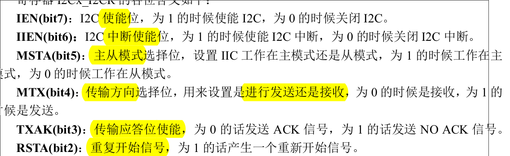
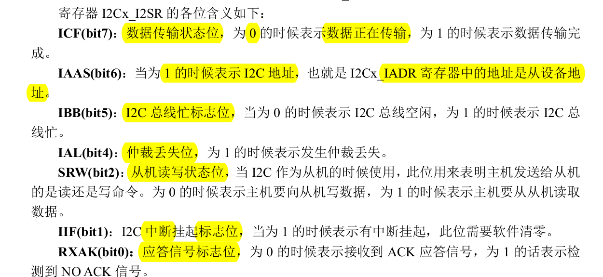
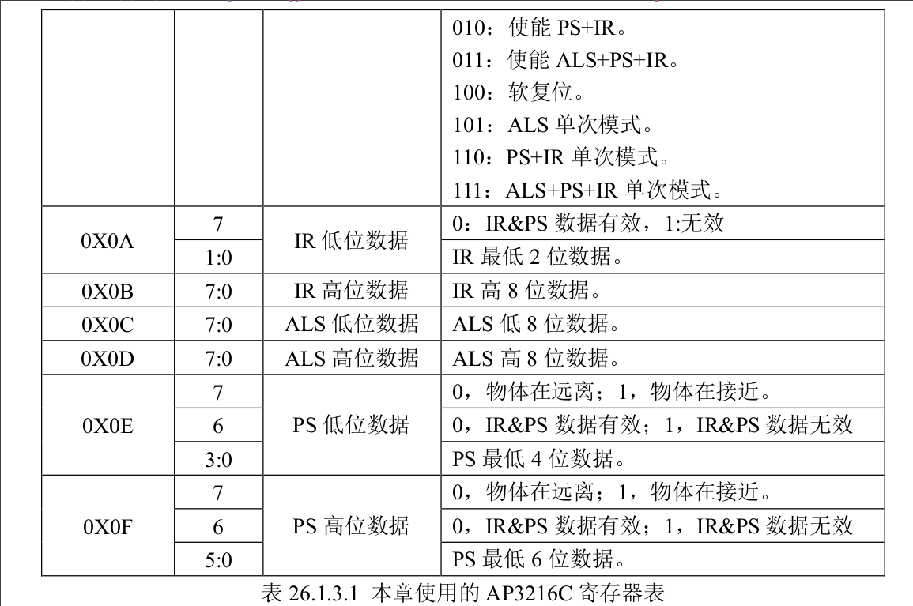
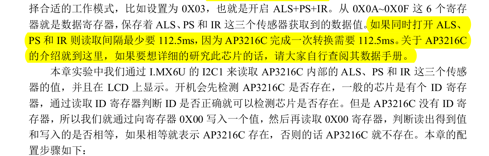
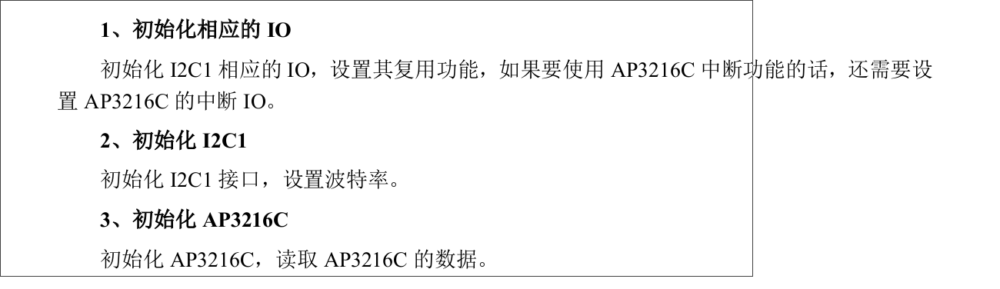

# IMX6ULL I2C 驱动学习
## I2C定义
**I2C 是很常见的一种总线协议**， 由NXP公司提出
使用**两条线**在**主控制器**和**从机**之间进行数据通信
1. SCL（串行时钟线）
2. SDA（串行数据线）

**注**：这两条数据线需要接**上拉电阻**，总线**空闲**的时候 SCL 和 SDA 处于**高电平**

速度：
1. 标准模式下：100Kb/S = 
2. 快速模式下：400Kb/S = 

## I2C 协议
### i2c连接
i2c支持一主多从，不同的i2c从机有不同的外设地址，所以主机可以通过从机地址访问从机外设。

### i2c 协议细节
1. 起始位
该位出现，表明主机通知从机，开始进行通信（SCL高，SDA下降沿）

2. 停止位
该位出现，表明主机通知从机，通信结束（SCL高，SDA上升沿）
3. 数据传输位
数据传输的时候要保证在 SCL 高电平期间，SDA 上的数据稳定，因此 **SDA** 上
的**数据变化**只能在 **SCL 低电平**期间发生
4. 应答信号
主机发送完 8 位数据以后会将 **SDA 设置为输入状态**，等待 I2C **从机应答**，也就是等到 I2C 从机告诉主机它接收到数据了。

    应答信号由从机发出，**主机来提供应答信号所需时钟**，主机发送完 8 位数据以后紧跟着的一个时钟信号就是给应答信号使用的。**从机**通过将 **SDA 拉低**来表示发出**应答信号**，表示通信成功
5. I2C 单字节 写时序

- 开始信号（1位）（不是起始位）
- 发送 I2C 设备地址 + 数据方向（7：0）（方向为写）（高7位是设备地址，最后一位是读写位，1表示读操作，0表示写操作）
- 从机应答（1位）
- 开始信号（1位）
- 写入数据的寄存器地址（7：0）
- 从机应答（1位）
- 写入寄存器的数据（7：0）
- 从机应答（1位）
- 停止信号（1位）

6. I2C 单字节 读时序

- 开始信号（1位）
- 发送 I2C 设备地址 + 数据方向（7：0）（方向为写）
- 从机应答（1位）
- 开始信号（1位）
- 读取数据的寄存器地址（7：0）
- 从机应答（1位）
- 开始信号（1位）
- 读取的 I2C 从设备地址 + 数据方向（7：0）（方向为读）
- 从机应答（1位）
- 读取从机数据（7：0）
- 主机发出 NO ACK 信号，表示读取完成，不需要从机再发送 ACK 信号了（1位）
- 主机发送停止信号（1位）

注：多字节读取类似，有时候我们需要读写多个字节，多字节读写时序和单字节的基本一致，只是在读写数据的时候可以连续发送多个自己的数据，其他的控制时序都是和单字节一样的

### i2c的两种工作模式
#### 1. 标准模式
标准模式下 I2C 数据传输速率最高是 100Kbits/s

#### 2. 快速模式
在快速模式下数据传输速率最高为 400Kbits/s

### i2c控制器的寄存器
目前，I2C 的时钟源为 66MHz
#### CR
1. I2Cx_I2CR（I2C 控制寄存器），控制i2c控制器工作在主/从模式，发送什么样的ack信号，控制使能，中断使能等

#### DR
1. I2Cx_IADR（地址寄存器），保存 I2C 从设备地址
2. I2Cx_IFDR（分频寄存器，通过设置分频系数 来 设置 I2C 的波特率
3. I2Cx_I2DR（数据寄存器），低 8 位有效（**一个字节**），要发送数据的时候将要发送的数据写入到此寄存器，如果要接收数据的话直接读取此寄存器即
可得到接收到的数据

#### SR
1. I2Cx_I2SR（状态寄存器）

## IMX6ULL I2C资源
IMX6ULL 资源有4个I2C接口，本实验，用I2C1连接了一个距离传感器AP3216C

上面介绍的是SOC内部的I2C外设的相关配置信息
除了驱动好I2C主机之后，还需要知道I2C外设的相关信息，不是串口那种等待通信

### （I2C从机）AP3216C

AP3216 的**从机地址**为 **0X1E**，这是出场就固定好的。

从机内部也有一些寄存器，通过这些寄存器我们可以配置 AP3216C 的工作模式
（你可以把这个外设，想象成是另一块MCU，只不过他内部的I2C作为从机，和你的IMX6ULL通信，其内部的代码帮你设置具体的AP3216C外设）

外设寄存器信息：

一般开始先将其设置为 0X04，也就是先软件复位一次 AP3216C，然后根据实际使用情况选
择合适的工作模式（0X03，也就是开启 ALS+PS+IR）。

之后就是从 0X0A~0X0F 这 6 个寄存器就是数据寄存器，保存着 ALS、PS 和 IR 这三个传感器获取到的数据值

（这里也许就是写驱动关键的地方了）

## I2C外设驱动配置
依然还是老样子

1. 时钟
2. pin(两根线， SCL， SDA)
3. 协议-> 控制器寄存器（CR，DR，SR）
4. 外设操作逻辑（BSP）

