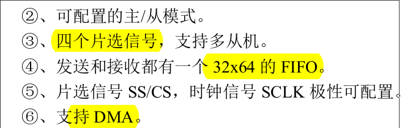
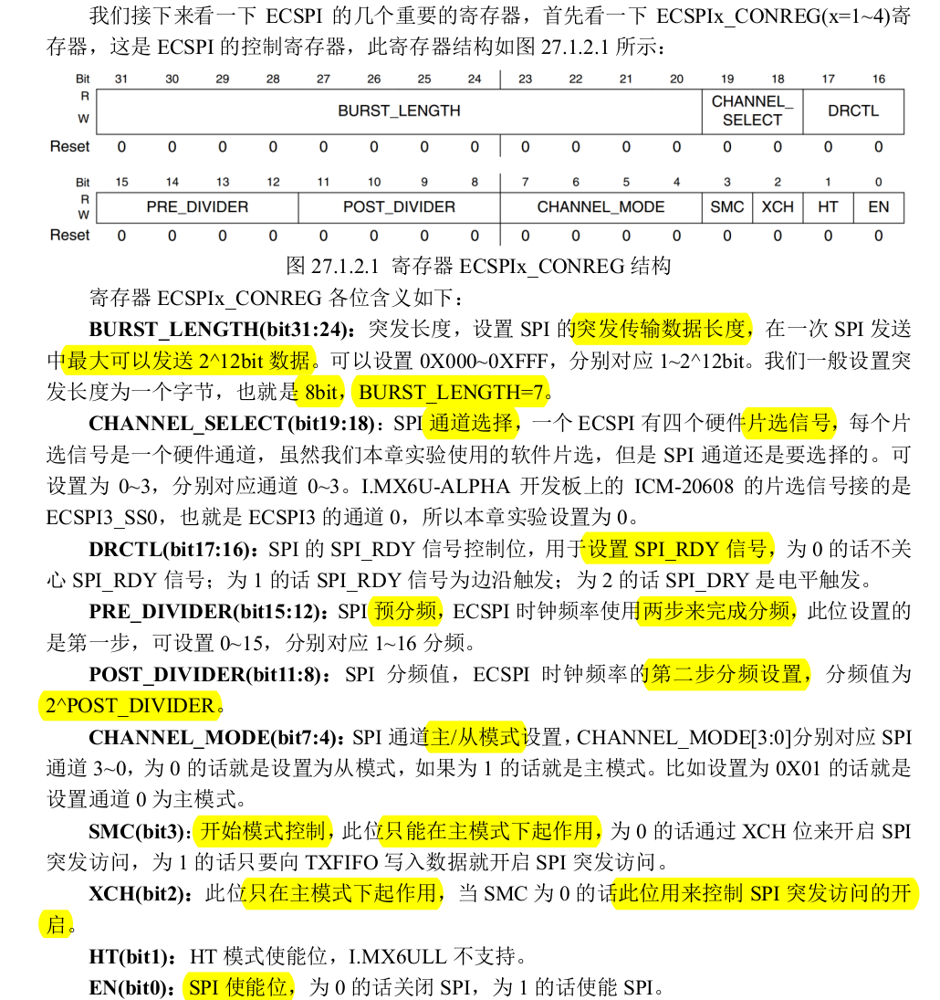

# IMX6ULL SPI 驱动学习
## SPI 定义
（I2C 是串行通信， 主机从机通信仅需要2根线，I2C 的速度最高只能到 400KHz，访问速度要求比价高的话 I2C 就不适合了）

SPI 速度比I2C 更快， SPI和I2C一样，也是串行通信，全称：Serial Perripheral Interface， 串行外围设备接口，是一种**同步** **串行**接口技术

SPI是**高速**、**全双工**的**同步**通信总线，
SPI**时钟频率**比I2C**高很多**，最高可以工作在**上百 MHz**

### SPI 协议
SPI 以**主从**方式工作， 通常一主多从。
SPI 一般 需要**4 根线**，但是也可以使用三根线(单向传输)
1. CS/SS，Slave Select/Chip Select （片选信号线）
2. SCK，Serial Clock （串行时钟线）
3. MOSI/SDO （Tx 发送线）
4. MISO/SDI （Rx 接受线）

### SPI 工作模式
SPI 的**四种工作模式**（通过串行时钟**极性**(CPOL)和**相位**(CPHA)的搭配来得到）
1. CPOL 决定时钟线低电平空闲还是高电平空闲
2. CPOL的基础上，CPHA决定**第一个沿**采集数据，还是**第二个沿**采集数据

### SPI的工作时序
以 CPOL=0，CPHA=0 这个工作模式，进行全双工通信为例

SPI的工作时序很简单，无需像I2C一样分读写时序，因为SPI是**全双工**的，**读写**可以**同时进行**。

所以工作时序如下：
1. CS 片选信号先拉低， 选中从机
2. 然后通过 MOSI 和 MISO 这两根数据线进行收发数据

## IMX6ULL SPI 资源
IMX6ULL SOC 内部支持4个SPI控制器ECSPI， 本实验，使用SPI3,连接6轴传感器：ICM-20608。

ECSPI特性如下：

每个 ECSPI 支持四个片选信号
如果你要使用 ECSPI 的**硬件片选**信号的话，一个 ECSPI 可以支持 **4个外设**。
如果**不使用硬件的片选信号**就可以支持**无数个外设**。

### SPI 重要寄存器
#### CR
**ECSPIx_CONREG**

**ECSPIx_CONFIGREG**
这个主要用来设置极性

**ECSPIx_PERIODREG**
采样周期控制寄存器

时钟源可通过时钟树配置得到

#### DR
**ECSPIx_TXDATA**
**ECSPIx_RXDATA**
都是 32位， 需要时，直接读取即可

#### SR
**ECSPIx_STATREG**

## SPI 外设： ICM-20608

所以SPI每次读写，最少需要16bit/16个时钟，因为8+8（**方向**1 + 从机**寄存器地址**7  +  一个字节数据）