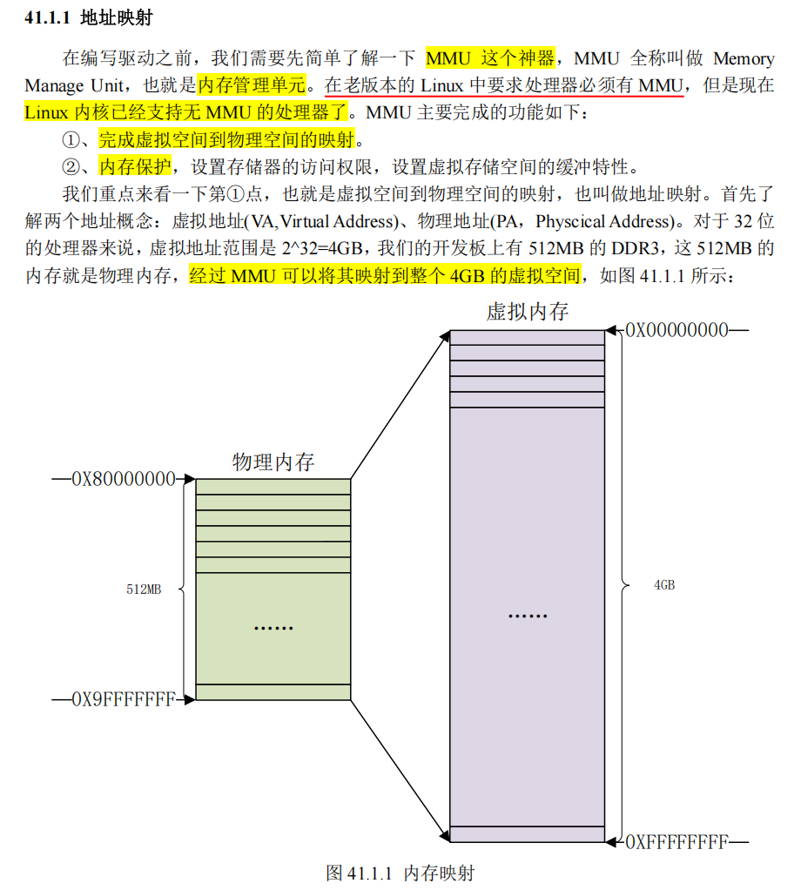
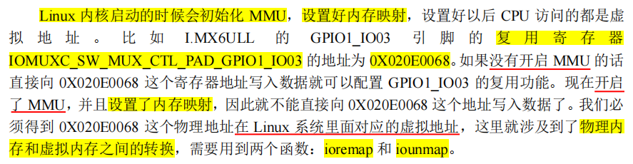
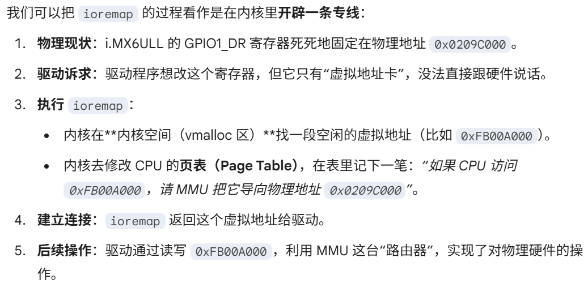
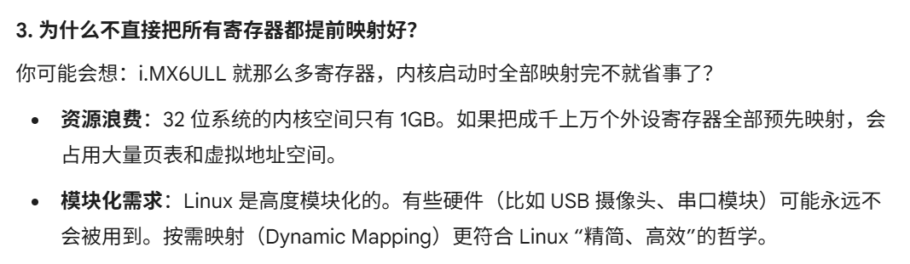
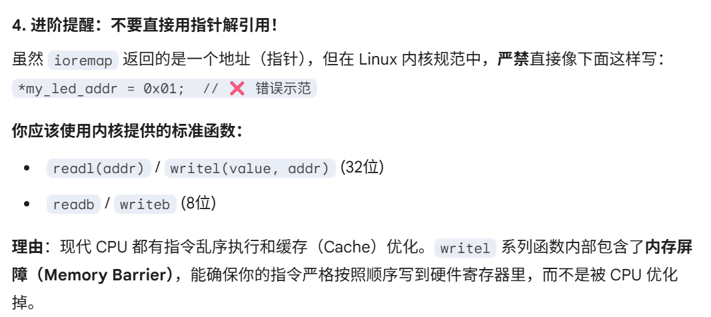
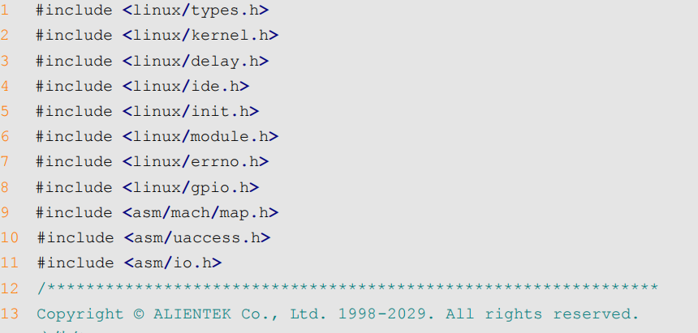

# led 驱动开发
之前我们创建一个虚拟的chrdevbase字符设备，然后基于这个，写了一个驱动。现在要开始做实际的点灯linux驱动

## linux下驱动led的原理
Linux 下的任何外设驱动，最终都是要**配置相应的硬件寄存器**

所以这一节的 **LED 灯驱动**最终也是对 I.MX6ULL 的 **IO 口进行配置**，**与裸机实验不同**的是，在 Linux 下编写驱动要**符合 Linux的驱动框架**

### 硬件资源
**GPIO1_IO03**

### 地址映射
这里说的就是linux是操作系统，需要用mmu + 虚拟地址来保证每个进程都有独立的地址空间。

> 我的理解**mmu的用途1**：每个用户进程能够访问的地址都是虚拟地址，必须经过mmu来通过页表，映射到实际的物理地址上。


所以如果你要访问外设基地址(物理地址)，是不能够直接访问的，必须要经过mmu来计算得到实际的物理地址。

可是这里我有疑问，mmu，虚拟地址，**驱动不是工作在内核空间吗，为何还需要mmu**在**我的理解里面，内核进程可以直接访问物理地址的。**

> 原因如下：
#### 为什么驱动处于内核态，依然要mmu才能访问物理地址？
我现在对mmu的认识有两个：
1. 用户空间的进程，每个进程独享一个虚拟地址空间，如果cpu要写入物理内存，就要通过mmu + 页表来获得实际的物理地址进行写入。
2. 驱动程序工作在内核状态，按照裸机的思路，工作在SVC，就应该可以直接访问，为何又需要mmu?

**不是另外的用法，本质上是同一套逻辑**

1. 核心误区：权限 != 绕过MMU

你觉得“**内核态有权限直接访问物理内存**”，这在**裸机（Bare-metal）开发**中是对的

但在 **Linux 这种开启了 MMU 的现代操作系统**中，情况变了：

- **裸机模式**：CPU 发出的地址直接通过地址线连到 Flash/DDR。如果你想点灯，直接往 0x0209C000（GPIO 物理地址）写值就行。

- **Linux 模式**：一旦**内核启动**并**开启了 MMU**，**CPU 发出的任何地址都会被自动视为“`虚拟地址`”**。
  - 即使是**内核代码**，如果它直接访问 `0x0209C000`，**MMU 也会去查表**。
  - 如果表里没这个映射，CPU 就会报错（内核崩溃/Oops）。

> **内核态的“权限”高**，指的是它**有权“修改页表”**或者“**访问受保护的页**”，而不是它可以关掉 MMU 瞬间瞬移到物理地址去。


---


> 这里说的主要是用户态进程的虚拟地址空间 映射到物理地址的mmu应用。




> 这里就指出了linux内核在打开MMU，设置好内存映射之后。以后**CPU访问的都是虚拟地址**, 这就是上面说的第二点。
> 
> 因此如果要访问裸机的外设基地址的物理内存，本质上**还需要再映射到内核的虚拟地址空间上来**。
>
> 因此相当于**要手动映射上报(动态申请映射)**，就需要使用`ioremap`, `iounmap`这两个函数，来向**内核的虚拟地址空间**里面，**增加一块虚拟地址**，由**MMU路由到外设寄存器的基地址物理地址**。
>
> 因为**内核虚拟地址空间**（通常是 3GB~4GB 之间的一块区域，比如 `vmalloc` 区）是有限的，驱动程序用时申请（ioremap），不用时释放（iounmap），这样能节省宝贵的虚拟地址资源


#### ioremap
定义在 `arch/arm/include/asm/io.h`
```c
#define ioremap(cookie,size) __arm_ioremap((cookie), (size), MT_DEVICE)

void __iomem * __arm_ioremap(phys_addr_t phys_addr, size_t size, unsigned int mtype)
{
    return arch_ioremap_caller(phys_addr, size, mtype,
    __builtin_return_address(0));
}
```

- **ioremap**
  - `__arm_ioremap`(phys_addr，size，mtype)
    - phys_addr: 要映射的**物理起始地址**
    - size: 要映射的内存空间大小
    - mtype: 类型
      - MT_DEVICE
      - MT_DEVICE_CACHED
      - ...
    - 返回值 __iomem类型指针， 指向映射后的**虚拟空间首地址**

实际使用就是直接申请虚拟地址映射就行
```c
#define SW_MUX_GPIO1_IO03_BASE      (0X020E0068)
static void __iomem * SW_MUX_GPIO1_IO03;
SW_MUX_GPIO1_IO03 = ioremap(SW_MUX_GPIO1_IO03_BASE, 4);     //4字节
```

#### iounmap
**卸载驱动**的时候需要使用 `iounmap` 函数释放掉 ioremap 函数所做的映射
> 因为这个申请出来的虚拟地址空间，是属于linux内核的，由mmu管理。所以得释放，不然一直保留

```c
void iounmap (volatile void __iomem *addr)     //直接指定虚拟地址，即可释放映射
```

实际使用
```c
iounmap(SW_MUX_GPIO1_IO03);
```
---
#### 一些底层映射细节




### i/o 内存访问函数
前面我们已经在linux驱动（内核态）中，把实际的外设物理地址，加入了映射，这样我们的内核能够访问的虚拟地址空间里面，也能经过mmu访问到实际的那一块物理地址了。

下面说说，I/O内存访问，这里提到两个概念：
- **`I/O端口`**
  - 外设寄存器/内存，**映射到IO空间**
- **`I/O内存`**
  - 外设寄存器/内存，**映射到内存空间**

> **arm体系下只有I/O内存**

我们前面使用`ioremap`，把物理寄存器地址，**映射到内核的虚拟地址后**，实际上，我们就能**像操作裸机一样，访问这些地址**。

**但是linux内核不建议这么做**, 而是推荐使用**一组操作函数**来对映射后的内存进行读写

#### 读操作
```c
u8 readb(const volatile void __iomem *addr)     //1字节读
u16 readw(const volatile void __iomem *addr)    //2字节读
u32 readl(const volatile void __iomem *addr)    //4字节读
```

#### 写操作
```c
void writeb(u8 value, volatile void __iomem *addr)      //1字节写
void writew(u16 value, volatile void __iomem *addr)     //2字节写
void writel(u32 value, volatile void __iomem *addr)     //4字节写
```

## 关于驱动程序开头的头文件
我们在编写驱动程序的时候，经常会发现包含了很多linux内核源码的一些头文件


```c
//基础头文件
#include <linux/module.h>   //module_init(),module_exit(),MODULE_LICENSE()
#include <linux/init.h>     //定义 __init, __exit宏，告诉内核哪些代码初始化后可回收掉
#include <linux/kernel.h>   //提供内核最基础的函数，printk(), 数学宏等
#include <linux/types.h>    //常用数据类型 u8 u16 u32 dev_t

//字符设备相关
#include <linux/fs.h>       //核心，定义file_operations结构体， 设备号申请注册设备register_chrdev等
#include <linux/cdev.h>     //用现代的cdev结构体，不是旧的设备注册函数。

//内核空间-用户空间 数据搬运
#include <linux/uaccess.h>  //旧版：asm/uaccess.h     copy_to_user(), copy_from_user()


//硬件操作
#include <asm/io.h>         //ioremap(), readl()等
#include <linux/gpio.h>     //提供gpio_set_value()等标准库函数

#include <linux/ide.h>      //大杂烩，包含很多其他文件，现代正规驱动中，按需包含
```
> `asm/` 是指向特定架构，比如`arm的软链接`
>
> 现在的趋势是尽量**包含linux/下的通用头文件**（如linux/uaccess.h）,他会根据我的机器架构，去寻找对应的asm/文件。兼容性更好

**我怎么知道到底该包含哪个**？

如果你自己写一个新的驱动，有三个实用的方法：

- **“查字典”法（最正宗）**：
  - 在 Linux 内核源码目录下使用 `grep` 搜索你调用的函数。
    - 例如你想知道 `ioremap` 在哪：
    - `grep -r "ioremap" include/linux`

- **“看报错”法（最高效）**：
  - 先包含最基础的四个。当你编译时，编译器会报错 implicit declaration of function 'xxx'。这时候你去查这个 xxx 函数定义的头文件补上即可。

- **“找模版”法**：
  - 参考`内核源码 drivers/` 目录下相似的设备驱动。

