- [linux 阻塞与非阻塞](#linux-阻塞与非阻塞)
- [linux实现**阻塞/非阻塞IO**的几个机制](#linux实现阻塞非阻塞io的几个机制)
  - [等待队列 wait queue（**阻塞**）](#等待队列-wait-queue阻塞)
    - [等待队列 API 梳理](#等待队列-api-梳理)
    - [demo](#demo)
  - [轮询](#轮询)
    - [用户态的轮询api](#用户态的轮询api)
      - [select](#select)
        - [select底层实现机制](#select底层实现机制)
      - [poll](#poll)
        - [使用](#使用)
      - [各种情况对比](#各种情况对比)
      - [为什么select和poll效率低下](#为什么select和poll效率低下)
      - [epoll](#epoll)
        - [使用](#使用-1)
  - [Linux 驱动下的 poll 操作函数](#linux-驱动下的-poll-操作函数)
    - [驱动poll函数核心定位](#驱动poll函数核心定位)
    - [驱动poll函数原型](#驱动poll函数原型)
    - [关键辅助函数 poll\_wait](#关键辅助函数-poll_wait)
    - [模板](#模板)
    - [read里面wait\_event 和 select/poll中的poll\_wait 对比](#read里面wait_event-和-selectpoll中的poll_wait-对比)
  - [工作队列 vs 等待队列](#工作队列-vs-等待队列)

# linux 阻塞与非阻塞
这里的IO指的是**用户态程序**通过系统调用和**内核态的驱动程序**之间的**输入输出**。

- 阻塞IO：
  - 没获取到需要的资源
  - 进程**进入阻塞状态**，让出cpu，直到获得设备资源为止
  - 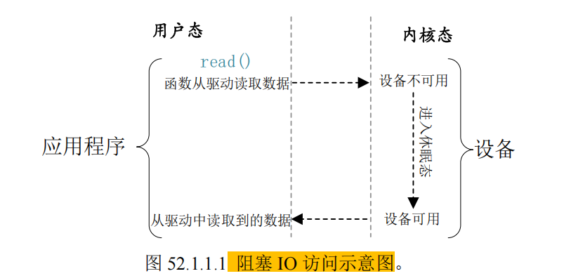
  - 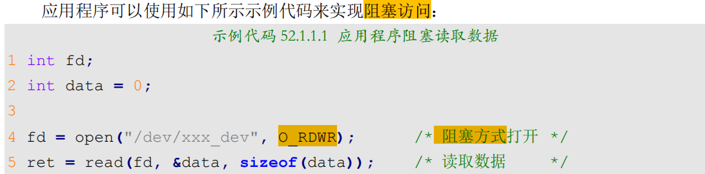
- 非阻塞IO:
  - 没获取到需要的资源，用户态进程不会进入阻塞状态
  - 用户态的IO函数，**直接返回**
  - 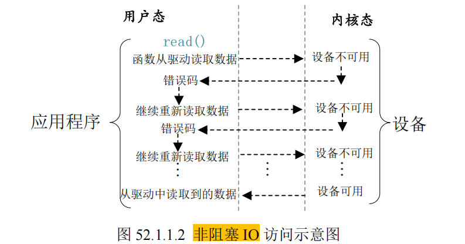
  - 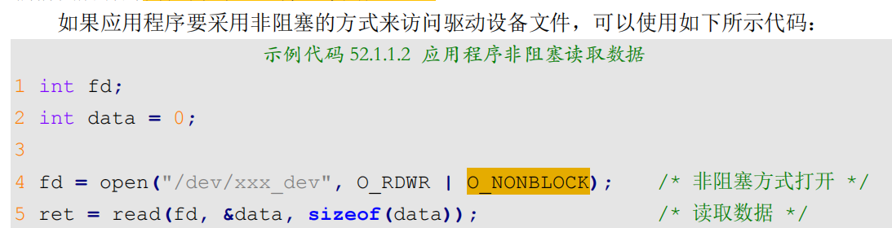
- > **注意**：
- > 这里的**阻塞**，需要**驱动程序配合**，如果配合，还是阻塞不了.

# linux实现**阻塞/非阻塞IO**的几个机制
## 等待队列 wait queue（**阻塞**）
阻塞访问的最大好处就是省资源，因为进程进入阻塞状态，让出了cpu。

但是当设备文件可以操作的时候，必须要唤醒进程（一般在中断函数中完成唤醒工作）

所以，linux内核提供了**等待队列机制**，来实现**阻塞进程的唤醒工作**，主要工作就两个：
- 进程进入内核态，发现资源没准备号，**主动休眠等待**
- 在**中断**中，资源准备好，**唤醒休眠的进程**。

等待队列定义在`include/linux/wait.h`中
### 等待队列 API 梳理
- **A. 核心数据结构**
  - 
- **B. 初始化 (Initialization)**
  - 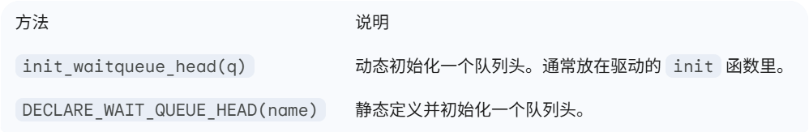
- **C. 入队与阻塞 (Wait Events) —— 最常用**
  - 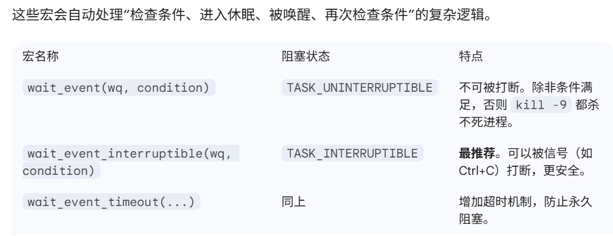
- **D. 唤醒 (Wake Up)**
  - 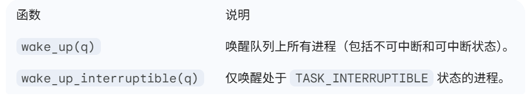
### demo
**1. 设备体结构定义**
```c
struct timer_dev {
    /* ... 之前的成员 ... */
    wait_queue_head_t r_wait;  /* 定义等待队列头 */
    atomic_t releasekey;       /* 按键状态变量（原子操作更安全） */
};
```

**2. 在 init 函数中初始化**
```c
static int __init timer_init(void) {
    /* ... 之前的初始化 ... */
    init_waitqueue_head(&timerdev.r_wait); /* 初始化等待队列头 */
    atomic_set(&timerdev.releasekey, 0);   /* 初始设为无按键按下 */
    return 0;
}
```

**3. 在 read 函数中实现阻塞**
```c
static ssize_t timer_read(struct file *filp, char __user *buf, size_t cnt, loff_t *offt) {
    struct timer_dev *dev = (struct timer_dev *)filp->private_data;

    /* 1. 使用自动化宏进入休眠 
     * 条件为假 (0) 时休眠，条件为真 (1) 时苏醒并执行后续逻辑
     */
    if (wait_event_interruptible(dev->r_wait, atomic_read(&dev->releasekey))) {
        return -ERESTARTSYS; /* 如果是被信号唤醒的，返回错误告知系统重启调用 */
    }

    /* 2. 醒来后说明有数据了，执行 copy_to_user ... */
    atomic_set(&dev->releasekey, 0); /* 处理完后记得清除状态 */
    
    return 0;
}
```


**4. 在中断/定时器处理函数中唤醒**
```c
void timer_function(unsigned long arg) {
    struct timer_dev *dev = (struct timer_dev *)arg;
    
    /* 1. 更新按键状态 */
    atomic_set(&dev->releasekey, 1);

    /* 2. 唤醒等待该队列的进程 */
    wake_up_interruptible(&dev->r_wait); 
}
```
> - **不要在中断里调用 wait_event**：**中断**处理函数（Top Half）**绝不能休眠**。
> - 条件检查要严谨：wait_event 醒来后会重新检查 condition。如果多个进程在等同一个队列，**其中一个抢先处理了数据并把 condition 改回了 0**，其他进程会继续睡回去。
> - 信号处理：`wait_event_interruptible` 返回非 0 值表示是被信号（信号量、Ctrl+C等）**意外叫醒的**，驱动应该及时返回并处理这个异常

## 轮询
如果**用户进程**以**非阻塞方式**访问设备，设备**驱动**程序就要**提供非阻塞的处理方式**

前面我们说**非阻塞**，就是直接返回嘛，那么就是**轮询**了

`poll`, `epoll`, `select`可以用于**处理轮询**

**应用程序**通过 `select、epoll 或 poll` 函数来**查询设备是否可以操作**，如果**可以操作**的话**就从设备读取或者向设备写入数据**
> 原来我们while read，是不停的读，这里他是不停的查询是否可读。相当于不停的读是否可读的标志位。


当**应用程序**调用 `select、epoll 或 poll` 函数的时候**设备驱动程序中**的 `poll` 函数就会执行，因此**需要在设备驱动程序中编写 poll 函数**

> 所以，用户态的select,epoll,poll, 都是靠内核态的poll函数来实现的。

### 用户态的轮询api
#### select
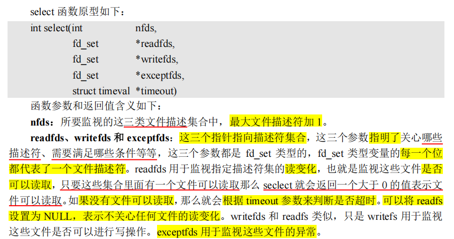
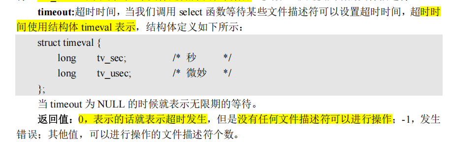
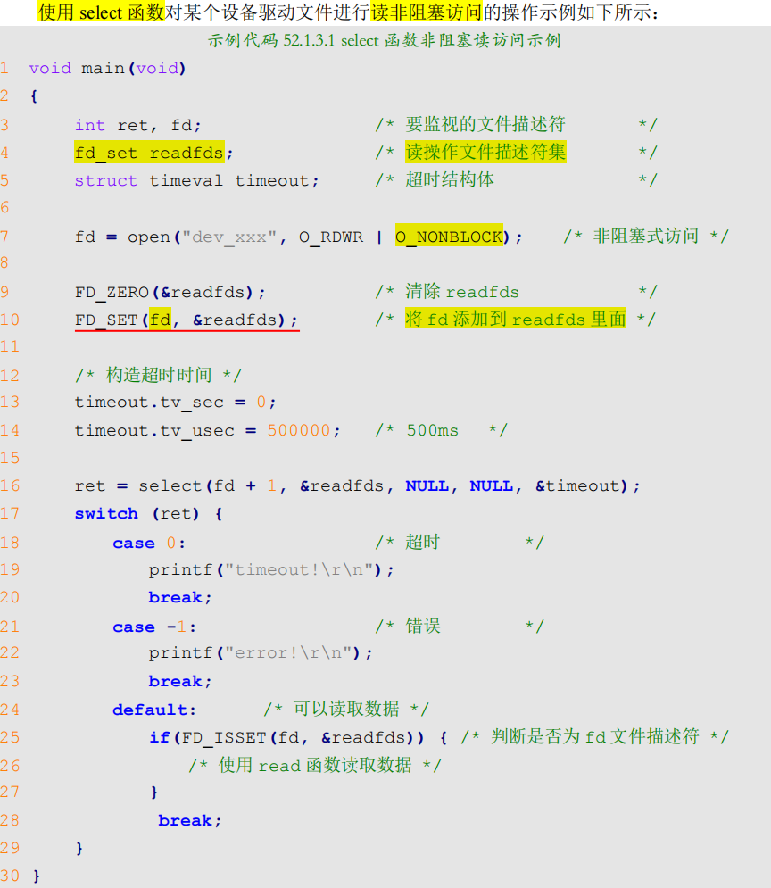

可以看到，select其实可以通过超时时间的设置，来实现阻塞/非阻塞的轮询
> 我们这里说的**轮询**，本质上是**基于等待队列机制**的唤醒机制,是**阻塞等待** + **批量检查**，
> 
> **不是**我们用while循环的**主动轮询**

##### select底层实现机制
下面来看一下`select`的**底层实现机制**。

**用户态代码**
```c
fd_set readfds;
FD_ZERO(&readfds);
FD_SET(fd, &readfds);
struct timeval timeout = {1, 0}; // 1秒超时
int ret = select(fd+1, &readfds, NULL, NULL, &timeout);
```

**场景设定**
- **监听**：
  - `读集合`：设备 A（fd_a）、设备 B（fd_b）
  - `写集合`：设备 C（fd_c）
  - `异常集合`：无
- **超时**：1 秒
- 实际唤醒：300ms 时，设备 A 可读
---
**步骤 1：用户态→内核态，参数拷贝**
- `select` 是**系统调用**，会触发 `sys_select` **内核函数**；
- **内核**把用户态的 fd_set（监听的 fd 集合）、timeout **拷贝到内核空间**（避免用户态篡改）；
- 内核会先做**合法性检查**：fd 是否有效、是否超出进程的 fd 限制（默认 1024）。

---
**步骤 2：初始化 “等待队列”，挂起当前进程**
> 这是 `select` **不 “轮询” 的核心**：
- 内核为**当前进程**创建一个 `struct wait_queue_entry`（等待队列**项**）；
- **遍历用户监听的所有 fd**（这里是 fd），把这个等待队列项**挂到每个 fd 对应的等待队列**上；
  - 比如`串口 fd` 的等待队列，由**串口驱动**维护，当串口有数据时，驱动会唤醒这个队列上的所有进程；
- **内核修改当前进程的状态**为 TASK_INTERRUPTIBLE（可中断睡眠），并调用 schedule() 让出 CPU；
  - 此时进程不再占用 CPU，直到被唤醒。
---
**步骤 3：进程睡眠，等待唤醒**

> **进程睡眠**期间，CPU 去执行其他任务，直到以下任一事件发生：
- **有fd 就绪**：比如串口收到数据，**驱动**会调用 **wake_up() 唤醒**对应 fd 的**等待队列**，当前进程被唤醒；
- **超时**：内核有一个定时器，超时时间到后，定时器触发，唤醒当前进程；
- **信号打断**：比如进程收到 SIGINT 信号，也会被唤醒。

---

**步骤 4：进程被唤醒，检查 fd 状态**

进程被唤醒后，内核会做两件事：

- 把**进程的这个等待队列项**从**所有** fd 的**等待队列**中移除（避免重复唤醒）；
  - 前面我们一个进程的等待队列项，被加入到两个读，一个写的对应的驱动的等待队列里面了，现在要**全部清除掉**，**防止被重复唤醒**
- **一次性遍历所有监听的 fd**，检查每个 fd 的状态（可读 / 可写 / 异常）：
  - 内核通过 fd 对应的 file_operations 结构体里的 **poll 函数**（比如**串口驱动的 uart_poll**），获取 `fd` 的**就绪状态**；
  - 把就绪的 fd **标记到 fd_set** 中。
---
**步骤 5：计算超时剩余时间（可选）**

此时仍在内核态

如果是 “超时唤醒”，内核会更新 timeout 结构体，把剩余时间写回用户态（比如原本 1 秒超时，300ms 就被唤醒，用户态能拿到剩余的 700ms）；如果是 “fd 就绪唤醒”，

超时时间会被清空。

---

**步骤 6：内核态→用户态，结果返回**
- 内核把**更新后**的 `fd_set`（标记了就绪的 fd）、**返回值**（就绪 fd 数量 / 0/-1）**拷贝回用户态**；
- 用户态代码从 select 返回，**继续执行后续逻辑**（比如 判断哪个可读，read 读取数据）
  - 用户态代码继续执行，通过 `FD_ISSET(fd_a, &readfds)` 检查，发现 fd_a 可读，于是调用 `read(fd_a, ...)` 读取数据
---
**`select`的缺陷**：
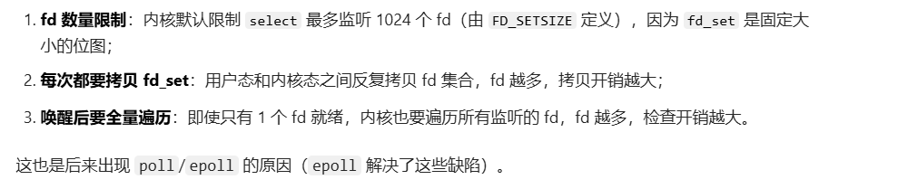


#### poll
因为前面分析的select能够监视的fs的数量最大是1024，而且要遍历检查，所以开销太大。

因此，有了poll函数。

**poll函数和select本质上没有太大的差别**

`poll`函数**没有最大文件描述符的限制**


应用层的**poll函数原型**如下：
- 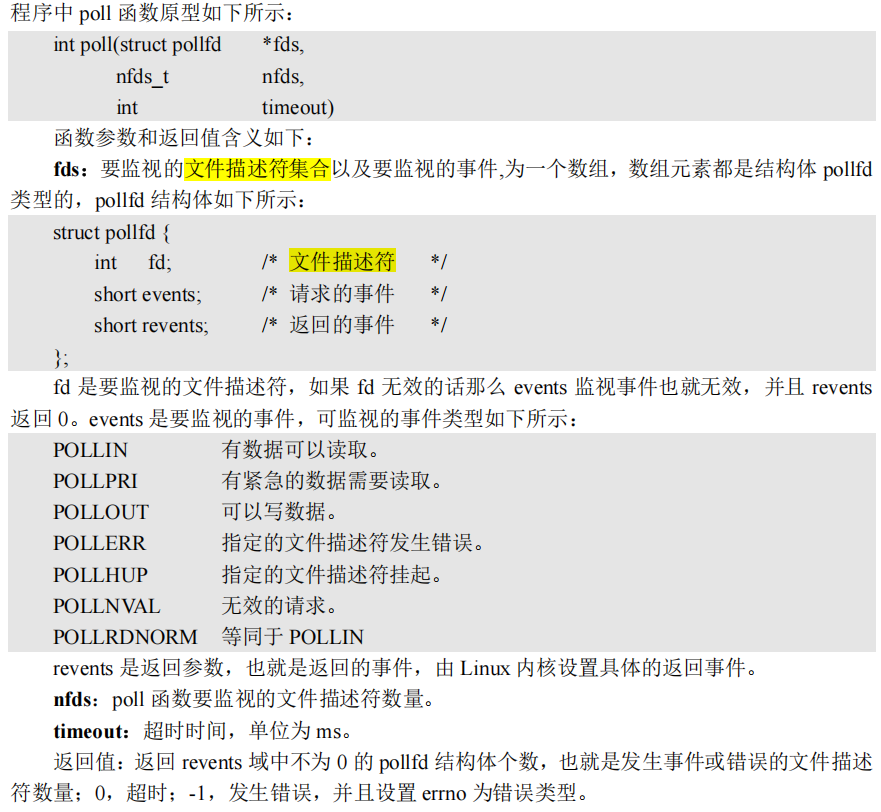


**使用示例**
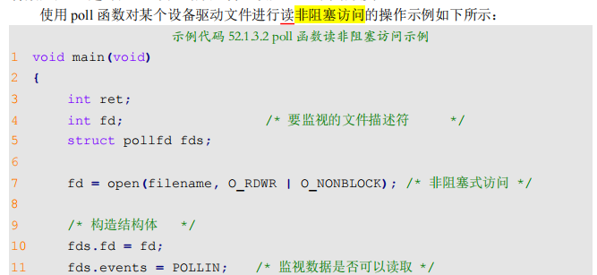
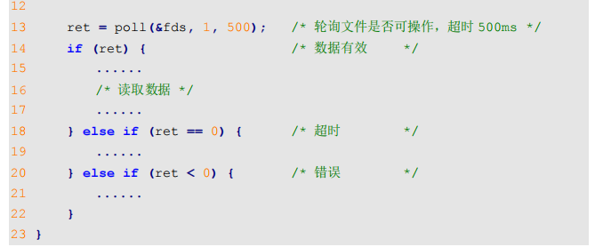

> 我们这里的 “非阻塞访问”，指的是 **read 操作本身不阻塞**，而不是 poll 不阻塞
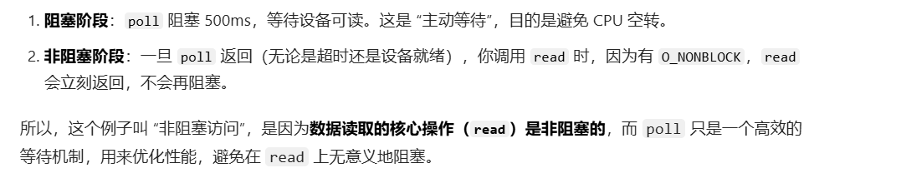


##### 使用
poll实现批量监听

poll 的
- 第一个参数是 `struct pollfd *fds`，它是一个**数组指针**，而不是单个结构体。
- 第二个参数 `nfds` 就是这个**数组的长度**。
> 所以，如果你要**监听多个 fd**，只需要**定义一个 struct pollfd 数组**，把所有要监听的 fd 填进去，然后把数组首地址和长度传给 poll 即可：
```c
struct pollfd fds[3]; // 监听3个fd

// 监听fd1是否可读
fds[0].fd = fd1;
fds[0].events = POLLIN;

// 监听fd2是否可写
fds[1].fd = fd2;
fds[1].events = POLLOUT;

// 监听fd3是否可读或异常
fds[2].fd = fd3;
fds[2].events = POLLIN | POLLERR;

// 调用poll，同时监听这3个fd，超时500ms
int ret = poll(fds, 3, 500);
```
> poll 返回后，**你遍历这个数组**，检查每个元素的 revents 字段，就能知道哪个 fd 发生了什么事件。


#### 各种情况对比
目前，我们学习了等待队列，轮询的select，以及他的升级版本poll。

当我们在读设备数据的时候，使用open 以阻塞/非阻塞方式打开，然后read。一般有3中使用情况：
- 仅 `read` 指定 `O_NONBLOCK`（**纯非阻塞读，while 空转**）
  - 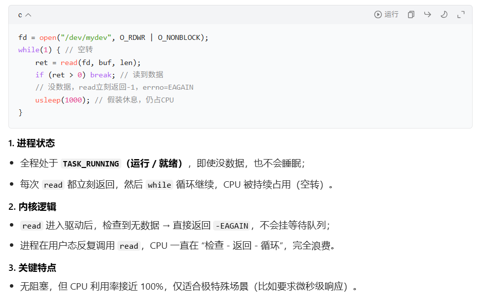
  - > 这里就是**驱动里面的read不包含等待机制**，即时返回。
- 仅 `read` 不指定 `O_NONBLOCK`（**纯阻塞读**）
  - 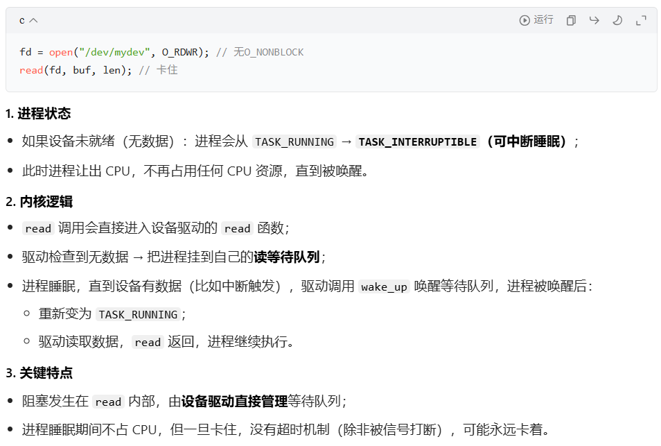
  - > 所以这个的本质，是**驱动在read里面利用等待机制来替你实现的阻塞读**。
- `O_NONBLOCK` + `poll/select`（**非阻塞读** + **多路复用**）
  - 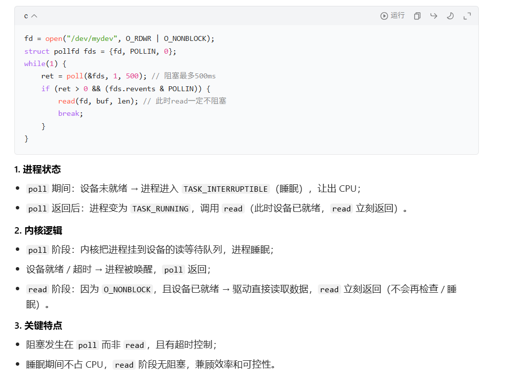
  - > 这里就是，read指定非阻塞，**即时返回**，把**等待机制单独抽象出来放到poll里面来实现**。
- ---
- > **纯阻塞read** 和 **非阻塞read + 阻塞poll** 对比
  - > 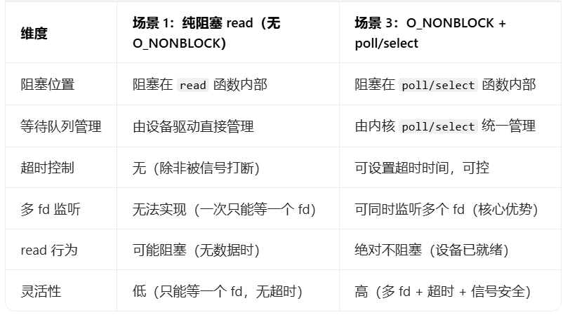
- **三种阻塞/非阻塞IO方式对比**
  - > 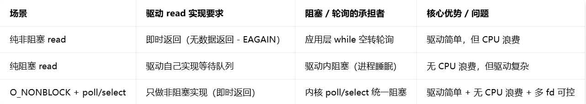

#### 为什么select和poll效率低下
虽然两者**都能批量监听**，但它们的底层实现有两个共同的效率瓶颈：
- 每次**调用**都要**全量拷贝**
  - select：把整个 **fd_set 位图**从用户态拷贝到内核态。
  - poll：把整个 **struct pollfd 数组**从用户态拷贝到内核态。
  - 监听的 fd 越多，拷贝的数据量就越大，开销越高。
- 每次**返回都要全量遍历**
  - 当有事件发生、进程被唤醒后，内核都要遍历所有你监听的 fd，逐个检查它们的状态。
  - 即使只有 1 个 fd 就绪，也要遍历全部 N 个 fd，时间复杂度是 O (N)。
  - **当 N 很大（比如几千个）时，这个遍历开销就会变得非常大**。

这就是为什么**当监听的 fd 数量很多时，select 和 poll 的效率会急剧下降**，而 epoll 能高效处理大量连接的原因 ——**epoll 在内核中维护了一个就绪列表**，**只返回活跃的 fd**，避免了全量遍历。


#### epoll
为了解决select, poll的全量拷贝和返回遍历的问题，提出了epoll,**epoll 就是为处理大并发而准备的**，一般常常在**网络编程中使用 epoll 函数**

##### 使用

**应用层的使用epoll的api如下**
- `int epoll_create(int size)`
  - 
- `int epoll_ctl(int epfd, int op, int fd, struct epoll_event *event)`
  - 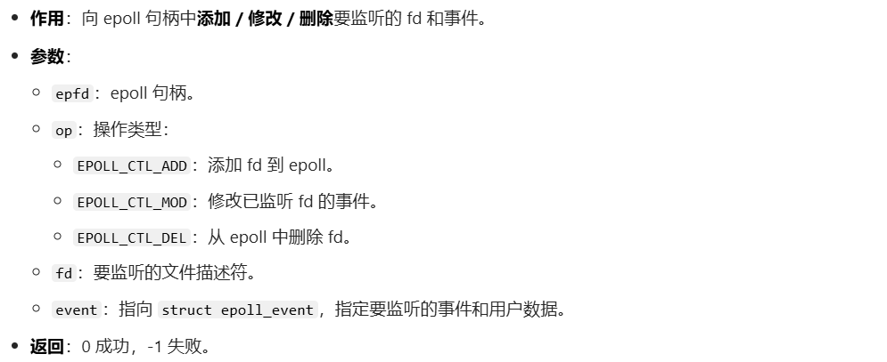
- `int epoll_wait(int epfd, struct epoll_event *events, int maxevents, int timeout)`
  - 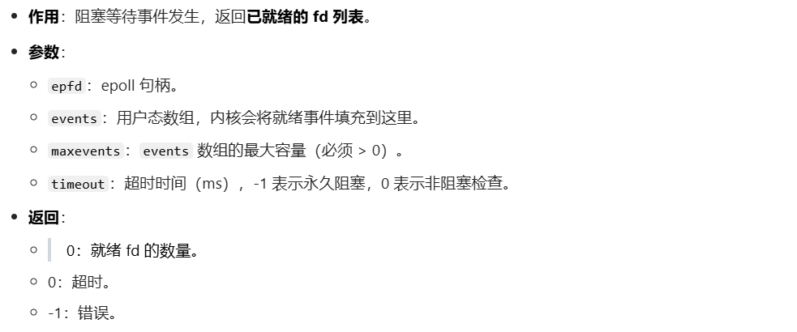

关键结构体`struct epoll_event`
```c
struct epoll_event {
    uint32_t     events;    /* 要监听的 epoll 事件 */
    epoll_data_t data;      /* 用户自定义数据（如 fd、指针等） */
};
```


示例代码：
```c
#include <stdio.h>
#include <stdlib.h>
#include <unistd.h>
#include <fcntl.h>
#include <sys/epoll.h>
#include <errno.h>

// 要监听的设备文件路径（请替换为你实际的设备路径）
#define DEV_PATH1 "/dev/ttyUSB0"  // 示例1：串口1
#define DEV_PATH2 "/dev/ttyUSB1"  // 示例2：串口2
#define DEV_PATH3 "/dev/mychardev"// 示例3：自定义字符设备

// 最大监听fd数量
#define MAX_EVENTS 10

int main() {
    int epfd, nfds;
    int fd1, fd2, fd3;
    struct epoll_event ev, events[MAX_EVENTS];

    // 1. 创建epoll句柄
    epfd = epoll_create1(0);  // 替代epoll_create，更推荐的写法
    if (epfd == -1) {
        perror("epoll_create1 failed");
        exit(EXIT_FAILURE);
    }

    // 2. 打开多个设备文件（非阻塞模式）
    fd1 = open(DEV_PATH1, O_RDWR | O_NONBLOCK);
    fd2 = open(DEV_PATH2, O_RDWR | O_NONBLOCK);
    fd3 = open(DEV_PATH3, O_RDWR | O_NONBLOCK);
    if (fd1 == -1 || fd2 == -1 || fd3 == -1) {
        perror("open device failed");
        exit(EXIT_FAILURE);
    }

    // 3. 逐个添加fd到epoll监听（监听可读事件）
    // 3.1 添加fd1
    ev.events = EPOLLIN;  // 监听可读事件
    ev.data.fd = fd1;     // 绑定fd，方便后续识别
    if (epoll_ctl(epfd, EPOLL_CTL_ADD, fd1, &ev) == -1) {
        perror("epoll_ctl add fd1 failed");
        exit(EXIT_FAILURE);
    }

    // 3.2 添加fd2
    ev.data.fd = fd2;
    if (epoll_ctl(epfd, EPOLL_CTL_ADD, fd2, &ev) == -1) {
        perror("epoll_ctl add fd2 failed");
        exit(EXIT_FAILURE);
    }

    // 3.3 添加fd3
    ev.data.fd = fd3;
    if (epoll_ctl(epfd, EPOLL_CTL_ADD, fd3, &ev) == -1) {
        perror("epoll_ctl add fd3 failed");
        exit(EXIT_FAILURE);
    }

    printf("epoll start listening %s, %s, %s...\n", DEV_PATH1, DEV_PATH2, DEV_PATH3);

    // 4. 循环等待事件触发
    while (1) {
        // 阻塞等待事件，超时时间-1（永久阻塞）
        nfds = epoll_wait(epfd, events, MAX_EVENTS, -1);
        if (nfds == -1) {
            perror("epoll_wait failed");
            exit(EXIT_FAILURE);
        }

        // 5. 遍历就绪的fd，处理事件
        for (int i = 0; i < nfds; i++) {
            char buf[1024] = {0};
            int ret;

            printf("fd %d is ready, events: ", events[i].data.fd);
            // 识别事件类型
            if (events[i].events & EPOLLIN) {
                printf("EPOLLIN ");
                // 读取数据（非阻塞，不会卡住）
                ret = read(events[i].data.fd, buf, sizeof(buf)-1);
                if (ret > 0) {
                    printf("\nread from fd %d: %s\n", events[i].data.fd, buf);
                } else if (ret == -1 && errno != EAGAIN) {
                    perror("read failed");
                }
            }
            if (events[i].events & EPOLLERR) {
                printf("EPOLLERR ");
            }
            if (events[i].events & EPOLLHUP) {
                printf("EPOLLHUP ");
            }
            printf("\n");
        }
    }

    // 6. 关闭资源（实际运行中while(1)不会走到这里，仅示例）
    close(fd1);
    close(fd2);
    close(fd3);
    close(epfd);
    return 0;
}
```


## Linux 驱动下的 poll 操作函数
见面我们将的都是**应用层用的对应的系统调用**

对应底层，这个实际的阻塞，等待队列，肯定是需要**驱动自己支持**才能使用的。

### 驱动poll函数核心定位
- 触发时机：
  - 当应用层调用 `select/poll/epoll` 等多路复用函数时，内核会**回调**驱动 file_operations 中注册的 `.poll` 函数。
- 核心职责：
  - 告诉内核 “这个设备**对应的等待队列头**” 是什么（通过 poll_wait）。
  - 向应用层返回**设备当前的就绪状态**（如可读、可写、错误等）。
- 本质：驱动的 .poll 函数是内核和设备驱动之间的 “桥梁”，让多路复用机制能统一管理所有设备的等待队列。

### 驱动poll函数原型
```c
unsigned int (*poll)(struct file *filp, struct poll_table_struct *wait);
```
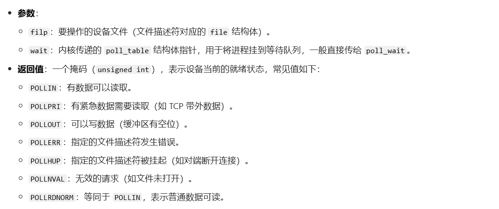

### 关键辅助函数 poll_wait
```c
void poll_wait(struct file *filp, wait_queue_head_t *wait_address, poll_table *p);
```
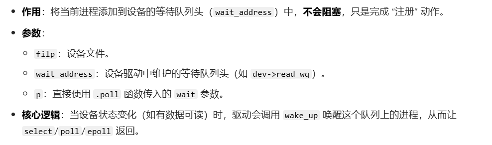

### 模板
```c
// 假设设备结构体中维护了读/写等待队列头
struct my_dev {
    wait_queue_head_t read_wq;  // 读等待队列
    wait_queue_head_t write_wq; // 写等待队列
    // ... 其他设备数据
};

static unsigned int my_drv_poll(struct file *filp, struct poll_table_struct *wait)
{
    struct my_dev *dev = filp->private_data;
    unsigned int mask = 0;

    // 1. 将进程挂到设备的读/写等待队列
    poll_wait(filp, &dev->read_wq, wait);  // 监听读事件
    poll_wait(filp, &dev->write_wq, wait); // 监听写事件

    // 2. 检查设备当前状态，返回就绪掩码
    if (设备有可读数据) {
        mask |= POLLIN | POLLRDNORM; // 标记可读
    }
    if (设备可写（缓冲区未满）) {
        mask |= POLLOUT | POLLWRNORM; // 标记可写
    }
    if (设备发生错误) {
        mask |= POLLERR; // 标记错误
    }

    return mask;
}

// 在 file_operations 中注册
const struct file_operations my_fops = {
    .poll = my_drv_poll,
    // ... 其他接口
};
```

> **`.poll` 里面有两个`poll_wait`**, 整个`.poll`**仅仅只是把进程加入到相应的队列里面**，然后再判断一下当前是否有数据，并返回，就是**返回到poll系列系统调用**中，根据返回值来判断要不要真的进入阻塞休眠，如果返回发现有数据，那我们就不进入休眠
>
> 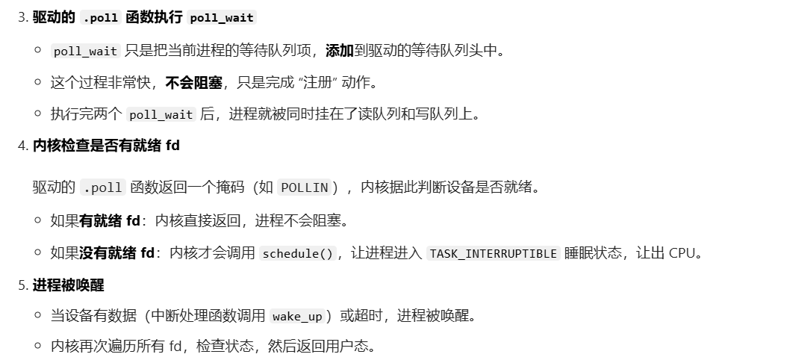

### read里面wait_event 和 select/poll中的poll_wait 对比
可以看到，
- 驱动的read里面的wait_event是真的利用等待队列机制库，来让自己的进程进入休眠了。 

- 而select/poll是在系统调用里面，等.poll返回后，才判断是否调用等待队列的机制库，让自己的进程进入休眠。
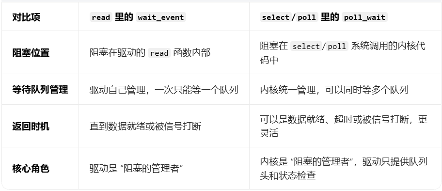


## 工作队列 vs 等待队列
这两个不是一个维度的东西：
- 工作队列：
  - 中断下半部的一种机制，表示一个通道，一个告示牌
- 等待队列：
  - 是一个进程链表，把进程作为队列项，加入队列
  - 一个队列表示一种等待事件，对应一种唤醒条件


**等待队列详细补充：**

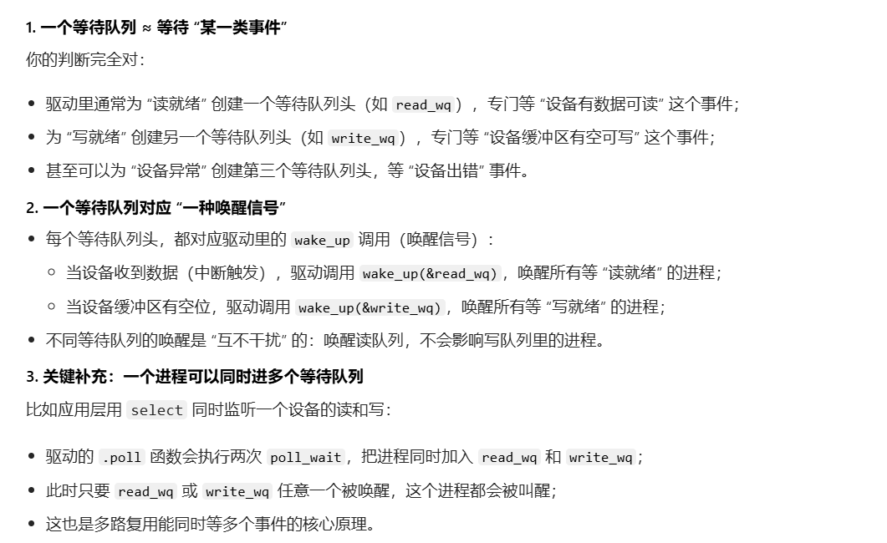

> **工作队列**：
> **工作队列**其实就是**工作流，任务栏**， A中断下半部，就可以把A任务挂到自己创建的专属队列，B中断下半部也可以把B的任务挂到这个专属队列，如果想要自己分开工作流，就可以创建两个工作队列
> 
>
> 具体可以参考**linux中断那一节里面的工作队列的方案3**