- [内核中断](#内核中断)
  - [裸机的中断](#裸机的中断)
  - [linux内核中断](#linux内核中断)
  - [中断API](#中断api)
    - [中断号](#中断号)
    - [request\_irq](#request_irq)
    - [free\_irq](#free_irq)
    - [中断处理函数](#中断处理函数)
    - [中断使能/禁止函数](#中断使能禁止函数)
  - [上半部 下半部](#上半部-下半部)
    - [下半部的实现机制](#下半部的实现机制)
      - [软中断](#软中断)
      - [tasklet](#tasklet)
        - [tasklet流程图解](#tasklet流程图解)
      - [工作队列](#工作队列)
        - [概念梳理](#概念梳理)
        - [工作队列流程图解](#工作队列流程图解)
        - [api](#api)
        - [使用注意](#使用注意)
  - [dts中断拓破关系梳理](#dts中断拓破关系梳理)
  - [节点中断属性](#节点中断属性)
  - [实验](#实验)

# 内核中断
## 裸机的中断

之前我们在裸机中，要想使用中断，需要经过3个门槛：
- 外设中断使能
- GIC开中断，设置中断优先级（处理外部中断）
- 内核控制寄存器打开全局中断使能

这样我们才能使用中断。

在裸机代码中，我们需要自己处理GIC的寄存器，内核中断使能的寄存器（CPSR）等等这些，需要实际操作底层的硬件寄存器。但是移植性非常差。

## linux内核中断
和前面的gpio子系统一样，linux内核也实现了**中断管理子系统**，提供了完善的中断框架。

- 在这个框架之上，我们的驱动开发，只需要申请中断，注册中断处理函数即可。
- 在这个框架之下，由原厂的工程师，替linux内核实现具体的操作底层寄存器。

> 我们主要在这一节学习linux内核的中断框架api，底层如何实现，还需要对子系统有点了解才行


## 中断API
裸机实验中断的处理方法：
> **涉及的外设**：
> - 使用中断的设备（uart）
> - GIC
1. 使能中断，初始化相应的寄存器
2. 注册中断服务函数
3. 进入IRQ中断服务函数，判断中断源，执行相应处理函数

---

### 中断号
linux内核的**中断子系统**，**每个中断都有一个中断号**，使用一个**int变量**表示中断号（具体参考gpio中断那一个裸机实验）

### request_irq
中断子系统规定，如果要想使用某个中断，**是需要申请的**。

**`request_irq`**
- 用于**申请中断**
- 会导致进程**睡眠阻塞**
  - 不能在中断上下文/禁止阻塞的代码中，使用request_irq
- 实际作用：
  - **使能中断**
  - > 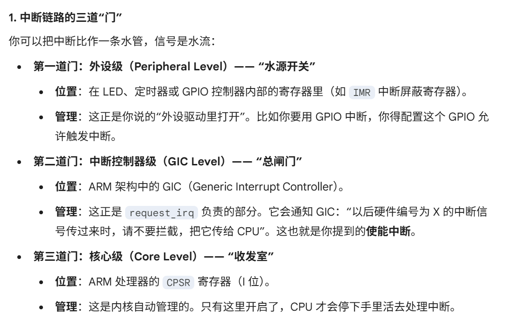
- 使用：
  - 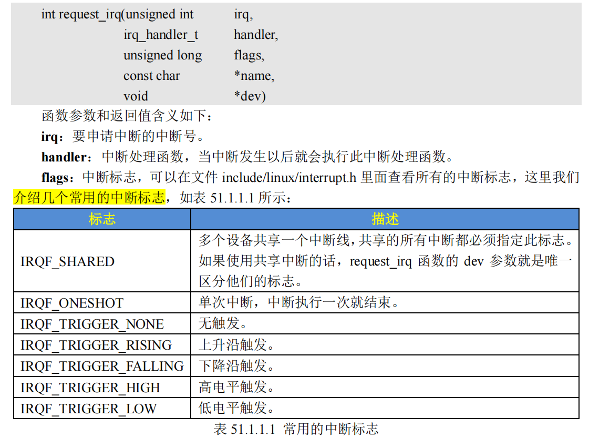
  - 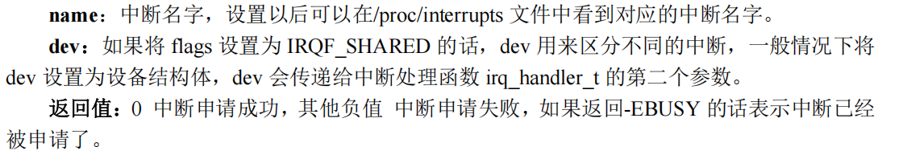
  - > GPIO1_IO18, 按下低电平，可以设置下降沿触发中断，多个标志可以用 `|` 来组合


### free_irq
这个就是释放掉相应的中断了，就是关掉GIC的中断使能

如果中断没有共享，那么free_irq会：
- 删除中断处理函数
- 禁止中断

使用如下：
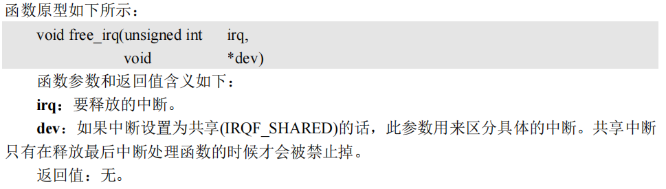

### 中断处理函数
使用request_irq函数**申请中断的时候**，就需要设置**中断处理函数**。
```c
irqreturn_t (*irq_handler_t) (int, void *)
/*
第一个参数int, 是相应的中断号
第二个参数是通用指针，需要和request_irq的dev参数保持一致，指向设备数据结构
*/

//返回值类型定义
enum irqreturn {
        IRQ_NONE = (0 << 0),
        IRQ_HANDLED = (1 << 0),
        IRQ_WAKE_THREAD = (1 << 1),
};

typedef enum irqreturn irqreturn_t;

//一般中断服务函数返回值使用如下形式：
return IRQ_RETVAL(IRQ_HANDLED)
```


### 中断使能/禁止函数
**使能/失能 指定中断**

```c
void enable_irq(unsigned int irq)
void disable_irq(unsigned int irq)      //irq是中断号
```
**要求**：
- 要等当前正在执行的**中断处理函数执行完**才返回
- 使用者要保证**不会产生新的中断**，并且确保已经**开始的中断处理程序全部退出**。
  - **另一个中断禁止函数**
  - ```c
    void disable_irq_nosync(unsigned int irq) 
    ```
    - 调用后会立即返回，不会等待当前中断处理程序执行完毕。
    

---
上面三个都是使能/失能某一个中断。有时候我们需要**关闭当前处理器的整个中断系统**。
```c
local_irq_enable()      //使能当前处理器中断系统
local_irq_disable()     //禁止当前处理器的中断系统

//当出现多个任务要关闭中断，由于没有嵌套，所以容易误开中断，所以第二个任务只能恢复以前的中断状态。
local_irq_save(flags)
local_irq_restore(flags)
```


## 上半部 下半部
**上半部**：就是中断服务函数
- 要求越短越好
- 建议**仅响应中断**，**清除中断标志位**即可

> 触摸屏：
> IC通过中断通知SOC有触摸事件，I2C读取触摸数据。

**下半部**：就是将耗时的代码提取出来，交给下半部执行。
- 此时中断处理函数已经退出，SOC能够再次响应中断，但仍处于内核态。
- > 相当于在中断（内核态）返回进程上下文（用户态/内核态）之间，新增了一个内核态的部分，用来执行耗时操作。

> Linux 内核将**中断**分为**上半部**和**下半部**的主要**目的**就是实现**中断处理函数的快进快出**:
> - 放到**上半部**：
>   - 对**时间敏感**
>   - 执行**速度快**的操作
>   - **不希望处理内容被打断**
>   - 处理的任务**和硬件相关**
> - 剩下的所有工作都可以放到**下半部**去执行，比如在上半部将**数据拷贝**到内存中，关于数据的**具体处理**就可以放到下半部去执行

### 下半部的实现机制
linux内核提供了多种下半部的机制。
#### 软中断
linux内核提供**结构体**`softirq_action`表示软中断。定义在`include/linux/interrupt.h`
```c
struct softirq_action
{
        void (*action)(struct softirq_action *);
};
```
`kernel/softirq.c`中定义了10个软中断
```c
static struct softirq_action softirq_vec[NR_SOFTIRQS];

//NR_SOFTIRQS是枚举类型，定义在include/linux/interrupt.h
enum
{
    HI_SOFTIRQ=0,       /* 高优先级软中断 */
    TIMER_SOFTIRQ,      /* 定时器软中断 */
    NET_TX_SOFTIRQ,     /* 网络数据发送软中断 */
    NET_RX_SOFTIRQ,     /* 网络数据接收软中断 */
    BLOCK_SOFTIRQ, 
    BLOCK_IOPOLL_SOFTIRQ, 
    TASKLET_SOFTIRQ,    /* tasklet 软中断 */
    SCHED_SOFTIRQ,      /* 调度软中断 */
    HRTIMER_SOFTIRQ,    /* 高精度定时器软中断 */
    RCU_SOFTIRQ,        /* RCU 软中断 */
    NR_SOFTIRQS         //10
};
```
> 是说相当于进入一个软件中断，发送在中断处理函数和上下文之间？

可以看到，一共10个软中断。因此`NR_SORTIRQS`为`10`， 数组`softirq_vec`有10个元素。里面每个元素都是对应的软中断的服务函数`softirq_action`，
> 相当于自己搞了一套**软件中断号**和**对应的中断向量表**

所以各个CPU（多核）所执行的软件中断服务函数都是相同的（和中断向量表一样嘛）。

要使用软中断，必须要`open_softirq`函数**注册对应的软中断处理函数**
- 
- 
---
注册好软中断后，需要通过`raise_softirq`函数来软件触发
- 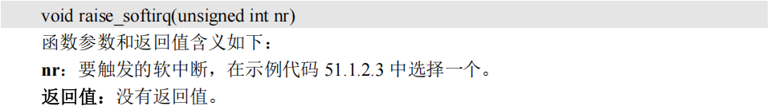
> **软中断**必须在编译的时候，**静态注册**

---
内核使用`softirq_init`来**初始化软中断**， 定义在`kernel/softirq.c`中
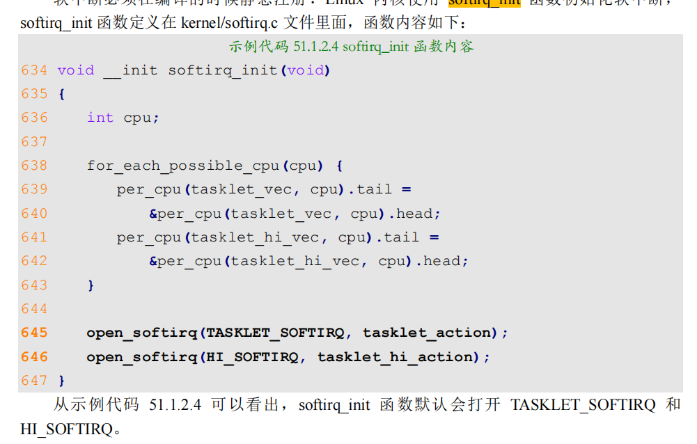
> 这里具体不是很明白，但是更常用的是tasklet

#### tasklet
软中断是底层框架，而 Tasklet 是基于软中断实现的更易用的“高级封装”。

> **区别和联系：**
> 
> 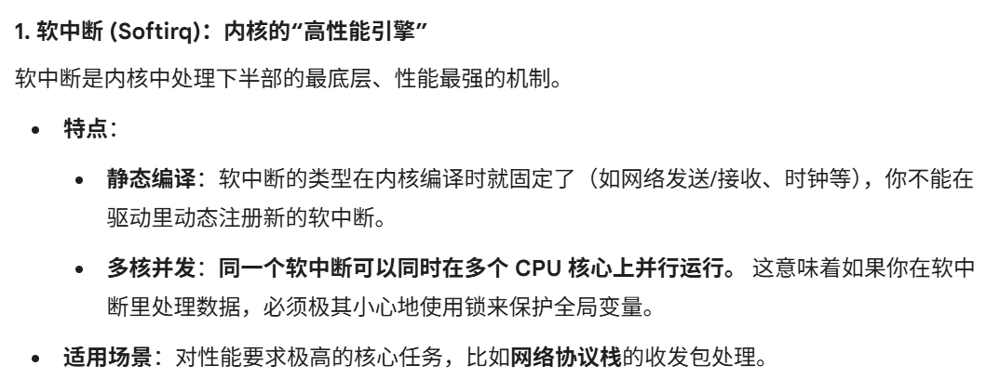
> 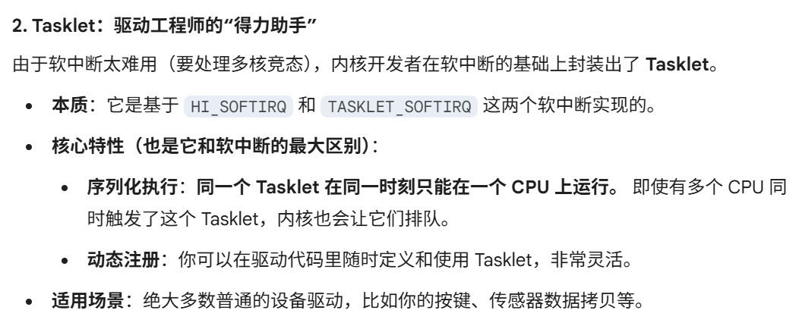

linux内核使用`tasklet_struct`**结构体**表示tasklet
```c
struct tasklet_struct
{
    struct tasklet_struct *next;        /* 下一个 tasklet */
    unsigned long state;                /* tasklet 状态 */
    atomic_t count;                     /* 计数器，记录对 tasklet 的引用数 */
    void (*func)(unsigned long);        /* tasklet 执行的函数 */
    unsigned long data;                 /* 函数 func 的参数 */
};
```
> **func函数**就是tasklet要执行的处理函数。由用户来定义函数内容。**就相当于我们的中断处理函数**。


---

**使用：**

先定义一个`tasklet`, 然后`tasklet_init`**初始化tasklet**
> 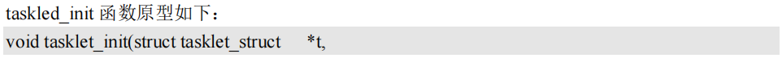
> 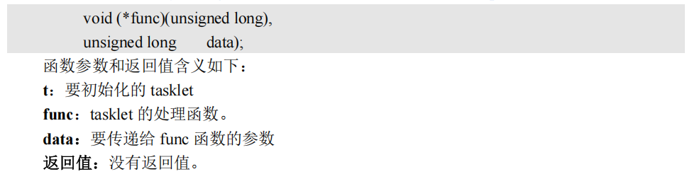
> 
> ---
> 
> 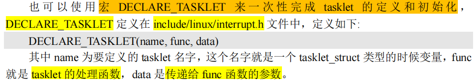

在**上半部**（我们实际的中断处理函数）中，调用`tasklet_schedule`就能使tasklet在**合适的时间运行**
> 就相当于自己开了一个软件上的可调度的任务处理链表，类似rtos
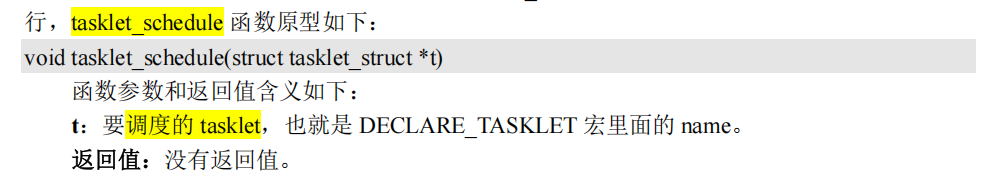

tasklet示例：
```c
/* 定义 taselet */
struct tasklet_struct testtasklet;

/* tasklet 处理函数 */
void testtasklet_func(unsigned long data)
{
        /* tasklet 具体处理内容 */
}
/* 中断处理函数 */
irqreturn_t test_handler(int irq, void *dev_id)
{
        ......
        /* 调度 tasklet */
        tasklet_schedule(&testtasklet);
        ......
}
/* 驱动入口函数 */
static int __init xxxx_init(void)
{
        ......
        /* 初始化 tasklet */
        tasklet_init(&testtasklet, testtasklet_func, data);
        /* 注册中断处理函数 */
        request_irq(xxx_irq, test_handler, 0, "xxx", &xxx_dev);
        ......
}
```


##### tasklet流程图解
```c
┌─────────────────────────────────────┐
│ 【硬件中断】CPU触发中断 → 关本地中断 │
└─────────────────────────────────────┘
         ↓
┌─────────────────────────────────────┐
│ 【内核态-上半部】执行硬中断处理函数 │
│  1. 快速处理：清中断标志、保存硬件状态 │
│  2. 调用tasklet_schedule(&my_tasklet) │
│     → 把tasklet挂到软中断链表        │
│     → 置位软中断标志（TASKLET_SOFTIRQ）│
│  3. 上半部执行完毕（极短，几十微秒）  │
└─────────────────────────────────────┘
         ↓
┌─────────────────────────────────────┐
│ 【内核态-中断退出检查】执行irq_exit() │
│  1. 检查：有没有pending的软中断？     │
│     （此时TASKLET_SOFTIRQ已置位 → 有）│
│  2. 调用do_softirq() → 开本地中断！   │
│     （关键：此时已退出硬中断上下文，能响应新中断） │
└─────────────────────────────────────┘
         ↓
┌─────────────────────────────────────┐
│ 【内核态-软中断/tasklet】执行任务    │
│  1. 遍历tasklet链表，执行my_tasklet的处理函数 │
│  2. 执行耗时操作（比如数据拷贝，但不能睡眠！） │
│  3. 执行完后，清除tasklet的pending标志 │
│  （如果中途又来硬中断：暂停tasklet → 执行硬中断上半部 → 挂新tasklet → 回到当前tasklet继续执行） │
└─────────────────────────────────────┘
         ↓
┌─────────────────────────────────────┐
│ 【内核态-返回准备】软中断执行完毕    │
│  1. 关本地中断（临时）                │
│  2. 检查：还有没有新的软中断？        │
│     → 没有 → 准备返回进程上下文      │
└─────────────────────────────────────┘
         ↓
┌─────────────────────────────────────┐
│ 【用户态】回到进程P，继续执行原代码  │
└─────────────────────────────────────┘
```

#### 工作队列
工作队列是另一种下半部的执行方式。在**进程上下文执行**（对比前面tasklet,还没有返回进程下文）

工作队列将要推后的工作交给一个**内核线程**去执行，因为工作队列工作在进程上下文，因此工作队列允许睡眠或重新调度


##### 概念梳理
**概念梳理**：
- **内核**：
  - 是整个操作系统的 “地基 + 规则制定者”，它管理 CPU、内存、硬件，提供所有进程能运行的 “基础设施”；
  - 本身是**一套代码 + 数据结构 + 硬件管理逻辑**，它不是 “执行单元”，而是 “管理执行单元的规则集”
- **进程**：
  - 地基上 “按规则干活的独立个体”（不管是`用户进程`还是`内核线程`，本质都是 “执行流”）
  - 是有**独立上下文**、**有生命周期**、**可被调度**的 “**执行单元**”
- **内核线程**
  - **跑在内核态的特殊进程**，归内核管理，没有用户态的地址空间的轻量化进程
  - 和**普通用户进程**对比：
  - 
  - 内核线程的典型例子，`ps -ef |grep k`, **k开头**的进程
    - `kthreadd`：所有内核线程的 “父线程”，负责创建其他内核线程；
    - `kswapd0`：内存交换守护线程，负责内存页的换入换出；
    - `kworker/0:0`：中断下半部（工作队列）的执行线程；
    - `khubd：USB` 集线器管理线程；
    - >它们是**内核**用来**异步处理自身任务**的 “执行载体”，比如你之前学的中断下半部里的 `workqueue`，本质就是靠**内核线程**来执行延后的任务

> **内核线程和中断下半部，tasklet和工作队列对比的关系**
>
> 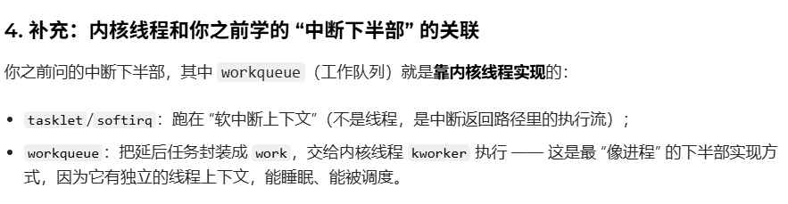
>
> 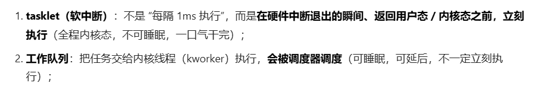

##### 工作队列流程图解
```c
┌─────────────────────────────────────┐
│ 【硬件中断】CPU触发中断 → 关本地中断 │
└─────────────────────────────────────┘
         ↓
┌─────────────────────────────────────┐
│ 【内核态-上半部】执行硬中断处理函数 │
│  1. 快速处理：清中断标志、保存硬件状态 │
│  2. 调用queue_work(my_workqueue, &my_work) │
│     → 把work任务挂到工作队列        │
│     → 唤醒对应的kworker内核线程      │
│  3. 上半部执行完毕                  │
└─────────────────────────────────────┘
         ↓
┌─────────────────────────────────────┐
│ 【内核态-中断退出】直接返回用户态！  │
│  （关键：不立即执行任务，硬中断退出后直接回用户态） │
└─────────────────────────────────────┘
         ↓
┌─────────────────────────────────────┐
│ 【用户态】进程P继续执行原代码        │
└─────────────────────────────────────┘

# 与此同时，内核调度器并行处理：
┌─────────────────────────────────────┐
│ 【内核态-内核线程】kworker被唤醒     │
│  1. 调度器发现kworker就绪 → 择机调度 │
│     （可能是立刻，也可能等进程P时间片用完） │
│  2. kworker执行my_work的处理函数     │
│     → 可睡眠（比如调用msleep()）      │
│     → 可调用阻塞式函数（比如copy_to_user） │
│  3. 执行完毕，kworker回到睡眠状态    │
└─────────────────────────────────────┘
```

##### api
linux内核使用`work_struct`结构体表示**一个工作**
```c
struct work_struct {
        atomic_long_t data; 
        struct list_head entry;
        work_func_t func;           /* 工作队列处理函数 */
};
```
这些工作，组织成一个工作队列，**工作队列**使用：`workqueue_struct`结构体表示
```c
struct workqueue_struct {
        struct list_head pwqs; 
        struct list_head list; 
        struct mutex mutex; 
        int work_color;
        int flush_color; 
        atomic_t nr_pwqs_to_flush;
        struct wq_flusher *first_flusher;
        struct list_head flusher_queue; 
        struct list_head flusher_overflow;
        struct list_head maydays; 
        struct worker *rescuer; 
        int nr_drainers; 
        int saved_max_active;
        struct workqueue_attrs *unbound_attrs;
        struct pool_workqueue *dfl_pwq; 
        char name[WQ_NAME_LEN];
        struct rcu_head rcu;
        unsigned int flags ____cacheline_aligned;
        struct pool_workqueue __percpu *cpu_pwqs;
        struct pool_workqueue __rcu *numa_pwq_tbl[];
};
```

linux内核使用**工作者线程**（`worker_thread`）来处理**工作队列**中的各种**工作**, linux内核用`worker`结构体表示**工作者线程**
```c
struct worker {
        union {
            struct list_head entry; 
            struct hlist_node hentry;
        };

        struct work_struct *current_work; 
        work_func_t current_func; 
        struct pool_workqueue *current_pwq;
        bool desc_valid;
        struct list_head scheduled; 
        struct task_struct *task; 
        struct worker_pool *pool; 
        struct list_head node; 
        unsigned long last_active; 
        unsigned int flags; 
        int id; 
        char desc[WORKER_DESC_LEN];
        struct workqueue_struct *rescue_wq;
};
```

可以看到，每个**工作者线程`worker`**,都有**一个工作队列**。工作者线程处理自己的工作队列中的任务。

在实际的驱动开发中，我们**只需要定义工作**(work_struct)即可,**工作队列workqueue**和**工作者线程worker** 都不用去管

---
**创建工作**：

>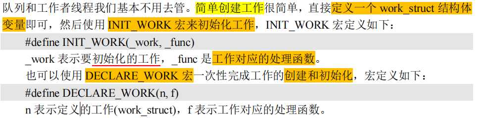

**调度任务**（开始让worker工作者线程执行他的工作队列）
>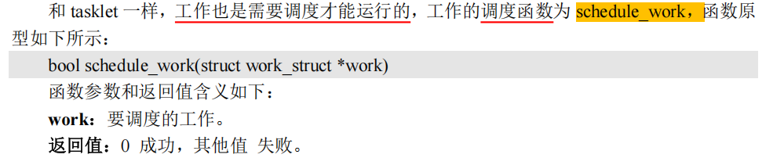

>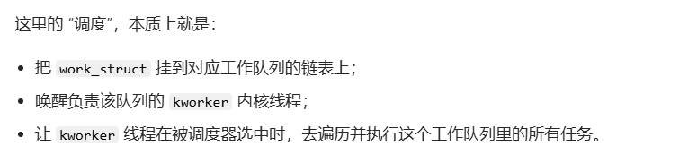

示例：
```c
/* 定义工作(work) */
struct work_struct testwork;

/* work 处理函数 */
void testwork_func_t(struct work_struct *work);
{
 /* work 具体处理内容 */
}

/* 中断处理函数 */
irqreturn_t test_handler(int irq, void *dev_id)
{
 ......
 /* 调度 work */
 schedule_work(&testwork);
 ......
}

/* 驱动入口函数 */
static int __init xxxx_init(void)
{
 ......
 /* 初始化 work */
 INIT_WORK(&testwork, testwork_func_t);
 /* 注册中断处理函数 */
 request_irq(xxx_irq, test_handler, 0, "xxx", &xxx_dev);
 ......
}
```
> work就相当于回调处理函数，逻辑肯定都是固定好的，比如拷贝数据任务。
> 中断里面判断，如果需要，就开启调度，挂上去一个任务


##### 使用注意
- kworker工作者线程 
  - **不是只有一个**，而是按 **CPU 核心** / **工作队列类型**，有多个 kworker 线程（甚至成百个），Linux 会**动态创建 / 销毁**，核心目的是并行处理任务、避免单线程瓶颈
    - **CPU核心**：
      - kworker/0:0、kworker/0:1 对应 CPU0，kworker/1:0 对应 CPU1）
      - 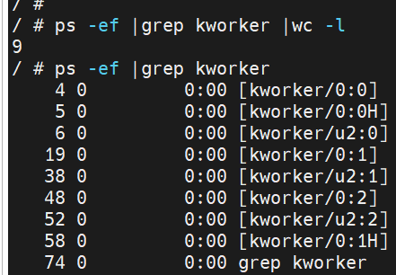
    - **工作队列类型**：
      - 线程分为 “普通”（处理默认队列）、“高优先级”（处理紧急任务）、“绑定 CPU”（处理指定核心任务）等类型；
    - **动态管理**：
      - 系统负载高时，内核会动态创建更多 kworker；负载低时，会销毁闲置的 kworker
    - `ps -ef | grep kworker | wc -l`
  - **为什么分类这么多**：
    - >
- ---
- **schedule，把work挂到queue**
  - 每个work里，都有一个**状态位**(`pending`)
    - 0: work空闲，未在queue
    - 1: work挂入queue, 处于待处理状态
  - **schedule_work的核心逻辑**：
    - 原子性检查pending标志位
      - pending = 0, 置1， 挂入队列queue, 唤醒kworker线程
      - pending = 1, 直接返回， 不会重复挂入
  - > **所以如果一个任务已经被挂入了，就无法再次被挂入queue**
  - 这样设计，避免重复执行同一个任务。防止出现 “**同一个任务被多次调度、重复处理数据**” 的 BUG：
    - 比如你用 `my_work` 处理**网卡收包**，如果允许重复挂入，可能会导致同一个数据包被处理两次
    - **原子性**的 `test_and_set_bit` 操作，保证了即使多 CPU/core 同时调用 schedule_work(&my_work)，也只会有一次成功
- ---
- **需要重复挂任务的情况（中断快速进入两次）**
  - ```c
    中断上半部 → 调用schedule_work(&my_work) → my_work还在执行（pending=1）→ 又来中断 → 再次调用schedule_work(&my_work) → 失败 → 担心数据丢失？
    ```
  - **方案1**： queue_work + delay_work
    - 任务即使重复触发，也只需执行一次最新的（网卡收包）
      - 定义 `struct delayed_work`（**带延迟的 work**）
      - 调用 `mod_delayed_work`：如果任务已在队列中，会更新执行时间（不是新增任务），保证只执行一次最新的
      - ```c
        // 定义延迟work
        struct delayed_work my_dwork;

        // 初始化：绑定处理函数
        INIT_DELAYED_WORK(&my_dwork, my_handler);

        // 中断上半部调用（重复调用也安全）
        // 参数3：延迟0ms执行（立刻执行）
        mod_delayed_work(system_wq, &my_dwork, 0);
        ```
  - **方案2**， 用完work后手动重置
    - 必须执行多次，一次不能少，**采集数据**
    - 定义多个work (work数组)
    - 每次中断选择一个空闲的work挂入队列
    - work执行完后，重置为空闲状态
    - ```c
        // 定义3个work，应对高频中断
        #define WORK_NUM 3
        struct work_struct my_works[WORK_NUM];
        // 标记每个work是否空闲
        atomic_t work_idle[WORK_NUM] = {ATOMIC_INIT(1), ATOMIC_INIT(1), ATOMIC_INIT(1)};

        // 初始化所有work
        void init_my_works() {
            for (int i=0; i<WORK_NUM; i++) {
                INIT_WORK(&my_works[i], my_handler);
                atomic_set(&work_idle[i], 1);
            }
        }

        // 中断上半部调用：找空闲work挂入
        void irq_handler() {
            for (int i=0; i<WORK_NUM; i++) {
                // 原子性检查并占用空闲work
                if (atomic_cmpxchg(&work_idle[i], 1, 0) == 1) {
                    schedule_work(&my_works[i]);
                    break;
                }
            }
        }

        // work处理函数：执行完后重置为空闲
        void my_handler(struct work_struct *work) {
            // 处理数据拷贝等任务
            process_data();
            
            // 找到当前work的索引，重置空闲标记
            int idx = work - my_works;
            atomic_set(&work_idle[idx], 1);
        }
  - ```
  - ---
  - **方案3**： 用workqueue_create创建专属队列(并非解决快速重挂工作)
    - 任务优先级高，不想和其他内核任务抢kworker
    - ```c
        // 创建专属队列，会有独立的kworker线程
        struct workqueue_struct *my_wq = create_workqueue("my_drv_wq");

        // 挂任务到专属队列
        queue_work(my_wq, &my_work);
    -  ```
    - 使用专属队列的好处
      - 有一个好处是可以定制优先级，这样你这个专属队列对应的**worker线程有更高的优先级**，可以进行**抢占**。
      - 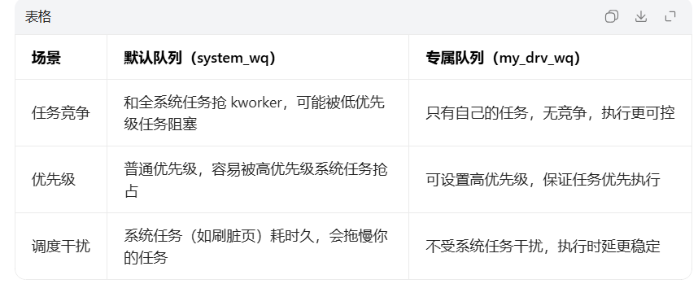
- ---
- 
- worker工作者线程，work_queue工作队列，work工作的对应关系
  - **工作队列（workqueue）**：
    - 内核预设了多个「**默认队列**」，驱动也可创建「**专属队列**」，是存放 **work 的 “任务容器”**；
    - > 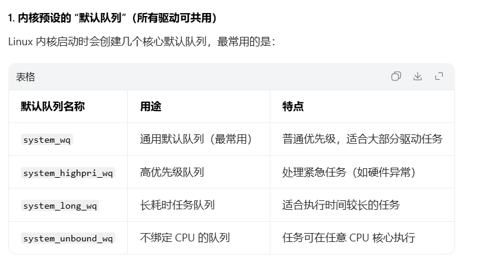
    - > 
    - > 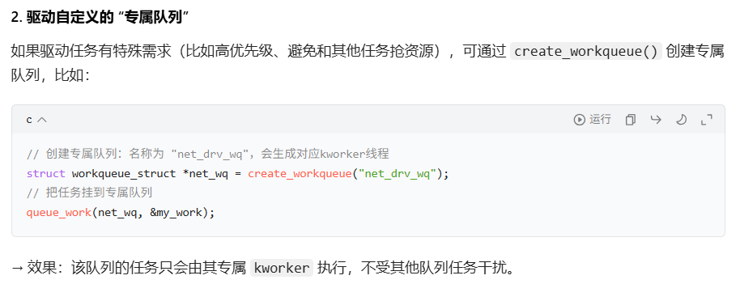
    - > 不同调度函数，可以把work挂到不同的队列
    - > 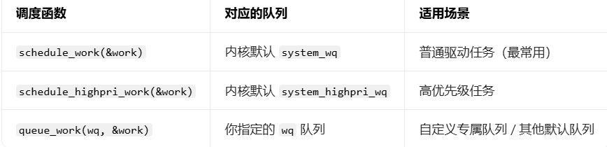
  - **工作者线程（kworker）**：
    - 每个队列对应一组 **kworker 线程池**（按 CPU 核心划分），是执行 work 的 “工人”；
  - **工作任务（work_struct）**：
    - **来自不同驱动**的异步任务（比如网卡收包、磁盘刷页），是 “**待干的活**”，可挂到任意队列中，由该队列的 kworker 执行。
  - **三者关系：**
    - >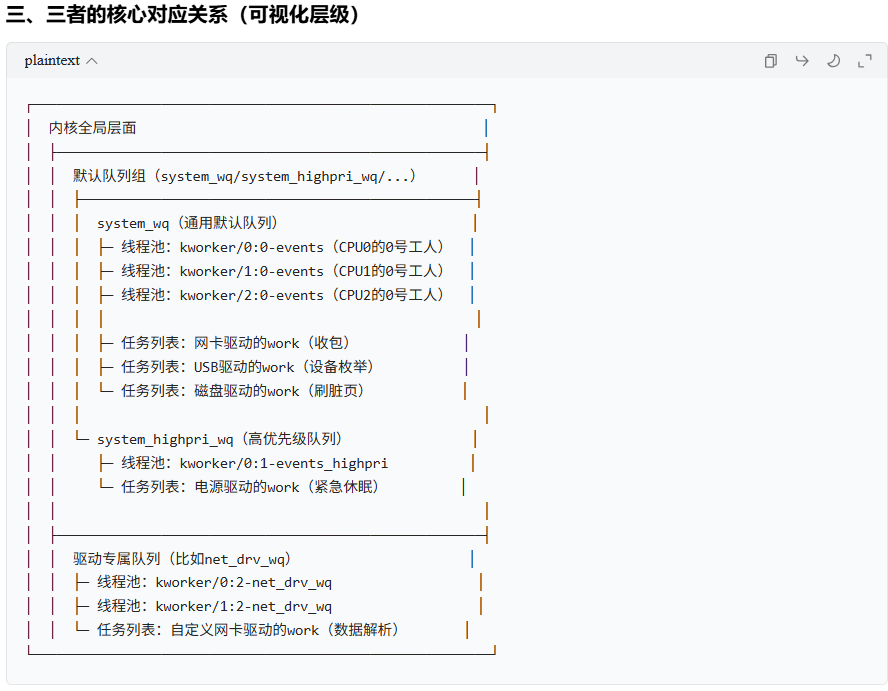

---

- **创建专属队列**
  - 调用**队列创建函数**，内核会自动为**每个CPU核心**创建对应的**kworker线程**
  - > 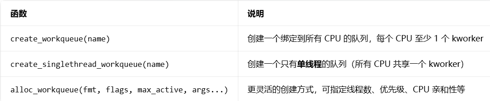
  - ```c
    #include <linux/workqueue.h>

    // 定义队列指针
    struct workqueue_struct *my_drv_wq;

    // 驱动初始化时创建队列
    int my_drv_init(void) {
        // 方式1：创建普通队列，每个CPU一个kworker
        my_drv_wq = create_workqueue("my_drv_wq");

        // 方式2：创建单线程队列（所有CPU共享一个kworker）
        // my_drv_wq = create_singlethread_workqueue("my_drv_wq_single");

        if (!my_drv_wq) {
            pr_err("Failed to create workqueue\n");
            return -ENOMEM;
        }
        return 0;
    }

    // 驱动退出时销毁队列
    void my_drv_exit(void) {
        destroy_workqueue(my_drv_wq);
    }
  - ```
  - ---
  - 
- **怎么 “知道” 自己的 worker 是谁？**
  - 方式1：看进程名
    - 内核线程就是一个特殊进程，`ps -ef | grep kworker`
    - 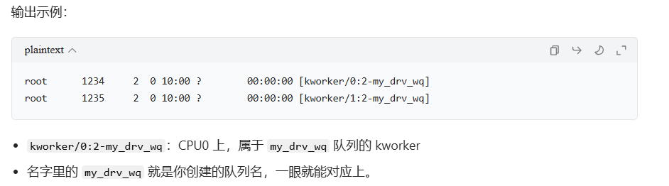
  - 方式2：用调试接口
    - 查看 `/sys/kernel/debug/workqueue/workqueues` 文件，能看到**队列**和**其线程池**的对应关系：
    - 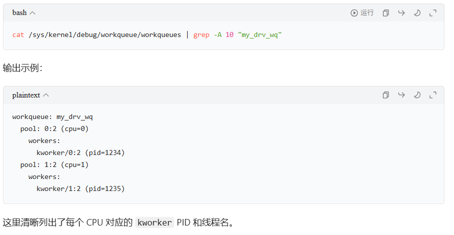
- **怎么控制创建多少 worker？**
  - 通过 `alloc_workqueue()` 的参数来精细控制**线程数量**和行为
  - 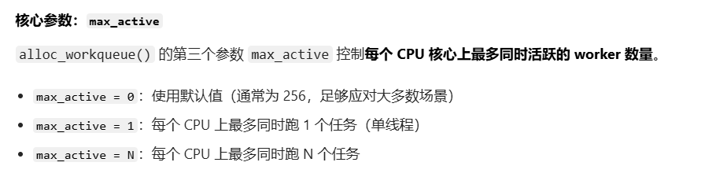
  - 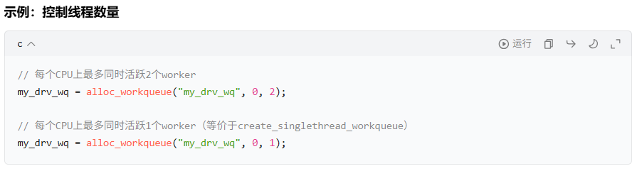

## dts中断拓破关系梳理
- /
  - **`cpus`**
  - **`soc`**
    - **中断父控制器** = **gpc**
    - uart
    - gpiox
      - **中断控制器**
    - gpc
      - **中断控制器**， **中断父控制器** = intc
  - **`clocks`**
  - **`intc`**: 
    - **GIC设备节点**， **中断控制器**

所以整个**中断信号的级联**如下所示
```c
       +---------------------------------------+
       |       ARM Cortex-A7 CPU Core          |
       |    (最终执行你的中断处理函数 Handler)      |
       +---------------------------------------+
                           ^
                           | (信号最终到达)
       +---------------------------------------+
       |        GIC (intc) 顶级控制器           |  <-- 你的 dts 根节点下
       |     (管理所有 SoC 级别的中断源)           |
       +---------------------------------------+
                           ^
                           | interrupt-parent = <&intc>
       +---------------------------------------+
       |        GPC (电源与唤醒控制器)           |  <-- soc 节点下的中转站
       |  (负责低功耗唤醒，信号在这里做一次“安检”)    |
       +---------------------------------------+
                           ^
                           | interrupt-parent = <&gpc>
       +---------------------------------------+
       |       GPIO5 控制器 (子控制器)          |  <-- 声明了 interrupt-controller
       |  (把一组 32 个引脚的中断“汇总”给上级)     |
       +---------------------------------------+
             /      |      |      \
      引脚 0   引脚 1   ...   引脚 31  (硬件通道)
        ^
        | interrupts = <0 8>
  +-----------+
  | fxls8471  |  <-- 你的外设 (传感器)
  | (信号源头) |
  +-----------+
```
----
> 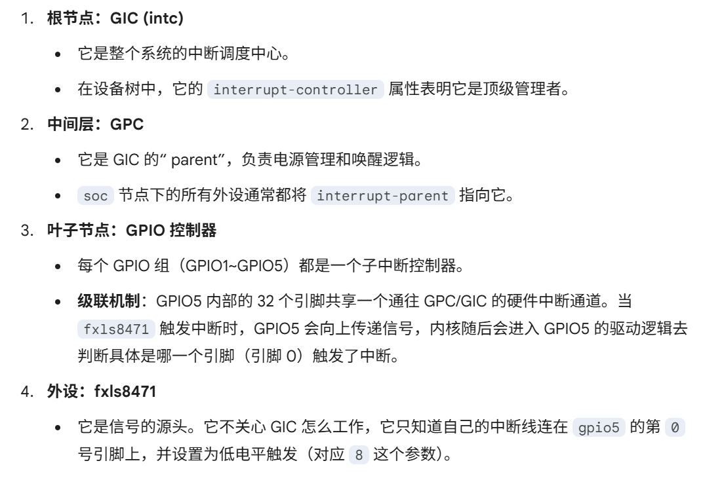

**之前编写裸机gpio中断时，没有关心过gpc，原因是：**

> 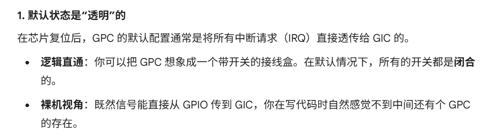
> 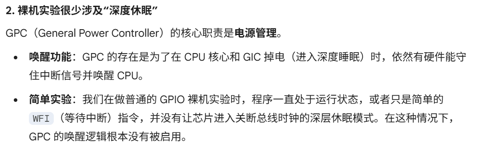
> 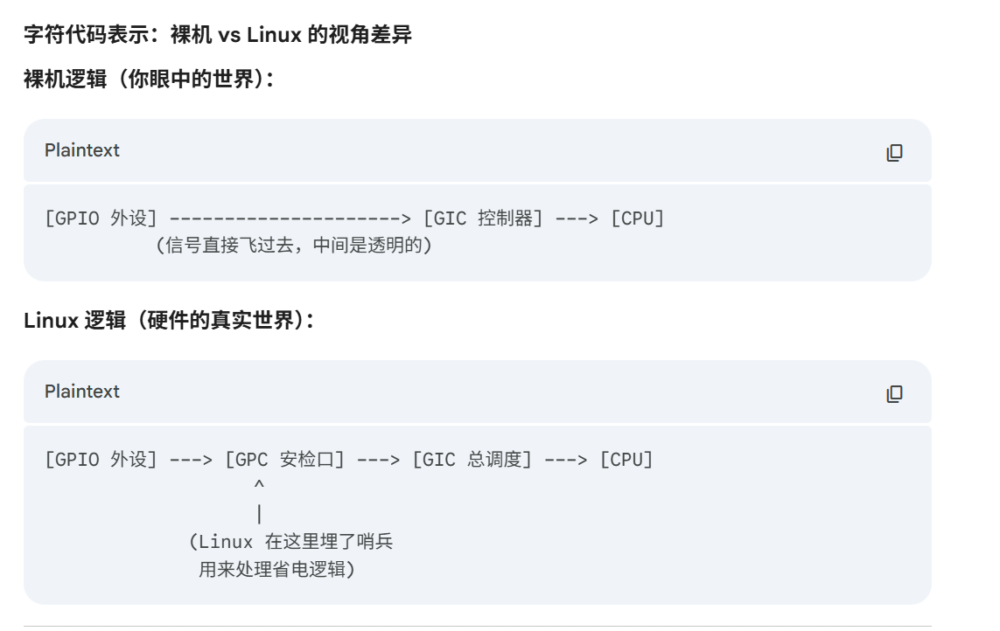

## 节点中断属性
- **`#interrupt-cells`** = <3>
  - 指明interrupts属性中的元素个数
  - interrupts = <中断类型(0=SPI,1=PPI), 中断号， 标志(中断触发类型，PPI中断的CPU掩码)>
- **`interrupt-controller`**
  - 为空，表面当前节点为中断控制器
- **`interrupt-parent`**
  - 设置使用的上一级的中断控制器
  - 假设父中断控制器是gpio5，说明该设备的中断信号INT线接到gpio5组上，当发送中断，gpio5组直接告知gpc，这组gpio有中断
- **`interrupts`**
  - 设置该设备具体走的什么中断信息，联合你上面的中断控制器
  - **<gpio号 触发方式>** = <0 8>, 表面GPIO5_IO00, 8表示低电平触发
    - 触发方式的具体宏定义在`include/dt-bindings/interrupt-controller/irq.h`

在dts中设置好了我们的中断线连接之后，我们下一步就是要让linux内核的驱动们知道我们的中断pin，肯定是**OF函数**：`irq_of_parse_and_map`

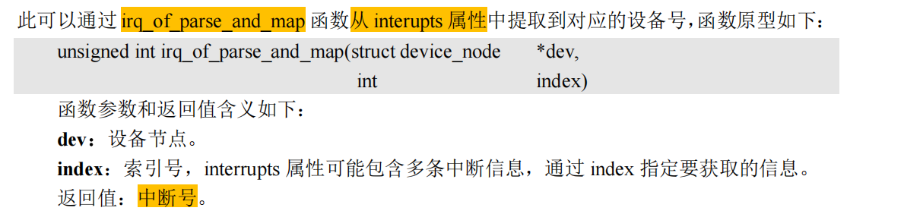

如果我们的外设节点，他的中断引脚接到gpio上来上传中断信号，也可以使用`gpio_to_irq`来**获取gpio对应的中断号**（因为我们知道接在哪个gpio上，而每组gpio的中断号是固定的）
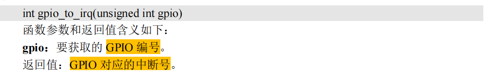


## 实验
**实验设计**：
- 用户态程序（消费者）读取按键值（原子变量），并打印。
  - 检查完整计数 是否 == 1
    - ==1，校验前面的记录键值，也可以直接返回，完整计数归0
    - !=1, 失败读取，返回错误值。
- key0按键驱动，采用中断双边沿触发的方式，，并用定时器消抖。生产按键检测
  - 按下 + 释放 = 一次完整的按键
  - 按下：
    - 下降沿本身触发中断，此时已经是0了，
    - 中断内无需读取，直接开启定时器10ms
    - 定时器中断处理函数，再读一次，若还是0，置为00000001
  - 释放：
    - 上升沿本身触发中断，此时已经是1了
    - 中断内无需读取，直接开启定时器10ms
    - 定时器中断处理函数，再读一次，若还是1，置为10000001， 完整按键计数 = 1

这里还学习了一下，如何用**面向对象的思想**，**去编写我们的一个设备的驱动**，我自己手写了一遍，还是有很多收获的，用对象的思维，去描述，**比较有条理**。

```c
//通用
#include <linux/types.h>
#include <linux/kernel.h>
#include <linux/delay.h>
#include <linux/ide.h>

//module
#include <linux/init.h>
#include <linux/module.h>

//err, gpio_macro
#include <linux/errno.h>
#include <linux/gpio.h>

//register_cdev
#include <linux/cdev.h>

//mknod
#include <linux/device.h>

//dts OF
#include <linux/of.h>
#include <linux/of_address.h>
#include <linux/of_gpio.h>

//ioremap
#include <asm/mach/map.h>
#include <asm/uaccess.h>
#include <asm/io.h>

//irq
#include <linux/of_irq.h>

//timer
#include <linux/timer.h>

//workqueue
#include <linux/workqueue.h>

#define DEV_CNT 1
#define INT_CNT 1
#define DEV_NAME "int_key"
#define DEV_CLASS "int_key_class"
#define DEV_DEVICE "int_key_device"
#define INVAKEY 	0xFF	//无效键值（没按下）
#define KEY0VALUE	0x01	//有效键值（按下）

/*
 *	假设现在有一个设备黑盒，编写他的驱动
 *	这个黑盒设备表现为一个按键，同时有多根中断线，分别接到不同的gpio上。
 * */

//描述一根线的对象， 这根线，有gpio功能，还有irq中断功能
struct line_desc {
	/*
	 * 该根line的gpio功能
	 * */
	int gpio;								//该中断信号线接到的gpio
	unsigned char value;					//按键对应的键值
	
	/*
	 * 该根line的中断功能
	 *
	 * */
	int irqnum;								//该gpio对应的中断号
	irqreturn_t (*irq_handler)(int, void*);	//该中断的中断处理函数

	char name[10];							//该line的名称, 数据线/中断线/cc....
};

//一个按键设备的对象描述，我们有多少个设备，就new多少个对象，面向对象编程
struct key_t {
		//alloc devid
		dev_t devid;
		int major;
		int minor;

		//register cdev
		struct cdev _cdev;

		//mknod class and device
		struct class * _class;
		struct device * _device;

		//dts node
		struct device_node * _dtb_node;

		//键值，一个设备，有一个来表示此时的状态
		atomic_t keyvalue;			//有效按键值
		atomic_t releasekey;		//标记是否完成一次完全的按键

		//该设备带一个定时器，用来消抖
		struct timer_list timer;

		//该设备含有的线
		struct line_desc line_list[INT_CNT]; 

		//发生中断的line是编号
		unsigned char curkeynum;

} key;

//以上，就new好了一个key的设备，他有自己的按键值，同时带了一个定时器用于消抖
//且这个设备里面，还有好多个中断线，每个中断线条，接到他们对应的gpio上，有他们自己的gpio编号还有中断号和中断处理函数。

static int key_open(struct inode * inode, struct file * filp)
{
	filp->private_data = &key;
	return 0;
}

//用户态进程读取内核态的数据，读取和gpio按键中断是异步的，两个构成并发竞争的生产者消费者模型。
static ssize_t key_read(struct file * filp, char __user * buf, size_t cnt, loff_t * offt)
{
	int ret = 0;
	unsigned char keyvalue = 0;
	unsigned char releasekey = 0;
	struct key_t * _key = (struct key_t *)filp->private_data;

	keyvalue = atomic_read(&_key->keyvalue);
	releasekey = atomic_read(&_key->releasekey);

	//releasekey = 1, 表明曾经经过了按下+释放，一次有效按键，没有被清除
	if(releasekey){
		//校验抬起的那一次 0x10000001
		if(keyvalue & 0x80){
			keyvalue &= ~0x80;
			//拷贝0x00000001到用户空间
			ret = copy_to_user(buf, &keyvalue, sizeof(keyvalue));
		} else {
			goto data_error;
		}
		atomic_set(&_key->releasekey, 0);
		
	} else {
		goto data_error;
	}

	return 0;

data_error:
	return -EINVAL;
}


//key的cdev的操作函数集合
 static struct file_operations key_fops = {
	.owner = THIS_MODULE,	
	.open = key_open,
	.read = key_read,
};


//gpio中断（双边沿触发）处理函数
/*
 * 当你按下去的时候，键值是0,已经触发了中断，无需在记录键值，
 * 我只要依靠定时器，10ms后，在读一次，查看键值看看是否是0,
 * 如果是0, 则就是一次按键按下。
 *
 * 一次有效的按键过程为：按下+释放
 *
 * 按键按下
 * 触发下降沿中断(0)
 * 延时10ms，触发定时中断
 * 定时中断读取，仍为0, 有效按下，标记key的keyvalue为0
 *
 * ...
 *
 *
 * 按键抬起
 * 触发上升沿中断(0)
 * 延时10ms，触发定时器中断
 * 定时中断读取，发现是1,有效释放，标记key的releasekey为1
 *
 *
 *
 * */
static irqreturn_t key0_handler(int irq, void * dev_id){
	struct key_t * _key = (struct key_t *)dev_id;

	//curkeynum，表明在中断处理函数中判断是哪一根的line的中断
	_key->curkeynum = 0;


	//开始定时器，定时10ms后，进入定时器中断
	_key->timer.data = (unsigned long)dev_id;
	mod_timer(&_key->timer, jiffies + msecs_to_jiffies(10));
	
	//printk("key0 handler\n");
	return IRQ_RETVAL(IRQ_HANDLED);
}


//定时器中断函数：
void timer_function(unsigned long arg)
{
	struct key_t* _key = (struct key_t *)arg;
	unsigned char value;
	unsigned char num;
	struct line_desc * line;

	num = _key->curkeynum;
	line = &_key->line_list[num];		//这根line发生中断

	//读一次gpio的值
	value = gpio_get_value(line->gpio);
	if(value == 0){
		//keyvalue = 0x000001, 表面此时仍处于按下
		atomic_set(&_key->keyvalue, line->value);
	} else {
		//keyvalue = 0x100001, releasekey = 1
		atomic_set(&_key->keyvalue, 0x80 | line->value);
		atomic_set(&_key->releasekey, 1);		//标记松开按键
	}
	//printk("timer function\n");

}


//key设备的初始化
int key_new(struct key_t * _key)
{
	unsigned char i = 0;
	int ret = 0;

	//初始化原子变量的键值表示
	//keyvalue = 0x11111111, release=0x11111111
	atomic_set(&_key->keyvalue, INVAKEY);
	atomic_set(&_key->releasekey, INVAKEY);

	//获取key这个设备的dts中的设备节点
	_key->_dtb_node = of_find_node_by_path("/mykey_int@0");
	if(_key->_dtb_node == NULL){
		printk("dtb node cannot find\n");
		return -EINVAL;
	}

	//读取所有的line的gpio
	for(i = 0; i < INT_CNT; i++){
		_key->line_list[i].gpio = of_get_named_gpio(_key->_dtb_node, "key-gpio", i);
		if(_key->line_list[i].gpio < 0)
			printk("cannot get key%d\n", i);
	}

	//初始化所有的line，为他们申请gpio，开中断
	for(i = 0; i < INT_CNT; i++){
		//line命名
		memset(_key->line_list[i].name, 0, sizeof(_key->line_list[i].name));
		sprintf(_key->line_list[i].name, "LINE%d", i);	
		
		//申请gpio, 使能gpio子系统, 初始化gpio功能
		gpio_request(_key->line_list[i].gpio, _key->line_list[i].name);
		gpio_direction_input(_key->line_list[i].gpio);

		//由gpio号得到line专属IRQ中断号
		_key->line_list[i].irqnum = irq_of_parse_and_map(_key->_dtb_node, i);

		printk("key%d : gpio=%d, irqnum=%d\n", i, 
											_key->line_list[i].gpio, 
											_key->line_list[i].irqnum);
	}

	//只有第一根线是中断
	_key->line_list[0].irq_handler = key0_handler;
	_key->line_list[0].value = KEY0VALUE;

	//申请中断，使能中断子系统
	for(i=0; i<INT_CNT; i++){
		ret = request_irq(_key->line_list[i].irqnum, 
						  _key->line_list[i].irq_handler, 
						   IRQF_TRIGGER_FALLING | IRQF_TRIGGER_RISING,
						  _key->line_list[i].name,
						   _key);
		if(ret < 0){
			printk("irqnum = %d, request failed\n", _key->line_list[i].irqnum);
			return -EFAULT;
		}
	}

	//创建初始化定时器
	init_timer(&_key->timer);
	_key->timer.function = timer_function;
}


//入口函数
static int __init mykey_init(void){

		//alloc devid
		alloc_chrdev_region(&(key.devid), 0, DEV_CNT, DEV_NAME);
		key.major = MAJOR(key.devid);
		key.minor = MINOR(key.devid);
		printk("key alloc devid over, major = %d, minor = %d\n", 
						key.major, key.minor);

		//register cdev
		key._cdev.owner = THIS_MODULE;
		cdev_init(&(key._cdev), &key_fops);
		cdev_add(&(key._cdev), key.devid, DEV_CNT);

		//mknod
		key._class = class_create(THIS_MODULE, DEV_CLASS);
		key._device = device_create(key._class, NULL, key.devid, NULL, DEV_DEVICE);

		//初始化key这个设备
		key_new(&key);

		printk("my dts key driver init over\n");
		return 0;
}


//出口函数
static void __exit key_exit(void){
		unsigned int i = 0;
		//删除定时器
		del_timer_sync(&key.timer);

		//释放line irq+gpio
		for(i = 0; i<INT_CNT; i++){
			free_irq(key.line_list[i].irqnum, &key);
			gpio_free(key.line_list[i].gpio);
		}
		
    	//注销devid
	    unregister_chrdev_region(key.devid, DEV_CNT);
	
		//注销字符设备
		cdev_del(&(key._cdev));

		//取消设备节点
		device_destroy(key._class, key.devid);
		class_destroy(key._class);
}


module_init(mykey_init);
module_exit(key_exit);

MODULE_LICENSE("GPL");
MODULE_AUTHOR("liangji");

```
