- [linux内核编译](#linux内核编译)
  - [编译](#编译)
  - [目录结构](#目录结构)
  - [Makefile分析](#makefile分析)
    - [版本号](#版本号)
    - [MAKEFLAGS变量](#makeflags变量)
    - [命令输出](#命令输出)
    - [静默输出](#静默输出)
    - [输出目录](#输出目录)
    - [代码检查](#代码检查)
    - [模块编译](#模块编译)
    - [设置目标架构，交叉编译器](#设置目标架构交叉编译器)
    - [调用scripts/Kbuild.include](#调用scriptskbuildinclude)
    - [交叉编译工具链变量设置](#交叉编译工具链变量设置)
    - [头文件路径变量](#头文件路径变量)
    - [导出变量](#导出变量)
    - [make xxx\_defconfig 过程](#make-xxx_defconfig-过程)
      - [Makefile.build 分析](#makefilebuild-分析)
    - [make过程](#make过程)
      - [head-y](#head-y)
      - [init-y, drivers-y和net-y](#init-y-drivers-y和net-y)
      - [libs-y](#libs-y)
      - [core-y](#core-y)
      - [各个子目录的build-in.o, .a编译产生过程](#各个子目录的build-ino-a编译产生过程)
    - [make zImage过程](#make-zimage过程)
      - [vmlinux, zImage, uImage区别](#vmlinux-zimage-uimage区别)
      - [vmlinux 转换成 zImage](#vmlinux-转换成-zimage)
- [linux内核启动过程](#linux内核启动过程)
  - [链接脚本 vmlinux.lds](#链接脚本-vmlinuxlds)
  - [启动流程分析](#启动流程分析)
    - [入口 stext](#入口-stext)
    - [\_\_mmap\_switched 函数](#__mmap_switched-函数)
    - [start\_kernel 函数](#start_kernel-函数)
    - [rest\_init 函数](#rest_init-函数)
    - [init进程](#init进程)
- [linux内核移植](#linux内核移植)
  - [先编译原厂的linux内核](#先编译原厂的linux内核)
  - [添加我们自己的开发板](#添加我们自己的开发板)
  - [修改主频](#修改主频)
  - [修改EMMC驱动](#修改emmc驱动)
  - [修改以太网驱动](#修改以太网驱动)

# linux内核编译
## 编译
着重看一下Makefile，了解linux内核的编译流程

和uboot一样，NXP原厂会下载linux社区的最新版本，然后移植到IMX的cpu上，然后我们再下载NXP的内核，移植到我们自己的开发板子上。

编译linux需要安装这个库
```c
sudo apt-get install lzop
```

编译指令为
```c
#!/bin/sh
make ARCH=arm CROSS_COMPILE=arm-linux-gnueabihf- distclean
make ARCH=arm CROSS_COMPILE=arm-linux-gnueabihf- imx_v7_defconfig
make ARCH=arm CROSS_COMPILE=arm-linux-gnueabihf- menuconfig
make ARCH=arm CROSS_COMPILE=arm-linux-gnueabihf- all -j16
```
但是实际编译运行后，报错
```c
CALL    scripts/checksyscalls.sh
  HOSTLD  scripts/genksyms/genksyms
  HOSTLD  scripts/dtc/dtc
/usr/bin/ld: scripts/dtc/dtc-parser.tab.o:(.bss+0x50): multiple definition of `yylloc'; scripts/dtc/dtc-lexer.lex.o:(.bss+0x0): first defined here
collect2: error: ld returned 1 exit status
make[2]: *** [scripts/Makefile.host:100：scripts/dtc/dtc] 错误 1
make[1]: *** [scripts/Makefile.build:403：scripts/dtc] 错误 2
make[1]: *** 正在等待未完成的任务....
  HOSTLD  scripts/mod/modpost
make: *** [Makefile:555：scripts] 错误 2
make: *** 正在等待未完成的任务....
```
会出现重复定义，原因是因为编译工具gcc版本更新了，新版本的编译工具不支持合并变量，导致重复声明。**解决办法**就是手动添加编译参数
```c
make KCFLAGS="-fcommon" HOSTCFLAGS="-fcommon"
```

## 目录结构
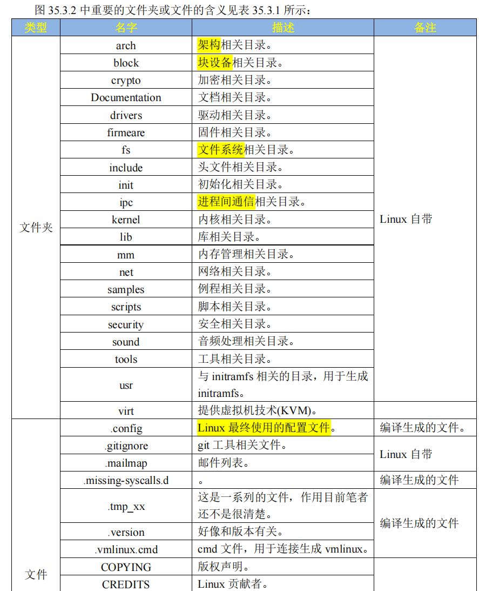
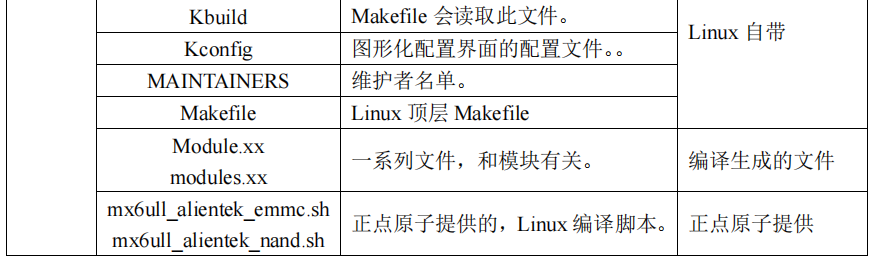
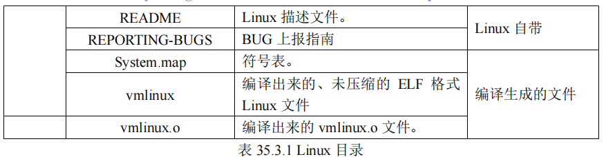

我们真正要关心的文件夹是
- **arch/**
  - 架构相关，比如arm, arm64, x86等架构
```c
arch/
    arm/
        boot/
            zImage
            bootp
            ...
            dts/                                    //这个目录是不同平台的设备树文件
                imx6ull-alientek-emmc.dts
                imx6ull-alientek-nand.dts
                ...
        common/
        configs/                                    //这个目录是不同平台的默认配置文件：xxx_defconfig
                imx_alientek_emmc_defconfig
                imx_v7_defconfig                    //这个就是针对我们开发板的默认配置文件
                .....
        ...
    arm64/
    x86/
    ...
```

> 以arch/arm架构为例，针对这个架构，有
> 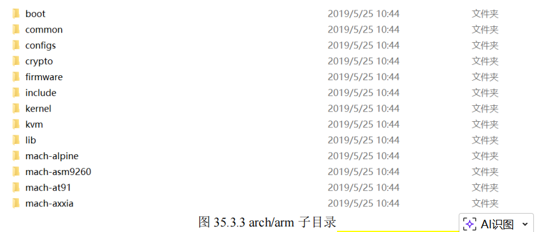
>
> 这些子目录，用于
> - 系统引导
> - 系统调用
> - 动态调频
> - 主频设置等


- arch
  - arm/
    - boot/
      - zImage 
      - Image
  - arm64/
  - x86/


> `arch/arm/boot`目录会保存编译出来的Image，zImage镜像文件，zImage就是我们需要的linux镜像文件


---

**此外还有**

- **block/**
  - `block/`是linux下**块设备目录**。比如SD卡，EMMC，NAND，硬盘这些存储设备，都是块设备。
  - 该目录下存放**管理块设备的相关文件**
- crypto
  - 加密文件，比如`crc`,`crc32`,`md4`,`md5`,`hash`这些**加密算法**
- Documentation
  - 相关文档，了解linux某个功能模块/驱动框架的功能，可以在里面查找
- **drivers/**
  - 驱动目录文件，学习重点
- firmware/
  - 存放固件
- **fs/**
  - 存放文件系统，比如：
    - ext2
    - ext4
    - f2fs
- **include/**
  - 头文件目录
- **init/**
  - 存放linux内核启动的时候初始化代码
- ipc/
  - 进程间通信
- **kernel/**
  - 内核代码
- lib/
  - 公用的库函数
- **mm/**
  - 内存管理相关代码
- net/
  - 网络相关代码
- samples/
  - 示例代码
- scripts/
  - 脚本目录，linux编译用到的脚本文件
- security/
  - 安全相关文件
- sound/
  - 音频相关驱动文件，音频驱动没有放到drivers中，单独一个目录
- tools/
  - 编译时的工具
- usr/
  - 存放和inittramfs有关代码
- virt/
  - 虚拟机相关文件
- .config
  - 和uboot一样，.config保存linux最终的配置信息。编译linux会读取这个文件，根据这个配置来选择编译哪些模块功能
- Kbuild
  - 一些Makefile会读取这个文件
- Kconfig
  - 图形化配置界面的配置文件
- **Makefile**
  - 顶层Makefile文件
- README
  - 介绍如何编译linux源码，以及目录的信息


## Makefile分析
Makefile和uboot的Makefile几乎差不多

### 版本号
定义一些变量，表示linux内核版本号：
- 4.1.15

### MAKEFLAGS变量
老样子，不停的加入当前目录
```c
MAKEFLAGS += -rR --include-dir=$(CURDIR)
```

### 命令输出
和uboot一样
```c
make V=1 //完整命令
make V=0 //简短命令
```

### 静默输出
和uboot一样
```c
make -s //静默编译，不打印任何信息
```
### 输出目录
```c
make O=dir  //指定编译产生的过程文件输出到指定目录
```
### 代码检查
```c
make C=1 //使能代码检查，检查哪些需要重新编译的文件
make C=2 //检查所有源码文件
```

### 模块编译
和uboot一样，
```c
make M=dir  //单独编译某个模块
```

### 设置目标架构，交叉编译器
同uboot
```c
ARCH = XXX
CROSS_COMPILE = XXX
```

### 调用scripts/Kbuild.include
同uboot, 使用这个文件来导入一些变量
```c
comma :=
quote :=
...//等等
```
### 交叉编译工具链变量设置
同uboot
### 头文件路径变量
顶层Makefile定义了两个变量保存头文件路径：
- USERINCLUDE
  - UAPI相关的头文件路径
- LINUXINCLUDE
  - linux内核源码的头文件路径

展开后为：
```c
USERINCLUDE := \
                -I./arch/arm/include/uapi \
                -Iarch/arm/include/generated/uapi \
                -I./include/uapi \
                -Iinclude/generated/uapi \
                -include ./include/linux/kconfig.h
LINUXINCLUDE := \
                -I./arch/arm/include \
                -Iarch/arm/include/generated/uapi \
                -Iarch/arm/include/generated \
                -Iinclude \
                -I./arch/arm/include/uapi \
                -Iarch/arm/include/generated/uapi \
                -I./include/uapi \
                -Iinclude/generated/uapi \
                -include ./include/linux/kconfig.h
```
### 导出变量
同uboot，顶层的Makefile也会导出很多变量给子Makefile使用。

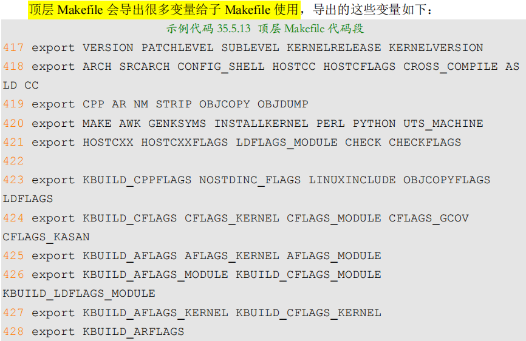

> 以上都和uboot类似，准备环境变量，导出变量，准备编译环境
---

### make xxx_defconfig 过程
这里开始配置linux内核，和uboot类似，都是设置定义变量：
- config-targets
  - =1
- mixed-targets
  - =0
- dot-config
  - =1

然后引用 `arch/arm/Makefile` 这个文件
> `zImage`, `uImage`这些文件，都是由`arch/arm/Makefile`生成的。

最终命令展开就是：
```c
@make -f ./scripts/Makefile.build obj=scripts/kconfig xxx_defconfig
```
> 总结，`make xxx_defconfig`来进行配置linux，最终依赖的时 `scripts/Makefile.build` 来实现的


#### Makefile.build 分析
前面得知，，“`make xxx_defconfig`“配置 Linux 的时候如下两行命令会执行脚本`scripts/Makefile.build`

```c
@make -f ./scripts/Makefile.build obj=scripts/basic
@make -f ./scripts/Makefile.build obj=scripts/kconfig xxx_defconfig
```
> 这一块比较复杂，后面有时间再分析，总之
>
> `make xxx_defconfig`之后，会在linux kernel **根目录**下生成 `.config`文件。

### make过程
前面我们用make xxx_defconfig配置好linux内核后，就开始用make 或者make all进行编译了。

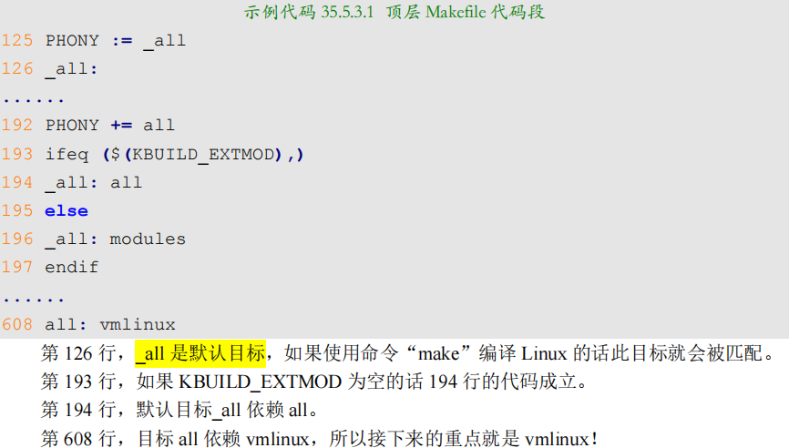

所以make all, 就是要依赖编译vmlinux

而`vmlinux`依赖
- scripts/link-vmlinux.sh
- $(head-y) 
- $(init-y)
- $(core-y) 
- $(libs-y) 
- $(drivers-y) 
- $(net-y)
- arch/arm/kernel/vmlinux.lds
- FORCE。

#### head-y
定义在arch/arm/Makefile中
```c
head-y := arch/arm/kernel/head$(MMUEXT).o
// 不使能MMU的话，MMUEXT=-nommu
// 使能MMU的话，为空
//最终：head-y = arch/arm/kernel/head.o
```
#### init-y, drivers-y和net-y
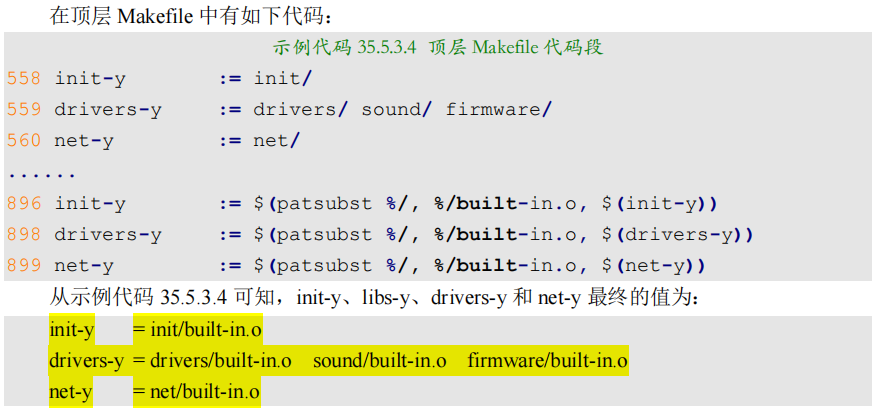

可以看到，是把
- init/
- drivers/
- net/
这3个文件夹里面的代码全部编译链接起来了。

#### libs-y
```c
libs-y = arch/arm/lib/lib.a lib/lib.a arch/arm/lib/built-in.o lib/built-in.o
```
这些是使用的库函数，最终使用到的库如上

#### core-y
和init-y一样，也在Makefile中+=了

最终，core-y的值
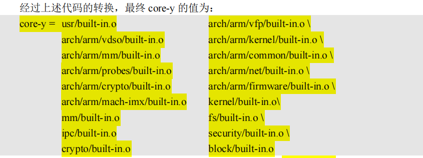

> 相当于把linux的源码，比如kernel里面的，ipc进程通信，加密，安全，块设备这些linux内核相关的代码全部放到core里面。

> **make 目标是`vmlinux`**， 依赖的`head-y`, `init-y`, `core-y`, `libs-y`, `drivers-y`, `net-y`, 都是由`built-in.o`/`.a`等文件。
>
> 这个和 uboot 一样，都是**将相应目录中的源码文件进行编译**，然后在**各自目录下**生成 `built-in.o` 文件，有些生成了`.a` 库文件。
> 
> 最终将这些 `built-in.o` 和`.a` 文件进行**链接**(**链接脚本**：`arch/arm/kernel/vmlinux.lds`)即可形成 **ELF 格式的可执行文件**，也就是 `vmlinux`！
> 
> 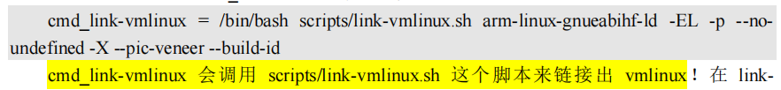
>
> `vmliux_link` 就是最终**链接**出 `vmlinux` 的函数

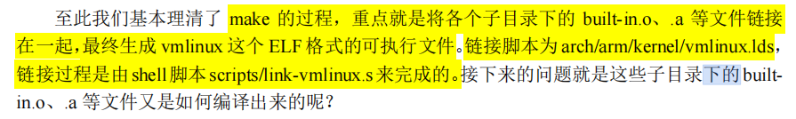


#### 各个子目录的build-in.o, .a编译产生过程

```c
vmlinux <- vmlinux-deps = $(KBUILD_LDS) $(KBUILD_VMLINUX_INIT) $(KBUILD_VMLINUX_MAIN)
```
- KBUILD_LDS
  - 链接脚本
- (**KBUILD_VMLINUX_INIT**)
  - 子目录下的built-in.o/.a
- (**KBUILD_VMLINUX_MAIN**)
  - 子目录下的built-in.o/.a

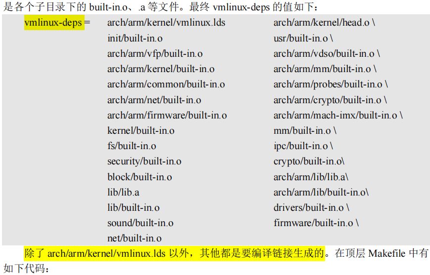

```c
//顶层Makefile中
$(sort $(vmlinux-deps)): $(vmlinux-dirs) ;

vmlinux-dirs := $(patsubst %/,%,$(filter %/, $(init-y) $(init-m) \
                $(core-y) $(core-m) $(drivers-y) $(drivers-m) \
                $(net-y) $(net-m) $(libs-y) $(libs-m)))
// vmlinux-dirs就是保存生成vmlinux所需源码文件的目录
```
> 最终，vmlinux所需要涉及的源码目录如下
> 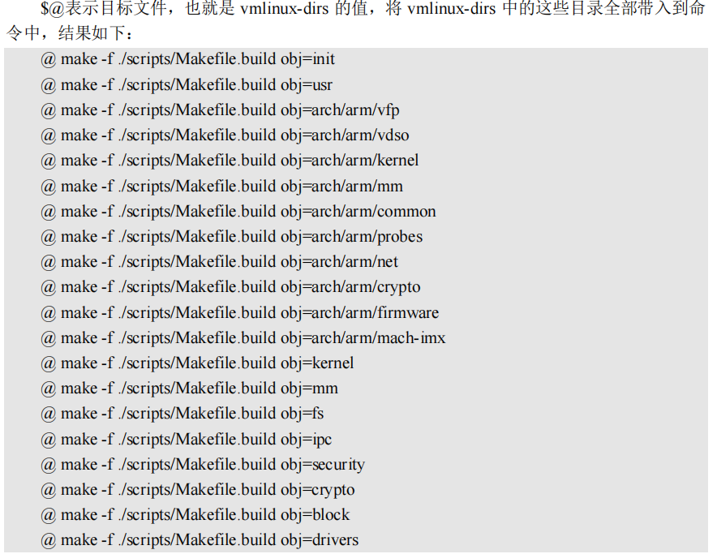
> 

我们以编译init目录的指令为例，分析一下
```c
@ make -f ./scripts/Makefile.build obj=init
```
这里又需要用到`Makefile.build`这个脚本了。
> 该脚本默认使用__build作为默认目标。

```c
94 __build: $(if $(KBUILD_BUILTIN),$(builtin-target) $(lib-target) $(extra-y)) \
        $(if $(KBUILD_MODULES),$(obj-m) $(modorder-target)) \
        $(subdir-ym) $(always)
        @:
```
> - 当**只编译Linux内核镜像文件**，使用`make zImage`
>   - KBUILD_BUILTIN=1,KBUILD_MODULES空
> - **编译所有的东西, 保存linux内核镜像 + 一些模块文件**，使用`make`

我们重点看一下`builtin-target`, 他依赖
- obj-y
- obj-m
- obj-
- subdir-m
- lib-target
> 里面具体会调用if_changed来判断是否发生改变。
>
> 最终**将某个目录下的所有.o文件链接在一起**，最终形成`built-in.o`

>以上，我们已经完成了**defconfig生成.`config`**，来配置linux内核，

>然后分析了**make的过程**，知道如何**从所有相关的文件夹中，编译出各自的`built-in.o`**，然后把他们**链接起来**，生成elf的`vmlinux`
---

### make zImage过程
前面分析了如何制作`.config`, 然后根据`.config`来制作`vmlinux(elf)`,但是最终我们要用的是`zImage`这样的linux内核镜像文件。

#### vmlinux, zImage, uImage区别
- **vmlinux**
  - 编译出来的**最原始的内核文件**，elf，**未压缩**，16MB左右
- Image
  - **linux内核镜像文件**，仅含可执行**二进制数据**
  - 使用`objcopy`取消掉`vmlinux`的其他信息，也**没有压缩**,12MB左右
  - 保存在`arch/arm/boot`中
- **zImage**
  - 经过`gzip`压缩后的`Image`, 6MB
- **uImage**
  - **老版本uboot专用**的镜像文件
  - 相当于在zImage前面加上一个64字节的头，描述该镜像的文件类型，加载位置，生成时间，大小等。
  - **新版uboot已经支持zImage启动了**

#### vmlinux 转换成 zImage
这个又是依赖 scripts/Makefile.build
```c
@ make -f ./scripts/Makefile.build obj=arch/arm/boot MACHINE=arch/arm/boot/zImage
```
> 具体细节不展示，主要理清楚编译思路。


# linux内核启动过程
前一节，已经分析了，linux内核的编译过程，知道如何生成配置linux内核的.config文件，如何编译出vmlinux，如何生成我们需要的zImage

现在开始分析**linux内核这个代码的启动流程**，比uboot复杂得多。

老规矩，一段代码要运行，和裸机程序一样，肯定要有链接脚本，start.S启动脚本，用户代码这些。


## 链接脚本 vmlinux.lds
首先要分析的就是linux内核代码的链接脚本，这样我们才知道，**第一行代码在哪里执行**。

linux内核的链接脚本是 `arch/arm/kernel/vmlinux.lds`, 通过ENTRY就知道第一句是哪里
```c
ENTRY(stext)
```
所有，入口时stext。定义在`arch/arm/kernel/head.S`

## 启动流程分析
### 入口 stext
这个head.S的开头注释要求
- 关闭MMU
- 关闭D-cache
- 无所谓I-Cache
- R0=0
- R1=machine nr(机器ID)
- R2=atags/dtb首地址

所以，stext，就相当于内核的入口函数
```c
ENTRY(stext)
 ARM_BE8(setend	be )			@ ensure we are in BE8 mode

 THUMB(	adr	r9, BSYM(1f)	)	@ Kernel is always entered in ARM.
 THUMB(	bx	r9		)	@ If this is a Thumb-2 kernel,
 THUMB(	.thumb			)	@ switch to Thumb now.
 THUMB(1:			)

#ifdef CONFIG_ARM_VIRT_EXT
	bl	__hyp_stub_install
#endif
	@ ensure svc mode and all interrupts masked
	safe_svcmode_maskall r9

	mrc	p15, 0, r9, c0, c0		@ get processor id
	bl	__lookup_processor_type		@ r5=procinfo r9=cpuid
	movs	r10, r5				@ invalid processor (r5=0)?
 THUMB( it	eq )		@ force fixup-able long branch encoding
	beq	__error_p			@ yes, error 'p'

#ifdef CONFIG_ARM_LPAE
	mrc	p15, 0, r3, c0, c1, 4		@ read ID_MMFR0
	and	r3, r3, #0xf			@ extract VMSA support
	cmp	r3, #5				@ long-descriptor translation table format?
 THUMB( it	lo )				@ force fixup-able long branch encoding
	blo	__error_lpae			@ only classic page table format
#endif

#ifndef CONFIG_XIP_KERNEL
	adr	r3, 2f
	ldmia	r3, {r4, r8}
	sub	r4, r3, r4			@ (PHYS_OFFSET - PAGE_OFFSET)
	add	r8, r8, r4			@ PHYS_OFFSET
#else
	ldr	r8, =PLAT_PHYS_OFFSET		@ always constant in this case
#endif

	/*
	 * r1 = machine no, r2 = atags or dtb,
	 * r8 = phys_offset, r9 = cpuid, r10 = procinfo
	 */
	bl	__vet_atags
#ifdef CONFIG_SMP_ON_UP
	bl	__fixup_smp
#endif
#ifdef CONFIG_ARM_PATCH_PHYS_VIRT
	bl	__fixup_pv_table
#endif
	bl	__create_page_tables

	/*
	 * The following calls CPU specific code in a position independent
	 * manner.  See arch/arm/mm/proc-*.S for details.  r10 = base of
	 * xxx_proc_info structure selected by __lookup_processor_type
	 * above.  On return, the CPU will be ready for the MMU to be
	 * turned on, and r0 will hold the CPU control register value.
	 */
	ldr	r13, =__mmap_switched		@ address to jump to after
						@ mmu has been enabled
	adr	lr, BSYM(1f)			@ return (PIC) address
	mov	r8, r4				@ set TTBR1 to swapper_pg_dir
	ldr	r12, [r10, #PROCINFO_INITFUNC]
	add	r12, r12, r10
	ret	r12
1:	b	__enable_mmu
ENDPROC(stext)
```
整理以下内容：
- stext
  - 调用 `safe_svcmode_maskall`
    - 定义在`arch/arm/include/asm/assembler.h`
    - 确保 CPU 处于 **SVC 模式**
    - **关闭所有中断**
  - 读取**处理器ID**，保存在R9
  - `__lookup_processor_type` 检查当前系统是否支持此CPU
    - 支持：获取`procinfo`信息
    - > （`proc_info_list`类型, 定义在`arch/arm/include/asm/procinfo.h`）
    - > 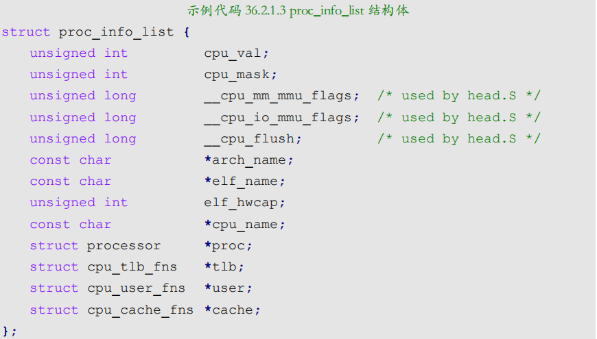
    - > linux内核，将**每种处理器**都抽象成一个**proc_info_list结构体**，每种处理器**对应一个procinfo**。因此可以通过**处理器 ID** 来找到**对应的 procinfo 结构**
    - `__lookup_processor_type`返回找到的对应处理器的`procinfo`，保存到`R5`中
  - `__vet_atags`
    - **验证**atags/**dtb的合法性**
    - 定义在`arch/arm/kernel/head-common.S`
  - `__create_page_tables`, **创建页表**
  - `R13` = `__mmap_switched`
    - 定义在`arch/arm/kernel/head-common.S`
    - `__mmap_switched`最终调用**start_kernel**
  - `__enable_mmu` **使能MMU**
    - 定义在`arch/arm/kernel/head.S`
    - `__turn_mmu_on`，打开MMU
      - 调用`R13`中的`__mmap_switched`


### __mmap_switched 函数
`arch/arm/kernel/head-common.S`
```c
__mmap_switched:
	adr	r3, __mmap_switched_data

	ldmia	r3!, {r4, r5, r6, r7}
	cmp	r4, r5				@ Copy data segment if needed
1:	cmpne	r5, r6
	ldrne	fp, [r4], #4
	strne	fp, [r5], #4
	bne	1b

	mov	fp, #0				@ Clear BSS (and zero fp)
1:	cmp	r6, r7
	strcc	fp, [r6],#4
	bcc	1b

 ARM(	ldmia	r3, {r4, r5, r6, r7, sp})
 THUMB(	ldmia	r3, {r4, r5, r6, r7}	)
 THUMB(	ldr	sp, [r3, #16]		)
	str	r9, [r4]			@ Save processor ID
	str	r1, [r5]			@ Save machine type
	str	r2, [r6]			@ Save atags pointer
	cmp	r7, #0
	strne	r0, [r7]			@ Save control register values
	b	start_kernel
ENDPROC(__mmap_switched)
```
> 可以看到，就是写**拷贝数据段，清零BSS，保存处理器ID，机器类型，dtb的指针这些，以及一些控制寄存器的值**，
>
> 随后跳转`start_kernel`，再也不回来
>
> 有点类似`start.S`里面的`reset_handler`

### start_kernel 函数
最关键的时start_kernel，定义在 `init/main.c`

代码很长，我这里只做简要的整理
```c
asmlinkage __visible void __init start_kernel(void)
{
    char *command_line;
    char *after_dashes;
    lockdep_init(); /* lockdep 是死锁检测模块，此函数会初始化两个 hash 表。此函数要求尽可能早的执行！ */
    set_task_stack_end_magic(&init_task);/* 设置任务栈结束魔术数，用于栈溢出检测*/
    smp_setup_processor_id(); /* 跟 SMP 有关(多核处理器)，设置处理器 ID。有很多资料说 ARM 架构下此函数为空函数，那是因为他们用的老版本 Linux，而那时候 ARM 还没有多核处理器。*/
    debug_objects_early_init(); /* 做一些和 debug 有关的初始化*/
    boot_init_stack_canary(); /* 栈溢出检测初始化 */
    cgroup_init_early(); /* cgroup 初始化，cgroup 用于控制 Linux 系统资源*/
    local_irq_disable(); /* 关闭当前 CPU 中断 */
    early_boot_irqs_disabled = true;

    /*
    * 中断关闭期间做一些重要的操作，然后打开中断
    */
    boot_cpu_init(); /* 跟 CPU 有关的初始化 */
    page_address_init(); /* 页地址相关的初始化 */
    pr_notice("%s", linux_banner);/* 打印 Linux 版本号、编译时间等信息 */
    setup_arch(&command_line); /* 架构相关的初始化，此函数会解析传递进来的ATAGS 或者设备树(DTB)文件。会根据设备树里面的 model 和 compatible 这两个属性值来查找Linux 是否支持这个单板。此函数也会获取设备树中 chosen 节点下的 bootargs 属性值来得到命令行参数，也就是 uboot 中的 bootargs 环境变量的值，获取到的命令行参数会保存到command_line 中。*/

    mm_init_cpumask(&init_mm); /* 看名字，应该是和内存有关的初始化 */
    setup_command_line(command_line); /* 好像是存储命令行参数 */
    setup_nr_cpu_ids(); /* 如果只是 SMP(多核 CPU)的话，此函数用于获取CPU 核心数量，CPU 数量保存在变量nr_cpu_ids 中。*/
    setup_per_cpu_areas(); /* 在 SMP 系统中有用，设置每个 CPU 的 per-cpu 数据 */
    smp_prepare_boot_cpu(); 
    build_all_zonelists(NULL, NULL); /* 建立系统内存页区(zone)链表 */
    page_alloc_init(); /* 处理用于热插拔 CPU 的页 */

    /* 打印命令行信息 */ 
    pr_notice("Kernel command line: %s\n", boot_command_line);
    parse_early_param(); /* 解析命令行中的 console 参数 */
    after_dashes = parse_args("Booting kernel",
                            static_command_line, __start___param,
                            __stop___param - __start___param,
                            -1, -1, &unknown_bootoption);
    if (!IS_ERR_OR_NULL(after_dashes))
        parse_args("Setting init args", after_dashes, NULL, 0, -1, -1,
                    set_init_arg);
    jump_label_init();
    setup_log_buf(0); /* 设置 log 使用的缓冲区*/
    pidhash_init(); /* 构建 PID 哈希表，Linux 中每个进程都有一个 ID,这个 ID 叫做 PID。通过构建哈希表可以快速搜索进程信息结构体。*/
    vfs_caches_init_early(); /* 预先初始化 vfs(虚拟文件系统)的目录项和索引节点缓存*/
    sort_main_extable(); /* 定义内核异常列表 */
    trap_init(); /* 完成对系统保留中断向量的初始化 */
    mm_init(); /* 内存管理初始化 */
    sched_init(); /* 初始化调度器，主要是初始化一些结构体 */
    preempt_disable(); /* 关闭优先级抢占 */
    if (WARN(!irqs_disabled(), /* 检查中断是否关闭，如果没有的话就关闭中断 */
                    "Interrupts were enabled *very* early, fixing it\n"))
        local_irq_disable();

    idr_init_cache(); /* IDR 初始化，IDR 是 Linux 内核的整数管理机
    * 制，也就是将一个整数 ID 与一个指针关联起来。
    */
    rcu_init(); /* 初始化 RCU，RCU 全称为 Read Copy Update(读-拷贝修改) */
    trace_init(); /* 跟踪调试相关初始化 */
    context_tracking_init(); 
    radix_tree_init(); /* 基数树相关数据结构初始化 */
    early_irq_init(); /* 初始中断相关初始化,主要是注册 irq_desc 结构体变量，因为 Linux 内核使用 irq_desc 来描述一个中断。*/
    init_IRQ(); /* 中断初始化 */
    tick_init(); /* tick 初始化 */
    rcu_init_nohz(); 
    init_timers(); /* 初始化定时器 */
    hrtimers_init(); /* 初始化高精度定时器 */
    softirq_init(); /* 软中断初始化 */
    timekeeping_init(); 
    time_init(); /* 初始化系统时间 */
    sched_clock_postinit(); 
    perf_event_init();
    profile_init();
    call_function_init();
    WARN(!irqs_disabled(), "Interrupts were enabled early\n");
    early_boot_irqs_disabled = false;
    local_irq_enable(); /* 使能中断 */
    kmem_cache_init_late(); /* slab 初始化，slab 是 Linux 内存分配器 */
    console_init(); /* 初始化控制台，之前 printk 打印的信息都存放缓冲区中，并没有打印出来。只有调用此函数初始化控制台以后才能在控制台上打印信息。*/

    if (panic_later) 
        panic("Too many boot %s vars at `%s'", panic_later,
    panic_param);
    lockdep_info();/* 如果定义了宏 CONFIG_LOCKDEP，那么此函数打印一些信息。*/
    locking_selftest() /* 锁自测 */ 
    ......
    page_ext_init(); 
    debug_objects_mem_init();
    kmemleak_init(); /* kmemleak 初始化，kmemleak 用于检查内存泄漏 */
    setup_per_cpu_pageset(); 
    numa_policy_init();
    if (late_time_init)
    late_time_init();
    sched_clock_init(); 
    calibrate_delay(); /* 测定 BogoMIPS 值，可以通过 BogoMIPS 来判断 CPU 的性能BogoMIPS 设置越大，说明 CPU 性能越好。*/
    pidmap_init(); /* PID 位图初始化 */
    anon_vma_init(); /* 生成 anon_vma slab 缓存 */ 
    acpi_early_init();
    ......
    thread_info_cache_init();
    cred_init(); /* 为对象的每个用于赋予资格(凭证) */
    fork_init(); /* 初始化一些结构体以使用 fork 函数 */
    proc_caches_init(); /* 给各种资源管理结构分配缓存 */
    buffer_init(); /* 初始化缓冲缓存 */
    key_init(); /* 初始化密钥 */
    security_init(); /* 安全相关初始化 */
    dbg_late_init();
    vfs_caches_init(totalram_pages); /* 为 VFS 创建缓存 */
    signals_init(); /* 初始化信号 */
    page_writeback_init(); /* 页回写初始化 */
    proc_root_init(); /* 注册并挂载 proc 文件系统 */
    nsfs_init(); 
    cpuset_init(); /* 初始化 cpuset，cpuset 是将 CPU 和内存资源以逻辑性和层次性集成的一种机制，是 cgroup 使用的子系统之一*/
    cgroup_init(); /* 初始化 cgroup */
    taskstats_init_early(); /* 进程状态初始化 */
    delayacct_init();
    check_bugs(); /* 检查写缓冲一致性 */
    acpi_subsystem_init(); 
    sfi_init_late();
    if (efi_enabled(EFI_RUNTIME_SERVICES)) {
        efi_late_init();
        efi_free_boot_services();
    }

    ftrace_init();
    rest_init(); /* rest_init 函数 */
}
```

> **每一个函数都是一个庞大的知识点**，如果想要学习Linux 内核，那么这些函数就需要去详细的研究。
> 
> 本教程注重于嵌入式 Linux 入门，因此不会去讲太多关于 Linux 内核的知识。`start_kernel` 函数最后调用了 `rest_init`，接下来简单看一下 rest_init函数

### rest_init 函数
`init/main.c`中定义

```c
static noinline void __init_refok rest_init(void)
{
	int pid;

	rcu_scheduler_starting();
	smpboot_thread_init();
	/*
	 * We need to spawn init first so that it obtains pid 1, however
	 * the init task will end up wanting to create kthreads, which, if
	 * we schedule it before we create kthreadd, will OOPS.
	 */
	kernel_thread(kernel_init, NULL, CLONE_FS);
	numa_default_policy();
	pid = kernel_thread(kthreadd, NULL, CLONE_FS | CLONE_FILES);
	rcu_read_lock();
	kthreadd_task = find_task_by_pid_ns(pid, &init_pid_ns);
	rcu_read_unlock();
	complete(&kthreadd_done);

	/*
	 * The boot idle thread must execute schedule()
	 * at least once to get things moving:
	 */
	init_idle_bootup_task(current);
	schedule_preempt_disabled();
	/* Call into cpu_idle with preempt disabled */
	cpu_startup_entry(CPUHP_ONLINE);
}
```
- rest_init
  - rcu_scheduler_starting, 启动RCU 锁调度器
  - 调用 `kernel_thread` 创建 `kernel_init` **内核进程**,
      - 这就是**大名鼎鼎的 `init` 内核进程**, **`init` 进程**的 PID 为` 1`
      - `init 进程`一开始是**内核进程**(也就是运行在**内核态**, SVC模式)
      - 后面 `init 进程`会在**根文件系统**中查找名为“`init`”这个程序，这个“init”程序处于**用户态**，通过运行这个“init”程序，**init 进程就会实现从内核态到用户态的转变**
  - 调用 `kernel_thread` 创建 `kthreadd` **内核进程**
    - 此内核进程的 **PID 为 2**
    - `kthreadd` 进程负责所有**内核进程**的**调度和管理**
  - 调用 `cpu_startup_entry` 来进入 **idle 进程**
    - 调用`cpu_idle_loop`
      - while循环，也就是`idle进程`代码, 也就是空闲进程
      - `idle进程`的**PID为0**
      - 就是freertos里面的空闲进程概念，idle进程并没有由kernel_thread或者fork函数创建，而是**从主进程演变而来** 
> 指令 `ps -A` 可以打印出当前系统中的所有进程, 其中就能看到**init进程**和**kthreadd进程**

### init进程
前面分析的函数，创建内核进程kernel_init，然后他会调用rootfs的init代码，实现从内核态到用户态的转变。

下面先来看看**内核进程**`kernel_init`的具体内容。定义在`init/main.c`中
```c
static int __ref kernel_init(void *unused)
{
	int ret;

	kernel_init_freeable();             /* init 进程的一些其他初始化工作 */
	/* need to finish all async __init code before freeing the memory */
	async_synchronize_full();           /* 等待所有的异步调用执行完成 */
	free_initmem();                     /* 释放 init 段内存 */
	mark_rodata_ro();
	system_state = SYSTEM_RUNNING;      /* 标记系统正在运行 */
	numa_default_policy();

	flush_delayed_fput();

	if (ramdisk_execute_command) {
		ret = run_init_process(ramdisk_execute_command);
		if (!ret)
			return 0;
		pr_err("Failed to execute %s (error %d)\n",
		       ramdisk_execute_command, ret);
	}

	/*
	 * We try each of these until one succeeds.
	 *
	 * The Bourne shell can be used instead of init if we are
	 * trying to recover a really broken machine.
	 */
	if (execute_command) {
		ret = run_init_process(execute_command);
		if (!ret)
			return 0;
		panic("Requested init %s failed (error %d).",
		      execute_command, ret);
	}
	if (!try_to_run_init_process("/sbin/init") ||
	    !try_to_run_init_process("/etc/init") ||
	    !try_to_run_init_process("/bin/init") ||
	    !try_to_run_init_process("/bin/sh"))
		return 0;

	panic("No working init found.  Try passing init= option to kernel. "
	      "See Linux Documentation/init.txt for guidance.");
}
```

- `kernel_init`
  - `kernel_init_freeable()`，完成init进程的一些其他初始化工作，后面具体分析
  - `ramdisk_execute_command`
    - 是全局的char * 指针变量，值是`/init`, 就是放在根目录下的init程序
    - 该char指针，可以通过uboot传递参数：bootargs中用 `rdinit=xxx` 来指定具体的init程序
    - 如果存在`/init`
      - `run_init_process`执行
    - 如果不存在，查看`execute_command`是否为空, 总之一定要在`rootfs`中找到一个可以运行的`init程序`
      - `execute_command`可以通过`bootargs`适应`init=xxx`指定
    - 如果都是空的，就依次执行`/sbin/init`, `/etc/init`, `/bin/init`, `/bin/sh`这4个备用的init程序。
      - 如果还是不存在，那么Linux启动失败。

---

再来看看`kernel_init_freeable`是做什么初始化工作的

```c
static noinline void __init kernel_init_freeable(void)
{
	/*
	 * Wait until kthreadd is all set-up.
	 */
	wait_for_completion(&kthreadd_done);        /* 等待 kthreadd 进程准备就绪 */

	/* Now the scheduler is fully set up and can do blocking allocations */
	gfp_allowed_mask = __GFP_BITS_MASK;

	/*
	 * init can allocate pages on any node
	 */
	set_mems_allowed(node_states[N_MEMORY]);
	/*
	 * init can run on any cpu.
	 */
	set_cpus_allowed_ptr(current, cpu_all_mask);

	cad_pid = task_pid(current);

	smp_prepare_cpus(setup_max_cpus);

	do_pre_smp_initcalls();
	lockup_detector_init();

	smp_init();                         /* SMP 初始化 */
	sched_init_smp();                   /* 多核(SMP)调度初始化 */

	do_basic_setup();                   /* 设备初始化都在此函数中完成 */

	/* Open the /dev/console on the rootfs, this should never fail */
	if (sys_open((const char __user *) "/dev/console", O_RDWR, 0) < 0)
		pr_err("Warning: unable to open an initial console.\n");

	(void) sys_dup(0);
	(void) sys_dup(0);
	/*
	 * check if there is an early userspace init.  If yes, let it do all
	 * the work
	 */

	if (!ramdisk_execute_command)
		ramdisk_execute_command = "/init";

	if (sys_access((const char __user *) ramdisk_execute_command, 0) != 0) {
		ramdisk_execute_command = NULL;
		prepare_namespace();
	}

	/*
	 * Ok, we have completed the initial bootup, and
	 * we're essentially up and running. Get rid of the
	 * initmem segments and start the user-mode stuff..
	 *
	 * rootfs is available now, try loading the public keys
	 * and default modules
	 */

	integrity_load_keys();
	load_default_modules();
}

```
简单总结一下：
- `kernel_init_freeable`
  - **`do_basic_setup`**  完成linux下的**设备驱动初始化**工作，**非常重要**
    - `driver_init`完成linux下**驱动模型子系统的初始化**
  - `sys_open`("/dev/console"), 打开**根文件系统**的**console设备**
    - linux中一切皆文件，此文件为控制台设备
    - 每个文件都有一个**文件描述符**，此处的/dev/console的描述符就是`0`， **标准输入**0
  - `sys_dup`, 将标准输入0的文件描述符复制了2次，一个作为**标准输出1**，一个作为**标准错误2**
    - 这样，stdi,stdo,stderr,都是/dev/console
    - > 还记得`uboot`里面，通过`bootargs`指定了`console=ttymxc0,115200`, 将串口设备设置成console，也就是uart1
    - > 当然你也可以把别的设备设置成交互的console, 比如虚拟控制台tty1, z这样就可以在LCD屏幕上看到系统的提示信息了
  - `prepare_namespace()`, **挂载根文件系统**。
    - 根文件系统也是bootargs指定，`root=/dev/mmcblk1p2 rootwait rw`, 即emmc的分区2中

> linux内核的启动分析就到这里了
>
> linux内核最终是需要和rootfs打交道的，也就需要**挂载根文件系统**，并且执行rootfs总的/init程序。以此来进入用户态。这里就引出了我们的**根文件系统**。
> 
> 所以，总结：
>
> **linux系统移植3部分**：
> 1. **uboot**
> 2. **linux kernel + dtb**
> 3. **rootfs(根文件系统)**， 没有这个，就没有init进程，无法进入用户态。


# linux内核移植

将NXP芯片原厂的linux内核移植到我们正点原子的开发板上，就是主要掌握**如何将芯片原厂的linux BSP包移植到我们自己的平台上**

## 先编译原厂的linux内核
```c
make distclean
make imx_v7_mfg_defconfig       //使用原厂的mfg的defconfig, 还有别的imx的开发板默认配置，建议用mfg的，因为这个配置文件，默认支持IMX6ULL这个芯片，而且，此文件编译出来的zImage可以通过NXP官方的MfgTool工具烧写
make -j16

/*
我们目前使用的dts是，arch/arm/boot/dts/imx6ull-14x14-evk.dtb， 当然是针对NXP的evk板卡的
*/
```
烧录测试，因为我们以及默认指定了rootfs在emmc分区2，所以直接下载启动就行

## 添加我们自己的开发板
1. `arch/arm/configs/`下复制`defconfig`配置文件
   1. `cp imx_v7_mfg_defconfig imx_alientek_emmc_defconfig`
   2. 屏蔽CONFIG_ARCH_MULTI_V6=y, 因为这个可能影响我们自己的驱动，我们是armv7架构
2. `arch/arm/boot/dts`, 复制dts
   1. `cp imx6ull-14x14-evk.dts imx6ull-alientek-emmc.dts`
   2. `arch/arm/boot/dts/Makefile` 加入编译选项


## 修改主频
这里主要就是尝试使用虚拟文件系统

```c
cat /proc/cpuinfo   //BogoMIPS越大，主频越高

cd /sys/bus/cpu/devices/cpu0/cpufreq/
    cpuinfo_cur_freq
    cpuinfo_max_freq
    cpuinfo_min_freq
    ...
    scaling_available_governors
    scaling_available_frequencies
    ...
    stats/          //这个里面由统计cpu各种运行频率的统计情况
```
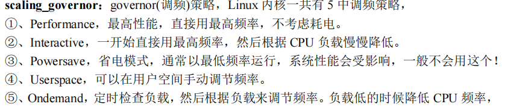
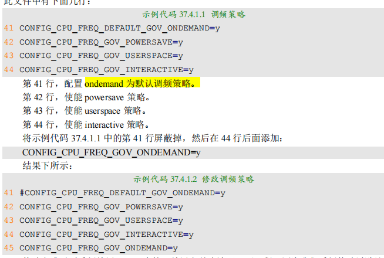

## 修改EMMC驱动
默认的linux内核驱动+dts,使用emmc是4线，我们的支持8线，所以改成8线
## 修改以太网驱动
切换驱动，配置复位引脚，复位fec1,fec2, 先不要纠结，能用就行


