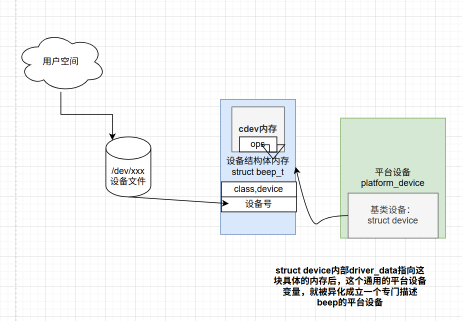
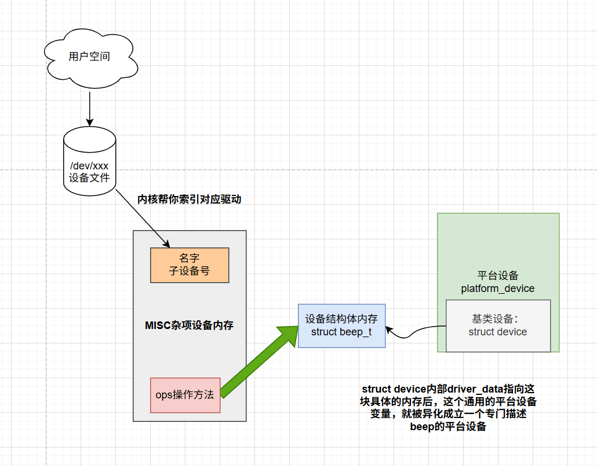

MISC 设备驱动笔记（MD格式）

# 57.1 MISC 设备驱动简介

## 图解
原来我们cdev的写法，把前端创建用户空间的设备文件节点也放到设备结构体里面


现在用杂项，把这些完全剥离开来，设备结构体内存仅描述设备的特征属性，相当于开辟第三块内存，单独做用户空间的前端链路



## 核心概念与优势

MISC 设备驱动是 Linux 字符设备驱动的简化方案，核心解决**主设备号资源紧张**的问题，所有 MISC 设备驱动的**主设备号固定为 10**，无需手动创建 cdev，**大幅简化字符设备驱动的编写流程**。

**就是原来我们编写一个led的驱动需要，在probe中需要：**
- 初始化led设备结构体（后端链路：驱动-dts）
  - > **开辟一块内存A，设置设备结构体**
  - 获取设备节点
  - 申请gpio
  - xxx
- 注册字符设备（前端链路：用户空间-设备文件节点-驱动）
  - > **以前cdev这块内存(B∈A)是嵌在设备结构体的内存A里面的，cdev里面再指定操作方法集合（这个里面又操作设备结构体）**
  - 申请设备号
  - 注册cdev
  - 创建class,device

现在前端链路不需要做这么一大节了，只需要方便的注册misc设备（打包后的cdev设备）
- （前端链路）注册杂项设备
  - > **也开辟一块内存C(C不属于A)，作为杂项设备，设置操作方法（内部来操作设备结构体的内存A）**
  - misc_register(&beep_miscdev)

> 注意：
>
> beep_miscdev是杂项设备，是struct miscdevice类型，他表示一个抽象的杂项设备。里面指定了他的操作方法，而这个操作方法里面，则是绑定我们真实的设备结构体（比如open方法里面，把我们的设备结构体加入到私有数据中）


## miscdevice 结构体解析

MISC 设备通过 `miscdevice` 结构体描述，定义于 `include/linux/miscdevice.h`，核心成员及含义如下：

```c

struct miscdevice {

    int minor;                /* 子设备号（核心需手动指定） */

    const char *name;         /* 设备名（注册后在 /dev 生成对应设备文件） */

    const struct file_operations *fops; /* 设备操作集合（字符设备核心） */

    struct list_head list;    /* 内核链表节点（内部使用） */

    struct device *parent;    /* 父设备（内部使用） */

    struct device *this_device; /* 设备结构体（内部使用） */

    const struct attribute_group **groups; /* 设备属性组（可选） */

    umode_t mode;             /* 设备文件权限（可选） */

 const char *nodename;     /* 设备文件名（可选，默认与 name 一致） */

};

```

### 关键成员设置

定义 MISC 设备时，**必须设置 `minor`、`name`、`fops` 三个核心成员**：

- `minor`：子设备号，主设备号固定为 10，需用户手动指定（需保证未被其他设备占用）；

- `name`：设备名称，注册成功后会在 `/dev` 目录生成同名设备文件；

- `fops`：字符设备操作集合（如 `open`/`read`/`write` 等函数实现），是 MISC 设备驱动的核心逻辑载体。

#### 预定义子设备号

Linux 内核在 `include/linux/miscdevice.h` 中预定义了部分 MISC 子设备号（示例）：

```c

#define PSMOUSE_MINOR      1      /* 鼠标设备 */

#define MS_BUSMOUSE_MINOR  2      /* 未使用 */

#define ATARIMOUSE_MINOR   5      /* 未使用 */

#define SUN_MOUSE_MINOR    6      /* 未使用 */

...

#define MISC_DYNAMIC_MINOR 255    /* 动态子设备号 */

```

### 使用规则

- 可直接选用内核预定义的未占用子设备号；

- 也可自定义未被占用的子设备号，需保证唯一性。

## MISC 设备注册与注销函数

### 注册函数：misc_register

- 函数原型：`int misc_register(struct miscdevice *misc)`

- 功能：一次性完成字符设备驱动的**申请设备号、初始化 cdev、添加 cdev、创建类、创建设备**等所有步骤，替代传统繁琐的操作流程。

- 参数：`misc` - 待注册的 MISC 设备结构体指针；

- 返回值：`0` 成功，**负数** 失败。

### 注销函数：misc_deregister

- 函数原型：`int misc_deregister(struct miscdevice *misc)`

- 功能：一次性完成 MISC 设备的**删除 cdev、注销设备号、删除设备、删除类**等所有清理工作，简化卸载流程。

- 参数：`misc` - 待注销的 MISC 设备结构体指针；

- 返回值：`0` 成功，**负数** 失败。

## 传统驱动流程 vs MISC 驱动流程

### 传统字符设备驱动流程（繁琐）

```c

alloc_chrdev_region();  // 申请设备号

cdev_init();            // 初始化 cdev

cdev_add();             // 添加 cdev

class_create();         // 创建类

device_create();        // 创建设备

```

### 传统注销流程

```c

cdev_del();             // 删除 cdev

unregister_chrdev_region(); // 注销设备号

device_destroy();       // 删除设备

class_destroy();        // 删除类

```

### MISC 驱动流程（极简）

- 注册：仅需 `misc_register()` 完成所有初始化；

- 注销：仅需 `misc_deregister()` 完成所有清理。

## 后续应用

基于 MISC 驱动框架，可结合 platform 驱动模型编写具体设备驱动（如 beep 蜂鸣器驱动），简化开发步骤。

```c
#include <linux/types.h>
#include <linux/kernel.h>
#include <linux/delay.h>
#include <linux/ide.h>

#include <linux/init.h>
#include <linux/module.h>
#include <linux/errno.h>


#include <linux/gpio.h>
#include <linux/of_gpio.h>

#include <linux/miscdevice.h>

#include <linux/platform_device.h>

#define BEEPOFF 			0			/* 关蜂鸣器 */
#define BEEPON 				1			/* 开蜂鸣器 */

/* miscbeep设备结构体 */
struct miscbeep_dev{
	struct device_node	*nd; /* 设备节点 */
	int beep_gpio;			/* beep所使用的GPIO编号		*/
} miscbeep;

static int miscbeep_open(struct inode *inode, struct file *filp)
{
	filp->private_data = &miscbeep; /* 设置私有数据 */
	return 0;
}

static ssize_t miscbeep_write(struct file *filp, const char __user *buf, size_t cnt, loff_t *offt)
{
	int retvalue;
	unsigned char databuf[1];
	unsigned char beepstat;
	struct miscbeep_dev *dev = filp->private_data;

	retvalue = copy_from_user(databuf, buf, cnt);
	if(retvalue < 0) {
		printk("kernel write failed!\r\n");
		return -EFAULT;
	}

	beepstat = databuf[0];		/* 获取状态值 */
	if(beepstat == BEEPON) {	
		gpio_set_value(dev->beep_gpio, 0);	/* 打开蜂鸣器 */
	} else if(beepstat == BEEPOFF) {
		gpio_set_value(dev->beep_gpio, 1);	/* 关闭蜂鸣器 */
	}
	return 0;
}


static struct file_operations miscbeep_fops = {
	.owner = THIS_MODULE,
	.open = miscbeep_open,
	.write = miscbeep_write,
};


#define MISCBEEP_NAME		"miscbeep"	/* 名字 	*/
#define MISCBEEP_MINOR		144			/* 子设备号 */

static struct miscdevice beep_miscdev = {
	.minor = MISCBEEP_MINOR,
	.name = MISCBEEP_NAME,
	.fops = &miscbeep_fops
};


static int miscbeep_probe(struct platform_device *dev)
{
	int ret = 0;

	//第一块内存，是设备结构体，最后会挂到struct device上面，使device变得特殊
#if 1

	printk("beep driver and device was matched!\r\n");
	/* 设置BEEP所使用的GPIO */
	/* 1、获取设备节点：beep */
	miscbeep.nd = of_find_node_by_path("/mygpiobeep@0");
	if(miscbeep.nd == NULL) {
		printk("beep node not find!\r\n");
		return -EINVAL;
	} 

	/* 2、 获取设备树中的gpio属性，得到BEEP所使用的BEEP编号 */
	miscbeep.beep_gpio = of_get_named_gpio(miscbeep.nd, "beep-gpio", 0);
	if(miscbeep.beep_gpio < 0) {
		printk("can't get beep-gpio");
		return -EINVAL;
	}

	/* 3、设置GPIO5_IO01为输出，并且输出高电平，默认关闭BEEP */
	ret = gpio_direction_output(miscbeep.beep_gpio, 1);
	if(ret < 0) {
		printk("can't set gpio!\r\n");
	}

#endif


	//第二块内存，杂项misc（把原来设备结构体里面通用的cdev部分全部独立出来）
	//作为用户层访问的接口，内部操作方法来操作具体设备结构体的内存。
	//

#if 1
	
	/* 一般情况下会注册对应的字符设备，但是这里我们使用MISC设备
  	 * 所以我们不需要自己注册字符设备驱动，只需要注册misc设备驱动即可
	 */
	ret = misc_register(&beep_miscdev);
	if(ret < 0){
		printk("misc device register failed!\r\n");
		return -EFAULT;
	}

#endif

	return 0;
}

static int miscbeep_remove(struct platform_device *dev)
{
	/* 注销设备的时候关闭LED灯 */
	gpio_set_value(miscbeep.beep_gpio, 1);

	/* 注销misc设备 */
	misc_deregister(&beep_miscdev);
	return 0;
}


 static const struct of_device_id beep_of_match[] = {
     { .compatible = "my-misc-beep" },
     { /* Sentinel */ }
 };

static struct platform_driver beep_driver = {
     .driver     = {
		 .name = "my-misc-beep",
         .of_match_table = beep_of_match, /* 设备树匹配表          */
     },
     .probe      = miscbeep_probe,
     .remove     = miscbeep_remove,
};


static int __init miscbeep_init(void)
{
	return platform_driver_register(&beep_driver);
}

static void __exit miscbeep_exit(void)
{
	platform_driver_unregister(&beep_driver);
}

module_init(miscbeep_init);
module_exit(miscbeep_exit);
MODULE_LICENSE("GPL");
MODULE_AUTHOR("zuozhongkai");

```