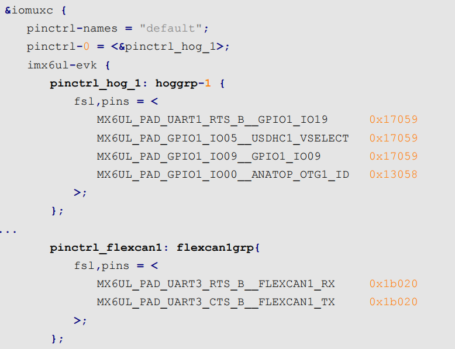
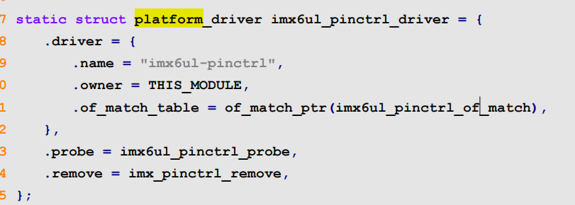
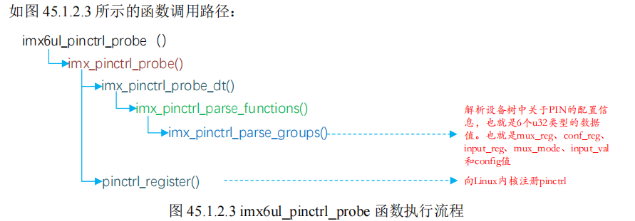
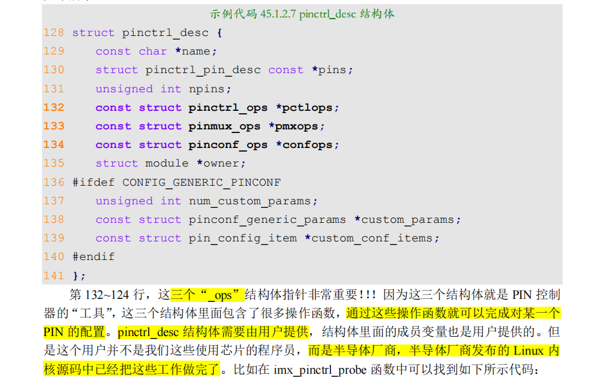
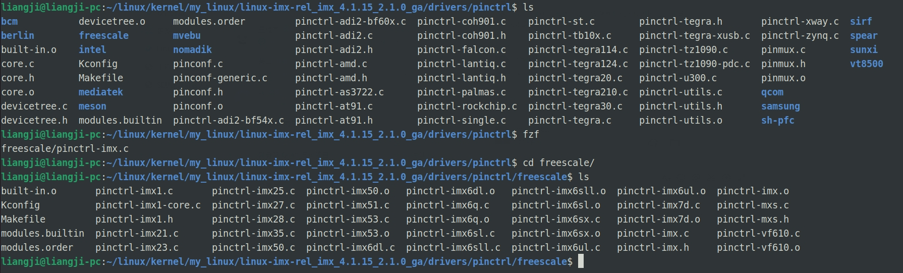
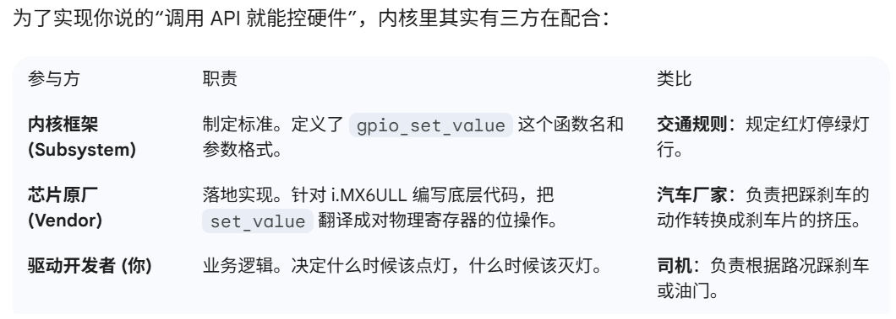
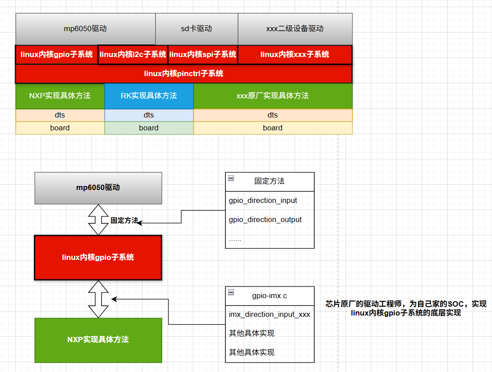
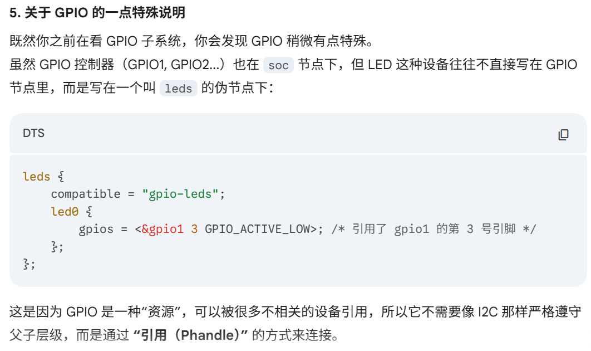

- [linux驱动的分层和分离设计理念前瞻](#linux驱动的分层和分离设计理念前瞻)
- [pinctrl子系统](#pinctrl子系统)
  - [简介](#简介)
  - [imx6ull的pinctrl子系统驱动](#imx6ull的pinctrl子系统驱动)
    - [PIN配置信息详解](#pin配置信息详解)
    - [pin驱动程序讲解](#pin驱动程序讲解)
  - [设备树添加pinctrl节点模板](#设备树添加pinctrl节点模板)
- [**驱动的分层与分离图示**](#驱动的分层与分离图示)
  - [关于设备树中设备节点结构层次梳理](#关于设备树中设备节点结构层次梳理)
    - [正常片内设备的驱动，父子层级](#正常片内设备的驱动父子层级)
    - [**gpio片内设备的特殊性，无层级**](#gpio片内设备的特殊性无层级)
- [gpio子系统](#gpio子系统)


# linux驱动的分层和分离设计理念前瞻
前面我们写的dts的led驱动，本质上只是一个简单的基于裸机的驱动模块，并没有真正使用到linux的驱动系统。

像gpio这种最基本的驱动，linux内核不是采用这种原始的裸机驱动开发的方式，而是提供了pinctrl和gpio子系统用于gpio驱动。

**Linux 驱动**讲究驱动**分离**与**分层**，`pinctrl` 和 `gpio` 子系统就是驱动分离与分层思想下的产物

**驱动分离与分层**其实就是按照**面向对象编程的设计思想**而设计的设备驱动框架，关于驱动的分离与分层我们后面会讲

前面我们编写的驱动，包括裸机的gpio驱动，stm32的驱动，有这么几个步骤：
- **CCM使能外设时钟**
- **设置PIN（IOMUXC）**
  - > linux内核**针对PIN的配置**，推出了`pinctrl`**子系统**
  - 设置复用功能
  - 设置PIN的上下拉等属性
- **设置GPIO**
  - > linux内核**针对GPIO的配置**，推出了`gpio`**子系统**
  - GDIR方向
  - DR数据


# pinctrl子系统
## 简介
大多数 SOC 的 **pin 都是支持复用的**，比如 I.MX6ULL 的 GPIO1_IO03 既可以
- 作为普通的GPIO 使用，
- 也可以作为 I2C1 的 SDA 等等。
  
此外我们还需要**配置 pin 的电气特性**，比如
- 上/下拉、速度、驱动能力等等。

---

**传统的配置 pin 的方式**就是**直接操作相应的寄存器**，但是这种配置方式比较繁琐、而且容易出问题(比如 pin 功能冲突)。

**pinctrl 子系统**就是为了解决这个问题而引入的，pinctrl 子系统**主要工作内容**如下：
- 获取设备树中 pin 信息。
- 根据获取到的 pin 信息来设置 pin 的**复用功能**
- 根据获取到的 pin 信息来设置 pin 的**电气特性**，比如上/下拉、速度、驱动能力等

> 对于我们使用者来讲，**只需要在设备树里面设置好某个 pin 的相关属性即可**，其他的初始化工作均由 pinctrl 子系统来完成，pinctrl 子系统源码目录为 `drivers/pinctrl`


## imx6ull的pinctrl子系统驱动
> 我这里有一个猜测：
>
> linux内核驱动的分层，分离的思想，是不是就是说，pin引脚设置，就一起一口气设置了，之后gpio的初始化，也一口气设置了。对比裸机的外设驱动，是以设备为单位，设置完一个设备，在设置另一个设备，这样如果两个设备的引脚冲突，不容易发现。pinctrl子系统，作为内核驱动的一部分，一口气设置所有的pin。

### PIN配置信息详解
要使用pinctrl子系统，我们要在设备树里面设置PIN的配置信息。
> pinctrl子系统要根据你提供的信息来配置PIN。


根据设备树的定义，`.dtsi`中，肯定会有soc内部的io复用控制器的外设节点
```c
iomuxc: iomuxc@020e0000 {
    ...
};
```

在`.dts`中，则可以看到，根据每块板卡的不同，**追加了很多pin配置**


> 不同的外设，使用不同的pin配置（复用，电气参数）。
>
> 将**某个外设**所使用的**所有PIN**都组织在**一个子节点**里面

如果我们需要在**iomuxc中添加我们自定义外设的PIN配置**，就需要**创建我们自己的外设的子节点**。然后把这个自定义外设的**所有PIN配置信息，都放到这个子节点中**。

```c
iomuxc: iomuxc@020e0000 {
    compatible = "fsl,imx6ul-iomuxc";
    reg = <0x020e0000 0x4000>;
    pinctrl-names = "default";
};
```
在.dtsi中，可以看到，iomuxc这个外设指定的驱动程序是`fsl,imx6ul-iomuxc`, 实际对应的是`drivers/pinctrl/freescale/pinctrl-imx6ul.c`这个驱动程序
> 所以我们之前写的ko都是驱动模块，**linux的内置的驱动都在drivers/下**，所以我们的**pinctrl子系统**，其实就是**针对iomuxc这个外设的驱动程序**。

---

下面解析一下每个子节点的**PIN配置信息的含义**
```c
    pinctrl_hog_1: hoggrp-1 {
        fsl,pins = <
            MX6UL_PAD_UART1_RTS_B__GPIO1_IO19 0x17059
            MX6UL_PAD_GPIO1_IO05__USDHC1_VSELECT 0x17059
            MX6UL_PAD_GPIO1_IO09__GPIO1_IO09 0x17059
            MX6UL_PAD_GPIO1_IO00__ANATOP_OTG1_ID 0x13058
        >;
```
可以看到里面的一则PIN配置为
```c
MX6UL_PAD_UART1_RTS_B__GPIO1_IO19 0x17059
```
有两部分组成：
- **复用信息**
  - `MX6UL_PAD_UART1_RTS_B__GPIO1_IO19`, 
    - 在`imx6ul-pinfunc.h`中宏定义为`0x0090` `0x031C` `0x0000` `0x5` `0x0`
  - **实际含义为**：<`mux_reg` `conf_reg` `input_reg` `mux_mode` `input_val`>
    - `mux_reg`, iomuxc的复用寄存器的偏移地址
    - `conf_reg`, iomuxc的电气参数寄存器的偏移地址
    - `input_reg`, iomuxc的input_reg寄存器，有些外设pin没有这个
    - `mux_mode`, mux_reg的值
    - `input_val`, input_reg的值
- **电气参数**
  - `0x17059`
    - **就是`conf_reg`的值**

> 这样就可以通过一行，来配置好这个外设的一个PIN的想要的配置了

### pin驱动程序讲解
这里主要就是讲解**pinctrl子系统的实现原理**

iomuxc的compatible指定驱动程序`fsl,imx6ul-iomuxc`, 定义在`drivers/pinctrl/freescale/pinctrl-imx6ul.c`,就是我们的**pinctrl子系统**（**iomuxc驱动**）

但是我们这里的pinctrl是`platform_driver`是**平台设备驱动**, 后面会讲这种驱动模式


当**设备和驱动匹配成功以后**, `platform_driver` 的 `probe 成员变量`所代表的函数就会执行, ，可以认为 **`imx6ul_pinctrl_probe` 函数**就是 I.MX6ULL 这个 SOC 的 PIN 配置**入口函数**



具体pinctrl细节，这里先不分析


这里主要注意的是，**pinctrl是linux的一个子系统**，但是**芯片原厂需要根据自家的芯片**，来告诉linux内核，如何操作这些pin，就是**注册操作结构体**，这估计就是SDK要干的事情。



可以看到，drivers/pinctrl/子系统下，除了pinctrl的通用代码 ，还有各个芯片原厂，比如：
- freescale
- intel
- samsung
- .....

**为linux内核准备的自家soc的pin操作方法。**

进入freescale后发现针对各种自家的SOC，有`pinctrl-xxx.c`
## 设备树添加pinctrl节点模板

# **驱动的分层与分离图示**
**一句话**：这就是**驱动开发的分离与分层**



```c
[ 硬件: i.MX6ULL GPIO1_IO03 ]
                   ^
                   | (物理操作)
       ---------------------------
       |  芯片原厂提供的底层驱动     | <--- (NXP 工程师已经写好了)
       ---------------------------
                   ^
                   | (内核内部回调)
 [ Linux GPIO 子系统 (框架层) ]
                   ^
                   | (调用标准 API: gpio_set_value)
       ---------------------------
       |    你的驱动程序 (LED.c)    | <--- (你只需要写这一层)
       ---------------------------
                   ^
                   | (open/write)
       [ 用户程序 (main.c) ]
```



## 关于设备树中设备节点结构层次梳理
```c
/ (根节点: 代表整块 i.MX6ULL 开发板)
┃
┗━ soc (节点: 代表芯片内部资源)
    ┃
    ┣━ uart1: serial@02020000 (UART控制器)
    ┃   ┗━ bluetooth-module (子节点: 接在串口1上的蓝牙模块)
    ┃
    ┣━ i2c1: i2c@021a0000 (I2C1控制器)
    ┃   ┣━ mpu6050@68 (子节点: 地址为0x68的陀螺仪)
    ┃   ┗━ eeprom@50 (子节点: 地址为0x50的存储器)
    ┃
    ┗━ usdhc1: mmc@02190000 (SD卡控制器)
        ┗━ sdcard@0 (子节点: 插在卡槽1里的SD卡)
```
### 正常片内设备的驱动，父子层级
正常片内设备，比如i2c，要严格遵循**父子层级关系**。
### **gpio片内设备的特殊性，无层级**


>因为gpio在几乎所有的外设中都有使用，所以一般不使用父子层级，而是内嵌在别的设备节点里面，相当于是最底层，最普遍的外设资源，因为使用非常普遍，所以几乎可以看出是属性。相当于全设备使能

# gpio子系统
先会用，内部实现后面再补充