- [前言](#前言)
- [linux驱动的三大设计思想](#linux驱动的三大设计思想)
	- [分隔](#分隔)
	- [分离](#分离)
	- [分层](#分层)
- [linux内核的platform驱动框架 （三大思想的具体实现）](#linux内核的platform驱动框架-三大思想的具体实现)
	- [总线的定义](#总线的定义)
	- [platform是什么](#platform是什么)
	- [mpu6050这些该叫什么设备](#mpu6050这些该叫什么设备)
	- [关系梳理](#关系梳理)
	- [platform 的物理区域对应？DTS 里的位置对应](#platform-的物理区域对应dts-里的位置对应)
	- [具体实现](#具体实现)
		- [platform\_bus](#platform_bus)
		- [platform\_driver](#platform_driver)
			- [如何编写platform\_driver驱动](#如何编写platform_driver驱动)
				- [xxx\_init中**注册**我们定义的platform\_driver变量](#xxx_init中注册我们定义的platform_driver变量)
				- [xxx\_exit中**注销**我们定义的platform\_driver变量](#xxx_exit中注销我们定义的platform_driver变量)
				- [platform\_driver驱动模板](#platform_driver驱动模板)
				- [总结](#总结)
		- [platform\_device](#platform_device)
			- [使用platform\_device描述一个设备的模板](#使用platform_device描述一个设备的模板)
	- [手动编写platform\_device， platform\_driver.](#手动编写platform_device-platform_driver)
	- [pinctrl子系统，gpio子系统](#pinctrl子系统gpio子系统)
		- [dts + platform\_driver](#dts--platform_driver)
- [学习linux内核编写二级设备驱动](#学习linux内核编写二级设备驱动)
	- [linux内核自带的led设备驱动](#linux内核自带的led设备驱动)


# 前言
前面都是简单的驱动编写

现在要来正式学习，**linux内核 驱动的分离与分层**的设计思想，Linux 系统要考虑到**驱动的可重用性**。也就是我们的**platform设备驱动**，也叫做**平台设备驱动**

# linux驱动的三大设计思想
分隔，分离，分层

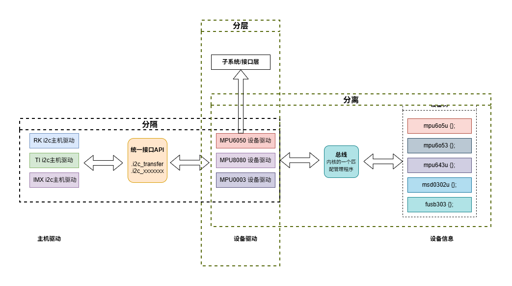
## 分隔
> 这个主要说的是**主机驱动**和**设备驱动**的分开。

> 比如soc内部有外设资源：i2c, uart, 但是这些是通信接口资源，是要外接设备的。
> 
> 所以为了**考虑到移植性**（因为不同soc的i2c控制器，uart控制器他们的使用也不一样，但是接的设备几乎用法都差不多，比如mpu6050）。那么他就相当于给这些通信总线的主机控制器驱动**做了一层封装**，就是中间统一API
> 
> 比如i2c来说，**芯片原厂**的工程师主要根据自家SOC的说明手册来编写**i2c的主机驱动（i2c的寄存器操作）**，然后全部封装成i2c_send_ack, i2c_xxx。
> 
> 然后经过一个**统一的API**（得到统一的api:i2c_read, i2c_write）
> 
> **设备厂商的工程师**，就无需关心soc的i2c的寄存器了，只需要直到这个统一的api，然后用这些统一的api来编写设备驱动，实现（mpu_read, mpu_write）。

就是「总线适配器 ↔ 设备驱动」分离
- **主机 / 适配器驱动（芯片原厂写**操作 SOC 内部 I2C/UART/SPI 控制器寄存器，实现总线时序。向上封装成统一接口：
  - I2C：i2c_master_send / i2c_master_recv
  - SPI：spi_sync 等
- **设备驱动（设备厂商写**,不关心 SOC 控制器寄存器，只调用总线统一 API 操作外设（MPU6050、OLED 等）。
一句话：分隔 = 把 “控制器硬件差异” 藏起来，设备驱动跨平台复用。


## 分离
分离说的是**设备驱动**和**设备信息**的分离：

> 设备驱动要专注于抽象的操作，不能有具体的地址，gpio编号细节，所有的具体设备信息单独存放，结果就放在设备树里面。
>
> 他们之间的匹配，依赖一个叫**总线**的东西：总线是一个**linux内核里面的负责管理匹配的程序块**， 具体说，就是platform_bus这个类对象，他有一系列方法，以及**维护了两个表**：`platform_device表`, `platform_driver表`
>
> 当系统启动时，这个总线对象，检查设备驱动和设备信息之间发生匹配时，就执行probe方法，启动这个设备驱动。
> 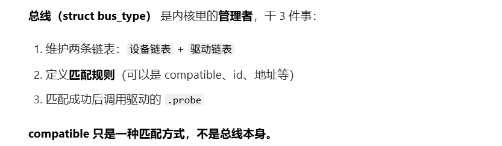

---

这里先剧透以下，linux内核里面的真正模型：
>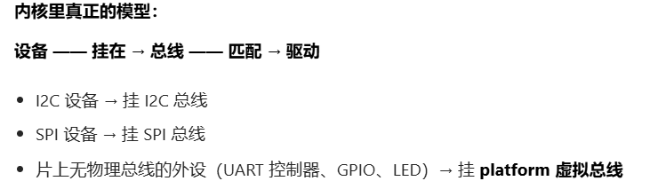
> 可以看到platform说的其实是片内

## 分层

**Linux 驱动标准四层模型**
- **硬件层**：寄存器、时序、电平（控制器驱动）
- **总线层**：`I2C/SPI/Platform` 核心（**统一接口**、匹配、管理）
- **设备驱动层**：MPU6050、按键、LED（业务逻辑）
- **子系统 / 接口层**：`input`、`tty`、`fb`、`字符设备`（给用户态统一入口）

> **举 input 子系统例子**（你最容易理解）
> - **设备驱动**：只上报 原始按键值
> - **input 子系统**：封装成统一 input_event
> - **用户态**：/dev/input/eventX **读标准事件**
> 
> 分层 = 职责拆分，每一层只干自己的事，不越界。**不是 “字节流转中文”，这种算是业务逻辑，应当放到用户态。**

# linux内核的platform驱动框架 （三大思想的具体实现）
我们前面讲了分离，分隔，分层的驱动思想，本质上还是涉及3个东西：驱动，总线，设备 三大模型

linux就为此，**实现了这3个概念**（类对象）：
- **platform_bus**
- **platform_device**
- **platform_driver**

下面具体分析这三个的作用，理清楚他们的定义：

## 总线的定义
之前我一直以为，总线就是一排物理连线，但这有点偏差

**总线**是指：**一束线，他们遵循具体的通信协议，进行通信**。

所以这里就可以做一个区分了：
- **SOC内部的片上互连架构**（外设地址总线AHB，APB这些）
  - **确实是物理连线**，但是驱动模型里面**不认为是驱动模型里的总线**
  - **没有统一的外设挂载协议**，也**无法动态增减外设**
  - **都是独占资源**
  - > 所以他们是实际的总线，但**不是我们在驱动模型下讨论的总线**，因为没有通信协议
- **SOC外部的通信总线（i2c, spi）**
  - **驱动模型的视角**：**是标准的物理总线**，遵循独立的通信协议。
  - > **驱动模型定义**：这类外接的、遵循标准通信协议的外设，就是“有物理总线的设备”。

所以，我们在**linux内核驱动模型里面讨论的总线**，是指的**有通信协议的**，比如：
- i2c总线
- spi总线
- can总线
- ....

而对于**片内**这些cortex内核连接i2c控制器，spi控制器，gpio控制器。这些没有总线，但为了统一，我们把他称为**虚拟总线**，也叫做**platform总线**
## platform是什么

> 所以**platform**，直译就是**平台**，也就是**SOC内**，**片内**的总线，因为是虚拟的，所以platform也对应**虚拟**。
>
> 那对应的`platform_bus`就是**片内的虚拟总线**，`platform_device`就是指的片内的i2c控制器这些**soc片内外设**。`platform_driver`就是指的**主机驱动**

**下面给出具体定义**：
- **`platform_bus`**：内核定义的**虚拟总线**（struct bus_type）
- 给谁用？
  - **没有物理总线**的**片内**设备：
    - SOC 内部控制器（I2C 控制器、UART 控制器）
    - 简单 GPIO 设备（LED、KEY）
      - >对于`led,key`这些也没有接到实际总线上的，我们为了方便，也挂载虚拟总线上，因为他们跟片内gpio没什么区别
- **`platform_device`**：来自 DTS，描述硬件资源
- **`platform_driver`**：驱动，匹配后执行 probe

## mpu6050这些该叫什么设备
既然platform是指的片内的。

那么实际的i2c总线，spi总线这些总线上面挂载的设备，如`MPU6050`，**该叫什么设备**，在**内核驱动里面，该用什么来表示**？肯定不可能是platform_device.

**答案**：

假设**mpu6050挂载在i2c总线上**，那么他就是**I2C设备**：
- **设备结构体**：struct `i2c_client`
- **驱动结构体**：struct `i2c_driver`
- **管理总线**：`i2c_bus`（**不是 `platform_bus`**）


## 关系梳理
- **SOC 内部 I2C 控制器**
  - `platform_device`
  - 由 `platform_driver` 驱动（芯片原厂写）
- **I2C 总线 被注册好后**
  - 可以挂载外部 I2C 设备（MPU6050）
- **MPU6050**
  - 挂在 i2c1 节点下（DTS 子节点）
  - 生成 `i2c_client`
  - 匹配 `i2c_driver`
  - 走 `I2C 总线`，不是 platform

## platform 的物理区域对应？DTS 里的位置对应
`platform` **不是 “整个 SOC”**，而是**SOC 内部 “无独立片外通信总线的外设”**

在 DTS 里，对应**SOC 节点下**（或**根节点直接下**）的**片内外设节点**。

- **物理区域对应：platform 覆盖 SOC 内部的 “独立外设”**
  - platform 对应的物理范围，是 SOC 芯片内部的**两类外设**：
    - **片上通信控制器**：`I2C 控制器`、`UART 控制器`、`SPI 控制器`（它们本身是片内设备，没有外接的通信总线属性）；
    - **片上简单外设**：`GPIO 控制器`、`LED、按键`、`定时器`、`看门狗`（直接靠片上互连驱动，无任何外部通信总线）。
> 注意：platform **不包含 SOC 内核、内存控制器等 “核心架构”**，只针对可**独立驱动的片内外设**。

- **DTS 里的位置对应：精准匹配 “设备归属”**
```c
/ { /* 根节点 */
    soc { /* SOC 片内节点（核心） */
        #address-cells = <1>;
        #size-cells = <1>;
        compatible = "fsl,imx6ul-soc";

        /* ① 片内I2C控制器：属于 platform_device，挂 platform_bus */
        i2c1: i2c@021a0000 {
            compatible = "fsl,imx6ul-i2c";
            reg = <0x021a0000 0x4000>;
            /* ② 外接MPU6050：属于 i2c_client，挂 i2c_bus（不是platform） */
            mpu6050@68 {
                compatible = "invensense,mpu6050";
                reg = <0x68>;
            };
        };

        /* 片内LED：属于 platform_device，挂 platform_bus */
        led@020ac000 {
            compatible = "mydev,led";
            reg = <0x020ac000 0x4>;
        };
    };
};
```

## 具体实现
### platform_bus
platform_bus就是一个bus_type类型的全局变量

`struct bus_type`定义在`include/linux/device.h`,
```c
struct bus_type {
    const char      *name;                  /* 总线名字 */
    const char      *dev_name;
    struct device   *dev_root;
    struct device_attribute *dev_attrs;
    const struct attribute_group **bus_groups;  /* 总线属性 */
    const struct attribute_group **dev_groups;   /* 设备属性 */
    const struct attribute_group **drv_groups;   /* 驱动属性 */

    int (*match)(struct device *dev, struct device_driver *drv);
    int (*uevent)(struct device *dev, struct kobj_uevent_env *env);
    int (*probe)(struct device *dev);
    int (*remove)(struct device *dev);
    void (*shutdown)(struct device *dev);

    int (*online)(struct device *dev);
    int (*offline)(struct device *dev);

    int (*suspend)(struct device *dev, pm_message_t state);
    int (*resume)(struct device *dev);
    const struct dev_pm_ops *pm;
    const struct iommu_ops *iommu_ops;
    struct subsys_private *p;
    struct lock_class_key lock_key;
};
```


**match 函数**，此函数很重要，单词 match 的意思就是“**匹配、相配**”，因此此函数就是完成**设备**和**驱动**之间**匹配的**

总线就是**使用 match 函数**来根据注册的设备来查找对应的驱动，或者根据注册的驱动来查找相应的设备，**因此每一条总线都必须实现此函数**。

`match` 函数有**两个参数**：`dev` 和 `drv`，这两个参数分别为 `device` 和 `device_driver` 类型，也就是设备和驱动。

---

`platform 总线`是 bus_type 的**一个具体实例**, 定义在`drivers/base/platform.c`
```c
struct bus_type platform_bus_type = {
    .name       = "platform",
    .dev_groups = platform_dev_groups,
    .match      = platform_match,
    .uevent     = platform_uevent,
    .pm         = &platform_dev_pm_ops,
};
```

其中，最重要的`.match`指向`platform_uevent`. 定义在`drivers/base/platform.c`
```c
static int platform_match(struct device *dev,
                          struct device_driver *drv)
{
    struct platform_device *pdev = to_platform_device(dev);
    struct platform_driver *pdrv = to_platform_driver(drv);

    /*When driver_override is set,only bind to the matching driver*/
    if (pdev->driver_override)
        return !strcmp(pdev->driver_override, drv->name);

    /* Attempt an OF style match first */
    if (of_driver_match_device(dev, drv))
        return 1;

    /* Then try ACPI style match */
    if (acpi_driver_match_device(dev, drv))
        return 1;

    /* Then try to match against the id table */
    if (pdrv->id_table)
        return platform_match_id(pdrv->id_table, pdev) != NULL;

    /* fall-back to driver name match */
    return (strcmp(pdev->name, drv->name) == 0);
}
```

**.match里面就是platform 总线驱动与设备的四种匹配方式**：
- **`OF 类型匹配（设备树方式）`**
  - 核心函数：`of_driver_match_device`
  - 匹配逻辑：驱动的 `of_match_table` 与设备树节点的 `compatible 属性`进行比对，一致则匹配成功。
- **ACPI 匹配方式**
  - 核心函数：`acpi_driver_match_device`
  - 匹配逻辑：通过 ACPI 相关机制进行设备与驱动的匹配。
- **id_table 匹配**
  - 核心函数：`platform_match_id`
  - 匹配逻辑：驱动的 id_table 成员中保存了支持的设备 ID 列表，与设备 ID 进行比对。
- **`name 字段匹配（兜底方式）`**
  - 匹配逻辑：直接比较驱动和设备的 name 字段，相等则匹配成功，是最常用、最简单的方式。


 ### platform_driver
**`platform_driver`** 结构体表示 **platform 驱动**, 定义在`include/linux/platform_device.h`

 ```c
 struct platform_driver {
    int (*probe)(struct platform_device *);      // 匹配成功后执行
    int (*remove)(struct platform_device *);     // 设备移除时执行
    void (*shutdown)(struct platform_device *);
    int (*suspend)(struct platform_device *, pm_message_t state);
    int (*resume)(struct platform_device *);
    struct device_driver driver;                 // 继承的基类
    const struct platform_device_id *id_table;  // id匹配表
    bool prevent_deferred_probe;
};
 ```
- `driver`：继承自`device_driver基类`，**提供基础驱动框架**。
- `probe`：驱动的核心入口，具体驱动逻辑在此实现。
- `id_table`：用于无设备树时的 ID 匹配。
> 一个`platform_driver`的对象，就是一个**platform框架内的驱动模块程序**, 所以包含`probe(init)`, `remove(exit)`等

既然一个`platform_driver`， 继承基类 `device_driver`

**下面看看这个基类的定义`device_driver`**
```c
struct device_driver {
    const char *name;
    struct bus_type *bus;
    struct module *owner;
    const char *mod_name;
    const struct of_device_id *of_match_table;  // 设备树匹配表
    const struct acpi_device_id *acpi_match_table;
    int (*probe) (struct device *dev);
    int (*remove) (struct device *dev);
    // ... 其他回调和成员
};
```
- `of_match_table`：**设备树匹配表**，与设备节点的compatible属性匹配。
> 所以device_driver就是一个最原始的驱动基类，里面自然包含了compatible的匹配表

而这个驱动匹配表`of_match_table` 的类型是 `of_device_id`
```c
struct of_device_id {
    char name[32];
    char type[32];
    char compatible[128];  // 关键：与设备树compatible匹配
    const void *data;
};
```

而**platform总线的另一种匹配方式(第三种匹配方式)需要使用`id_table`**, 是`platform_device_id`类型
```c
struct platform_device_id {
    char name[PLATFORM_NAME_SIZE];
    kernel_ulong_t driver_data;
};
```

#### 如何编写platform_driver驱动

> 在**编写 platform 驱动**的时候，:
> - 首先**定义一个 `platform_driver` 结构体变量**，
> - 然后**实现结构体中的各个成员变量**
>   - 重点是**实现匹配方法**以及 **probe 函数**
> - 当**驱动和设备匹配成功**以后 **probe函数**就会执行
>   - 具体的驱动程序在 probe 函数里面编写，比如字符设备驱动等等。
>   - `probe`代替了原来的`xxx_init`，作为驱动程序的**实际入口函数**
>     - 原来的`xxx_init`入口函数**仅注册platform驱动**
>   - `remove`代替了原来的`xxx_exit`, 作为驱动程序的**实际出口函数**
>     - 原来的`xxx_exit`入口函数**仅注销platform驱动**

---
##### xxx_init中**注册**我们定义的platform_driver变量
当我们定义好了一个platform_driver变量，需要在**驱动入口函数**里面调用
`platform_driver_register` 函数向 Linux 内核注册一个 platform 驱动

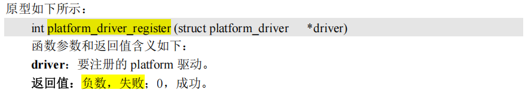

##### xxx_exit中**注销**我们定义的platform_driver变量
还需要在驱动卸载函数中通过 platform_driver_unregister 函数卸载 platform 驱动

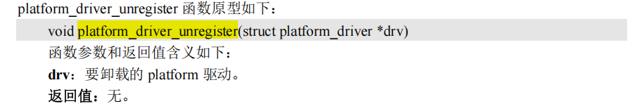

##### platform_driver驱动模板
```c
/* 设备结构体 */
struct xxx_dev{
    struct cdev cdev;
    /* 设备结构体其他具体内容 */
};

struct xxx_dev xxxdev;  /* 定义个设备结构体变量 */

static int xxx_open(struct inode *inode, struct file *filp)
{
    /* 函数具体内容 */
    return 0;
}

static ssize_t xxx_write(struct file *filp, const char __user *buf,
                        size_t cnt, loff_t *offt)
{
    /* 函数具体内容 */
    return 0;
}

/*
 * 字符设备驱动操作集
 */
static struct file_operations xxx_fops = {
    .owner = THIS_MODULE,
    .open = xxx_open,
    .write = xxx_write,
};

/*
 * platform驱动的probe函数
 * 驱动与设备匹配成功以后此函数就会执行
 */
static int xxx_probe(struct platform_device *dev)
{
    ......
    cdev_init(&xxxdev.cdev, &xxx_fops); /* 注册字符设备驱动 */
    /* 函数具体内容 */
    return 0;
}

static int xxx_remove(struct platform_device *dev)
{
    ......
    cdev_del(&xxxdev.cdev);/*  删除cdev */
    /* 函数具体内容 */
    return 0;
}

/* 匹配列表 */
static const struct of_device_id xxx_of_match[] = {
    { .compatible = "xxx-gpio" },
    { /* Sentinel */ }   //必须保留一个空的
};

/*
 * platform平台驱动结构体
 */
static struct platform_driver xxx_driver = {
    .driver = {
        .name      = "xxx",
        .of_match_table = xxx_of_match,
    },
    .probe     = xxx_probe,
    .remove    = xxx_remove,
};

/* 驱动模块加载 */
static int __init xxxdriver_init(void)
{
    return platform_driver_register(&xxx_driver);
}

/* 驱动模块卸载 */
static void __exit xxxdriver_exit(void)
{
    platform_driver_unregister(&xxx_driver);
}

module_init(xxxdriver_init);
module_exit(xxxdriver_exit);
MODULE_LICENSE("GPL");
MODULE_AUTHOR("zuozhongkai");
```
> 可以看到，目前编写驱动本质上，和之前写的驱动没什么区别，都可以总结为：
---

**总结以下platform驱动的编写步骤：**

- module_init/exit 指定入口函数，出口函数
- ---
- **xxx_init/exit 直接注册/注销 xxx_driver (platform_driver变量)**
- xxx_driver内部定义
  - .驱动本身相关信息
    - 驱动名称
    - of_match_table, OF匹配表
  - .platform驱动入口函数probe
  - .platform驱动出口函数remove
- ---
- > 可以看到仅仅只是增加了上边的部分，**下边的部分和原来的驱动编写，没有什么区别**
- **入口函数probe具体实现**
  - **创建内核设备工作**
    - 申请设备号
    - 注册设备
    - 创建设备节点
      - class
      - device
  - **初始化设备结构体**
- **出口函数remove具体实现**
  - 释放设备结构体相关资源
  - 删除内核设备工作
    - 注销设备节点
    - 注销设备
    - ... (**使用 iounmap 释放内存、删除 cdev，注销设备号等等**
    - 具体可以看一下前面编写驱动的步骤)

**注意：**

> 所谓的 **platform 驱动**并**不是独立于**字符设备驱动、块设备驱动和网络设备驱动之外的其他种类的驱动。
> 
> platform 只是**为了驱动的分离与分层**而提出来的**一种框架**，其**驱动的具体实现还是需要字符设备驱动、块设备驱动或网络设备驱动**

> 其中**name 属性**用于**传统的驱动与设备匹配**，也就是检查驱动和设备的 name 字段是不是相同。
> 
> **of_match_table 属性**就是用于**设备树下的驱动与设备检查**。
> 
>**对于一个完整的驱动程序，必须提供`有设备树`和`无设备树`两种匹配方法**

##### 总结
总体来说，**platform 驱动**还是传统的字符设备驱动、块设备驱动或网络设备驱动，**只是套上了一张“platform”的皮**，目的是**为了使用**总线、驱动和设备这个**驱动模型**来**实现驱动的分离与分层。**


### platform_device
platform 设备

- 若内核**使用设备树**来描述设备，会为我们自动创建platform_device对象, **无需我们手动编写**
- 若内核**没有使用设备树**，**需要我们自己编写platform_device对象的文件**，来描述设备的设备信息

`platform_device` 结构体定义在文件`include/linux/platform_device.h` 中

```c
struct platform_device {
    const char *name;     //设备名字（在匹配的第四种方法中使用）
    int     id;
    bool    id_auto;
    struct device   dev;
    u32     num_resources;    //表示资源resource数量
    struct resource *resource;//表示资源，就是设备信息

    const struct platform_device_id *id_entry;
    char *driver_override; /* Driver name to force a match */

    /* MFD cell pointer */
    struct mfd_cell *mfd_cell;

    /* arch specific additions */
    struct pdev_archdata    archdata;
};
```

其中，resource就是设备信息，具体类型定义如下：
```c
struct resource {
    resource_size_t start;      //该条资源的起始信息，如果是内存，就是起始地址
    resource_size_t end;        //该条资源的终止信息，如果是内存，就是结束地址
    const char      *name;      //资源名称
    unsigned long   flags;      //资源类型
    struct resource *parent, *sibling, *child;
};
```
关于可选的资源的类型，在include/linux/ioport.h中定义
```c
#define IORESOURCE_BITS         0x000000ff  /* Bus-specific bits */

#define IORESOURCE_TYPE_BITS    0x00001f00  /* Resource type */
#define IORESOURCE_IO           0x00000100  /* PCI/ISA I/O ports */
#define IORESOURCE_MEM          0x00000200  /* Register offsets */
#define IORESOURCE_REG          0x00000300  /* Register offsets */
#define IORESOURCE_IRQ          0x00000400
#define IORESOURCE_DMA          0x00000800
#define IORESOURCE_BUS          0x00001000

/* PCI control bits.  Shares IORESOURCE_BITS with above PCI ROM.  */
#define IORESOURCE_PCI_FIXED    (1<<4)      /* Do not move resource */
```

> 在以前**不支持设备树的Linux版本中**，用户需要编写`platform_device变量`来描述设备信息，然后使用 **`platform_device_register` 函数**将**设备信息注册到 Linux 内核中**
> 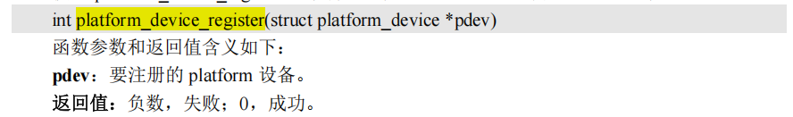
>
> 如果**不再使用 platform_device** 的话可以通过 `platform_device_unregister` 函数**注销掉相应的 platform设备**
> 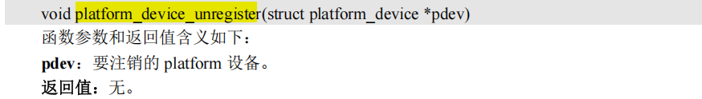

#### 使用platform_device描述一个设备的模板
```c
/* 寄存器地址定义 */
#define PERIPH1_REGISTER_BASE    (0x20000000) /* 外设1寄存器首地址 */
#define PERIPH2_REGISTER_BASE    (0x020E0068) /* 外设2寄存器首地址 */
#define REGISTER_LENGTH          4

/* 资源 */
static struct resource xxx_resources[] = {
    [0] = {
        .start  = PERIPH1_REGISTER_BASE,
        .end    = (PERIPH1_REGISTER_BASE + REGISTER_LENGTH - 1),
        .flags  = IORESOURCE_MEM,
    },
    [1] = {
        .start  = PERIPH2_REGISTER_BASE,
        .end    = (PERIPH2_REGISTER_BASE + REGISTER_LENGTH - 1),
        .flags  = IORESOURCE_MEM,
    },
};

/* platform设备结构体 */
static struct platform_device xxxdevice = {
    .name = "xxx-gpio",
    .id = -1,
    .num_resources = ARRAY_SIZE(xxx_resources),
    .resource = xxx_resources,
};

/* 设备模块加载 */
static int __init xxxdevice_init(void)
{
    return platform_device_register(&xxxdevice);
}

/* 设备模块注销 */
static void __exit xxx_resourcesdevice_exit(void)
{
    platform_device_unregister(&xxxdevice);
}

module_init(xxxdevice_init);
module_exit(xxx_resourcesdevice_exit);
MODULE_LICENSE("GPL");
MODULE_AUTHOR("zuozhongkai");
```

> 可以看到，**xxx_init， xxx_init**， 只是代表这个**模块的入口出口**。至于后面接的是驱动还是设备，就看你在模块入口里面干什么了

主要是在**不支持设备树的 Linux 版本**中使用的，

**当 Linux 内核支持了设备树以后就不需要用户手动去注册 platform 设备**了。

因为设备信息都放到了设备树中去描述，Linux 内核启动的时候会从设备树中读取设备信息，然后将其组织成 platform_device 形式


## 手动编写platform_device， platform_driver.
无论是驱动，还是设备，都是以模块形式加载的

`my_platform_device.c`
```c
//common
#include <linux/types.h>
#include <linux/kernel.h>
#include <linux/delay.h>
#include <linux/ide.h>

//module
#include <linux/init.h>
#include <linux/module.h>

//error
#include <linux/errno.h>

//cdev
#include <linux/cdev.h>
#include <linux/device.h>

//platform
#include <linux/platform_device.h>

//macro
#define CCM_CCGR1_BASE				(0X020C406C)	
#define SW_MUX_GPIO1_IO03_BASE		(0X020E0068)
#define SW_PAD_GPIO1_IO03_BASE		(0X020E02F4)
#define GPIO1_DR_BASE				(0X0209C000)
#define GPIO1_GDIR_BASE				(0X0209C004)
#define REGISTER_LENGTH				4


//设备出口函数(对应驱动的remove)
static void	led_release(struct device *dev)
{
	printk("led device released!\r\n");	
}


//device info
static struct resource led_resources[] = {
	[0] = {
		.start 	= CCM_CCGR1_BASE,
		.end 	= (CCM_CCGR1_BASE + REGISTER_LENGTH - 1),
		.flags 	= IORESOURCE_MEM,
	},	
	[1] = {
		.start	= SW_MUX_GPIO1_IO03_BASE,
		.end	= (SW_MUX_GPIO1_IO03_BASE + REGISTER_LENGTH - 1),
		.flags	= IORESOURCE_MEM,
	},
	[2] = {
		.start	= SW_PAD_GPIO1_IO03_BASE,
		.end	= (SW_PAD_GPIO1_IO03_BASE + REGISTER_LENGTH - 1),
		.flags	= IORESOURCE_MEM,
	},
	[3] = {
		.start	= GPIO1_DR_BASE,
		.end	= (GPIO1_DR_BASE + REGISTER_LENGTH - 1),
		.flags	= IORESOURCE_MEM,
	},
	[4] = {
		.start	= GPIO1_GDIR_BASE,
		.end	= (GPIO1_GDIR_BASE + REGISTER_LENGTH - 1),
		.flags	= IORESOURCE_MEM,
	},
};


//platform device
static struct platform_device leddevice = {
	.name = "imx6ul-led",
	.id = -1,
	.dev = {
		.release = &led_release,
	},
	.num_resources = ARRAY_SIZE(led_resources),
	.resource = led_resources,
};
	


//module init and exit
static int __init leddevice_init(void)
{
	return platform_device_register(&leddevice);
}

static void __exit leddevice_exit(void)
{
	platform_device_unregister(&leddevice);
}


module_init(leddevice_init);
module_exit(leddevice_exit);
MODULE_LICENSE("GPL");
MODULE_AUTHOR("liangji");
```


`my_platform_driver.c`
```c
//common
#include <linux/types.h>
#include <linux/kernel.h>
#include <linux/delay.h>
#include <linux/ide.h>

//module
#include <linux/init.h>
#include <linux/module.h>

//error
#include <linux/errno.h>

//cdev
#include <linux/cdev.h>
#include <linux/device.h>

//platform
#include <linux/platform_device.h>

#define LEDDEV_CNT		1			/* 设备号长度 	*/
#define LEDDEV_NAME		"platled"	/* 设备名字 	*/
#define LEDOFF 			0
#define LEDON 			1


/* 寄存器名 */
static void __iomem *IMX6U_CCM_CCGR1;
static void __iomem *SW_MUX_GPIO1_IO03;
static void __iomem *SW_PAD_GPIO1_IO03;
static void __iomem *GPIO1_DR;
static void __iomem *GPIO1_GDIR;


//device struct
struct leddev_dev{
	dev_t devid;			/* 设备号	*/
	struct cdev cdev;		/* cdev		*/
	struct class *class;	/* 类 		*/
	struct device *device;	/* 设备		*/
	int major;				/* 主设备号	*/		
} leddev;


void led0_switch(u8 sta)
{
	u32 val = 0;
	if(sta == LEDON){
		val = readl(GPIO1_DR);
		val &= ~(1 << 3);	
		writel(val, GPIO1_DR);
	}else if(sta == LEDOFF){
		val = readl(GPIO1_DR);
		val|= (1 << 3);	
		writel(val, GPIO1_DR);
	}	
}

static int led_open(struct inode *inode, struct file *filp)
{
	filp->private_data = &leddev; /* 设置私有数据  */
	return 0;
}

static ssize_t led_write(struct file *filp, const char __user *buf, size_t cnt, loff_t *offt)
{
	int retvalue;
	unsigned char databuf[1];
	unsigned char ledstat;

	retvalue = copy_from_user(databuf, buf, cnt);
	if(retvalue < 0) {
		return -EFAULT;
	}

	ledstat = databuf[0];		/* 获取状态值 */
	if(ledstat == LEDON) {
		led0_switch(LEDON);		/* 打开LED灯 */
	}else if(ledstat == LEDOFF) {
		led0_switch(LEDOFF);	/* 关闭LED灯 */
	}
	return 0;
}


static struct file_operations led_fops = {
	.owner = THIS_MODULE,
	.open = led_open,
	.write = led_write,
};


//driver init/exit
static int led_probe(struct platform_device *dev)
{
	int i = 0;
	int ressize[5];
	u32 val = 0;
	struct resource *ledsource[5];

	printk("led driver and device has matched!\r\n");
	/* 1、获取资源 */
	for (i = 0; i < 5; i++) {
		ledsource[i] = platform_get_resource(dev, IORESOURCE_MEM, i); /* 依次MEM类型资源 */
		if (!ledsource[i]) {
			dev_err(&dev->dev, "No MEM resource for always on\n");
			return -ENXIO;
		}
		ressize[i] = resource_size(ledsource[i]);	
	}	

	/* 2、初始化LED */
	/* 寄存器地址映射 */
 	IMX6U_CCM_CCGR1 = ioremap(ledsource[0]->start, ressize[0]);
	SW_MUX_GPIO1_IO03 = ioremap(ledsource[1]->start, ressize[1]);
  	SW_PAD_GPIO1_IO03 = ioremap(ledsource[2]->start, ressize[2]);
	GPIO1_DR = ioremap(ledsource[3]->start, ressize[3]);
	GPIO1_GDIR = ioremap(ledsource[4]->start, ressize[4]);
	
	val = readl(IMX6U_CCM_CCGR1);
	val &= ~(3 << 26);				/* 清除以前的设置 */
	val |= (3 << 26);				/* 设置新值 */
	writel(val, IMX6U_CCM_CCGR1);

	/* 设置GPIO1_IO03复用功能，将其复用为GPIO1_IO03 */
	writel(5, SW_MUX_GPIO1_IO03);
	writel(0x10B0, SW_PAD_GPIO1_IO03);

	/* 设置GPIO1_IO03为输出功能 */
	val = readl(GPIO1_GDIR);
	val &= ~(1 << 3);			/* 清除以前的设置 */
	val |= (1 << 3);			/* 设置为输出 */
	writel(val, GPIO1_GDIR);

	/* 默认关闭LED1 */
	val = readl(GPIO1_DR);
	val |= (1 << 3) ;	
	writel(val, GPIO1_DR);
	
	/* 注册字符设备驱动 */
	/*1、创建设备号 */
	if (leddev.major) {		/*  定义了设备号 */
		leddev.devid = MKDEV(leddev.major, 0);
		register_chrdev_region(leddev.devid, LEDDEV_CNT, LEDDEV_NAME);
	} else {						/* 没有定义设备号 */
		alloc_chrdev_region(&leddev.devid, 0, LEDDEV_CNT, LEDDEV_NAME);	/* 申请设备号 */
		leddev.major = MAJOR(leddev.devid);	/* 获取分配号的主设备号 */
	}
	
	/* 2、初始化cdev */
	leddev.cdev.owner = THIS_MODULE;
	cdev_init(&leddev.cdev, &led_fops);
	
	/* 3、添加一个cdev */
	cdev_add(&leddev.cdev, leddev.devid, LEDDEV_CNT);

	/* 4、创建类 */
	leddev.class = class_create(THIS_MODULE, LEDDEV_NAME);
	if (IS_ERR(leddev.class)) {
		return PTR_ERR(leddev.class);
	}

	/* 5、创建设备 */
	leddev.device = device_create(leddev.class, NULL, leddev.devid, NULL, LEDDEV_NAME);
	if (IS_ERR(leddev.device)) {
		return PTR_ERR(leddev.device);
	}

	return 0;
}


static int led_remove(struct platform_device *dev)
{
	iounmap(IMX6U_CCM_CCGR1);
	iounmap(SW_MUX_GPIO1_IO03);
	iounmap(SW_PAD_GPIO1_IO03);
	iounmap(GPIO1_DR);
	iounmap(GPIO1_GDIR);

	cdev_del(&leddev.cdev);/*  删除cdev */
	unregister_chrdev_region(leddev.devid, LEDDEV_CNT); /* 注销设备号 */
	device_destroy(leddev.class, leddev.devid);
	class_destroy(leddev.class);
	return 0;


}

//platform driver
static struct platform_driver led_driver = {
	.driver		= {
		.name	= "imx6ul-led",			/* 驱动名字，用于和设备匹配 */
	},
	.probe		= led_probe,
	.remove		= led_remove,
};
	


//module init / exit
static int __init leddriver_init(void)
{
	return platform_driver_register(&led_driver);
}

static void __exit leddriver_exit(void)
{
	platform_driver_unregister(&led_driver);
}


module_init(leddriver_init);
module_exit(leddriver_exit);
MODULE_LICENSE("GPL");
MODULE_AUTHOR("liangji");
```

当我们最终insmod模块后。

在/sys/bus/platform/下可以查看当前platform框架下的驱动，还有设备（因为我们已经分离了）
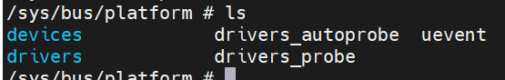


**platform虚拟总线上的设备**，可以看到，有我自己在根节点上的mygpiobeep, soc组
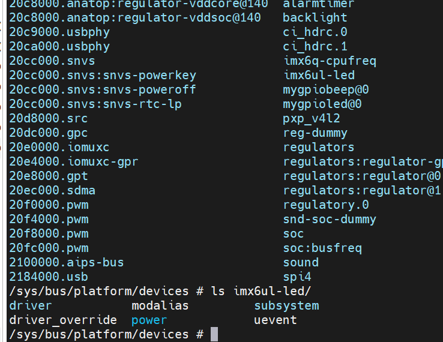

**platform虚拟总线上的驱动**，可以看到，有我们自己加载进去的驱动。另外也能看到有imx6ul-pinctrl的驱动。
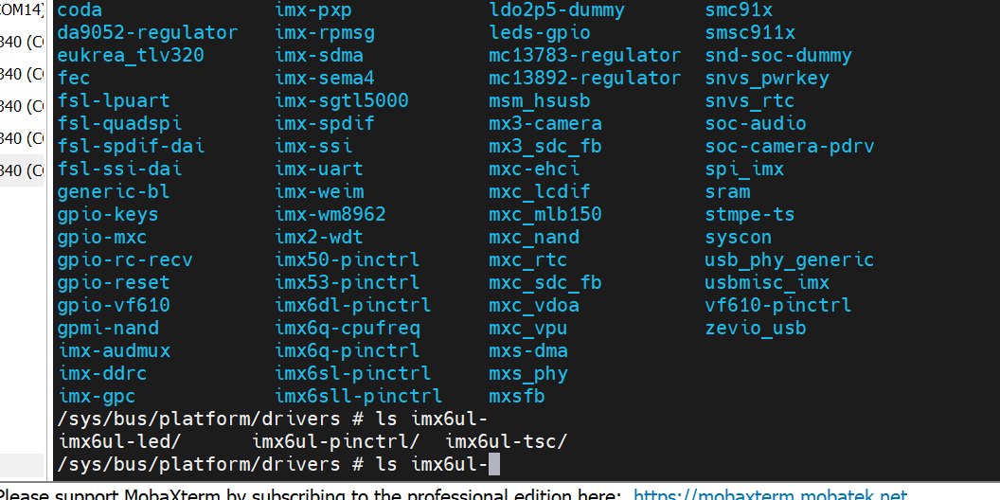

> 我们在这里也看到platform下的driver，有一个imx6ul-pinctrl, 这就是linux驱动的分离的思想的体现：
>
> 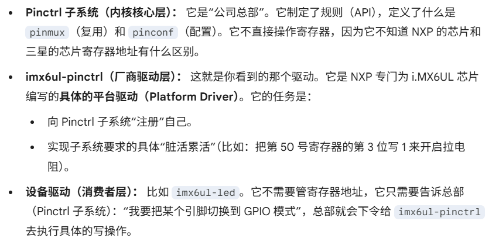
>
> 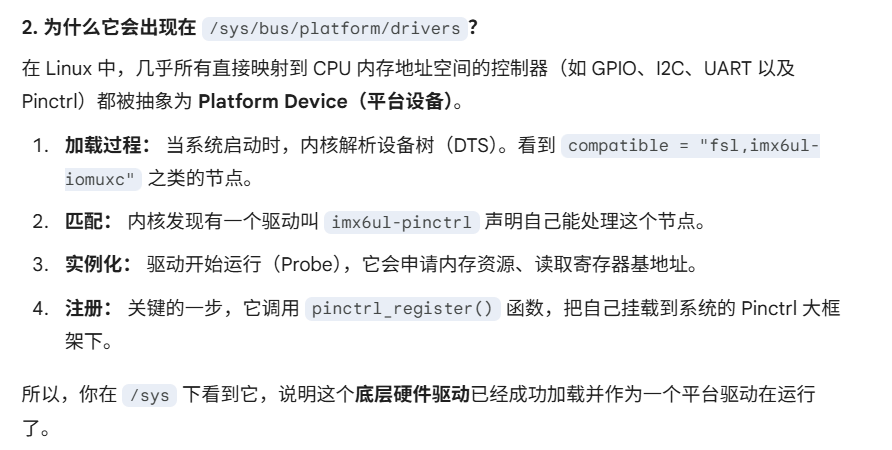
> 
> 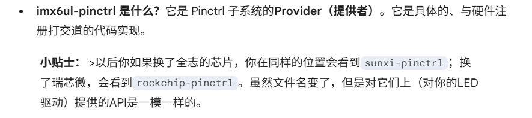


## pinctrl子系统，gpio子系统
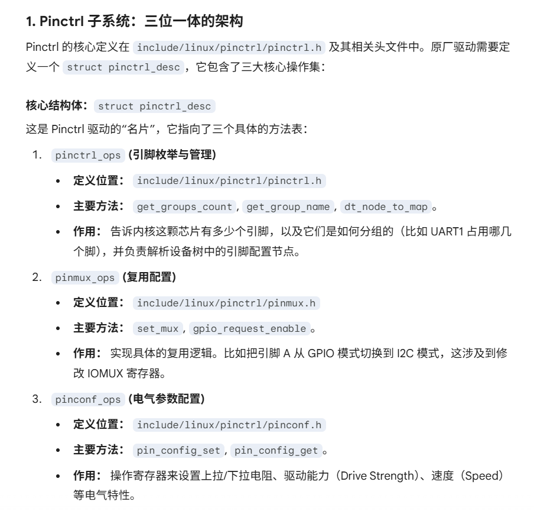

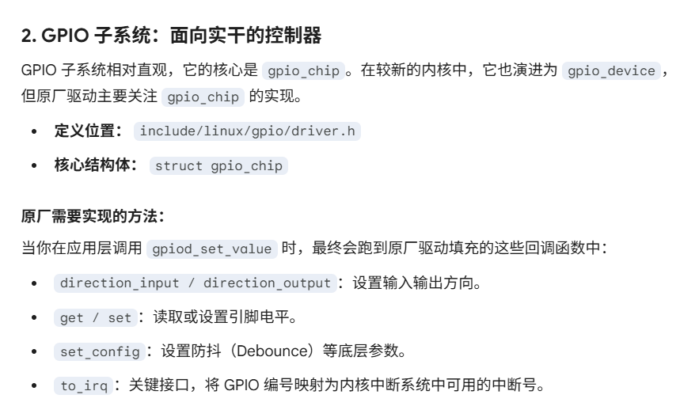

所以，我们平常自己写一个驱动，都是创建一个设备结构体来描述设备，然后弄一整套申请设备号，注册字符设备，然后实现各种字符设备操作函数等等。


像这种子系统，比如pinctrl子系统，就是因为pinctrl的操作，gpio的操作，都太过于标准，所以这些子系统就相当于写了一大半的驱动。比如里面已经定义了一个pinctrl_desc的对象，然后完成好了申请设备号，注册设备，创建设备节点这些工作，只不过，具体的设备操作函数pinctrl_ops还没实现，需要原厂的工程师，根据他们自己的平台，去实现这些ops。是吗

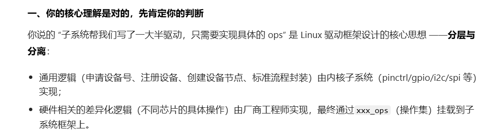
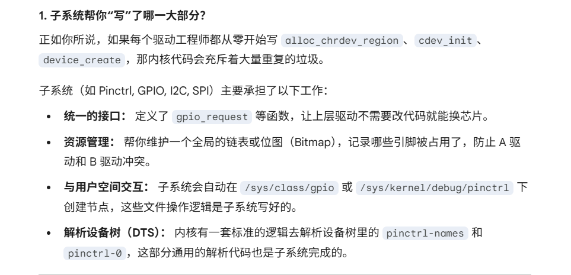
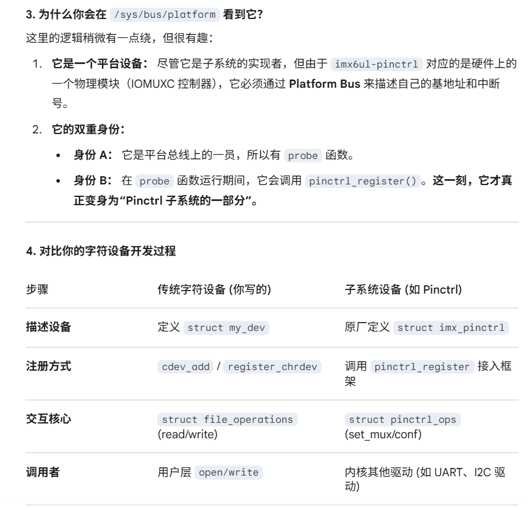


### dts + platform_driver
如果换成设备树形式后，无需再编写platform_device了。在dts中描述设备即可。

**注意把compatible改成一致**

因为我们都用设备树了，也就没必要像上面那样自己映射寄存器来写控制寄存器，可以直接借用pinctrl子系统（直接在dts中配置生效，无相关api提供）和gpio相关子系统的相关api
`my_platform_dts_driver.c`
```c
#include <linux/types.h>
#include <linux/kernel.h>
#include <linux/delay.h>
#include <linux/ide.h>
#include <linux/init.h>
#include <linux/module.h>
#include <linux/errno.h>
#include <linux/gpio.h>
#include <linux/cdev.h>
#include <linux/device.h>
#include <linux/of_gpio.h>
#include <linux/semaphore.h>
#include <linux/timer.h>
#include <linux/irq.h>
#include <linux/wait.h>
#include <linux/poll.h>
#include <linux/fs.h>
#include <linux/fcntl.h>
#include <linux/platform_device.h>
#include <asm/mach/map.h>
#include <asm/uaccess.h>
#include <asm/io.h>
/***************************************************************
Copyright © ALIENTEK Co., Ltd. 1998-2029. All rights reserved.
文件名		: leddriver.c
作者	  	: 左忠凯
版本	   	: V1.0
描述	   	: 设备树下的platform驱动
其他	   	: 无
论坛 	   	: www.openedv.com
日志	   	: 初版V1.0 2019/8/13 左忠凯创建
***************************************************************/

#define LEDDEV_CNT		1				/* 设备号长度 	*/
#define LEDDEV_NAME		"dtsplatled"	/* 设备名字 	*/
#define LEDOFF 			0
#define LEDON 			1

/* leddev设备结构体 */
struct leddev_dev{
	dev_t devid;				/* 设备号	*/
	struct cdev cdev;			/* cdev		*/
	struct class *class;		/* 类 		*/
	struct device *device;		/* 设备		*/
	int major;					/* 主设备号	*/	
	struct device_node *node;	/* LED设备节点 */
	int led0;					/* LED灯GPIO标号 */
};

struct leddev_dev leddev; 		/* led设备 */

/*
 * @description		: LED打开/关闭
 * @param - sta 	: LEDON(0) 打开LED，LEDOFF(1) 关闭LED
 * @return 			: 无
 */
void led0_switch(u8 sta)
{
	if (sta == LEDON )
		gpio_set_value(leddev.led0, 0);
	else if (sta == LEDOFF)
		gpio_set_value(leddev.led0, 1);	
}

/*
 * @description		: 打开设备
 * @param - inode 	: 传递给驱动的inode
 * @param - filp 	: 设备文件，file结构体有个叫做private_data的成员变量
 * 					  一般在open的时候将private_data指向设备结构体。
 * @return 			: 0 成功;其他 失败
 */
static int led_open(struct inode *inode, struct file *filp)
{
	filp->private_data = &leddev; /* 设置私有数据  */
	return 0;
}

/*
 * @description		: 向设备写数据 
 * @param - filp 	: 设备文件，表示打开的文件描述符
 * @param - buf 	: 要写给设备写入的数据
 * @param - cnt 	: 要写入的数据长度
 * @param - offt 	: 相对于文件首地址的偏移
 * @return 			: 写入的字节数，如果为负值，表示写入失败
 */
static ssize_t led_write(struct file *filp, const char __user *buf, size_t cnt, loff_t *offt)
{
	int retvalue;
	unsigned char databuf[2];
	unsigned char ledstat;

	retvalue = copy_from_user(databuf, buf, cnt);
	if(retvalue < 0) {

		printk("kernel write failed!\r\n");
		return -EFAULT;
	}
	
	ledstat = databuf[0];
	if (ledstat == LEDON) {
		led0_switch(LEDON);
	} else if (ledstat == LEDOFF) {
		led0_switch(LEDOFF);
	}
	return 0;
}

/* 设备操作函数 */
static struct file_operations led_fops = {
	.owner = THIS_MODULE,
	.open = led_open,
	.write = led_write,
};

/*
 * @description		: flatform驱动的probe函数，当驱动与
 * 					  设备匹配以后此函数就会执行
 * @param - dev 	: platform设备
 * @return 			: 0，成功;其他负值,失败
 */
static int led_probe(struct platform_device *dev)
{	
	printk("led driver and device was matched!\r\n");
	/* 1、设置设备号 */
	if (leddev.major) {
		leddev.devid = MKDEV(leddev.major, 0);
		register_chrdev_region(leddev.devid, LEDDEV_CNT, LEDDEV_NAME);
	} else {
		alloc_chrdev_region(&leddev.devid, 0, LEDDEV_CNT, LEDDEV_NAME);
		leddev.major = MAJOR(leddev.devid);
	}

	/* 2、注册设备      */
	cdev_init(&leddev.cdev, &led_fops);
	cdev_add(&leddev.cdev, leddev.devid, LEDDEV_CNT);

	/* 3、创建类      */
	leddev.class = class_create(THIS_MODULE, LEDDEV_NAME);
	if (IS_ERR(leddev.class)) {
		return PTR_ERR(leddev.class);
	}

	/* 4、创建设备 */
	leddev.device = device_create(leddev.class, NULL, leddev.devid, NULL, LEDDEV_NAME);
	if (IS_ERR(leddev.device)) {
		return PTR_ERR(leddev.device);
	}

	/* 5、初始化IO */	
	leddev.node = of_find_node_by_path("/mygpioled@0");
	if (leddev.node == NULL){
		printk("gpioled node nost find!\r\n");
		return -EINVAL;
	} 
	
	leddev.led0 = of_get_named_gpio(leddev.node, "led-gpio", 0);
	if (leddev.led0 < 0) {
		printk("can't get led-gpio\r\n");
		return -EINVAL;
	}

	gpio_request(leddev.led0, "led0");
	gpio_direction_output(leddev.led0, 1); /* led0 IO设置为输出，默认高电平	*/
	return 0;
}

/*
 * @description		: platform驱动的remove函数，移除platform驱动的时候此函数会执行
 * @param - dev 	: platform设备
 * @return 			: 0，成功;其他负值,失败
 */
static int led_remove(struct platform_device *dev)
{
	gpio_set_value(leddev.led0, 1); 	/* 卸载驱动的时候关闭LED */
	gpio_free(leddev.led0);				/* 释放IO 			*/

	cdev_del(&leddev.cdev);				/*  删除cdev */
	unregister_chrdev_region(leddev.devid, LEDDEV_CNT); /* 注销设备号 */
	device_destroy(leddev.class, leddev.devid);
	class_destroy(leddev.class);
	return 0;
}

/* 匹配列表 */
static const struct of_device_id led_of_match[] = {
	{ .compatible = "led-of-match-table-gpio" },
	{ /* Sentinel */ }
};

/* platform驱动结构体 */
static struct platform_driver led_driver = {
	.driver		= {
		.name	= "imx6ul-led",			/* 驱动名字，用于和设备匹配 */
		.of_match_table	= led_of_match, /* 设备树匹配表 		 */
	},
	.probe		= led_probe,
	.remove		= led_remove,
};
		
/*
 * @description	: 驱动模块加载函数
 * @param 		: 无
 * @return 		: 无
 */
static int __init leddriver_init(void)
{
	return platform_driver_register(&led_driver);
}

/*
 * @description	: 驱动模块卸载函数
 * @param 		: 无
 * @return 		: 无
 */
static void __exit leddriver_exit(void)
{
	platform_driver_unregister(&led_driver);
}

module_init(leddriver_init);
module_exit(leddriver_exit);
MODULE_LICENSE("GPL");
MODULE_AUTHOR("zuozhongkai");

```


# 学习linux内核编写二级设备驱动
## linux内核自带的led设备驱动
前面我们都是自己通过编写一个led的设备结构体，然后为他编写platform_driver驱动。

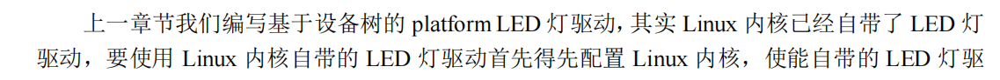

在menuconfig里面使能这个CONFIG_LED_GPIO这个编译选项之后

linux内核自带的led驱动代码在`drivers/led/led-gpio.c`,这个就**相当于内核写好的一个二级设备驱动**，这就非常值得学习了，看别人是怎么写驱动的，是怎么描述设备的。

> 这里主要是学习如何利用linux内核自带的驱动，我们在他的逻辑下编写对应的设备节点，来使用他
>
> 一般都可以在`Document/devicetree/bindings/leds/`下能够看到一些教你如何编写对应的设备节点的txt