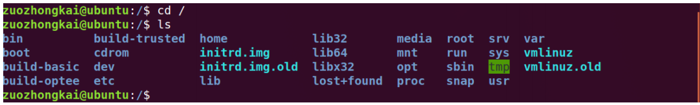

- [根文件系统组成](#根文件系统组成)
  - [介绍](#介绍)
  - [VFS虚拟文件系统](#vfs虚拟文件系统)
  - [挂载的含义](#挂载的含义)
  - [挂载时，内存的内容](#挂载时内存的内容)
- [根文件系统构建](#根文件系统构建)
  - [先安装nfs](#先安装nfs)

# 根文件系统组成
## 介绍
**根文件系统并不是 FATFS，EXT4 这样的文件系统代码**

`EXT4` 这样的文件系统代码属于 **Linux 内核的一部分**

Linux 中的**根文件系统**更像是一个**文件夹**或者叫做**目录**(在我看来就是一个文件夹，只
不过是特殊的文件夹)

在这个**目录**里面会有很多的**子目录**。根目录下和子目录中会有很多的文
件，**这些文件是 Linux 运行所必须的**，比如`库、常用的软件和命令、设备文件、配置文件`等等。

以后我们**说到文件系统**，如果不特别指明，**统一表示根文件系统**

---

- 我们嵌入式 Linux 并没有将内核代码镜像保存在根文件系统中，而是保存到了其他地方, 比如emmc的专用分区
- **根文件系统**是 Linux 内核启动以后**挂载(mount)的第一个文件系统**，然后从根文件系统中**读取初始化脚本**，比如 rcS，inittab 等
- **根文件系统和 Linux 内核是分开的**，单独的 Linux 内核是没法正常工作的，必须要搭配根文件系统
- 如果不提供根文件系统，Linux 内核在启动的时候就会提示**内核崩溃(Kernel panic)**的提示

我们cd /， 这个/就是根的意思，根目录下有很多目录和文件，都是ubuntu需要的。

其中有很多子目录和文件，是我们嵌入式linux用不到的，下面主要讲一下**常用的子目录**:

- `/bin`/
  - 存放系统需要的**可执行文件**，ls,mv这些命令，**所有用户都可以使用**
- `/dev`/
  - 是`device`缩写，所有文件和**设备有关**
  - 此目录下的文件都是**设备文件**。
- `/etc`/
  - 存放**配置文件**，x86的ubuntu的etc非常多，但是嵌入式的linux比较简洁
- `/lib`/
  - library的简称，库，存放linux所必须的**库文件**。是共享库，命令，用户编写的应用程序所要使用的这些库文件
- `/mnt`/
  - **临时挂载目录**，一般是空目录
  - 可以在这个目录下创建空的子目录，/mnt/sd, /mnt/usb/， 这样可以把SD卡，U盘挂载到这些子目录里面
- `/proc`/
  - 一般是空的，当linux系统启动后，会把这个目录作为**proc文件系统的挂载点**。
  - proc是一个**虚拟文件系统**，没有实际的存储设备，proc里面的文件都是临时存在的。一般用来存储系统运行信息文件
- `/usr`/
  - usr不是user的缩写，是unix software resource的缩写，是unix操作系统的**软件资源目录**。
  - 一般是安装的系统软件
- `/var`/
  - 存放一些**可以改变的数据**
- `/sbin`/
  - 存放一些**可执行文件**，只有**管理员**才能使用
- `/sys`/
  - 系统启动后，以此目录作为**sysfs文件系统的挂载点**。
  - sysfs是类似proc文件系统的**特殊文件系统**，sysfs也是基于ram的文件系统。也没有实际的存储设备。
  - 此目录，是系统设备管理的重要目录，通过一定的组织结构，向用户提供详细的内核数据结构信息
- `/opt`/
  - 可选的文件，软件**存放区**，由**用户**选择将哪些文件或软件放到此目录

## VFS虚拟文件系统
> 这就是 Linux 的 **VFS (Virtual File System，虚拟文件系统)** 的功劳，是**linux的一个组件功能**。它在你的命令和底层存储之间加了一层抽象。
> 
> - 你输入 write() 命令。
> 
> - VFS 查看你操作的文件路径。
>   - 如果路径在 /，它就把任务交给 ext4 驱动（写进 Flash）。
>   - 如果路径在 /sys，它就把任务交给 内核驱动（修改内存里的寄存器值）。

## 挂载的含义
挂载的本质是“建立映射关系”。

在 Linux 看来，磁盘分区（比如 eMMC 的第 2 个分区）只是一个块设备文件（如 /dev/mmcblk0p2），它是一串冰冷的二进制数据。

而**挂载动作**，就是**告诉内核的 VFS 组件**：

- “请把 /dev/mmcblk0p2 这个设备里的数据，按照 ext4 的规则**解析出来**，并映射到 /（根目录） 这个文件夹上。”

一旦挂载成功，当你访问 / 目录时，VFS 就知道该调用 ext4 驱动去这个设备里读写数据了。

## 挂载时，内存的内容
**VFS 是运行在 DDR 里的代码**。

当一个文件系统被挂载时，内核确实会在 DDR 中**开辟几块关键的数据结构（账本）**：

- **Superblock (超级块对象)**：
  - 记录这个文件系统的**整体信息**（比如：总大小、已用空间、它是 ext4 还是 FAT32）。
- **Inode (索引节点)**：
  - 记录每一个**文件的元数据**（大小、权限、在 Flash 的哪个位置）。
- **Dentry (目录项缓存)**：
  - 这是最关键的。 它记录了文件名和 Inode 的对应关系。
  - 比如它记录了 bin 文件夹对应的 Inode 编号是 123。

# 根文件系统构建
## 先安装nfs
网络文件系统，我们实际的rootfs是需要读写磁盘的，nfs应该就是把VFS下面换成网络去读取远程。

