- [uboot](#uboot)
  - [Makefile编译分析](#makefile编译分析)
    - [文件目录结构](#文件目录结构)
      - [arch/](#arch)
      - [board/](#board)
      - [configs/](#configs)
      - [.u-boot.xxx\_cmd文件](#u-bootxxx_cmd文件)
      - [Makefile文件](#makefile文件)
      - [u-boot.xxx文件](#u-bootxxx文件)
      - [.config文件](#config文件)
    - [Makefile分析](#makefile分析)
      - [版本号](#版本号)
      - [MAKEFLAGS 变量](#makeflags-变量)
      - [命令输出](#命令输出)
      - [静默输出](#静默输出)
      - [设置编译结果输出目录](#设置编译结果输出目录)
      - [代码检查](#代码检查)
      - [模块编译](#模块编译)
      - [获取主机架构/系统](#获取主机架构系统)
      - [设置目标架构，交叉编译工具，配置文件](#设置目标架构交叉编译工具配置文件)
      - [调用scripts/Kbuild.include](#调用scriptskbuildinclude)
      - [交叉编译工具变量设置](#交叉编译工具变量设置)
      - [导出其他变量(依赖config.mk)](#导出其他变量依赖configmk)
      - [**make xxx\_defconfig过程**](#make-xxx_defconfig过程)
      - [make过程](#make过程)
  - [uboot启动分析](#uboot启动分析)
    - [u-boot.lds 分析](#u-bootlds-分析)
    - [uboot启动流程详解](#uboot启动流程详解)
      - [uboot重定向的内部细节](#uboot重定向的内部细节)
        - [board\_init\_f](#board_init_f)
        - [relocate\_code](#relocate_code)
        - [relocate\_vectors](#relocate_vectors)
        - [board\_init\_r](#board_init_r)
      - [bootz启动linux内核过程分析](#bootz启动linux内核过程分析)
        - [images全局变量](#images全局变量)
        - [do\_bootz](#do_bootz)
        - [bootz\_start](#bootz_start)
          - [do\_bootm\_states](#do_bootm_states)
          - [bootm\_os\_get\_boot\_func](#bootm_os_get_boot_func)
          - [do\_bootm\_linux](#do_bootm_linux)
- [移植uboot](#移植uboot)
  - [烧录evk板卡的uboot](#烧录evk板卡的uboot)
  - [检查mmc设备](#检查mmc设备)
  - [LCD屏幕](#lcd屏幕)
  - [网络](#网络)
  - [添加我们自己的板卡](#添加我们自己的板卡)
    - [添加开发板默认配置文件](#添加开发板默认配置文件)
    - [添加开发板对应的头文件](#添加开发板对应的头文件)
    - [添加开发板对应的板级文件夹](#添加开发板对应的板级文件夹)
    - [图形界面配置（必须，不source找不到.h）](#图形界面配置必须不source找不到h)
  - [修改LCD驱动](#修改lcd驱动)
  - [网络驱动修改](#网络驱动修改)
- [bootcmd和bootargs环境变量](#bootcmd和bootargs环境变量)
  - [bootcmd](#bootcmd)
  - [bootargs](#bootargs)
    - [本地emmc启动测试](#本地emmc启动测试)
    - [网络下载启动](#网络下载启动)
- [总结](#总结)

# uboot
这章来分析一下uboot这个bootloader程序，包括他的代码结构，编译流程，启动流程
## Makefile编译分析

### 文件目录结构
> 完整文件目录结构如下
> 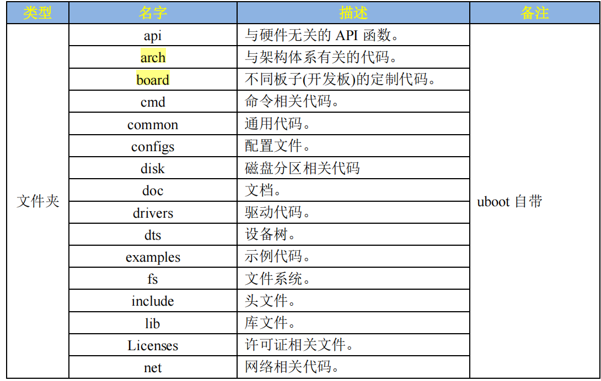
> 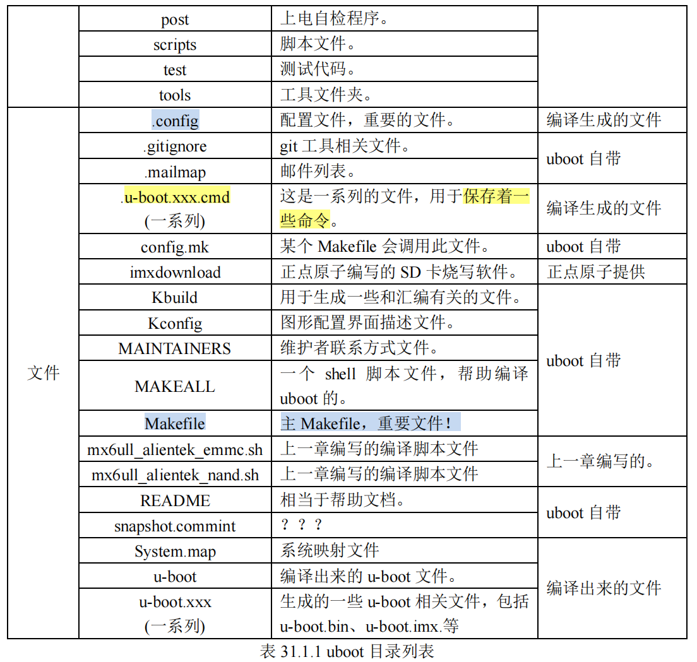

但是我们实际关心的只有极个别的文件夹。

#### arch/
存放着和架构有关的文件
```c
arch/
    arm/                            //arm架构*
        cpu/                        //这个也是和cpu架构有关*
            armv7/                  //cortex-a7内核属于armv7架构*
            ...
            u-boot.lds              //这就是我们使用的lds链接脚本*
        dts/
        imx-common/                 //这是我们的具体的设备imx芯片*
        include/
        lib/
        mach-rockchip/              //mach开头的和具体设备有关*

    avr32/                          //其他架构，无需关心
    m68k/

```


#### board/
board 文件夹就是和**具体的板子**有关的,和**外围电路相关**

```c
board/
    freescale/                  //这是我们要关注的开发板，I.MX 系列以前属于 freescale
            mx6ul_14x14_ddr3_arm2/              /*这里对应了5种板子*/
            mx6ul_14x14_evk/                    /*mx6ull表示使用IMX6ULL芯片*/
            mx6ul_14x14_lpddr2_arm2/            
            mx6ull_ddr3_arm2/                   
            mx6ullevk/                          /*mx6ullevk是NXP官方的开发板，正点原子基于这个二次开发*/
            
    samsung/                    //其他开发板，无需关心
    nvidia/
```

#### configs/
此文件夹为 **uboot 配置文件**，一般无需从头自己开始一个一个项目的配置，太麻烦

一般用法是：
- **原厂制作好一个配置文件**，我们基于这个做好的配置文件基础上来**添加**自己想要的功能。
- 原厂制作好的配置文件统一命名为：`xxx_defconfig`
> 因此，NXP原厂的evk开发板，和二次开发的开发板的配置文件，都在这个configs/里面。

```c
configs/
        mx6ull_14x14_ddr512_emmc_defconfig          //正点原子的开发板对应默认配置
        mx6ull_14x14_ddr256_emmc_defconfig
```
实际使用时，我们可以通过`make xxx_defconfig`, 来配置uboot

#### .u-boot.xxx_cmd文件
这些都是编译生成的中间产物，都是些命令文件。

#### Makefile文件
这个是顶层Makefile文件， 支持嵌套，下面会详细解释
#### u-boot.xxx文件
这些就是编译的中间产物。如.bin, .imx, .map, .lds, .cfg

#### .config文件
这个是使用`make xxx_defconfig`配置uboot之后会自动生成的。

这里面的变量都是各层的Makefile的变量。

>顶层Makefile, 子Makefile都会调用这些变量值。
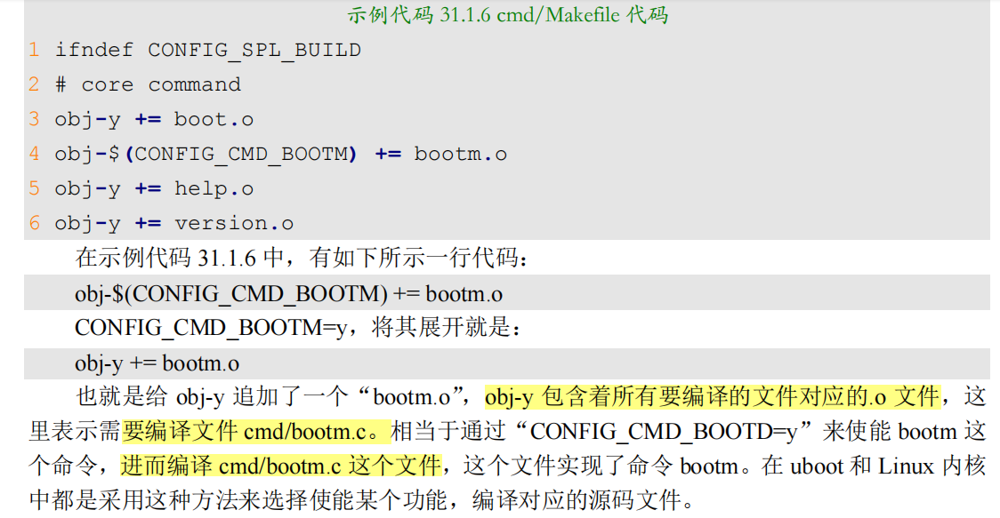


### Makefile分析
#### 版本号
这边是用来设置uboot的版本号的
```c
VERSION = 2016
PATCHLEVEL = 03
SUBLEVEL =
EXTRAVERSION =
NAME =
```
#### MAKEFLAGS 变量
make支持递归调用
```c
$(MAKE) -C subdir       //主目录的Makefile使用如下代码编译子目录
```

当需要向子make传递变量，需要使用export来导出。不希望导出的用unexport

这里使用到了两个特殊的变量：
- SHELL
- MAKEFILGS
> 这两个变量，除非使用unexport, 否则一直自动传递给子make

```c
MAKEFLAGS += -rR --include-dir=$(CURDIR)
```
通过这种方式，不停的追加当前目录
#### 命令输出
```c
//正常编译，直接执行make即可
make V=1    //完整命令输出
make V=0    //简短命令输出
```
#### 静默输出
```c
make -s     //静默输出
```
#### 设置编译结果输出目录
```c
make O=out      //指定目标文件输出到out目录中
```
#### 代码检查
```c
make C=1        //使能代码检查，检查那些需要重新编译的文件
make C=2        //检查所有的源码文件
```
#### 模块编译
```c
//uboot中允许单独编译某个模块
make M=dir      //编译单独的模块
```
#### 获取主机架构/系统
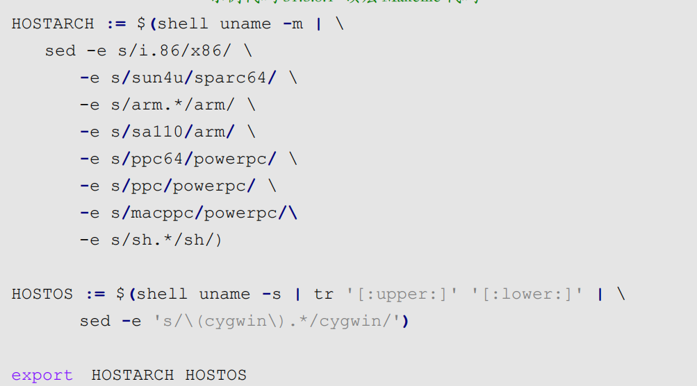
> Makefile里面，会通过一些指令工具，获取本机的架构和系统版本名称
#### 设置目标架构，交叉编译工具，配置文件
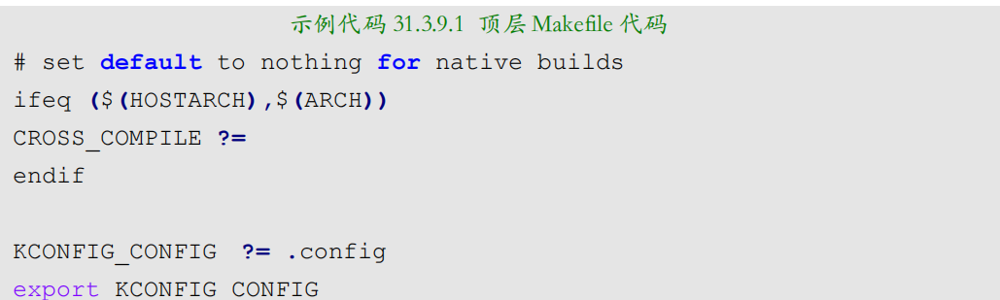
这里来设置目标架构和交叉编译工具链：
- ARCH=arm
- CROSS_COMPILE=arm-linux-gnueabihf-
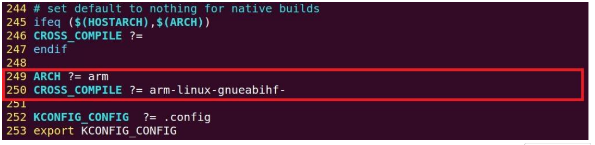
>你可以修改Makefile，然后指定好，这样就无需执行make指令时指定ARCH和CROSS_COMPILE这些环境变量。


> `KCONFIG_CONFIG`, 是需要`.config`来进行配置的
>
> `.config`需要使用`make xxx_defconfig`来进行配置生成
> 默认情况下，`.config`里面就是从`xxx_defconfig`里面复制过来的。

#### 调用scripts/Kbuild.include
> 这里就是引入了一个头文件，导入一些新的变量。
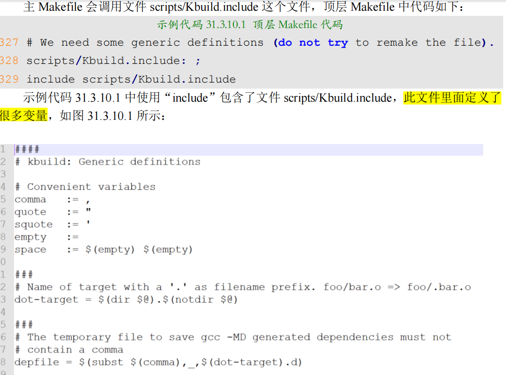
#### 交叉编译工具变量设置
这边就是准备好交叉编译工具链：
- CC
- LD
- ......
#### 导出其他变量(依赖config.mk)
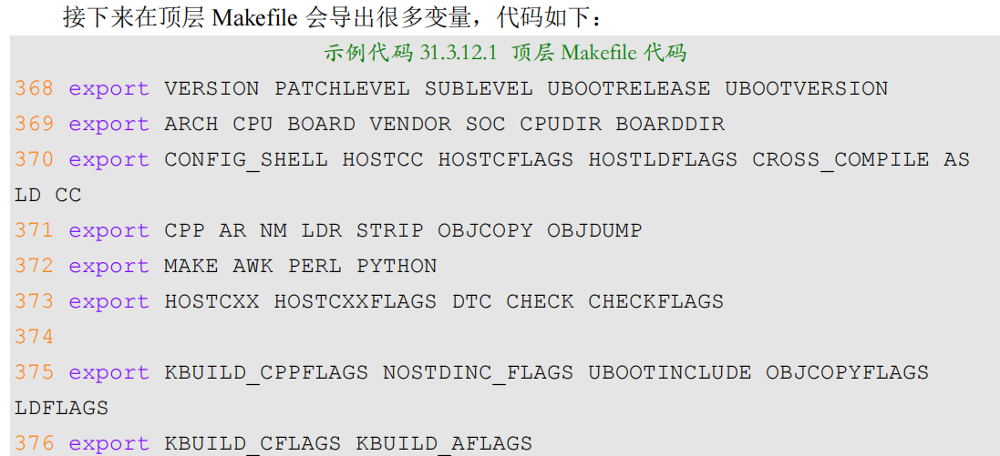

这里就是导出变量，我们重点看下面几个变量
> `ARCH` `CPU` `BOARD` `VENDOR` `SOC` `CPUDIR` `BOARDDIR`

我通过新增一个mytest: 的make目标，执行make mytest, 把这些变量打印出来：

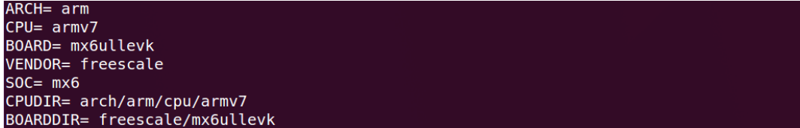

可以看到，就是前面的
- 架构arch相关
- 板卡board相关
- 配置文件configs相关。

这些导出的变量，是从`config.mk`的来的,**Makefile通过config.mk，来读取.config里面的CONFIG_XXX配置**，得到这些变量

config.mk也不是一个文件全部读取，他也是依靠其他的文件来读取配置：
```c
arch/arm/config.mk
arch/arm/cpu/armv7/config.mk
arch/arm/cpu/armv7/mx6/config.mk (此文件不存在)
board/ freescale/mx6ullevk/config.mk (此文件不存在)
```

> 以上，就是Makefile准备环境的一些过程。下面还有两个重要的环节：
> - **准备.config**, `make xxx_defconfig`的过程
> - **具体make的过程**


#### **make xxx_defconfig过程**
在执行make编译uboot前， 需要`make xxx_defconfig`来配置uboot, 下面来分析这个配置过程, (**具体细节，这里我们不深究**)

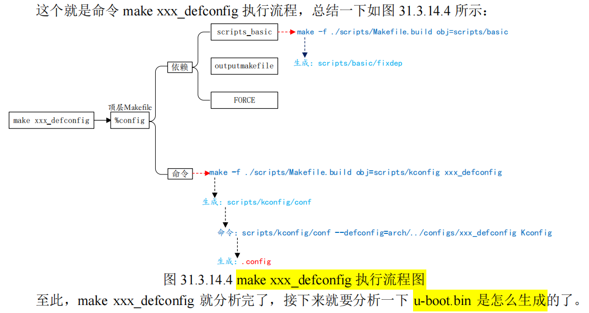


#### make过程

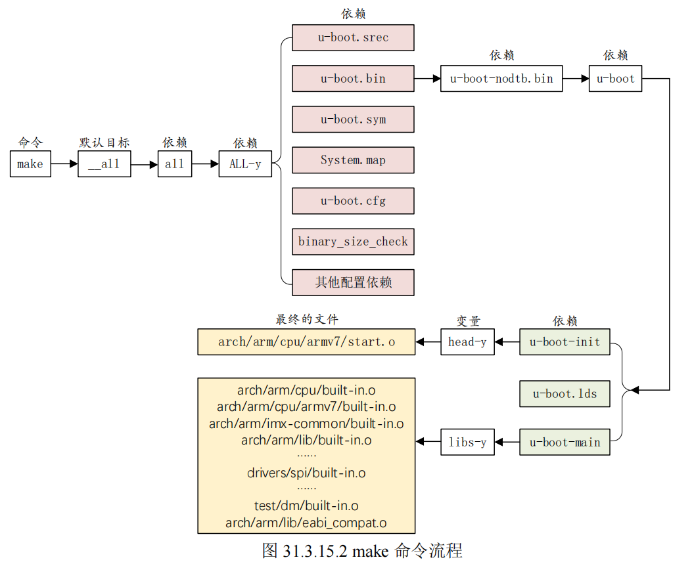
> 可以看到，uboot和裸机程序一样，依赖start.S, lds链接脚本。

> 关于 uboot 的顶层 Makefile 就分析到这里，有些内容我们没有详细、深入的去研究，因为**我们的重点是使用 uboot**，而不是 uboot 的研究者，我们要做的是缕清 uboot 的流程
## uboot启动分析
上面理清楚了uboot的编译流程，如何准备环境变量，如何配置uboot，如何编译出uboot镜像文件。

下面来分析uboot的启动流程。通过这个启动流程的梳理，能掌握：
- 外设是哪里被初始化的
- linux内核时如何被启动的

### u-boot.lds 分析
我们根据上面的make过程，可以知道，uboot和裸机程序的结构差不多，前面很多步骤，其实都是在准备环境变量，指定编译文件。

要分析 **uboot 的启动流程**，首先要找到“**入口**”，找到第一行程序在哪里。程序的链接是由`链接脚本`来决定的，所以**通过链接脚本可以找到程序的入口**。如果

没有编译过 uboot 的话链接脚本为 `arch/arm/cpu/u-boot.lds`。**但是这个不是最终使用的链接脚本**

**最终的链接脚本是在这个链接脚本的基础上生成的**。编译一下 `uboot`，编译完成以后就会在 **uboot 根目录下生成 `u-boot.lds`**

下面是根目录最终的lds链接脚本：
```c
OUTPUT_FORMAT("elf32-littlearm", "elf32-littlearm", "elf32-littlearm")
OUTPUT_ARCH(arm)
ENTRY(_start)
SECTIONS
{
 . = 0x00000000;
 . = ALIGN(4);
 .text :
 {
  *(.__image_copy_start)
  *(.vectors)
  arch/arm/cpu/armv7/start.o (.text*)
  *(.text*)
 }
 . = ALIGN(4);
 .rodata : { *(SORT_BY_ALIGNMENT(SORT_BY_NAME(.rodata*))) }
 . = ALIGN(4);
 .data : {
  *(.data*)
 }
 . = ALIGN(4);
 . = .;
 . = ALIGN(4);
 .u_boot_list : {
  KEEP(*(SORT(.u_boot_list*)));
 }
 . = ALIGN(4);
 .image_copy_end :
 {
  *(.__image_copy_end)
 }
 .rel_dyn_start :
 {
  *(.__rel_dyn_start)
 }
 .rel.dyn : {
  *(.rel*)
 }
 .rel_dyn_end :
 {
  *(.__rel_dyn_end)
 }
 .end :
 {
  *(.__end)
 }
 _image_binary_end = .;
 . = ALIGN(4096);
 .mmutable : {
  *(.mmutable)
 }
 .bss_start __rel_dyn_start (OVERLAY) : {
  KEEP(*(.__bss_start));
  __bss_base = .;
 }
 .bss __bss_base (OVERLAY) : {
  *(.bss*)
   . = ALIGN(4);
   __bss_limit = .;
 }
 .bss_end __bss_limit (OVERLAY) : {
  KEEP(*(.__bss_end));
 }
 .dynsym _image_binary_end : { *(.dynsym) }
 .dynbss : { *(.dynbss) }
 .dynstr : { *(.dynstr*) }
 .dynamic : { *(.dynamic*) }
 .plt : { *(.plt*) }
 .interp : { *(.interp*) }
 .gnu.hash : { *(.gnu.hash) }
 .gnu : { *(.gnu*) }
 .ARM.exidx : { *(.ARM.exidx*) }
 .gnu.linkonce.armexidx : { *(.gnu.linkonce.armexidx.*) }
}

```
所以，lds链接脚本，指定的我们整个uboot程序的入口是`_start`, 定义在`arch/arm/lib/vector.S`中

`arch/arm/lib/vector.S`开头如下， 
> 链接脚本把段.vectors放在最开头，并**指定入口为_start**
>
> `vector.S`中实际定义了**段.vectors**， 然后声明全局`label:_start`.
```c
.globl _start

	.section ".vectors", "ax"

_start:

#ifdef CONFIG_SYS_DV_NOR_BOOT_CFG
	.word	CONFIG_SYS_DV_NOR_BOOT_CFG
#endif

	b	reset
	ldr	pc, _undefined_instruction
	ldr	pc, _software_interrupt
	ldr	pc, _prefetch_abort
	ldr	pc, _data_abort
	ldr	pc, _not_used
	ldr	pc, _irq
	ldr	pc, _fiq
```
> 可以看到，开头就是**中断向量表**，存放在.vectors段里面

下面我们再来看看链接地址，在lds的`.vectors`之前，还有一个`.__image_copy_start`, 这个实际上就是定义为一个地址:`0x87800000`.

> 我们前面复习汇编的时候，有讲到过，如果.（地址），就相当于把光标移动到这里。

所以也即是说链接脚本里面：
- `.0x87800000`
- **.vectors**  (中断向量表, `arch/arm/lib/vector.S`)
- **start.S**   (启动代码,`arch/arm/cpu/armv7/start.s`)
- *.text (代码段)
- *.rodata
- *.data
- *.bss

> 具体的地址，可以通过查看根目录的uboot.map，查看uboot镜像的内存映射文件

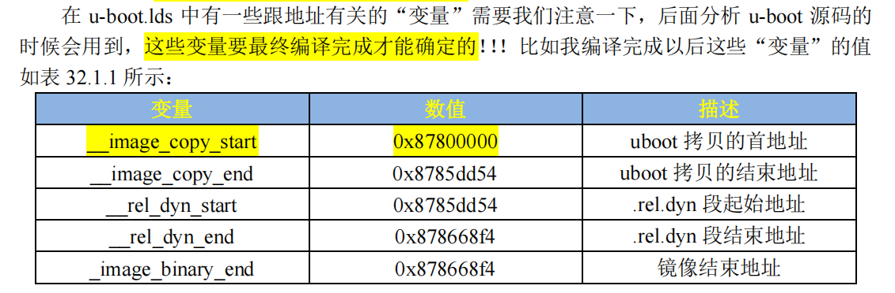
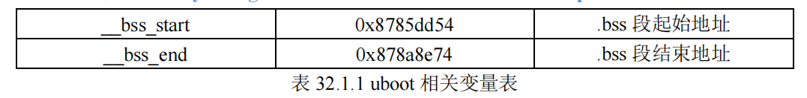
以上的“变量”值可以在 `u-boot.map` 文件中查找，除了`__image_copy_start`
以外，**其他的变量值每次编译的时候可能会变化**，

如果**修改了 uboot 代码**、**修改了 uboot 配置**、**选用不同的优化等级**等等**都会影响到这些值**。所以，一切以实际值为准！


### uboot启动流程详解
下面就是按照连接脚本里面指定的顺序执行，先看看中断向量表

`arch/arm/lib/vector.S`
```c
_start:
        b   reset;
        //其他中断向量
```
跳转至reset, 不回头

reset代码段，定义在`arch/arm/cpu/armv7/start.S`中
> 也就是进入了我们的start.S
由于代码太长，我这里只整理跳转执行的主要的函数名
- reset:
  - b save_boot_params
    - b save_boot_params_ret
      - 读取cpsr
      - 判断模式
      - 设置模式为SVC
      - 关闭FIQ和IRQ中断
      - ---
      - 读取CP15协处理器SCTLR
      - 使能向量表重定向
      - 设置向量表偏移地址VBAR
      - ---
      - **bl cpu_init_cp15**
        - 设置CP15协处理器相关，关闭MMU这些等等
      - **bl cpu_init_crit**（**可返回**）
        - `b lowlevel_init`
      - **bl _main**


下面主要分析 `lowlevel_init`，定义在：

`arch/arm/cpu/armv7/lowlevel_init.S`，不展示代码细节，就整理一下内部做的工作：
- lowlevel_init:
  - (svc模式)设置SP -> `CONFIG_SYS_INIT_SP_ADDR`(**内部RAM**)
    - > `CONFIG_SYS_INIT_SP_ADDR` = 0x00900000 + 0X1FF00 = `0X0091 FF00`
    - > 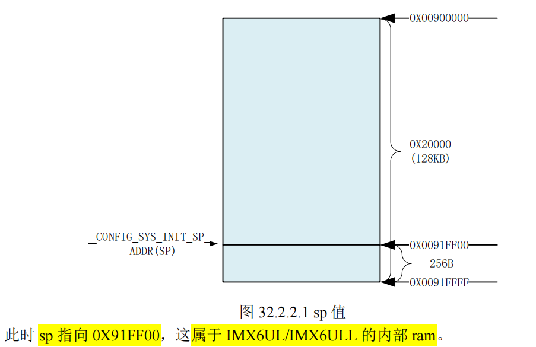
    - > 此时SP指向内部RAM的靠后的部分
  - bic sp， 8字节对齐处理
  - sp - GD_SIZE(248)
  - sp 8字节对齐
    - > 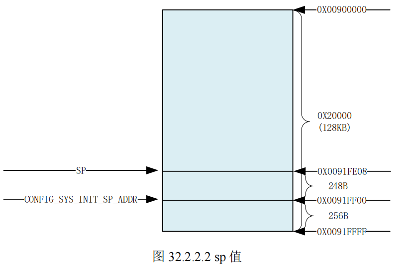
  - 保存SP到R9
  - IP和LR压栈
  - **bl s_init**
  - 出栈ip, lr，并跳转lr

> 以上就是初始化好SVC模式下的SP指针，在内部RAM中开辟栈区。

下面分析`s_init`函数, 定义在`arch/arm/cpu/armv7/mx6/soc.c`
- s_init:
  - 判断CPU类型
  - 返回（对于imx来说是个空函数）

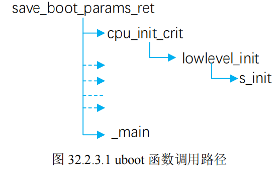

所以接下来就进入_main函数， 定义在`arch/arm/lib/crt0.S`中。
- _main
  - 设置SP->`CONFIG_SYS_INIT_SP_ADDR`，也就是 sp 指向 `0X0091 FF00`
  - SP 8字节对齐
  - bl board_init_f_alloc_reserve, (参数就是SP的栈顶地址)
    - 内部RAM中留出早期的**malloc内存区域**（0x400）和**gd内存区域**(248)
    - 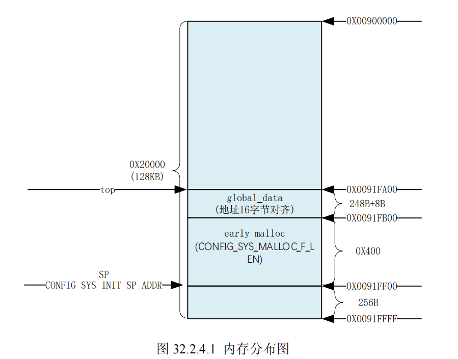
    - 返回top指针=0X0091FA00 (gd区域的起始地址，从低->高增长)
  - 设置SP = top指针
  - 设置R9 = top指针（gd的起始地址）
    - >  uboot定义了一个全局的gd_t * gd, 存放在r9中。
    - > 所以这一行代码就是让gd指向0x0091FA00(**使用R9作为GD指针，就像用R13作为SP指针一样。**)
    - > 相当于现在内部RAM中有3个区域：栈区，堆区，全局GD区
    - > 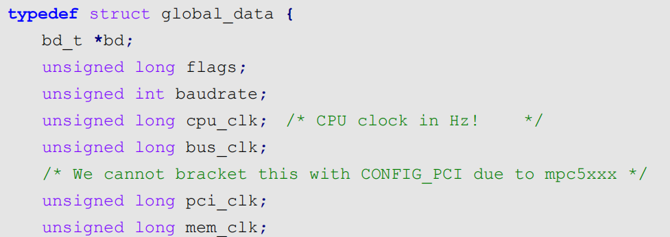
    - > gd区域，里面就是一个global_data的结构体，相当于存储一些全局的数据
  - bl board_init_f_init_reserve
    - 初始化gd，清零GD区域
    - gd->malloc_base = gd 基地址+gd 大小, 16字节对齐，这个也就是 early malloc 的起始地址。
    - > 说白了，gd指向的就是gd区域的起始低地址，malloc_base就是gd区域的高地址，也是malloc堆区的起始地址
  - ---
  - **bl board_init_f**
    - 初始化ddr, 定时器，完成代码拷贝，**后面详细分析**
  - sp = gd->start_addr_sp = 0x9EF44E90（ddr的地址）
    - > 说明新的sp,gd 将会放到ddr中，而不是内部RAM。
  - sp 8字节对齐
  - R9 = gd->bd (R9里面原来放的是老的gd)
  - lr = here, 后面执行其他函数，可以返回到此处
  - lr += gd->reloc_off, 因为接下来要**重定位代码**，就是**把代码拷贝到新地方去**
    - 现在uboot是`87800000`, 下面要拷贝到`ddr的最后面的位置`。将87800000开始的内存空出来。
  - r0 = gd->relocaddr (uboot要拷贝的目的地址) = `0x9FF4 7000`
  - ---
  - 调用**relocate_code**, 进行重定位，把uboot拷贝到新地方去。
  - 调用**relocate_vectors**, 对中断向量表做重定位
  - 调用**c_runtime_cpu_setup**
    - 清除bss段
    - 设置`board_init_r`的函数参数
      - 参数1：**gd**, 读取R9到R0
      - 参数2：**目的地址**，R1=gd->relocaddr
    - **调用`board_init_r`**

> **以上基本就是整个start.S里面完整的流程，从uboot启动，到实现重定向**

--- 

#### uboot重定向的内部细节
上面的流程中，还有一些细节没有补全：
- **board_init_f**
  - 初始化ddr, 定时器，完成代码拷贝
- **relocate_code**
- **relocate_vectors**
- **board_init_r**

下面依次分析
##### board_init_f
此函数调用在uboot重定向前

主要工作如下：
1. 初始化一系列外设，如串口，定时器，打印一些消息
2. 初始化gd的各个成员变量
   1. 因为uboot需要把自己拷贝到ddr的末端，给linux内核留出位置。所以**在拷贝前**，肯定**要给uboot各个部分分配好内存位置和大小**。
      1. gd放在哪里，malloc内存池放哪里，

具体细节，我们不过多关注，看一下拷贝前，该函数对ddr的内存分配的安排
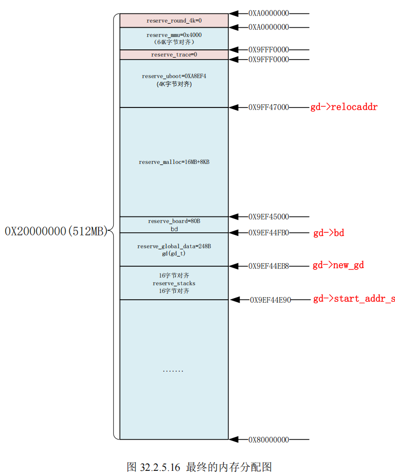

##### relocate_code
这个就是用于uboot的代码拷贝的

- **R1** = __image_copy_start = `0x8780 0000`
- **R0** = `0x9FF47000` (重定向的起始地址)
- **R4** = R0 - R1， 保存拷贝偏移量
  - 若R0 = R1， 则不需要拷贝了，执行relocat_done
- **R2** = __image_copy_end, 要拷贝的结束地址 = `0x8785dd54`
  - 说明要拷贝的有：`vector`, `start.S`, `.text`, `.rodata`, `.data`
- ---
- copy_loop 完成代码拷贝工作, 1次拷贝8字节
- ---
- **重定位.rel.dyn段**
  - 这个段是存放.text段中需要重定位地址的集合
  - 因为重定位拷贝之后，.text中的**运行地址和链接地址不一样了**，所以寻址会出问题，所以**解决办法就是用相对偏移来查找变量**，而不是绝对地址，这就需要在**ld的选项中加入-pie**, 来生成**位置无关的可执行文件**。使用这个选项后，就会**生成一个.rel.dyn段**，uboot就是靠这个.rel.dyn段来解决重定向问题的。
  - 这里会对原来的.rel.dyn， 根据重定向的偏移量，来计算出新的.rel.dyn， 这就实现了.rel.dyn的重定向。


##### relocate_vectors
这个函数，用于重定向向量表，定义在relocate.S中

因为cortex a7 支持向量表偏移，且在.config里面定义了CONFIG_HAS_VBAR
所以：
- relocate_vectors
  - R0 = gd->relocaddr, uboot重定位的首地址。向量表从这里开始存放。
  - CP15的VBAR = R0，设置向量表偏移

##### board_init_r
前面分析`board_init_f`调用一系列函数**初始化外设**和**gd的成员变量**。但是，`board_init_f`没有初始化所有的外设。还需要一些后续工作。这就是`board_init_r`完成的。

> **此时uboot已经完成了重定向，在ddr的末端**。


`common/board_r.c`
- board_init_r:
  - initr_trace (初始化和调试跟踪有关的内容)
  - 设置gd->flags, 标记重定位完成
  - 初始化cache, **使能cache**
  - 初始化重定位后的gd的成员变量
  - **初始化malloc**内存池
  - 启动状态重定位
  - 初始化**bootstage**之类的
  - **board_init**函数，**板级初始化**，包括I2C，FEC，USB，等等
    - 这里执行的就是`mx6ull_alientek_emmc.c`中的`board_init`
  - stdio初始化
  - **串口初始化**
  - 调试声明，通知已经在RAM中运行
  - **初始化EMMC**
  - 初始化`环境变量`
  - 初始化其他CPU核
  - 各种输入输出设备初始化（LCD这些）
  - **控制台初始化**
  - **中断**初始化
  - 使能**中断**
  - 网络地址初始化
  - **`board_late_init`**， **板子后续初始**
    - 定义在`mx6ull_alientek_emmc.c`中
    - 如果环境变量存储在emmc/sd卡中，该函数会初始化emmc/sd卡。切换到正在使用的mmc设备。
  - 初始化网络设备
  - `run_main_loop` 主循环，处理命令

---
**`run_main_loop`**
就是进行倒计时, 定义在`common/board_r.c`中
- 如果没有获得回车， 启动linux内核
- 获得回车，进入命令模式
  - `cli_loop`, 处理命令行的函数
  - `cmd_process`, 把命令（dhcp）和具体的函数(do_dhcp)挂钩

#### bootz启动linux内核过程分析
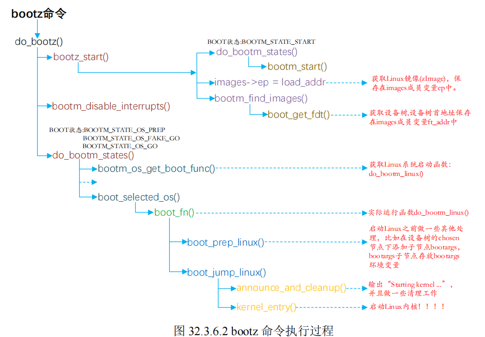
以上是uboot里面对linux内核的启动流程，下面详细分析：

##### images全局变量
uboot使用bootz, bootm，在启动linux内核时，都会使用一个重要的全局变量：

```c
//include/image.h
typedef struct bootm_headers {
	/*
	 * Legacy os image header, if it is a multi component image
	 * then boot_get_ramdisk() and get_fdt() will attempt to get
	 * data from second and third component accordingly.
	 */
	image_header_t	*legacy_hdr_os;		/* image header pointer */
	image_header_t	legacy_hdr_os_copy;	/* header copy */
	ulong		legacy_hdr_valid;

#if defined(CONFIG_FIT)
	const char	*fit_uname_cfg;	/* configuration node unit name */

	void		*fit_hdr_os;	/* os FIT image header */
	const char	*fit_uname_os;	/* os subimage node unit name */
	int		fit_noffset_os;	/* os subimage node offset */

	void		*fit_hdr_rd;	/* init ramdisk FIT image header */
	const char	*fit_uname_rd;	/* init ramdisk subimage node unit name */
	int		fit_noffset_rd;	/* init ramdisk subimage node offset */

	void		*fit_hdr_fdt;	/* FDT blob FIT image header */
	const char	*fit_uname_fdt;	/* FDT blob subimage node unit name */
	int		fit_noffset_fdt;/* FDT blob subimage node offset */

	void		*fit_hdr_setup;	/* x86 setup FIT image header */
	const char	*fit_uname_setup; /* x86 setup subimage node name */
	int		fit_noffset_setup;/* x86 setup subimage node offset */
#endif

#ifndef USE_HOSTCC
	image_info_t	os;		/* 系统镜像信息 */
	ulong		ep;		/* entry point of OS */

	ulong		rd_start, rd_end;/* ramdisk start/end */

	char		*ft_addr;	/* flat dev tree address */
	ulong		ft_len;		/* length of flat device tree */

	ulong		initrd_start;
	ulong		initrd_end;
	ulong		cmdline_start;
	ulong		cmdline_end;
	bd_t		*kbd;
#endif

	int		verify;		/* getenv("verify")[0] != 'n' */

// 这些宏代表BOOT的不同阶段
#define	BOOTM_STATE_START	(0x00000001)
#define	BOOTM_STATE_FINDOS	(0x00000002)
#define	BOOTM_STATE_FINDOTHER	(0x00000004)
#define	BOOTM_STATE_LOADOS	(0x00000008)
#define	BOOTM_STATE_RAMDISK	(0x00000010)
#define	BOOTM_STATE_FDT		(0x00000020)
#define	BOOTM_STATE_OS_CMDLINE	(0x00000040)
#define	BOOTM_STATE_OS_BD_T	(0x00000080)
#define	BOOTM_STATE_OS_PREP	(0x00000100)
#define	BOOTM_STATE_OS_FAKE_GO	(0x00000200)	/* 'Almost' run the OS */
#define	BOOTM_STATE_OS_GO	(0x00000400)
	int		state;

#ifdef CONFIG_LMB
	struct lmb	lmb;		/* for memory mgmt */
#endif
} bootm_headers_t;

extern bootm_headers_t images;
```
我们先来看看`image_info_t`, 系统镜像信息结构体的定义
```c
typedef struct image_info {
	ulong		start, end;		/* start/end of blob */
	ulong		image_start, image_len; /* start of image within blob, len of image */
	ulong		load;			/* load addr for the image */
	uint8_t		comp, type, os;		/* compression, type of image, os type */
	uint8_t		arch;			/* CPU architecture */
} image_info_t;

```
可以看到里面包含了系统镜像的相关信息。具体下面分析

##### do_bootz
这个函数比较简单，主要就3块：
- do_bootz:
  - bootz_start(cmdtp, flag, argv, &images)
    - 下一节分析
  - bootm_disable_interrupts
    - 关中断
  - images.os.os = IH_OS_LINUX
    - 设置全局变量的`images的os`为`linux`，表示要启动的是linux系统。
    - 后面启动过程会依靠这个来**挑选具体的启动函数**
  - do_bootm_states
    - 执行不同的BOOT阶段，要执行的BOOT阶段有：
      - PREP
      - FAKE_GO
      - GO

##### bootz_start
先来看看do_bootz的第一部分，`bootz_start`

- bootz_start:
  - do_bootm_states(..., BOOTM_STATE_START, images, ..)
    - 执行START阶段
  - `images->ep = load_addr`, **指定系统镜像的入口点**。
    - > 还记得昨天的bootcmd吗，我们bootz前，已经通过tftp/mmc read, 把zImage, dtb拷贝到ddr的指定位置了
    - 此时images->ep = `0x80800000`
  - `bootz_setup`, **检查该系统镜像**是否是linux镜像文件。打印相关信息。
    - 校验arm linux系统魔术数
    - 打印启动信息，如：
    - > kernel image @ 0x80800000 [0x000000 - 0x65ef68]
  - `bootm_find_images`, **查找dtb文件**。
    - 查找dtb文件， 找到以后将dtb的**起始地址和长度**，记录在images.ft_addr, ft_len里面
    - > 我们在bootz启动的时候，这样写 `bootz 0x80800000 - 0x83000000`, 就已经指定了**dtb文件的起始地址**

> 总结： bootz_start主要用于初始化images的相关成员变量，定位校验好zImage, dtb在ddr的位置。


###### do_bootm_states
下面来分析一下，这个执行特定boot阶段的函数。因为这个函数在do_bootz的最后，还有一开始的bootz_start里面，都调用到了这个函数。

由于这个函数代码很长，这里只简要的整理一下：

**`do_bootm_states`根据不同的BOOT状态，执行不同的代码段**

里面判断用到的状态有：
- BOOTM_STATE_**START**
- BOOTM_STATE_OS_**PREP**
- BOOTM_STATE_OS_**FAKE_GO**
- BOOTM_STATE_OS_**GO**


下面来分析，针对不同阶段，这个函数做了哪些事情。
- **针对START阶段**（bootz_start函数调用）
  - bootm_start
    - 清空images
    - 初始化verfify成员
    - 设置状态为images.state = START
  - boot_fn = `bootm_os_get_boot_func`(images->os.os) 
    - 根据系统类型，选择对应的系统启动函数。
    - 返回的`boot_fn` 就是 **Linux系统的启动函数** `do_bootm_linux`
- ---
- **针对PREP状态**
  - 调用`do_bootm_linux`
    - `boot_prep_linux`
      - 处理环境变量：`bootargs` (里面是**传递给linux kernel的参数**)
-  ---
- **针对FAKE_GO状态**
  - 如果我们没有使能TRACE功能，这个状态无效
- ---
- **针对GO状态**
  - `boot_selected_os`(argc, argv, BOOTM_STATE_OS_GO, `images`, `boot_fn`)
    - 用系统镜像里面的启动函数`do_bootm_linux`, **启动linux内核**

###### bootm_os_get_boot_func
> `bootm_os_get_boot_func`是如何获得系统镜像里面的启动函数的？
>
> 在common/bootm_os.c里面，有一个静态全局数组
> ```c
>static boot_os_fn *boot_os[] = {
>    [IH_OS_LINUX] = do_bootm_linux,
>    ...
>}
> ```
> 这个里面存放了不同的系统对应的启动函数，我们要执行的肯定是`do_bootm_linux`


###### do_bootm_linux
下面来看看这个系统镜像的启动函数具体是如何启动linux内核的，函数定义在：
`arch/arm/lib/bootm.c`

该函数也比较简短：
- do_bootm_linux
  - 判断flag == GO/FAKE GO， 若是
    - `boot_jump_linux` (`arch/arm/lib/bootm.c`)
      - arm64位的处理
      - 获取machid(不用dtb的话，linux内核会使用这个来判断是否支持这个机器)
        - 我们使用dtb，自定义板卡，无需linux内核判断是否支持
      - 声明`kernel_entry`函数, 进入linux内核
        - 参数1：int zero, 0
        - 参数2：int arch, 机器ID
        - 参数3：uint params, atags(传统方法，传递命令行信息)/dtb首地址。
      - **指定**`kernel_entry` = `images->ep`
        - 所以这个**入口函数**，不是uboot定义的，而是**linux内核自己定义的**。
        - linux内核镜像文件`zImage`, **第一行代码**就是`kernel_entry`
        - `images->ep` 保存着**zImage的起始地址**。即第一行代码
      - `announce_and_cleanup`
        - 打印信息`Starting kernel ..`，做点清理工作
        - 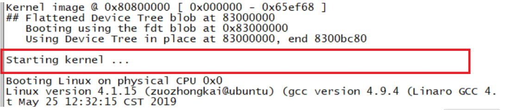
        - `cleanup_before_linux`, 做点清理工作
      - **设置R2的值** = **dtb地址**
        - 所以需要`R0`，`R1`，`R2`来传递`kernel_entry`的**三个参数**
        - 因为Linux内核一开始是汇编代码，即kernel_entry是汇编函数
          - **使用设备树**：`R2 = images->ft_addr`;
          - **不适用设备树**：`R2 = uboot传给linux的参数起始地址,bootargs`
    - 真正执行`kernel_entry(0, machid, r2)`, **彻底进入linux内核**


> **以上就是uboot从编译，到启动，重定向，（你用tftp把zImage, dtb准备到ddr指定位置），bootz启动linux内核的完成流程**。


# 移植uboot
假设我们是正点原子的二次开发厂家，我们来基于NXP芯片原厂的evk板卡的uboot，来添加自己的板卡。

**uboot 移植的一般流程：**
1. 在 uboot 中找到参考的开发平台，一般是**原厂的开发板**。
2. **参考原厂开发板**移植 uboot 到我们所使用的开发板上。

**正点原子的 I.MX6ULL 开发板**参考的是 **NXP 官方的 I.MX6ULL EVK 开发板**做的硬件，

因此我们在移植 uboot 的时候就可以**以 NXP 官方的 I.MX6ULL EVK 开发板为蓝本**

## 烧录evk板卡的uboot
因为uboot总共就3块地方可以改变：
- arch架构
- board板卡
- configs配置

我们用芯片原厂evk的板卡，board里面肯定已经有了对应的板卡的驱动，我们就直接
- make distclean
- make xxx_defconfig
- make V=1 -j16

**编译出原厂 evk板卡的uboot**，直接烧录进我们的板卡，**看看有哪些不适配**
## 检查mmc设备
因为我们就两个mmc设备，mmc 0 是sd卡，mmc 1是emmc。
```c
mmc dev 0/1
mmc info
```

## LCD屏幕
如果 uboot 中的 LCD 驱动正确的话，启动 uboot 以后 LCD 上应该会显示出 NXP 的 logo

而我的实际上打印：
```c
unsupported panel ATK-LCD-7-1024x600
```
说明不支持这个LCD，**NXP 官方 I.MX6ULL 开发板**的屏幕就是 `4.3 寸 480x272` 分辨率
的，所以 uboot 默认 **LCD 驱动**是 `4.3 寸 480x272` 分辨率的

这里我们先不修改

## 网络
```c
mmc0 is current device
Net:   Board Net Initialization Failed
No ethernet found.
Normal Boot
```
说明网络驱动也有问题
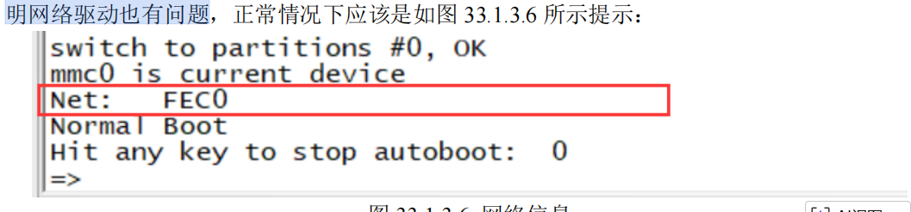

这是因为正点原子开发板的**网络芯片复位引脚**和 NXP 官方开发板不一样，因此需要修改驱动

## 添加我们自己的板卡

为了学习，我们不要在evk的板卡上修改，而是添加我们自己的板卡
主要添加的部分有3块：
- configs/xxx_defconfig   
- include/configs/xxx.h   (可以看作是使能各项功能的文件，CONFIG_xxx, 定义了很多环境变量)
- board/freescale/xxx/    (板卡相关，执行的具体驱动内容，外设的具体表现)

### 添加开发板默认配置文件
configs/mx6ull_alientek_emmc_defconfig
- 修改`CONFIG_SYS_EXTRA_OPTIONS`="指定board/freescale/xxx/imximage.cfg,..."
- 新增`CONFIG_TARGET_MX6ULL_ALIENTEK_EMMC=y`

### 添加开发板对应的头文件
`include/configs/mx6ull_alientek_emmc.h`

- 修改条件宏 `__MX6ULL_ALIENTEK_EMMC_CONFIG_H`

该文件指定了很多配置，基本都是CONFIG_开头，**主要功能就是配置，裁剪uboot**

**如果需要某个功能，就在里面添加对应的CONFIG_xxx宏即可**

详细已经打开的功能如下：
- DRAM大小 512MB
- CONFIG_DISPLAY_CPUINFO， uboot启动可以输出cpu信息
- CONFIG_SYS_MALLOC_LEN, malloc内存池大小，16MB
- CONFIG_MXC_UART_BASE, 串口基地址， UART1_BASE
- CONFIG_SYS_FSL_ESDHC_ADDR = USDHC2基地址。 emmc的接口
- I2C的相关宏定义，控制使能哪个i2c,速度
- CONFIG_SYS_LOAD_ADDR, linux kernel 在ddr的加载地址 = 80800000
- CONFIG_SYS_HZ, 系统时钟频率，1000hz
- CONFIG_STACKSIZE, 128KB 
- CONFIG_SYS_SDRAM_BASE, DRAM的起始地址
- CONFIG_SYS_INIT_RAM_ADDR， 内部RAM的起始地址  0x00900000
- CONFIG_SYS_INIT_RAM_SIZE, 内部RAM的大小， 128KB
- ...
- CONFIG_SYS_MMC_ENV_DEV 1, 指定USDHC2， 也就是EMMC
- CONFIG_SYS_MMC_ENV_PART 0, 分区0
- CONFIG_MMCROOT /dev/mmcblk1p2, 设置进入linux系统的根文件系统所在分区，
  - 这个就是emmc的3个分区，分区0是uboot, 分区1是linux镜像和dtb，分区2是rootfs
- ....

> 所以，可以看到，真正配置uboot的是`include/configs/xxx.h`文件, 相当于设计方案，配置参数，真正的实现在`board/freescale/xxx/xxx.c`里面

### 添加开发板对应的板级文件夹
`board/freescale/mx6ull_alientek_emmc/`, 里面主要有这几个文件
```c
imximage.cfg
imximage_lpddr2.cfg
Kconfig
MAINTAINERS
Makefile
mx6ull_alientek_emmc.c
plugin.S
README
```
**1. Makefile**
```c
obj-y := mx6ull_alientek_emmc.o     //编译目标指定位xxx.c
```

**2. imximage.cfg**
这个看名字，像是.imx镜像文件的配置, 实际也只是**照抄改个名字**
```c
PLUGIN board/freescale/mx6ull_alientek_emmc /plugin.bin 0x00907000
```

**3. Kconfig**
```c
if TARGET_MX6ULL_ALIENTEK_EMMC    //指定条件编译目标

config SYS_BOARD
default "mx6ull_alientek_emmc"    //板卡默认值
 
config SYS_VENDOR
default "freescale"

config SYS_SOC
default "mx6"                     //新增了SOC的名称参数

config SYS_CONFIG_NAME
default "mx6ull_alientek_emmc"    //新增SYS_CONFIG_NAME配置名

endif
```

**4.MAINTAINERS**
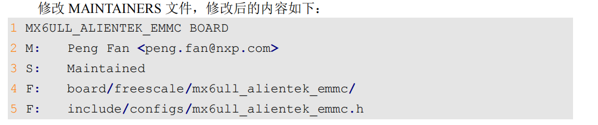
> 看这里似乎也只是指定自己的.h， .c文件进行关联

### 图形界面配置（必须，不source找不到.h）
```c
config TARGET_MX6ULL_ALIENTEK_EMMC
  bool "Support mx6ull_alientek_emmc"
  select MX6ULL
  select DM
  select DM_THERMAL

source "board/freescale/mx6ull_alientek_emmc/Kconfig"
```

## 修改LCD驱动
因为我们在.h中已经勾选了LCD，但是在正点原子的开发板上LCD驱动加载失败，
```c
一般修改 LCD 驱动重点注意以下几点：
①、LCD 所使用的 GPIO，查看 uboot 中 LCD 的 IO 配置是否正确。
②、LCD 背光引脚 GPIO 的配置。
③、LCD 配置参数是否正确。
```
> 前两个引脚配置都是正确的。就是屏幕参数配置有问题。

我们.c文件里面，**配置屏幕**，依赖
- `display_info_t`,定义在`arch/arm/include/asm/imx-common/video.h` 中
- `fb_videomode`

所以，我们需要根据前面裸机使用LCD外设的时候得到的LCD参数，计算出这里.c里面驱动所需的参数。并填写就行了。

同时，**panel要改成一致（.c点屏幕的具体裸机， .h指定点哪个屏幕）**

> 上电后仍然黑屏，原因是一开始加载了emmc中的环境变量，导致panel默认的值被修改，所以需要setenv修改panel

## 网络驱动修改
IMX6ULL采用的内部MAC+外部phy芯片的方案

但是正点原子和NXP的evk开发板的区别在于，我们的板子**更换了phy芯片**，**那么网络驱动怎么办**？

这里就涉及到，**更换了PHY芯片以后，如何调整网络驱动**。

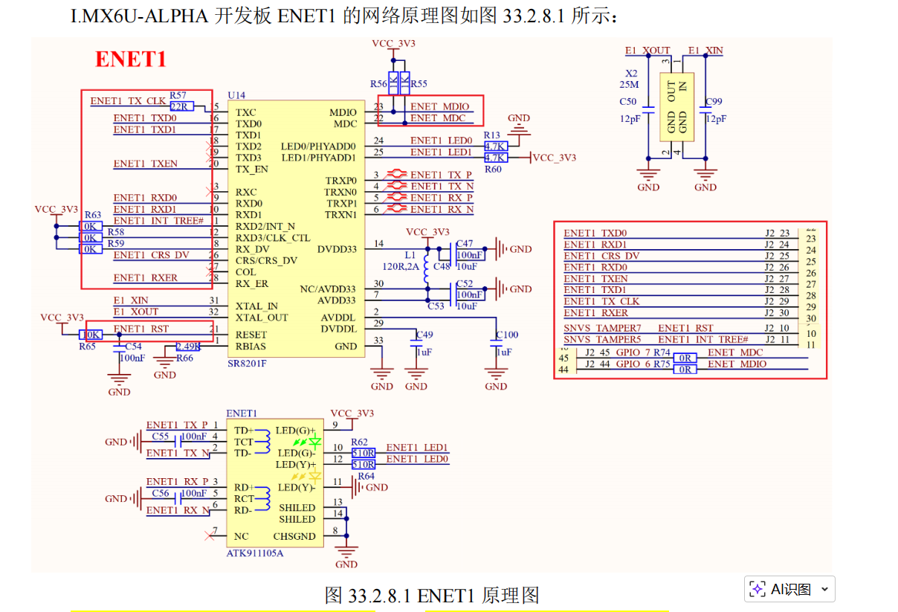
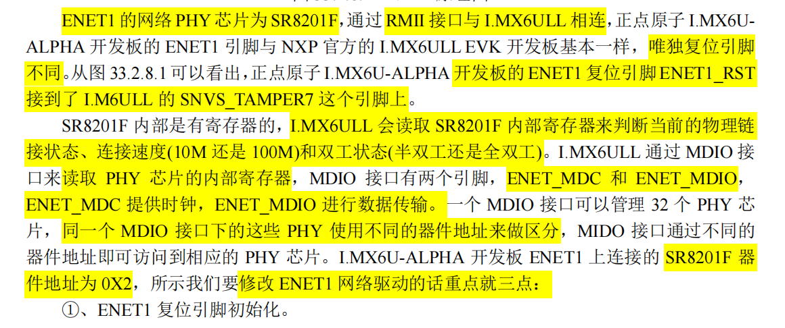
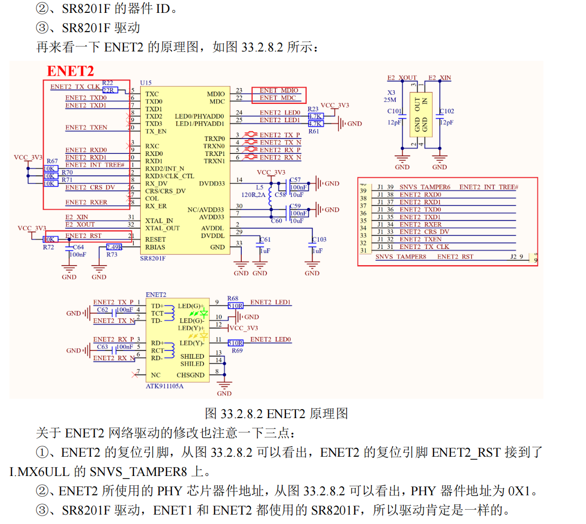

**所以不同点：**
1. 复位引脚不同
2. PHY芯片不同（器件地址，访问逻辑）

**所以修改操作**：
1. .h 指定好phy芯片的id
2. .h 切换phy芯片驱动为realtek，因为phy芯片换了
3. .c 修改reset引脚定义
4. .c 删除旧phy芯片驱动相关代码
5. .c 删除74LV595拓展IO驱动相关代码
6. .c 把reset引脚添加到fec1,fec2的设备引脚定义中
7. .c 在fec1, fec2的网络IO配置数组中初始化复位引脚，依据数据手册硬件延时

至此就完成了引脚的修改，驱动的替换，phy芯片的指定，

烧录测试正常


# bootcmd和bootargs环境变量

uboot里面的两个重要的环境变量 bootcmd, bootargs

在`include/configs/xxx.h`的`CONFIG_EXTRA_ENV_SETTINGS`中保存
## bootcmd
这个就是倒计时完成后的自动启动命令。

他的默认值在`CONFIG_BOOTCOMMAND`中定义，根据条件编译来进行覆盖
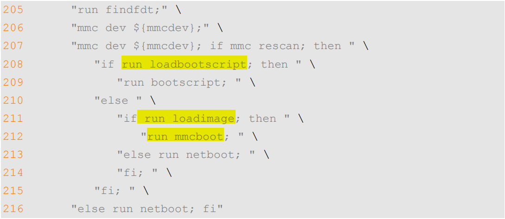

- findfdt, 是查找dtb文件
  - 里面具体根据board name, 这些来找到对应的dtb
  - 如果 board_name 为 EVK 并且 board_rev=9x9 的话 fdt_file
就为 imx6ull-9x9-evk.dtb
- mmc dev 切换设备到mmc1， emmc
- mmc rescan， 看看有没有设备，没有就netboot，网络下载启动。
- loadbootscript
  - fatload mmc 1:1 0x80800000 boot.scr  (我们没有src这个文件)
- loadbootimage
  - fatload mmc 1:1 0x80800000 zImage (emmc启动)
  - run mmcboot
    - loadfdt, 查找dtb文件
      - fatload mmc 1:1 0x83000000 imx6ull-14x14-evk.dtb
    - bootz 0x80800000 - 0x83000000

 **至此，linux内核启动**
 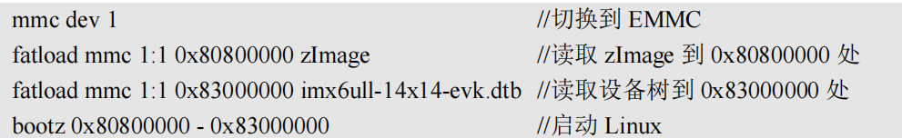

 NXP的uboot写的这么复杂，原因是为了兼容多个板子
## bootargs
默认值是`CONFIG_BOOTARGS`， bootargs环境变量，保存着uboot传递给LINUX内核的参数。

`bootargs`是由`mmcargs`设置的，
```c
mmcargs=setenv bootargs console=${console},${baudrate} root=${mmcroot}

//展开后：
mmcargs=setenv bootargs console= ttymxc0, 115200 root= /dev/mmcblk1p2 rootwait rw
```
可以看出mmcargs就是设置bootargs的值。这些参数linux内核会用到。
- **console**
  - 终端，通过这个设备来和linux交互。
  - 这里设置 `console` 为 `ttymxc0`，因为 linux启动以后 I.MX6ULL 的串口 1 在 linux 下的设备文件就是`/dev/ttymxc0`
- **root**
  - 设置**根文件系统的位置**，指明根文件系统存放在emmc的分区2.
  - rootwait 表示等待mmc设备初始化完成以后再挂载，不然会出错
  - rw表示根文件系统可读写。
- **rootfstype**
  - 一般和root一起使用，指定根文件系统类型。
  - 如果根文件系统时ext，这个选项就无所谓，如果是其他的类型，就需要指定。

### 本地emmc启动测试
通过设置好这两个环境变量，就可以启动linux系统了
```c
setenv bootargs 'console=ttymxc0,115200 root=/dev/mmcblk1p2 rootwait rw'
setenv bootcmd 'mmc dev 1; fatload mmc 1:1 80800000 zImage; fatload mmc 1:1 83000000 
imx6ull-alientek-emmc.dtb; bootz 80800000 - 83000000;'
```
> emmc 分区1里面，zImage，还有适配正点原子的dtb已经存放好了，分区2里面是rootfs.
>
> `include/configs/xxx.h`中已经指定好了rootfs所在的位置为`mmcblk1p2`

最后执行`run bootcmd`, 就可以进入我们的linux系统了
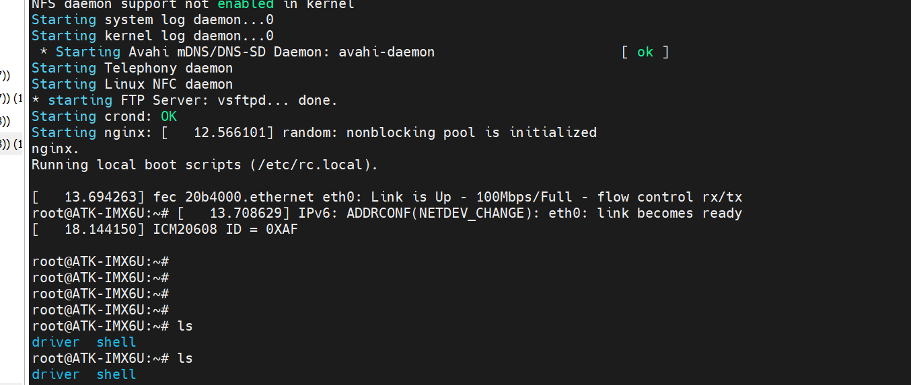

### 网络下载启动
从网络启动 linux 系统的唯一目的就是为了调试！
```c
setenv bootargs 'console=ttymxc0,115200 root=/dev/mmcblk1p2 rootwait rw'
setenv bootcmd 'tftp 80800000 zImage; tftp 83000000 imx6ull-alientek-emmc.dtb; bootz 
80800000 - 83000000'
saveenv
```


# 总结
**uboot 移植到此结束**，简单总结一下 uboot 移植的过程：
- 不管是购买的开发板还是自己做的开发板，**基本都是参考半导体厂商的 dmeo 板**，而
半导体厂商会在他们自己的开发板上移植好 uboot、linux kernel 和 rootfs 等，最终制作**好 BSP
包提供给用户**。
  - **我们可以在官方提供的 BSP 包的基础上添加我们的板子，也就是俗称的移植。**
- 我们购买的开发板或者自己做的板子一般都不会原封不动的照抄半导体厂商的 demo
板，都会根据实际的情况来做修改
  - **既然有修改就必然涉及到 uboot 下驱动的移植。**
- 一般 uboot 中需要解决**串口**、NAND、**EMMC** 或 SD 卡、**网络**和 **LCD 驱动**，因为 **uboot的主要目的就是启动 Linux 内核**，所以**不需要考虑太多的外设驱动**。
- 在 uboot 中添加自己的板子信息，根据自己板子的实际情况来修改 uboot 中的驱动。


