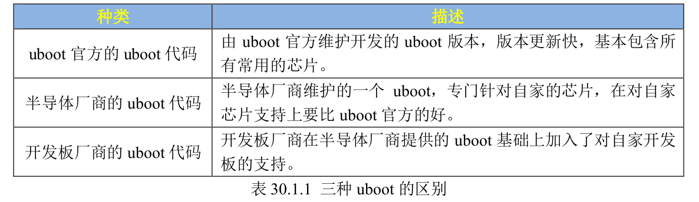

# Uboot 学习笔记
## linux系统的组成部分


前面我们学习的是裸机开发，主要使用寄存器操作，实现对外设的驱动，掌握的外设的底层原理。之后就可以把重心放到**linux驱动框架**上。

在**移植linux系统**之前，需要
1. 移植**bootloader**（用于启动linux内核， bootloader有很多种，常见的是uboot）
2. 再移植**linux内核**
3. 再移植**根文件系统rootfs**（这个里面包含了最常用的命令和文件）
   
这三个一起构成了完整的linux系统。

注：大部分移植的工作，芯片原厂（NXP）已经做好了，我们所做的移植，其实就是让他在特定的开发板上跑起来。

## uboot 介绍
芯片上电以后，**先运行一段bootloader程序**，bootloader内部会**初始化ddr等外设（RAM）（实际工作复杂的多）**，然后将Linux 内核从 **flash（ROM）**(NAND，NOR FLASH，SD，MMC 等)拷贝到 **DDR（RAM）** 中，最后**启动 Linux 内核**

有很多**现成的 bootloader** 软件可以使用，比如 **U-Boot、vivi、RedBoot** 等


**uboot** 的全称是 **Universal Boot Loader**，是一个遵循 GPL 协议的**开源软件**，是一个**裸机代码**，可以看作是**一个裸机综合例程**。

现在的 uboot 已经支持液晶屏、网络、USB 等高级功能。

可以从uboot官网找到uboot的源码，但是这个源码一般是给芯片原厂用的，用来给自家的芯片移植uboot，他们会维护自己的uboot版本。所以我们自己用肯定只能到NXP的官网去下载**定制的uboot代码**， 但是这个定制uboot都是针对原厂（NXP）的评估板的，如果是我们自己的板子，**还需要二次修改NXP官方的uboot**，使其适配我们自己的开发板。


你也可以在购买了第三方开发板以后使用半导体厂商提供的 uboot，只不过**有些外设驱动可能不支持**，需要自己移植，这个就是我们常说的 **uboot 移植**。

## uboot 编译
``` bash
#!/bin/bash
# make clean
make ARCH=arm CROSS_COMPILE=arm-linux-gnueabihf- distclean

# set uboot defconfig
make ARCH=arm CROSS_COMPILE=arm-linux-gnueabihf- mx6ull_14x14_ddr512_emmc_defconfig

# cross-compile, -j = cpu core numbers
make V=1 ARCH=arm CROSS_COMPILE=arm-linux-gnueabihf- -j12
```


注：uboot只是引导程序，是一个综合裸机例程，也**可以引导其他系统**，也可以**支持其他架构**，也可以**拓展其他外设**。

所以在**编译 uboot 之前**，一定要**根据自己的需求配置 uboot**。**mx6ull_14x14_ddr512_emmc_defconfig**就是正点原子针对 I.MX6U-ALPHA 的 EMMC 核心板编写的**配置文件**。

这个配置文件的目录在`uboot/configs`中，通过`make xxx_defconfig`来配置 uboot，`xxx_defconfig`就是不同板子的配置文件

最终会编译出**uboot.bin, uboot.imx**这些**用于烧录的镜像**（和之前的裸机程序一样的镜像文件）

## uboot 烧录
直接把编译出来的u-boot.bin当成裸机例程烧录到SD卡即可


## uboot 网络（驱动开发调试用）
### ping底层网络联通（2层，3层）
ping成功仅验证了开发板与主机的底层网络互通（无需 DHCP 参与，依赖静态配置或已有临时 IP）
### dhcp
**dhcp**命令本质是通过 BOOTP（DHCP 的前身）/DHCP 协议**向网络请求 IP 地址**、**网关**、**启动文件地址等配置**，所以**需要你的网络中有一台机器运行 DHCP 服务器**（Ubuntu主机，用来给设备分配ip）

**Ubuntu 默认无 DHCP 服务**：与普通 Windows 系统类似，Ubuntu 桌面版（如你的系统）默认未安装和启用 DHCP 服务器（仅包含 DHCP 客户端），开发板发送的广播请求无法被 Ubuntu 响应，因此仍会出现超时，另外**Ubuntu 防火墙可能拦截 DHCP 协议的 UDP 67/68 端口**，即使后续安装了 DHCP 服务器，也可能因端口被拦截导致交互失败。

#### Ubuntu主机 安装dhcp服务器
```bash
# 更新软件源
sudo apt update
# 安装DHCP服务器
sudo apt install isc-dhcp-server -y
```

#### 配置dhcp服务器内容
``` bash
sudo vim /etc/dhcp/dhcpd.conf

# 添加以下内容
# 全局配置
default-lease-time 600;        # 默认租期（秒）
max-lease-time 7200;           # 最大租期（秒）
option subnet-mask 255.255.255.0;  # 子网掩码，与开发板一致
option routers 192.168.1.1;    # 网关，与开发板gatewayip一致
option domain-name-servers 223.5.5.5, 8.8.8.8;  # DNS服务器

# 子网配置（与开发板网段匹配）
subnet 192.168.1.0 netmask 255.255.255.0 {
  range 192.168.1.60 192.168.1.200;  # DHCP分配IP池，避开开发板静态IP(192.168.1.50)和serverip(192.168.1.253)
  option broadcast-address 192.168.1.255;  # 广播地址
}

# （可选）为开发板绑定固定IP（基于MAC地址，避免每次分配不同IP）
host imx6ull {
  hardware ethernet b8:ae:1d:01:00:00;  # 开发板ethaddr，与你U-Boot配置一致
  fixed-address 192.168.1.50;           # 绑定的IP，与开发板ipaddr一致
}

```

#### 指定dhcp服务器使用的网卡
``` bash
sudo vim /etc/default/isc-dhcp-server

# 修改
INTERFACESv4="eth0"  # 若为IPv6可配置INTERFACESv6，此处无需关注
``` 

#### 启动Ubuntu主机dhcp服务器
``` bash
# 启动DHCP服务
sudo systemctl start isc-dhcp-server
# 设置开机自启
sudo systemctl enable isc-dhcp-server
# 查看服务状态（确认是否正常运行）
sudo systemctl status isc-dhcp-server

```

#### 关闭防火墙，防止阻挡dhcp服务
``` bash
# 放行UDP 67/68端口
sudo ufw allow 67/udp
sudo ufw allow 68/udp
# 重新加载防火墙规则
sudo ufw reload
```

### nfs服务(尝试失败，一直超时)
NFS 仅用于文件共享（后续开发板挂载根文件系统等场景），为后续dhcp下载linux内核镜像提供文件下载方法

``` bash
sudo apt-get install nfs-kernel-server rpcbind

sudo vi /etc/exports

#新增你的nfs文件共享下载目录
/home/liangji/LINUX/nfs *(rw,sync,no_root_squash)
```

### tftp服务(尝试成功)
nfs，tftp都是传输文件的协议，uboot会在建立好和ubuntu主机的网络通信之后，就开始用文件传输（底层走的是网络tcp,udp）来下载主机上的zImage（内核镜像）。

我们在uboot里面执行dhcp后，会让ubuntu主机给我们分配一个ip，然后默认开始tftp拉取主机的共享文件。但是文档里面让我自己走nfs拉取，我自己尝试了之后，发现非常难用，也无法保证主机的nfs正确建立。

通过设置主机tftp服务后：
``` bash
# 安装TFTP服务端（Ubuntu/Debian）
sudo apt install tftpd-hpa tftp-hpa

# 配置TFTP根目录（需与U-Boot中zImage的存放路径一致）
sudo vi /etc/default/tftpd-hpa
# 修改内容：
TFTP_DIRECTORY="/home/liangji/LINUX/tftpboot"  # 与NFS共享目录一致，确保zImage在此
TFTP_ADDRESS="0.0.0.0:69"
TFTP_OPTIONS="--secure --create"

# 重启TFTP服务
sudo systemctl restart tftpd-hpa

# 网络防火墙设置
sudo ufw allow 69/udp
sudo ufw reload
```

ubuntu主机本地验证，发现确实可以正常拉取文件，这样至少能保证主机这边是正常的。
``` bash
tftp 127.0.0.1
tftp> get zImage
tftp> quit
# 若能获取文件，说明TFTP服务正常
```

之后uboot端尝试以下拉取，发现直接很快就拉下来了。
``` bash
# 1. TFTP加载内核到指定地址
tftp 80800000 zImage

# 之后直接执行dhcp，他会自动执行tftp拉取
```

将 tftpboot 文件夹里面的 zImage 文件下载到开发板 **DRAM** 的 **0X80800000 地址处**


## uboot RAM 操作
裸机都是对整个设备的寻址空间进行了存储空间映射，所以0x8080 0000, 表示的是RAM的其实地址（SRAM = DDR）
md.(b/w/l) addr(H) count(H)
## uboot ROM 操作
ROM，磁盘，uboot会读取所有mmc设备（SD卡， EMMC， NAND）
``` bash
mmc info
mmc rescan
mmc list
mmc dev mmc_id(0,1) (part分区号，默认0)

# 读取磁盘（块block = 扇区 = 512字节）
mmc read ram_addr(0x80800000) start_block(H) count_block(H)

# RAM数据写入磁盘
mmc write ram_addr(0x80800000) start_block(H) count_block(H)
```

 可以使用命令`mmc write`来**升级 uboot**，也就是**在 uboot 中更新 uboot**。

 - 注：在运行的uboot中，拉取新的uboot.imx镜像到RAM中，然后写入SD卡（我们启动的地址）（为什么要隔两个块？因为前2个block，保存的是分区表），之后重启即可。


## uboot 文件操作（不再是磁盘字节操作了）
**ROM**中格式分布：
正常我们在EMMC里面安装了linux系统，那么他会有3个分区:
1. **part 0**(无格式)： uboot
2. **part 1(fat)**: kernel(zImage) + device tree(dtb)
3. **part 2(ext)**: rootfs
### fat文件系统格式
``` bash
# info 查询指定 MMC 设备分区的文件系统信息
#fatinfo <interface> [<dev[:part]>]
fatinfo mmc 1:1

# ls 查询 FAT 格式设备的目录和文件信息
#fatls <interface> [<dev[:part]>] [directory]
fatls mmc 1:1

# 查看 MMC 设备某个分区的文件系统格式
# fstype <interface> <dev>:<part>
fstype mmc 1:0
fstype mmc 1:1
fstype mmc 1:2

# 将指定的文件读取到 DRAM 中
# fatload <interface> [<dev[:part]> [<addr> [<filename> [bytes [pos]]]]]
fatload mmc 1:1 80800000 zImage

# 在 uboot 中更新 linux 镜像文件和设备树。我们以更新 linux 镜像文件 zImage为例
# fatwrite <interface> <dev[:part]> <addr> <filename> <bytes>
# 需要修改uboot defconfig
tftp 80800000 zImage
fatwrite mmc 1:1 80800000 zImage 6788f8
```
### ext文件系统格式
``` bash
# EMMC 的分区 2 就是 ext4格式的，使用 ext4ls 就可以查询 EMMC 的分区 2 中的文件和目录
ext4ls mmc 1:2

# 剩下的后面会提到
```

## uboot boot操作
**uboot 的本质工作是引导 Linux**，所以 uboot 肯定有相关的 boot(引导)命令来启动 Linux

要**启动 Linux**，需要**先将 Linux 镜像文件拷贝到 DRAM 中**，有两种拷贝方式：
1. 从 EMMC 或者 NAND 等**ROM**中将 Linux 镜像和设备树文
件拷贝到 DRAM
2. **tftp** 将 Linux 镜像文件和设备树文件下载到 DRAM 中

不管用那种方法，**只要能将 Linux 镜像和设备树文件存到 DRAM 中就行**, 然后使用 **bootz 命令来启动**，bootz 命令用于启动 zImage 镜像文件
``` bash
bootz [addr [initrd[:size]] [fdt]]
```
- **addr** 是 Linux 镜像文件在 DRAM 中的位置
- **initrd** 是 initrd 文件在DRAM 中的地址，如果不使用 initrd 的话使用‘-’代替即可
- **fdt** 就是**设备树文件**在 DRAM 中的地址

### bootz 从远程拉取kernel + dtb到RAM 启动linux内核
因为我们没有根文件系统，所以内核启动后，只会到无法挂在rootfs，然后kernel panic
``` bash

# 远程拉取kernel镜像
ftp 80800000 zImage

# 远程拉取dtb设备树文件
tftp 83000000 imx6ull-14x14-emmc-7-1024x600-c.dtb

# 启动linux系统，（没有指定rootfs， 所以只会到挂载rootfs停止）
bootz 80800000 - 83000000
```


### bootz 本地ROM启动
从 **EMMC 中启动 Linux 系统**的话只需要使用命令 **fatload** 将 zImage 和imx6ull-14x14-emmc-7-1024x600-c.dtb 从**EMMC 的分区 1 中拷贝到 DRAM 中**，然后使用命令 bootz 启动即可


### bootm
bootm 和 bootz 功能类似，但是 bootm 用于启动 uImage 镜像文件

### boot 自动化启动命令
boot 命令也是用来启动 Linux 系统的，只是 boot 会**读取环境变量 bootcmd** 来启动 Linux 系统, `bootcmd`这个环境变量保存着引导命令,其实就是**启动的命令集合**

相当于Makefile
``` bash
setenv bootcmd 'tftp 80800000 zImage; tftp 83000000 imx6ull-14x14-emmc-7-1024x600-c.dtb;
bootz 80800000 - 83000000'
saveenv
boot
```

前面说过 **uboot 倒计时结束**以后就会**启动 Linux 系统**，其实就是执行的 **bootcmd 中的启动命令**

默认就是远程网络启动

如果要默认从EMMC中启动，修改`bootcmd`
``` bash
setenv bootcmd 'fatload mmc 1:1 80800000 zImage; fatload mmc 1:1 83000000 imx6ull-14x14-
emmc-7-1024x600-c.dtb; bootz 80800000 - 83000000'
savenev
boot
```

最终kernel开始启动，最终会卡在：
``` bash
Kernel panic – not Syncing: VFS: Unable to mount root fs on unknown-block(0,0)
```

没有找到根文件系统，这个很正常，因为没有设置 uboot 的
bootargs 环境变量，关于 bootargs 环境变量后面会讲解


## uboot go命令
用于跳转到RAM的地方来运行
注：我们从MMC中拷贝东西到RAM中，都是到80800000, 而裸机程序本体的链接地址是因为裸机例程的链接首地址就是 0X87800000
``` bash
tftp 87800000 printf.bin
go 87800000
```
> 复习裸机烧录的镜像的地址结构

## uboot run命令
run 命令用于运行环境变量中定义的命令，比如可以通过“run bootcmd”来运行 bootcmd 中的启动命令，这在后面调试linux驱动的时候，会频繁需要切换启动方式，用这个来执行环境变量脚本

``` bash
setenv mybootemmc 'fatload mmc 1:1 80800000 zImage; fatload mmc 1:1 83000000 imx6ull- 14x14-emmc-7-1024x600-c.dtb;bootz 80800000 - 83000000'

setenv mybootnand 'nand read 80800000 4000000 800000;nand read 83000000 6000000 100000;bootz 80800000 - 83000000'

setenv mybootnet 'tftp 80800000 zImage; tftp 83000000imx6ull-14x14-emmc-7-1024x600-c.dtb;
bootz 80800000 - 83000000'

saveenv

#run mybootemmc
#run mybootnet
```

## uboot mtest命令
mtest 命令是一个简单的**内存读写测试命令**，可以用来测试自己开发板上的 DDR
``` bash
mtest [start [end [pattern [iterations]]]]

mtest 80000000 80001000
```