- [Linux 时间管理和内核定时器](#linux-时间管理和内核定时器)
  - [内核 时间管理](#内核-时间管理)
    - [系统节拍的高低选择](#系统节拍的高低选择)
  - [内核 定时器（软件定时器）](#内核-定时器软件定时器)
    - [使用](#使用)
  - [内核短延时函数](#内核短延时函数)
  - [led闪烁](#led闪烁)


# Linux 时间管理和内核定时器
## 内核 时间管理
stm32中，freertos，是依靠专属于CM3内核的systick定时器来提供系统节拍，从而提供系统时钟，SYSCLK

在A7内核中，也是一样的，也是使用IMX6ULL内部的某个定时器来实现系统时钟的定时

这里他说驱动开发无需了解是那一个定时器，只要掌握基本的api就行。

---

**硬件定时器**提供**时钟源**，时钟源的频率可以设置， 设置好以后
就**周期性的产生定时中断**，系统使用**定时中断**来**计时**。

**中断周期性产生的频率**就是**系统频率**，也叫做**节拍率**(tick rate)(有的资料也叫系统频率)，比如 1000Hz，100Hz 等等说的就是**系统节拍率**。

---
> **系统频率，主频，系统节拍频率，systick定时器，SYSCLK辨析**
> 
> stm32的systick
>
> 我们的stm32是通过内部高速时钟8M -> PLL锁相环倍频，得到系统时钟SYSCLK = 72Mhz， 这个直接输入到systick这个硬件内核定时器中。
>
> systick因为直接接了时钟，所以直接就使能被打开了嘛。
>
> 然后你可以设置他的分频系数（这就本质上就是控制systick内部的VAL的变化快慢的，本质上systick并不是一个对外输出的信号，对外界，仅有中断信号输出。）
>
> 如果我设置systick定时器的分频系数位/1，那么systick的VAL还是72Mhz变化，所以VAL-1，就相当于经过了1/72 us。也就是说，如果我们读取VAL变化了72个，说明经过了1us
>
> ---
> 我们stm32在裸机中，因为无需使用到systick中断，所以延时靠的是cpu不停读取VAL来判断是否经过1us
>
> 在freertos中，我们通过设置LOAD，使能systick中断。比如说我们需要freertos中实现1ms的定时中断来调度任务，那么就要设置LOAD = 71999。这样可以实现
>
> ---
> **概念梳理**：
> - **系统主频**（心脏）：SYSCLK = 72Mhz
>   - 决定了指令执行速度
> - **系统节拍**（心脏跳动xxx下的提醒信号）：systick中断 1ms = 1khz
>   - 作为操作系统运行时间的基准
>
> ---
>
> linux和freertos一样，**linux内核关心的是systick中断**，也就是**系统节拍**，这是他调度任务的基准。毕竟linus也不会知道所有的芯片的主频。
>
> 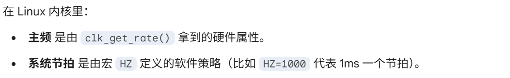
---
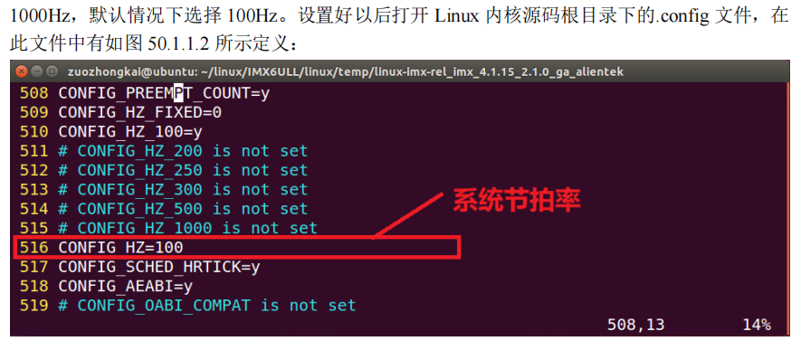
linux内核会在`.config`的配置文件中，指定你要的**系统节拍**，**作用一般有**：
- 任务调度
  - 时间片管理
  - 抢占触发（任务切换）
- 软件时间的度量单位（内核感知时间的最小粒度）
  - Jiffies更新（内核的全局变量，节拍计数）
  - 系统运行时间
- 各种低精度延时/定时
  - 粗略延时：msleep这些
  - 内核定时器
- 统计信息/负载监控
  - CPU负载计算
    - 每个节拍时刻统计cpu运行时间，相当于采样用
  - 资源统计

最终会在`include/asm-generic/param.h`中，调用上面我们定义**需要的节拍频率**


### 系统节拍的高低选择
linux上面选择的系统节拍是100hz,也就是10ms。太小了吧

**高节拍率，低节拍率的优缺点**：
- **高节拍率**
  - 系统时间精度更高
    - 100hz节拍率（systick中断）, 精度10ms, 1000hz就是1ms
  - 中断更加频繁，加剧系统负担。
    - 系统花10倍花销处理中断
    - > 现在处理器很强，1000hz的系统节拍很正常
> Linux 内核使用**全局变量 `jiffies`** 来记录系统**从启动以来的系统节拍数**
>
> 定义在`include/linux/jiffies.h`
> 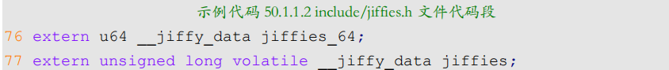
> 一个64位系统的，一个32位系统的
>
> 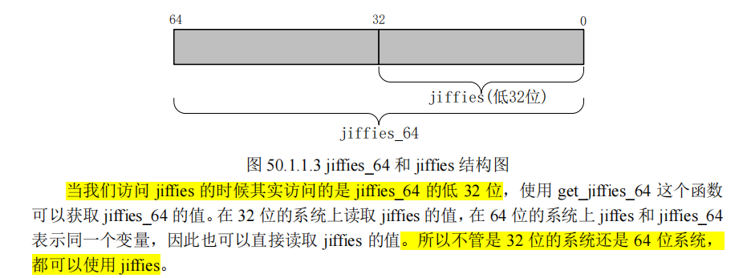
>
> **两个全局变量底层都是一块内存**，可以直接访问。

> **溢出问题**
> - 32 位的 jiffies 只需要 49.7 天就发生了绕回，
> - 64 位的 jiffies 来说大概需要5.8 亿年才能绕回
>
> **所以需要处理32位置的绕回问题**
> 
> 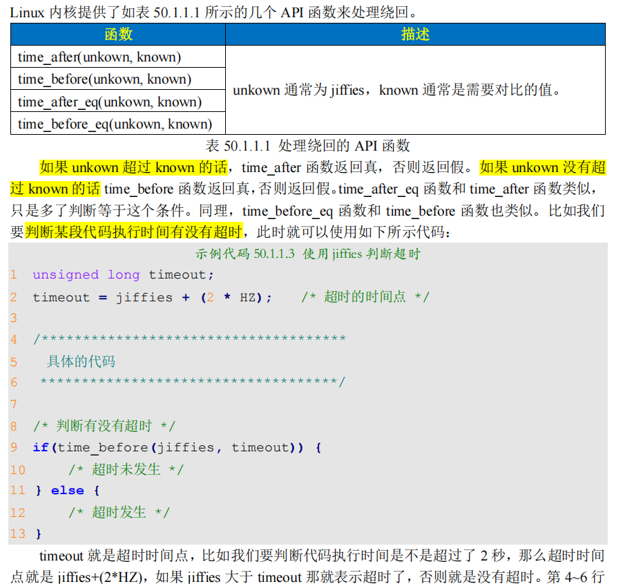
>
> **将系统节拍jiffies 转换成ms时间单位**
> 
> 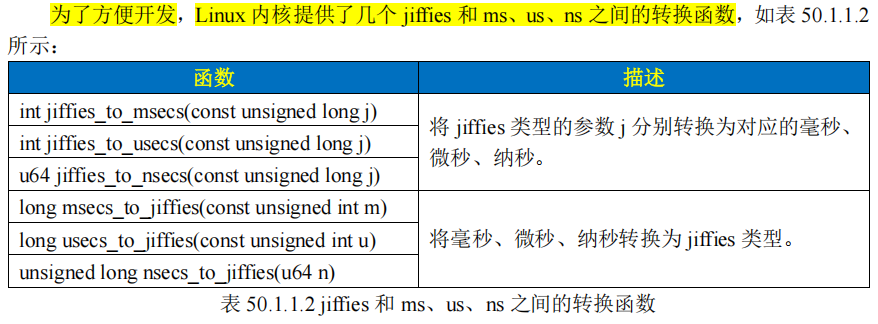
## 内核 定时器（软件定时器）
上面我们
- 讲了基于系统节拍，来讲linux如何利用系统节拍来进行各种定时操作。
- 分析了stm32里面的systick硬件定时器如何提供系统节拍

现在来看看linux内核的定时器。这里说的**Linux 内核定时器**采用**系统时钟**来实现，并**不是**我们在裸机篇中讲解的 PIT 等**硬件定时器**

> 相当于**基于系统节拍**，内核里面实现了一套**通用的 超时判断，和回调的机制**
>
> 只需要提供**超时时间**(相当于`定时值`)和**定时处理函数**即可, 和我们使用硬件定时器的套路一样

**注意**

- 在使用内核定时器的时候要注意一点，内核定时器**并不是周期性运行的**，**超时以后就会自动关闭**
  - 因此如果想要实现**周期性定时**，那么就需要在**定时处理函数中重新开启定时器**

### 使用
linux内核使用timer_list结构体，表示内核定时器。定义在`include/linux/timer.h`中
```c
struct timer_list {
            struct list_head entry;
            unsigned long expires; /* 定时器超时时间，单位是节拍数 */
            struct tvec_base *base;
            void (*function)(unsigned long); /* 定时处理函数 */
            unsigned long data; /* 要传递给 function 函数的参数 */
            int slack;
};
```
**api**：
- init_timer
  - 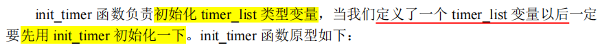
  - 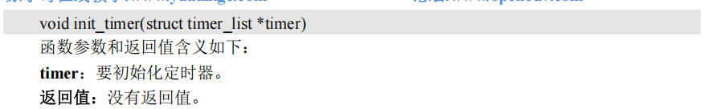
- add_timer
  - 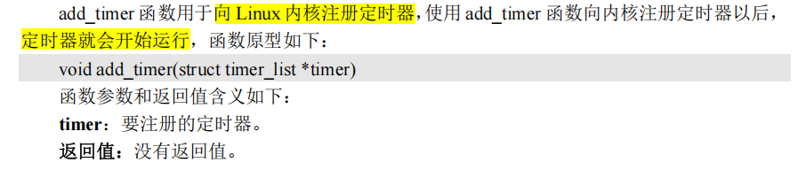
- del_timer
  - 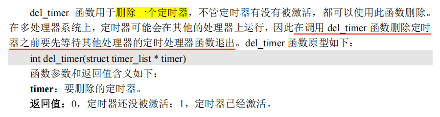
- del_timer_sync
  - 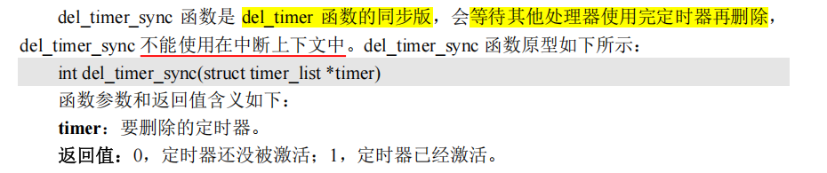
- mod_timer
  - 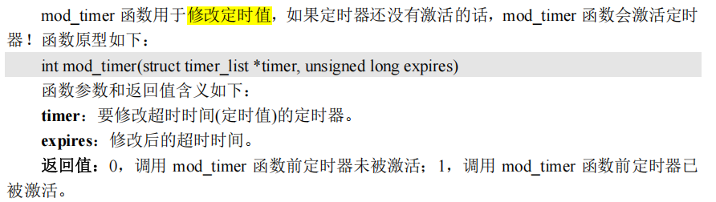


**使用方法**：
```c
struct timer_list timer; /* 定义定时器 */

/* 定时器回调函数 */
void function(unsigned long arg)
{ 
    /* 
    * 定时器处理代码
    */

    /* 如果需要定时器周期性运行的话就使用 mod_timer
    * 函数重新设置超时值并且启动定时器。
    */
    mod_timer(&dev->timertest, jiffies + msecs_to_jiffies(2000));
}

/* 初始化函数 */
void init(void) 
{
    init_timer(&timer); /* 初始化定时器 */

    timer.function = function; /* 设置定时处理函数 */
    timer.expires=jffies + msecs_to_jiffies(2000);/* 超时时间 2 秒 */
    timer.data = (unsigned long)&dev; /* 将设备结构体作为参数 */

    add_timer(&timer); /* 启动定时器 */
}

/* 退出函数 */
void exit(void)
{
    del_timer(&timer); /* 删除定时器 */
    /* 或者使用 */
    del_timer_sync(&timer);
}
```

## 内核短延时函数
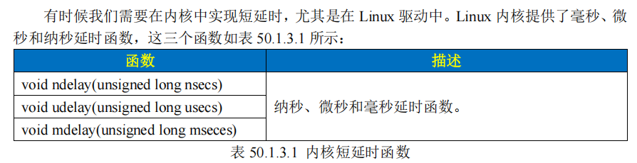

## led闪烁
这个就很简单了，不说了。

这边还是教你内核里面的接口，具体原厂的驱动工程师，应该是要知道linux内核是如何通过读取systick中断来设置我们的系统节拍的。这边相当于驱动里面的应用开发了。