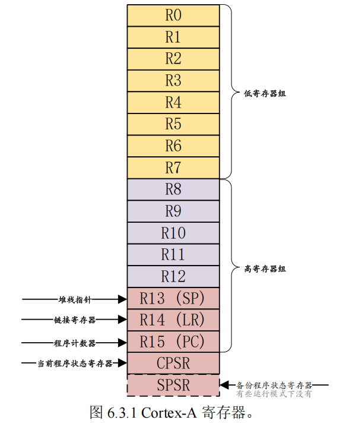
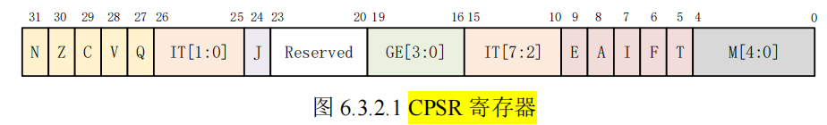
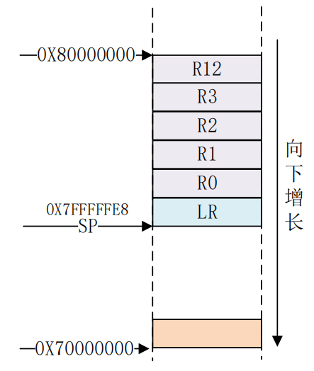

- [imx6ull 基础复盘](#imx6ull-基础复盘)
  - [IMX6ULL 硬件板卡资源](#imx6ull-硬件板卡资源)
  - [单核Cotex-A7，多处理器架构，arm-cortex的关系](#单核cotex-a7多处理器架构arm-cortex的关系)
    - [层级拆解](#层级拆解)
    - [Cortex-A 处理器运行模型](#cortex-a-处理器运行模型)
    - [Cortex-A 寄存器组](#cortex-a-寄存器组)
      - [**1. 对于每个工作模式来说，一共18个寄存器**](#1-对于每个工作模式来说一共18个寄存器)
      - [**2. 核心寄存器的实际对应关系**](#2-核心寄存器的实际对应关系)
  - [汇编基础](#汇编基础)
    - [GNU 汇编语法](#gnu-汇编语法)
      - [1. GNU 汇编的**基础语法**如下：](#1-gnu-汇编的基础语法如下)
      - [2. 用户可以使用`.section` **伪操作**来**定义一个段**](#2-用户可以使用section-伪操作来定义一个段)
      - [3. 汇编系统**预定义了一些段名**](#3-汇编系统预定义了一些段名)
      - [4. 汇编程序的**默认入口标号**是`_start`](#4-汇编程序的默认入口标号是_start)
      - [5. 伪操作](#5-伪操作)
      - [6. 函数](#6-函数)
    - [Cortex-A7 常用汇编指令](#cortex-a7-常用汇编指令)
      - [处理器内部 数据传输指令](#处理器内部-数据传输指令)
      - [存储器访问指令](#存储器访问指令)
      - [压栈和出栈指令](#压栈和出栈指令)
      - [跳转指令](#跳转指令)
      - [算术运算指令 + 逻辑运算指令](#算术运算指令--逻辑运算指令)
  - [启动流程](#启动流程)
    - [启动方式](#启动方式)
    - [镜像制作，代码烧录](#镜像制作代码烧录)
      - [IVT 部分](#ivt-部分)
      - [Boot Data 数据](#boot-data-数据)
      - [DCD 数据](#dcd-数据)
    - [总结](#总结)
    - [内存分布，对比stm32](#内存分布对比stm32)
      - [stm32的启动](#stm32的启动)
        - [疑问1: .data,.bss的拷贝时机](#疑问1-databss的拷贝时机)
  - [汇编led点灯 裸机代码分析](#汇编led点灯-裸机代码分析)
  - [c语言led点灯 裸机代码分析](#c语言led点灯-裸机代码分析)
    - [**A 核裸机栈管理的 “隐形规则”**](#a-核裸机栈管理的-隐形规则)
  - [gpio](#gpio)
  - [中断](#中断)


# imx6ull 基础复盘

这篇文档，主要从裸机，底层寄存器，单片机的角度，重新过一遍imx6ull的armv7架构，基础的汇编语法，基础的代码结构，内存分布，启动流程，中断管理这些。

因为已经学过stm32和freertos了，对CM3的内核的理解比之前更加深了。

为后面移植uboot，kernel，和外设驱动，做一个基础的复盘。

## IMX6ULL 硬件板卡资源


## 单核Cotex-A7，多处理器架构，arm-cortex的关系

之前我们使用的stm32的核心是CM3，单核的。而现在我们使用的这个IMX6的开发板，同样也是单核的，核心是CA7（cotex-A7）, 

下面介绍一下 Cortex-A7 架构的一些基本知识，如处理器模型、Cortex-A7 寄存器组


这个是之前看到的介绍处理器的一张图，但是**当时有些混淆**：

1. cortex xxx 和 armv7, armv8的关系？
2. MPcore和cortex-a7有什么关系？

---

### 层级拆解
   
- `ARMv7` (**架构** = 建筑图纸规范)
  - 这是**一套规范（ISA）**，规定了**寄存器长什么样**、**指令怎么写**、**中断怎么跳**。
  
- `Cortex-A7` (**核** / Core = 具体的单间房型)
  - 这是ARM工程师**根据ARMv7规范**设计出来的**具体电路实现**（流水线、ALU、FPU）。
  - 这才是真正干活的那个“脑子”。


- `Cortex-A7 MPCore` (**处理器子系统 IP** = 户型图/套房)
  - ARM卖给芯片厂（如NXP、ST）的不仅仅是那个“标准卧室”，而是一整套**套房设计方案**。
  - MPCore 的全称是 `Multi-Processor Core`。它是`一个壳子`（或者叫Cluster/簇）。
  - 在这个壳子里，ARM 允许芯片厂塞进去 **1到4个** “Cortex-A7标准卧室”。
  - 除了卧室，这个壳子里还必须打包附送：**SCU (Snoop Control Unit，负责多核间缓存一致性)**、**GIC (中断控制器)**、**L2 Cache控制器**。因为多个核在一起工作，必须有这些管家来协调，否则数据就乱了。


>当你看到 **NXP 的 i.MX6ULL** 手册说它是 **Cortex-A7** 时：
>
>它买了 **ARM 的 Cortex-A7 MPCore 授权**。
>
>但是出于成本和定位考虑，NXP 在设计时，在这个“套房”里**只配置了 1 个核**。
>
>虽然只有1个核，它依然带着 MPCore 的外围电路（比如图中的 SCU 依然存在，只是只服务一个核）。

>当你看到 **树莓派2 (BCM2836)** 也说是 Cortex-A7 时：
>
>它也用了 Cortex-A7 MPCore 方案。
>
>它在套房里塞**满了 4 个核**。

>对比 Cortex-M3
>
> Cortex-M3：通常设计用于简单的单核微控制器。
> 
> ARM 卖给 ST 的时候，基本就是卖那个“核”加上非常简单的调试接口。它**不需要复杂的 SCU（缓存一致性单元）**，因为 **M3 通常不跑多核 SMP（对称多处理**）系统。


理解了这些之后，再回头看一下上面的MPcore的多核配置，就已经很清楚了。


### Cortex-A 处理器运行模型
前面梳理了一下，架构-核心（处理器）-多处理器架构的关系

现在来看看**具体的一个核心**，又有那些东西，也就是我们**A核的运行模型**


以前的 ARM 处理器有 `7 种运行模型`：**User**、FIQ、IRQ、Supervisor(SVC)、Abort、Undef
和 System，其中 `User 是非特权模式`，其余 `6 种都是特权模式`。

- 但新的 Cortex-A 架构加入了**TrustZone 安全扩展**，所以就**新加了一种运行模式**：`Monitor`

- 新的处理器架构还**支持虚拟化扩展**，因此又加入了另一个运行模式：`Hyp`

所以 **Cortex-A7** 处理器**有 9 种处理模式**

- 除了 **User用户模式**以外，**其它 8 种**运行模式都是**特权模式**。
- 这几个运行模式可以通过`软件进行任意切换`，也可以通过**中断**或者**异常**来进行切换

> 用户模式（非特权模式）访问资源受限，所以当要切换模式的时候，应用程序可以产生**异常**，在异常的处理过程中完成处理器模式切换


**每一种模式**都有**一组寄存器**供`异常处理程序`使用，这样的目的是为了保证在进入异常模式以后，用户模式下的寄存器不会被破坏

> **STM32 只有两种运行模式**，特权模式和非特权模式，但是 Cortex-A 就有 9 种运行模式
>
> 我们平常写stm32裸机程序，或者用freertos都是特权模式，都是在**特权级-线程模式**里面
> 
> 当进入中断后，就是运行在**特权级-handler模式**
>
> 但是，当你用freertos-mpu这种要求安全的版本上，就会有**非特权模式**出现


### Cortex-A 寄存器组
上面了解了处理器核心，有哪几种工作模式，其中，user模式是非特权模式，其他的都是特权模式。

下面来看看该核心，使用的寄存器组。

#### **1. 对于每个工作模式来说，一共18个寄存器**


ARM 架构提供了 `16` 个 `32 位`的`通用寄存器(R0~R15)`供软件使用
- 前 15 个(R0~R14)可以用作通用的数据存储，`R15 是程序计数器 PC`，用来保存将要执行的指令。
- ARM 还提供了一个当`前程序状态寄存器 CPSR` 和一个`备份程序状态寄存器 SPSR`，SPSR 寄存器就是 CPSR 寄存器的备份

下图展示了，当核心处于一种工作模式时，所能使用的核心寄存器组，一共18个，可以看到，比较**核心的特殊寄存器**就是：
- SP（栈指针）
- LR（函数调用返回地址）
- PC（程序计数指针）
- CPSR（程序状态，可以控制核心工作模式，中断开关等）
- SPSR（备份程序状态，用于切换工作模式）



#### **2. 核心寄存器的实际对应关系**


> **蓝绿色**是该工作模式**独占**，**浅色**表示**共用一个物理寄存器**。

为了节省资源，肯定不是每种工作模式，都配一组18个的物理寄存器。**肯定有的是可以复用的**。

可以看出：
1. **低寄存器组 R0~R7**是**共享同一组物理**寄存器的
2. **R8-R12**， 除了FIQ有独立的寄存器外，其余的也都是共享一组物理寄存器
3. **SP，LR**，除了sys和hyp模式外，都是独立拥有寄存器（**每个模式有自己的栈指针和返回地址寄存器**
4. **PC**，所有模式共用一个物理寄存器
5. **CPSR**，所有模式共用一个物理寄存器
6. **SPSR**，每个模式都有自己的寄存器，用来保存本模式的当前cpu状态。

---

下面详细说说这些寄存器，**在某些模式下有什么用**，为什么要独占，为什么共享？

1. **R0-R7**，大家都共用。无特殊用途，也叫做**未备份寄存器**
2. **R8-R12**，可以看到只有`FIQ模式`有自己的独占
> `FIQ` 是`快速中断模式`，看名字就是知道这个中断模式`要求快速执行`,让这个模式有独占寄存器，就可以**不用保存恢复现场了**，非常迅速，从而**加速中断的执行过程**

3. **R13，SP**，
   - 基本上每种模式都有一个自己的 R13 物理寄存器，应用程序会初始化 R13，使其指向该模式专用的栈地址，这就是常说的**初始化 SP 指针**
4. **R14** 也称为`连接寄存器(LR)`,**作用有两个**
   1. 每种处理器模式使用 `R14(LR)`来存放当前`子程序的返回地址`，如果使用 `BL` 或者 `BLX`来调用子函数的话，`R14(LR)`被设置成该子函数的`返回地址`，在子函数中，将 `R14(LR)`中的值赋给 `R15(PC)`即可完成子函数返回
   2. 当**异常发生**以后，该异常模式对应的 `R14寄存器`被设置成**该异常模式将要返回的地址**，
   3. R14 也可以当作**普通寄存器**使用
5. **R15**, PC, 大家共用
   - 保存着**当前执行的指令地址**值加 `8 个字节`(**一句指令占4字节** = **地址大小**)，这是因为 ARM的流水线机制导致的
> `R15 (PC)`值 = 当前执行的程序位置 + `8 个字节`

6. **CPSR**, 大家共用，**任何模式下被访问**
   1. 包含了`条件标志位`、`中断禁止位`、当前`处理器模式`标志等一些**状态位**以及一些**控制位**
   
7. **SPSR**
   - 7 个模式每个都配备了一个**专用的物理状态寄存器**，叫做 `SPSR`(备份程序状态寄存器)，当特定的**异常** **中断**发生时，SPSR 寄存器用来**保存当前程序状态寄存器CPSR**的值，当异常退出以后可以用 SPSR 中保存的值来**恢复 CPSR**
   - `User` 和 `Sys` 这两个模式`不是异常模式`，所以`并没有配备 SPSR`



上图，是CPSR的寄存器的内部结构。下面列出比较重要的位

> - **N**(bit31) N=1 表示运算对的结果为**负数**
> - **Z**(bit30) Z=1 表示运算**结果为零**, 对于 `CMP` 指令，Z=1 表示进行比较的两个数大小相等
> - **J**(bit24) 和 **T**(bit5)位一起 表示**当前所使用的指令集**
> - **E**(bit9)：**大小端控制位**，E=1 表示大端模式，E=0 表示小端模式
> - **A**(bit8)：禁止异步中断位，A=1 表示禁止异步中断
> - **I**(bit7)：I=1 禁止 IRQ，I=0 **使能 IRQ**。
> - **F**(bit6)：F=1 禁止 FIQ，F=0 **使能 FIQ**
> - **M**[4:0]：**处理器模式控制位**

可以看到，通过修改CPSR，就可以设置当前**核心的工作模式**，**中断使能**

>以上，就讲解了，**多核架构**，**单核模型**，**寄存器组**。我们**所有的底层**都是围绕这些寄存器来进行的。包括后面的自己手写OS。这里，**就是嵌入式所到达的最底层**，再往下，就是芯片设计了。

## 汇编基础
下面，我们需要掌握汇编语言，因为**汇编**，是**最贴近核心+寄存器底层的语言**

我们只了解一些常用的指令即可

`I.MX6U-ALPHA` 使用的是 NXP 的 `I.MX6UL 芯片`，这是一款 `Cortex-A7` 内核的芯片，所以
我们主要讲的是 `Cortex-A 的汇编指令`

### GNU 汇编语法
当你使用stm32的MDK和IAR里面的汇编，发现里面的语法不一样。

我们要编写的是 `ARM汇编`，编译使用的 `GCC 交叉编译器`，所以我们的**汇编代码**要符合 **GNU 语法**

> **GNU 汇编语法**适用于**所有的架构**，并不是 ARM 独享的

#### 1. GNU 汇编的**基础语法**如下：
```c
label：instruction @ comment
/*
label 即标号，表示地址位置
    1. 指令的地址: 有些指令前面可能会有标号，这样就可以通过这个标号得到指令的地址，
    2. 数据地址: 标号也可以用来表示数据地址。

    注意 label 后面的“：”，任何以“：”结尾的标识符都会被识别为一个标号。

instruction 即指令，也就是汇编指令或伪指令。

@符号，表示后面的是注释，就跟 C 语言里面的“/*”和“*/”一样

*/
```

举例：
```c
add:
MOVS R0, #0X12 @设置 R0=0X12
```

---

#### 2. 用户可以使用`.section` **伪操作**来**定义一个段**
```c
.section .testsection @定义一个 testsetcion 段
/*
每个段以段名开始，以下一段名或者文件结尾结束
*/
```
举例：
```c
.section .test

.test:
    ldr r0, =0x12 @r0=0x12
    ldr r0, =0x12 @r0=0x12  //这里的两句指令就是一个段
.xxx:
    xxx
```
---

#### 3. 汇编系统**预定义了一些段名**

- .text 表示代码段
- .rodata 只读数据段
- .data 初始化的数据段
- .bss 未初始化的数据段

---

#### 4. 汇编程序的**默认入口标号**是`_start`
```c
.global _start 

_start:
    ldr r0, =0x12 @r0=0x12
```

> 我们也可以不用在代码里面用_start来指定程序的入口，也可以在**链接脚本**`lds`中使用 `ENTRY` 来指明其它的入口点

---

#### 5. 伪操作
```c
.byte   //定义单字节数据，比如.byte 0x12。
.short  //定义双字节数据，比如.short 0x1234。
.long   //定义一个 4 字节数据，比如.long 0x12345678。
.equ    //赋值语句，格式为：.equ 变量名，表达式，比如.equ num, 0x12，表示 num=0x12。
.align  //数据字节对齐，比如：.align 4 表示 4 字节对齐。
.end    //表示源文件结束。
.global //定义一个全局符号，格式为：.global symbol，比如：.global _start。
```

---

#### 6. 函数

```c
函数名:
    函数体
    返回语句
```
举例：
```c
/* 未定义中断 */
Undefined_Handler:
    ldr r0, =Undefined_Handler
    bx r0                               //“bx”指令是返回指令，函数返回语句不是必须的
```


### Cortex-A7 常用汇编指令
这里的指令，就是上面GNU汇编语法里面的`instruction`部分了

#### 处理器内部 数据传输指令
主要是：
- MOV（`<-`）
  - 将数据从一个寄存器拷贝到另外一个寄存器 
  - 将一个立即数传递到寄存器里面
- MRS（`<-`）
  - 读**特殊寄存器**(如 CPSR 和 SPSR)
- MSR（`<-`）
  - 写**特殊寄存器**(如 CPSR 和 SPSR)
```c
MOV R0，R1              //将寄存器 R1 中的数据传递给 R0，即 R0=R1
MOV R0, #0X12           //将立即数 0X12 传递给 R0 寄存器，即 R0=0X12

MRS R0, CPSR            //将特殊寄存器 CPSR 里面的数据传递给 R0，即 R0=CPSR

MSR CPSR, R0            //将 R0 中的数据复制到 CPSR 中，即 CPSR=R0
```

#### 存储器访问指令

ARM **不能直接访问存储器，比如 RAM 中的数据**

> 记住，核心能够直接访问的，只有自己的内核寄存器，访问RAM，要用存储器访问指令。常用的存储器访问指令有两种：
- LDR（`<-`）
- STR（`->`）

```c
LDR Rd, [Rn , #offset]              //从存储器 Rn+offset 的位置读取数据存放到 Rd 中。

    LDR R0, =0X0209C004             //将寄存器地址 0X0209C004 加载到 R0 中，即 R0=0X0209C004
    LDR R1, [R0]                    //读取地址 0X0209C004 中的数据到 R1 寄存器中

STR Rd, [Rn, #offset]               //将 Rd 中的数据写入到存储器中的 Rn+offset 位置。

    STR R1, [R0]                    //将 R1 中的值写入到 R0 中所保存的地址中
```

LDR 和 STR 都是按照`字`(**4byte**)进行读取和写入的，也就是操作的 `32 位数据`

如果要按照`字节`(**1byte**)、`半字`(**2byte**)进行操作的话可以在指令“LDR”后面加上 `B` 或 `H`

- 按**字节**操作的指令就是 `LDRB` 和`STRB`，
- 按**半字**操作的指令就是 `LDRH` 和 `STRH`

#### 压栈和出栈指令

A函数跳转到B函数，需要保存当前处理器状态(就是保存 `R0~R15` 这些寄存器值)
> 只涉及函数跳转，所以是16个寄存器，包括SP，LR，PC.
> 
> CPSR的保存发生在模式切换，且保存到SPSR内

当 `B 函数执行完成`以后再用前面保存的寄存器值恢复`R0~R15` 即可。**保存 R0~R15** 寄存器的操作就叫做**现场保护**，**恢复 R0~R15** 寄存器的操作就叫做
**恢复现场**

在进行**现场保护**的时候需要进行`压栈`(入栈)操作，**恢复现场**就要进行`出栈`操作
>也就是说，这个现场，具体要**保存在内存里面**，这里的内存就是**SP指针指向的栈空间**

- **压栈**的指令为 `PUSH`(`<-`) (从右往左，依次入栈)
- **出栈**的指令为 `POP`(`->`) (从左往右，依次出栈)

> 他们利用**当前的栈指针 SP**来**生成地址**

```c
PUSH <reg list>         //将寄存器列表存入栈中

    PUSH {R0~R3, R12}   //将 R0~R3 和 R12 压栈


POP <reg list>          //从栈中恢复寄存器列表。

    POP {R0~R3,R12}     //在恢复 R0~R3,R12
```

>栈空间的内存模型，一次压入一个寄存器，32位，4字节。
>
>


#### 跳转指令
指令跳转：
- B（直接跳转，不返回）
- BL（直接跳转，返回）
- BX（间接跳转，不返回）
- BLX（间接跳转，返回）
> L表示LR，表示记录下返回的地址
> 
> X表示寄存器，表示跳转地址记录在寄存器里面
>
> 这些跳转指令，**后面接label**，也就是地址/指令的别名，比如`main`, `reset_handler`

当然还有**直接跳转**：**直接向 PC 寄存器里面写入数据**


#### 算术运算指令 + 逻辑运算指令
这些都是加减法的运算指令，比如
- ADD
- SUB
等等，都是（`<-`）

- AND
- ORR
- BIC
- ORN
- EOR
都是（`<-`）

## 启动流程

上面，分析了处理器单核的运行模型，了解了配套的18个寄存器，然后补了一下GNU汇编基础。

下面，来分析一下，imx6ull的启动方式，看看裸机代码是如何跑起来的。

### 启动方式
首先，了解一下，imx6ull这块开发板支持的启动方式：
1. FUSE启动
2. **串行下载**
   1. 通过otg1/uart 烧录到外部ROM里面，一般最终量产用
3. **内部boot模式**
   1. 芯片上电执行内部bootROM代码，进行硬件初始化
      1. `初始化时钟`
         1. 内核时钟ARM PLL 396Mhz
         2. System PLL 528Mhz
         3. USB PLL 480Mhz
         4. AHB 132Mhz
         5. IPG 66Mh
      2. `打开MMU和cache`，加快执行速度（下载镜像，验证镜像，完成后关闭）
      3. `中断向量偏移`设置到bootROM的起始位置，启动用户代码后，重新设置中断向量偏移(用户代码开始的地方)
   2. bootROM从boot设备(emmc,sd卡)拷贝到RAM中(ddr)
   - 通过拨码(**硬件gpio选择**)，可以**选择具体的启动设备**（emmc,sd,eeprom,nandflash）

### 镜像制作，代码烧录
我们自己编写了一个裸机的代码(`start.S + main.c`)

然后我们肯定会通过交叉编译工具，来编译出我们自己的`bin`文件。
1. xxx-gcc  .s/.c -> .o
2. xxx-ld  .o -> .elf (包含了运行地址:0x8780 0000)
3. xxx-copy  .elf -> bin (转换二进制格式)

之后，会用imxdownload来为我们的逻辑，添加一些头

4. imxdownload      .bin -> .imx = (IVT+BD+DCD+.bin)

>学习 `STM32` 的时候我们可以直接将编译生成的`.bin` 文件烧写到 STM32 `内部 flash` 里面,
> 
>  I.MX6U 不能直接烧写编译生成的.bin 文件

新增的头包括：
1. `IVT`： Image vector table，IVT 里面包含了一系列的**地址信息**，这些地址信息在ROM 中按照固定的地址存放着
2. `Boot data`，启动数据，包含了`镜像要拷贝到哪个地址`(运行地址)，拷贝的大小是多少等等
3. `Device configuration data`，简称 DCD，设备配置信息，重点是 `DDR3 的初始化配置`

内部 `BootROM` 会将 `load.imx` **拷贝到 DDR 中**，`用户代码(.bin)`是要一定要从 `0X8780 0000` 这个地方开始的
> DDR的地址范围为 0x80000000-xxxxxxxx

因为**链接地址**为 `0X87800000`，`load.imx` 在用户代码前面又有 `3KByte` 的 `IVT+Boot Data+DCD` 数据，下面会讲为什么是 3KByte，因此 load.imx 在 DDR 中的起始地址就是 `0X8780 0000-3072`=`0X877F F400`

> 前面这`3K`字节的头（IVT这些），是给bootROM看的。(**有3千个字节，还是很多的**。)

以上，我们已经知道了，镜像的内部结构，以及镜像在运行地址的分布情况。下面，具体分析一下这些头的作用

#### IVT 部分
IVT 包含了：
- 镜像程序的入口点
- 指向 DCD 的指针
- 一些用作其它用途的指针。

>`bootROM` 要求 `IVT` 应该放到**指定的位置**，**不同的启动设备位置不同**，而 IVT 在整个 load.imx 的最前面，其实就**相当于要求 load.imx 在烧写的时候应该烧写到存储设备的指定位置去**。整个位置都是**相对于存储设备的起始地址的偏移**
>
> 
>
> (**加载地址计算**) 以 `SD/EMMC` 为例，IVT 偏移为 `1Kbyte`，IVT+Boot data+DCD 的总大小为 4KByte-
1KByte=3KByte。假如 SD/EMMC `每个扇区为 512 字节`，那么 load.imx 应该从第三个扇区开始
烧写，**前两个扇区要留出来**，这样，这个才算一个合格的imx镜像，**bootrom才愿意去读取**

下面来看一下，**IVT内部的具体内容**，因为这三个头，一共占3k字节。具体内容如下：
> 这里要**事先说明**，我们在编译链接阶段里面，让bin有地址信息，但是`bootROM`,是无法解析bin文件的，所以对bootROM来说，bin就是一串要拷贝的数据。
>
> 你用 `arm-linux-gnueabihf-objcopy` 将 .elf 转换成 .bin 烧录到 SD 卡时，`ELF` 里的`符号表`、`链接地址（0x87800000）`等所有`元数据`都被彻底丢弃了。SD 卡里躺着的只是纯粹的`机器指令`
>
> 既然 .bin 自己不带说明书，**NXP 就设计了 IVT 这个强制规范**。你必须在二进制最开头显式告诉**硬件瞎子**：“搬完代码后，PC 指针去 0x87800000 执行”。
**IVT**
1. **header** (`BootROM 靠它来识别这块数据是不是合法的 IVT`)
   1. 0xD1
   2. IVT的长度
   3. version
2. **入口地址**：
   1. 程序入口**绝对地址**（`DDR地址`）。BootROM 把你的代码搬运完毕后，PC 指针跳转去执行的第一个指令地址（通常就是你 start.S 中 _start 的**链接物理地址**,`0x87800000`）
> entry (入口地址)：`0X8780 0000`，也就是代码镜像第一行指令链接的位置。
3. **dcd**：
   1. 设备配置数据（DCD）**绝对地址**（`DDR地址`），让 BootROM 在跳转执行你的代码前帮你初始化 DDR 等核心外设，这样你的程序一启动就能直接跑在 DDR 里
>dcd (DCD 地址)：`0X877F F42C`
4. **boot data**：Boot Data **绝对地址**（`DDR地址`）。包含镜像的整体搬运信息（要把整个固件搬运到内存的哪个源地址、目标地址，以及固件总长度）
> boot data (Bd 地址)：`0X877F F420`

5. **self：IVT 本身的绝对地址**（`DDR地址`）。供 BootROM 内部做基址偏移计算用。

> self (IVT 地址)：`0X877F F400`，表中明确标注这是“IVT 复制到 DDR 中以后的首地址”。

---

> **这些地址是怎么被 imxdownload 算出来的**？
> 
> 它是以你给定的`链接地址`（0x87800000）为基准，逆向推导出来的：
> 
> **确定 IVT 首地址(self)**：已知镜像代码起始地址是 0X87800000，而前面预留给 IVT + Boot Data + DCD 的空间刚好是 `3KByte (0xC00)`，所以 IVT 的首地址 self 就是 0X87800000 - 0xC00 = `0X877FF400`。
> 
> **确定 DCD 地址**：已知 `IVT 的首地址`是 0X877FF400，而通过查表得知 DCD 数据相对首地址的偏移量是 0X2C，所以 dcd 的绝对地址就是 0X877FF400 + 0X2C = 0X877FF42C。
> 
> **确定 Boot Data 搬运地址**：因为 i.MX6ULL 从 SD 卡启动时，硬件要求镜像前面必须空出 1KByte (0x400) 的偏移量。所以整个 load.imx 最终在 DDR 里的总起始地址 start 是 0X877FF400 - 0x400 = 0X877FF000。


---

> 解开最大的悖论：**DDR 还没初始化，BootROM 怎么去 DDR 读 DCD**？
> 
> 这正是 NXP 硬件设计的精妙之处，也是我之前表述偏颇的地方。实际的启动搬运过程分为两步：
> 
> **第一步（临时解析配置）**：上电时，BootROM 确实无法访问 DDR。它会先把 SD 卡最前面这几 KB（包含 `IVT` 和` DCD`）读取到芯片`内部的 SRAM (OCRAM)` 中。BootROM 在内部 SRAM 里解析并执行这部分 DCD 数据，从而把外部 DDR 的时序、引脚等全部初始化完毕。
> 
> **第二步（整体搬运到目的地）**：DDR 初始化成功可用后，BootROM 才会去读取 `Boot Data` 里的指令。此时，它按照 start = 0X877FF000 和设定的长度 length = 0X00200000 (2MByte)，将 SD 卡上的整个镜像（包括那个 1KB 空白、IVT、DCD 以及你的 LED 代码），完整地搬运到 DDR 的目标地址中。


#### Boot Data 数据

这个里面就是所谓的，整个imx镜像文件，的源地址（外部ROM），目的地址（DDR），拷贝大小。

这个不用多说了。给bootROM看的，用来拷贝用。


#### DCD 数据
这个里面，也是给bootROM看的，用来初始化ddr。

复位以后，I.MX6U 片内的**所有寄存器都会复位为默认值**，但是这些默认值往往不是我们
想要的值，而且有些外设我们必须在使用之前初始化它。

为此 I.MX6U 提出了一个 `DCD(Device Config Data)`的概念

`DCD` 其实就是 I.MX6U `寄存器地址`和`对应的配置`信息集合，Boot ROM 会使用这些寄存器地址和配置集合来**初始化相应的寄存器**，比如`开启某些外设的时钟`、`初始化 DDR `等等

> DCD 区域不能超过 1768Byte

我们的imxdownload里面，对dcd的内容有：
1. 设置 CCGR0~CCGR6 这 7 个外设时钟使能寄存器，默认打开所有的外设时钟。
2. 配置 DDR3 所用的所有 IO。
3. 配置 MMDC 控制器，初始化 DDR3。


### 总结
```c
// 这是我对豆包的描述
我理解的imx6ull的启动：初始上电后，pc指针先指向内部rom，里面是bootrom程序，他会先把外部rom的ivt，bootdata，dcd，这三块拷贝到内部ram中，然后开始读取这个镜像头，从bd里面得知了，整个景象的源地址（外部rom），目的地址（ddr），拷贝大小，从ivt里面得知了ivt，dcd，bd，和用户程序最终在外部ram，ddr中的位置。从dcd里面得知初始化ddr的配置信息，

接下来bootRom要开始做的事情是，按照dcd的内容，初始化ddr，然后按照bd的内容把我们整个imx的景象拷贝到ddr的位置（保证用户代码bin的开头处于0x87800000），接下来就是pc指针跳转到87800000开始执行我们的用户代码


我们的用户代码，里面会做设置核心的状态啊，初始化sp指针准备c环境，然后跳转c的世界，然后在c的世界里面，做一些时钟的初始化啊，外设的初始化之类的。是这样吗
```

**你的理解总结**（我先复述一遍，确保我没听错）
- i.MX6ULL 上电 → PC 指向芯片`内部 BootROM`（出厂固化，不可改）
- BootROM 先从外部 Flash（SPI/NAND/SD 等） 读取：
  - IVT
  - Boot Data
  - DCD
> 把这头信息读到`内部 RAM`
- 解析：
  - IVT：告诉 BootROM 各种表、程序的地址
  - DCD：DDR 初始化参数
  - Boot Data：告诉从哪拷贝、拷到 DDR 哪里、拷多大
- `BootROM` 做：
  - 用 `DCD` 初始化 DDR
  - 按 `BootData` 把整个镜像搬到 DDR（你说的 0x87800000）
- 然后 PC 跳 `0x87800000` 执行用户代码
- 用户代码里：
  - 设 CPU 状态
  - 初始化 SP，准备 C 环境
  - 跳 C 入口
  - C 里初始化时钟、外设…


**流程图**：
```c
上电复位
   |
   v
[PC = 芯片内部 BootROM 地址]  <-- 出厂固化，不可改
   |
   |--- 1. 读取启动引脚 BOOT_CFG
   |        决定从哪里读镜像：SD / NAND / SPI Nor / 等
   |
   v
[从外部ROM(Flash/SD) 读取头部]
   |
   |--- 只读一小段：IVT + DCD + Boot Data
   |--- 拷贝到 【芯片内部 RAM (OCRAM)】
   |
   v
[解析头部]
   |
   |--- IVT:      入口地址、各类表的指针
   |--- DCD:      DDR 初始化参数
   |--- BootData: 源地址、目的地址、拷贝长度
   |
   v
[执行 DCD，初始化 DDR]
   |
   |--- DDR 此时才被点亮！
   |--- 之前只能用内部 RAM
   |
   v
[根据 BootData 搬运整个镜像]
   |
   |--- 从外部ROM → 搬到 DDR 中
   |--- 通常目的地址：0x87800000
   |
   v
[跳转到 IVT 中指定的入口地址]
   |
   |--- 通常就是 0x87800000
   |--- 进入用户写的程序
   |
   v
[用户启动代码（你的 start.S）]
   |
   |--- 关看门狗
   |--- 设置 CPU 模式、栈指针 SP
   |--- 初始化 .data / .bss
   |--- 准备好 C 语言运行环境
   |
   v
[跳转到 C 入口：main / board_init]
   |
   |--- 时钟初始化
   |--- 外设初始化
   |--- 业务逻辑
   |
   v
正常运行
```

> 注意，我们的链接地址`0x87800000`这个**不是固定的**，是我们的**lds链接脚本**决定的。然后imxdownload会根据这个来生成我们的IVT，指向lds里面设置的链接地址。

```c
1. 你写 .lds 链接脚本
   ↓（指定运行地址 = DDR 里的地址，比如 0x87800000）

   //. = 0x87800000;   // 这样即可。

2. 编译出来的 elf → bin
   ↓（bin 里第一条指令的地址就是 0x87800000）

3. 运行 imxdownload 烧录
   ↓（工具会读取你的 bin 文件第一条指令地址）

4. imxdownload **自动生成 IVT**
   ↓（把 IVT 里的 entry 字段填成 0x87800000）

5. 烧录到 SD 卡
   ↓

6. 上电
   BootROM 读 IVT → 知道要跳去 0x87800000
```


### 内存分布，对比stm32

我们先复习一下stm32的启动前后，内存的分布情况。由于stm32f103只有内部ram, 内部rom

#### stm32的启动
**1. 基础地址（STM32F103ZE）**

- **内部 Flash (ROM)**：`0x0800 0000` ~ `0x0807 FFFF`（512KB）
- **内部 SRAM (RAM)**：`0x2000 0000` ~ `0x2000 FFFF`（64KB）
- **向量表**：固定放在 `Flash` 起始
- **start.s**：做的核心事：初始化栈、拷贝.data、清零.bss

**2. 上电瞬间，（刚复位，还没有执行start.s）**
```c
//内部rom flash
0x08000000  +-----------------------+
            |   栈顶地址(MSP)       |  <-- 复位硬件自动加载到SP
            +-----------------------+
            |   复位向量(Reset_Handler) |  <-- 硬件自动PC跳这里
            +-----------------------+
            |   其他中断向量表       |
            +-----------------------+
            |   startup_stm32f10x.s |  <-- start.s 代码
            +-----------------------+
            |   .text 程序代码       |
            +-----------------------+
            |   .rodata 常量        |
            +-----------------------+
            |   .data 初始化数据(初值) |  <-- 存在Flash里
            +-----------------------+
            |   (Flash剩余空间)      |
0x0807FFFF  +-----------------------+


//内部ram
0x2000FFFF  +-----------------------+
            |      (未定义垃圾值)    |
            |                       |
            |      全是随机数        |
            |                       |
0x20000000  +-----------------------+
```


**3. 执行 start.s 过程中（关键三步）**
- 设置**栈指针 SP** = 0x2000FFFF（或稍小）
- 从 Flash 拷贝 `.data` 到 `RAM`
- `RAM` 中 `.bss` 段清零


**4. start.s 执行完成后（进入 main 前）**
```c
//内部rom flash
0x08000000  +-----------------------+
            |   栈顶地址             |
            +-----------------------+
            |   复位向量             |
            +-----------------------+
            |   中断向量表           |
            +-----------------------+
            |   start.s 代码         |
            +-----------------------+
            |   .text / .rodata     |
            +-----------------------+
            |   .data 源数据(Flash)  |
            +-----------------------+
0x0807FFFF  +-----------------------+


//内部ram
0x2000FFFF  +-----------------------+
            |       栈 (Stack)       | <-- SP指向这里
            |       (向下生长)       |
            +-----------------------+
            |                       |
            |   动态内存/堆(可选)    |
            |                       |
            +-----------------------+
            |       .data 段        | <-- 从Flash拷贝过来：有初值的全局/静态变量
            +-----------------------+
            |       .bss 段         | <-- 已被start.s清零：全局/静态未初始化变量
            +-----------------------+
0x20000000  +-----------------------+
```

##### 疑问1: .data,.bss的拷贝时机
我已经知道了，上电开始执行，CM3读取`0x0800 0000`的4字节地址，作为`SP`指针，然后，读取`0x0800 0004`的4字节地址，作为`PC`指针。

我知道这个是硬件自动执行的。我很好奇，这个RAM里面的`.data`, `.bss`这个是什么时候干的？是硬件自动执行的吗？我知道在写程序的时候，MDK里面会有ld链接脚本，规划好了栈空间在RAM的末尾，然后.data， .bss在RAM的低地址。但是，我很好奇，这个是什么时机开始弄得？

> 就是说，栈空间，我们在链接脚本lds里面，已经规划好了，放到RAM的最后，SP指针，硬件自动设置了。但是**开头的.data, .bss是在什么时候拷贝过来的**？

首先说明，.data, .bss不是硬件自动执行的。因为**这也是c语言的执行环境的一部分**，所以需要软件设置，

所以在**start.s中设置**。

他的具体操作为：
```c
Reset_Handler:
    /* 1. 从Flash拷贝 .data 到 RAM */
    ldr r0, =_sidata   @ Flash中.data的源地址（链接脚本定义）
    ldr r1, =_sdata    @ RAM中.data的目标起始
    ldr r2, =_edata    @ RAM中.data的目标结束
copy_data:
    ldr r3, [r0], #4
    str r3, [r1], #4
    cmp r1, r2
    bne copy_data

    /* 2. 清零 .bss 段 */
    ldr r0, =_sbss     @ RAM中.bss的起始
    ldr r1, =_ebss     @ RAM中.bss的结束
    mov r2, #0         @ 要写入的0
clear_bss:
    str r2, [r0], #4
    cmp r0, r1
    bne clear_bss

    /* 3. 跳转到C语言入口main */
    b main
```

你看，这就是你 “没看见” 的那部分代码：
- .data：是从 Flash 里的 “备份” 拷贝到 RAM 里的
- .bss：是在 RAM 里把一段空间全部写 0


**链接脚本（.ld/MDK 里的设置）又起什么作用?**

链接脚本的作用是 **“规划”**，而不是 “执行”：
- 它告诉编译器：
  - `.text`（代码）放在 Flash 哪里
  - `.data`（有初值的全局变量）在 Flash 里的备份位置，以及在 RAM 里的运行位置
  - `.bss`（无初值的全局变量）在 RAM 里的位置
  - `栈顶`（_estack）放在 RAM 的末尾
- 它会生成一些符号，比如 `_sidata`, `_sdata`,` _edata`, `_sbss`, `_ebss`, `_estack`，这些符号就是上面 start.S 里用到的地址。

**所以整个流程是**：

1. `链接脚本`：画好地图（内存布局）
2. `硬件`：只负责把 PC 和 SP 指向地图的入口
3. `start.S`：拿着地图，一步一步把东西搬到正确的地方

**那为什么stm32的start.s中没有看到实际拷贝.data, .bss的部分**？

下面是stm32的demo的start.s中的PC执行的部分，没有拷贝的指令，但是实际上是拷贝了。
```c
Reset_Handler   PROC
    EXPORT  Reset_Handler             [WEAK]
    IMPORT  __main          ; 重点：导入了__main（不是你写的main！）
    IMPORT  SystemInit
    LDR     R0, =SystemInit
    BLX     R0               ; 第一步：初始化系统时钟
    LDR     R0, =__main      ; 第二步：跳转到__main
    BX      R0
    ENDP
```

**原因**：

`__main` 是 ARM 编译器（ARMCC）提供的`C 库启动函数`，它藏在编译器的`运行时库（RTL）`里，你看不到源码

**实际流程**：


```c
Reset_Handler → SystemInit → __main → 你的main()
                 ↑            ↑
                 时钟初始化    核心操作：
                             1. 拷贝.data段（Flash→RAM）
                             2. 清零.bss段（RAM写0）
                             3. 初始化堆（Heap）
                             4. 最终跳转到你的main()
```


>简单说：MDK 把 “拷贝.data/ 清零.bss” 这些脏活，都**封装到了 __main 里**，所以你在 start.s 里看不到，但它确实执行了。


## 汇编led点灯 裸机代码分析
下面分析一下，汇编版本的led点灯代码

Makefile
```c
led.bin:led.s
	arm-linux-gnueabihf-gcc -g -c led.s -o led.o
	arm-linux-gnueabihf-ld -Ttext 0X87800000 led.o -o led.elf
	arm-linux-gnueabihf-objcopy -O binary -S -g led.elf led.bin
	arm-linux-gnueabihf-objdump -D led.elf > led.dis
clean:
	rm -rf *.o led.bin led.elf led.dis
```

led.s
```c
/**************************************************************
Copyright © zuozhongkai Co., Ltd. 1998-2019. All rights reserved.
文件名	: 	 mian.c
作者	   : 左忠凯
版本	   : V1.0
描述	   : 裸机实验1 汇编点灯
			 使用汇编来点亮开发板上的LED灯，学习和掌握如何用汇编语言来
			 完成对I.MX6U处理器的GPIO初始化和控制。
其他	   : 无
论坛 	   : www.wtmembed.com
日志	   : 初版V1.0 2019/1/3 左忠凯创建
**************************************************************/

.global _start  /* 全局标号 */

/*
 * 描述：	_start函数，程序从此函数开始执行此函数完成时钟使能、
 *		  GPIO初始化、最终控制GPIO输出低电平来点亮LED灯。
 */
_start:
	/* 例程代码 */
	/* 1、使能所有时钟 */
	ldr r0, =0X020C4068 	/* CCGR0 */
	ldr r1, =0XFFFFFFFF  
	str r1, [r0]		
	
	ldr r0, =0X020C406C  	/* CCGR1 */
	str r1, [r0]

	ldr r0, =0X020C4070  	/* CCGR2 */
	str r1, [r0]
	
	ldr r0, =0X020C4074  	/* CCGR3 */
	str r1, [r0]
	
	ldr r0, =0X020C4078  	/* CCGR4 */
	str r1, [r0]
	
	ldr r0, =0X020C407C  	/* CCGR5 */
	str r1, [r0]
	
	ldr r0, =0X020C4080  	/* CCGR6 */
	str r1, [r0]
	

	/* 2、设置GPIO1_IO03复用为GPIO1_IO03 */
	ldr r0, =0X020E0068	/* 将寄存器SW_MUX_GPIO1_IO03_BASE加载到r0中 */
	ldr r1, =0X5		/* 设置寄存器SW_MUX_GPIO1_IO03_BASE的MUX_MODE为5 */
	str r1,[r0]

	/* 3、配置GPIO1_IO03的IO属性	
	 *bit 16:0 HYS关闭
	 *bit [15:14]: 00 默认下拉
     *bit [13]: 0 kepper功能
     *bit [12]: 1 pull/keeper使能
     *bit [11]: 0 关闭开路输出
     *bit [7:6]: 10 速度100Mhz
     *bit [5:3]: 110 R0/6驱动能力
     *bit [0]: 0 低转换率
     */
    ldr r0, =0X020E02F4	/*寄存器SW_PAD_GPIO1_IO03_BASE */
    ldr r1, =0X10B0
    str r1,[r0]

	/* 4、设置GPIO1_IO03为输出 */
    ldr r0, =0X0209C004	/*寄存器GPIO1_GDIR */
    ldr r1, =0X0000008		
    str r1,[r0]

	/* 5、打开LED0
	 * 设置GPIO1_IO03输出低电平
	 */
	ldr r0, =0X0209C000	/*寄存器GPIO1_DR */
   ldr r1, =0		
   str r1,[r0]

/*
 * 描述：	loop死循环
 */
loop:
	b loop 				
```

这个就是非常简单的一个汇编代码，所以也不需要c语言的环境

实际内存分变化：

**1. 上电前（仅外部 ROM 有数据，DDR 空）**
```c
┌─────────────────────────────────┐  外部ROM (SD卡)
│ 0x00000000 ~ 0x0000xxxx         │  ← imxdownload烧录的内容：
│  ┌─────────────┐                │     IVT + DCD + BootData + 你的汇编指令
│  │ IVT         │                │     （IVT里entry=0X87800000）
│  │ DCD         │                │
│  │ BootData    │                │
│  │ 汇编指令    │                │
│  └─────────────┘                │
│  剩余空间：空                   │
└─────────────────────────────────┘

┌─────────────────────────────────┐  DDR (0X80000000 ~ 0X9FFFFFFF)
│ 0X87800000 ~ 0X8780xxxx         │  ← 全是随机垃圾值（未初始化）
│  全未使用，无有效数据           │
│  剩余空间：空                   │
└─────────────────────────────────┘
```


**2. 上电后（BootROM 完成搬运，DDR 有指令）**
```c
┌─────────────────────────────────┐  外部ROM (SD卡)
│ 0x00000000 ~ 0x0000xxxx         │  ← 内容不变（只读）
│  ┌─────────────┐                │
│  │ IVT         │                │
│  │ DCD         │                │
│  │ BootData    │                │
│  │ 汇编指令    │                │
│  └─────────────┘                │
└─────────────────────────────────┘

┌─────────────────────────────────┐  DDR (核心变化！)
│ 0X87800000 ~ 0X8780xxxx         │  ← BootROM搬运过来的汇编指令
│  ┌─────────────────────────┐    │
│  │ _start:                 │    │  ← 第一条指令地址（0X87800000）
│  │   ldr r0, =0X020C4068   │    │
│  │   ldr r1, =0XFFFFFFFF   │    │
│  │   ...（时钟/IO配置指令）│    │
│  │ loop:                   │    │
│  │   b loop                │    │
│  └─────────────────────────┘    │
│  剩余空间：空                   │
└─────────────────────────────────┘
```

**3. 最终执行阶段（PC 跳转到 DDR 执行）**
```c
┌─────────────────────────────────┐  DDR
│ 0X87800000                      │  ← PC指针指向这里，开始执行指令
│  ┌─────────────────────────┐    │
│  │ 执行：使能所有时钟       │    │
│  │ 执行：配置GPIO1_IO03复用 │    │
│  │ 执行：配置IO属性         │    │
│  │ 执行：设置GPIO为输出     │    │
│  │ 执行：GPIO输出低电平（点灯）│
│  │ 执行：b loop（死循环）   │    │
│  └─────────────────────────┘    │
└─────────────────────────────────┘
```
> **代码特性**：**这段汇编只有指令（.text 段）**，没有定义任何全局变量、静态变量，自然不需要.data（存初始化值）和.bss（存未初始化值）；
>
> **启动简化**：因为没有.data/.bss，你的汇编代码里也不需要像 STM32 那样做 “拷贝 / 清零” 操作，_start 直接开始配置硬件 —— 这是裸机汇编最简洁的优势


## c语言led点灯 裸机代码分析


下面看看c语言版本的逻辑代码

**Makefile**
```c
objs := start.o main.o

ledc.bin:$(objs)
	arm-linux-gnueabihf-ld -Timx6ul.lds -o ledc.elf $^
	arm-linux-gnueabihf-objcopy -O binary -S ledc.elf $@
	arm-linux-gnueabihf-objdump -D -m arm ledc.elf > ledc.dis
	
%.o:%.s
	arm-linux-gnueabihf-gcc -Wall -nostdlib -c -O2 -o $@ $<
	
%.o:%.S
	arm-linux-gnueabihf-gcc -Wall -nostdlib -c -O2 -o $@ $<
	
%.o:%.c
	arm-linux-gnueabihf-gcc -Wall -nostdlib -c -O2 -o $@ $<
	
clean:
	rm -rf *.o ledc.bin ledc.elf ledc.dis
```

**lds链接脚本**
```c
SECTIONS{
	. = 0X87800000;
	.text :
	{
		start.o 
		main.o 
		*(.text)
	}
	.rodata ALIGN(4) : {*(.rodata*)}     
	.data ALIGN(4)   : { *(.data) }    
	__bss_start = .;    
	.bss ALIGN(4)  : { *(.bss)  *(COMMON) }    
	__bss_end = .;
}
```
> 可以看到，lds指定了ddr里面的内存分布情况

**start.s**
```c
.global _start  		/* 全局标号 */

/*
 * 描述：	_start函数，程序从此函数开始执行，此函数主要功能是设置C
 *		 运行环境。
 */
_start:

	/* 进入SVC模式 */
	mrs r0, cpsr
	bic r0, r0, #0x1f 	/* 将r0寄存器中的低5位清零，也就是cpsr的M0~M4 	*/
	orr r0, r0, #0x13 	/* r0或上0x13,表示使用SVC模式					*/
	msr cpsr, r0		/* 将r0 的数据写入到cpsr_c中 					*/

	ldr sp, =0X80200000	/* 设置栈指针			 */
	b main				/* 跳转到main函数 		 */
```

**main.c**
```c
int main(void)
{
	clk_enable();		/* 使能所有的时钟		 	*/
	led_init();			/* 初始化led 			*/

	while(1)			/* 死循环 				*/
	{	
		led_off();		/* 关闭LED   			*/
		delay(500);		/* 延时大约500ms 		*/

		led_on();		/* 打开LED		 	*/
		delay(500);		/* 延时大约500ms 		*/
	}

	return 0;
}
```

> 注意，我们的imx6ull，是会把镜像文件全部加载到DDR里面来运行的，所以没有拷贝.data这些。但是**真实原因**是：

**先回顾 STM32 要拷贝的根本原因**

STM32 的.data段有两个地址：
- 加载地址（LMA）：Flash 里（0x0800xxxx）—— 存初始值
- 运行地址（VMA）：RAM 里（0x2000xxxx）—— 程序运行时要访问的地址
> 所以**必须把 Flash 里的初始值拷贝到 RAM**，程序才能读到正确的全局变量值。

**再看 i.MX6ULL 的关键差异**

你这份代码里，.data/.bss的`加载地址` = `运行地址`（都是 DDR 的 0x8780xxxx）：
- **BootROM 做的事**：把外部 ROM 里的 “整个镜像（包括.text/.rodata/.data）”原样搬到 DDR 的 0x87800000 开始的地址；
- 搬运完成后，.data 段已经在 “运行地址” 上了，且初始值也一起搬过来了 ——不需要二次拷贝；
- 而`.bss` 段因为**没有初始值**，BootROM 搬运时不会处理（**DDR 里还是随机值**），你这份代码**刚好没用到全局变量**，所以没出问题。
> 所以这个c语言的裸机点灯代码，有隐患

> 所以，**需不需要拷贝的原因**，是看`加载地址≠运行地址？`	
> - 是 → 必须拷贝	
> - 否 → 无需拷贝

---

**你这份代码没出问题，是因为main.c 里没有定义全局变量 / 静态变量**：
- 如果定义`int g_led_flag = 1`;（`.data 段`）：BootROM 会把初始值 1 一起搬到 DDR，main 里能读到正确值；
- 如果定义`int g_delay_cnt`;（`.bss 段`）：DDR 里这个地址是随机值，main 里用**这个变量会导致延时 / 点灯异常**；

**正确的做法是**：
- 在start.s的b main前，**加一段清零.bss 的代码**（因为.bss 段没有初始值，BootROM 不会处理）

```c
_start:
  /* 1. 切换SVC模式 */
  mrs r0, cpsr
  bic r0, r0, #0x1f
  orr r0, r0, #0x13
  msr cpsr, r0

  /* 2. 设置栈指针 */
  ldr sp, =0X80200000

  /* 3. 清零.bss段（新增！） */
  ldr r0, =__bss_start    /* 链接脚本定义的bss起始 */
  ldr r1, =__bss_end      /* 链接脚本定义的bss结束 */
  mov r2, #0
bss_clear:
  str r2, [r0], #4
  cmp r0, r1
  bne bss_clear

  /* 4. 跳main */
  b main
```

> **和 STM32 的本质区别**：
> - STM32 是 “Flash 存初始值，RAM 跑程序”（需要软件拷贝），
> - i.MX6ULL 是 “外部 ROM 存初始值，DDR 跑程序”（BootROM 一次性搬过去，无需二次拷贝）
>  - 但是记住，bss段都需要清零，否则容易有异常风险


---

下面展示内存的分布变化

**1. 上电前（仅外部 ROM 有数据，DDR 全空）**
```c
┌─────────────────────────────────────────┐ 外部ROM (SD卡)
│ 0x00000000 ~ 0x0000xxxx                │ ← imxdownload烧录的完整镜像
│  ┌─────────────┬─────────────────────┐  │
│  │ IVT+DCD+BD  │  用户镜像           │  │
│  │ (头信息)    │  ┌─────────────┐    │  │
│  │             │  │ .text       │    │  │ ← start.s+main.c的指令
│  │             │  │ .rodata     │    │  │ ← 常量（如字符串，本例无）
│  │             │  │ .data       │    │  │ ← 有初值全局变量（本例无）
│  │             │  └─────────────┘    │  │
│  └─────────────┴─────────────────────┘  │
│  剩余空间：空                           │
└─────────────────────────────────────────┘

┌─────────────────────────────────────────┐ DDR (0X80000000 ~ 0X9FFFFFFF)
│ 0X87800000 ~ 0X8780xxxx                │ ← 全是随机垃圾值（未初始化）
│  0X80200000 (栈地址)：随机值            │
│  剩余空间：空                           │
└─────────────────────────────────────────┘
```

**2. 上电后 → BootROM 完成搬运（未执行 start.s）**
```c
┌─────────────────────────────────────────┐ 外部ROM (SD卡)
│ 内容不变（只读）                        │ ← 头信息+用户镜像仍在
└─────────────────────────────────────────┘

┌─────────────────────────────────────────┐ DDR (核心变化：搬运完成)
│ 0X87800000 ~ 0X8780xxxx                │ ← BootROM原样搬运外部ROM的用户镜像
│  ┌─────────────┬─────────────────────┐  │
│  │ .text       │ 指令（start.s+main.c）│  │ ← 可直接执行
│  │ .rodata     │ 常量（本例无）       │  │
│  │ .data       │ 有初值全局变量（本例无）│
│  │ .bss        │ 随机垃圾值           │  │ ← BootROM不处理，仍为DDR原始值
│  └─────────────┴─────────────────────┘  │
│  0X80200000 (栈地址)：随机值            │
└─────────────────────────────────────────┘
```

**3. 执行 start.s（清零.bss + 设置栈）**
```c
┌─────────────────────────────────────────┐ DDR
│ 0X87800000 ~ 0X8780xxxx                │
│  ┌─────────────┬─────────────────────┐  │
│  │ .text       │ 指令（无变化）       │  │
│  │ .rodata     │ 常量（无变化）       │  │
│  │ .data       │ 有初值全局变量（无变化）│
│  │ .bss        │ 全0（已清零）        │  │ ← start.s的bss_clear循环执行完成
│  └─────────────┴─────────────────────┘  │
│  0X80200000 (栈地址)：SP指向这里       │ ← 栈指针已设置，C环境就绪
└─────────────────────────────────────────┘
```

**4. 跳转到 main 执行（点灯循环）**
```c
┌─────────────────────────────────────────┐ DDR
│ 0X87800000 ~ 0X8780xxxx                │
│  ┌─────────────┬─────────────────────┐  │
│  │ .text       │ 执行中：            │  │
│  │             │  - clk_enable()      │  │
│  │             │  - led_init()        │  │
│  │             │  - while(1)点灯循环  │  │
│  │ .rodata     │ 无                   │  │
│  │ .data       │ 无                   │  │
│  │ .bss        │ 全0（无使用）        │  │
│  └─────────────┴─────────────────────┘  │
│  0X80200000 (栈地址)：栈空间使用中      │ ← main里的局部变量（如delay计数）存在这里
└─────────────────────────────────────────┘
```

---

**这里有一个疑问**，
- 为什么stm32中，start.s中，有分配**栈**的大小，且栈被lds分配到**ram的最后部分**，然后`.data`, `.bss`在**ram的前部**。

- 而在imx6ull这里，因为DDR的地址范围`0x80000000 - xxxxxxxx`. 但是**栈**在0x80000000 - 0x80200000,**在前面部分**。， 而`.text, .data`这些在0x87800000这里的**后面部分**。


### **A 核裸机栈管理的 “隐形规则”**

栈的 “实际可用大小” 不是由链接脚本 / 代码定义的，而是由栈顶地址和下一个可用内存地址的间距决定的

## gpio
## 中断
