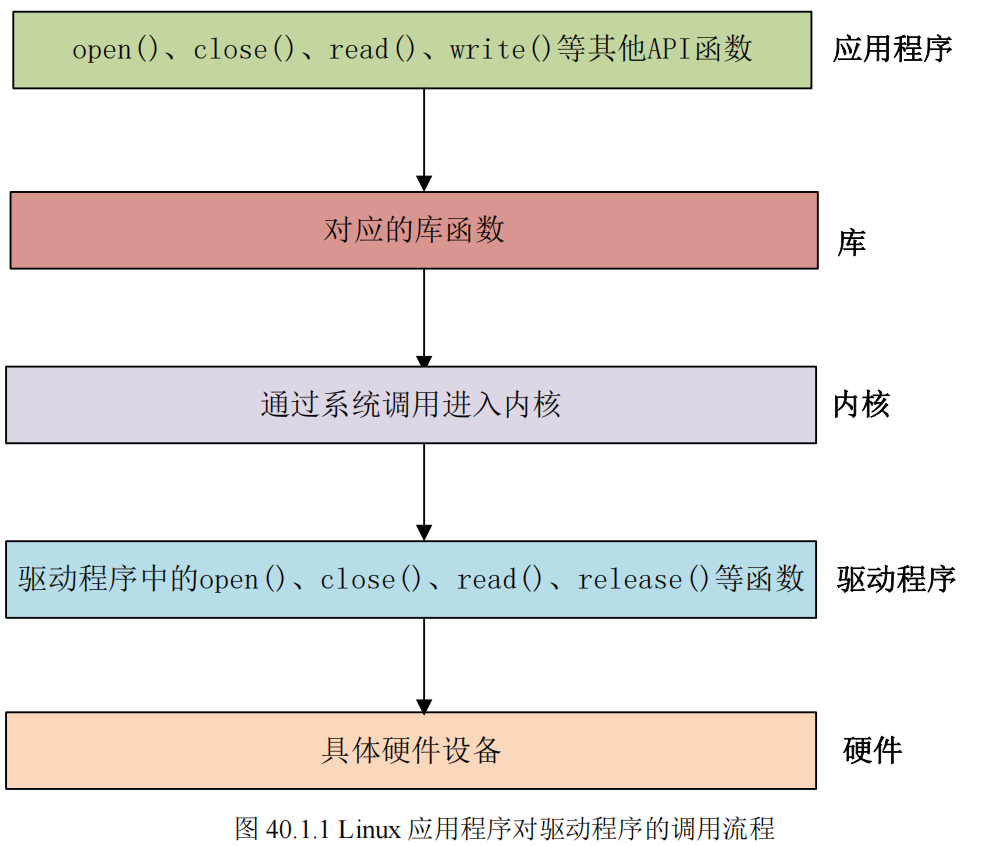
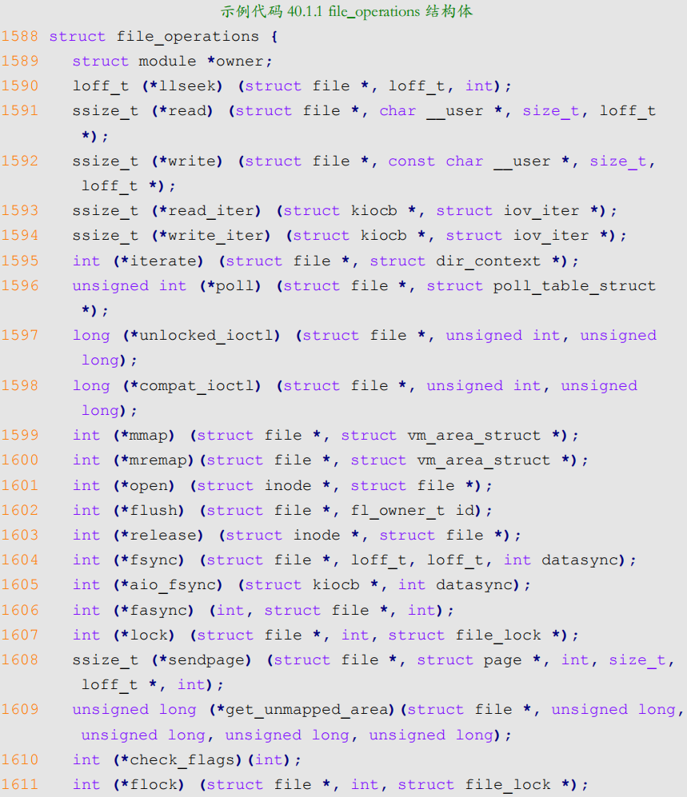
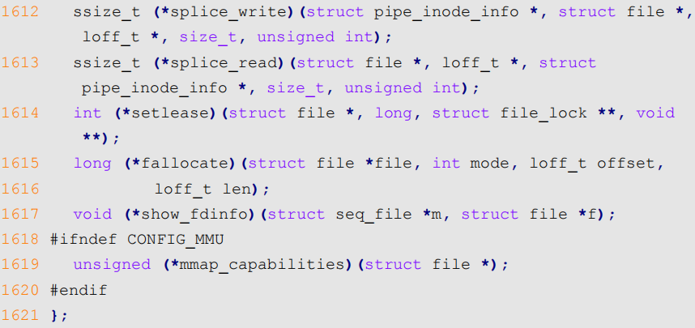
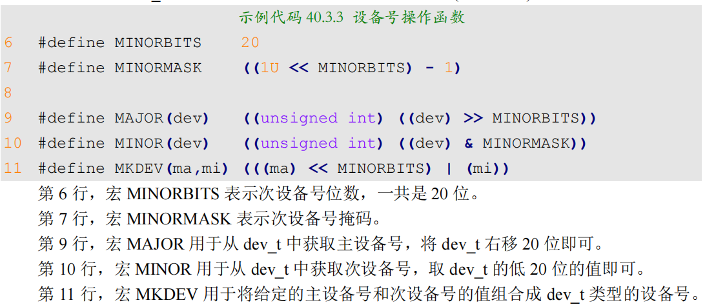
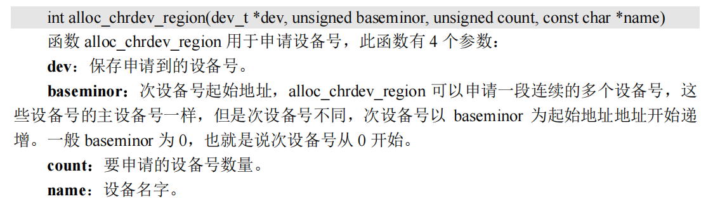
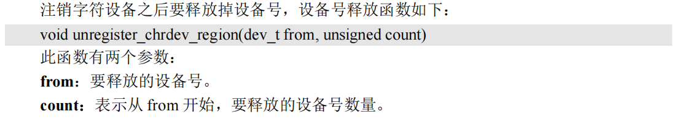
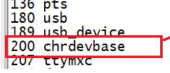

- [驱动开发](#驱动开发)
- [字符设备驱动开发](#字符设备驱动开发)
  - [字符设备驱动 介绍](#字符设备驱动-介绍)
    - [定义](#定义)
  - [应用 **调用** 驱动程序 **逻辑**](#应用-调用-驱动程序-逻辑)
  - [字符设备驱动开发步骤](#字符设备驱动开发步骤)
    - [驱动**模块**的 加载/卸载](#驱动模块的-加载卸载)
      - [.ko加载命令：insmod / **modprobe**](#ko加载命令insmod--modprobe)
      - [.ko卸载命令：rmmod / **modprobe**](#ko卸载命令rmmod--modprobe)
    - [字符设备的注册与注销](#字符设备的注册与注销)
      - [画图说明](#画图说明)
    - [实现设备的具体操作函数](#实现设备的具体操作函数)
    - [添加LICENSE和作者信息](#添加license和作者信息)
  - [linux设备号](#linux设备号)
    - [设备号组成](#设备号组成)
    - [设备号分配](#设备号分配)
  - [chrdevbase 字符设备驱动开发实验](#chrdevbase-字符设备驱动开发实验)
    - [printk函数分析](#printk函数分析)
    - [驱动方法的参数分析](#驱动方法的参数分析)
    - [测试](#测试)
      - [加载ko模块](#加载ko模块)
      - [创建设备文件](#创建设备文件)
      - [执行测试即可](#执行测试即可)

# 驱动开发
终于进入第四章了。

开始学习linux中的三大类驱动：
- **字符设备驱动**
  - 最多
  - gpio，i2c,spi,sound
- **块设备驱动**
  - 更复杂，多数原厂写好直接用
  - 即存储器设备驱动，emmc,nand,sd卡，u盘。以存储块为基础
- **网络设备驱动**
  - 有线/无线

> 一个设备可以属于多种设备驱动类型
>
> USB WIFI， 使用USB接口，属于字符设备，又能上网，所以属于网络设备驱动。

> 我们的内核版本是：4.1.15， 支持dts


# 字符设备驱动开发
这里开始学习linux的字符设备驱动开发框架，用一个虚拟的设备为例，讲解如何进行字符设备驱动开发。如何编写测试app来测试驱动工作是否正常。

## 字符设备驱动 介绍
### 定义

- linux驱动中**最基本的一类设备驱动**，字符设备就是一个一个字节，按照**字节流**进行**读写操作**的设备
  - 读写数据是`分先后顺序`的。
  - 比如我们最常见的`点灯`、`按键`，`IIC`、`SPI`，`LCD` 等等都是**字符设备**，这些设备的驱动就叫做**字符设备驱动**

##  应用 **调用** 驱动程序 **逻辑**

> 可以看到，实际上，用户态的用户程序，依赖**系统调用**，调用内核态的驱动程序的

在 **Linux 中一切皆为文件**，驱动加载成功以后会在“**`/dev`**”目录下**生成一个相应的文件**，**应用程序**通过对这个名为“**`/dev/xxx`**”(xxx 是具体的驱动文件名字)的文件**进行相应的操作即可实现对硬件的操作**

举例：
- 现在有个叫做`/dev/led` 的**驱动文件**，此文件是 **led 灯的驱动文件**。
  - (**打开关闭设备文件**)
    - 应用程序使用 `open` 函数来**打开**文件/dev/led，使用完成以后使用 `close` 函数**关闭**/dev/led 这个文件。
    - `open`和 `close` 就是**打开和关闭** `led` **驱动**的函数，
  - (**写设备数据**)
    - 如果要**点亮或关闭** `led`，那么就使用 `write` 函数来操作，也就是向此驱动**写入数据**，这个数据就是要关闭还是要打开 led 的控制参数。
  - (**读设备状态**)
    - 如果要**获取led 灯的状态**，就用 `read` 函数从驱动中**读取相应的状态**

> 应用程序运行在**用户空间**，而 Linux 驱动属于内核的一部分，因此驱动运行于**内核空间**, 必须使用一个叫做“**系统调用**”的方法来实现从用户空间“陷入”到内核空间，这样才能实现对底层驱动的操作
>
> `open、close、write 和 read` 等这些函数是由 **C 库提供的**，在 Linux 系统中，**系统调用作为 C 库的一部分**
> 

在 Linux 内核文件 `include/linux/fs.h` 中有个叫做 `file_operations` 的结构体，此结构体就是 **Linux 内核驱动  `操作函数` 集合**




常用的函数有：
- owner
  - 指向struct module变量的指针，一般设置为THIS_MODULE
  - llseek
    - 修改文件当前的读写位置
  - read
    - 读取设备文件
  - write
    - 向设备文件写入/发送数据
  - poll
    - 轮询函数，查询设备是否可以进行**非阻塞**读写
  - unlocked_ioctl
    - 提供对设备的控制功能，和应用程序中的ioctl函数对应
    - 32位系统上，32位应用程序用这个
  - compat_ioctl
    - 同unlocked_ioctl, 用于64位系统上，32位应用程序用这个函数。
  - mmap
    - 将设备的**内存映射**到进程空间中（用户空间），一般帧缓冲设备用这个函数
    - 如LCD驱动的显存，将帧缓存（LCD显存）映射到用户空间中后，应用程序可以直接操作显存。**不用在用户空间和内核空间来回复制**。
  - open
    - 打开设备文件
  - release
    - 释放/关闭设备问及那， 和close对应
  - fasync
    - 刷新待处理的数据，用于将缓冲区的数据刷新到磁盘。
  - aio_fsync
    - 与fasync类似，这个是异步刷新待处理数据

> 我们在**字符设备驱动开发中最主要的工作**就是**实现上面这些函数**，不一定全部都要实现，但是像 `open`、`release`、`write`、`read` 等**都是需要实现的**
> 
> 当然了，**具体需要实现哪些函数还是要看具体的驱动要求**


## 字符设备驱动开发步骤
我们编写**裸机驱动**，就是
- 使能时钟（打开设备）
- 根据需要，配置设备寄存器。

在linux驱动开发中，肯定也是要干这些的，只不过，我们需要**按照其规定的框架来编写驱动**
> 所以说，学**linux驱动开发**，**重点是学习其驱动框架**
### 驱动**模块**的 加载/卸载

linux驱动，有两种运行方式：
- **驱动编译进linux内核**
  - linux内核启动后，自动加载驱动程序
- **驱动编译成模块**（这里叫**模块**，`xxx.ko`）
  - 扩展名为.ko
  - 内核启动后，`insmod`加载驱动模块

> 一般，**调试的时候，编译成模块**，这样仅需编译驱动代码，无需重新编译整个linux代码。

**驱动模块**(`xxx.ko`)有**加载**(insmod)和**卸载**(rmmod)两种操作, 我们在编写驱动的时候，需要注册这两种操作函数
```c
module_init(xxx_init);      //注册 模块加载函数
module_exit(xxx_exit);      //注册 模块卸载函数
```

- **执行 `insmod xxx.ko`**
  - 调用`xxx_init()`
- **执行 `rmmod xxx.ko`**
  - 调用`xxx_exit()`


字符设备驱动模块，加载卸载模板如下
```c
/* 驱动入口函数 */
static int __init xxx_init(void)
{
    /* 入口函数具体内容 */
    return 0;
}
 
/* 驱动出口函数 */
static void __exit xxx_exit(void)
{
    /* 出口函数具体内容 */
}

/* 将上面两个函数指定为驱动的入口和出口函数 */
module_init(xxx_init);
module_exit(xxx_exit);
```
> 注意，入口函数和出口函数，分别使用了`__init`, `__exit`来修饰。

---


当驱动编译完以后，得到`xxx.ko`

#### .ko加载命令：insmod / **modprobe**

有**两种命令**可以**加载**驱动模块：
- **`insmod`**
  - **最简单**的模块加载命令，用于加载.ko模块
  - 举例：`insmod drv.ko`
  - **缺点**：
    - 不能解决**模块**的**依赖关系**
    - 如：`drv.ko`依赖`first.ko`， 只能先`insmod first.ko`, 然后`insmod drv.ko`
- **`modprobe`**
  - 可以**分析模块的依赖关系**，然后将所有的依赖模块，加载到内核
  - 支持模块的**依赖性分析**，**错误检查**，**错误报告**功能
  - > `modprobe` 默认会去 `/lib/modules/<内核版本>/`下查找相应的驱动模块，自己自制的根文件系统，需要**手动创建**。


#### .ko卸载命令：rmmod / **modprobe**
- **`rmmod`**
  - 卸载drv.ko: `rmmod drv.ko`
- **`modprobe`**
  - 卸载drv.ko: `modprobe -r drv.ko`

> 使用 `modprobe` 命令可以**卸载掉驱动模块所依赖的其他模块**
> 
> **前提**是这些依赖模块**已经没有被其他模块所使用**，否则就不能使用 modprobe 来卸载驱动模块。
> 
> 所以对于**模块的卸载**，还是**推荐使用 `rmmod` 命令**

> 以上就是内核空间的驱动的加载和卸载，目的是让系统调用能够有东西调用
### 字符设备的注册与注销
对于字符设备驱动而言
- 当驱动模块**加载成功**以后需要**注册字符设备**
- **卸载驱动**模块的时候也需要**注销掉字符设备**

注册与注销字符设备的函数原型：
```c
/*
register_chrdev， 注册字符设备，3个参数
1. major       主设备号， linux下每个设备都有一个设备号（主设备号+次设备号）
2. name        设备名，    指向一串字符串
3. fops        指向file_operations结构体的指针， 指向设备的操作函数集合的变量
*/
static inline int register_chrdev(unsigned int major, const char *name,
                                    const struct file_operations *fops)


/*
unregister_chrdev， 注销字符设备，3个参数
1. major       主设备号， linux下每个设备都有一个设备号（主设备号+次设备号）
2. name        设备名，    指向一串字符串
*/
static inline void unregister_chrdev(unsigned int major, const char *name)
```
> 一般：
> - **字符设备的注册**在驱动模块的**入口函数** `xxx_init` 中进行
> - **字符设备的注销**在驱动模块的**出口函数** `xxx_exit` 中进行

模板如下：
```c
static struct file_operations test_fops;    //全局区bss的一块内存

/* 驱动入口函数 */
static int __init xxx_init(void)
{
    /* 入口函数具体内容 */
    int retvalue = 0;

    /* 注册字符设备驱动 */
    retvalue = register_chrdev(200, "chrtest", &test_fops);
    if(retvalue < 0){
        /* 字符设备注册失败,自行处理 */
    }
    return 0;
}

/* 驱动出口函数 */
static void __exit xxx_exit(void)
{
    /* 注销字符设备驱动 */
    unregister_chrdev(200, "chrtest");
}

/* 将上面两个函数指定为驱动的入口和出口函数 */
module_init(xxx_init);
module_exit(xxx_exit);
```

> `test_fops`，static，相当于在全局区申请了**一块内存**，**存放操作函数的地址**。
> 
> 注册设备的**主设备号**，设成200，具体需要`cat /proc/devices` 来查看已经被占用的设备号
>
> unregister 注销major=200的设备


#### 画图说明
前面说了，要在驱动程序的入口函数里面，增加注册字符设备，那么此时的调用逻辑是：
- insmod xxx.ko
  - kernel调用module_init(xxx_init)，注册驱动的入口函数。
    - 入口函数里面注册了字符设备，指定了设备号，设备名，操作方法内存地址

```c
用户空间 (User Space)             |          内核空间 (Kernel Space)
---------------------------------------|-------------------------------------------
                                       |
 1. 执行命令:                           |  3. 系统调用处理 (sys_init_module):
    $ insmod xxx.ko                    |     [ 分配内存 ] -> [ 拷贝驱动代码到内核 ]
          |                            |            |
          v                            |            v
 2. 调用系统调用:                       |  4. 符号重定位 (Relocation):
    init_module()  ------------------> |     [ 把驱动里的函数地址和内核真正地址对齐 ]
                                       |            |
                                       |            v
                                       |  5. 寻找入口点 (The "Drawer"):
    +---------------------------+      |     内核去查 ELF 文件的 .initcall.init 段
    |  xxx.ko 文件 (ELF格式)     |      |     找到 module_init(xxx_init) 记下的地址
    |                           |      |            |
    |  [.text] -> 代码逻辑       |      |            v
    |  [.data] -> 全局变量       |      |  6. 真正跳转执行 (The Jump):
    |  [.init] -> [xxx_init] <---------|----- 执行 xxx_init()  <-- 【你的代码在这里运行】
    +---------------------------+      |            |
                                       |            v
                                       |  7. 卸磨杀驴 (Memory Cleanup):
                                       |     执行完后，释放带有 __init 标记的内存
                                       |     (xxx_init 的代码从内存中被抹掉)
---------------------------------------|-------------------------------------------
```

### 实现设备的具体操作函数
这里完成对操作方法变量的初始化， 设置好针对`chrtest`设备的操作函数。（我们前面在入口函数里面注册了一个**chrdev字符设备**，名字叫`chrtest`）。

在初始化操作函数之前，要**分析一下需求**，即 **要对chrtest这个设备，进行哪些操作**

**假设有如下需求：**
- 对chrtest设备进行 **打开/关闭操作**
  - 打开，关闭，是最基本的要求。所有设备都得提供打开关闭功能
  - 需要实现：`file_operations`中的： `open` 和 `release` 
- 对chrtest设备进行 **读写操作**
  - > chrtest内部有一段内存，要通过read,write， 来进行读写
  - 要实现： `file_operations` 中的 `open` 和 `release`

实现
```c
/* 打开设备 */
static int chrtest_open(struct inode *inode, struct file *filp)
{
    /* 用户实现具体功能 */
    return 0;
}

/* 从设备读取 */
static ssize_t chrtest_read(struct file *filp,
                            char __user *buf, 
                            size_t cnt, loff_t *offt)
{
    /* 用户实现具体功能 */
    return 0;
}

/* 向设备写数据 */
static ssize_t chrtest_write(struct file *filp,
                            const char __user *buf,
                            size_t cnt, loff_t *offt)
{
    /* 用户实现具体功能 */
    return 0;
}

/* 关闭/释放设备 */
static int chrtest_release(struct inode *inode, struct file *filp)
{
    /* 用户实现具体功能 */
    return 0;
}

static struct file_operations test_fops = {
    .owner = THIS_MODULE, 
    .open = chrtest_open,
    .read = chrtest_read,
    .write = chrtest_write,
    .release = chrtest_release,
};

//后面就是前面的
// static 的操作函数集合变量
// 入口函数
// 出口函数
// 加载模块
// 卸载模块
```


### 添加LICENSE和作者信息
最后就是要在驱动中加入**LICENSE信息**和**作者信息**。
> **LICENSE必须添加**，否则编译会报错。

添加方法
- **`MODULE_LICENSE()`**
  - 添加模块LICENSE信息
- **`MODULE_AUTHOR()`**
  - 添加模块作者信息

示例
```c
//... 以上是前面写的驱动代码

MODULE_LICENSE("GPL");
MODULE_AUTHOR("liangji");
```

## linux设备号
### 设备号组成
为了方便管理，Linux 中**每个设备都有一个设备号**，设备号由主设备号和次设备号两部分
组成：
- **设备号**
  - **主设备号**
    - 表示某一个具体的驱动
  - **次设备号**
    - 表示使用这个驱动的各个设备

linux内核提供`dev_t`类型表示**设备号**, 定义在`include/linux/types.h`
```c
typedef __u32 __kernel_dev_t;
typedef __kernel_dev_t dev_t;

//include/uapi/asm-generic/int-ll64.h
typedef unsigned int __u32;                     //所以本质上__u32， 是一个32位的变量
```
> `dev_t == uint32`,  `高12位`为**主设备号**， `低20位`为**次设备号**

所以，linux系统中，**主设备号范围`0-4095`**，我们在入口出口函数里面注册注销字符设备的时候，填写的**主设备号**，**表示驱动程序**，只能在这个范围内


`include/linux/kdev_t.h`中提供了关于设备号的宏操作函数



### 设备号分配

主要有两种分配方式
- **静态分配设备号**
  - 前面我们注册字符设备`register_chrdev()`时**手动指定主设备号**200
  - 需要`cat /proc/devices` 查看**系统已经占用**了哪些主设备号
  - 容易出现冲突
- **动态分配设备号**
  - 注册字符设备之前，先申请一个设备号，系统返回一个没有使用的，卸载驱动的时候释放设备号即可
  - 
  - 


## chrdevbase 字符设备驱动开发实验

他这个实验，设计一个虚拟的设备，然后用用户态的程序，来根据系统调用的规范，来调用驱动程序，驱动字符设备

**驱动程序`chrdevbase.c`**
```c
#include <linux/types.h>
#include <linux/kernel.h>
#include <linux/delay.h>
#include <linux/ide.h>
#include <linux/init.h>
#include <linux/module.h>
/***************************************************************
Copyright © ALIENTEK Co., Ltd. 1998-2029. All rights reserved.
文件名		: chrdevbase.c
作者	  	: 左忠凯
版本	   	: V1.0
描述	   	: chrdevbase驱动文件。
其他	   	: 无
论坛 	   	: www.openedv.com
日志	   	: 初版V1.0 2019/1/30 左忠凯创建
***************************************************************/

#define CHRDEVBASE_MAJOR	200				/* 主设备号 */
#define CHRDEVBASE_NAME		"chrdevbase" 	/* 设备名     */

static char readbuf[100];		/* 读缓冲区 */
static char writebuf[100];		/* 写缓冲区 */
static char kerneldata[] = {"kernel data!"};

/*
 * @description		: 打开设备
 * @param - inode 	: 传递给驱动的inode
 * @param - filp 	: 设备文件，file结构体有个叫做private_data的成员变量
 * 					  一般在open的时候将private_data指向设备结构体。
 * @return 			: 0 成功;其他 失败
 */
static int chrdevbase_open(struct inode *inode, struct file *filp)
{
	//printk(">>>>>>>>>>>>>>>>>>>>>>>>>>>>>chrdevbase open!\r\n");
	return 0;
}

/*
 * @description		: 从设备读取数据 
 * @param - filp 	: 要打开的设备文件(文件描述符)
 * @param - buf 	: 返回给用户空间的数据缓冲区
 * @param - cnt 	: 要读取的数据长度
 * @param - offt 	: 相对于文件首地址的偏移
 * @return 			: 读取的字节数，如果为负值，表示读取失败
 */
static ssize_t chrdevbase_read(struct file *filp, char __user *buf, size_t cnt, loff_t *offt)
{
	int retvalue = 0;
	
	/* 向用户空间发送数据 */
	memcpy(readbuf, kerneldata, sizeof(kerneldata));
	//printk(KERN_ERR "kernel start copy to user\n");
	retvalue = copy_to_user(buf, readbuf, cnt);
	if(retvalue == 0){
		printk("kernel senddata ok!\r\n");
	}else{
		printk("kernel senddata failed!\r\n");
	}
	
	//printk("chrdevbase read!\r\n");
	return 0;
}

/*
 * @description		: 向设备写数据 
 * @param - filp 	: 设备文件，表示打开的文件描述符
 * @param - buf 	: 要写给设备写入的数据
 * @param - cnt 	: 要写入的数据长度
 * @param - offt 	: 相对于文件首地址的偏移
 * @return 			: 写入的字节数，如果为负值，表示写入失败
 */
static ssize_t chrdevbase_write(struct file *filp, const char __user *buf, size_t cnt, loff_t *offt)
{
	int retvalue = 0;
	/* 接收用户空间传递给内核的数据并且打印出来 */
	retvalue = copy_from_user(writebuf, buf, cnt);
	if(retvalue == 0){
		printk("kernel recevdata:%s\r\n", writebuf);
	}else{
		printk("kernel recevdata failed!\r\n");
	}
	
	//printk("chrdevbase write!\r\n");
	return 0;
}

/*
 * @description		: 关闭/释放设备
 * @param - filp 	: 要关闭的设备文件(文件描述符)
 * @return 			: 0 成功;其他 失败
 */
static int chrdevbase_release(struct inode *inode, struct file *filp)
{
	//printk(">>>>>>>>>>>>>>>>>>>>>>>>>>>>>>>>>>>>>>>>>chrdevbase release！\r\n");
	return 0;
}

/*
 * 设备操作函数结构体
 */
static struct file_operations chrdevbase_fops = {
	.owner = THIS_MODULE,	
	.open = chrdevbase_open,
	.read = chrdevbase_read,
	.write = chrdevbase_write,
	.release = chrdevbase_release,
};

/*
 * @description	: 驱动入口函数 
 * @param 		: 无
 * @return 		: 0 成功;其他 失败
 */
static int __init chrdevbase_init(void)
{
	int retvalue = 0;

	/* 注册字符设备驱动 */
	retvalue = register_chrdev(CHRDEVBASE_MAJOR, CHRDEVBASE_NAME, &chrdevbase_fops);
	if(retvalue < 0){
		printk("chrdevbase driver register failed\r\n");
	}
	printk("chrdevbase init!\r\n");
	return 0;
}

/*
 * @description	: 驱动出口函数
 * @param 		: 无
 * @return 		: 无
 */
static void __exit chrdevbase_exit(void)
{
	/* 注销字符设备驱动 */
	unregister_chrdev(CHRDEVBASE_MAJOR, CHRDEVBASE_NAME);
	printk("chrdevbase exit!\r\n");
}

/* 
 * 将上面两个函数指定为驱动的入口和出口函数 
 */
module_init(chrdevbase_init);
module_exit(chrdevbase_exit);

/* 
 * LICENSE和作者信息
 */
MODULE_LICENSE("GPL");
MODULE_AUTHOR("zuozhongkai");
```

**用户态的应用测试程序**，`chrdevbaseApp.c`
```c
#include "stdio.h"
#include "unistd.h"
#include "sys/types.h"
#include "sys/stat.h"
#include "fcntl.h"
#include "stdlib.h"
#include "string.h"
/***************************************************************
Copyright © ALIENTEK Co., Ltd. 1998-2029. All rights reserved.
文件名		: chrdevbaseApp.c
作者	  	: 左忠凯
版本	   	: V1.0
描述	   	: chrdevbase驱测试APP。
其他	   	: 使用方法：./chrdevbase /dev/chrdevbase <1>|<2>
  			 argv[2] 1:读文件
  			 argv[2] 2:写文件		
论坛 	   	: www.openedv.com
日志	   	: 初版V1.0 2019/1/30 左忠凯创建
***************************************************************/

static char usrdata[] = {"usr liangji!"};
static char usrdata2[] = {"usr wugt!"};

/*
 * @description		: main主程序
 * @param - argc 	: argv数组元素个数
 * @param - argv 	: 具体参数
 * @return 			: 0 成功;其他 失败
 */
int main(int argc, char *argv[])
{
	int fd, retvalue;
	char *filename;
	char readbuf[100], writebuf[100];

	if(argc != 3){
		printf("Error Usage!\r\n");
		return -1;
	}

	filename = argv[1];

	/* 打开驱动文件 */
	fd  = open(filename, O_RDWR);
	if(fd < 0){
		printf("Can't open file %s\r\n", filename);
		return -1;
	}

	if(atoi(argv[2]) == 1){ /* 从驱动文件读取数据 */
		retvalue = read(fd, readbuf, 50);
		if(retvalue < 0){
			printf("read file %s failed!\r\n", filename);
		}else{
			/*  读取成功，打印出读取成功的数据 */
			printf("read data:%s\r\n",readbuf);
		}
	}

	if(atoi(argv[2]) == 2){
 	/* 向设备驱动写数据 */
		memcpy(writebuf, usrdata, sizeof(usrdata));
		retvalue = write(fd, writebuf, 50);
		if(retvalue < 0){
			printf("write file %s failed!\r\n", filename);
		}
	}

	if(atoi(argv[2]) == 3){
 	/* 向设备驱动写数据 */
		memcpy(writebuf, usrdata2, sizeof(usrdata2));
		retvalue = write(fd, writebuf, 50);
		if(retvalue < 0){
			printf("write file %s failed!\r\n", filename);
		}
	}


	/* 关闭设备 */
	retvalue = close(fd);
	if(retvalue < 0){
		printf("Can't close file %s\r\n", filename);
		return -1;
	}

	return 0;
}
```

`Makefile`,因为驱动在内核编译环境外面，所以单独写了一个Makefile脚本， **后面有空再系统学习Makefile语法**
```c
KERNELDIR := /home/liangji/linux/kernel/my_linux/linux-imx-rel_imx_4.1.15_2.1.0_ga
CURRENT_PATH := $(shell pwd)
obj-m := chrdevbase.o

build: kernel_modules

kernel_modules:
	$(MAKE) -C $(KERNELDIR) M=$(CURRENT_PATH) modules
clean:
	$(MAKE) -C $(KERNELDIR) M=$(CURRENT_PATH) clean
```

### printk函数分析
这个是linux内核打印日志的函数，需要注意的是，它里面对日志消息级别进行了分类，一共8个消息级别，定义在`include/linux/kern_levels.h`
```c
#define KERN_SOH "\001"
#define KERN_EMERG KERN_SOH "0" /* 紧急事件，一般是内核崩溃 */
#define KERN_ALERT KERN_SOH "1" /* 必须立即采取行动 */
#define KERN_CRIT KERN_SOH "2" /* 临界条件，比如严重的软件或硬件错误*/
#define KERN_ERR KERN_SOH "3" /* 错误状态，一般设备驱动程序中使用KERN_ERR 报告硬件错误 */
#define KERN_WARNING KERN_SOH "4" /* 警告信息，不会对系统造成严重影响 */
#define KERN_NOTICE KERN_SOH "5" /* 有必要进行提示的一些信息 */
#define KERN_INFO KERN_SOH "6" /* 提示性的信息 */
#define KERN_DEBUG KERN_SOH "7" /* 调试信息
```
> 0优先级最高，7优先级最低，和**中断优先级**一样
> 注意：rtos的任务优先级是反过来的

**使用格式**
```c
printk(KERN_EMERG "gsmi: Log Shutdown Reason\n");

//如果不指定日志等级，则是默认
#define MESSAGE_LOGLEVEL_DEFAULT 4
```

显示等级
```c
#define CONSOLE_LOGLEVEL_DEFAULT 7  //优先级高于这个才能在控制台显示。
```

---
### 驱动方法的参数分析
>驱动内的`open`方法，有一个参数是 `flip`， 里面有一个叫做`private_data`的成员变量，一般在驱动中，把private_data指向设备结构体，用来**存放一些设备的属性**。


### 测试
#### 加载ko模块
启动linux系统后，需要加载驱动程序：
- **insmode**
  - 因为我们的驱动没有依赖驱动，直接insmod即可
- **modprobe**
  - 我们如果要用modprobe来加载驱动程序，需要把我们的ko模块，放到`/lib/module/<内核版本>`。不然使用不了。
  - 提示`无法打开modules.dep，没有这个文件`，需要执行`depmod`指令来生成，这个就当是个环境，由busybox提供depmod工具

`lsmod` 可以查看当前系统中**已经加载的驱动模块**(注意是模块，也就是ko)


我们在驱动里面**注册了可以在用户空间照应的字符设备**，通过下面就可以看到，驱动程序确实已经把**chrdevbase设备注册进系统**了
```c
cat /proc/devices //查看当前的系统设备
```


> 以上，内核空间的准备已经结束了，我们在内核空间内，加载了驱动程序，注册了设备。
#### 创建设备文件
下面开始，要开始准备用户空间的东西

驱动加载成功需要在/dev目录下创建一个与之对应的**设备节点文件**，应用程序需要通过这个**设备节点文件**来完成对**设备**的具体操作
```c
mknod /dev/chrdevbase c 200 0
//mknod 是创建节点命令
// /dev/chrdevbase是要创建的节点文件
// c表示这是一个字符设备
// 200是这个设备的主设备号
// 0是这个设备的次设备号
```
#### 执行测试即可
下面就可以开始用用户空间的测试程序，通过对设备节点文件进行系统调用，从而实现对内核空间驱动程序的调用。

> 关于，用户程序，系统调用，设备节点，设备，驱动程序，内核他们之间的关系，后面有时间再分析。