- [并发与竞争现象](#并发与竞争现象)
- [linux处理竞争的机制](#linux处理竞争的机制)
  - [原子操作](#原子操作)
    - [介绍](#介绍)
  - [内核原子操作底层原理](#内核原子操作底层原理)
    - [x86架构](#x86架构)
    - [arm架构](#arm架构)
  - [原子操作的api函数](#原子操作的api函数)
    - [整形int原子操作](#整形int原子操作)
    - [位操作原子操作](#位操作原子操作)
  - [锁机制](#锁机制)
    - [介绍](#介绍-1)
    - [自旋锁](#自旋锁)
    - [读写自旋锁](#读写自旋锁)
    - [顺序锁](#顺序锁)
  - [信号量](#信号量)
    - [介绍](#介绍-2)
    - [api](#api)
  - [互斥体](#互斥体)
- [总结](#总结)
  - [关于自旋锁的底层](#关于自旋锁的底层)

# 并发与竞争现象
经常会出现以下几种情况：
- **多核**访问同一块共享数据
- **多个进程**`抢占式`访问同一块共享数据
- **多个线程**访问同一块共享数据
- **中断**内部访问共享数据
---
**概念定义**：
- **并发**: 
  - 就是**多个“用户”同时访问同一个共享资源**
- **临界区**：
  - 共享数据段/共享内存空间
  - **对待临界区的准则**：
    - 保证**原子访问**：**保证一次只有一个线程访问**
- **竞争**：
  - 并发访问临界区带来的**问题**，叫竞争
- **原子访问**
  - 该访问操作，**不能进行拆分**（`cpu执行指令层面`）
- **需要保护的共享数据**
  - 一般像**全局变量**，**设备结构体**这些肯定是要保护的，
  - 至于其他的数据就要根据实际的驱动程序而定了

>一般在编写驱动的时候就要考虑到并发与竞争


**Linux 内核提供的几种并发和竞争的处理方法**

# linux处理竞争的机制
## 原子操作
### 介绍
**原子操作定义**：指**不能再进一步分割的操作**，一般原子操作用于`变量`或者`位操作`

**非原子操作举例：**
```c
//c语言中一句赋值语句
a=3;

//cpu的对应执行指令
ldr r0, =0X30000000         /* 变量 a 地址 */
ldr r1, = 3                 /* 要写入的值 */
str r1, [r0]                /* 将 3 写入到 a 变量中 */
```
> 可以看到上面的一句普通的赋值语句来说，cpu实际上是执行3条指令。
>
> 当有多个进程，都进行访问a这个共享数据变量时，会出现如下现象。
> 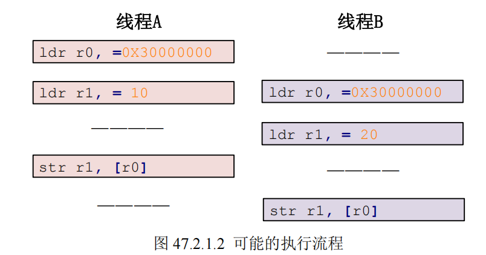
> **最终会导致A进程的计算出现错误**

为了解决这类**并发竞争**的错误，Linux 内核提供了一组**原子操作 API 函数**来完成此功能

## 内核原子操作底层原理
普通的 C 语言代码 i++ 在**汇编层面通常分为三步**：
- 从内存读到寄存器 
- 寄存器加 1 
- 写回内存。

> 在多核（SMP）环境下，两个 CPU 同时**执行这三步就会导致覆盖**。

### x86架构
> x86架构，使用总线锁和缓存锁
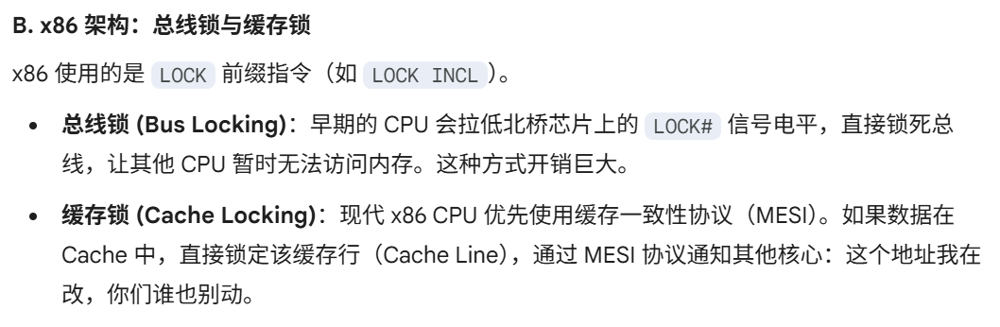

### arm架构
> arm架构，依靠指令来监视，独占访问
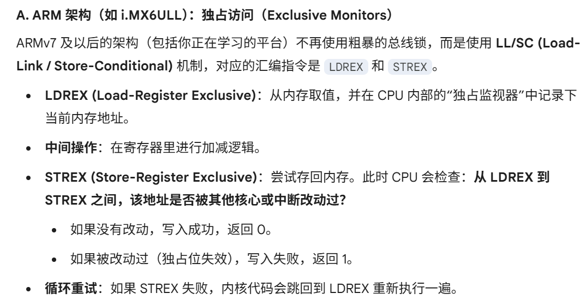

> **内存屏障**
> 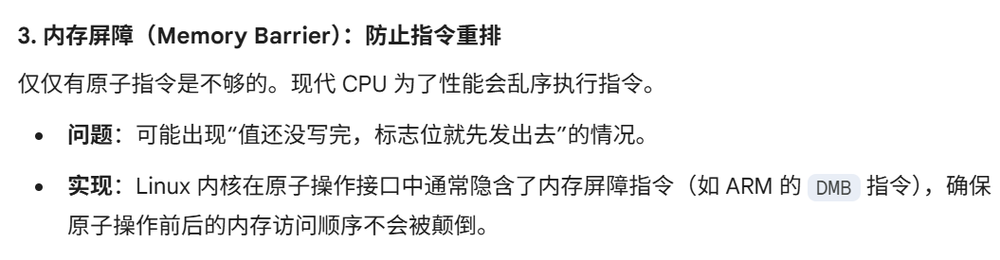


## 原子操作的api函数
总之，linux内核已经为我们提供了原子操作的机制，目前原子操作支持：
- 整形int操作
- 按位操作
> 能够保证上面这两种操作的原子性，其他就不能保证了。
>
> 内核确实**专门为这两类数据**提供了单条指令级别或硬件**独占级别的 API**
>
> 对于**超过单次总线访问宽度的数据或逻辑**，内核不再提供‘直接’的原子接口，而是要求开发者**使用基于原子操作构建的锁机制**（如 Spinlock、Mutex）来手动划定临界区，从而保证复合操作的原子性。”

> **所以原子操作是后面锁，信号量，互斥体的根基**。

---

下面看看相关api, 记录一下，方便速查：

### 整形int原子操作
`include/linux/types.h`中定义原子变量，来代替整形变量
```c
typedef struct {
                int counter;
} atomic_t;
```
--- 
> **linux提供的32位系统的api如下：**
> 
> 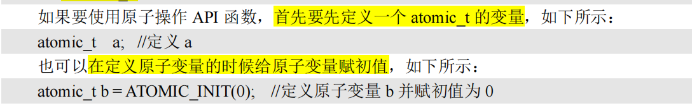
> 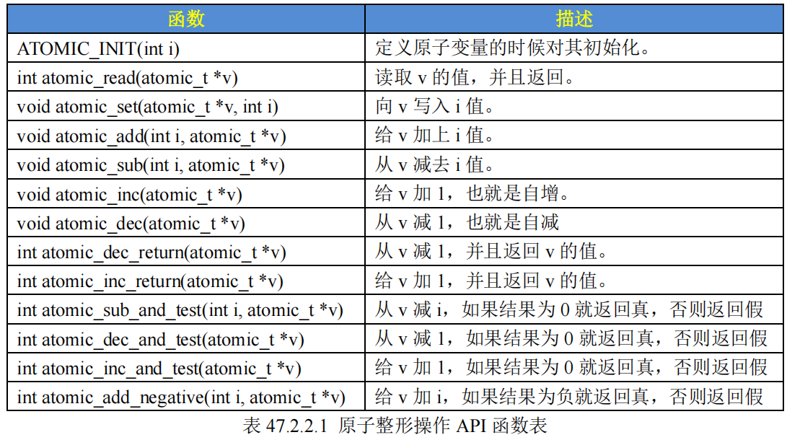

### 位操作原子操作
Linux 内核也提供了一系列的原子位操作 API 函数，只不过**原子位操作不像原子整形变量那样有个 atomic_t 的数据结构**，**原子位操作是直接对内存进行操作**

> 不用自己定义变量了，直接操作内存即可

> **原子位操作api如下：**
> 
> 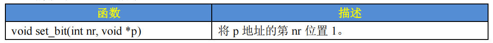
> 

## 锁机制
### 介绍
前面原子操作，有两个不足：
- 只有整形，位操作
- 只能保证操作原子性，**没有协调并发的机制**

所以**在原子操作的基础上，linux内核实现了锁机制**

> **锁机制**：**我用着，别人就不能用**，仅仅就这么一条。**可以纯靠原子操作来实现**
> 
> 至于不能用的用户的处理状态，就是各种**衍生锁**的区别。

### 自旋锁

linux内核里面实现了**自旋锁**：
- 如果自旋锁正在被**线程 A**持有，
- **线程 B** 想要获取自旋锁，
  - 那么线程 B 就会处于**忙循环**-旋转-等待状态`while{}`，线程 B 不会进入休眠状态或者说去做其他的处理
  - > 线程B仍然是就绪/运行态，空转cpu轮询。
---
**缺点**：
- 浪费处理器，降低系统性能
- 持有时间不能太长，适用于**短时间的轻量级加锁**（**锁住修改操作**）

---
使用注意：
- 上锁时间不能过长，一定要短
  - 临界区较大，运行时间长的选择其他处理方式：信号量，互斥体
- 临界区内，不能调用任何导致阻塞等待的api,否则可能出现死锁
- 不能递归申请自旋锁
- 考虑驱动可移植性，当作多核心SOC来写驱动

---

> 注意：**自旋锁不能再临界区内阻塞，因为底层关闭了CPU抢占**
> 
> 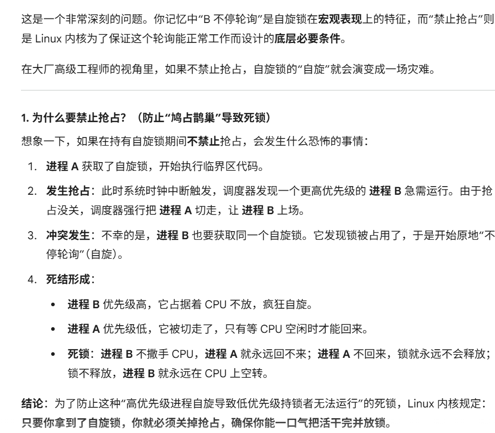

---

**内核api：**

`include/linux/type.h`中定义自旋锁结构体变量：`spinlock_t`

> **基本api**
> 
> 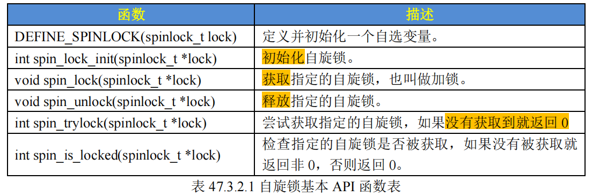
> 
> 以上这些自旋锁API 函数适用于**SMP**或支持抢占的单CPU下线程之间的**并发访问**，也就是**用于线程与线程之间**，被自旋锁保护的临界区一定不能调用任何能够引起睡眠和阻塞的API 函数，否则的话会可能会**导致死锁现象**的发生：
> （**`A上锁，A阻塞，B空转`**）
>
> **中断抢占进程也是一样**，容易导致死锁，所以使用自旋锁，必须关闭本核心中断
> **（`A核任务上锁，A核进入中断，中断空转，死锁`）**

> **自动保存中断状态的api：**
> 
> **使用自旋锁的`最好方法`，就是上锁前，关闭中断**
>
> 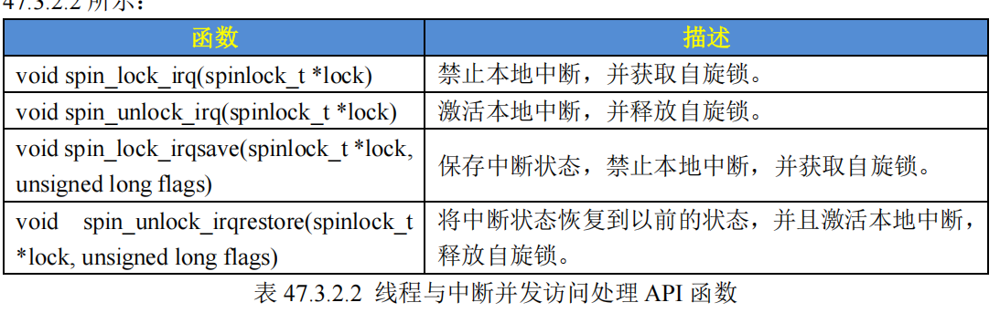
> 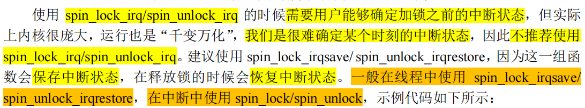
>
> **中断状态的本质**：**CPU 的中断使能位**，不能盲目的全部禁用，全部打开
>
> 
>
> 硬件机制：当硬件中断触发并进入 irq() 时，**ARM 处理器会自动切换状态并关闭全局中断响应（IRQ屏蔽）。**
> 
> 内核行为：Linux 的中断处理机制确保在执行 ISR 期间，**当前 CPU 不会再接收新的同级硬件中断**。
> 
> **逻辑结果**：既然当前 CPU 不会再进入另一个中断，也就不会出现“中断 A 拿到锁 -> 被中断 B 打断 -> 中断 B 申请同一个锁”的情况。所以，在单核视角下，它是安全的。

> **下半部的自旋锁api**
> 
> 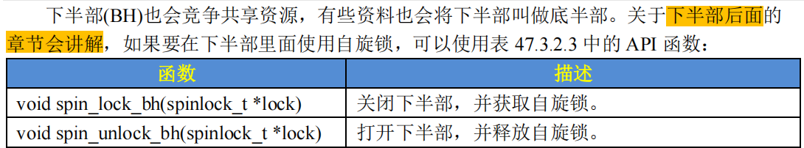

### 读写自旋锁
读写自旋锁为读和写操作提供了不同的锁，
- 一次只能允许一个写操作

也就是只能一个线程持有写锁，而且不能进行读操作。

但是当没有写操作的时候允许一个或多个线程持有读锁，可以进行并发的读操作
### 顺序锁
使用顺序锁的话可以允许在写的时候进行读操作，也就是实现同时读写，但是不允许同时进行
并发的写操作

## 信号量
### 介绍
信号量，是一种同步方式，用于控制对共享资源的访问，任务通知。

**主要用途就两个**：
- **计数型信号量**
  - 表征共享资源的数量
    - -1，占用资源（**占用计数**）
    - +1，生产资源（**任务通知**）
  - > 计数型信号量不能用于互斥访问，无法解决竞争，要解决竞争，需要二值信号量
- **二值型信号量**
  - （相当于把表征的资源看成一个整体）解决竞争，互斥访问共享资源

**特点**：
- 等待信号量的进程会进入阻塞状态。
  - 导致进程状态切换，切换进程会有开销。
  - **适合占用资源较长的场景**
  - 持有时间短的，会导致频繁阻塞休眠，切换进程，增大开销
- 不能用于中断
  - 因为会引起阻塞休眠
- **没有用户专属**
  - A-1信号量，B+1信号量
  - （**对比互斥体，有用户专属**）
  - 


### api
`include/linux/semaphore.h`中定义
```c
struct semaphore {
        raw_spinlock_t lock;
        unsigned int count;
        struct list_head wait_list;
};
```
> **api**
> 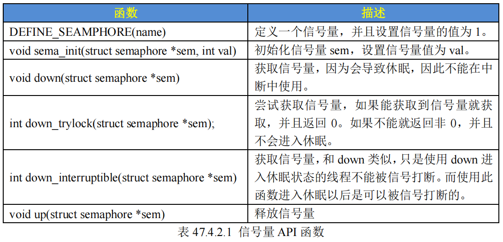
>
> 注意`down_interruptible`和`down`的区别：
> 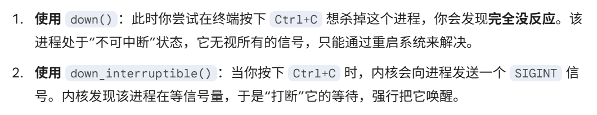


## 互斥体
类似二值信号量，同样实现互斥。

> **互斥访问**表示一次只有一个线程可以访问共享资源，不能递归申请互斥体

在我们编写 Linux 驱动的时候遇到需要互斥访问的地方建议使用 mutex

`include/linux/type.h`中定义互斥体
```c
struct mutex {
        /* 1: unlocked, 0: locked, negative: locked, possible waiters */
        atomic_t count;
        spinlock_t wait_lock;
};
```
注意点：
- mutex和信号量一样，会导致进入阻塞
  - 中断中不能用mutex，只能用自旋锁
- mutex和信号量保护的临界区中，**可以调用引起阻塞的api**
- 用户专属，不支持递归

> **api**
> 
> 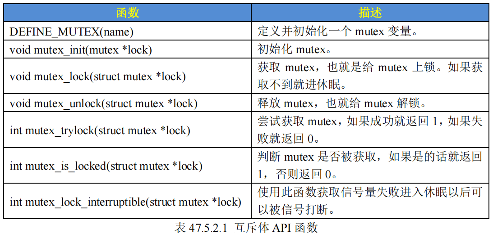


# 总结
选择哪种互斥方法，就看3件事情：


> 在 Linux 内核中，**阻塞（Blocking）**的本质是**进程主动调用调度器（schedule()）**，放弃 CPU 并进入休眠状态。而能否允许这种行为，完全取决于你当前持有的“锁”的性质。
>
> **临界区调用阻塞api，相当于主动放弃cpu**, 如果你在持有自旋锁时休眠（切走 CPU），而另一个进程尝试获取这个锁，它会死命自旋，但持有锁的你已经“睡着了”，没法回来放锁

---

> 这里总结一下关于**底层调度和抢占相关的**，前面针对锁的底层实现没提到

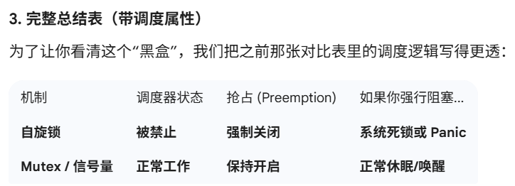

## 关于自旋锁的底层
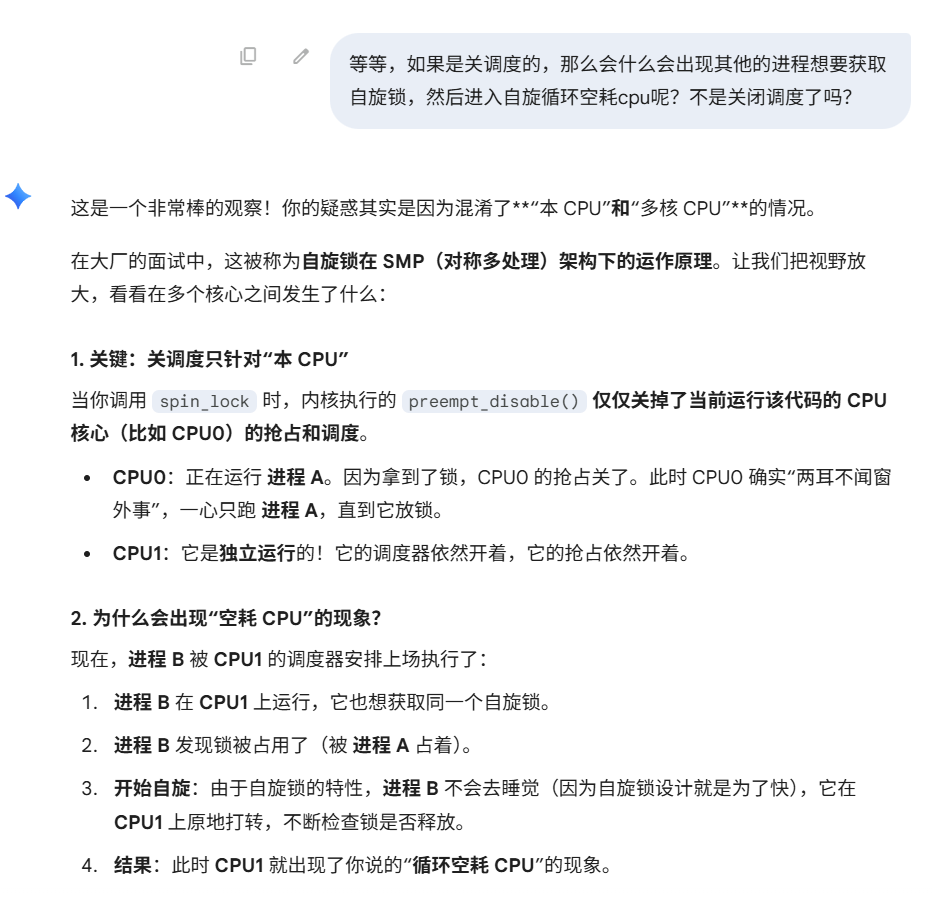
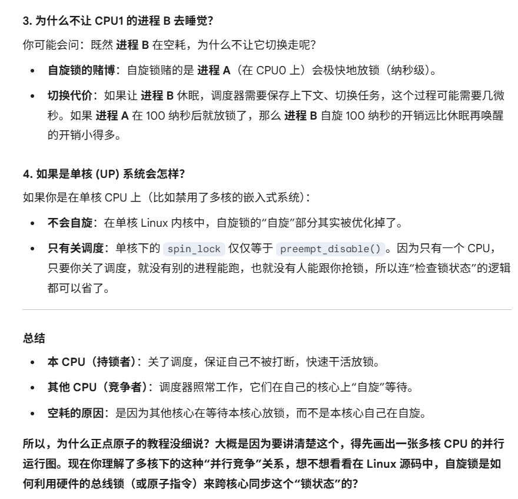

所以我们做实验的时候，我们的imx是单核，本身就先当于抢占CPU了，就不会出现自旋的情况，而且我们自旋锁保护的是写变量的操作，本身就非常快。所以如果是在多核中，也很难碰到自旋的情况。