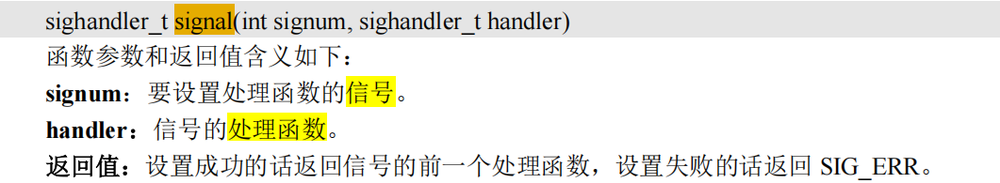
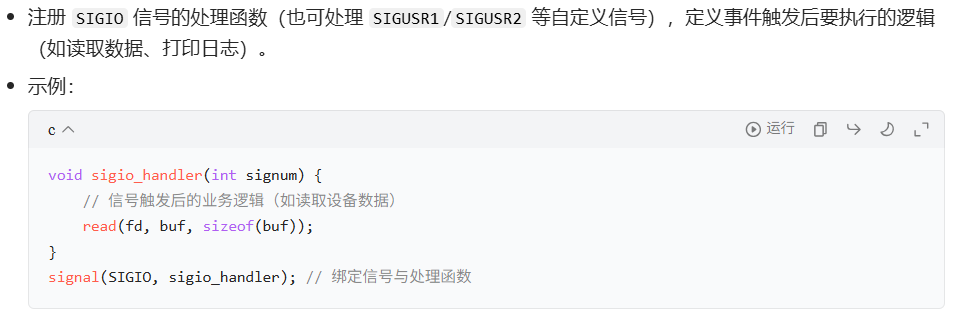
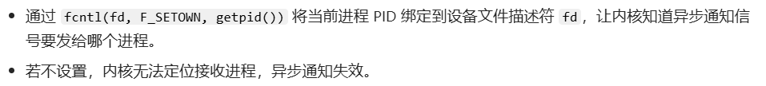
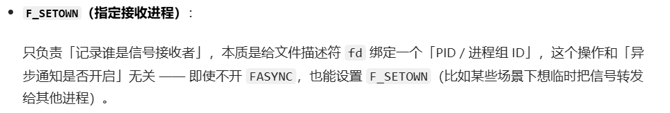
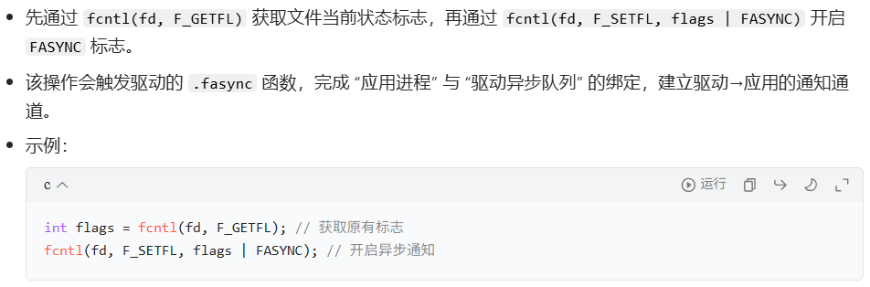
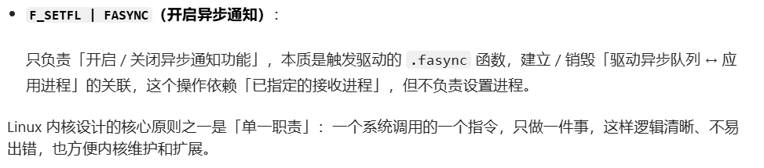
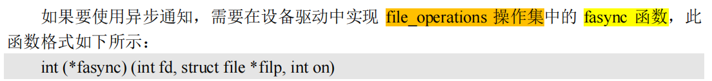
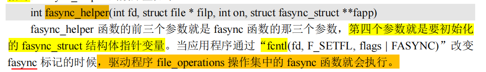
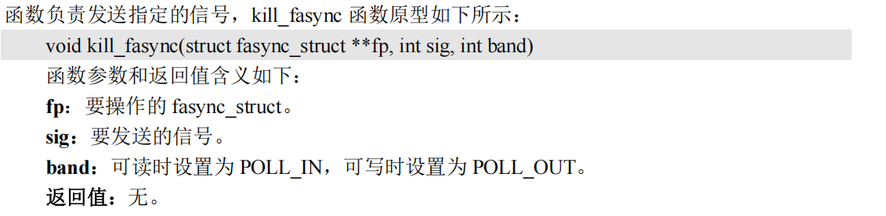

- [异步通知](#异步通知)
  - [介绍](#介绍)
  - [信号 -- 异步通知的核心](#信号----异步通知的核心)
    - [linux支持的信号](#linux支持的信号)
    - [api](#api)
      - [用户态api](#用户态api)
        - [**总结**：**应用程序对异步通知的处理**：](#总结应用程序对异步通知的处理)
      - [驱动层api](#驱动层api)
        - [异步通知结构体（信号）定义](#异步通知结构体信号定义)
        - [api](#api-1)
        - [demo](#demo)

# 异步通知
## 介绍
前面我们学习了**中断**，这是**处理器提供**的一种**异步机制** 
- （cpu干自己的事情，突然来一个硬件中断）

后面又学习**用户态**用**阻塞/非阻塞**的方式来**访问设备驱动**。
- 这里还是要求**用户态**程序去**主动访问**设备

---

现在内核提供了一种**软件层面**上的，**类似中断**一样的机制：**`信号`**
- **设备驱动**可以**主动通知**用户态应用程序。
- 是**软件层面**上对**中断的一种模拟**
- 根据后面的api:
  - 可以把信号这个异步通知机制，想象成是用户态程序和驱动程序之间**建立的一个通知通道**
    - 用户态来建立连接
    - 内核态支持信号

---

- **阻塞/非阻塞**（用户态主动访问驱动）
- **异步通知**（驱动通知用户态）

这些都是针对不同场合提出来的不同的解决办法，按需选择


## 信号 -- 异步通知的核心
linux为了实现异步通知，提供了一个信号的机制。定义在`arch/xtensa/include/uapi/asm/signal.h`中。内部定义了**linux所支持的所有信号**
### linux支持的信号
```c
#define SIGHUP     1   /* 终端挂起或控制进程终止              */
#define SIGINT     2   /* 终端中断(Ctrl+C组合键)                */
#define SIGQUIT    3   /* 终端退出(Ctrl+\组合键)                */
#define SIGILL     4   /* 非法指令                              */
#define SIGTRAP    5   /* debug使用，有断点指令产生              */
#define SIGABRT    6   /* 由abort(3)发出的退出指令               */
#define SIGIOT     6   /* IOT指令                               */
#define SIGBUS     7   /* 总线错误                              */
#define SIGFPE     8   /* 浮点运算错误                          */
#define SIGKILL    9   /* 杀死、终止进程                         */
#define SIGUSR1    10  /* 用户自定义信号1                        */
#define SIGSEGV    11  /* 段违例(无效的内存段)                   */
#define SIGUSR2    12  /* 用户自定义信号2                        */
#define SIGPIPE    13  /* 向非读管道写入数据                     */
#define SIGALRM    14  /* 闹钟                                  */
#define SIGTERM    15  /* 软件终止                              */
#define SIGSTKFLT  16  /* 栈异常                                */
#define SIGCHLD    17  /* 子进程结束                            */
#define SIGCONT    18  /* 进程继续                              */
#define SIGSTOP    19  /* 停止进程的执行，只是暂停               */
#define SIGTSTP    20  /* 停止进程的运行(Ctrl+Z组合键)           */
#define SIGTTIN    21  /* 后台进程需要从终端读取数据             */
#define SIGTTOU    22  /* 后台进程需要向终端写数据               */
#define SIGURG     23  /* 有"紧急"数据                          */
#define SIGXCPU    24  /* 超过CPU资源限制                       */
#define SIGXFSZ    25  /* 文件大小超额                           */
#define SIGVTALRM  26  /* 虚拟时钟信号                           */
#define SIGPROF    27  /* 时钟信号描述                           */
#define SIGWINCH   28  /* 窗口大小改变                           */
#define SIGIO      29  /* 可以进行输入/输出操作                  */
#define SIGPOLL    SIGIO /* 可轮询事件(等同于SIGIO)                */
/* #define SIGLOS    29 */
#define SIGPWR     30  /* 断点重启                              */
#define SIGSYS     31  /* 非法的系统调用                         */
#define SIGUNUSED  31  /* 未使用信号                             */
```

除了 `SIGKILL(9)`和 `SIGSTOP(19)`这两个信号**不能被忽略外**，**其他的信号都可以忽略**。

这些信号就**相当于中断号**，不同的中断号代表了不同的中断，不同的中断所做的处理不同，因此，驱动程序可以通过**向应用程序发送不同的信号**来实现不同的功能
> 就是驱动发送**信号（指令）**，通知应用程序进入“中断”，执行“用户态中断处理函数”

### api
#### 用户态api
- **`signal()`** : 设置**指定信号的处理函数**
  - 
- **`handler`**: **信号(中断)处理函数**
  - 
- **`fcntl系统调用`**： 调用驱动中提供的接口`.fasync` 来配置信号通道
  - 

---
##### **总结**：**应用程序对异步通知的处理**：
- **信号处理初始化（核心前提）**
  - 
- **指定信号接收进程（关键：告诉内核 “发给谁”）**
  - 
  - >
- **开启文件异步通知功能（关键：建立通知通道）**
  - 
  - > 

我们可以通过这两个函数，在用户态的代码里面，重载一些信号的回调函数，比如:
- `ctrl-c` : 信号`SIGINT`
- `kill -9 PID`: 信号`SIGKILL`
```c
#include "stdlib.h"
#include "stdio.h"
#include "signal.h"

void sigint_handler(int num)
{
    printf("\r\nSIGINT signal!\r\n");
    exit(0);
}

int main(void)
{
    signal(SIGINT, sigint_handler);
    while(1);
    return 0;
}
```

#### 驱动层api
##### 异步通知结构体（信号）定义
linux内核中，定义了结构体`fasync_struct`:
```c
struct fasync_struct {
    spinlock_t fa_lock;
    int magic;
    int fa_fd;
    struct fasync_struct *fa_next;
    struct file *fa_file;
    struct rcu_head fa_rcu;
};
```
一般在**设备结构体里面**，增加这样一个结构体变量（就像让这个结构体，有一个**发送信号的功能**一样）
```c
struct imx6uirq_dev {
    struct device *dev;
    struct class  *cls;
    struct cdev    cdev;
    /* ...... */
    struct fasync_struct *async_queue; /* 异步相关结构体 */
};
```
##### api
- **`.fasync`**: 设备文件的操作方法之一
  - 是**提供给应用层来配置信号**的接口。
  - 
  - 内部调用`fasync_helper`来**初始化**设备结构体里面的**信号功能结构体变量**
- **`fasync_helper()`**
  - 
- **`kill_fasync()`**: **驱动向用户态程序发送指定信号**
  - 

##### demo
```c
#include <linux/fs.h>
#include <linux/cdev.h>
#include <linux/fcntl.h>

// 设备结构体定义
struct xxx_dev {
    /* ...... 其他设备成员变量 */
    struct fasync_struct *async_queue; /* 异步通知核心结构体 */
};

// 异步通知处理函数
static int xxx_fasync(int fd, struct file *filp, int on)
{
    struct xxx_dev *dev = (struct xxx_dev *)filp->private_data;
    
    // 内核辅助函数：维护异步通知队列（创建/删除/更新）
    if (fasync_helper(fd, filp, on, &dev->async_queue) < 0)
        return -EIO;
    
    return 0;
}

// 设备文件释放函数（关闭文件时清理异步通知）
static int xxx_release(struct inode *inode, struct file *filp)
{
    // 调用fasync，传入fd=-1、on=0：删除该文件的异步通知注册
    return xxx_fasync(-1, filp, 0);
}

// 文件操作集（注册fasync和release接口）
static struct file_operations xxx_ops = {
    /* ...... 其他文件操作接口（如read、write、open等） */
    .fasync  = xxx_fasync,  // 异步通知注册/更新入口
    .release = xxx_release, // 设备文件关闭时的清理入口
};
```