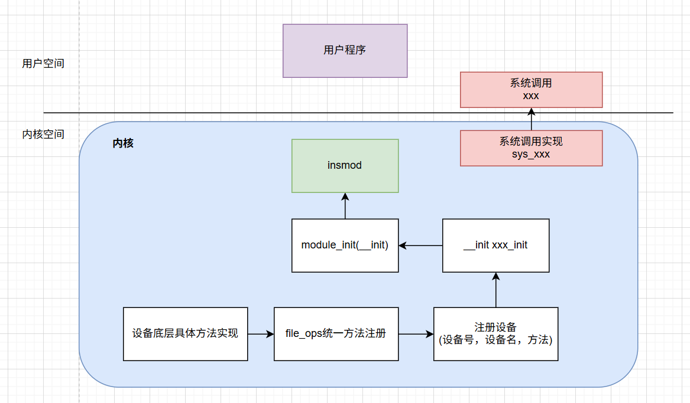
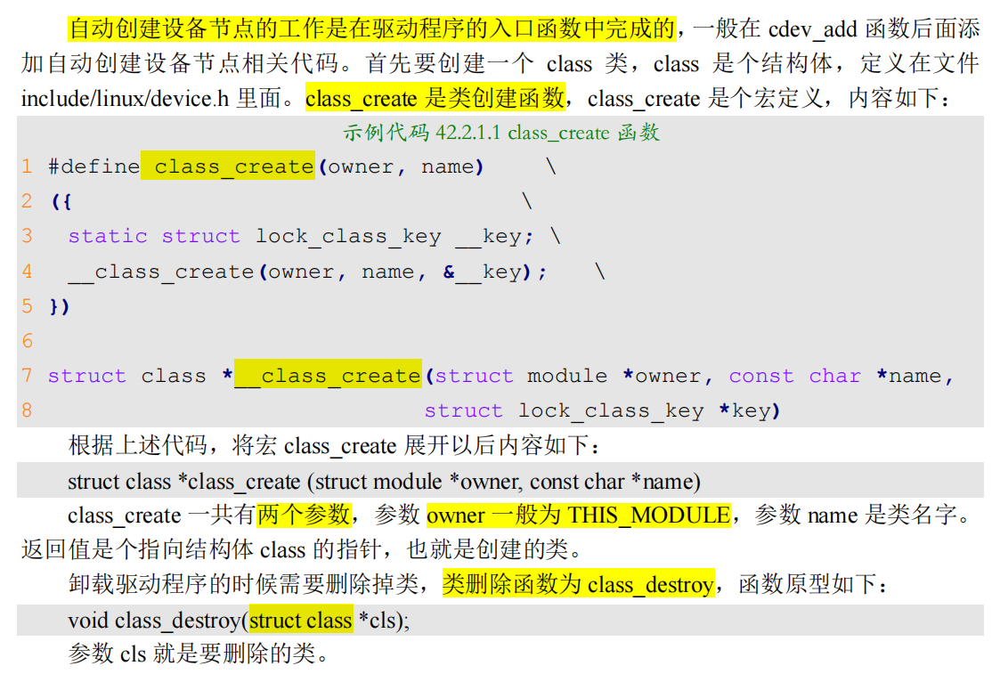
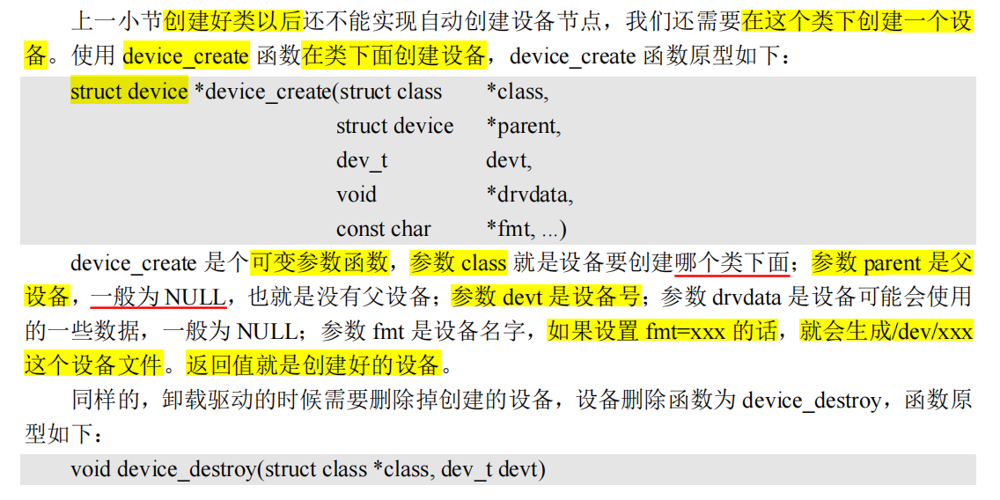
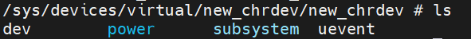

- [新字符设备驱动](#新字符设备驱动)
  - [复盘](#复盘)
  - [新字符设备驱动原理](#新字符设备驱动原理)
    - [分配和释放设备号](#分配和释放设备号)
    - [新的字符设备注册方法](#新的字符设备注册方法)
  - [自动创建设备节点](#自动创建设备节点)
    - [mdev机制](#mdev机制)
    - [创建和删除类](#创建和删除类)
    - [创建设备](#创建设备)
- [**前面记录的有点乱，这里整体总结一下**](#前面记录的有点乱这里整体总结一下)
- [疑问回答](#疑问回答)
  - [设备号：主号与次号的本质](#设备号主号与次号的本质)
  - [cdev 注册：为什么不能直接赋值？](#cdev-注册为什么不能直接赋值)
  - [设备节点、类、设备的三角关系](#设备节点类设备的三角关系)
  - [为什么创建设备节点，既需要创建类，又需要创建设备？](#为什么创建设备节点既需要创建类又需要创建设备)
    - [`/sys(sysfs)` 到底是什么](#syssysfs-到底是什么)
    - [class\_create必须吗](#class_create必须吗)
    - [设备名到底和谁绑定？](#设备名到底和谁绑定)
    - [驱动程序各个部分的调用绑定逻辑](#驱动程序各个部分的调用绑定逻辑)
    - [我们自定义的设备结构体要如何理解物理意义](#我们自定义的设备结构体要如何理解物理意义)

# 新字符设备驱动
## 复盘
之前学的是内核加载模块（驱动程序），下面总结一下他的整个逻辑


关于**insmod的内部具体的内核加载模块的逻辑**，可以详细看看linux设备驱动程序开发这本书，里面有什么层叠技术，底层需要比对模块和内核源码的**版本关系**，然后开辟一段内存，把代码段拷贝到这段内存里面。且模块和内核一起**共用内核栈**，所以驱动程序里面也要避免使用大的临时变量，如有必要，必须要用**动态内存分配**，而且，驱动程序必须要主动释放占用资源。针对SMP，要保证**可重入性**

关于驱动程序和应用程序的一个不同点，昨天看到的。

进入驱动程序的途径，目前有两个：
- 系统调用：
- 中断
> 所以驱动程序的编写不是应用程序的顺序逻辑，本质上是并发编程。


之前学习的register_chrdev注册设备的api已经过时了，现在看看新版的api
## 新字符设备驱动原理
### 分配和释放设备号

`register_chrdev`的缺点：
- **提前知道**设备号
- 主设备号表示驱动程序，次设备号表示使用这个程序的设备
  - 所以主设备号绑定驱动后，**次设备号全是这种设备了。浪费**

> 一个led设备肯定只能有一个主设备号，一个次设备号。


```
注意，之前这里没有申请设备号这个概念，只是注册设备（默认已知设备号的前期），所以这一小节是要解决如何获取设备号的问题，注册设备在下面一小节
```


**解决办法**：**使用设备号的时候，向linux内核申请**，需要多少，就申请多少，由linux内核分配设备可以使用的设备号。

**注册设备时，自动申请设备号**
```c
//没有指定设备号，用这个api来申请设备号
int alloc_chrdev_region(dev_t *dev, unsigned baseminor, unsigned count, const char *name)

//给定了设备的主设备号和次设备号，用这个api
int register_chrdev_region(dev_t from, unsigned count, const char *name)
/*
参数 from 是要申请的起始设备号，也就是给定的设备号；
参数 count 是要申请的数量，一般都是一个；
参数 name 是设备名字
*/
```

注销设备时，自动释放设备号
```c
void unregister_chrdev_region(dev_t from, unsigned count)
```

使用模板：
```c
int major; /* 主设备号 */
int minor; /* 次设备号 */
dev_t devid; /* 设备号 */

if (major) { /* 定义了主设备号 */
    devid = MKDEV(major, 0); /* 大部分驱动次设备号都选择 0*/
    register_chrdev_region(devid, 1, "test");
} else { /* 没有定义设备号 */
    alloc_chrdev_region(&devid, 0, 1, "test"); /* 申请设备号 */
    major = MAJOR(devid); /* 获取分配号的主设备号 */
    minor = MINOR(devid); /* 获取分配号的次设备号 */
}
```

### 新的字符设备注册方法

**字符设备结构**

linux中使用`cdev`结构体表示一个**字符设备**。定义在`include/linux/cdev.h`
```c
struct cdev {
    struct kobject kobj;
    struct module *owner;
    const struct file_operations *ops;          //设备文件操作函数集合
    struct list_head list;
    dev_t dev;                                  //设备号
    unsigned int count;
};
```

编写字符设备驱动之前需要定义一个 cdev 结构体变量，这个变量就表示一个字符设备
```c
struct cdev chrdevbase;
```
---

**cdev_init函数**

前面我们定义了cdev变量，之后就要初始化。
```c
//字符设备变量初始化
void cdev_init(struct cdev *cdev, const struct file_operations *fops)


//示例如下：
struct cdev testcdev;

/* 设备操作函数 */
static struct file_operations test_fops = {
    .owner = THIS_MODULE,
    /* 其他具体的初始项 */
};

testcdev.owner = THIS_MODULE;
cdev_init(&testcdev, &test_fops); /* 初始化 cdev 结构体变量 */
```

---


**cdev_add函数**

向 Linux 系统添加字符设备(cdev 结构体变量)(这个才是最后的注册设备，init填写操作函数集合)


```c
int cdev_add(struct cdev *p, dev_t dev, unsigned count)
/*
p指向添加的字符设备cdev
dev是申请的设备号
count是要添加的设备数量
*/

//举例
struct cdev testcdev;

/* 设备操作函数 */
static struct file_operations test_fops = {
    .owner = THIS_MODULE,
    /* 其他具体的初始项 */
};

testcdev.owner = THIS_MODULE;
cdev_init(&testcdev, &test_fops); /* 初始化 cdev 结构体变量 */
cdev_add(&testcdev, devid, 1); /* 添加字符设备 */
```
---

cdev_del函数

这个肯定就是注销设备的函数了，用来**从linux内核删除相应的字符设备**。

```c
void cdev_del(struct cdev *p)

//出口函数里面直接注销就行了
cdev_del(&testcdev); /* 删除 cdev */
```


## 自动创建设备节点
之前，我们
- insmod驱动模块后
  - 内核加载了驱动模块
  - 注册了字符设备（里面绑定了设备号，操作函数）
- 还需要**手动mknod创建设备节点**

现在想要自动创建设备节点。在insmod/modprobe加载模块成功后，就会自动在/dev目录下创建对应的设备文件。

### mdev机制
**`udev` 是一个用户程序**，在 Linux 下通过 udev 来**实现设备文件的创建与删除**，udev 可以**检测系统中硬件设备状态**，可以根据系统中硬件设备状态来创建或者删除设备文件.

`busybox`里面，可以创建**udev的简化版-`mdev`**

> mdev 来实现设备节点文件的自动创建与删除，Linux 系统中的**热插拔事件**也由 `mdev 管理`

在`/etc/init.d/rcS` 这个系统开机启动文件中增加这一句，来设置热插拔事件由mdev来管理。
```c
echo /sbin/mdev > /proc/sys/kernel/hotplug
```

### 创建和删除类
**自动创建设备节点**的工作是在驱动程序的**入口函数中完成的**，一般在 `cdev_add` 函数**后面添加自动创建设备节点相关代码**
> 所以不是全自动，是驱动里面手动添加的




### 创建设备


> 可以看到，原来我们创建设备节点，只要mknod，现在要在驱动里面实现设备节点随驱动模块一起创建注销。还是相对比较复杂
>
> 要**先创建类**，然后再**在这个类下面创建设备**，这样才能实现**创建设备节点**


# **前面记录的有点乱，这里整体总结一下**
总的来说，新字符设备驱动开发，主要就是3件事情：
- **申请设备号**
  - `alloc_devid_region`(设备号个数，设备名称)
- **注册cdev字符设备**
  - `cdev_init`
  - `cdev_add`
- **创建设备节点**
  - `class`
  - `device`

先自己自定义一个结构体, 整理一下要做的事情，这样不容易乱
```c
struct new_dev {		
	//设备号
	dev_t devid;
	int major;
	int minor;

	//注册设备
	struct cdev _cdev;

	//创建设备节点
	struct class * _class;
	struct device * _device;
} newchrdev;

```

下面是我自己写的一个demo，用于构建一个虚拟字符设备，以及对应的驱动程序
```c
#include <linux/types.h>
#include <linux/kernel.h>
#include <linux/ide.h>
#include <linux/init.h>
#include <linux/module.h>
#include <linux/errno.h>
#include <linux/cdev.h>
#include <linux/device.h>

struct class* my_class;
struct device * my_device;
dev_t devid;
struct cdev my_test_device;

//设备号申请数量(申请设备号，注册字符设备)
#define NEWCHRDEV_CNT	1

/*设备名字
 * (申请设备号
 * -，
 * 创建设备节点
 * 		类名 = NEWCHRDEV_NAME,
 * 		设备名 = NEWCHRDEV_NAME,
 * )
 * */
#define NEWCHRDEV_NAME	"new_chrdev"
struct new_dev {		
	//设备号
	dev_t devid;
	int major;
	int minor;

	//注册设备
	struct cdev _cdev;

	//创建设备节点
	struct class * _class;
	struct device * _device;
} newchrdev;

static int test_open(struct inode *inode, struct file *filp)
{
	printk("this is open!\r\n");
	filp->private_data = &newchrdev;
	return 0;
}

static ssize_t test_read(struct file *filp, char __user *buf, size_t cnt, loff_t *offt)
{
	printk("mytest read!\r\n");
	return 0;
}

static ssize_t test_write(struct file *filp, const char __user *buf, size_t cnt, loff_t *offt)
{
	printk("mytest write!\r\n");
	return 0;
}

static int test_release(struct inode *inode, struct file *filp)
{
	printk("chrdevbase release！\r\n");
	return 0;
}
/*
 * 设备操作函数结构体
 */
static struct file_operations test_fops = {
	.owner = THIS_MODULE,	
	.open = test_open,
	.read = test_read,
	.write = test_write,
	.release = test_release,
};


static int __init test_init(void)
{
	//设备号, 直接申请
	alloc_chrdev_region(&(newchrdev.devid), 0, NEWCHRDEV_CNT, NEWCHRDEV_NAME);
	newchrdev.major = MAJOR(newchrdev.devid);
	newchrdev.minor = MINOR(newchrdev.devid);
	printk("newchrdev alloc devid, major = %d, minor = %d\r\n", newchrdev.major, newchrdev.minor);

	//注册字符设备
	newchrdev._cdev.owner = THIS_MODULE;
	cdev_init(&(newchrdev._cdev), &test_fops);
	cdev_add(&(newchrdev._cdev), newchrdev.devid, NEWCHRDEV_CNT);


	//自动创建设备节点
	newchrdev._class = class_create(THIS_MODULE, NEWCHRDEV_NAME);
	if(IS_ERR(newchrdev._class)){
		return PTR_ERR(newchrdev._class);
	}

	newchrdev._device = device_create(newchrdev._class, NULL, newchrdev.devid, NULL, NEWCHRDEV_NAME);
	if(IS_ERR(newchrdev._device)){
		return PTR_ERR(newchrdev._device);
	}

	return 0;
}

static void __exit test_exit(void)
{

	//注销devid
	unregister_chrdev_region(newchrdev.devid, NEWCHRDEV_CNT);
	
	//注销字符设备
	cdev_del(&(newchrdev._cdev));

	//取消设备节点
	device_destroy(newchrdev._class, newchrdev.devid);
	class_destroy(newchrdev._class);
}

module_init(test_init);
module_exit(test_exit);

MODULE_LICENSE("GPL");
MODULE_AUTHOR("liangji");
```

# 疑问回答
## 设备号：主号与次号的本质
- **主设备号（Major）**：代表**哪一类**设备。
  - **内核通过主设备号来定位对应的驱动程序**。你可以把它理解为“部门编号”，比如200号部门专门管LED。
- **次设备号（次要）**：代表该类设备里的**哪一个**。
  - 如果你的板上有4个LED：0,1,2,3。

- **申请多个设备号**：
  - 当你申请 `NEWCHRDEV_CNT = 1` 时，内核分配给你一个 (Major, Minor)；
  - 如果你申请 `10 个`，内核会分配给你`一个 Major`，以及从 `Minor 到 Minor+9 `的连续次设备号。

## cdev 注册：为什么不能直接赋值？
>cdev字符设备的注册，我只是cdev_init，绑定了操作函数的集合，为啥我不直接赋值cdev的那个变量？然后我就直接cdev_add注册设备了。但是我发现cdev里面还有什么kobject这些变量，**为啥这些都不需要**。


你疑惑为什么不直接 `newchrdev._cdev.ops = &test_fops`？

- **`cdev_init` 的作用**：
  - 它不仅是绑定 `fops`
  - 更重要的是**初始化 `cdev` 结构体内部的 `kobject`**。
    - `kobject` 是内核用来实现**引用计数**、**层次结构**(sysfs)的核心工具。

- **隐藏的逻辑**：
  - 内核有很多链表和树状结构。
  - cdev_init 会清零结构体并初始化内部的小零件，
  - 而 cdev_add 则是正式把这个对象推入内核的“设备管理大图”中。
  - 如果你**手动赋值而漏掉了内部零件的初始化**，内核在查找驱动时就会崩溃。

## 设备节点、类、设备的三角关系
> 为什么要设备节点？ 

**用户空间的程序**（如你的 main.c）**无法直接访问内核函数**。用户只认**文件路径**（/dev/xxx）。`设备节点`就是**用户空间的门，内核空间的窗**。

**类 (Class) 与 设备 (Device)**：

- `class_create`：
  - 在 `/sys/class/` 目录下**创建一个文件夹**。这是为了告诉系统：“**我这类设备叫这个名字**”。

- `device_create`：
  - 这步最关键。它会触发内核发送一个 "`uevent`" 信号。
  - 应用层的一个**守护进程**（`mdev` 或 udev）收到信号后，会根据信息自动在 `/dev/` 目录下创建一个对应的文件。

重名问题：类名和设备名可以重名，但在 /dev/ 下最终可见的是 device_create 里的名字。

## 为什么创建设备节点，既需要创建类，又需要创建设备？
简单来说：**不创建 class 驱动确实能跑**，但你会**失去自动化**带来的所有便利

### `/sys(sysfs)` 到底是什么
/sys 挂载的是 `sysfs` **虚拟文件系统**, 作用：
- 相当于内核的实时数据库和**档案登记处**
- 内容：以树状结构暴露**内核里面所有的对象(kobjects),总线,驱动,类**
- 如果在内核里面创建了`类`，`设备`，sysfs就会立刻生成**对应的文件夹，属性文件**

### class_create必须吗
因为用户程序利用系统调用，只和/dev下的设备节点打交道，为什么还要在/sys下创建类

当我们`class_create`，和`device_create`时：
- 内核发送信号：内核在**sysfs中登记信息**，并发送一个**uevent的广播**
- 用户**守护进程mdev**，监听到uevent信号
- `mdev`守护进程从`sysfs`中**读取信息**（找到设备号，设备名），替你在`/dev`下**创建节点动作**。


下面具体分析这两个的过程

- **`class_create`**(THIS_MODULE, `NEWCHRDEV_NAME`)
  - 指定了类名，在/sys/class下创建了一个叫new_chrdev的文件夹
  - 
- **`device_create`**(newchrdev.`_class`, NULL, newchrdev.`devid`, NULL, `NEWCHRDEV_NAME`)
  - 指定了类，设备号，设备名
  - 在`sysfs`中**建档**，**创建名为`dev`的文件**
    - dev的内容就是设备号，作为mdev查询兜底方案
  - 发送uevent信号（包含环境变量）
- **`mdev`接收`uevent`信号**，并读取环境变量
  - `ACTION=add`，要创建节点
  - `DEVNAME=new_chrdev`, 设备节点叫什么
  - **设备号**
  - 所属**类**/子系统

```c
驱动程序 (test.c)               Linux 内核 (Kernel)                用户空间 (User Space)
-----------------------       ----------------------------       ----------------------------
| 1. alloc_chrdev_region | --> | 生成 dev_t (200:0)        |
-----------------------       ----------------------------
                                          |
-----------------------       ----------------------------
| 2. class_create       | --> | 创建 /sys/class/new_chrdev |
-----------------------       ----------------------------
                                          |
-----------------------       ----------------------------       ----------------------------
| 3. device_create      | --> | 1. 创建 /sys/.../dev 文件  |       | 3. mdev 进程收到信号      |
|    (传入 devid)        |     | 2. 发送 uevent 广播        | ----> |    读取 MAJOR/MINOR 变量  |
-----------------------       |    (包含 MAJOR=200, ...)   |       | 4. 执行 mknod /dev/...    |
                              ----------------------------       ----------------------------
```


### 设备名到底和谁绑定？
> 为什么我的设备名这个字符串，在申请设备号的时候用到了，在创建设备节点的时候也用到了？这个设备名到底和什么绑定在一起？就是：设备（注册的cdev），设备节点文件（类，设备），设备号（主设备号，次设备号），设备名，和我的一个具体的设备，我的外设驱动程序，他们的绑定关系是什么？另外，代码里面自己自定义了一个结构体变量，newchrdev， 这个是代表一个具体的物理设备，还是别的？

- `alloc_chrdev_region` 里的名字：出现在 `/proc/devices` 中，方便你查看主设备号分配情况
- **`device_create`** 里的名字：出现在 `/dev/` 目录下，是**用户 open 时填写的路径**


### 驱动程序各个部分的调用绑定逻辑
```c
用户空间 (User Space)                  内核空间 (Kernel Space)                硬件 (Hardware)
---------------------------------------------------------------------------------------
                                                                      
  fd = open("/dev/new_chrdev")                                           
          |                                                           
          | 1. 根据路径找到 Inode                                        
          v                                                           
    [ 设备节点文件 ] ---------------------> [ VFS (虚拟文件系统) ]           
    (带有 Major:Minor)                         |                      
                                              | 2. 查表查找 cdev         
                                              v                      
                                        [ cdev_map 哈希表 ]           
                                              |                      
          +-----------------------------------+                      
          | 3. 提取对应的 file_operations                                
          v                                                           
    [ test_fops 结构体 ]                                               
    .open = test_open  <------------------ 4. 执行你的代码                 
    .write = test_write                                               
          |                                                           
          +----------------------------------------------------------> [ 物理寄存器 ]
                                                                       (ioremap后的地址)
---------------------------------------------------------------------------------------
    绑定关系总结：
    1. 设备号 (DevID) 是“胶水”：它把 [设备节点文件] 和 [cdev 驱动对象] 粘在一起。
    2. cdev 是“本体”：它持有了你的 [函数集合 (fops)]。
    3. struct new_dev 是“容器”：是你自定义的一个私有结构体，用来统一管理上面所有的东西。
```

### 我们自定义的设备结构体要如何理解物理意义
`struct new_dev newchrdev` 代表的是 “**软件层面的设备上下文**”。

- 在**简单**的驱动里，它代表**一个物理设备**。

- 在复杂的驱动里，比如你有 4 路串口，你可能会定义一个 struct my_uart_dev，然后定义一个数组 devs[4]。

> 核心技巧：在 `test_open` 里你写了 `filp->private_data = &newchrdev`;。这是一招妙棋！
> 
> 这意味着在以后的 read、write 函数中，你可以直接通过 `filp->private_data` **拿到这个结构体**，从而访问到该设备的所有状态信息（如设备号、寄存器基址等），这体现了面向对象的编程思想。
> 
> (**你打开谁就操作谁，不用管具体是哪个变量**)