- [设备树定义](#设备树定义)
- [没有设备树时，linux如何描述arm的板级信息](#没有设备树时linux如何描述arm的板级信息)
- [dts, dtb, dtc](#dts-dtb-dtc)
- [dts语法](#dts语法)
  - [.dtsi 头文件](#dtsi-头文件)
  - [设备节点](#设备节点)
  - [标准属性](#标准属性)
  - [根节点compatible属性](#根节点compatible属性)
    - [没有设备树之前，linux内核如何判断是否支持该板卡](#没有设备树之前linux内核如何判断是否支持该板卡)
    - [使用设备树之后的板卡匹配方法](#使用设备树之后的板卡匹配方法)
  - [向节点追加/修改内容](#向节点追加修改内容)
- [手写一个简单的dts](#手写一个简单的dts)
- [设备树在系统中体现](#设备树在系统中体现)
  - [特殊节点](#特殊节点)
    - [aliases](#aliases)
    - [chosen](#chosen)
- [linux内核如何解析dtb](#linux内核如何解析dtb)
- [如何添加硬件对应的节点：binding文件](#如何添加硬件对应的节点binding文件)
- [驱动里面如何获取dts的配置参数](#驱动里面如何获取dts的配置参数)
  - [查找节点](#查找节点)
  - [获取属性](#获取属性)
- [其他函数](#其他函数)

---

这一节开始学习设备树。新版本的linux中，arm相关的驱动全部采用了设备树。

# 设备树定义
用一个图清展示设备树的定义。
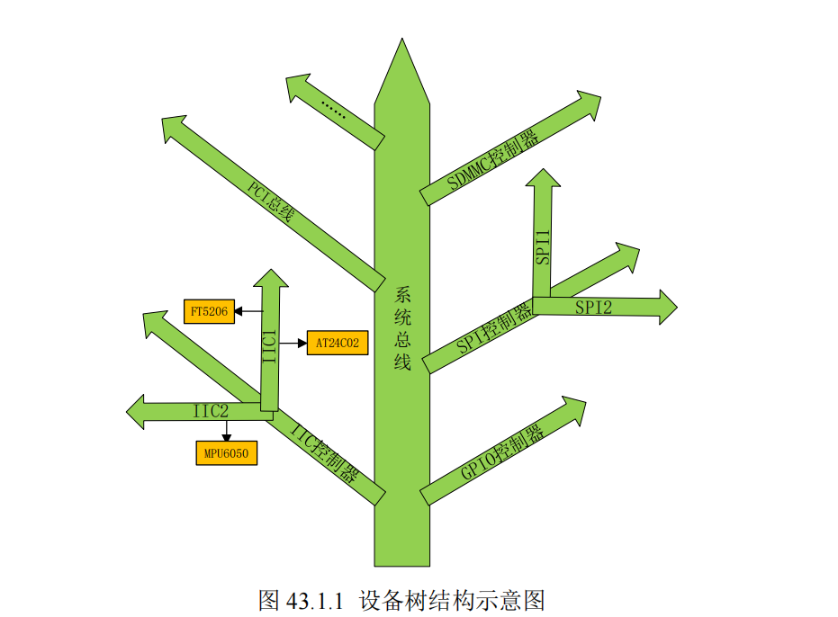

说白了，**设备树**，就是用**树状结构来描述板级设备**

# 没有设备树时，linux如何描述arm的板级信息
`arch/arm/mach-xxx`

`arch/arm/plat-xxx`

这些文件里面就是描述的对应平台下的板级信息

但是因为arm架构的芯片越来越多，板级信息文件指数级增长，，都是.c,.h被编译到内核里。太大了。


# dts, dtb, dtc
设备树的思想是：

把**板级硬件信息的内容从linux内核中分离出来**。用**专属的文件格式**来描述-------**设备树（.dts）**

一个**SOC**(如IMX6ULL)，可以做出不同的板子，从这些不同的板子中提取**共同的信息**，作为**通用文件(`.dtsi`)**。

---

所以**设备树的文件结构设计**为：

- **`SOC级信息`** (`.dtsi`)
  - > 几个CPU，主频，各个外设控制器信息
  - A板卡**板级信息** (`A.dts`)
    - > 哪些IIC设备(MPU5060),SPI设备
  - B板卡**板级信息** (`B.dts`)
  - ......
---

不同扩展名含义：

- **`.dts`**
  - 设备树源文件
- **`.dtb`**
  - 编译后的二进制文件
- **`dtc`**
  - `dts`文件的编译工具，在内核`scripts/dtc`下 
  - 内核`Makefile`支持：`make dtbs` 单独编译设备树文件
  - 需要在`arch/arm/boot/dts/Makefile`中把dts加入编译目标
    - > 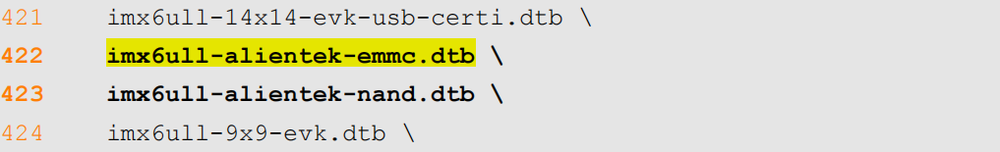


# dts语法
关于设备树，最重要的就是看懂他是如何把SOC的片内资源+板级信息组织成树状信息的。首先肯定要掌握dts的语法。

设备树的**核心思想**是：**把所有设备都看作一个设备节点挂在书上**

## .dtsi 头文件
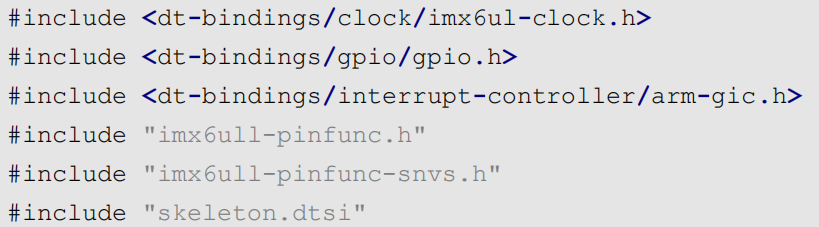
支持以下**头文件拓展**：
- `.h`
  - `arch/arm/boot/include/dt-bindings/gpio/gpio.h`
  - 定义一些高低电平的**宏**这些
- `.dtsi`
  - SOC内部外设信息，如`imx6ull.dtsi`
  - > 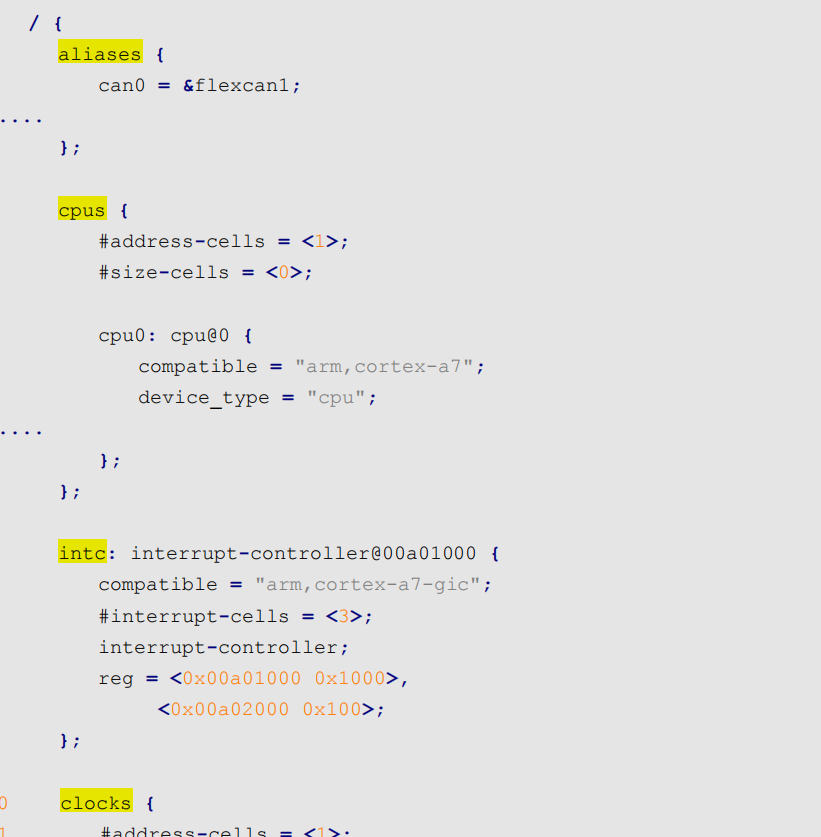
  - > 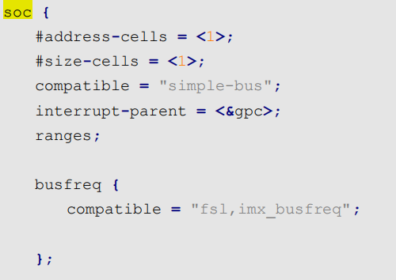
  - >  
  - > cpus处理器组里面，就一个cpu0，也就是我们的单核A7，还描述了支持的频率等。
  - > soc组里面描述了片内支持的外设，uart1-8,usbphy1-2这些。
- `.dts`

> 我们在编写设备树头文件的时候，最好选择.dtsi后缀。

## 设备节点
前面我们看到dts源码里面有很多 `xxx {};`为单位的内容，这些叫做`节点`

设备树是采用**树形结构**来描述**板子上的设备信息**的文件
- **节点**：
  - 每个设备都是一个节点，叫做**设备节点** 
- **属性**
  - 每个**节点**都通过**一些属性**信息来**描述节点信息**，
  - 属性就是**键—值对**
  - 
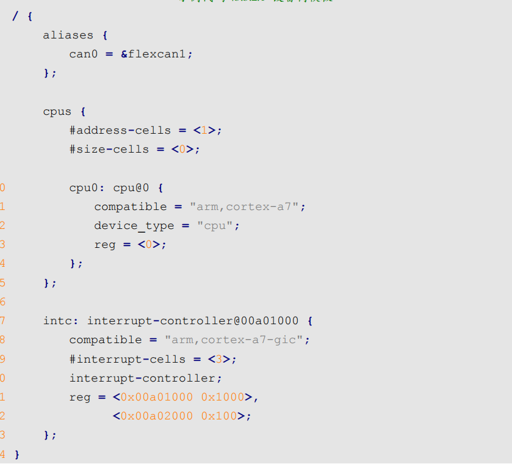

- `/` :**根节点**
  - > 每个dts只有一个根节点，多个设备树文件的根节点会合并成一个根节点
  - `aliases`: **常用设备子节点**
  - `cpus`：**处理器组子节点**
  - `intc`：**中断控制器子节点**
    - > 设备节点的语法规则如下：
    - > `label: node-name@unit-address`
      - > label：相当于汇编的别名，标签，可以在其他地方通过&label来访问节点
      - > node-name：节点名，为字符串，清晰描述节点功能
      - > unit-address, 设备地址/寄存器首地址，没有可以写0
    - **属性1**
    - **属性2**
    - ...
    - **属性n**
    - 
    - **子节点1**
    - ...
---
下面说一下设备树源码dts**常用的几种数据类型**
- **字符串(单个)**
  - `compatible = "arm,cortex-a7";`
- **uint32_t 整数(可多个)**
  - `reg = <0>`
- **字符串列表**
  - `compatible = "fsl,imx6ull-gpmi-nand", "fsl,imx6ul-gpmi-nand";`

## 标准属性
每个设备节点里面，肯定需要多个属性来描述这个设备的信息。但是不同设备需要的属性不同，**可以自定义**，但是有很多**标准属性**：

- `compatible`(**字符串**): **兼容性**
  - 表示选择的**驱动程序列表**
  - 通过加入这个列表，可以**指定/匹配**使用某个驱动
  - 命名规范：
    - `compatible = "厂商,驱动名称","厂商,驱动名称"`
    - `compatible = "fsl,imx6ul-evk-wm8960","fsl,imx-audio-wm8960";`
  - > 驱动程序会有一个**OF匹配表**，里面保存着**匹配索引的compatible值**，这样就能通过dts来使用某个驱动。
  - > 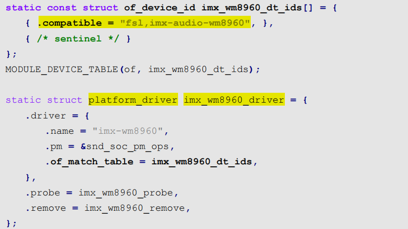
  - > `.of_match_table` 就是 **OF匹配表**
- `model`:(**字符串**):描述设备**模块信息，名字**
  - `model = "wm8960-audio";`
- `status`:(**字符串**):**设备状态**
  - 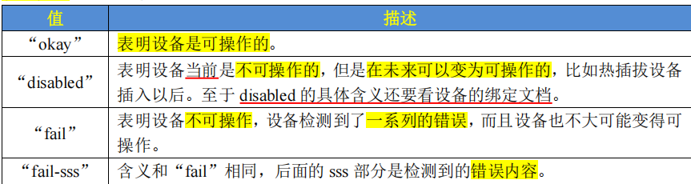
- `#address-cells, #size-cells`: **uint32_t**: 指定**子设备节点**中`reg`中信息字长
  - `#address-cells = <1>`, 表示reg的**地址信息**长1字(32bit)
  - `#size-cells = <1>`, 表示reg的**长度信息**长1字(32bit)
- `reg`：**(地址，长度)对**：**描述设备地址空间**
  - 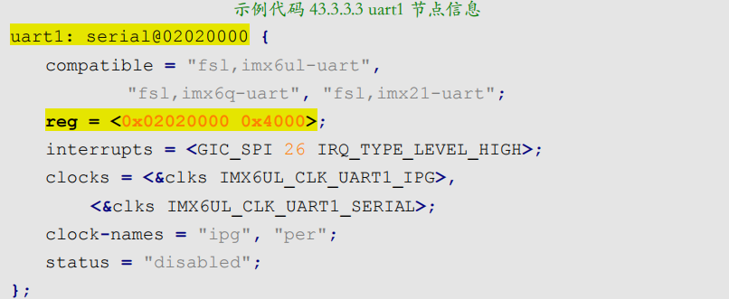
  - **描述uart1寄存器的首地址**(长度没有0x4000这么多，没用到)
- `ranges`: **地址映射/转换表**
  - `ranges = <子总线地址 父总线地址 子地址长度>`
  - 一般和**子节点reg**一起用，计算绝对物理地址，相当于一个**总体偏移地址**
    - > 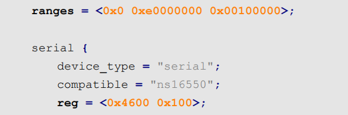
    - serial基地址 = `0xe0004600`
  - `ranges;` **为空**，表示子地址和父地址空间相同，不需要地址转换。
- `name`，**废弃**
- `device_type`，**废弃**

---

## 根节点compatible属性
下面讲一下，根节点的compatible属性，

前面说设备节点的这个属性是为了帮助匹配指定驱动程序

**根节点的compatible属性**是为了**让linux内核识别这个板卡自己支不支持**，相当于**给这个板卡(dtb)打一个mach_id**

### 没有设备树之前，linux内核如何判断是否支持该板卡
通过uboot向linux kernel传递machine_id。

linux内核会最终匹配`include/generated/mach-types.h`中定义的`machine_id`
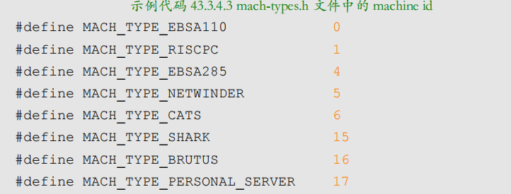

> 若匹配上，则说明内核支持这个板卡，否则就内核启动失败。

### 使用设备树之后的板卡匹配方法
通过dtb的**根节点的compatible属性值**，与`imx6ul_dt_compat`表中的任何一个值相等，表示linux内核支持此设备。

例如，打开`arch/arm/mach-imx/mach-imx6ul.c`
> 这些`mach-xxx`的文件夹，应该是**实现了linux内核的一些启动方法**，实现**针对某些SOC的板卡的初始化的功能**，这样才能让linux在某个SOC的系列板卡上跑起来, 也就是我们说的**linux支持这个设备/板卡**
>
> 里面可能有`imx6ul_map_io`，`imx6ul_init_machine`这些方法
> 
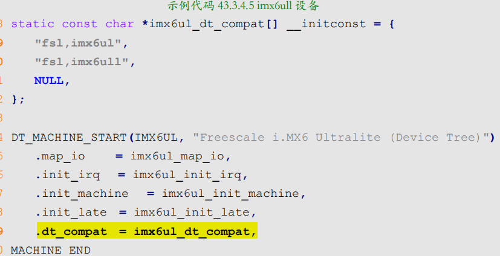
这个里面的`compat`就有"`fsl,imx6ul`"和"`fsl,imx6ull`"这两个兼容值

`compatible = "fsl,imx6ull-14x14-evk", "fsl,imx6ull";`
> 当dtb的根节点里面的compatible能匹配的上，就说明，这个板卡上能够正常启动内核

下面就分析一下linux内核具体是怎么匹配dtb里面的板卡ID和自己支持的compat表的。

- linux内核启动
  - `start_kernel`
    - `setup_arch`匹配machine_desc
      - `setup_machine_fdt`从dtb中获取目标machine_desc
        - of_flat_dt_match_machine匹配
          - of_get_flat_dt_root获取根节点
          - while匹配
          - 
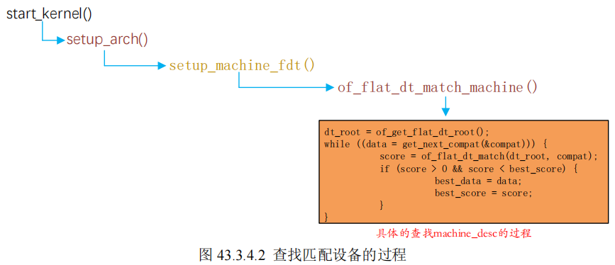


## 向节点追加/修改内容
如果我们i2c1连接的设备被替换了，我们肯定要修改dts

在dtsi中，会有对i2c1这个外设的SOC级的描述，包括：
- `compatible`: **指定imx6ul的i2c驱动**
- `reg`： 指定i2c1的寄存器基地址
- `interrupts`: 指定中断控制器？
- `clocks`：指定输入时钟
- `status` 默认状态，在dtsi中关闭，dts中打开
- 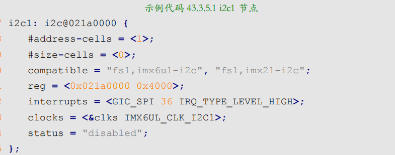

在dts中，我们会增加**追加节点**，`&i2c1 {}`
- 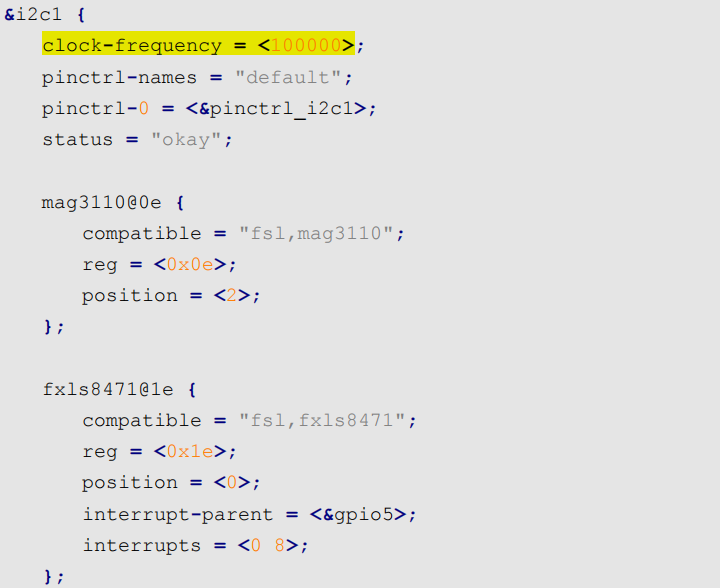
- 在dts中打开i2c，或者修改时钟等，为实际外部设备指定高一层的外设bsp驱动。


# 手写一个简单的dts
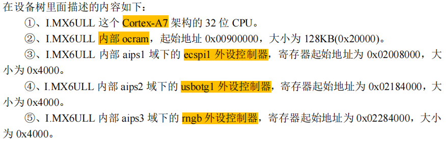

一定要对**片内的设备**进行分类：
- **IMX6ULL处理器**
  - **处理器组`cpus`**
    - a7内核cpu0
    - ...其他处理器
  - **片内资源组`soc`**
    - 内部ram
      - 地址范围
      - 其他属性
    - A域片内外设组
      - i2c
        - 地址范围
        - 其他属性
      - uart
        - 地址范围
        - 其他属性
      - ...
    - B域片内外设组
      - usb
        - 地址范围
        - 其他属性
      - eth
        - 地址范围
        - 其他属性
      - ...
    - ...

```c
// my first dts
/ {
		//根节点的兼容属性，目的是让linux内核判断能够启动这个板子
		compatible = "fsl,imx6ull-alientek-evk","fsl,imx6ull";
		
		//核心
		cpus {
			#address-cells = <1>;
			#size-cells = <0>;

			//cpu0子结点
			cpu0: cpu0@0 {
				compatible = "arm,cortex-a7";
				device_type = "cpu";
				reg = <0>;
			};
		};


		//片内外舍组
		soc {
			#address-cells = <1>;
			#size-cells = <1>;
			compatible = "simple-bus";
			ranges;

			//ocram子结点
			ocram: sram@00900000 {
				compatible = "fsl, lpm-sram";
				reg = <0x00900000 0x20000>;
			};

			//aips1域节点
			aips1: aips-bus@02000000 {
				compatible = "fsl,aips-bus","simple-bus";
				#address-cells = <1>;
				#size-cells = <1>;
				reg = <0x02000000 0x100000>;
				ranges;

				ecspi1: ecspi@02008000 {
					#address-cells = <1>;
					#size-cells = <0>;
					compatible = "fsl,imx6ul-ecspi","fsl,imx51-ecspi";
					reg = <0x02008000 0x4000>;
					status = "disabled";
				};

				
			};
		
			//aips2域节点
			aips2: aips-bus@02100000 {
				compatible = "fsl,aips-bus","simple-bus";
				#address-cells = <1>;
				#size-cells = <1>;
				reg = <0x02100000 0x100000>;
				ranges;

				usbotg1: usb@02184000 {
					compatible = "fsl,imx6ul-usb","fsl,imx27-usb";
					reg = <0x02184000 0x4000>;
					status = "disabled";
				};
			};

			//aips3域节点
			aips3: aips-bus@02200000 {
				compatible = "fsl,aips-bus","simple-bus";
				#address-cells = <1>;
				#size-cells = <1>;
				reg = <0x02200000 0x100000>;
				ranges;

				rngb: rngb@02284000 {
					compatible = "fsl,imx6sl-rng","fsl,imx-rng","imx-rng";
					reg = <0x02284000 0x4000>;
				};
			};
		};
};

```


# 设备树在系统中体现
linux内核在启动的时候，肯定会解析设备树节点。

`kernel`支持在`rootfs`的`/proc/devicetree/`下用**文件目录的形式**具体**展示出他解析的设备树**。
> 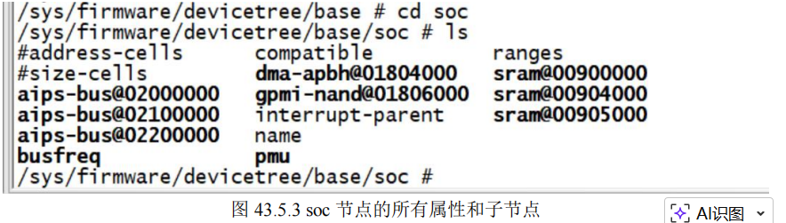

## 特殊节点
这个解析出来的dtb，有两个特别的节点
### aliases
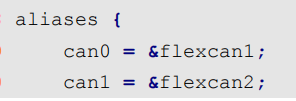
> **就是起个别名**，方便你识别出来我们用的哪个外设，和label没什么区别
### chosen
这个节点不是代表一个真实的设备，主要用于记录**uboot向linux内核传递的数据**。

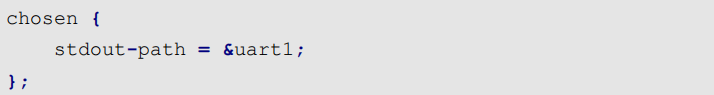
我们自己写的dts中，chosen中只有一个属性：指定标准输出为串口。

但是当我们实际在`/proc/devicetree`中读出来发现多了`bootargs`。

不卖关子，直接说答案
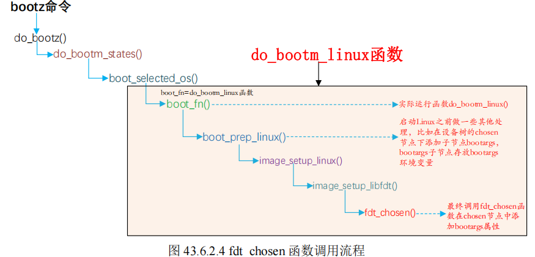
> 实际上这个是uboot在执行bootz 80800000 - 83000000的时候，从dtb中解析出chosen节点，然后把他的bootargs写入这个dtb的。

# linux内核如何解析dtb
我们用设备树描述了板卡的所有设备。那么很好奇，linux是怎么解析这个dtb的

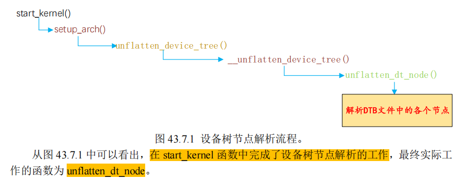

整理一下就行，无需过多关注

# 如何添加硬件对应的节点：binding文件
`Documentation/devicetree/bindings`

源码提供了针对：
- 不同设备（i2c/）
  - 不同SOC（i2c-imx.txt）
  - > 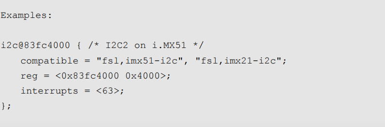

提供了教程和案例，如果没有，和供应商要


# 驱动里面如何获取dts的配置参数
我在**dts里面配置了很多属性参数**，有
- uint32_t
- 字符串
- 字符串数组

那么我们**驱动是如何获取的呢**？

> 比如dts中reg配置了寄存器的地址范围，驱动中如何获取？

答：
> linux内核给我们提供了一系列`of_`开头的函数，来获取dts设备节点的内容, 叫做**OF函数**
>
> `include/linux/of.h`

## 查找节点
我驱动肯定要找到这个设备节点，然后才能拿里面的属性值。

linux内核在`include/linux/of.h`中定义了设备节点的结构体
> 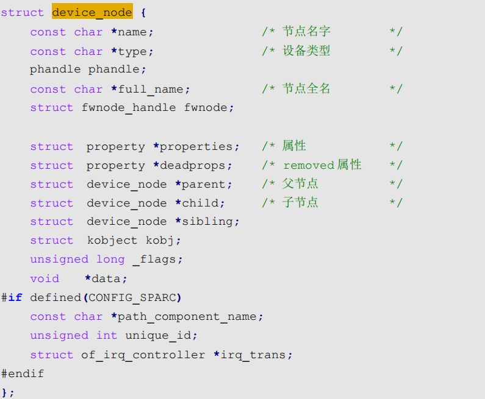
>
> 可以看到每个节点，有一个struct property*的属性指针，指向所有的属性。
>
> 看这个结构体设计，估计是一个双向链表
---
**总结一下查找节点函数**
- `of_find_node_by_name`
  - 节点名查找
- `of_find_node_by_type`
  - device_type属性查找
- `of_find_compatible_node`
  - device_type, compatible查找
- `of_find_matching_node_and_match`
  - 通过of_device_id查找谁能用这个驱动
- `of_find_node_by_path`
  - 指定节点的路径 `/backlight`

**查找父/子节点的OF函数**
- `of_get_parent`
  - 获取父节点
- `of_get_next_child`
  - 获取下一个子节点

## 获取属性
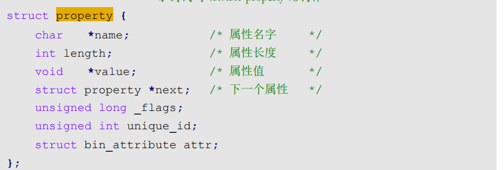

整理一下
- of_find_property
  - 查找指定属性
- of_property_count_elems_of_size
  - 获取属性中元素个数
  - reg是键值对数组，这个就能获得数组长度
- of_property_read_u32_index
  - 从属性中，获取指定标号的u32数据
- 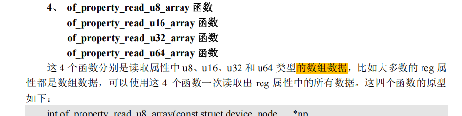
- 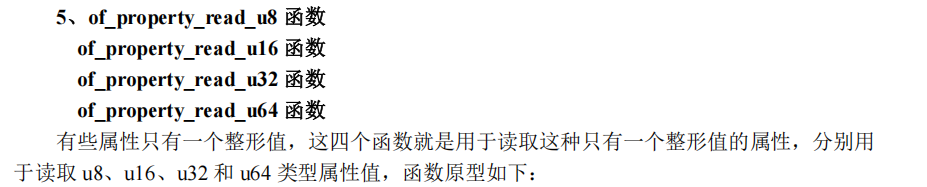
- 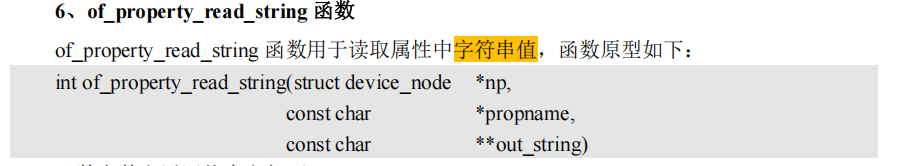
- 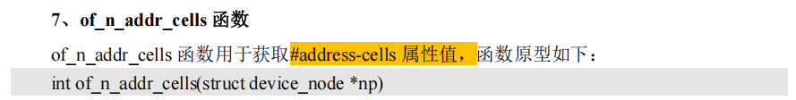
- 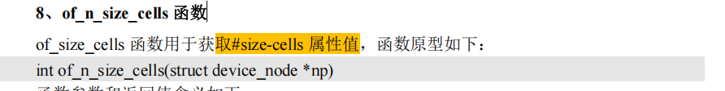


# 其他函数
太多了，用到时候自己查就行了
比较有意思的就是地址映射了，从dts中读的物理地址，要转换成resource类型