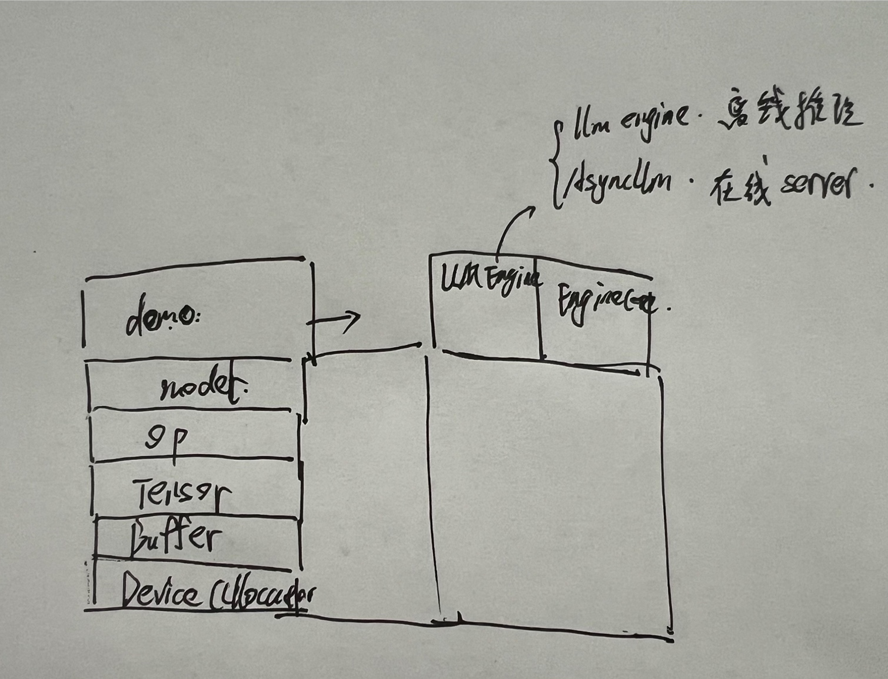

# 概念扫描

<mark style="background:#d3f8b6">1. 离线推理/在线推理</mark>
- 离线推理：
	- 直接把prompt写在python程序里面启动
- 在线推理：
	- 做成server，接受客户端的访问

<mark style="background:#d3f8b6">2. 安装vllm, 查看版本</mark>


<mark style="background:#d3f8b6">3. 服务器双进程架构</mark>
- 进程0：**LLMEngine**
	- 专注于server功能提供
- 进程1：**EngineCore**
	- 专注于模型推理
```txt

                 用户输入
                    |
                    |
                    v
        +-------------------------+
        |        Process 0         |
        |       LLMEngine          |
        |                          |
        |  1. 接收 prompts          |
        |  2. tokenizer 分词        |
        |  3. 创建请求 Request      |
        |                          |
        |  EngineCoreClient         |
        +------------+-------------+
                     |
                     |
              ZeroMQ (ZMQ)
              IPC通信通道
                     |
                     |
                     v
        +------------+-------------+
        |        Process 1         |
        |      EngineCore          |
        |                          |
        |  输入队列 Input Queue     |
        |            |             |
        |            v             |
        |       Scheduler          |
        |            |             |
        |            v             |
        |     调度 GPU 推理         |
        |                          |
        |  ModelRunner              |
        |      |                   |
        |      v                   |
        |     CUDA                  |
        |      |                   |
        |      v                   |
        |   LLM Model              |
        |                          |
        +------------+-------------+
                     |
                     |
              输出队列 Output Queue
                     |
                     |
              ZeroMQ (ZMQ)
                     |
                     |
                     v
        +------------+-------------+
        |        Process 0         |
        |                          |
        |  接收推理结果             |
        |  返回用户                 |
        +------------+-------------+
                     |
                     |
                     v
                生成文本

```


<mark style="background:#d3f8b6">3. RPC，远程过程调用</mark>
对函数的调用，实际是调用的远程的方法（利用ZMQ等进程间通信实现），但是对上层是无感的，实际上就是把远程服务包装成函数，来实现无感的远程计算


4. vllm的版本


<mark style="background:#d3f8b6">4. 协程，async</mark>
可以简单理解为asyncio这个库带来的一个后台执行任务的机制。


# vllm和cuda自制推理框架的区别

我们原来cuda自制推理框架，实现的是最底层的架构。专注于，张量，算子的实现。专注于底层的：
- 内存分配器层
- buffer层
- tensor层
- op层
- model层
- 最后简单的离线固定demo层。


而vllm则侧重于针对demo层，把这个推理框架彻底做成一个可以部署使用的服务，而不再是一个简单的demo。

所以demo继续细分成：
- LLMEngine/AsyncLLM
	- 用来实现调度，作为服务的前端，来实现一个server
- EngineCore
	- 就是demo的核心实现，generate()方法，实现一个token的输出



# ZeroMQ（ZMQ）

这是一个python的库，用来进行进程间通信的。在这里，我们将先熟悉LLMEngine/AsyncLLM 和 EngineCore之间的通信技术

我们先来了解一下，网络传输模型层级


<mark style="background:#ff4d4f">那socket是什么呢？</mark>

本质上，socket就是一个内核的文件描述符，是通过特定的方式（系统调用）创建出来的内核的内存区域的文件描述符。


而在zmq中，他为了支持N对N的高性能消息通信，对socket的tcp的这种点对点的逻辑，进行了改造，自己内部实现了一个更加抽象的socket


## 同步REQ/REP通信模式

**下面实现一个最简单的zmq的server + client**


<mark style="background:#ff4d4f">这种模式要求通信双方严格遵循**一问一答**的交互流程——客户端必须先发送请求并等待回复，不能连续发送两次请求，否则会引发异常</mark>


**一个端口只能被一个server进程 bind**，服务器 bind 端口，相当于**我在 5555 号开门营业**：

尽管多个客户端可以同时连接到该服务端，ZeroMQ 会在传输层缓存它们的请求，但<mark style="background:#fff88f">服务端仍以串行方式逐个处理这些请求</mark>。另外，<mark style="background:#fff88f">服务端无法主动向客户端发起连接</mark>，因此这种模式<mark style="background:#ff4d4f">不符合</mark>我们在 vLLM 中的通信需求


## DEALER/ROUTER通信模式

前面的req-rep通信模式的弊端：
- 同步阻塞
- 串行通信

这个都不符合我们vllm的需求：
- 异步通信
- 并发通信


所以ROUTER，DEALER都是套接字，可以理解为内核的一块内存区域，类对象，多对多异步双向通信


启动一个server线程，三个client线程


可以看到这边都是可以正常接收的，但是这里有一个问题，就是，我们的服务器，设置了一个ROUTER的socket套接字，这个套接字代表的端口，是用来处理某一类事务的：
- **A ROUTER 套接字**：
	- 接收推理请求
- **B ROUTER 套接字**：
	- 接收控制命令
- **C ROUTER 套接字**：
	- 订阅配置更新

显然，我们这里定义的一个frontend套接字，是为了推理请求的。然后针对这个frontend，来阻塞接收，用recv_multipart()，这个套接字，会有多个client来进行访问。


但是这里有一个问题，当我们的server线程要提供多个功能的时候，每个功能都有一个ROUTER的套接字，这个时候，显然不可能在主循环里面，挨个阻塞，这肯定不行。

这个时候，就需要**poll机制，来实现批量ROUTER监听**。同时，poll机制还提供超时返回的功能。

> 我这里还有一个疑问，这里的poll实现的多路监听，本质上是针对server线程的多个ROUTER的套接字，这个每个ROUTER套接字都对应一个端口，代表一个server的接口服务，对吧，但是每个ROUTER是接收多个client的连接的，但是每个端口里面这部还是串行响应client的请求吗？


所以，最终应该是poll + 线程池，来实现一个**多路监听，并行处理**的server
```python
import threading
import sys
import time
import zmq
import argparse
import uuid
from concurrent.futures import ThreadPoolExecutor


def server_poll_with_workers():
    context = zmq.Context.instance()
    frontend = context.socket(zmq.ROUTER) #多对一并行接收的套接字
    frontend.bind("tcp://localhost:6666")

    print("server start: 6666")

    # 定义模拟推理处理数据的过程
    def process_inference(data):
        time.sleep(0.5)
        return {
            "status": "success",
            "result": f"服务器收到消息:{data['query']}",
            "timestamp": time.time(),
        }

    poller = zmq.Poller()
    poller.register(frontend, zmq.POLLIN)

    executor = ThreadPoolExecutor(max_workers=4) #4个线程的线程池
    lock = threading.Lock()

    # 线程池的workers的工作函数
    def handle_request(identity, request):
        result = process_inference(request)

        # 构造回复response json
        response = {
            "msg_id": request['msg_id'],
            "reply": result,
            "from_engine": "server-0",
        }
        with lock:
            # 走端口返回，因为是4个worker来访问frontend这个套接字，所以需要加锁
            frontend.send_multipart([identity, zmq.utils.jsonapi.dumps(response)])


    try:
        while 1:
            socks = dict(poller.poll(1000))
            multipart = []
            if frontend in socks:
                multipart = frontend.recv_multipart()
                if not multipart:
                    continue

                identity = multipart[0]
                message = multipart[-1]

                request = zmq.utils.jsonapi.loads(message)
                print(f"server recv: {identity.decode()} request:{request['msg_id']}")

                # 现在改成向线程池提交异步任务，4个worker并行处理
                executor.submit(handle_request, identity, request)

                ''' 原来的串行处理
                result = process_inference(request)

                # 构造回复response json
                response = {
                    "msg_id": request['msg_id'],
                    "reply": result,
                    "from_engine": "server-0",
                }
                frontend.send_multipart([identity, zmq.utils.jsonapi.dumps(response)])
                '''
    except KeyboardInterrupt:
        print("server close")

    finally:
        frontend.close()


def server_poll():
    context = zmq.Context.instance()
    frontend = context.socket(zmq.ROUTER) #多对一并行接收的套接字
    frontend.bind("tcp://localhost:6666")

    print("server start: 6666")

    # 定义模拟推理处理数据的过程
    def process_inference(data):
        time.sleep(0.5)
        return {
            "status": "success",
            "result": f"服务器收到消息:{data['query']}",
            "timestamp": time.time(),
        }

    poller = zmq.Poller()
    poller.register(frontend, zmq.POLLIN)


    try:
        while 1:
            socks = dict(poller.poll(1000))
            multipart = []
            if frontend in socks:
                multipart = frontend.recv_multipart()
                if not multipart:
                    continue

                identity = multipart[0]
                message = multipart[-1]

                request = zmq.utils.jsonapi.loads(message)
                print(f"server recv: {identity.decode()} request:{request['msg_id']}")

                result = process_inference(request)

                # 构造回复response json
                response = {
                    "msg_id": request['msg_id'],
                    "reply": result,
                    "from_engine": "server-0",
                }
                frontend.send_multipart([identity, zmq.utils.jsonapi.dumps(response)])

    except KeyboardInterrupt:
        print("server close")

    finally:
        frontend.close()


def server():
    context = zmq.Context.instance()
    frontend = context.socket(zmq.ROUTER) #多对一并行接收的套接字
    frontend.bind("tcp://localhost:6666")

    print("server start: 6666")

    # 定义模拟推理处理数据的过程
    def process_inference(data):
        time.sleep(0.5)
        return {
            "status": "success",
            "result": f"服务器收到消息:{data['query']}",
            "timestamp": time.time(),
        }

    try:
        while 1:
            multipart = frontend.recv_multipart()
            if not multipart:
                continue

            identity = multipart[0]
            message = multipart[-1]

            request = zmq.utils.jsonapi.loads(message)
            print(f"server recv: {identity.decode()} request:{request['msg_id']}")

            result = process_inference(request)

            # 构造回复response json
            response = {
                "msg_id": request['msg_id'],
                "reply": result,
                "from_engine": "server-0",
            }
            frontend.send_multipart([identity, zmq.utils.jsonapi.dumps(response)])

    except KeyboardInterrupt:
        print("server close")

    finally:
        frontend.close()


def client(client_id):
    context = zmq.Context.instance()
    socket = context.socket(zmq.DEALER) # 异步双向套接字

    #id编码成字节流
    identity = f"Client-{client_id}".encode("utf-8")
    socket.setsockopt(zmq.IDENTITY, identity)

    socket.connect("tcp://localhost:6666") #连接6666端口服务
    print(f"client: {client_id} start, 连接到6666server")

    #开始用异步双向socket发送多个请求测试
    for i in range(5):
        request = {
            # UUID = Universally Unique Identifier（通用唯一标识符），类似消息的md5
            "msg_id": str(uuid.uuid4()),
            "query": f"请求{i} 来自 Client-{client_id}",
            "timestamp": time.time(),
        }
        socket.send_json(request)
        print(f"client-{client_id} 发送请求 {request['msg_id']}")
        

    
    # 异步阻塞接收
    for _ in range(5):
        response = socket.recv_json()#非阻塞接收
        print(f"Client-{client_id} 收到响应：{response}")


    socket.close()


if __name__ == "__main__":
    t_start = time.time()

    engine_thread = threading.Thread(target=server_poll_with_workers,daemon=True)
    engine_thread.start()

    time.sleep(1)
    print(f"[{time.time() - t_start:.3f}s] 服务端启动完成")

    client_threads = []
    for i in range(3):
        t = threading.Thread(target = client, args=(i,),daemon=True)
        t.start()
        client_threads.append(t)

    print(f"[{time.time() - t_start:.3f}s] 3 个客户端已启动")

    try:
        for t in client_threads:
            t.join()
        print(f"[{time.time() - t_start:.3f}s] 所有客户端完成")
        time.sleep(2)
    except KeyboardInterrupt:
        print("over")

    t_end = time.time()
    print(f"======================================")
    print(f"  总耗时: {t_end - t_start:.3f}s")
    print(f"======================================")

```


## fd