- [platform device driver梳理](#platform-device-driver梳理)
  - [结构体成员变量一览](#结构体成员变量一览)
  - [内核中变量缩写命名](#内核中变量缩写命名)
  - [gpiod和之前的gpio子系统](#gpiod和之前的gpio子系统)
  - [linux内核目录结构一览](#linux内核目录结构一览)
  - [platform\_bus是唯一的全局变量](#platform_bus是唯一的全局变量)
- [关于/sys, /proc和驱动的关联](#关于sys-proc和驱动的关联)
  - [/sys /proc是什么](#sys-proc是什么)
  - [我如何在驱动中创建/sys下的一些东西](#我如何在驱动中创建sys下的一些东西)
  - [sysfs源码目录](#sysfs源码目录)
  - [疑问：class,device是为了在sysfs里面创建节点，那么申请设备号，注册设备的作用是什么？](#疑问classdevice是为了在sysfs里面创建节点那么申请设备号注册设备的作用是什么)
    - [现代驱动开发的不同](#现代驱动开发的不同)

# platform device driver梳理
这边对linux内核里面的结构体定义做一个梳理：
- struct platform_device
  - struct device
- struct platform_driver
  - struct device_driver

> `platform_xxx`的定义都在`include/linux/platform_device.h`
> 
> `device`, `device_driver`的定义都在`include/linux/device.h`


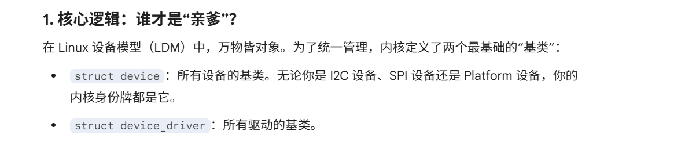
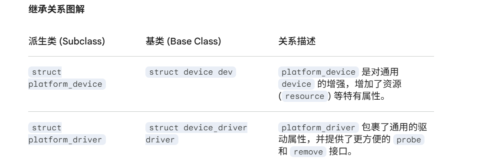

**Linux里面的继承和多态**
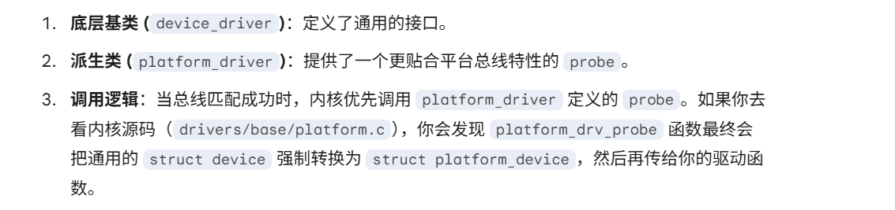

## 结构体成员变量一览
**设备**

**基类**：`struct device`
```c
struct device {
    struct device *parent;              // 父设备（通常是其所属的总线控制器）
    struct device_private *p;           // 【严禁触碰】内核私有数据，存储总线链表位置等
    struct kobject kobj;                // 内核对象，负责引用计数和 sysfs 层级生成
    const char *init_name;              // 初始名字
    const struct device_type *type;     // 设备类型

    struct mutex mutex;                 //互斥锁，用来同步堆驱动程序的调用

    struct bus_type *bus;               // 设备所属的总线（如 &platform_bus_type）
    struct device_driver *driver;       // 指向当前已经绑定的驱动程序

    void *platform_data;                // 老式驱动传参方式 platform特有数据，device core不能访问他）
    void *driver_data;                  //驱动数据，用dev_set/get_drvdata获取，保存设备结构体这些
    struct dev_pm_info power;           // 电源管理状态信息
    
    #ifdef CONFIG_OF
    struct device_node *of_node;        // 【核心】指向设备树(DTS)中的节点，OF函数全靠它
    struct fwnode_handle *fwnode;       // 固件节点句柄（统一了 ACPI 和 DT）
    #endif

    dev_t devt;                         // 设备号（主设备号+次设备号）
    spinlock_t devres_lock;             // 管理设备资源的自旋锁
    struct list_head devres_head;       // 由 devm_ 系列函数管理的资源列表

    void (*release)(struct device *dev); // 当引用计数归零时释放资源的函数
    // ... 还有处理 DMA、IOMMU、Numa 节点等非常底层的成员


    dev_t  devt;                        //设备号
    u32    id;                          //设备实例
    //....
};

```
区别platform_data, driver_data
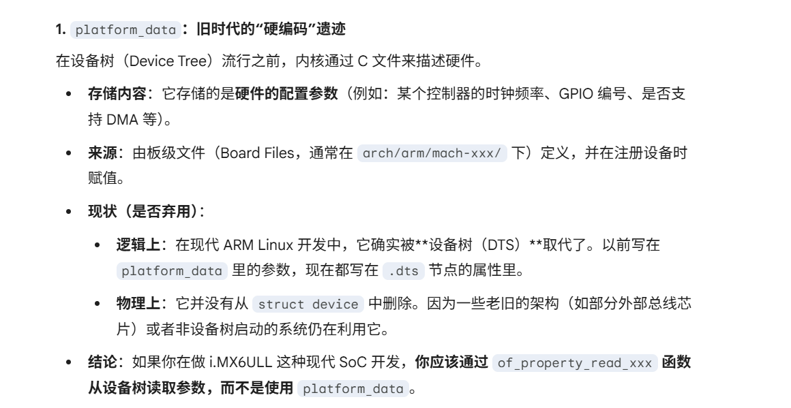
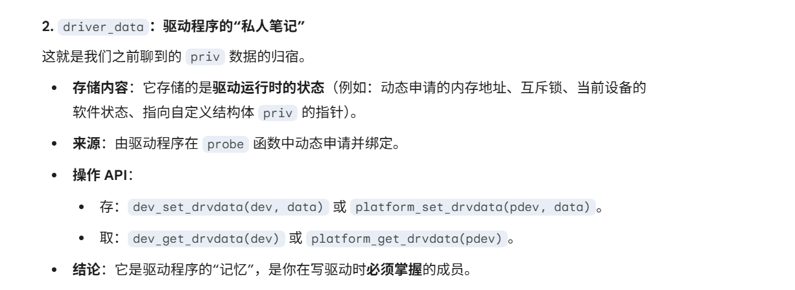


**子类**：`struct platform_device`
```c
struct platform_device {
    const char  *name;                  // 设备名，用于和驱动的 name 进行匹配
    int         id;                     // 设备 ID，用于区分同名设备。若只有一个则设为 -1
    bool        id_auto;                // 是否自动分配 ID
    struct device dev;                  // 【基类】最核心的成员，包含了设备树节点和父设备信息
    u32         num_resources;          // 资源数组的数量
    struct resource *resource;          // 【资源】指向 MEM、IRQ、DMA 等硬件资源描述的数组

    const struct platform_device_id *id_entry; // 匹配成功后，指向匹配到的 ID 表项
    char *driver_override;              /* 强制匹配特定驱动的名字 */

    /* MFD (多功能设备) 相关指针 */
    struct mfd_cell *mfd_cell;

    /* 架构特定的扩展数据 */
    struct pdev_archdata archdata;
};
```


**驱动**

**基类**：`struct device_driver`
```c
struct device_driver {
    const char *name;              // 驱动程序的名字
    struct bus_type *bus;          // 所属总线
    struct module *owner;          // 模块属主，通常填 THIS_MODULE

    const char *mod_name;          // 用于内置模块的名字
    bool suppress_bind_attrs;      // 是否禁止通过 sysfs 手动绑定/解绑

    #ifdef CONFIG_OF
    const struct of_device_id *of_match_table; // 【核心】设备树匹配表
    #endif

    // 通用探测函数：platform 总线会先调它，它内部再转换成 platform_device 调你的 probe
    int (*probe) (struct device *dev);
    int (*remove) (struct device *dev);
    void (*shutdown) (struct device *dev);
    int (*suspend) (struct device *dev, pm_message_t state);
    int (*resume) (struct device *dev);

    // 现代电源管理框架
    const struct dev_pm_ops *pm;

    // 内核维护的私有数据
    struct driver_private *p;
};
```

**子类**：struct platform_driver
```c
struct platform_driver {
    /* 当总线匹配成功、设备被添加时执行 */
    int (*probe)(struct platform_device *);

    /* 当驱动卸载或设备被拔出时执行 */
    int (*remove)(struct platform_device *);

    /* 系统关机时的回调 */
    void (*shutdown)(struct platform_device *);

    /* 电源管理：休眠回调 */
    int (*suspend)(struct platform_device *, pm_message_t state);

    /* 电源管理：唤醒回调 */
    int (*resume)(struct platform_device *);

    /* 【基类】通用的驱动属性，包含了名字、匹配表和模块所有者 */
    struct device_driver driver;

    /* ID 匹配表，用于支持一个驱动对应多个不同名字的设备 */
    const struct platform_device_id *id_table;

    /* 防止延迟探测的标志 */
    bool prevent_deferred_probe;
};
```

## 内核中变量缩写命名
遵循一套**非常严谨的命名规范**

**1. 核心对象缩写 (名词)**

这些缩写通常代表**结构体的实例指针**。

- `dev` (Device): 指向 `struct device` 的指针。它是所有设备的基类。
- `pdev` (Platform Device): 指向 `struct platform_device` 的指针。
- `drv` (Driver): 指向 `struct device_driver` 的指针。
- `pdrv` (Platform Driver): 指向 `struct platform_driver` 的指针。
- `node` / `np` (Node Pointer): 通常指 `struct device_node *`，即设备树中的一个节点指针。
- `priv` Private Data"（**私有数据**
  - 内核的设备类型platform_device是通用的，所以只定义了设备的共性，但是你的驱动中，常常要**记录一些特有信息**，比如GPIO编号，动态申请的内存地址，当前设备的运行状态，互斥锁，自旋锁
  - 我们驱动里面使用的platform_device变量都是通用的。所以我们只能自己在驱动中开辟一块内存，然后自己创建设备描述结构体。然后把他们绑定到我们创建使用的通用的platform_device上（里面的指针指向我们这一块内存）
  - 你不能修改内核定义的全局结构体，**只能拿一个私有数据的指针**，**指向你驱动里面的开辟的全局内存**。
  - >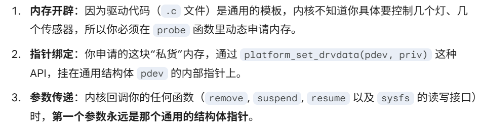
  - > 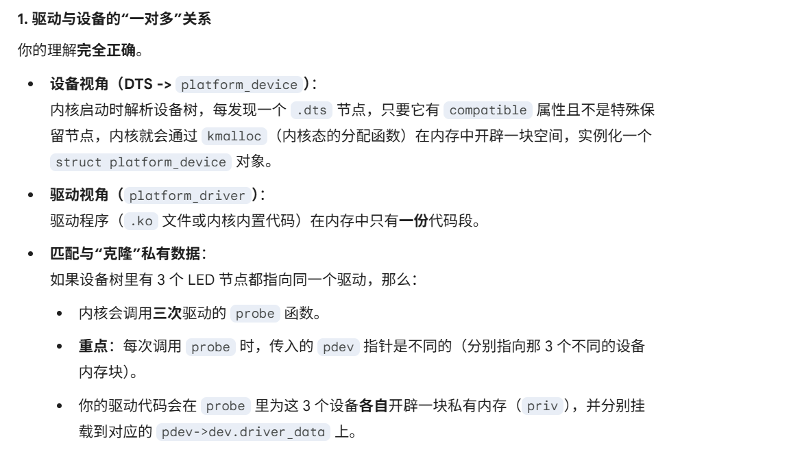
  - > **关于内核申请的内存，其实是在空闲列表里面申请的，这个xv6里面搞清楚了**
  - 
  - > 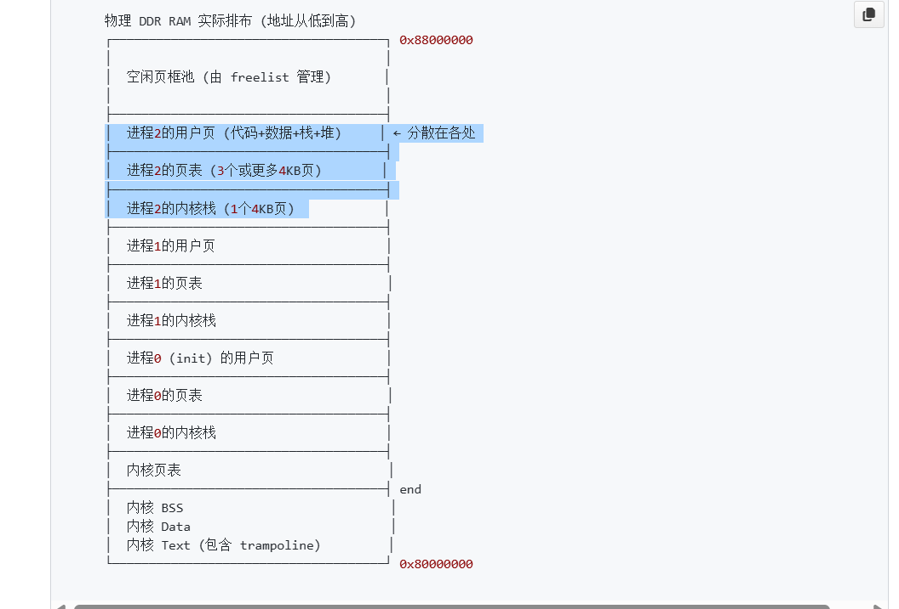

---

**2. 资源管理前缀 (动词/特性)**

`devm_` (Device **Managed**)

这是 Linux 内核的“**自动垃圾回收**”机制。

- **含义**：带有 `devm_` 前缀的函数（如 `devm_kzalloc`, `devm_gpio_request`）申请的资源，会挂在 `struct device` 内部的 `devres_head` 链表上。

- **作用**：当驱动卸载（执行 `remove`）或 `probe 失败`时，**内核会自动释放这些资源**。你不需要在 remove 函数里手动写一堆 kfree 或 gpio_free。

---

`of`_ (**Open Firmware**)

- **含义**：所有**处理设备树** (Device Tree) 相关的函数都以 `of_` 开头。

- **例子**：of_get_named_gpio（从设备树获取 GPIO 编号），of_property_read_u32（读取设备树里的数字属性）。

---

**3. 常见缩写**
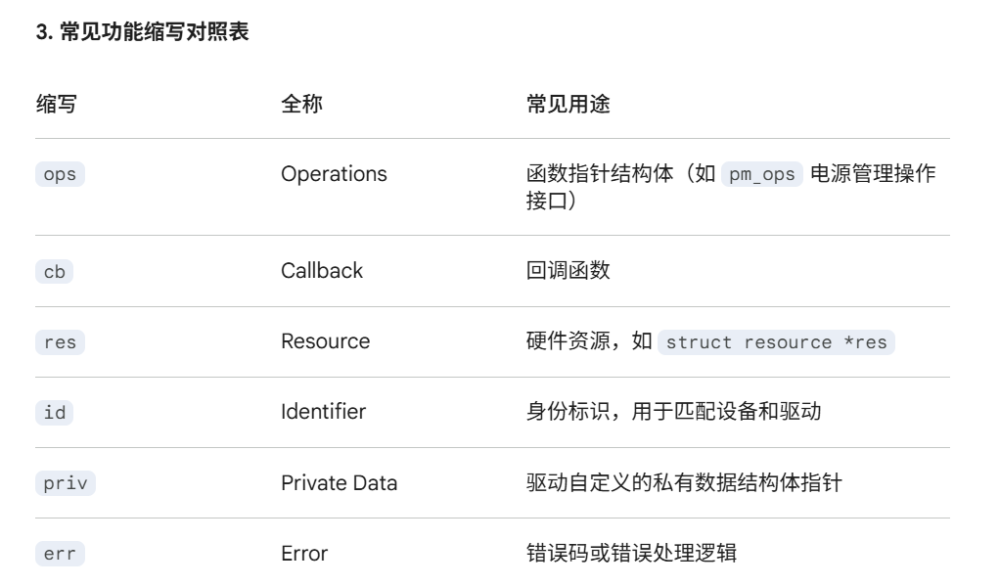


所以看到pdev->dev, 就是获取设备的父类对象


## gpiod和之前的gpio子系统
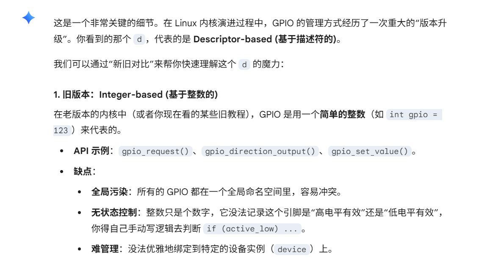
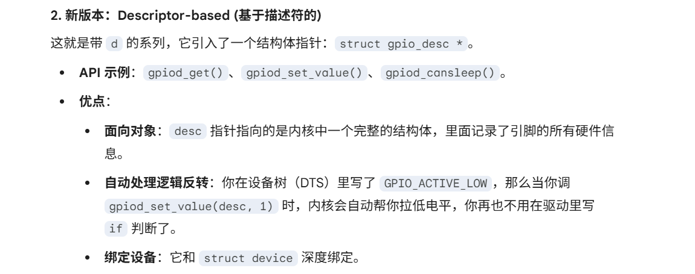
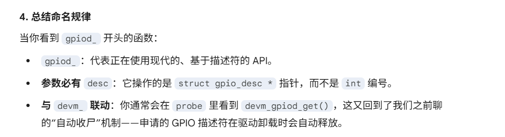

## linux内核目录结构一览
```c
linux-src/
├── arch/                        # 体系结构相关代码 (如 arm64, riscv, x86)
│   └── arm64/boot/dts/          # 【重点】这里存放了你经常修改的设备树文件 (.dts)
│
│
├── drivers/                     # 驱动程序主体
│   ├── base/                    # 【核心核心】Linux 设备模型 (LDM) 的底层实现
│   │   ├── bus.c                # 总线注册、匹配逻辑
│   │   ├── dd.c                 # Driver Bound (驱动绑定核心逻辑)
│   │   ├── driver.c             # struct device_driver 的通用操作
│   │   ├── core.c               # struct device 的通用操作
│   │   └── platform.c           # 【重点】platform_driver_register 等函数的定义就在这！
│   ├── leds/                    # LED 子系统目录
│   │   ├── led-core.c           # LED 核心层逻辑
│   │   ├── led-class.c          # /sys/class/leds 的创建与管理
│   │   └── leds-gpio.c          # 【教科书】基于 platform 框架的最简单标准 LED 驱动
│   ├── gpio/                    # GPIO 子系统 (gpiolib)
│   ├── platform/                # 特定于某些硬件平台的“增强型”驱动 (非框架本身)
│   │   └── x86/                 # 例如 Thinkpad 快捷键、华硕笔记本特有的驱动
│   └── of/                      # Open Firmware (设备树) 的核心解析逻辑
│
│
├── include/                     # 头文件目录
│   ├── linux/                   # 【重点】通用的内核头文件 (与平台无关)
│   │   ├── platform_device.h    # struct platform_device 定义和 API 声明
│   │   ├── device.h             # struct device 基类定义
│   │   ├── of.h                 # 设备树操作 API (of_ 开头的函数)
│   │   ├── leds.h               # LED 子系统相关结构体
│   │   └── mod_devicetable.h    # of_device_id 等匹配表的定义
│   └── uapi/                    # User API (给应用层调用的头文件)
│
│
├── Documentation/               # 内核文档
│   └── devicetree/              # 设备树绑定文档 (告诉你 DTS 节点该怎么写)
│
│
└── kernel/                      # 内核核心调度、同步、定时器逻辑
```


## platform_bus是唯一的全局变量
在 Linux 内核中，`platform_bus_type` 确实是一个全局唯一的 `struct bus_type` 实例

根据上面的目录结构分类，就很容易找到他的全局变量创建在`drivers/base/platform.c`中

```c
struct bus_type platform_bus_type = {
    .name		= "platform",
    .dev_groups	= platform_dev_groups,
    .match		= platform_match,      // 【核心】决定设备和驱动能否“牵手”成功
    .uevent		= platform_uevent,
    .pm		    = &platform_dev_pm_ops, // 电源管理
    .probe		= platform_drv_probe,  // 封装后的探测函数
    .remove		= platform_drv_remove,
    .shutdown	= platform_drv_shutdown,
};
EXPORT_SYMBOL_GPL(platform_bus_type); // 导出符号，让其他模块也能访问
```

# 关于/sys, /proc和驱动的关联
## /sys /proc是什么
`/proc` 是**历史遗留的“大杂烩”**，而 `/sys` 是伴随 Linux 设备模型（L**DM**）诞生的“**现代化设备博物馆**”

这两个目录下面都是**挂载的虚拟文件系统**

---

`/proc` (Process Information Pseudo-file System)
- **初衷**：最早在 Unix 时代，`/proc` 仅仅是为了向用户空间导出**进程（Process**信息而创建的（比如现在的 /proc/1 就是 init 进程的状态）。

- **演变**（失控）：随着 Linux 发展，内核开发者发现从内核向用户层传递数据太麻烦了，而 /proc 刚好是个现成的通道。于是，大家开始往里面**塞各种与进程无关的东西**：`内存信息`（meminfo）、`中断`（interrupts）、`命令行参数`（cmdline），甚至包括你提到的`设备树`（device-tree）。

- **缺点**：毫无结构可言，格式混乱。有些文件里面是一大坨文本，用户层写脚本去解析这些文本非常痛苦（比如用 awk/grep 抓取特定字段）。

**`/proc` 的常见目录**
- `/proc/"pid"/`：各个进程的状态（老本行）。
- `/proc/interrupts`：系统的**中断统计**。
- `/proc/device-tree/`：设备树节点（实际上在现代内核中，它通常是一个指向 `/sys/firmware/devicetree/base` 的符号链接）。

---

`/sys` (Sysfs)
- **初衷**：在 Linux 2.6 引入设备模型（L**DM**）时，内核鼻祖 Linus 和其他维护者受够了 /proc 的混乱。他们决定**专门为设备、总线、驱动**设计一个**新的文件系统**，这就是 `sysfs`。

- **核心规则**：严格的层次结构和**一个文件只干一件事（只包含一个值**的原则。比如，你想看设备的电源状态，在 sysfs 里就是一个单独的文件，里面只有 0 或 1，不需要任何解析。

- **本质**：`sysfs` 就是内核中 `kobject`（内核对象的基类）树状拓扑结构在**用户空间的直接映射**。


**/sys 的核心目录**（`LDM(linux设备模型`) 的三维立体图）
- `/sys/devices/`：
  - **族谱视角**, **全局设备树最真实的物理连接图**。这是系统所有物理设备的真实拓扑结构（谁挂在谁下面，一清二楚）。
- `/sys/bus/`：
  - **相亲视角, 总线match视角**。包含 platform、i2c、usb 等。目录下的 devices 和 drivers 实际上是指向 /sys/devices/ 的符号链接（这也是为什么你能在platform 下找到你创建的设备）。
  - 在 `/sys/bus/platform/` 下，你可以清楚地查账哪些设备挂在 platform 总线上？哪些驱动已经就绪？谁和谁配对成功了
- `/sys/class/`：
  - **职业视角**。不管你是通过什么总线接入的，只要你是 **LED**，就归类到 `/sys/class/leds/`；是**网卡**，就归类到 `/sys/class/net/`。
- `/sys/module/`：系统加载的所有内核模块（ko文件）的状态。


---

## 我如何在驱动中创建/sys下的一些东西
在 sysfs 中，有一个极其优雅的设计哲学：

**目录代表“对象” (kobject)**，而**文件代表对象的“属性” (attribute)**。

- 在你的**驱动里**，你只需要**提供两个函数（读和写）**，内核就会自动帮你把它们**映射成 /sys 下的一个普通文本文件**。
- 用户层只需使用最基础的 `cat` 和 `echo` 命令，就能跨越内核边界，直接调用你写的 C 函数！
> 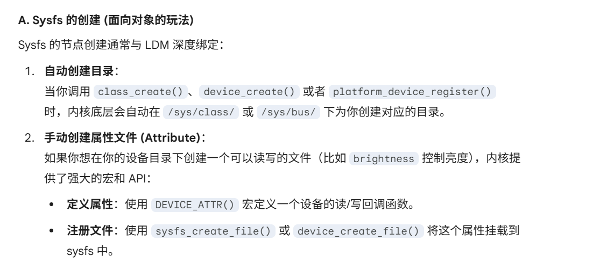


## sysfs源码目录
sysfs这些属于VFS虚拟文件系统，所以

- **Sysfs 核心机制**：	`fs/sysfs/`	
  - sysfs 文件系统的挂载、文件读写回调的底层实现。
- **Kobject** (sysfs的灵魂)	`lib/kobject.c`	
  - 重点！kobject 负责维护引用计数，它的每一次注册（kobject_add）都会在 sysfs 里生成一个目录。
- **与设备模型的桥梁**:	`drivers/base/core.c` `drivers/base/class.c`
  - 这里包含了 `class_create` 等函数，它们**内部**会调用 `kobject_add` 和 `sysfs 的 API`，最终在 /sys/ 下建出你看到的结构。


## 疑问：class,device是为了在sysfs里面创建节点，那么申请设备号，注册设备的作用是什么？

在linux的内核设备-驱动-总线模型中
- 我们用**dts来描述设备信息**（属于**总线层**），
  - 最终得到`platform_device`
  - **作用**，是**描述硬件资源**（寄存器地址、中断号），此时，**内核已经知道硬件的存在了**
  - > **但用户空间的程序（如你的 C 语言 App）还看不见它**，**没有接口**
- **注册字符设备**/**申请设备号**（属于**文件系统层**）
  - **目的**：在 `/dev/` 目录下生成一个“**文件节点**”
  - > Linux 的哲学是“万物皆文件”。用户 App 想要控制硬件，必须通过 open("/dev/myled", ...)
  - **申请设备号**, **注册 cdev**，就是为了**告诉内核**：“当有人`访问这个 /dev/` 文件时，请**跳转到我驱动**里写的 `read/write/ioctl` 函数去

### 现代驱动开发的不同
上面你还要自己手动让内核把用户层的访问，路由到驱动

在**现代驱动开发**中，我们确实在**减少直接操作设备号**

- **子系统封装（如 LED 子系统）**：
  - 如果你写的是**标准的 `leds-gpio` 驱动**，你不需要申请设备号，也不需要 cdev_add
  - 因为 **LED 子系统框架**（`led-class.c`）已经**提前申请好了主设备号**，并统一管理了 `/sys/class/leds/`。你只需要调`led_classdev_register`，框架就会自动帮你搞定一切
- > 对比
- > 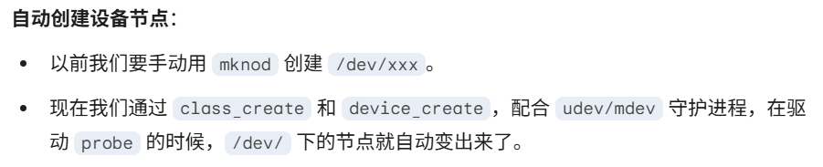


