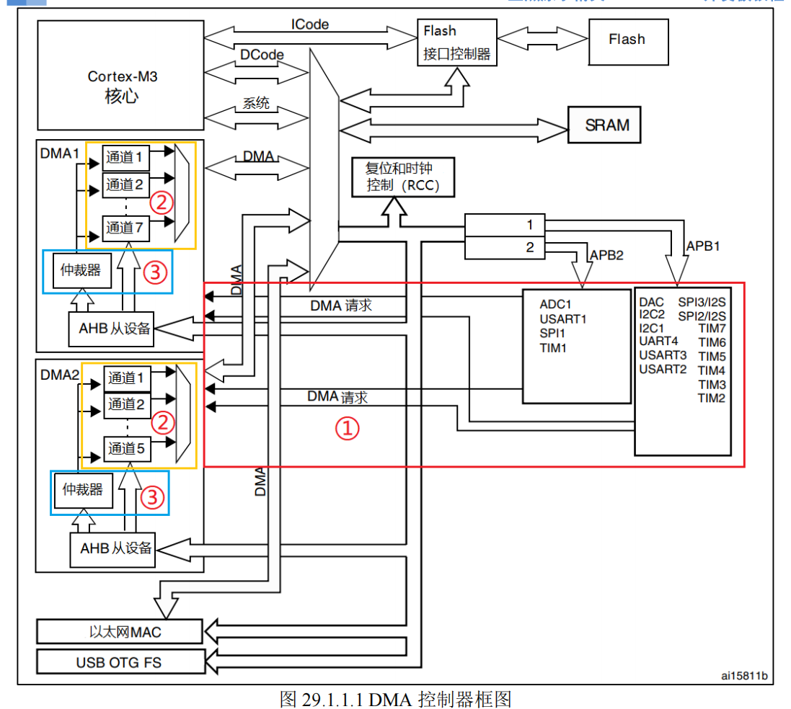
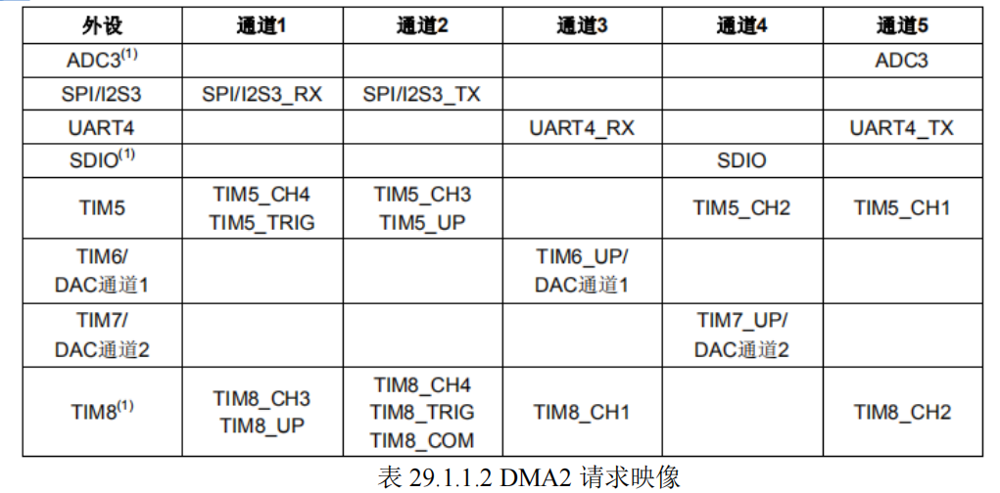
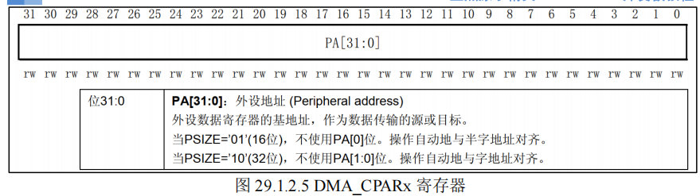

- [stm32 dma](#stm32-dma)
  - [dma介绍](#dma介绍)
  - [dma资源](#dma资源)
  - [dma特性](#dma特性)
  - [框图](#框图)
    - [第一部分 DMA 请求](#第一部分-dma-请求)
    - [第二部分 通道](#第二部分-通道)
    - [第三部分 仲裁器](#第三部分-仲裁器)
  - [寄存器](#寄存器)
    - [CR](#cr)
    - [DR](#dr)
    - [SR](#sr)
  - [实验](#实验)
    - [分析](#分析)
      - [如何理解hal库驱动的编写思想](#如何理解hal库驱动的编写思想)
      - [hal库驱动的实现](#hal库驱动的实现)
      - [多个打印源（环形缓冲区）](#多个打印源环形缓冲区)
    - [dma + uart （最高效接收方案）](#dma--uart-最高效接收方案)
        - [3种接收不定长数据的情况](#3种接收不定长数据的情况)
    - [dma + uart （最高效发送方案）](#dma--uart-最高效发送方案)
    - [总结](#总结)


# stm32 dma
## dma介绍
DMA，全称为：Direct Memory Access，即**直接存储器访问**

DMA 传输方式无需 CPU 直接控制传输，也没有中断处理方式那样保留现场和恢复现场的过程

通过硬件为 `RAM` 与 `I/O 设备`开辟一条直接传送数据的通路，能使 CPU 的效率大为提高

## dma资源
STM32F103 内部有 **2 个 DMA** 控制器(DMA2 仅存大容量产品中)。

1. `DMA1` 有 `7` 个通道
2. `DMA2` 有 `5` 个通道

**每个通道**专门用来管理来自于**一个或多个外设**对**存储器**访问的请求。

还有一个**仲裁器**来协调各个 DMA 请求的优先权

## dma特性
DMA 有以下一些特性：

- **每个通道**都直接连接`专用的硬件 DMA 请求`，每个通道都同样`支持软件触发`。这些功能通过软件来配置。
- 在**七个请求间的优先权**可以通过软件编程设置(共有四级：很高、高、中等和低)，假如在相等优先权时由硬件决定(请求 0 优先于请求 1，依此类推)。
- 独立的源和目标数据区的传输宽度(字节、半字、全字)，模拟打包和拆包的过程。源和目标地址必须**按数据传输宽度对齐**。
- 支持循环的缓冲器管理。
- **每个通道都有 3 个事件标志**(DMA 半传输，DMA 传输完成和 DMA 传输出错), 这 3 个事件标志**逻辑或**成为一个单独的中断请求。
- 存储器和存储器间的传输。
- **外设和存储器**，**存储器和外设**的传输。
- 闪存、SRAM、外设的 SRAM、APB1、APB2 和 AHB 外设均可作为访问的源和目标。
- 可编程的数据传输数目：最大为 65536。

## 框图


### 第一部分 DMA 请求
如果**外设**想要`通过 DMA` 来**传输数据**，必须
1. 先给 DMA 控制器发送 `DMA 请求`，
2. DMA 收到请求信号之后，控制器会`给外设一个应答信号`
3. 当外设应答后且 DMA 控制器收到应答信号之后，
4. 会启动 DMA 的传输，直到传输完毕

STM32F103 共有 `DMA1` 和 `DMA2` 两个控制器，`DMA1 有 7 个通道`，`DMA2 有 5 个通道`

**不同的 DMA 控制器的通道**对应着**不同的外设请求**，这决定了我们在软件编程上该怎么设置





### 第二部分 通道
DMA 具有 12 个独立可编程的通道，其中 DMA1 有 7 个通道，DMA2 有 5 个通道，**每个通道对应不同的外设的 DMA 请求**。虽然每个通道可以接收多个外设的请求，但是**同一时间只能接收一个**，不能同时接收多个。


### 第三部分 仲裁器
当**发生多个 DMA 通道请求时**，就意味着有先后响应处理的顺序问题，这个就由**仲裁器**管理。

`仲裁器`管理 DMA 通道请求分为`两个阶段`。
1. 第一阶段属于**软件阶段**，可以在 DMA_CCRx寄存器中设置，有 4 个等级：非常高，高，中和低四个**优先级**。
2. 第二阶段属于**硬件阶段**，如果两个或以上的 DMA 通道请求设置的优先级一样，则他们优先级取决于通道编号，编号越低优先权越高，比如通道 0 高于通道 1。

在大容量产品和互联型产品中，**DMA1 控制器拥有高于 DMA2 控制器的优先级**。


## 寄存器
### CR


该寄存器是用来**清除 DMA_ISR 的对应位**的，通过写 0 清除。

> 在 DMA_ISR 被置位后，我们必须通过向该寄存器对应的位写 0 来清除


该寄存器控制着 DMA `通道 x` 的`每次传输所要传输的数据量`。其设置范围为 0~65535。并且**该寄存器的值随着传输的进行而减少**，当该寄存器的**值为 0** 的时候就代表此次数据传输已经**全部发送完成**。

> 所以可以通过`这个寄存器的值`来`获取当前 DMA 传输的进度`


这个就是正经的配置寄存器了

该寄存器控制着 DMA 很多相关信息，包括
- 数据宽度
- 外设及存储器宽度
- 通道优先级、
- 增量模式、
- 传输方向、
- 中断允许、
- 使能等，

> DMA_CCRx 是 DMA 传输的核心控制寄存器




该**寄存器**是用来存储 STM32 **外设的地址**，比如我们平常使用串口 1，那么该寄存器必须写入 0x40013804（其实就是`&USART1_DR`）。其他外设就可以修改成其他对应外设地址就好了


> 所以，`DMA`就是个**数据拷贝工**，原来我们拷贝数据，需要占用cpu来拷贝（比如从uart->DB中，拷贝一个字节到内存中）


DMA 通道 x **存储器地址寄存器**用来存放**存储器的地址**，该寄存器和DMA_CPARx 差不多，所以就不列出来了。

举个应用的例子，在程序中，我们使用到一个 g_sendbuf [5200]数组来做存
储器，那么我们在 DMA_CMARx 中写入`&g_sendbuf`(即内存地址) 即可。


### DR
无
### SR

这个就是个中断状态寄存器，可以看出某个通道是否出现了中断，以及处于什么状态

该寄存器是**查询当前 DMA 传输的状态**，我们常用的是 `TCIFx` 位，即通道 DMA `传输完成与否`的标志。

>注意此寄存器为只读寄存器，所以在这些位被置位之后，只能通过其他的操作来清除


## 实验
实验是用dma来代替cpu拷贝数据到uart1去发送。

这个自己手写了一下bsp的驱动。

需要注意的点：
1. 注意观察dma结构体（类对象）的成员变量的类型
2. dma对象要和uart使用的外设对象绑定，不绑定，uart那边无法使用dma的方法

因为我们已经初始化好了uart1，所以只要补上dma1的通道4即可。

dma.c
```c
#include "./BSP/DMA/dma.h"

DMA_HandleTypeDef hdma;
extern UART_HandleTypeDef g_uart1_handle;  /* UART句柄 */

void dma1_init(DMA_Channel_TypeDef* DMAx_CHx)
{
    //enable dma
    __HAL_RCC_DMA1_CLK_ENABLE();

    //init dma
    //hdma.Instance = (DMA_Channel_TypeDef   *)DMA1_BASE;
		hdma.Instance = DMAx_CHx;
    hdma.Init.Direction = DMA_MEMORY_TO_PERIPH;
	  hdma.Init.PeriphInc = DMA_PINC_DISABLE;
	  hdma.Init.MemInc = DMA_MINC_ENABLE;
	  hdma.Init.PeriphDataAlignment = DMA_PDATAALIGN_BYTE;
	  hdma.Init.MemDataAlignment = DMA_MDATAALIGN_BYTE;
	  hdma.Init.Mode = DMA_NORMAL;
	  hdma.Init.Priority = DMA_PRIORITY_HIGH;
		
    hdma.DmaBaseAddress = (DMA_TypeDef            *)DMA1_BASE;
    //hdma.ChannelIndex = channel;

    __HAL_LINKDMA(&g_uart1_handle,hdmatx, hdma);
    HAL_DMA_Init(&hdma);
}
```

main.c
```c
int main(void)
{
    uint8_t x = 0;
    uint8_t lcd_id[12];


    HAL_Init();                                         /* 初始化HAL库 */
    sys_stm32_clock_init(RCC_PLL_MUL9);                 /* 设置时钟, 72Mhz */
    delay_init(72);                                     /* 延时初始化 */
    usart_init(115200);                                 /* 串口初始化为115200 */
    led_init();                                         /* 初始化LED */
    lcd_init();                                         /* 初始化LCD */

    printf("test1\n");
    dma1_init((DMA_Channel_TypeDef* )DMA1_Channel4_BASE);
    printf("test2\n");

    printf("test3\n");
    g_point_color = RED;
    sprintf((char *)lcd_id, "LCD ID:%04X", lcddev.id);  /* 将LCD ID打印到lcd_id数组 */
		HAL_UART_Transmit_DMA(&g_uart1_handle, (uint8_t*)send_buffer, sizeof(send_buffer));
		//HAL_UART_Transmit_IT(&g_uart1_handle, (uint8_t*)send_buffer, sizeof(send_buffer));
		//HAL_UART_Transmit(&g_uart1_handle, (uint8_t*)send_buffer, sizeof(send_buffer), 1000);

		while(1)
		{
			  LED0_TOGGLE(); /*红灯闪烁*/
				LED1_TOGGLE();
        delay_ms(50);
		}

}
```

下面来剖析一下dma驱动，以及串口dma发送驱动具体工作内容

### 分析

首先看一下hal里面，对dma对象的类定义
```c
/** 
  * @brief  DMA handle Structure definition
  */
typedef struct __DMA_HandleTypeDef
{
  DMA_Channel_TypeDef   *Instance;                      /* 寄存器基地址 (通道) */
  
  DMA_InitTypeDef       Init;                          /* DMA 通信参数 */
  
  HAL_LockTypeDef       Lock;                          /* DMA 锁对象 */
  
  HAL_DMA_StateTypeDef  State;                         /* DMA 传输状态 */
  
  void                  *Parent;            /* 父对象状态，HAL 库处理的中间变量 */
  
  void                  (* XferCpltCallback)( struct __DMA_HandleTypeDef * hdma);    /* DMA 传输完成回调 */
  
  void                  (* XferHalfCpltCallback)( struct __DMA_HandleTypeDef * hdma); /* DMA 一半传输完成回调 */
  
  void                  (* XferErrorCallback)( struct __DMA_HandleTypeDef * hdma);   /*DMA 传输错误回调*/

  void                  (* XferAbortCallback)( struct __DMA_HandleTypeDef * hdma);   /* DMA 传输中止回调 */  
  
  __IO uint32_t         ErrorCode;                       /* DMA 存取错误代码 */

  DMA_TypeDef            *DmaBaseAddress;                /* DMA 通道基地址 */
  
  uint32_t               ChannelIndex;                   /* DMA 通道索引 */

} DMA_HandleTypeDef; 
```
可以看到，一个dma的类对象，里面包含的成员变量有很多，但是我也不知道实际要初始化哪些

#### 如何理解hal库驱动的编写思想
**1. 统一的标准：HAL 驱动的“三部曲”**

无论是一个简单的 GPIO，还是复杂的网络控制器（ETH），HAL 库的逻辑永远遵循这个流程：

- 第一步：**配置句柄**（The Handle）这是你已经掌握的：填充 `Instance` 和 `Init`。这是告诉硬件：“你是谁”以及“你怎么工作”。

- 第二步：**硬件底层初始化**（The `MSP` - MCU Support Package）
这是最容易被忽略但最标准的地方。HAL 库规定：所有的 HAL_XXX_Init 内部都会调用一个空弱函数（__weak）叫 `HAL_XXX_MspInit`。

>标准在这里： 凡是涉及**跨模块的关联**（比如 UART 要用 DMA，或者 GPIO 要用中断），标准做法都是在 `MspInit` 中完成。

> 你的发现： __HAL_LINKDMA 就应该写在 HAL_UART_MspInit 里面。

- 第三步：**启动与关联**（The Process/Link）
这就是你提到的“绑定”。在 HAL 的逻辑里，如果 外设 A 需要调用外设 B 来协同工作，那么 A 的句柄里一定有`一个指针指向 B`。

---

**2. 怎么“预判”哪些变量需要赋值？**

当你拿到一个全新的外设结构体时，可以用以下逻辑进行“排查”：

- 看成员名：

> 凡是带 *hdma... 或者 *h...（**指针开头**）的，通常是关联对象。它们不会在 Init 函数里自动生成，必须通过 __HAL_LINKDMA 或手动赋值。

>凡是带 State、Lock、ErrorCode 的，全是**只读**。

- 看“协作关系”：

> 问自己：这个外设是独立工作的吗？

> 如果是 UART、SPI、I2C 这种**需要 DMA 搬运数据**的，你立刻就要想到：**必然存在一个 Link 动作**。

- 看 .c 文件的头部注释（最硬核的标准）：

>打开 `stm32f1xx_hal_uart.c`，看顶部的 How to use this driver。
>
>你会发现官方明确写了：`For DMA mode`: (##) Configure the UART TX/RX DMA channel 和 (##) Associate the initialized DMA handle to the UART handle。


**3. 如果你自己写驱动，该如何设计？**

为了让你的驱动看起来像“正规军”，建议模仿 HAL 的这种**“解耦”**设计：

- **不要在 Init 内部写死关联**： 不要让 DMA_Init 去管 UART。

  -   使用“父子”指针： * 如果 A 驱动调用 B 驱动，在 A 的结构体里留一个 void *Parent 或 B_HandleTypedef *pChild。

  - 提供一个宏（类似 LINK）来连接它们。

- 状态与配置分离： * 用户填写的放在 Init。

- 驱动运行时的临时变量（如 Counter、Index）放在结构体的根目录下。


以上，应该能对hal编写的驱动，有一个初步的认识了。


下面看看实际hal的工作
#### hal库驱动的实现
`HAL_DMA_Init()`,

可以看到，它使用assert_parame进行断言判断，这里也可以看出要初始化实例的那些变量
```c
/**
  * @brief  Initialize the DMA according to the specified
  *         parameters in the DMA_InitTypeDef and initialize the associated handle.
  * @param  hdma: Pointer to a DMA_HandleTypeDef structure that contains
  *               the configuration information for the specified DMA Channel.
  * @retval HAL status
  */
HAL_StatusTypeDef HAL_DMA_Init(DMA_HandleTypeDef *hdma)
{
  uint32_t tmp = 0U;

  /* Check the DMA handle allocation */
  if(hdma == NULL)
  {
    return HAL_ERROR;
  }

  /* Check the parameters */
  assert_param(IS_DMA_ALL_INSTANCE(hdma->Instance));
  assert_param(IS_DMA_DIRECTION(hdma->Init.Direction));
  assert_param(IS_DMA_PERIPHERAL_INC_STATE(hdma->Init.PeriphInc));
  assert_param(IS_DMA_MEMORY_INC_STATE(hdma->Init.MemInc));
  assert_param(IS_DMA_PERIPHERAL_DATA_SIZE(hdma->Init.PeriphDataAlignment));
  assert_param(IS_DMA_MEMORY_DATA_SIZE(hdma->Init.MemDataAlignment));
  assert_param(IS_DMA_MODE(hdma->Init.Mode));
  assert_param(IS_DMA_PRIORITY(hdma->Init.Priority));

#if defined (DMA2)
  /* calculation of the channel index */
  if ((uint32_t)(hdma->Instance) < (uint32_t)(DMA2_Channel1))
  {
    /* DMA1 */
    hdma->ChannelIndex = (((uint32_t)hdma->Instance - (uint32_t)DMA1_Channel1) / ((uint32_t)DMA1_Channel2 - (uint32_t)DMA1_Channel1)) << 2;
    hdma->DmaBaseAddress = DMA1;
  }
  else 
  {
    /* DMA2 */
    hdma->ChannelIndex = (((uint32_t)hdma->Instance - (uint32_t)DMA2_Channel1) / ((uint32_t)DMA2_Channel2 - (uint32_t)DMA2_Channel1)) << 2;
    hdma->DmaBaseAddress = DMA2;
  }
#else
  /* DMA1 */
  //可以看到，Index是通过channel4的基地址计算出来的，baseAddress就直接赋值为了DMA1
  hdma->ChannelIndex = (((uint32_t)hdma->Instance - (uint32_t)DMA1_Channel1) / ((uint32_t)DMA1_Channel2 - (uint32_t)DMA1_Channel1)) << 2;
  hdma->DmaBaseAddress = DMA1;
#endif /* DMA2 */

  /* Change DMA peripheral state */
  hdma->State = HAL_DMA_STATE_BUSY;

  /* Get the CR register value */
  //获取当前的dma1通道4的控制寄存器CR
  tmp = hdma->Instance->CCR;

  /* Clear PL, MSIZE, PSIZE, MINC, PINC, CIRC and DIR bits */
  tmp &= ((uint32_t)~(DMA_CCR_PL    | DMA_CCR_MSIZE  | DMA_CCR_PSIZE  | \
                      DMA_CCR_MINC  | DMA_CCR_PINC   | DMA_CCR_CIRC   | \
                      DMA_CCR_DIR));

  /* Prepare the DMA Channel configuration */
  tmp |=  hdma->Init.Direction        |
          hdma->Init.PeriphInc           | hdma->Init.MemInc           |
          hdma->Init.PeriphDataAlignment | hdma->Init.MemDataAlignment |
          hdma->Init.Mode                | hdma->Init.Priority;

  /* Write to DMA Channel CR register */
  hdma->Instance->CCR = tmp;

  //以上，只是配置了一些基础的，比如通道优先级，数据宽度，增量模式使能，方向等等。没有中断的使能，也没有开启dma通道

  /* Initialise the error code */
  hdma->ErrorCode = HAL_DMA_ERROR_NONE;

  /* Initialize the DMA state*/
  hdma->State = HAL_DMA_STATE_READY;
  /* Allocate lock resource and initialize it */
  hdma->Lock = HAL_UNLOCKED;

  return HAL_OK;
}
```

可以看到，HAL_DMA_Init(),也仅仅只是**配置了基础的功能参数**，比如通道优先级，数据宽度，增量模式使能，方向等等。没有中断的使能，也没有开启dma通道

下面看看绑定DMA1_CH4 和uart1_tx

```c
    __HAL_LINKDMA(&g_uart1_handle,hdmatx, hdma);


    #define __HAL_LINKDMA(__HANDLE__, __PPP_DMA_FIELD__, __DMA_HANDLE__)               \
                        do{                                                      \
                              (__HANDLE__)->__PPP_DMA_FIELD__ = &(__DMA_HANDLE__); \
                              (__DMA_HANDLE__).Parent = (__HANDLE__);             \
                          } while(0U)
```
第一个参数是uart1的句柄地址，参数2是参数名字，参数3是dma的句柄对象。

> 注意，这个是宏函数，不是函数，所以不用担心临时变量地址问题

里面的内容就是：
1. uart1对象的参数2 赋值为 dma的句柄地址
2. dma对象的parent指针，指向

至此，dma1 ch4的初始化，就结束了，之后，调用 `HAL_UART_Transmit_DMA` 来让dma代替cpu读取内存，拷贝到uart_tx 的 db，然后发送出去。

在hal库的uart驱动里面，可以看到这里的注释，有教你如何使用uart串口驱动，以及如何使用dma进行发送接收
```c
    The UART HAL driver can be used as follows:

    (#) Declare a UART_HandleTypeDef handle structure (eg. UART_HandleTypeDef huart).
    (#) Initialize the UART low level resources by implementing the HAL_UART_MspInit() API:
        (##) Enable the USARTx interface clock.
        (##) UART pins configuration:
            (+++) Enable the clock for the UART GPIOs.
            (+++) Configure these UART pins (TX as alternate function pull-up, RX as alternate function Input).
        (##) NVIC configuration if you need to use interrupt process (HAL_UART_Transmit_IT()
             and HAL_UART_Receive_IT() APIs):
            (+++) Configure the USARTx interrupt priority.
            (+++) Enable the NVIC USART IRQ handle.
        (##) DMA Configuration if you need to use DMA process (HAL_UART_Transmit_DMA()
             and HAL_UART_Receive_DMA() APIs):
            (+++) Declare a DMA handle structure for the Tx/Rx channel.
            (+++) Enable the DMAx interface clock.
            (+++) Configure the declared DMA handle structure with the required
                  Tx/Rx parameters.
            (+++) Configure the DMA Tx/Rx channel.
            (+++) Associate the initialized DMA handle to the UART DMA Tx/Rx handle.
            (+++) Configure the priority and enable the NVIC for the transfer complete
                  interrupt on the DMA Tx/Rx channel.
            (+++) Configure the USARTx interrupt priority and enable the NVIC USART IRQ handle
                  (used for last byte sending completion detection in DMA non circular mode)

    (#) Program the Baud Rate, Word Length, Stop Bit, Parity, Hardware
        flow control and Mode(Receiver/Transmitter) in the huart Init structure.

    (#) For the UART asynchronous mode, initialize the UART registers by calling
        the HAL_UART_Init() API.

    (#) For the UART Half duplex mode, initialize the UART registers by calling
        the HAL_HalfDuplex_Init() API.

    (#) For the LIN mode, initialize the UART registers by calling the HAL_LIN_Init() API.

    (#) For the Multi-Processor mode, initialize the UART registers by calling
        the HAL_MultiProcessor_Init() API.
```

这里有对dma相关的串口api进行汇总
```c
    (#) Non-Blocking mode API's with DMA are :
        (+) HAL_UART_Transmit_DMA()
        (+) HAL_UART_Receive_DMA()
        (+) HAL_UART_DMAPause()
        (+) HAL_UART_DMAResume()
        (+) HAL_UART_DMAStop()

```
下面我们来逐一分析一下

`HAL_UART_Transmit_DMA`

```c
HAL_StatusTypeDef HAL_UART_Transmit_DMA(UART_HandleTypeDef *huart, uint8_t *pData, uint16_t Size)
{
  uint32_t *tmp;

  /* Check that a Tx process is not already ongoing */
  if (huart->gState == HAL_UART_STATE_READY)
  {
    if ((pData == NULL) || (Size == 0U))
    {
      return HAL_ERROR;
    }

    /* Process Locked */
    __HAL_LOCK(huart);

    //指定好要发送的字符串的内存起始地址，以及要发送的字节数
    huart->pTxBuffPtr = pData;
    huart->TxXferSize = Size;
    huart->TxXferCount = Size;

    huart->ErrorCode = HAL_UART_ERROR_NONE;
    huart->gState = HAL_UART_STATE_BUSY_TX;

    //指定好uart dma发送完成回调函数
    huart->hdmatx->XferCpltCallback = UART_DMATransmitCplt;

    //指定好uart dma发送一半完成回调函数
    huart->hdmatx->XferHalfCpltCallback = UART_DMATxHalfCplt;

    //指定好 dma错误 回调函数
    huart->hdmatx->XferErrorCallback = UART_DMAError;

    //指定好 dma终止 回调函数
    huart->hdmatx->XferAbortCallback = NULL;

    /* Enable the UART transmit DMA channel */
    //用dma的驱动，开始发送这个内存区域
    tmp = (uint32_t *)&pData;
    HAL_DMA_Start_IT(huart->hdmatx, *(uint32_t *)tmp, (uint32_t)&huart->Instance->DR, Size);

    /* Clear the TC flag in the SR register by writing 0 to it */
    //清除串口的TC标志位（传输完成标志位）
    __HAL_UART_CLEAR_FLAG(huart, UART_FLAG_TC);

    /* Process Unlocked */
    __HAL_UNLOCK(huart);

    /* Enable the DMA transfer for transmit request by setting the DMAT bit
       in the UART CR3 register */
    //置1，使用uart1的CR3的DMAT位。
    SET_BIT(huart->Instance->CR3, USART_CR3_DMAT);

    return HAL_OK;
  }
  else
  {
    return HAL_BUSY;
  }
}

```

先关注绑定的几个回调函数：
1. hdmatx->XferCpltCallback = UART_DMATransmitCplt;
   1. 指定好uart dma发送完成回调函数
2. hdmatx->XferHalfCpltCallback = UART_DMATxHalfCplt;
   1. 指定好uart dma发送一半完成回调函数
3. hdmatx->XferErrorCallback = UART_DMAError;
   1. 指定好 dma错误 回调函数
4. hdmatx->XferAbortCallback = NULL;
   1. 指定好 dma终止 回调函数

我们先来看看这几个回调函数的内容，因为你后面使能了这几个中断后，就会触发他们的回调
```c
                DCD     DMA1_Channel4_IRQHandler   ; DMA1 Channel 4
```
可以看到，是有DMA1—CH4的中断向量的

下面分别看一下，这些中断的回调函数：

`UART_DMATransmitCplt`
```c
static void UART_DMATransmitCplt(DMA_HandleTypeDef *hdma)
{
  UART_HandleTypeDef *huart = (UART_HandleTypeDef *)((DMA_HandleTypeDef *)hdma)->Parent;
  /* DMA Normal mode*/
  if ((hdma->Instance->CCR & DMA_CCR_CIRC) == 0U)
  {
    huart->TxXferCount = 0x00U;

    /* Disable the DMA transfer for transmit request by setting the DMAT bit
       in the UART CR3 register */
    CLEAR_BIT(huart->Instance->CR3, USART_CR3_DMAT);

    /* Enable the UART Transmit Complete Interrupt */
    SET_BIT(huart->Instance->CR1, USART_CR1_TCIE);

  }
  /* DMA Circular mode */
  else
  {
#if (USE_HAL_UART_REGISTER_CALLBACKS == 1)
    /*Call registered Tx complete callback*/
    huart->TxCpltCallback(huart);
#else
    /*Call legacy weak Tx complete callback*/
    HAL_UART_TxCpltCallback(huart);
#endif /* USE_HAL_UART_REGISTER_CALLBACKS */
  }
}
```
可以看到，已经有定义了，然后留了一个 HAL_UART_TxCpltCallback(huart)来让你自己定义

剩下的也都一样。


接下来里面有两个比较重要的，`HAL_DMA_Start_IT` 和 `SET_BIT(huart->Instance->CR3, USART_CR3_DMAT)`


`HAL_DMA_Start_IT`
```c
/**
  * @brief  Start the DMA Transfer with interrupt enabled.
  * @param  hdma: pointer to a DMA_HandleTypeDef structure that contains
  *               the configuration information for the specified DMA Channel.
  * @param  SrcAddress: The source memory Buffer address
  * @param  DstAddress: The destination memory Buffer address
  * @param  DataLength: The length of data to be transferred from source to destination
  * @retval HAL status
  */
HAL_StatusTypeDef HAL_DMA_Start_IT(DMA_HandleTypeDef *hdma, uint32_t SrcAddress, uint32_t DstAddress, uint32_t DataLength)
{
  HAL_StatusTypeDef status = HAL_OK;

  /* Check the parameters */
  assert_param(IS_DMA_BUFFER_SIZE(DataLength));

  /* Process locked */
  __HAL_LOCK(hdma);
  
  if(HAL_DMA_STATE_READY == hdma->State)
  {
    /* Change DMA peripheral state */
    hdma->State = HAL_DMA_STATE_BUSY;
    hdma->ErrorCode = HAL_DMA_ERROR_NONE;
    
    /* Disable the peripheral */
    __HAL_DMA_DISABLE(hdma);
    
    /* Configure the source, destination address and the data length & clear flags*/
    DMA_SetConfig(hdma, SrcAddress, DstAddress, DataLength);
    
    /* Enable the transfer complete interrupt */
    /* Enable the transfer Error interrupt */
    if(NULL != hdma->XferHalfCpltCallback)
    {
      /* Enable the Half transfer complete interrupt as well */
      __HAL_DMA_ENABLE_IT(hdma, (DMA_IT_TC | DMA_IT_HT | DMA_IT_TE));
    }
    else
    {
      __HAL_DMA_DISABLE_IT(hdma, DMA_IT_HT);
      __HAL_DMA_ENABLE_IT(hdma, (DMA_IT_TC | DMA_IT_TE));
    }
    /* Enable the Peripheral */
    __HAL_DMA_ENABLE(hdma);
  }
  else
  {      
    /* Process Unlocked */
    __HAL_UNLOCK(hdma); 

    /* Remain BUSY */
    status = HAL_BUSY;
  }    
  return status;
}

```
总结一下这个函数的内容：
1. __HAL_DMA_DISABLE(hdma)
   1. 设置DMA->CCR的EN位为0
2. DMA_SetConfig(hdma, SrcAddress, DstAddress, DataLength)
   1. 主要就是设置DMA_CH4->CPAR里面，记录下源地址，目的地址（之前只是指定了dma的工作方式，没有具体的任务内容）
3. 判断如果指定了传输一半完成的回调函数（确实是已经指定了的）
   1. __HAL_DMA_ENABLE_IT(hdma, (DMA_IT_TC | DMA_IT_HT | DMA_IT_TE))，就把支持的3个中断全部使能
4. __HAL_DMA_ENABLE(hdma)
   1. 设置DMA->CCR的EN位为1

简单说就是：
1. 告诉dma实际要进行拷贝的内存地址
2. 开中断
3. 使能dmaEN，开始工作

确实如`HAL_DMA_Start_IT`命名那样，`开中断模式`**开始工作**。


接下来分析串口dma发送的最后一句：

`SET_BIT(huart->Instance->CR3, USART_CR3_DMAT)`

设置的值如下：
```c
#define USART_CR3_DMAT_Pos                  (7U)                               
#define USART_CR3_DMAT_Msk                  (0x1UL << USART_CR3_DMAT_Pos)       /*!< 0x00000080 */
#define USART_CR3_DMAT                      USART_CR3_DMAT_Msk                 /*!< DMA Enable Transmitter */
```

再看看uart的CR3寄存器


可以看到，他就是使能了UART1的CR3的这个DMAT位，串口硬件就可以开始使用DMA进行发送了。

> 并不是我想的那样，得用软件来告诉串口怎么用dma，人家**串口硬件已经支持dma了**，你直接使能，他就知道用这个来发送了。


对比一下原来，串口单独发送的场景，还记得吗：
1. 阻塞发送：
   1. 真的让cpu在while里面，不停的拷贝字节到uart1->DB
2. 非阻塞发送
   1. HAL_UART_Transmit_IT里面，只是使能了发送空中断。

> 所以，所谓的驱动，只是用来**开启硬件原本就有的功能**，不是让你用软件来实现原本硬件没有的功能

至此，串口的DMA发送，就已经分析完毕了。

那为什么我在main.c里面，指定串口传输完成回调函数，但是没有进入这个回调函数呢？
```c
void HAL_UART_TxCpltCallback(UART_HandleTypeDef *huart)
{
    //HAL_UART_Transmit_DMA(huart, (uint8_t*)send_buffer, sizeof(send_buffer));
	   LED1_TOGGLE();
}

```

原因在于，之前，`HAL_UART_Transmit_DMA`里面，指定了dma的回调函数，然后确实是**打开了dma的3个中断**。但是**没有使能串口的中断**。

所以当dma完成传输后，会先进入dma的`XferCpltCallback`回调函数，也就是`UART_DMATransmitCplt`.


```c
HAL_StatusTypeDef HAL_UART_Transmit_DMA(UART_HandleTypeDef *huart, uint8_t *pData, uint16_t Size)
{

    //指定好uart dma发送完成回调函数
    huart->hdmatx->XferCpltCallback = UART_DMATransmitCplt;

    //指定好uart dma发送一半完成回调函数
    huart->hdmatx->XferHalfCpltCallback = UART_DMATxHalfCplt;

    //指定好 dma错误 回调函数
    huart->hdmatx->XferErrorCallback = UART_DMAError;

    //指定好 dma终止 回调函数
    huart->hdmatx->XferAbortCallback = NULL;

```

`UART_DMATransmitCplt`里面，你看注释，发现，如果我们的dma使用的是normal模式，则会使能串口传输完成中断，而不是进入你实现的`HAL_UART_TxCpltCallback(huart)`;
```c
static void UART_DMATransmitCplt(DMA_HandleTypeDef *hdma)
{
  UART_HandleTypeDef *huart = (UART_HandleTypeDef *)((DMA_HandleTypeDef *)hdma)->Parent;
  /* DMA Normal mode*/
  if ((hdma->Instance->CCR & DMA_CCR_CIRC) == 0U)
  {
    huart->TxXferCount = 0x00U;

    /* Disable the DMA transfer for transmit request by setting the DMAT bit
       in the UART CR3 register */
    CLEAR_BIT(huart->Instance->CR3, USART_CR3_DMAT);

    /* Enable the UART Transmit Complete Interrupt */
    SET_BIT(huart->Instance->CR1, USART_CR1_TCIE);

  }
  /* DMA Circular mode */
  else
  {
#if (USE_HAL_UART_REGISTER_CALLBACKS == 1)
    /*Call registered Tx complete callback*/
    huart->TxCpltCallback(huart);
#else
    /*Call legacy weak Tx complete callback*/
    HAL_UART_TxCpltCallback(huart);
#endif /* USE_HAL_UART_REGISTER_CALLBACKS */
  }
}
```
所以，最终触发的逻辑是：dma完成中断->dma完成回调->使能串口传输完成中断->串口传输完成回调

但是我如果实现了串口的接收中断回调函数，发现还是没有进入，所以得需要进入看看串口的中断回调函数具体干了些什么：
```c
void HAL_UART_IRQHandler(UART_HandleTypeDef *huart)
{
}
```

> 终于发现问题了，因为串口中断的触发，需要dma的中断的触发，这就需要NVIC都要打开各自的中断使能，这样才能响应。

所以最终需要在DMA1_Init()里面，在初始化完成dma1ch4, 绑定完uart1后，需要使能NVIC中断。

所以涉及的外设（你忘记总结了）：
1. DMA1_CH4
2. UART1
3. NVIC(dma + uart)


所以，最后，总结一下修改的代码：
`dma.c`
```c
#include "./BSP/DMA/dma.h"

DMA_HandleTypeDef hdma;
extern UART_HandleTypeDef g_uart1_handle;  /* UART句柄 */

void dma1_init(DMA_Channel_TypeDef* DMAx_CHx)
{
    //enable dma
    __HAL_RCC_DMA1_CLK_ENABLE();

    //init dma
    //hdma.Instance = (DMA_Channel_TypeDef   *)DMA1_BASE;
		hdma.Instance = DMAx_CHx;
    hdma.Init.Direction = DMA_MEMORY_TO_PERIPH;
	  hdma.Init.PeriphInc = DMA_PINC_DISABLE;
	  hdma.Init.MemInc = DMA_MINC_ENABLE;
	  hdma.Init.PeriphDataAlignment = DMA_PDATAALIGN_BYTE;
	  hdma.Init.MemDataAlignment = DMA_MDATAALIGN_BYTE;
	  //hdma.Init.Mode = DMA_NORMAL;
		hdma.Init.Mode = DMA_CIRCULAR;
	  hdma.Init.Priority = DMA_PRIORITY_HIGH;
		
    hdma.DmaBaseAddress = (DMA_TypeDef            *)DMA1_BASE;
    //hdma.ChannelIndex = channel;

    __HAL_LINKDMA(&g_uart1_handle,hdmatx, hdma);
    HAL_DMA_Init(&hdma);
	
		/* 在 HAL_UART_MspInit 或类似位置 */
		HAL_NVIC_SetPriority(DMA1_Channel4_IRQn, 3, 0); // DMA中断
		HAL_NVIC_EnableIRQ(DMA1_Channel4_IRQn);
}

void DMA1_Channel4_IRQHandler(void)
{
    HAL_DMA_IRQHandler(&hdma); // 必须调用，这才会触发 UART_DMATransmitCplt
}
```

`main.c`
```c

int main(void)
{
    uint8_t x = 0;
    uint8_t lcd_id[12];

    HAL_Init();                                         /* 初始化HAL库 */
    sys_stm32_clock_init(RCC_PLL_MUL9);                 /* 设置时钟, 72Mhz */
    delay_init(72);                                     /* 延时初始化 */
    usart_init(115200);                                 /* 串口初始化为115200 */
    led_init();                                         /* 初始化LED */
    lcd_init();                                         /* 初始化LCD */

    dma1_init((DMA_Channel_TypeDef* )DMA1_Channel4_BASE);

    g_point_color = RED;
    sprintf((char *)lcd_id, "LCD ID:%04X", lcddev.id);  /* 将LCD ID打印到lcd_id数组 */
		HAL_UART_Transmit_DMA(&g_uart1_handle, (uint8_t*)send_buffer, sizeof(send_buffer));
		//HAL_UART_Transmit_IT(&g_uart1_handle, (uint8_t*)send_buffer, sizeof(send_buffer));
		//HAL_UART_Transmit(&g_uart1_handle, (uint8_t*)send_buffer, sizeof(send_buffer), 1000);

		while(1)
		{
        delay_ms(50);
		}

}

void HAL_UART_TxCpltCallback(UART_HandleTypeDef *huart)
{
    if (huart->Instance == USART_UX)                    /* 如果是串口1 */
    {
				LED1_TOGGLE();
    }
}

void HAL_UART_TxHalfCpltCallback(UART_HandleTypeDef *huart)
{
		if (huart->Instance == USART_UX)                    /* 如果是串口1 */
    {
				LED0_TOGGLE();
    }
}
```


---

如果开启了dma按照**循环模式**进行发送，那么之后，如果在**主程序中printf**，就会让cpu一直while**循环等待uart tx 的 SR**寄存器发送完成。结果就一直卡在这里。


所以我想问问，如果开启dma循环模式后，就没有办法释放dma对uart tx的控制权吗，cpu永远也无法等到可以发送吗?

答案是是的

>在循环模式下，DMA 处于“永远在线”状态。只要串口的发送缓冲区空了（TXE 置位），DMA 硬件就会立刻检测到并把内存里的下一个字节塞进串口。


#### 多个打印源（环形缓冲区）
所以当有多个打印输出源的时候，**最佳的做法**是：

**软件环形缓冲区**（最高级）

不直接使用 HAL 的 Transmit。

**建立一个足够大的全局数组作为环形缓冲区**。

printf 只管把数据往缓冲区里写（通过 sprintf）。

DMA 在 **Normal 模式**下，每次只负责把缓冲区里的现有数据发出去。

发送完成后，在**回调函数里检查缓冲区是否还有新数据**，如果有，继续发。


### dma + uart （最高效接收方案）
简单的“字节中断接收”在处理高频、大量数据时会让 CPU 疲于奔命

而 `DMA` + `uart空闲中断（IDLE）` 的组合则是嵌入式开发中处理不定长数据的“黄金标准”
```c
  * @param  __INTERRUPT__ specifies the UART interrupt source to enable.
  *          This parameter can be one of the following values:
  *            @arg UART_IT_CTS:  CTS change interrupt
  *            @arg UART_IT_LBD:  LIN Break detection interrupt
  *            @arg UART_IT_TXE:  Transmit Data Register empty interrupt
  *            @arg UART_IT_TC:   Transmission complete interrupt
  *            @arg UART_IT_RXNE: Receive Data register not empty interrupt
  *            @arg UART_IT_IDLE: Idle line detection interrupt
  *            @arg UART_IT_PE:   Parity Error interrupt
  *            @arg UART_IT_ERR:  Error interrupt(Frame error, noise error, overrun error)
```

**核心矛盾**：DMA 的“盲目性” vs. 数据的“随机性”

`DMA 的本性`：DMA 像是一个只管搬运的苦力。你告诉它“搬 100 个字节”，它就乖乖搬 100 个。只有当搬满 100 个时，它才会通过中断告诉你“我干完了”。

`不定长数据的挑战`：如果**对方只发了 20 个字节就停**了，DMA 还在傻傻地等剩下的 80 个。这时候 CPU 如果不去干预，数据就会一直躺在缓冲区里，你的程序也就无法处理这 20 个字节。

> 因为本质上，我们指定dma接收，发送，都是**定长**，收满，发满，才能触发dma传输完成中断

**解决方案**：IDLE（串口空闲中断）

为了解决这个问题，STM32 硬件提供了一个非常有用的特性：`IDLE 线检测`。

`原理`：当串口接收总线在接收完最后一个数据后，如果`持续出现一个字节的时间没有数据信号`，硬件会自动将 USART_`SR` 寄存器中的 `IDLE 位置 1`。

`作用`：它相当于给 DMA 搬运工配了一个“监工”。如果`数据流断了`（代表一帧数据发完了），IDLE 中断就会触发，叫醒 CPU 来收货。

**实现方案**：

“DMA + IDLE” 的工作流程这是面试中需要答出的标准流程：

- `初始化`：配置串口 DMA 接收为 Normal 模式，设置一个足够大的缓冲区（比如 100 字节），并开启串口的 IDLE 中断。
- `数据传输`：数据开始发送，DMA 自动将数据从串口寄存器搬运到内存缓冲区。此时 CPU 完全不参与。
- `触发中断`：对方发送了 30 个字节后停止。串口检测到线路空闲，触发 IDLE 中断。
- `计算长度`：
  - 在 IDLE 中断服务函数中，CPU 停止 DMA 传输。
  - 关键点：读取 DMA 寄存器中的 CNDTR（当前要传输的数目）。
  - 计算公式：$接收长度 = 总缓冲区大小 - CNDTR$。
- `数据处理`：根据计算出的长度处理缓冲区数据。
- `重启`：清除 IDLE 标志位，重置 DMA 计数器，开启下一次接收


##### 3种接收不定长数据的情况
假设dma缓冲区，接收定长100字节
1. 正常情况（接收数据，有间隔，第一帧10字节，隔了一会，第二帧20字节）
   - 使用IDLE空闲中断来接收。
2. 粘包情况（两帧间隔太短，触发不了IDLE中断）
   - 软件协议帧封装
3. 溢出情况（接收的数据源源不断，又很紧凑，cpu总是要等dma收满才能进行处理，容易出现数据覆盖和cpu等待）
   - TC + HC 中断，形成双缓冲区。HC触发，前50个字节满了，cpu读前半段内存，dma接着写后半段内存。TC触发，后50个字节满，cpu读后半段，DMA接着写前半段。


**情景分析**：

`高速`、`流数据型`（如 921600 波特率以上，传感器每秒发几百次数据）

在高频采样中，`总线几乎是满载`的，字`节间的空隙`极短，IDLE 很难稳定触发。这时候，必须使用“HT + TC + 协议解析”的组合。


请你详细解释一下这个场景，DMA要循环模式是吗，就是不能由CPU来控制了，这样的话，一旦触发HC，CPU在hc中断里面，立刻迅速把前半段缓冲区拷贝出来，放到外面处理，此时DMA还在写后半段，触发TC中断，cpu在中断中立刻把后半段缓冲区拷贝出来，DMA此时在写前半段，是吗？

**答案**：

1. **DMA必须是循环模式**
- 在高频（$921600 \text{ bps}$）下，关闭和重启 DMA 的那几个微秒时间差，就足以丢失几个字节的数据
  - `循环模式`：就像一个永不停歇的传送带。DMA 硬件自动回环，不需要 CPU 介入。

  - `CPU 的角色`：不再是“指挥官”，而是“`搬运工`”。它只需要根据 HT（半满）和 TC（全满）这两个信号，在传送带的不同位置“卸货”。

2. **速度竞赛**：CPU 拷贝 vs. DMA 写入
  
  - 你担心的“`CPU 拷贝速度`”问题，我们可以通过简单的数学计算来打消顾虑。
    - `DMA 写入速度`（以 $921600 \text{ bps}$ 为例）：串口是串行传输，每秒约 $92160 \text{ 字节}$。意味着每接收 `1 个字节` 大约需要 `10.8 微秒` ($\mu s$)。
    - `CPU 拷贝速度`（以 STM32F1 72MHz 为例）：CPU 使用 memcpy 是并行总线操作。拷贝 `1 个字节` 只需要`几个时钟周期（纳秒级）`。
  - 结论：CPU 拷贝 $50 \text{ 字节}$ 可能只需要 $1 \text{-} 2 \mu s$，而 DMA 写满剩下的 $50 \text{ 字节}$ 需要大约 $540 \mu s$。CPU 的拷贝速度远超 DMA 的写入速度，这是方案成立的基础。

3. **处理和存储太慢怎么办**？
  - （核心架构设计）这是最关键的问题。
    - 如果你的 TCN 模型推理或 `SD 卡存储`需要 $5 \text{ ms}$，而 DMA 每 $1 \text{ ms}$ 就填满一半缓冲区，直接在中断里处理肯定会炸掉（覆盖）。
    - `解决方案`：构建“二级缓冲区”架构（生产者-消费者模型）你不能在 HT/TC 中断里做任何“重体力活”。中断里只做一件极其简单的事：**把数据丢进队列（Queue）**。


**推荐的架构流程**：
- `一级缓存`（DMA Ring Buffer）：
  - 设置为 $100 \text{ 字节}$。
  - HT 中断触发：memcpy 前 $50 \text{ 字节}$ 到二级缓冲区。
  - TC 中断触发：memcpy 后 $50 \text{ 字节}$ 到二级缓冲区。
- `二级缓存`（软件大队列/Ring Buffer）：
  - 这是一个由软件维护的、大得多的数组（比如 $2048 \text{ 字节}$）。
  - 中断里的 memcpy 只是**把数据搬到这里**，**并更新“写指针”**。
- `主任务（消费者）`：
  - 在 while(1) 或 RTOS 任务中，不断**检查二级缓存的“读指针”**。
  - 协议解析：在这里寻找帧头帧尾。
  - 算法处理：在这里跑你的 TCN 模型或进行数据存储。

**这样设计的好处**：
- 削峰填谷：即使某次算法处理慢了（比如耗时 $2 \text{ ms}$），只要二级缓存足够大，它就能把这段时间内 DMA 产生的多帧数据“存”起来，等 CPU 忙完了再一口气处理掉，不会丢失任何数据。


**总结你的逻辑**
- 粘包：靠**二级缓存中的协议解析（帧头帧尾）**解决。

- 溢出：靠HT + TC 双缓冲保证硬件级不覆盖。

- 处理慢：靠更大的二级软件缓冲区 + 异步处理任务来缓冲压力。

>在这种模式下，IDLE 中断反而成了“锦上添花”：如果数据流突然断了（对方停止发送），IDLE 中断能强行把当前还没填满半个缓冲区的那一丁点残余数据给“掏”出来处理。


### dma + uart （最高效发送方案）
前面讲了uart的接收，如何高效的实现。现在来分析，如果是发送，要**如何实现高效的发送**？

下面先解释几个概念：

1. **Cache 一致性**

简单来说，这是**CPU** 看到的”和“**DMA** **看到的不一致**导致的问题。

- `Cache 的存在`：CPU 频率很高（比如 $72 \text{ MHz}$ 甚至 $480 \text{ MHz}$），但访问 SRAM 相对较慢。为了提速，CPU 内部有一个小而快的缓存（Cache）。CPU 读写数据时，会先在 Cache 里折腾，不一定立刻同步到 SRAM。
- `DMA 的视角`：DMA 是一个“外行”，它直接访问 SRAM，看不见 CPU 的 Cache。
- `冲突场景`：
  - CPU 往 Buffer A 写了数据（其实只写到了 Cache 里）。
  - CPU 告诉 DMA：“去 SRAM 的 Buffer A 搬数据发出去”。
  - DMA 去了，但 SRAM 里的数据还是旧的。
  - 结果：串口发出去的是一堆乱码或旧数据。

>**注意**：你目前使用的 STM32F1 (Cortex-M3) 架构比较基础，没有 D-Cache（数据缓存），所以你感受不到这个问题。但如果你以后接触 STM32H7 (Cortex-M7) 或 **Linux 驱动开发**，这就是必须要处理的头等大事（需要调用 **SCB_CleanDCache() 强制同步**）。

---

2. **既然已经用了 HC/TC 乒乓机制，为什么还要锁**？

你设计的“HC 写前半段，TC 写后半段”在理论上非常完美，但它有一个**前提**：系统必须是绝对实时且单任务的。

在真实的多任务环境（比如 FreeRTOS）中，**锁的作用**是处理以下**两种意外**：

- **A. 任务竞争（多个生产者）**

如果你的系统里有 `Task_Sensor` 和 `Task_Log` 都要发串口。

`Task_Sensor` 正在往前半段写，写到一半，被优先级更高的 `Task_Log` 抢占了。
Task_Log 也往里面写。

**结果**：数据乱套了。这时候需要一个 `Mutex（互斥锁）` 确保同一时间只有一个任务能操作缓冲区。

- B. **“生产”慢于“消费”（溢出风险）**

虽然你算过 CPU 拷贝比 DMA 快，但如果 CPU 被一个极其耗时的计算任务（比如你的 TCN 模型推理）卡住了：

DMA 发完了后半段（触发 TC），转头开始发前半段。

但此时 CPU 还没写完前半段！

结果：**DMA 把写了一半的残缺数据发了出去**。

`锁的作用`：这时候需要一个 **Semaphore（信号量）**。DMA 发完一半后，必须等待 CPU 的“写完”信号；CPU 写完一半后，也得检查 DMA 是否已经腾出了位置。

---

3. **“零拷贝”如何在这个基础上实现？**

你之前理解的“双缓冲”可能还是：传感器 -> 临时变量 -> memcpy 到 BufferA。这多了一次 `memcpy`。

**真正的零拷贝方案**：
**不需要中间变量**，直接让算法/传感器驱动**在 DMA 缓冲区内原地生产**。

**获取地址**：算法询问缓冲区管理器：“我现在可以往哪写？”

**直接写入**：管理器返回 `BufferA 的起始地址`。算法直接执行：`p_buffer[0] = ADC_Value`;

**标记完成**：算法写完后，告诉 DMA 搬运长度。

在这个过程中，数据从寄存器/计算结果出来后，只**经过一次赋值**就到了 DMA 准备发送的位置，没有任何冗余的内存移动。


总结：

如果要用dma+uart来进行发送的最佳方案是：
**锁 + 零拷贝 + 双缓冲的最终形态**

我们可以用 FreeRTOS 的逻辑来构建这个系统

```c
struct {
    uint8_t buffer[2][128]; // 双缓冲
    uint8_t active_idx;     // 当前 CPU 正在写的索引 (0 或 1)
    SemaphoreHandle_t xSem; // 同步信号量：DMA 发完了吗？
    MutexHandle_t xLock;    // 互斥锁：谁在用缓冲区？
} TX_System;
```

**发送流程（零拷贝版）**：

`Take Mutex`：xSemaphoreTake(xLock)（确保没有其他任务在发）(只有我能写)。

`获取指针`：target_ptr = TX_System.buffer[TX_System.active_idx]。

`原地生产`：sprintf(target_ptr, "Data:%d", value);（直接写进 DMA 区）。

`启动发送`：调用 HAL_UART_Transmit_DMA。

`等待完成`：xSemaphoreTake(xSem)（任务阻塞，不占 CPU，等待 TC 中断唤醒）。

`切换索引`：active_idx = !active_idx。

`Give Mutex`：xSemaphoreGive(xLock)。


### 总结

**1. 数据接收 (RX)：追求“万无一失”**

你的逻辑核心是：**硬件搬运 + 逻辑分包 + 异步处理**。

- `HC/TC 双缓冲区（乒乓缓冲）`：解决**“溢出”**。DMA 在写后半段时，CPU 处理前半段，反之亦然，实现 100% 的总线占空比。

- `IDLE 中断`：解决**“不定长”**。它是数据的“监工”，一旦对方发完停下了，立刻通知 CPU 别等了，赶紧收货。

- `二级缓存队列（Ring Buffer）`：解决**“处理慢”**。中断只负责“扔进筐里”，耗时的协议解析和算法（如扭矩估算）放到主循环或低优先级任务里慢慢跑。

**2. 数据发送 (TX)：追求“极致效率”**

你的逻辑核心是：**并发竞争控制 + 消除内存拷贝**。

- `锁（Mutex/Semaphore）`：解决冲突。确保在多任务（FreeRTOS）环境下，不会有两个任务同时抢占同一个 DMA 通道，避免数据乱序。

- `零拷贝（原地生产）`：解决CPU 损耗。数据直接在 DMA 能够触及的缓冲区里通过 sprintf 或结构体赋值产生，省去了从“用户缓存”搬运到“发送缓存”的 memcpy 耗时。

- `双缓冲区/发送队列`：解决等待延迟。在发 A 包的时候，CPU 已经在准备 B 包，发送过程永不停歇。


