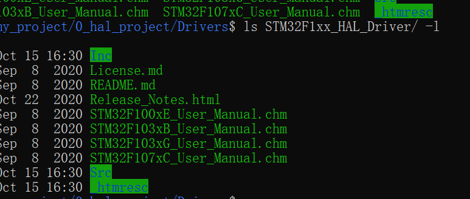
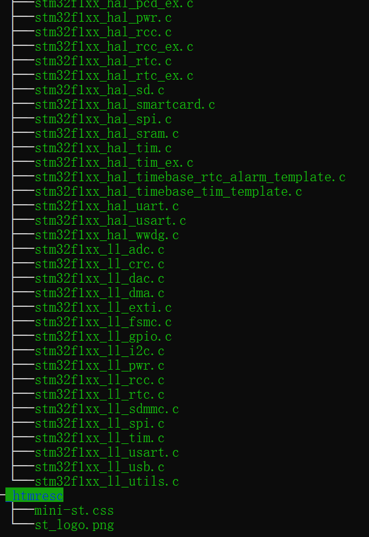

- [1. STM32的不同库](#1-stm32的不同库)
  - [1.1 标准库](#11-标准库)
  - [1.2 hal库（硬件抽象层）](#12-hal库硬件抽象层)
  - [1.3 LL库](#13-ll库)
  - [1.4 hal库和ll库的框图关系](#14-hal库和ll库的框图关系)
- [2. STM32工程项目结构](#2-stm32工程项目结构)
  - [2.1 本地工程根目录](#21-本地工程根目录)
    - [2.1.1 Drivers](#211-drivers)
      - [2.1.1.1 CMSIS](#2111-cmsis)
      - [2.1.1.2 HAL](#2112-hal)
      - [2.1.1.3 SYSTEM](#2113-system)
      - [2.1.1.4 BSP](#2114-bsp)
    - [2.1.2 Middlewares](#212-middlewares)
    - [2.1.3 User](#213-user)
  - [2.2 MDK](#22-mdk)

# 1. STM32的不同库
标准库和 HAL 库、LL 库完全相互独立。
1. `标准库`
主要是寄存器操作的一些封装。本质还是操作寄存器
2. `HAL库`
HAL 库更倾向于外设通用化，扩展组件中解决芯片差异操作部分，是硬件抽象层
3. `LL库`
LL 倾向于最简单的寄存器操作，属于是HAL的一些高效的补充

## 1.1 标准库
即类似使用宏定义和结构体进行裸机编程，其操作仍然是访问寄存器。

## 1.2 hal库（硬件抽象层）
即将应用软件功能和硬件分离，更方便移植到不同的平台。

## 1.3 LL库
比 HAL 库更接近于硬件底层的操作，代码更轻量级，代码执行效率更高的库函数组件

但 LL库不匹配复杂的外设，如 USB 等。所以 LL 库并不是每个外设都有对应的完整驱动配置程序。
## 1.4 hal库和ll库的框图关系

由图可见，总共有三层，上层是应用层User, 中层是Middlewares,下层是驱动层（硬件抽象层）（省略了CMSIS的底层芯片定义）

# 2. STM32工程项目结构

新建一个stm32的工程项目的步骤：
1. 创建本地文件夹作为工程根目录，并拷贝准备好必须的全部文件。（`芯片硬件相关`）
2. 用keil来指定好实际需要编译的对象。（`实际编译环境需要相关`）

下面逐一介绍

## 2.1 本地工程根目录

下面从下往上以此讲解每一层的作用

### 2.1.1 Drivers
这一层作为驱动底层可以具体细分为

#### 2.1.1.1 CMSIS
存放最低层硬件相关资源

可以看到，CMSIS下一共两个文件夹：Device, Include.

`CMSIS/Include`
里面存放了底层定义的编译器相关工具

`CMSIS/Device`
里面，指定了ST芯片公司的F1系列芯片具体系列设备。
然后Device下又细分为Source/, Include/。

`CMSIS/Device/Include`：
存放该系列芯片的base基础芯片定义和e型号的**芯片定义**。（同时包含了f1系列芯片**初始化的头文件**）
`CMSIS/Device/Source`:
包含了f1系列芯片初始化的c文件。同时指明了项目名：Templates/
我们使用arm里面的**startup启动汇编文件**。

#### 2.1.1.2 HAL

`Drivers/HAL` 
文件夹里面包含了所有的**hal驱动库**，硬件抽象层，所有和硬件平台相关的都在CMSIS中定义。我们在之后的构建编译MDK中选择我们需要的驱动加入项目编译选项
#### 2.1.1.3 SYSTEM

SYSTEM 文件夹中也是存放**系统功能的一些驱动库**，和HAL独立开来，以表示和系统最根本的功能强相关。
#### 2.1.1.4 BSP
这个暂时不需要
### 2.1.2 Middlewares
这个存放一些中间件，包括FreeRTOS, uORB,等协议，组件等。
### 2.1.3 User
这个存放系统主程序

## 2.2 MDK
**Keil** 
这个你可以把他理解为实际需要编译的一个编译选项。
我们已经把全部相关的资源都准备在本地的工程根目录，我们现在在这个根目录上开发，新建了一个项目。

选择我们需要的文件加入编译选项，比如
**startup**： 启动文件
**user**： 这是我们的用户主程序

下面两个是我们的驱动层代码
**Driver/SYSTEM**
**Driver/HAL**

(硬件相关的我们在魔棒的c++配置中加入头文件索引即可直接include)

最终编译文件结构为：

**注意**：
`system_stm32f1xx.c` 里面是定义`SystemInit`函数的，这个初始化函数是在`start_up.s`中调用，所以可以将`system_stm32f1xx.c`放到`startup`文件夹中也行。

另外，`stm32f1xx_it.c`是定义回调函数的，这里面我们只将`SysTick`的回调绑定成`hal库的回调`，实际就是计数加一。我试着将他在MDK中的位置放到`Driver/HAL`中也是一样的。