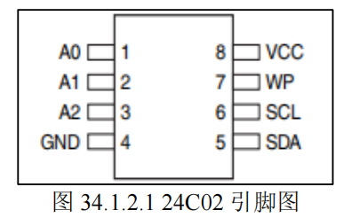

# stm32 i2c

## I2C 介绍
I2C 是 `两线`式`串行` `总线`, 用于连接微控制器以及其**外围设备**, 有两根线：`SDA(数据线)`，`SCL(时钟线)`

IIC 总线有如下特点：
- 总线由`数据线 SDA` 和`时钟线 SCL` 构成的串行总线
  - 数据线用来传输数据，时钟线用来同步数据收发。
- 总线上每一个器件都有一个**唯一的地址识别**，
  - 所以我们只需要知道器件的`地址`，根据`时序`就可以实现微控制器与器件之间的通信。
- 数据线 SDA 和时钟线 SCL 都是**双向线路**，都通过一个**电流源**或**上拉电阻连接到正的电压**
  - 所以当总线空闲的时候，这两条线路都是**高电平**。
- 总线上数据的**传输速率**
  - 在标准模式下可达 `100kbit/s` (12k字节/s)。
  - 在快速模式下可达 `400kbit/s` (48k字节每秒)
  - 在高速模式下可达 `3.4Mbit/s`(500k字节每秒)
- 总线支持设备连接。在使用 IIC 通信总线时，可以有多个具备 IIC 通信能力的设备挂载在上面
  - 同时支持**多个主机**和**多个从机**
  - 连接到总线的接口数量只由**总线电容 400pF 的限制决定**


## I2C 总线协议


> 记住，I2C，你就默认看SCL是高电平的时候，看就行了
### 1. 起始信号
当 `SCL 为高电平期间`，`SDA 由高到低的跳变`，

起始信号是一种`电平跳变时序`信号，而不是一个电平信号。

该信号**由主机发出**，在起始信号产生后，总线就处于被**占用状态**，准备数据传输。

> I2C起始信号 = 下降沿

### 2. 停止信号
当 `SCL 为高电平期间`，`SDA 由低到高的跳变`；

停止信号也是一种电平跳变时序信号，而不是一个电平信号。

该信号由**主机发出**，在停止信号发出后，总线就处于**空闲状态**。

> I2C停止信号 = 上升沿


### 3. 应答信号
发送器**每发送一个字节**(8bit)，就在时钟脉冲 9 期间**释放数据线(第9bit)**，由接收器**反馈一个应答信号**。

应答信号`为低电平`时，规定为`有效应答位`(`ACK` 简称应答位)，表示接收器已经成功地接收了

该字节；应答信号为`高电平`时，规定为非应答位(`NACK`)，一般表示接收器接收该字节`没有成功`。

观察上图标号③就可以发现，有效应答的要求是从机在第 9 个时钟脉冲之前的低电平期间**将 SDA 线拉低**，并且确保在该时钟的高电平期间**为稳定的低电平**。

> 如果接收器是**主机**，则在它收到最后一个字节后，发送一个**NACK信号**，以通知被控发送器`结束数据发送`，并释放 SDA线，以便主机接收器发送一个停止信号。


### 4. 数据有效性
IIC 总线进行**数据传送**时，**时钟信号为高电平**期间，数据线上的数据必须**保持稳定**，只有在时钟线上的信号为低电平期间，数据线上的高电平或低电平状态才允许变化。

数据在 **SCL 的上升沿到来之前就需准备好**。并在**下降沿到来之前必须稳定**。


### 5. 数据传输
在 IIC 总线上传送的`每一位数据`都有`一个时钟脉冲相对应`(或同步控制)，即在 SCL 串行时钟的配合下，在 SDA 上逐位地`串行传送每一位数据`。数据位的传输是边沿触发。

### 6. 空闲状态
IIC 总线的 `SDA` 和 `SCL` 两条信号线**同时处于高电平时**，规定为总线的空闲状态。此时各个器件的**输出级场效应管**均处在**截止状态**，即**释放总线**，由两条信号线**各自的上拉电阻把电平拉高**。


### 读写通信过程
IIC 的基本的读写通讯过程，包括
- **主机写数据**到从机，即写操作，
- **主机**到从机**读取数据**，即读操作

### 写操作


**时序流程**：

- (`主`)**起始信号** (Start)：主机将 SDA 线从高电平拉低，同时 SCL 为高电平。
- (`主`)发送**从机地址**(7bit) + **写操作** (0)(1bit)：主机发送 7 位从机地址，第 8 位为 0(表示写入)。
- (`从`)**应答 (ACK)**：所有**从机接收到该 8bit 数据**后，自行检验是否是自己的设备的地址, 从机识别到地址匹配，**拉低** SDA 线反馈一个应答位。
 - (`主`)发送**寄存器地址** (Reg Address)：主机发送想要操作的第一个寄存器地址。
 - (`从`)**应答 (ACK)**：从机接收后反馈 ACK。
> 开始发送字节数据, Loop(N)
 - (`主`)发送**数据 1** (Data 1)：主机发送**第一个字节数据**。
- (`从`)**应答 (ACK)**：从机接收后反馈 ACK。
>发送数据 N (Data N)：主机会继续发送后续数据，每发完一个字节，从机都要反馈一个 ACK。
>对于支持“**地址自增**”的从机，数据会**自动存入连续的寄存器**。
- (`主`)停止信号 (Stop)：全部发送完成后，主机在 SCL 为高电平时将 SDA 从低电平释放为高电平。


### 读操作


**读操作**通常分为**两个阶段**：
1. 先通过“**伪写**”告知**寄存器地址**，
2. 再进行**实际读取**。

**时序流程**：

- (`主`)**起始信号**(Start)。
- (`主`)发送**从机地址**(`7bit`) + **写操作(0)**(`1bit`) 
- (`从`)**应答 (ACK)**。
- (`主`)发送**寄存器地址** (Reg Address)：告诉从机你要**从哪个位置开始**。
- (`从`)**应答** (ACK)。
> 从这里开始，读操作和写操作开始区分了，意图显露
- (`主`)**重复起始信号** (Restart)：`不发送停止信号`，**直接再次发出起始信号**，准备**切换到读模式**。
- (`主`)发送**从机地址**(`7bit`) + **读操作(1)**(`1bit`) 。 主机发送 7 位地址，第 8 位为 1(**表示读取**)。
- (`从`)**应答 (ACK)**：从机反馈 ACK，**从机开始接管 SDA 控制权**。
> 接下来从机开始接管SDA，发送数据，Loop(N)
- (`从`)**从机发送数据 1** (Data 1)：从机发送数据，主机接收。
- (`主`)**主机应答** (ACK)：关键点，主机收到数据后，**如果还想继续读**，必须**拉低 SDA 反馈 ACK**。
- (`从`)**从机发送数据 N** (Data N)：重复上述过程。
- (`主`)**非应答 (NACK)**：当主机接收完`最后一个字节`后，必须发送 **NACK**(**高电平**)，告诉从机“`我不要了`”。
- (`主`)**停止信号** (Stop)。(起始停止信号，永远主机发出)

## 外设数据传输协议

由于i2c是用来读写外设内部数据的，本质上还是在传输**字节流**。

这就意味着，必须要规范这个**外设数据传输协议**，就是说，**如何理解这个字节流**。

下面以**24C02**这个外设的字节流(数据传输协议)为例

### 24C02
24C02 是一个:
-  `2K bit` (2^11bit)的`串行` `EEPROM 存储器`，内部含有 `256 个字节`(2^8byte)。
- 在 24C02 里面还有一个 `8 字节`的`页写缓冲器`
- 该设备的通信方式 `IIC`，通过其 SCL 和 SDA 与其他设备通信
- 24C02 设备的**读操作地址**为：**0xA1**，**写操作地址**为：**0xA0**




>WP 引脚是写保护引脚，接高电平只读，**接地允许读和写**(我们接地)

#### 24C02 单字节流写时序

这个就是正常的i2C的一次写一个字节的时序图

单字节写入到 24C02，**效率比较低**，所以 24C02 有**页写入时序**，大大
提高了写入效率，下面看一下 24C02 页写时序图

#### 24C02 页 写时序


在单字节写时序时，每次写入数据时都需要先写入设备的内存地址才能实现，在页写时序中，只需要告诉 24C02 第一个内存地址 1，后面数据会按照顺序写入到内存地址 2，内存地址 3等，大大节省了通信时间

> 这个本质上就是**写寄存器地址自动后移**

因为 24C02 **每次只能 8bit 数据**，所以它的**页大小**也就是 **1 字节**， 所以还是字节流

#### 24C02 读时序


## 实验
ST 为了规避飞利浦 IIC 专利问题，将 STM32 的硬件 IIC 设计的比较复杂，而且稳定性不怎么好，所以这里我们不推荐使用。

用**软件模拟 IIC**，最大的好处就是**方便移植**，同一个代码兼容所有 MCU，任何一个单片机**只要有 IO 口**，就可以**很快的移植过去**，而且不需要特定的 IO 口。

而**硬件 IIC**，则**换一款 MCU，基本上就得重新移植**，这也是我们推荐使用软件模拟 IIC 的另外一个原因

本实验中，我们**通过 GPIO 来模拟 IIC**，所以不需要使用 FWLIB 分组下添加 HAL 库文件支持。实验工程中，我们新增了 myiic.c 存放 iic 底层驱动代码，24cxx.c 文件存放 24C02 驱动。

功能和代码很简单，就是靠gpio电平翻转来模拟i2c协议。不过多赘述了

有一点要注意：

```c
void iic_init(void)
{
    GPIO_InitTypeDef gpio_init_struct;

    IIC_SCL_GPIO_CLK_ENABLE();  /* SCL引脚时钟使能 */
    IIC_SDA_GPIO_CLK_ENABLE();  /* SDA引脚时钟使能 */

    gpio_init_struct.Pin = IIC_SCL_GPIO_PIN;
    gpio_init_struct.Mode = GPIO_MODE_OUTPUT_PP;        /* 推挽输出 */
    gpio_init_struct.Pull = GPIO_PULLUP;                /* 上拉 */
    gpio_init_struct.Speed = GPIO_SPEED_FREQ_HIGH;      /* 高速 */
    HAL_GPIO_Init(IIC_SCL_GPIO_PORT, &gpio_init_struct);/* SCL */

    gpio_init_struct.Pin = IIC_SDA_GPIO_PIN;
    gpio_init_struct.Mode = GPIO_MODE_OUTPUT_OD;        /* 开漏输出 */
    HAL_GPIO_Init(IIC_SDA_GPIO_PORT, &gpio_init_struct);/* SDA */
    /* SDA引脚模式设置,开漏输出,上拉, 这样就不用再设置IO方向了, 开漏输出的时候(=1), 也可以读取外部信号的高低电平 */

    iic_stop();     /* 停止总线上所有设备 */
}
```


**推挽输出**的**特点**是：
- 输出 1 时，上方的 P-MOS 管导通，将引脚强行拉到 VCC；
- 输出 0 时，下方的 N-MOS 管导通，将引脚强行拉到 GND。

- **短路风险**：
  - 如果主机配置为推挽输出 1(正在往 VCC 拉)，而此时从机正好产生应答 ACK 输出 0(正在往 GND 拉)，这就相当于 VCC 与 GND 直接打架(短路)。轻则通信失败，重则烧毁 GPIO。

- **无法监听**：推挽输出是一种“**强驱动**”，**外部设备很难改变它的电平**。
---

**开漏(Open-Drain)如何实现“读写合一”**？

这是 STM32 硬件设计的一个妙处。在**开漏输出模式**下，P-MOS 管是永远关闭的，只有 N-MOS 管受控制：

**写 0(拉低电平)**：N-MOS 导通，引脚接到 GND，由于此时电流流入 GND，电平变低。

**写 1(释放总线)**：**N-MOS 截止**。此时引脚处于“高阻态”，全靠外部或内部的上拉电阻将电平拉高。

> 开漏本质上只能控半边，另一边由上下拉的电阻来实现。

---

**为什么写 1 之后能直接读**？

正如你所猜测的，STM32 的**输入电路**(Input Data Register, IDR)在**开漏输出模式下**依然是工作的。

当你设置` ODR = 1`(写 1)时，主机**实际上**是“**松手**”了。这时候 SDA 线的电平高低完全由总线上其他设备说了算：

如果没有人拉低它，由于上拉电阻的存在，电平是高，你读 IDR 得到 1。

如果**有从机(Slave)为了发 ACK 把它拉低了**，电平就是低，你读**IDR得到到 0**。

**底层逻辑**：
在 STM32 的 GPIO 结构图中，输出控制回路和输入读取回路是并行的。只要你没有关闭输入施密特触发器，IDR 寄存器就会实时反映引脚上的电压情况。


>在很多**老的代码**里，你会看到读 ACK 之前要调用一次 IIC_SDA_IN()(改变寄存器把模式**从 Output 换成 Input**)，读完后再调用 IIC_SDA_OUT()。

---
**你的这份代码使用的 “开漏+上拉”方案 有以下好处**：

**省事**：不需要频繁切换 GPIO 的 Mode 寄存器，减少了 CPU 开销。

**安全**：利用了 I2C 标准的“线与(Wired-AND)”特性。只要有一个设备输出 0，总线就是 0。

**双向无缝**：只需要记住一个原则——在读取从机数据(或 ACK)之前，主机必须先写 1 释放总线。