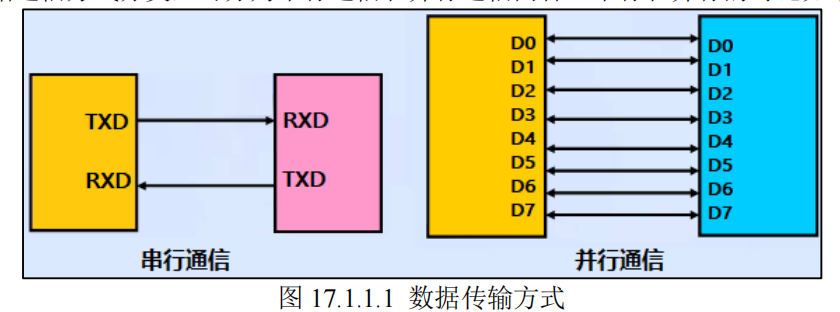
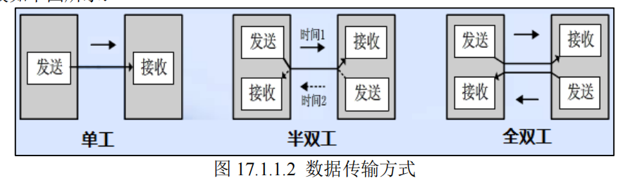
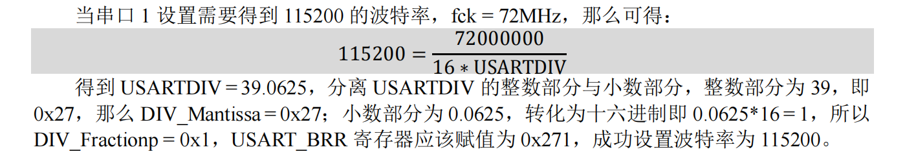
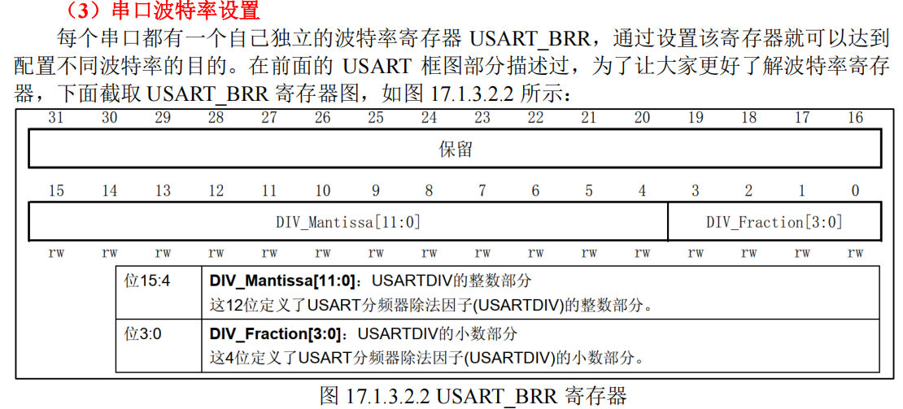
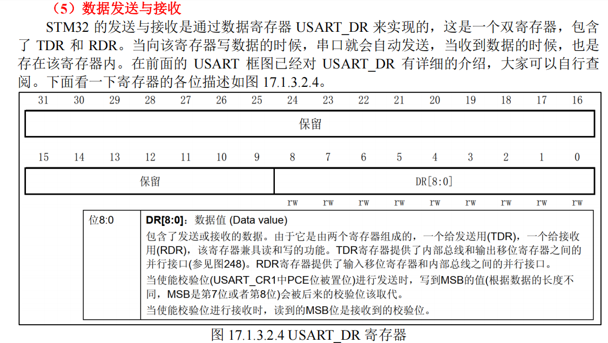
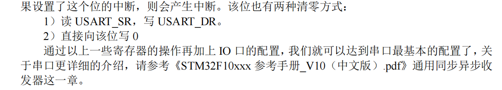

# 数据通信的基本概念
由于数据通信的需要，根据设备之间的电气特性，传输速率，可靠性要求不同，于是就有了各种的通信类型，通信协议，常见的有：
1. USART
2. IIC
3. SPI
4. CAN
5. USB

## 按通信方式分类：
**1. 串行通信**
   - **基本特征**是数据逐位顺序依次传输，优点是传输线少、布线成本低、灵活度高
等优点
   - 用于**近距离**人机交互，特殊处理后也可以用于远距离
   - **缺点**就是传输速率低


**2. 并行通信**
   - 数据各位可以通过多条线同时传输
   - 传输速率高
   - **成本高**，`抗干扰能力差`因而适用于`短距离、高速率`的通信




## 按数据传输方向分类
1. **全双工**
- 数据可以同时进行`双向传输`，日常的打电话属于这种情形

2. **半双工**
 -  指数据传输可以沿着两个方向，但是需要`分时进行`，如对讲机
3. **单工通信**
 - 指数据传输`仅能沿一个方向`，不能实现反方向传输，如校园广播





## 按数据同步方式分类
1. **同步通信**
- 要求通信双方共用`同一时钟信号`，在总线上保持统一的时序和周期完成信息传输
- **优点**：可以实现高速率、大容量的数据传输，以及点对多点传输。
- **缺点**：要求发送时钟和接收时钟保持严格同步，收发双方时钟允许的误差较小，同时硬件复杂


2. **异步通信**
- 无需时钟信号
- 而是**在数据信号中**加入开始位和停止位等一些**同步信号**，以便使接收端能够正确地将每一个字符接收下来，某些通信中**还需要双方约定传输速率**
- **优点**：没有时钟信号硬件简单，双方时钟可允许一定误差。
- **缺点**：通信速率较低，只适用点对点传输


## 通信速率
通信速率（**传输速率**）指数据在信道中传输的速度，它分为两种：
1. **传信率**
   - 每秒钟传输的信息量，即每秒钟传输的二进制位数，单位为 `bit/s`（即比特每秒），因而又称为`比特率`
2. 传码率
   - 每秒钟传输的`码元个数`，单位为 `Baud`（即波特每秒），因而又称为波特率
  
  > 码元就是一位/多位bit进行编码，码元携带一定的比特信息

>举个例子：波特率为 100 Baud，即每秒传输 100 个码元，如果码元采用十六进制编码（即M=2，代入上述式子），那么这时候的比特率就是 400 bit/s。如果码元采用二进制编码（即 M=2，代入上述式子），那么这时候的比特率就是 100 bit/s。
**采用二进制的时候，波特率和比特率数值上相等**


# 串口通信

**串口通信**是一种设备间常用的`串行`通信方式, 串口`按位（bit）`发送和接收`字节`

**串口通信协议** 是指规定了`数据包的内容`, 内容包含了
1. `起始位`
2. `主体数据`
3. `校验位`
4. `停止位`


> 双方需要约定一致的数据包格式才能正常收发数据的有关规范, 所以是**异步全双工串行通信**

常用的串口通信协议：
1. RS-232
2. RS-422 
3. RS-485


# 串口通信的协议层
串口通信的`数据包`由`发送设备的 TXD` 接口传输到`接收设备的 RXD` 接口。

在串口通信的协议层中，**规定了数据包的内容**，它由`起始位`、`主体数据`、`校验位`以及`停止位`组成，通讯双方的数据包格式要约定一致才能正常收发数据


串口通信协议数据包组成可以分为`波特率`和`数据帧格式`两部分

## 波特率
串口异步通信，异步通信是不需要时钟信号的。

`波特率`表示`每秒`钟传送的`码元符号的个数`，所以它决定了数据帧里面每
`一个位`的`时间长度`。两个要通信的设备的波特率一定要`设置相同`，我们常见的波特率是 4800、9600、115200 等

## 数据帧格式
1. **起始位和停止位**
-  `起始位`是由一个逻辑 0 的数据位表示，
-  `数据帧`的停止位可以是 0.5、1、1.5 或 2 个逻辑 1 的数据位表示
-  **双方约定一致即可**


2. **有效数据位**
- 这就是我们真正需要的数据，有效数据位通常会`被约定`为 5、6、7 或者 `8 个`位长。有效数据位是`低位（LSB）在前`，`高位（MSB）在后`


3. **校验位**
- 可以认为是一个特殊的数据位。校验位一般用来判断接收的数据位有无错误，检验
方法有：奇检验、偶检验、0 检验、1 检验以及无检验


> 这些串口uart通信协议，uart这个外设硬件已经替你实现了，如果你用gpio来模拟uart通信协议，才需要自己编写串口协议的逻辑


# stm32 uart
## 串口资源
**F1** 的串口分为两种：
- **USART**（即通用`同步异步`收发器）
- **UART**（即通用`异步`收发器）。

`UART` 是在 USART 基础上`裁剪掉了同步通信功能`，**只剩下异步通信功能**。简单区分同步和异步就是看通信时需不需要对外提供时钟输出，我们平时用串口通信基本都是**异步通信**。

---

ZET6 最多可提供 **5 路串口**

-  3 个 USART 
-  2 个 UART


>其中 USART1 的时钟源来于 APB2 时钟，其最大频率为 72MHz，其他 4 个串口的时钟源可以来于 APB1 时钟，其最大频率为 36MHz。

> STM32 的串口输出的是 TTL 电平信号


## 框图


### 第一部分 USART 信号引脚
1. `TX`：发送数据输出引脚
2. `RX`：接收数据输入引脚
3. SCLK：发送器时钟输出，适用于同步传输
4. SW_RX：数据接收引脚，属于内部引脚，用于智能卡模式
5. IrDA_RDI：IrDA 模式下的数据输入
6. IrDA_TDO：IrDA 模式下的数据输出
7. `nRTS`：(**0 == RX ready**) **请求发送**，若是低电平，表示 USART 准备好接收数据
8. `nCTS`：（**1 == 通知发送者，这个发完就不发了**）**清除发送**，若是高电平，在当前数据传输结束时阻断下一次的数据发送

### 第二部分 数据寄存器
USART_DR 这一块，包含了`已发送`或`接收到`的数据, 它本身就是**两个寄存器**组成的

左边的寄存器，给发送用的（`TDR`），右边的寄存器给接收用的（`RDR`）

>TDR/RDR 提供了`内部总线`和`输出/入移位寄存器`之间的**并行接口**

当进行**数据发送操作**时，往 USART_DR 中写入数据会自动`存储在 TDR`内；

当进行**读取操作**时，向 USART_DR 读取数据会自动`提取 RDR` 数据


### 第三部分 控制器
USART 有专门控制发送的发送器，控制接收的接收器，还有唤醒单元、中断控制等等

### 第四部分 时钟与波特率
这部分的主要功能就是为 USART 提供时钟以及配置波特率

（由此可见，即便他不依赖CLK线同步，但是工作肯定也是需要时钟的）

二进制系统中，波特率与波特率的数值相等，所以我们今后在把串口波特率理解为**每秒钟**传输的**二进制位数**


---

**fck** 是给**串口的时钟**
- USART2\3\3\4\5 的时钟源为 PCLK1
- USART1 的时钟源为 PCLK2
---


> 因此，这样就可以计算如何设置串口的波特率所需的参数了


## 寄存器
所以，寄存器的配置过程，说白了，就是根据你的协议需要（比如要不要校验位等），在寄存器里面配置具体的协议细节。

手册中的配置步骤：
1. 通过在 USART_CR1 寄存器上置位 `UE 位来激活` USART。
2. 编程 USART_CR1 的 M 位来`定义字长`。
3. 在 USART_CR2 中编程`停止位的位数`。
4. 如果采用多缓冲器通信，配置 USART_CR3 中的 DMA 使能位(DMAT)。按多缓冲器通信中的描述配置 **DMA 寄存器**。
5. 利用 USART_BRR 寄存器选择要求的`波特率`。
6. 设置 USART_CR1 中的 TE 位，发送一个`空闲帧作为第一次`数据发送。

7. 把要发送的数据写进 USART_DR 寄存器(此动作清除 TXE 位)。在只有一个缓冲器的情况下，对每个待发送的数据重复步骤 7。

8. 在 USART_DR 寄存器中写入最后一个数据字后，要等待 TC=1，它表示最后一个数据帧的传输结束。(**这个就是串口驱动的发送方法内部需要实现的逻辑了**)

9.  当需要关闭 USART 或需要进入停机模式之前，需要确认传输结束，避免破坏最后一次传输 (**这个就是串口驱动的关闭方法内部需要实现的逻辑了**)

### CR
很有意思的是，串口复位的控制寄存器，居然是定义在RCC的寄存器里面的。





> TE 为**发送使能位**，设置为 1，将开启串口的发送功能。
> 
> RE 为**接收使能位**，用法同 TE


> TXIE 为**发送缓冲区空**中断使能位，置1，当 USART_**SR** 中的 `TXE` 位为1 时，将产生串口中断。
> 
> TCIE 为**发送完成**中断使能位，置1，当 USART_**SR** 中的 `TC`位为 1 时，将产生串口中断
> 
> RXNEIE 为**接收缓冲区非空**中断使能，置1，当 USART_**SR**中的 `ORE` 或者 `RXNE` 位为 1 时，将产生串口中断
>

```c
TXIE 触发的核心是 “发送缓冲区空，可写新数据”，用于持续发送；
TCIE 触发的核心是 “发送完全结束”，用于确认发送完成；
RXNEIE 触发的核心是 “接收有数据可读” 或 “接收溢出错误”，是接收数据的核心中断。

持续发送：
利用 TXE 中断（发送缓冲区空）不断填充下一个字节，直到数据发完。关于 “发完后如何停止中断”，在中断服务函数中主动关闭 TXIE 是行业内的标准做法，也是最稳妥、最高效的方式
```

### DR




> 当向该寄存器写数据的时候，串口就会自动发送，
> 
> 当收到数据的时候，也是存在该寄存器内


### SR



> **RXNE（读数据寄存器非空）**，当该位被置 1 的时候，就是提示已经有数据被接收到了，并且**可以读出来了**。这时候我们要做的就是(**尽快去读取 USART_DR**)（接收中断的标志），通过读 USART_DR 可以将该位清零，也可以向该位写 0，直接清除


> **TC（发送完成）**，当该位被置位的时候，表示 USART_**DR 内的数据已经被发送完成了**
> 
> 也有两种清零方式：
1）读 USART_SR，写 USART_DR。
2）直接向该位写 0

## 实验
这个实验也比较简单，上面的uart模块内部框图+寄存器，以及中断触发方式弄懂之后，HAL已经为我们编写好了uart的串口驱动。

实验：uart1定时发送数据，若收到数据，就立刻把收到的数据返回发送出去。

一次接收，一次发送，就是一个字节嘛

老规矩：
涉及外设：
1. uart1
2. NVIC
3. AFIO
4. gpio(复用)

usart_init()
```c
void usart_init(uint32_t baudrate)
{
    /*UART 初始化设置*/
    g_uart1_handle.Instance = USART_UX;                                       /* USART_UX */
    g_uart1_handle.Init.BaudRate = baudrate;                                  /* 波特率 */
    g_uart1_handle.Init.WordLength = UART_WORDLENGTH_8B;                      /* 字长为8位数据格式 */
    g_uart1_handle.Init.StopBits = UART_STOPBITS_1;                           /* 一个停止位 */
    g_uart1_handle.Init.Parity = UART_PARITY_NONE;                            /* 无奇偶校验位 */
    g_uart1_handle.Init.HwFlowCtl = UART_HWCONTROL_NONE;                      /* 无硬件流控 */
    g_uart1_handle.Init.Mode = UART_MODE_TX_RX;                               /* 收发模式 */
    HAL_UART_Init(&g_uart1_handle);                                           /* HAL_UART_Init()会使能UART1 */

    /* 该函数会开启接收中断：标志位UART_IT_RXNE，并且设置接收缓冲以及接收缓冲接收最大数据量 */
    HAL_UART_Receive_IT(&g_uart1_handle, (uint8_t *)g_rx_buffer, RXBUFFERSIZE); 
}

/**
 * @brief       UART底层初始化函数
 * @param       huart: UART句柄类型指针
 * @note        此函数会被HAL_UART_Init()调用
 *              完成时钟使能，引脚配置，中断配置
 * @retval      无
 */
void HAL_UART_MspInit(UART_HandleTypeDef *huart)
{
    GPIO_InitTypeDef gpio_init_struct;

    if (huart->Instance == USART_UX)                            /* 如果是串口1，进行串口1 MSP初始化 */
    {
        USART_TX_GPIO_CLK_ENABLE();                             /* 使能串口TX脚时钟 */
        USART_RX_GPIO_CLK_ENABLE();                             /* 使能串口RX脚时钟 */
        USART_UX_CLK_ENABLE();                                  /* 使能串口时钟 */

        gpio_init_struct.Pin = USART_TX_GPIO_PIN;               /* 串口发送引脚号 */
        gpio_init_struct.Mode = GPIO_MODE_AF_PP;                /* 复用推挽输出 */
        gpio_init_struct.Pull = GPIO_PULLUP;                    /* 上拉 */
        gpio_init_struct.Speed = GPIO_SPEED_FREQ_HIGH;          /* IO速度设置为高速 */
        HAL_GPIO_Init(USART_TX_GPIO_PORT, &gpio_init_struct);
                
        gpio_init_struct.Pin = USART_RX_GPIO_PIN;               /* 串口RX脚 模式设置 */
        gpio_init_struct.Mode = GPIO_MODE_AF_INPUT;    
        HAL_GPIO_Init(USART_RX_GPIO_PORT, &gpio_init_struct);   /* 串口RX脚 必须设置成输入模式 */
        
#if USART_EN_RX
        HAL_NVIC_EnableIRQ(USART_UX_IRQn);                      /* 使能USART1中断通道 */
        HAL_NVIC_SetPriority(USART_UX_IRQn, 3, 3);              /* 组2，最低优先级:抢占优先级3，子优先级3 */
#endif
    }
}
```

可以看到：
1. 使能gpio引脚时钟
2. 使能串口时钟
3. 配置io复用（hal里面使能afio时钟）
4. 配置NVIC（使能串口中断响应，优先级）
5. 配置uart外设（接收，发送中断都打开了）

核心看一下，他是如何实现，uart发送数据，uart接收数据

### 1. uart发送数据。
#### 直接发送
先看printf(), 底层调用的是fputc
```c
/* MDK下需要重定义fputc函数, printf函数最终会通过调用fputc输出字符串到串口 */
int fputc(int ch, FILE *f)
{
    while ((USART_UX->SR & 0X40) == 0);     /* 等待上一个字符发送完成 */

    USART_UX->DR = (uint8_t)ch;             /* 将要发送的字符 ch 写入到DR寄存器 */
    return ch;
}
#endif
```

可以看到，是**直接写的数据寄存器**，没有走发送完成中断来实现持续发送

#### 发送本地内存中的数据
可以看到，main.c中，如果收到了一组完整的数据，程序会把他发送出去
```c
//main.c
            HAL_UART_Transmit(&g_uart1_handle,(uint8_t*)g_usart_rx_buf, len, 1000);    /* 发送接收到的数据 */
```

可以看到，这个方法本身也是一个阻塞方式进行发送的，不是非阻塞方式。底层还是不停的写数据寄存器
```c
/**
  * @brief  Sends an amount of data in blocking mode.
  * @note   When UART parity is not enabled (PCE = 0), and Word Length is configured to 9 bits (M1-M0 = 01),
  *         the sent data is handled as a set of u16. In this case, Size must indicate the number
  *         of u16 provided through pData.
  * @param  huart Pointer to a UART_HandleTypeDef structure that contains
  *               the configuration information for the specified UART module.
  * @param  pData Pointer to data buffer (u8 or u16 data elements).
  * @param  Size  Amount of data elements (u8 or u16) to be sent
  * @param  Timeout Timeout duration
  * @retval HAL status
  */
HAL_StatusTypeDef HAL_UART_Transmit(UART_HandleTypeDef *huart, uint8_t *pData, uint16_t Size, uint32_t Timeout)
{

   //......
    while (huart->TxXferCount > 0U)
    {
      if (UART_WaitOnFlagUntilTimeout(huart, UART_FLAG_TXE, RESET, tickstart, Timeout) != HAL_OK)
      {
        return HAL_TIMEOUT;
      }
      if (pdata8bits == NULL)
      {
        huart->Instance->DR = (uint16_t)(*pdata16bits & 0x01FFU);
        pdata16bits++;
      }
      else
      {
        huart->Instance->DR = (uint8_t)(*pdata8bits & 0xFFU);
        pdata8bits++;
      }
      huart->TxXferCount--;
    }
   //......
}
```


而他的下面有一个非阻塞的方式进行发送。（这个是非阻塞发送一整个字符串）
```c
/**
  * @brief  Sends an amount of data in non blocking mode.
  * @note   When UART parity is not enabled (PCE = 0), and Word Length is configured to 9 bits (M1-M0 = 01),
  *         the sent data is handled as a set of u16. In this case, Size must indicate the number
  *         of u16 provided through pData.
  * @param  huart Pointer to a UART_HandleTypeDef structure that contains
  *               the configuration information for the specified UART module.
  * @param  pData Pointer to data buffer (u8 or u16 data elements).
  * @param  Size  Amount of data elements (u8 or u16) to be sent
  * @retval HAL status
  */
HAL_StatusTypeDef HAL_UART_Transmit_IT(UART_HandleTypeDef *huart, uint8_t *pData, uint16_t Size)
{
  /* Check that a Tx process is not already ongoing */
  if (huart->gState == HAL_UART_STATE_READY)
  {
    if ((pData == NULL) || (Size == 0U))
    {
      return HAL_ERROR;
    }

    /* Process Locked */
    __HAL_LOCK(huart);

    huart->pTxBuffPtr = pData;
    huart->TxXferSize = Size;
    huart->TxXferCount = Size;

    huart->ErrorCode = HAL_UART_ERROR_NONE;
    huart->gState = HAL_UART_STATE_BUSY_TX;

    /* Process Unlocked */
    __HAL_UNLOCK(huart);

    /* Enable the UART Transmit data register empty Interrupt */
    __HAL_UART_ENABLE_IT(huart, UART_IT_TXE);

    return HAL_OK;
  }
  else
  {
    return HAL_BUSY;
  }
}
```
可以看到，这边实际上就是，制定好他要发送的内存起始地址和字节数，然后`__HAL_UART_ENABLE_IT`打开发送中断，这样，一旦发送是空的就直接开始拷贝发送了，就实现了**非阻塞发送**。

可以看到，在hal的uart1的中断处理函数里面：
```c
  /* UART in mode Transmitter ------------------------------------------------*/
  if (((isrflags & USART_SR_TXE) != RESET) && ((cr1its & USART_CR1_TXEIE) != RESET))
  {
    UART_Transmit_IT(huart);
    return;
  }

  /* UART in mode Transmitter end --------------------------------------------*/
  if (((isrflags & USART_SR_TC) != RESET) && ((cr1its & USART_CR1_TCIE) != RESET))
  {
    UART_EndTransmit_IT(huart);
    return;
  }
  
```

可以看到，下面这个就是在开启了非阻塞发送后，**每次进入发送空中断**后执行的内容，**每次写一个字节的函数**。
```c
static HAL_StatusTypeDef UART_Transmit_IT(UART_HandleTypeDef *huart)
{
  uint16_t *tmp;

  /* Check that a Tx process is ongoing */
  if (huart->gState == HAL_UART_STATE_BUSY_TX)
  {
    if ((huart->Init.WordLength == UART_WORDLENGTH_9B) && (huart->Init.Parity == UART_PARITY_NONE))
    {
      tmp = (uint16_t *) huart->pTxBuffPtr;
      huart->Instance->DR = (uint16_t)(*tmp & (uint16_t)0x01FF);
      huart->pTxBuffPtr += 2U;
    }
    else
    {
      huart->Instance->DR = (uint8_t)(*huart->pTxBuffPtr++ & (uint8_t)0x00FF);
    }

    if (--huart->TxXferCount == 0U)
    {
      /* Disable the UART Transmit Complete Interrupt */
      __HAL_UART_DISABLE_IT(huart, UART_IT_TXE);

      /* Enable the UART Transmit Complete Interrupt */
      __HAL_UART_ENABLE_IT(huart, UART_IT_TC);
    }
    return HAL_OK;
  }
  else
  {
    return HAL_BUSY;
  }
}
```


### 2. uart 接收

所以，根据上面对发送的分析，有用中断的非阻塞，和不用中断的阻塞方式

下面接收，更是直接在usart_init()里面，开启了**非阻塞接收**。
```c
    /* 该函数会开启接收中断：标志位UART_IT_RXNE，并且设置接收缓冲以及接收缓冲接收最大数据量 */
    HAL_UART_Receive_IT(&g_uart1_handle, (uint8_t *)g_rx_buffer, RXBUFFERSIZE); 
```


下面来仔细剖析一下，他这个非阻塞接收的实现。

`HAL_UART_Receive_IT`()
```c
HAL_StatusTypeDef HAL_UART_Receive_IT(UART_HandleTypeDef *huart, uint8_t *pData, uint16_t Size)
{
  /* Check that a Rx process is not already ongoing */
  if (huart->RxState == HAL_UART_STATE_READY)
  {
    huart->pRxBuffPtr = pData;
    huart->RxXferCount = Size;

    /* Enable the UART Data Register not empty Interrupt */
    __HAL_UART_ENABLE_IT(huart, UART_IT_RXNE);

    return HAL_OK;
}

```
可以看到核心就两件事，
1. 指定一个接收缓冲区内存的起始地址 = huart->pRxBuffPtr
2. 记录下要接收的字节数（缓冲区的长度）= huart->RxXferCount
3. 打开**接收区空中断**

这样之后，收到一个字节，就会触发一次接收中断，进入`HAL_UART_IRQHandler`
```c
void HAL_UART_IRQHandler(UART_HandleTypeDef *huart)
{
   //此时收到了一个字节在DB里面
    /* UART in mode Receiver -------------------------------------------------*/
    if (((isrflags & USART_SR_RXNE) != RESET) && ((cr1its & USART_CR1_RXNEIE) != RESET))
    {
      UART_Receive_IT(huart);
      return;
    }
  }

```

UART_Receive_IT来处理这个接收到的字节
```c
static HAL_StatusTypeDef UART_Receive_IT(UART_HandleTypeDef *huart)
{
  uint8_t  *pdata8bits;
  uint16_t *pdata16bits;

  /* Check that a Rx process is ongoing */
  if (huart->RxState == HAL_UART_STATE_BUSY_RX)
  {
    if ((huart->Init.WordLength == UART_WORDLENGTH_9B) && (huart->Init.Parity == UART_PARITY_NONE))
    {

      // 1. 往指针指向的地方，写入一个字节。然后指针→移
      pdata8bits  = NULL;
      pdata16bits = (uint16_t *) huart->pRxBuffPtr;
      *pdata16bits = (uint16_t)(huart->Instance->DR & (uint16_t)0x01FF);
      huart->pRxBuffPtr += 2U;
    }
    else
    {
      pdata8bits = (uint8_t *) huart->pRxBuffPtr;
      pdata16bits  = NULL;

      if ((huart->Init.WordLength == UART_WORDLENGTH_9B) || ((huart->Init.WordLength == UART_WORDLENGTH_8B) && (huart->Init.Parity == UART_PARITY_NONE)))
      {
        *pdata8bits = (uint8_t)(huart->Instance->DR & (uint8_t)0x00FF);
      }
      else
      {
        *pdata8bits = (uint8_t)(huart->Instance->DR & (uint8_t)0x007F);
      }
      huart->pRxBuffPtr += 1U;
    }

    // 1. 剩余需要待接收的字节计数--， 并判断是否 == 0， 缓冲区收满了，就关掉接收中断
    if (--huart->RxXferCount == 0U)
    {
      /* Disable the UART Data Register not empty Interrupt */
      __HAL_UART_DISABLE_IT(huart, UART_IT_RXNE);

      /* Disable the UART Parity Error Interrupt */
      __HAL_UART_DISABLE_IT(huart, UART_IT_PE);

      /* Disable the UART Error Interrupt: (Frame error, noise error, overrun error) */
      __HAL_UART_DISABLE_IT(huart, UART_IT_ERR);

      /* Rx process is completed, restore huart->RxState to Ready */
      huart->RxState = HAL_UART_STATE_READY;

#if (USE_HAL_UART_REGISTER_CALLBACKS == 1)
      /*Call registered Rx complete callback*/
      huart->RxCpltCallback(huart);
#else
      //缓冲区收满了，开始处理回调
      HAL_UART_RxCpltCallback(huart);
#endif /* USE_HAL_UART_REGISTER_CALLBACKS */

      return HAL_OK;
    }
    return HAL_OK;
  }
  else
  {
    return HAL_BUSY;
  }
}
```

所以,进行一次非阻塞接收，就会一直开始接收，知道收满整个缓冲区为止。
```c
HAL_UART_Receive_IT(&g_uart1_handle, (uint8_t *)g_rx_buffer, RXBUFFERSIZE); 
```

注意，当每次接收一个字节，发现收完了之后，会调用一个回调函数：
`HAL_UART_RxCpltCallback`

这是个若定义，我们重新实现这个针对`这个收满的缓冲区g_rx_buffer`的回调函数。这些实际上，就是些字符串判断+处理了。没什么好说的。
```c
void HAL_UART_RxCpltCallback(UART_HandleTypeDef *huart)
{
    if (huart->Instance == USART_UX)                    /* 如果是串口1 */
    {
        if ((g_usart_rx_sta & 0x8000) == 0)             /* 接收未完成 */
        {
            if (g_usart_rx_sta & 0x4000)                /* 接收到了0x0d（即回车键） */
            {
                if (g_rx_buffer[0] != 0x0a)             /* 接收到的不是0x0a（即不是换行键） */
                {
                    g_usart_rx_sta = 0;                 /* 接收错误,重新开始 */
                }
                else                                    /* 接收到的是0x0a（即换行键） */
                {
                    g_usart_rx_sta |= 0x8000;           /* 接收完成了 */
                }
            }
            else                                        /* 还没收到0X0d（即回车键） */
            {
                if (g_rx_buffer[0] == 0x0d)
                    g_usart_rx_sta |= 0x4000;
                else
                {
                    g_usart_rx_buf[g_usart_rx_sta & 0X3FFF] = g_rx_buffer[0];
                    g_usart_rx_sta++;

                    if (g_usart_rx_sta > (USART_REC_LEN - 1))
                    {
                        g_usart_rx_sta = 0;             /* 接收数据错误,重新开始接收 */
                    }
                }
            }
        }

        HAL_UART_Receive_IT(&g_uart1_handle, (uint8_t *)g_rx_buffer, RXBUFFERSIZE);
    }
}
```
每次进入这个回调函数，说明这个缓冲区已经收满了，并且接收中断也关了，这个时候，就再执行一次`HAL_UART_Receive_IT（）`,再次开启下一轮的非阻塞接收。

这样就实现了，**不停的对接收的字符串，进行处理**。

然后主进程里面判断一下，上次接收的字符串如果符合要求，就发送字符串（里面是阻塞发送）