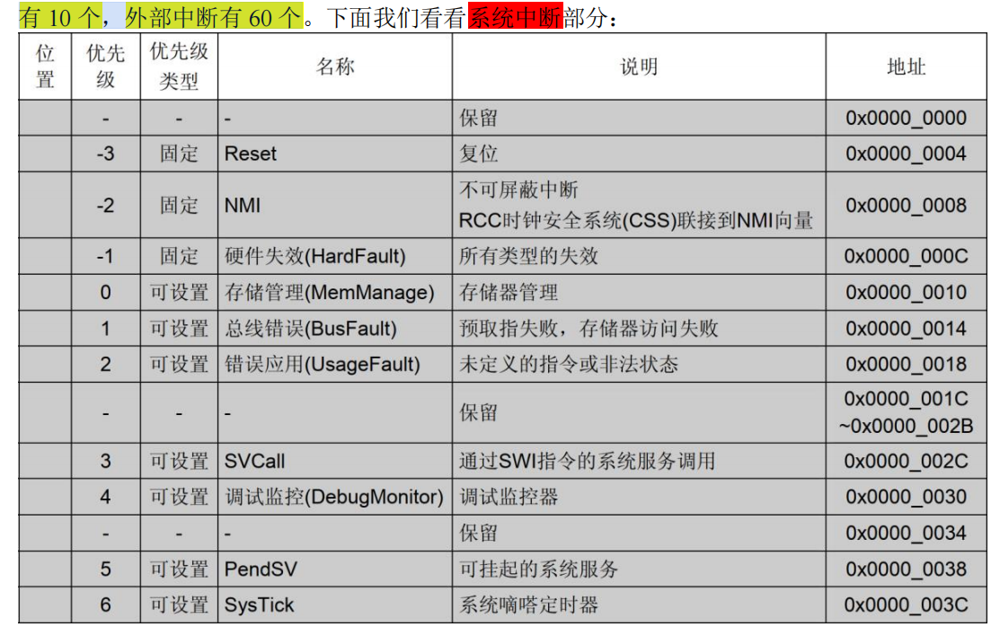

# stm32中断和事件

## stm32的中断资源
NVIC 即嵌套向量中断控制器， 是内核的器件，`M3 内核`都是支持 `256 个中断`,总共包括：
   - **16 个系统中断**
   - **240 个外部中断**

但实际上，ZET6 的`系统中断`只用了 `10` 个，`外部中断有 60` 个



>中断向量表在 `STM32F103xx.h` 文件中被定义

## NVIC
NVIC 相关的寄存器定义了可以在 `core_cm3.h` 文件中找到
```c
typedef struct
{
  __IOM uint32_t ISER[8U];               /* 中断使能寄存器 */
        uint32_t RESERVED0[24U];
  __IOM uint32_t ICER[8U];               /* 中断清除使能寄存器 */
        uint32_t RSERVED1[24U];
  __IOM uint32_t ISPR[8U];               /* 中断使能挂起寄存器 */
        uint32_t RESERVED2[24U];
  __IOM uint32_t ICPR[8U];               /* 中断解挂寄存器 */
        uint32_t RESERVED3[24U];
  __IOM uint32_t IABR[8U];               /* 中断有效位寄存器 */
        uint32_t RESERVED4[56U];
  __IOM uint8_t  IP[240U];               /* 中断优先级寄存器（8Bit 位宽） */
        uint32_t RESERVED5[644U];
  __OM  uint32_t STIR;                   /* 软件触发中断寄存器 */
}  NVIC_Type;

```

**ISER**

上面说了 CM3 内核总共支持 `256 个中断`，这里用 `8 个 32 位寄存器来控制`，刚好一一对应，每个位控制一个中断。但是STM32`F103的可屏蔽中断最多只有60个`，所以对我们来说，`有用的就是两个(ISER[0]和ISER[1])`，总共可以表示 64 个中断

你要`使能某个中断`，必须`设置相应的 ISER 位为 1`，使该中断被使能(这里`仅仅是使能`，还要配合中断分组、屏蔽、IO 口映射等设置才算是一个完整的中断设置)

**ICER**

和ISER相反，作用是关闭中断

**ISPR**

中断使能挂起控制寄存器组，置 1，可以`将正在进行的中断挂起`，而**执行同级或更高级别的中断**。写 0 是无效的

**ICPR**

置 1，可以将挂起的**中断解挂**。写 0 无效

**IABR**

中断激活标志位寄存器组, 为 1，则表示该位所对应的**中断正在被执行**。这是一个只读寄存器，通过它可以**知道当前在执行的中断是哪一个**。在中断执行完了由**硬件自动清零**

**IP[240]**

中断**优先级**控制的寄存器组。注意，这里是240个，因此这里NVIC只能管理**240个外部中断**

> 每个外部中断，一个8bit的优先级IP，实际有效位是只用了`高 4 位`, 这4位又分为，`抢占优先级`和`子优先级`。具体两种优先级如何组合，由`SCB->AIRCR` 中的中断分组设置来决定

> 考虑到和rtos的兼容，我们一般选**分组4**，全部用抢占优先级


> 总结：
> 以上，发现，NVIC寄存器组，可以设置`总体的优先级分组`，`外部中断的使能`，`优先级`


## EXTI

EXTI 即是外部中断和事件控制器, 由 20 个产生事件/中断请求的**边沿检测器**组成, 说白了，就是个边缘检测器，提供触发中断的硬件信号。

**说白了，就是给一些没有中断功能的功能，提供中断**

### 框图


可以看到，有两条主线，一条是`由输入线到 NVIC 中断控制器`，一条是`由输入线到脉冲发生器`。

这就恰恰是 EXTI 的**两大部分功能**，
- 产生中断
- 产生事件
  
两者从硬件上就存在不同

### 产生中断
- 通过配置寄存器设置为任何一个 GPIO 口，或者是一些外设的事件。输入线一般都是**存在电平变化的信号**
- 经过**边沿检测电路**，捕获上升沿下降沿
- 考虑判断是否**软件中断**
- 判断中断屏蔽IMR

### 产生脉冲事件
- 事件产生，不多细说，方法差不多，核心就是，使脉冲发生器电路产生一个脉冲

一般输出到如`定时器`，`模拟数字转换器`等，这样的脉冲信号一般用来触发 TIM 或者 ADC 开始转换


> `产生中断`线路目的使把输入信号输入到 NVIC，进一步运行中断服务函数，实现功能。
> 
> `产生事件`线路目的是传输一个脉冲信号给其他外设使用，属于硬件级功能

### EXTI支持输入
EXTI 支持 19 个外部中断/事件请求

1. EXTI 线 0~15：对应外部 IO 口的输入中断
2. EXTI 线 16：连接到 PVD 输出
3. EXTI 线 17：连接到 RTC 闹钟事件
4. EXTI 线 18：连接到 USB 唤醒事件
5. EXTI 线 19：连接到以太网唤醒事件

IO 口使用的中断线只有 16 个,但这个不是说，EXTI只能给16个GPIO提供中断功能

STM32，一共7个GPIO组外设（ABCDEFG），每组16个

即便这样，那么**每个EXTI0-15, 还要对应7个gpio** （exti0 -> A0,B0....G0）,具体对应哪个gpio呢？

> GPIO 和中断线映射关系是在寄存器 `AFIO_EXTICR1 ~ AFIO_EXTICR4` 中配置的

注意：我们配置 AFIO 相关寄存器前，还需要打开 AFIO 时钟，因为AFIO也是一个外设。

总结：我们如果需要gpio输入中断，涉及的外设有：
1. NVIC
2. GPIO组
3. EXTI
4. AFIO


## 实验
细节很简单，就不用说了

以`PE4`作为输入中断为例

```c
int main(void)
{
    HAL_Init();                            /* 初始化HAL库 */
    sys_stm32_clock_init(RCC_PLL_MUL9);    /* 设置时钟, 72Mhz */
    delay_init(72);                        /* 延时初始化 */
    usart_init(115200);                    /* 串口初始化为115200 */
    led_init();                            /* 初始化LED */  //PB5, PE5
    beep_init();                           /* 初始化蜂鸣器 */  //PB8
    extix_init();                          /* 初始化外部中断输入 */  //PE4,PE3,PA0
    LED0(0);                               /* 先点亮红灯 */

    while (1)
    {
        printf("OK\r\n");
        delay_ms(1000);
    }
}
```

在extix_init()内部：
```c
void extix_init(void)
{
    GPIO_InitTypeDef gpio_init_struct;

    KEY0_GPIO_CLK_ENABLE();                                  /* KEY0时钟使能 */
    KEY1_GPIO_CLK_ENABLE();                                  /* KEY1时钟使能 */
    WKUP_GPIO_CLK_ENABLE();                                  /* WKUP时钟使能 */

    gpio_init_struct.Pin = KEY0_INT_GPIO_PIN;
    gpio_init_struct.Mode = GPIO_MODE_IT_FALLING;            /* 下升沿触发 */
    gpio_init_struct.Pull = GPIO_PULLUP;
    HAL_GPIO_Init(KEY0_INT_GPIO_PORT, &gpio_init_struct);    /* KEY0配置为下降沿触发中断 */

    gpio_init_struct.Pin = KEY1_INT_GPIO_PIN;
    gpio_init_struct.Mode = GPIO_MODE_IT_FALLING;            /* 下升沿触发 */
    gpio_init_struct.Pull = GPIO_PULLUP;
    HAL_GPIO_Init(KEY1_INT_GPIO_PORT, &gpio_init_struct);    /* KEY1配置为下降沿触发中断 */
    
    gpio_init_struct.Pin = WKUP_INT_GPIO_PIN;
    gpio_init_struct.Mode = GPIO_MODE_IT_RISING;             /* 上升沿触发 */
    gpio_init_struct.Pull = GPIO_PULLDOWN;
    HAL_GPIO_Init(WKUP_GPIO_PORT, &gpio_init_struct);        /* WKUP配置为下降沿触发中断 */


    HAL_NVIC_SetPriority(KEY0_INT_IRQn, 0, 2);               /* 抢占0，子优先级2 */
    HAL_NVIC_EnableIRQ(KEY0_INT_IRQn);                       /* 使能中断线4 */

    HAL_NVIC_SetPriority(KEY1_INT_IRQn, 1, 2);               /* 抢占1，子优先级2 */
    HAL_NVIC_EnableIRQ(KEY1_INT_IRQn);                       /* 使能中断线3 */

    HAL_NVIC_SetPriority(WKUP_INT_IRQn, 2, 2);               /* 抢占2，子优先级2 */
    HAL_NVIC_EnableIRQ(WKUP_INT_IRQn);                       /* 使能中断线0 */
}
```
`HAL_GPIO_Init`()已经帮你配置exti和afio这两个外设了，看看HAL的驱动里面的实现
```c
     /*--------------------- EXTI Mode Configuration ------------------------*/
      /* Configure the External Interrupt or event for the current IO */
      if ((GPIO_Init->Mode & EXTI_MODE) == EXTI_MODE)
      {
        /* Enable AFIO Clock */
        __HAL_RCC_AFIO_CLK_ENABLE();
        temp = AFIO->EXTICR[position >> 2u];
        CLEAR_BIT(temp, (0x0Fu) << (4u * (position & 0x03u)));
        SET_BIT(temp, (GPIO_GET_INDEX(GPIOx)) << (4u * (position & 0x03u)));
        AFIO->EXTICR[position >> 2u] = temp;


        /* Configure the interrupt mask */
        if ((GPIO_Init->Mode & GPIO_MODE_IT) == GPIO_MODE_IT)
        {
          SET_BIT(EXTI->IMR, iocurrent);
        }
        else
        {
          CLEAR_BIT(EXTI->IMR, iocurrent);
        }

        /* Configure the event mask */
        if ((GPIO_Init->Mode & GPIO_MODE_EVT) == GPIO_MODE_EVT)
```
可以看到，如果你配置了GPIO的模式是用外部中断，那么会先使能AFIO外设


另外也可以看到，extix_init()里面，最后，也设置NVIC的相应中断优先级+使能中断（这个就是NVIC仅仅能做的事）。

最终，当触发中断后，会跳转到来执行。
```c
                DCD     EXTI4_IRQHandler           ; EXTI Line 4
```
但是要注意，这个中断处理函数，对应的EXTI4，是对应很多个GPIO的触发可能的。所以，内部还需要判断中断源头。

一般来说，为了方便管理，我们把中断向量表里面的中断处理函数重定向到HAL中，这样同意都是在驱动层进行统一处理和管理。

```c
void KEY0_INT_IRQHandler(void)
{
    HAL_GPIO_EXTI_IRQHandler(KEY0_INT_GPIO_PIN);         /* 调用中断处理公用函数 清除KEY0所在中断线 的中断标志位 */
    __HAL_GPIO_EXTI_CLEAR_IT(KEY0_INT_GPIO_PIN);         /* HAL库默认先清中断再处理回调，退出时再清一次中断，避免按键抖动误触发 */
}
```

```c
void HAL_GPIO_EXTI_IRQHandler(uint16_t GPIO_Pin)
{
  /* EXTI line interrupt detected */
  if (__HAL_GPIO_EXTI_GET_IT(GPIO_Pin) != 0x00u)
  {
    __HAL_GPIO_EXTI_CLEAR_IT(GPIO_Pin);
    HAL_GPIO_EXTI_Callback(GPIO_Pin);
  }
}

__weak void HAL_GPIO_EXTI_Callback(uint16_t GPIO_Pin)
{
  /* Prevent unused argument(s) compilation warning */
  UNUSED(GPIO_Pin);
  /* NOTE: This function Should not be modified, when the callback is needed,
           the HAL_GPIO_EXTI_Callback could be implemented in the user file
   */
}
```
可以看到，HAL里面，仅仅只是对中断标志位清除一下，或者判断一些信息。然后调用回调函数。而回调函数，是一个弱定义，所以你可以自己在业务层去编写自己的回调函数。

exti.c中
```c
/**
 * @brief       中断服务程序中需要做的事情
                在HAL库中所有的外部中断服务函数都会调用此函数
 * @param       GPIO_Pin:中断引脚号
 * @retval      无
 */
void HAL_GPIO_EXTI_Callback(uint16_t GPIO_Pin)
{
    delay_ms(20);      /* 消抖 */
    switch(GPIO_Pin)
    {
        case KEY0_INT_GPIO_PIN:
            if (KEY0 == 0)
            {
                LED0_TOGGLE();  /* LED0 状态取反 */ 
                LED1_TOGGLE();  /* LED1 状态取反 */ 
            }
            break;
        case KEY1_INT_GPIO_PIN:
            if (KEY1 == 0)
            {
                LED0_TOGGLE();  /* LED0 状态取反 */ 
            }
            break;
        case WKUP_INT_GPIO_PIN:
            if (WK_UP == 1)
            {
                BEEP_TOGGLE();  /* 蜂鸣器状态取反 */ 
            }
            break;
    }
}

```


---
旧


## 定义

中断和事件是两个东西

中断是指的，cpu的中断控制器在收到中断请求后，停止当前任务，转去处理中断事件，运行中断处理函数，根据IVT中定义的函数策略，都是WEAK定义，你可以自己覆写。

事件则指的，外部的输入信号，不输入NVIC， 直接到脉冲产生模块，从而产生一个脉冲事件，这个脉冲信号会发给你想要发给的设备。


## 中断产生流程
1. 外设输入端gpio产生信号（比如下降沿，上升沿）
2. EXTI起到路由的作用，
   1. 既可以产生软件中断（内部设置软件中断寄存器把或门置1），
   2. 也可以产生硬件中断（判定上升沿触发，边沿检测输出1,自动把请求挂起寄存器置1,之后只要把中断屏蔽寄存器置1开中断即可让NVIC产生中断，NVIC会通知CM3内核去按照IVT执行相应的中断处理函数）
   3. 产生事件（脉冲信号，直接发给其他的设备）
3. NVIC接收到中断请求，开始通知CM3产生中断
4. CM3保存当前堆栈，然后跳转到IVT指定的中断处理函数。
5. EXTI4_IRQHandler中断处理函数内，清除挂起位，表面CM3已经知道并且正在处理此中断，并调用对应的回调函数来处理中断。处理完之后，再次清中断，防止多次处理。
6. CM3恢复现场
   

## NVIC
CM3内核内部的模块，具体定义在ARM中。
帮助设置所有中断的优先级组，同时设置一个中断的抢占式优先级和子优先级。

## EXTI
可以看成是一个输入信号的路由模块，把我们输入的输入信号，帮助NVIC判断是什么方式触发，是想要软件触发还是外部硬件触发，是想要触发中断还是触发事件。

## 实现流程思路
总共设置4个部分
输入gpio --> EXTI --> NVIC --> 输出GPIO

NVIC部分：
1. 设置优先级组
2. 设置抢占式优先级和子优先级
3. 使能NVIC
4. 找到IVT对应的想要的中断处理函数入口名称

EXTI：
1. 设置下降沿触发
2. 关闭软件中断（可有可无）
3. 开中断（IMR）

GPIO输入：
1. 设置gpio相关
2. 与EXTI绑定

（hal_gpio库中，已经将输入GPIO和EXTI合并，可以直接像设置gpio一样选择AFIO复用EXTI输入）

GPIO输出：
1. 重写回调函数，gpio中断的回调函数，hal库中已经写好了weak定义。