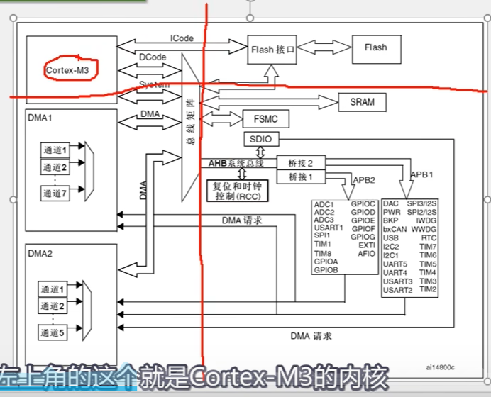
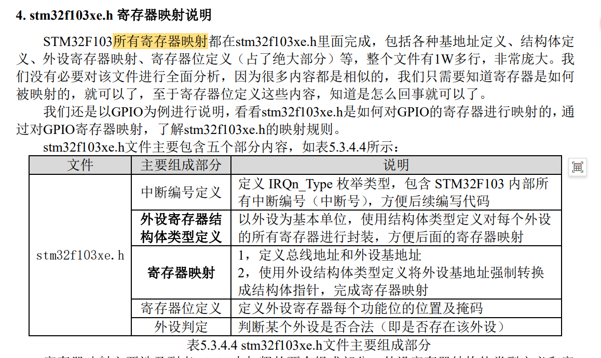

- [1. ARM](#1-arm)
- [2. STM32定义](#2-stm32定义)
  - [2.1 soc和cotex内核的关系](#21-soc和cotex内核的关系)
  - [2.2 stm32的soc内部具体设计关系](#22-stm32的soc内部具体设计关系)
- [3. stm32命名规则](#3-stm32命名规则)
- [4. soc芯片主要关心的参数](#4-soc芯片主要关心的参数)
- [5. 外设资源](#5-外设资源)
- [6. 本人使用板卡型号](#6-本人使用板卡型号)
- [7. STM32架构](#7-stm32架构)
  - [7.1 soc架构图](#71-soc架构图)
  - [7.2 各部分解释](#72-各部分解释)
- [8. 引脚定义](#8-引脚定义)
- [9. 存储器映射（memory map）](#9-存储器映射memory-map)
  - [9.1 地址概念关系](#91-地址概念关系)
  - [9.2 进制单位](#92-进制单位)

# 1. ARM

# 2. STM32定义
## 2.1 soc和cotex内核的关系
（arm公司->芯片soc厂商：ST,TI,NXP,RK）

## 2.2 stm32的soc内部具体设计关系

# 3. stm32命名规则

# 4. soc芯片主要关心的参数

RAM 是 运行内存（实际的存储介质是SRAM）

ROM 是 程序存储器（实际的存储介质是FLASH闪存）

如果自己要画板子，则需要了解封装

# 5. 外设资源

# 6. 本人使用板卡型号
板卡型号：ATK-DNF103
芯片型号：STM32F103ZET6

# 7. STM32架构
## 7.1 soc架构图

## 7.2 各部分解释
**Flash**里面存的我们的固件，程序

Cotex-M3内核出来有三个总线
1. Icode总线（加载程序指令）
2. Dcode总线（加载数据）
3. System总线
   
（System总线连接其他的东西
比如SRAM（SRAM是存储程序运行时的变量数据）

AHB系统总线（即先进高性能总线，挂在主要的，最基本的，性能较高的外设，比如复位和时钟控制这些最基本的电路

SDIO, 之后通过桥接，接到APB1,APB2两个外设总线上。

（APB=先进外设总线，连接一般的外设））

）

AHB总线和APB总线协议，速度，数据格式的差异，所以中间需要加两个桥接来实现数据缓存和转换。

**总线性能**：AHB(72mHZ)>APB2(72MHZ)>APB1(36MHZ)

所以APB2连接的都是较为重要的外设：USART1, SPI1, TIM1, TIM8（高级定时器），ADC,EXTI..

次要的外设都分到APB1.

具体只要知道是挂载到那个总线上就行了。

左下角是DMA：DMA可以当作内核M3的小秘书，大量的数据搬运的活。（ADC转换数据的转运，无需CPU，用DMA来进行数据搬运。）所以DMA也连接到总线矩阵，和SYSTEM总线有一样的控制权。

# 8. 引脚定义
一般看完芯片的引脚定义，基本就知道芯片怎么用的了

# 9. 存储器映射（memory map）
整个STM32， 32位，总共可以访问4GB的存储空间，我们把所有的存储器全部映射到一张表上，并给他们命名地址，就叫存储器映射。

stm32的存储器地址全部可以划分为8个block的地址。
Block0 : FLASH
Block1 : SRAM
Block2 : 外设
......

这样我们就可以通过查表找到所要的区域的基地址和偏移，来找到对应的外设的寄存器来进行操作外设

stm32官方也已经像IMX一样，给好了寄存器的映射表，里面的结构，地址都是一层层推进的，
我们直接拿来使用就行了，以后就无需关注具体的地址，只需要理清楚一层层地址的推进关系就行了。

## 9.1 地址概念关系

我们STM32 是32位置，他说总共可以寻址4GB的大小

0x040C 55C1 表示一个该存储器的一个地址，其指代一个byte，可以把他想象成是这一个字节的存储的的门牌号编码。

所以MCU总共可以寻址访问 0xffff ffff 个字节大小。

一个设备寄存器一般32位，即4byte。所以要占用4个存储器的字节存储块。所以偏移地址都是逐步加4个字节，也就是+ 0x0000 0004 = 0x04
所以就容易看到寄存器的地址偏移：（0x00  0x04 0x08 0x0C ....）
## 9.2 进制单位

0xa5 一个byte == 1101 0010 八位二进制数 == 2^8 bit

kbyte, bit, byte, mbyte, GB 都是二进制为基础的单位
0xffffffff是16进制的一个数字，是一个数字

0xffff ffff 个字节byte块
= 0xffff ffff byte(16进制)
=2^(8+8+8+8) byte（10进制）
=2^32 byte
=2^22 kb
=2^12 MB
=2^2 GB

