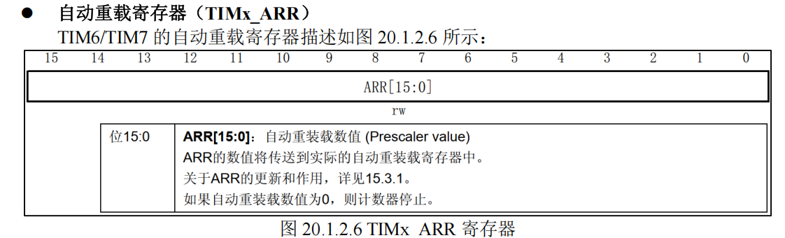
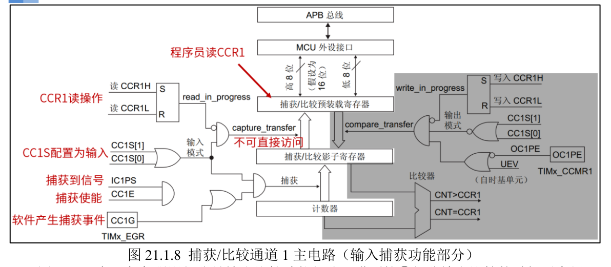

# STM32 定时器
## 定时器硬件总线挂载情况
- APB1：TIM2-7
- APB2：TIM1, TIM8

## 定时器资源
1. 2个**基本**定时器（TIM6, TIM7）
2. 4个**通用**定时器（TIM2-5）
3. 2个**高级**控制定时器（TIM1, TIM8）

这些定时器彼此独立。

## 基本定时器（6，7）
**特点**：

1. `16位自动重载**递增**计数器`
2. `16位可编程分频器`(倍频


### 框图


### 硬件部分
#### 1. 时钟源

很明显，定时器，都需要时钟源

基本定时器时钟挂载在 `APB1 总线`，所以它的时钟来自于 APB1 总线.

但是基本定时器不是直接用的APB1总线的时钟，而是先经过一个**倍频器**，然后得到输入时钟。

> `sys_stm32_clock_init` 时钟设置函数已经设置 `APB1 总线`时钟频率为 `36M`，APB1 总线的预分频器`分频系数是 2`，所以挂载在 APB1 总线的定时器时钟频率为 `72Mhz`


#### 2. 控制器
控制器除了控制定时器复位、使能、计数等功能之外，还可以用于触发 DAC 转换。

#### 3. 时基单元
时基单元包括：计数器寄存器(TIMx_`CNT`)、预`分频`器寄存器(TIMx_PSC)、`自动重载`寄存器
(TIMx_ARR) 。

这三个寄存器都是 `16 位`有效数字，即可设置值范围是 0~65535
> 这里感觉就跟普通的systick定时器差不多了。

从上面的框图，可以看到，**预分频器 PSC**，它有一个输入和一个输出。**输入 CK_PSC** 来源于控制器部分，
实际上就是来自于内部时钟（`CK_INT`），即 2 倍的 APB1 总线时钟频率（`72MHz`）。**输出 CK_CNT**
是分频后的时钟，它是计数器**实际的计数时钟**

所以通过分频器除一下，就可以得到，给**时基单元计数用的时钟周期**了。
```c
fCK_CNT= fCK_PSC / (PSC[15:0]+1)
```


> **影子寄存器**
>
> 可以看到，预分频模块和自动重载模块有影子
> 
> 实际上，预分频器寄存器只是起到**缓存数据的作用**，只有等到**更新事件发生时**，预分频器寄存器的
值才会被自动写入其影子寄存器中，这时才真正起作用。


### 更新事件
更新事件，更新事件的产生有两种情况：
1. 由**软件产生**，将 TIMx_EGR 寄存器的位UG 置 1，产生更新事件后，硬件会自动将 UG 位清零
2. 由硬件产生：
   1. `计数器的值`（递增）等于`自动重装载寄存器影子寄存器`的值，TIMx_CNT 值与 TIMx_ARR 的设定值相等时，TIMx_CNT 的值就会被`自动清零`并且会`生成更新事件`

说白了，更新事件，就是硬件计数到预定数字了，或者软件主动触发. 

而这个**更新事件**，就是**完成了一轮计数**，可以此时就可以**开启相应功能**：
1. 产生 DMA 请求
2. 产生中断信号
3. 触发 DAC 同步电路

>这也就是我们为什么要用定时器的理由，因为我们肯定时需要实现某些定时的功能的。计数到装载值，只是知道，现在到时间了，更新事件的触发效果，才是我们做想要的功能的开始

> TIMx_CNT `等于`TIMx_ARR 时，我们称之为`定时器溢出`，因为是`递增计数`，故而又称为`定时器上溢`。定时器溢出就`伴随着更新事件的发生`


所以，只要设置`预分频寄存器`和`自动重载`寄存器的值就可以**控制定时器更新事件发生的时间**. 当计数器的
值等于自动重载寄存器的值时就会生成更新事件，**硬件自动置位**相关**更新事件**的**标志位**，
- 如：更新中断标志位.

### 使用举例
我们在之前，设置主频72Mhz,然后，让systick定时器，1ms一次中断（裸机关中断），计算得到`systick定时器经过1us所需的计数`。延时靠数tick。

现在，我们新增一个基本定时器，延时500ms, 主频72Mhz给到分频器（`CK_INT 为 72MHz`）
1. `预分频`系数设置为 `7200`，即写入预分频寄存器的值为 7199，那么 `fCK_CNT`=72MHz/7200=`10KHz`。
2. 所以，计数+1 = 0.1ms
3. 需要 `500ms 的中断周期`，所以我们让计数器`计数 5000 个`数就能满足要求，即需要设置自动重载寄存器的值为4999
4. 更新中断使能位 UIE 置 1，CEN 位也要置 1, **开中断**，让更新事件能够做事


### 相关寄存器
#### CR


#### DR

#### SR



### 实验
上面已经详细梳理过，基本定时器的使用了，现在想要一个定时器中断，就比较简单了，涉及的外设
1. TIM6
2. NVIC

如果要中断中控制点灯：

3. GPIO

实验要求：定时器控制LED1 – PE5定时翻转

`main`()
```c
    HAL_Init();                             /* 初始化HAL库 */
    sys_stm32_clock_init(RCC_PLL_MUL9);     /* 设置时钟, 72Mhz */
    delay_init(72);                         /* 延时初始化 */
    usart_init(115200);                     /* 串口初始化为115200 */
    led_init();                             /* 初始化LED */
    
    btim_timx_int_init(5000 - 1, 7200 - 1); /* 10Khz的计数频率，计数5K次为500ms */
```

再来看看btim的bsp是如何实现的， 两块，一块是TIM6的配置，一块是NVIC的配置
```c
void btim_timx_int_init(uint16_t arr, uint16_t psc)
{
    g_timx_handle.Instance = BTIM_TIMX_INT;                      /* 通用定时器X */
    g_timx_handle.Init.Prescaler = psc;                          /* 设置预分频系数 */
    g_timx_handle.Init.CounterMode = TIM_COUNTERMODE_UP;         /* 递增计数模式 */
    g_timx_handle.Init.Period = arr;                             /* 自动装载值 */
    HAL_TIM_Base_Init(&g_timx_handle);

    HAL_TIM_Base_Start_IT(&g_timx_handle);    /* 使能定时器x及其更新中断 */
}
```

`HAL_TIM_Base_Init`里面，先做一些前置配置：`HAL_TIM_Base_MspInit`，然后配置时基
```c
HAL_StatusTypeDef HAL_TIM_Base_Init(TIM_HandleTypeDef *htim)
{
  /* Check the TIM handle allocation */
  if (htim == NULL)
  {
    return HAL_ERROR;
  }

  /* Check the parameters */
  assert_param(IS_TIM_INSTANCE(htim->Instance));
  assert_param(IS_TIM_COUNTER_MODE(htim->Init.CounterMode));
  assert_param(IS_TIM_CLOCKDIVISION_DIV(htim->Init.ClockDivision));
  assert_param(IS_TIM_AUTORELOAD_PRELOAD(htim->Init.AutoReloadPreload));

  if (htim->State == HAL_TIM_STATE_RESET)
  {
    /* Allocate lock resource and initialize it */
    htim->Lock = HAL_UNLOCKED;

#if (USE_HAL_TIM_REGISTER_CALLBACKS == 1)
    /* Reset interrupt callbacks to legacy weak callbacks */
    TIM_ResetCallback(htim);

    if (htim->Base_MspInitCallback == NULL)
    {
      htim->Base_MspInitCallback = HAL_TIM_Base_MspInit;
    }
    /* Init the low level hardware : GPIO, CLOCK, NVIC */
    htim->Base_MspInitCallback(htim);
#else
    /* Init the low level hardware : GPIO, CLOCK, NVIC */
    HAL_TIM_Base_MspInit(htim);
#endif /* USE_HAL_TIM_REGISTER_CALLBACKS */
  }

  /* Set the TIM state */
  htim->State = HAL_TIM_STATE_BUSY;

  /* Set the Time Base configuration */
  TIM_Base_SetConfig(htim->Instance, &htim->Init);

  /* Initialize the DMA burst operation state */
  htim->DMABurstState = HAL_DMA_BURST_STATE_READY;

  /* Initialize the TIM channels state */
  TIM_CHANNEL_STATE_SET_ALL(htim, HAL_TIM_CHANNEL_STATE_READY);
  TIM_CHANNEL_N_STATE_SET_ALL(htim, HAL_TIM_CHANNEL_STATE_READY);

  /* Initialize the TIM state*/
  htim->State = HAL_TIM_STATE_READY;

  return HAL_OK;
}

/**
 * @brief       定时器底层驱动，开启时钟，设置中断优先级
                此函数会被HAL_TIM_Base_Init()函数调用
 * @param       htim:定时器句柄
 * @retval      无
 */
void HAL_TIM_Base_MspInit(TIM_HandleTypeDef *htim)
{
    if (htim->Instance == BTIM_TIMX_INT)
    {
        BTIM_TIMX_INT_CLK_ENABLE();                     /* 使能TIM时钟 */
        HAL_NVIC_SetPriority(BTIM_TIMX_INT_IRQn, 1, 3); /* 抢占1，子优先级3，组2 */
        HAL_NVIC_EnableIRQ(BTIM_TIMX_INT_IRQn);         /* 开启ITM3中断 */
    }
}
```
可以看到，**一般套路**都是：
1. 先确定好涉及的外设（NVIC，TIM6）
2. 打开所需外设的时钟（TIM6）
3. 设置相应的外设
   1. NVIC（中断优先级，开中断）
   2. TIM6（分频，重装载值，更新中断使能）

中断向量表里面，中断处理函数：
```c
                DCD     TIM6_IRQHandler            ; TIM6
```

虽然btim.h里面定义的, NVIC打开的中断号是TIM6_DAC_IRQn, 虽然带DAC字样，但是就是指的tim6的中断
```c
#define BTIM_TIMX_INT                       TIM6
#define BTIM_TIMX_INT_IRQn                  TIM6_DAC_IRQn
#define BTIM_TIMX_INT_IRQHandler            TIM6_DAC_IRQHandler

//stm32xe.h
#define TIM6_DAC_IRQn           TIM6_IRQn
#define TIM6_DAC_IRQHandler           TIM6_IRQHandler

  TIM6_IRQn                   = 54,     /*!< TIM6 global Interrupt                                */

```

所以，当产生更新事件后，实际调用的中断处理函数是：`TIM6_IRQHandler`

可以看到，在bsp的定时器驱动程序中，将这个中断处理函数，重实现为HAL的公共处理
```c
void BTIM_TIMX_INT_IRQHandler(void)
{
    HAL_TIM_IRQHandler(&g_timx_handle); /* 定时器中断公共处理函数 */
}

```

判断发生中断的原因-> 更新事件，HAL里面，清除一些标志位。然后调用中断回调函数`HAL_TIM_PeriodElapsedCallback`
```c
 // 对这个发生中断的定时器，进行分析，是不是通用定时器发生的输入捕获？输出比较？

  /* TIM Update event */
  if (__HAL_TIM_GET_FLAG(htim, TIM_FLAG_UPDATE) != RESET)
  {
    if (__HAL_TIM_GET_IT_SOURCE(htim, TIM_IT_UPDATE) != RESET)
    {
      __HAL_TIM_CLEAR_IT(htim, TIM_IT_UPDATE);
#if (USE_HAL_TIM_REGISTER_CALLBACKS == 1)
      htim->PeriodElapsedCallback(htim);
#else
      HAL_TIM_PeriodElapsedCallback(htim);
#endif /* USE_HAL_TIM_REGISTER_CALLBACKS */
    }
  }
```

这个回调函数，是个弱定义，我们就在自己的bsp驱动程序中实现
```c
void HAL_TIM_PeriodElapsedCallback(TIM_HandleTypeDef *htim)
{
    if (htim->Instance == BTIM_TIMX_INT)
    {
        LED1_TOGGLE(); /* LED1反转 */
    }
}

```


## 通用定时器（2-5）
和基本定时器区别：多了输入捕获，PWM输出，输出比较，单脉冲模式

下面是组成部分

### 1. 时钟源选择
1. 内部时钟(CK_INT)
2. 外部时钟模式 1：外部输入引脚(TIx)，x=1，2（即只能来自于通道 1 或者通道 2）

        外部时钟源信号→IO→TIMx_CH1（或者 TIMx_CH2）


1. 外部时钟模式 2：外部触发输入(ETR)
2. 内部触发输入(ITRx)：使用一个定时器作为另一定时器的预分频器

### 2. 控制器
### 3. 时基单元
### 4. 输入捕获
### 5. 输入捕获和输出比较公用部分
### 6. 输出比较


### 定时器中断实验
1. TIMx_CR1   （时基单元）
   1. APRE（选择是否自动重载缓冲）
   2. CMS 和 DIR (选择计数模式)
   3. CEN 使能计数器
2. TIMx_SMCR（从模式控制）  （时钟源选择）
   1. SMS （配置输入时钟来源）
3. TIMx_DIER （DMA/中断使能寄存器）  （配置溢出更新中断使能）
   1. UIE
4. TIMx_SR  （状态寄存器） （显示中断标志位，通知产生了中断，需要手动清除）
   1. UIF
5. TIMx_CNT  （计数寄存器）
6. TIMx_PSC  （预分频）
7. TIMx_ARR  （自动重载）

通用定时器（TIM2-TIM5 等）虽然支持 4 种时钟源（内部时钟、外部 TIx、外部 ETR、内部触发 ITRx），但复位后默认选择的是 “内部时钟（CK_INT）”，这是由硬件寄存器的复位值决定的

可以尝试自己直接实现中断处理，最后清除中断flag即可
```
void liangji_TIM3_IRQHandler(void)
{
	//HAL_TIM_IRQHandler(&init_TIM3);
	if(__HAL_TIM_GET_FLAG(&init_TIM3, TIM_FLAG_UPDATE))
	{
		LED1_TOGGLE();
		__HAL_TIM_CLEAR_FLAG(&init_TIM3, TIM_FLAG_UPDATE);
	}
}
```

### 定时器输出PWM波实验
实现原理


使用寄存器，除了上面的中断用到的基本定时器相关寄存器之外
还有
1. TIMx_CCMR1/2 （捕获 /比较模式寄 存器）
2. TIMx_CCER   （捕获/比较使能寄存器）
3. TIMx_CCR1~4   （捕获/比较寄存器）

```
TIM_HandleTypeDef init_TIM3;
TIM_OC_InitTypeDef init_TIM3_OC;
GPIO_InitTypeDef init_gpio7;
void liangji_init_TIM3_PWM(uint32_t psc, uint32_t period)
{
	//enable clk
	__HAL_RCC_TIM3_CLK_ENABLE();
	
	//enable NVIC
	HAL_NVIC_SetPriority(TIM3_IRQn,2,3);
	HAL_NVIC_EnableIRQ(TIM3_IRQn);
	
	//io mux, PA7->TIM3_CH2, REMAP
	__HAL_RCC_GPIOB_CLK_ENABLE();
	init_gpio7.Pin = GPIO_PIN_5;
	init_gpio7.Mode = GPIO_MODE_AF_PP;
	init_gpio7.Speed = GPIO_SPEED_FREQ_HIGH;
	init_gpio7.Pull = GPIO_PULLUP;
	HAL_GPIO_Init(GPIOB, &init_gpio7);
	
	//GTIM_TIMX_PWM_CHY_GPIO_REMAP();
	__HAL_RCC_AFIO_CLK_ENABLE();
	__HAL_AFIO_REMAP_TIM3_PARTIAL();
	//AFIO_BASE
	
	
	//CLK src sel, default choose ck_int
	
	
	//config TIM BASE
	init_TIM3.Instance = TIM3;
	init_TIM3.Init.Prescaler=psc;
	init_TIM3.Init.CounterMode=TIM_COUNTERMODE_UP;
	init_TIM3.Init.Period=period;
	init_TIM3.Init.AutoReloadPreload=TIM_AUTORELOAD_PRELOAD_DISABLE;
	//init_TIM3.Channel = HAL_TIM_ACTIVE_CHANNEL_2;
	HAL_TIM_PWM_Init(&init_TIM3);
	
	//config TIM compare and output
	init_TIM3_OC.OCMode=TIM_OCMODE_PWM1;
	init_TIM3_OC.Pulse=period/2;
	init_TIM3_OC.OCPolarity=TIM_OCPOLARITY_LOW;
	HAL_TIM_PWM_ConfigChannel(&init_TIM3, &init_TIM3_OC, TIM_CHANNEL_2);
	
	//TIM3 IT
	//HAL_TIM_Base_Start_IT(&init_TIM3);
	HAL_TIM_PWM_Start(&init_TIM3, TIM_CHANNEL_2);

}

void liangji_pwm_led(void)
{
	static uint8_t dir = 1;
	static uint16_t ledrpwmval = 0;
	
	if (dir)
		ledrpwmval++;
	else
		ledrpwmval--;
		
	//switch
	if (ledrpwmval > 300)
		dir = 0;
	if (ledrpwmval == 0)
		dir = 1;

	__HAL_TIM_SET_COMPARE(&init_TIM3, TIM_CHANNEL_2, ledrpwmval);

}

```

注意：关于引脚复用，和引脚重映射，最终你用到那个IO，你就配置那个IO就行了，重映射的原来的那个IO不需要配置了。

TIM3方面


主要配置：
时基
时钟源（无需配置，默认就行）
比较主电路
输出部分


### 输入捕获实验




要做的事情
1. 给TIM时钟
2. 配置时钟源
3. 配置输入IO
4. 配置时基
5. 配置输入通道
6. 配置捕获主电路
7. 配置捕获中断

```

//TIM COMMON - Capture Project
//PA0 -> TIM5_CH1
TIM_HandleTypeDef init_TIM5;
GPIO_InitTypeDef init_gpio_capture;
TIM_IC_InitTypeDef init_IC;
#define liangji_TIM5_IRQHandler TIM5_IRQHandler
uint8_t g_timxchy_cap_sta = 0; //this count N
uint16_t g_timxchy_cap_val = 0; //count Once cnt < arr
uint16_t count_up = 0;


void liangji_init_TIM5_CAPTURE(uint32_t psc, uint32_t period)
{
	//NVIC
	HAL_NVIC_SetPriority(TIM5_IRQn,2,3);
	HAL_NVIC_EnableIRQ(TIM5_IRQn);
	
	//IO
	__HAL_RCC_GPIOA_CLK_ENABLE();
	init_gpio_capture.Pin = GPIO_PIN_0;
	init_gpio_capture.Mode = GPIO_MODE_AF_PP;
	init_gpio_capture.Speed = GPIO_SPEED_FREQ_HIGH;
	init_gpio_capture.Pull = GPIO_PULLUP;
	HAL_GPIO_Init(GPIOA, &init_gpio_capture);

	
	//enable TIM5 CLK
	__HAL_RCC_TIM5_CLK_ENABLE();
	
	//TIM5 CLK SOURCE SEL
	//stay Default
	
	//TIM5 TIM BASE
	init_TIM5.Instance = TIM5;
	init_TIM5.Init.Prescaler=psc;
	init_TIM5.Init.CounterMode=TIM_COUNTERMODE_UP;
	init_TIM5.Init.Period=period;
	init_TIM5.Init.ClockDivision=TIM_CLOCKDIVISION_DIV1;
	init_TIM5.Init.AutoReloadPreload=TIM_AUTORELOAD_PRELOAD_DISABLE;
	init_TIM5.Channel = HAL_TIM_ACTIVE_CHANNEL_1;
	HAL_TIM_IC_Init(&init_TIM5);
	
	//TIM5 Capture
	init_IC.ICFilter = 0;//dont use filter
	init_IC.ICPrescaler = TIM_ICPSC_DIV1;
	init_IC.ICSelection = TIM_ICSELECTION_DIRECTTI;
	init_IC.ICPolarity = TIM_ICPOLARITY_RISING;
	HAL_TIM_IC_ConfigChannel(&init_TIM5, &init_IC, TIM_CHANNEL_1);
	
	//TIM5 Capture IT and IT
	HAL_TIM_IC_Start_IT(&init_TIM5, TIM_CHANNEL_1);
	HAL_TIM_Base_Start_IT(&init_TIM5);
}

void liangji_TIM5_Capture(void)
{
	if((g_timxchy_cap_sta & 0x80)!= 0)
	{
		//we get a pulse
		uint16_t N = g_timxchy_cap_sta & 0x3F;
		N*= 65536;
		N+=g_timxchy_cap_val;
		printf("HIGH PULSE : %d us \r\n", N);
		g_timxchy_cap_sta = 0;
	}
	
	//just LED0 TOGGLE
	static uint8_t t = 0;
	t++;
	if(t>20){
		t=0;
		LED0_TOGGLE();
	}
	
}


void liangji_TIM5_IRQHandler(void)
{
		HAL_TIM_IRQHandler(&init_TIM5);
}

/*
			Update IT callback
			impel in main, toggle led1, and count up ++
      HAL_TIM_PeriodElapsedCallback(htim);
*/

void HAL_TIM_PeriodElapsedCallback(TIM_HandleTypeDef *htim)
{
	if (htim->Instance == TIM6){
		//LED1_TOGGLE();
	} else if (htim->Instance == TIM3){
		//LED1_TOGGLE();
	} else if (htim->Instance == TIM5) {
			if((g_timxchy_cap_sta & 0X80) == 0){
					if(g_timxchy_cap_sta & 0X40){
							if ((g_timxchy_cap_sta & 0X3F) == 0X3F){
								//  wait for falling, over the N max, is too long,think it is success, so re-wait for up, give up wait falling
								TIM_RESET_CAPTUREPOLARITY(&init_TIM5, TIM_CHANNEL_1);
								TIM_SET_CAPTUREPOLARITY(&init_TIM5, TIM_CHANNEL_1, TIM_ICPOLARITY_RISING);
								g_timxchy_cap_sta |= 0x80;     
								g_timxchy_cap_val = 0xffff; //mean: N(max)*arr + N(max)
							}
							else {
								g_timxchy_cap_sta++;  //N +1
							}
					}
			
			}
	}
}

/*
      HAL_TIM_IC_CaptureCallback(htim);
*/
void HAL_TIM_IC_CaptureCallback(TIM_HandleTypeDef *htim)
{
	//get up cnt
	//set fall detect
	if((g_timxchy_cap_sta & 0X80) == 0){
		if(g_timxchy_cap_sta & 0X40){ //now 0 1, but now capture falling because when capture up, we detect falling
			g_timxchy_cap_sta |= 0x80;
			g_timxchy_cap_val = HAL_TIM_ReadCapturedValue(&init_TIM5, TIM_CHANNEL_1);//get falling cnt t2 (t2<arr)
			//reset detect up
			TIM_RESET_CAPTUREPOLARITY(&init_TIM5, TIM_CHANNEL_1);
			TIM_SET_CAPTUREPOLARITY(&init_TIM5, TIM_CHANNEL_1, TIM_ICPOLARITY_RISING);
		} else { //now 0 0, wait for up edge, but now capture interupt, so start a new detect
			g_timxchy_cap_sta = 0;
			g_timxchy_cap_val = 0;
			g_timxchy_cap_sta |= 0x40;   // set 0 1, we have get up edge
			//set polo falling detect, no need to record now cnt t1, because t1 + N*arr + t2 = now
			__HAL_TIM_DISABLE(&init_TIM5);
			__HAL_TIM_SET_COUNTER(&init_TIM5, 0); 
			TIM_RESET_CAPTUREPOLARITY(&init_TIM5, TIM_CHANNEL_1);			
			TIM_SET_CAPTUREPOLARITY(&init_TIM5, TIM_CHANNEL_1, TIM_ICPOLARITY_RISING);
			__HAL_TIM_ENABLE(&init_TIM5);
		}
	}
}


```

重点在于在捕获中断和更新事件中断中，统计溢出次数N和上升下降沿。


### 脉冲计数实验
这次我们使用外部时钟模式1, 多一个配置控制器。


注意所有功能的使能， 中断的使能
1. 时钟的使能
2. 输入通道的使能（如果有）
3. 更新事件中断使能
## 高级定时器（1,8）