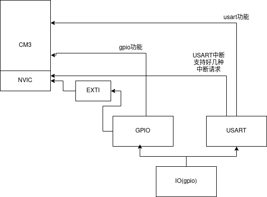
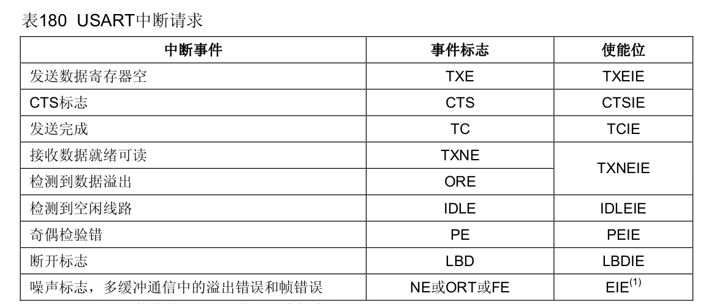

# STM32 usart总结
## 1. 架构

## GPIO

IO：
1. GPIO（通用）
   1. CRL/CRH （配置寄存器）
      1. 输入/输出/复用
      2. 速度
   2. IDR/ODR
      1. 输入输出数据
   3. BSRR
      1. 设置输出
   4. BRR
      1. 清输出
   5. LCKR
      1. 锁定配置
2. AFIO（复用功能与调试配置）
   1. 引脚重映射
   2. 外部中断配置

## 2. usart串口协议
全称：通用同步异步收发器

数据帧格式：
1. 起始位
2. 数据位（8-9位）（最低有效位在前）
3. 校验位
4. 停止位（0.5，1.5，2个的停止位）

波特率（由波特率发生装置产生）

引脚：（前两个是异步需要，后面是同步需要）
1. TX
2. RX
3. CLK
4. CTS
5. RTS

支持中断：

## 3. 使用方法
参见usart_init()

1. 配置IO复用（复用为USART1）
2. 配置USART1寄存器，设置波特率，帧格式
3. 设置USART1的接受中断（打开USART1的中断使能，指定缓存地址，一般串口一次刚好传1byte）
4. 设置NVIC响应USART1的中断
5. 编写自己的中断回调函数（内部可以实现自己的一些特定接受协议）