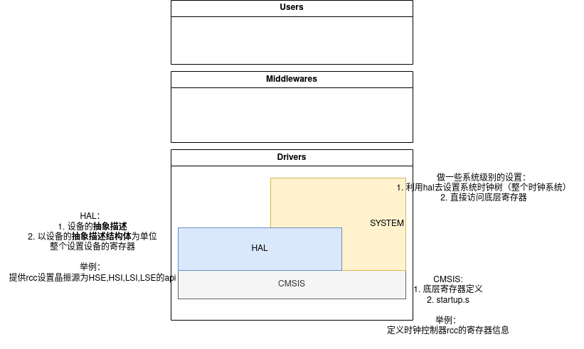

# stm32 时钟系统
## 1. 时钟存在意义
mcu是基于时序控制的系统，任意复杂的电路控制系统都可以经由门电路组成的组合电路实
现，STM32 内部也是由多种多样的电路模块组合在一起实现的，当一个电路越复杂，在达到正确的输出结果前，它可能因为延时会有一些短暂的中间状态，而这些中间状态有时会导致输出结果会有一个短暂的错误，这叫做
电路中的“毛刺现象”，如果电路需要运行得足够快，那么这些错误状态会被其它电路作为输入
采样，最终形成一系列的系统错误

为了解决这个问题，在单片机系统中，设计时以时序电路
控制替代纯粹的组合电路，在每一级输出结果前对各个信号进行采样，从而使得电路中某些信
号即使出现延时也可以保证各个信号的同步，可以避免电路中发生的“毛刺现象”，达到精确控
制输出的效果。

由于时序电路的重要性，因此在 MCU 设计时就设计了专门用于控制时序的电路，在芯片
设计中称为时钟树设计。由此设计出来的时钟，可以精确控制我们的单片机系统，这也是我们
这节要展开分析的时钟分析

为什么是时钟树而不是时钟呢？一个 MCU 越复杂，时钟系统也
会相应地变得复杂，如 STM32F1 的时钟系统比较复杂，各个外设模块所需要的时钟不一样。

所以你可以把时钟树想象成通往全身各个器官的血管，有的器官需要静脉，有的器官需要动脉。然后源头就是心脏（时钟源头）。

至于这个具体要怎么配置选择这些血管，有一个统一的RCC模块（reset and clock controller）来设置他。
## 2. 时钟树硬件架构

## 3. 时钟源
1. HSE
2. HSI
3. LSE
4. LSI

E表示外部，是指的外围电路，SOC之外
I表示内部，指的SOC内部

HSI（高速**内部时钟**）：是芯片内部集成的高速 RC 振荡器，频率通常为 8MHz（不同型号可能有差异，如有些为 16MHz）。

硬件位置：位于 STM32 **内核附近的专用模拟电路区域，属于芯片内部的固有模块**。
## 4. 时钟树软件架构

## 启动流程
在startup.s中，正常情况是CM3运行到Reseet Handler 里面：
1. SystemInit
   1. 拓展外部SRAM
   2. 配置用户向量表（user_IVT）

(这两个我们都没有用到)
2. Main
   

所以我们要在Main中
1. 先进行hal层的初始化（使能需要用到的设备的hal库）
2. 设置时钟树（这里使用的是SYSTEM层中的sys里面的函数，调用hal库来设置时钟树）
3. 其余设备初始化。

