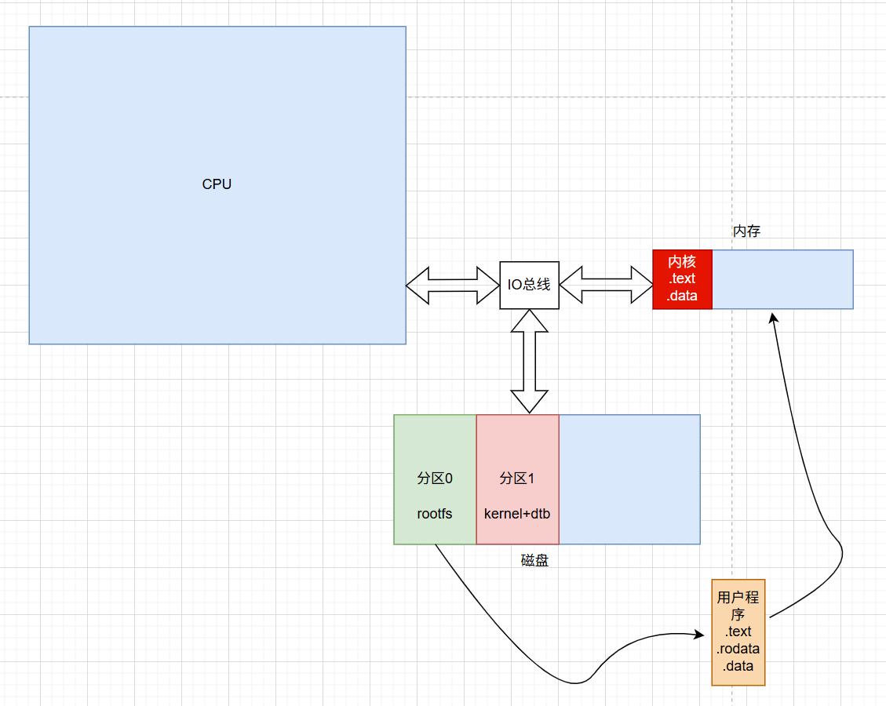
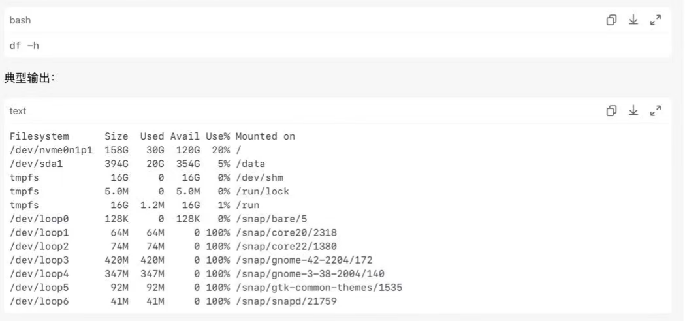
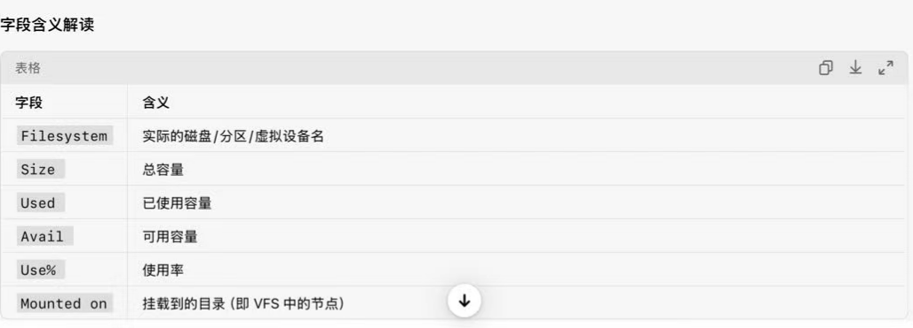
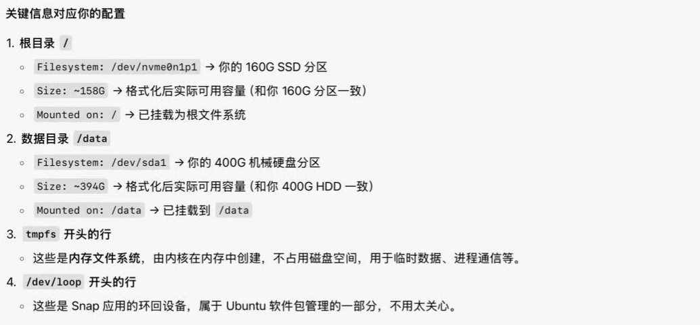
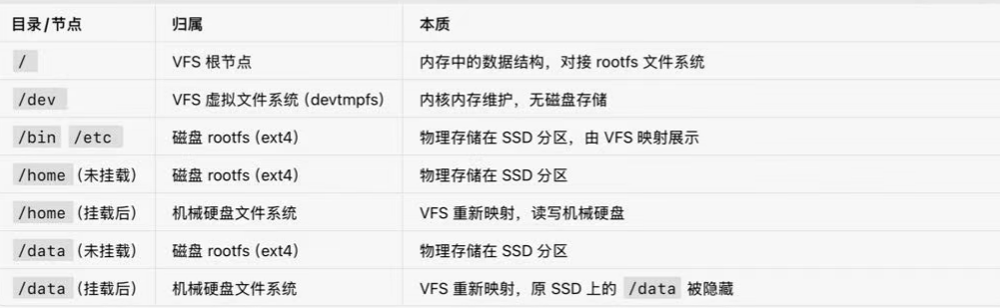

- [背景](#背景)
- [磁盘的分类](#磁盘的分类)
  - [imx6ull 嵌入式系统中的磁盘](#imx6ull-嵌入式系统中的磁盘)
  - [linux系统组成](#linux系统组成)
  - [linux系统启动流程复述](#linux系统启动流程复述)
  - [linux系统内存运行模型](#linux系统内存运行模型)
  - [x86 ubuntu中的磁盘](#x86-ubuntu中的磁盘)
  - [查看](#查看)
- [rootfs，文件系统，vfs概念梳理](#rootfs文件系统vfs概念梳理)

# 背景
我将自己的台式机配置成ubuntu服务器，我的台式机配置如下（按存储体系划分）：
- DDR 内存 32G
- 磁盘
  - 固态硬盘， 空闲176G， 被linux内核识别成 /dev/nvem1p1 这种SSD块设备
  - 机械硬盘， 空闲390G， 被linux内核识别成 /dev/sdax 这种HDD块设备

借此机会，弄懂了VFS，rootfs，文件系统（ext4）, 内核启动根文件系统这些概念。

# 磁盘的分类
CSAPP这本书里面讲计算机存储体系划分，DDR下面一层就是磁盘

但是我们实际的磁盘，是分为固态硬盘，和机械硬盘的，他们在种类上归属于磁盘，对应于开发板的EMMC（回想一下imx6ull, 在emmc里面进行分区）

## imx6ull 嵌入式系统中的磁盘
我们在imx6ull开发板中，磁盘是`emmc`，或者是`nand`, `sd卡` 这种flash.

实际在系统启动前，我们希望把**一切需要启动的系统软件**，全部放在**磁盘/FLASH**中。

并且，我们希望在磁盘/FLASH中存放的东西容易查找区分。所以，就会**对磁盘进行分区**，并对每个分区进行**相应的格式化**（`文件系统`，后面讲）

所以，我们在imx6ull的uboot中，可以用mmc 0:0 可以查看mmc flash设备的不同分区。然后发现，比如
- **emmc分区0**，是`ext4`格式，存放rootfs根文件系统
- **emmc分区1**，`ext4`格式，存放 linux**内核（kernel）的镜像**（`zImage`）+设备树文件dtb.

## linux系统组成
这里先说一下linux系统。他并不是指的一个固件，而是指的一类系统。他的构成是：
- **uboot** 
  - (bootloader, 当然有别的，用的最多的就是他)
  - 系统引导程序，由他来初始化一些必要的硬件（DDR，串口等），为内核和系统启动创造环境
- **linux内核 + dtb设备树**
  - 这里只是内核，定义一个操作系统的**底层功能**：
    - 进程管理
    - 内存管理
    - 文件系统（VFS，后面讲）
    - 网络
    - 设备驱动
    - > 如果是x86架构的ubuntu系统，是没有dtb设备树的。但是差别不算太大
- **根文件系统**
  - 根文件系统，就是**一系列有目录结构的文件**，定义了系统启动后要运行的各种服务。比如bash终端进程这些，不然你也没办法访问系统。

## linux系统启动流程复述
所以，安装linux系统，肯定就是要了解启动流程：
- uboot启动，被加载到ddr中
- uboot初始化必要的硬件，为内核启动创造环境
- uboot自拷贝，腾出内存地方
- uboot 去磁盘中的某一个分区，找到kernel镜像zImage, 还有dtb，拷贝到内存中
  - 记得我们的bootz 0x80000000 - 0x80000300吗
- uboot传递bootargs 和 bootcmd给kernel, 跳转内核入口，**内核启动**。

- 内核加载dtb，做一些初始化的操作，硬件这些。
  - 我们这个时候，就可以在终端看到打印的内核日志，启动各种设备
- 内核启动各种功能，其中比较重要的就是VFS，虚拟文件系统。
  - VFS，相当于为磁盘里面的文件，在内存里面创建映射的节点，其中最重要的就是 / 根节点。
  - VFS，还在内存里面创建一些给内核用的文件夹，/dev, /tmp, /sys
  - VFS, 为这些文件节点，提供统一的访问接口（read, write,....）
- 内核开始挂载根文件系统。
  - 所谓挂载，就是相当于重映射，根文件系统，其内部结构也是从 / 这个根节点开始延申的目录结构。挂载就是把 内存里面 VFS的/这个根节点文件，和磁盘的rootfs的根节点绑定。
  - 这样你访问内存的/, 内核VFS就会自动帮你重定向去访问磁盘的rootfs.
- 内核启动rootfs中的初始化脚本。
- 开启各种系统服务进程
- 系统启动完成。

## linux系统内存运行模型

上图展示了，当系统启动后，整个存储体系中的内容。

- kernel的程序
  - 肯定是在内存中
- rootfs的程序
  - 就是一堆程序文件，存放在磁盘里面
- 准备执行的程序
  - 从磁盘中拷贝出来，拷贝到DDR中
  - > 磁盘中的程序文件，内部仅包括.text, .rodata, .data, .bss这些必要的段。
  - > 当要执行时，CPU把这些文件从磁盘中拷贝到内存中，并分配固定的栈，来运行他。

## x86 ubuntu中的磁盘

在x86架构中，整体情况类似，我们肯定是要有地方存我们的系统的。我们肯定不希望断电，系统就没了，所以只能放在磁盘里面。对于一个抽象的计算机系统来说，这个系统肯定就是磁盘，无非就是放在固态硬盘，还是机械硬盘嘛。

前面，我们分析了，要在磁盘里面准备好系统，就是准备好：
- bootloader(BIOS)
- rootfs(ubuntu)
- linux内核

所以理论上来说，无论你把这些文件，按分区放在机械硬盘，还是磁盘。理论上来说，**都是可以正常启动**。

但是实际上，虽然都能行，但是是有好坏的区分的。

> 固态硬盘的速度远高于机械硬盘，但都是磁盘的速度范畴，肯定比不过ddr

所以我们**希望系统运行程序很快**（因为rootfs里面是系统的各种程序，当系统运行时，执行各种程序，指令工具，都存放在里面，并且属于随机访问。所以，肯定希望拷贝速度越快越好。）

所以我们**得出的结论**是，把**系统：ubuntu（rootfs）,linux内核，grub(bootloader)，全部装在固态硬盘这个磁盘里面**

这就是为什么，我们要在安装过程中，选择固态硬盘/dev/nvemop2这个固态硬盘的设备里面的空闲空间176G来作为/根目录（rootfs）

把系统安装在固态硬盘里面。

然后在系统完全启动后，在/data中，把机械硬盘的390G的空间（/dev/sda5）挂载到这个目录上去。这个磁盘存放数据。

为什么在这个磁盘存放数据，虽然他拷贝文件到内存的速度慢。但是我们是用来存东西的，拷贝机会少，而且放SDK这些源码，是拿到内存编译的，不是运行的（编译一个程序源文件的时间，远超从机械硬盘拷贝到内存的时间，所以忽略不计了）

所以这就决定好了我们安装ubuntu系统的磁盘使用。

## 查看
当进入系统后
- `df -h`
  - 可以查看文件系统的挂载情况
  - 
  - 
  - 
- `lsblk`
  - 可以查看磁盘的各个分区的磁盘容量，在里面可以看到固态磁盘是176G（其中有16G的swap分区，是用来给32G内存做虚拟拓展的，相当于一个cache缓存的空间）

# rootfs，文件系统，vfs概念梳理

下面来梳理一下文件系统相关的概念

- **文件系统**
  - ext4这些，其实是**磁盘格式**。用来格式化一个磁盘，把磁盘上无意义的存储单元，按一定格式规则组织起来，这样就可以表示文件了（比如这一块存储单元，表示一个txt），一个磁盘上，要有文件系统，才能存放文件，不然就只是一堆无意义的存储单元。
- 根文件系统rootfs
  - 就是**一堆文件+文件夹**。存放在磁盘上，内核启动好后就要去执行这些文件里面的一些文件，开启各种服务程序。
- VFS 虚拟文件系统
  - 这个属于内核的一个主要功能，是linux一切皆文件的由来，是内核的一个模块
  - VFS在内存中，创建一个同样有目录结构的文件树结构。其中根节点就是 /，
  - 作用：
    - 创建根目录节点/， 本质上是一个dentry + inode数据结构，存在于内核内存，不是磁盘文件
    - 预定义一些核心虚拟目录： /dev, /proc, /sys。 这些目录里的内容和结构，由内核直接维护，不依赖磁盘文件
    - 为所有的文件，提供统一的文件操作接口（对磁盘的操作就是拷贝，读写，对设备文件的操作，会被路由到驱动去）
  - 此时的/， 只是一个空入口，没有实际内容。
  - **挂载rootfs**
    - 内核通过启动参数bootargs里面的“root=/dev/nvme01n1p1”找到有rootfs的磁盘分区，执行挂载
    - **所谓挂载，就是把VFS里面的/节点，和磁盘里面的ext4文件系统rootfs的根目录，建立映射关系**。
    - 之后所有对/，及其子目录的访问，都会由VFS转发给ext4驱动，去读写磁盘上的实际数据。
  - > 所以VFS，就是内核态的中间层。向上给用户态提供统一的文件操作接口，向下对接不同的实际文件系统
  - > 映射关系可以被覆盖，如果你在/下创建data目录, 那么VFS中的/data节点就映射到固态硬盘的磁盘里面。但是如果你此时把机械硬盘的文件系统（ext4）挂载到/data上，这个映射关系就会被覆盖。此时/data下的访问，就会被路由到机械硬盘上去。
  
