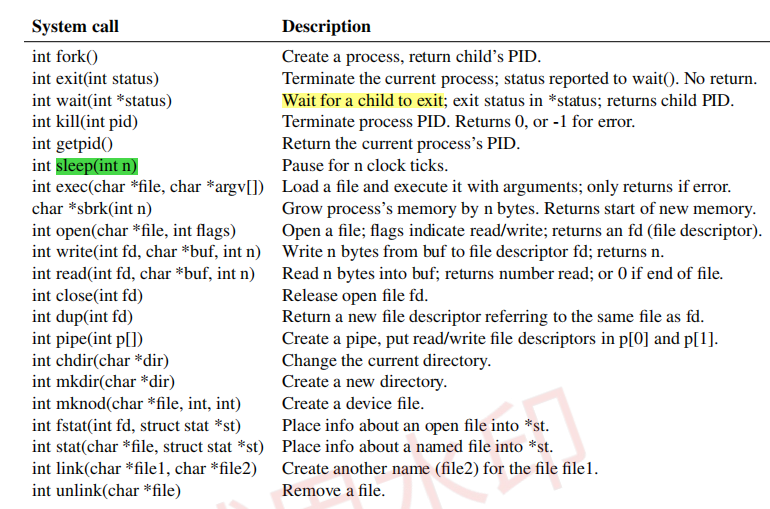

- [说明](#说明)
- [文档学习](#文档学习)
  - [进程和内存](#进程和内存)
  - [IO和文件描述符](#io和文件描述符)
  - [管道](#管道)
  - [文件系统](#文件系统)
    - [我的提问](#我的提问)
    - [gemini回答](#gemini回答)
  - [最后](#最后)
- [作业附件](#作业附件)

# 说明
本实验，主要了解内核，系统调用的关系，硬件主要基于risc v 架构（使用qemu代替），操作系统使用xv6教学操作系统。
xv6资源汇总链接：https://csdiy.wiki/%E6%93%8D%E4%BD%9C%E7%B3%BB%E7%BB%9F/MIT6.S081/#_4
课程网站：
https://pdos.csail.mit.edu/6.828/2021/schedule.html

本实验是在WSL上安装的ubuntu20.04（2021版本的xv6操作系统实验要求是用的20.04，后面2025换成22.04了好像），以下是针对文档的学习，还有lab1 内每个习题的理解与记录。


# 文档学习
第一章节，主要了解了操作系统的接口，内核和系统调用的关系，学习如何使用系统调用。操作系统分为内核空间和用户空间，


我的理解就是，内核空间是真正的裸机，他能访问所有的硬件资源，并把底层的各种资源，封装成系统调用，供给用户空间使用，这样实现了软件和硬件的隔离。
## 进程和内存
xv6的进程是由用户空间内存（指令，数据，堆栈）和内核私有的每个进程状态组成。

一些与进程相关的系统调用：
**fork**()创建子进程，实际使用时需要注意
``` c
...
//fork()后,父进程的内存完整的拷贝过来，
// 父进程的fork返回子进程的pid,子进程的fork返回0
if(fork()==0) 
{
    //child
    ...
    exit(0); //子进程一定要退出，不然子进程会执行下面的父进程内容
} else{
    //parent
    wait(0); //父进程要等待子进程退出，不关心正常是否
}
//parent
...


```
**getpid**()获取当前进程的pid（进程描述符）

**exit**()结束进程执行，并释放内存和打开的文件资源。0表示成功，1表示失败。

进程结束需要记得退出，不然会报错。


**wait**()返回当前进程已退出的子进程的PID，若子进程没有退出，一直等待。没有子进程则直接返回-1，如果父进程不关心子进程的退出状态，直接wait(0),表示仅等待。

常用系统调用：



**exec()** 采用两个参数，包含：可执行文件的文件名， 字符串参数数组。会把当前调用exec的程序替换成参数列表里面的程序，实际上就是跳转执行了。
实际使用时，需注意：
``` c
char* arg[MAXLEN];
arg[0] = cmd; // "grep"//参数列表的第一个是指令
arg[1] = argv[1];
arg[2] = argv[2];
...
arg[argc] = 0;   //参数列表的最后一个一定要是0，这样exec才知道参数列表结束

exec(arg[0], arg)
```

Xv6 隐式分配大部分用户空间内存：fork分配父内存的子副本所需内存。并且exec分配足够的内存来保存可执行文件。运行时需要更多的内存的进程，可以调用sbrk(n)来将内存增长n字节。


## IO和文件描述符
**fd(file descriptor)： 文件描述符**：
是一个小整数，int， 表示进程可以读/写的 **内核管理对象**。

获取fd的方式：
1. open 文件/目录/设备
2. 创建管道pipe
3. dup,fork复制现有fd

> 为了简单期间，经常将文件描述符所指的对象，称为**文件**

>用文件描述符fd的目的，就是为了做一层封装，抽象出文件，管道，目录，设备的区别和差异。用起来都是字节流，因此读写就是输入输出 I/O 

简单来说，**进程想要输入输出，必须要通过文件描述符**，他把所有输入输出对象全部抽象成**抽象文件**，可以更方便的专注于内部逻辑。

而想要从实际文件中**创建fd**，open，必须要依赖**文件名**（你总得知道是什么文件对吧），这个文件名就是底层索引单元的link了，详细介绍见**文件系统**。


因为**每个进程都有一个进程表**，xv6内核通过**文件描述符**作为每个进程表的**索引** ，每个进程都有从0开始的fd的私有空间

一般来说，对于每个进程，约定
``` c
fd = 0 // 标准输入，对于进程来说，read(0, ...), 从shell终端读
fd = 1 // 标准输出，对于进程来说，write(1, ...)，向shell终端写
fd = 2 // 标准错误，错误信息输出到shell.
```
利用这个约定的fd，以及每个进程表私有fd空间，**shell**通过**释放0，1，2 fd**，然后重新open申请fd，可以实现**输入输出重定向**
``` bash
xxx < test.txt
xxx > test.txt 2>&1
```

**dup**()系统调用
复制现有的文件描述符，返回引用同一底层I/O对象的新文件描述符fd`,两个fd共享同一个文件偏移量，和fork起到一样的复制作用。


## 管道
pipe，是一个小型内核缓冲区，作为一对读写文件描述符，向进程公开，一个用于读取，一个用于写入。

``` c
int p[2];
pipe(p);

// p[0] read
// p[1] write

```

shell中实现管道 | 可以通过close(0), 关掉从shell中read, 然后dup复制p[0],就可以重新占用0, 相当于把标准读，替换成了管道读。


## 文件系统
xv6的**文件系统**提供**数据文件**（包含未解释的字节数组）和**目录**（包含对数据文件和其他目录的命名引用）

这些目录形成一颗树，从第一个文件（目录），称为root(/)，


**chdir**()系统调用：相当于cd，切换进程的当前目录
**mkdir**()系统调用：创建新目录。
**open**()系统调用：创建标志位 O_CREATE 表示创建一个新的数据文件。
**mknod**()创建一个新的设备文件。这个文件是引用设备的特殊文件。与设备文件关联的是主设备号和次设备号。唯一标识一个内核设备。当进程稍后打开设备文件后，**内核会转移read和write系统调用内核设备实现**，而不是传递到文件系统做通用的读取字节。
``` c
mknod("/console", 1, 1);
```

文件名和文件本身不是一个概念：
**底层文件**是唯一的，称为inode,可以**有多个名称/链接**，称为links

> 每个链接由目录中的一个条目组成，每个条目包含文件名和对底层索引节点的引用

> 一个inode底层索引节点，保存一个metadata，里面关于文件的类型，长度，磁盘位置，链接数等。

- 简单说就是：无论是目录，还是数据文件，还是设备文件，这些文件，在文件系统中，都叫底层索引节点。是文件系统对ROM的抽象封装。每个底层索引节点（就是树状图的一个节点）
- 1. **stat结构体，也就是metadata**, 里面会描述这个底层索引节点的inod号，link链接数（也就是有多少个文件名显示在文件系统的文件树上），底层索引文件的类型（是文件，还是目录）
- 2. 如果这个**底层索引节点的类型是文件**，那么就直接open，read，write。
- 3. 如果这个**底层索引节点的类型是目录**，那么目录文件的内容：是一个个 struct dirent（directory entry，目录项）。里面可以获得这个子目录下的所有文件名。一次read一个目录项

``` c
           while(read(fd, &de, sizeof(de)) == sizeof(de)){
                if(de.inum == 0)
                    continue;

                // 构造当前文件的绝对目录 temp = "./"   "./a/"
                char temp[512];
                memset(temp, 0, sizeof(temp));
                strcpy(temp, buf);
                p = temp + strlen(temp);
                *p = '/';
                p++;

                // temp = "./."    "./.."    "./b"    "./a"
                memmove(p, de.name, DIRSIZ);
                p[DIRSIZ] = 0;
                struct stat _st;
                if(stat(temp, &_st) < 0)
                {
                    fprintf(2, "ls: cannot stat %s\n", buf);
                    continue;
                }

                //如果是文件，匹配名称
                if(_st.type == T_FILE){
                    if(!strcmp(de.name, name)){
                        // 发现一致文件名的文件
                        fprintf(1, "%s/%s\n", buf, de.name);
                    }
                    continue;
                }

                // 如果是目录
                if(_st.type == T_DIR){
                    if(!strcmp(de.name, ".") || !strcmp(de.name, ".."))
                    {
                        //fprintf(2,"not check ../.\n");
                        continue;
                    }
                    //fprintf(1, "next search path: %s\n", temp);
                    search(temp, name);
                }
            }
```

### 我的提问
我说一下我的理解，你看看对不对：


内存上的一块区域是单纯的01的存储空间，在其之上是有一个文件系统，我们的进程访问这些内存都是需要通过文件系统，才能知道如何访问这些内存里面的文件的。


文件系统把这些内存抽象成了两类，一个是数据文件，另一个是目录（里面包括数据文件和目录）。在内存中，每一个文件，或者目录，对于文件系统而言，是一个底层索引单元。


所以如果现在我给你一个/a 这样一个字符串，我其实是不知道他是目录，还是文件的，但是这个字符串只是表示是root目录 / 下的a文件，不知道这个a是数据文件，还是目录。


所以我就只能先open 这个/a， 得到fd来访问它。然后通过fstat系统调用来获取这个底层索引单元的信息，直到他的类型是文件，还是目录，还是设备，可以知道这个底层索引单元的inod的索引号，知道他的link数（在文件系统上有

### gemini回答
你的理解非常出色，已经抓住了 Unix 文件系统的精髓！你已经从“用户视角”切换到了“系统程序员视角”。

为了让你的理解更严谨，我针对你的描述进行一些微调和深度补充，这将直接帮助你写出 find。

**存储介质：内存 (RAM) vs 磁盘 (Disk)**
   
你提到的“内存上的区域”在操作系统语境下，更多是指磁盘（或者说块设备）。

磁盘是持久化存储 01 信号的地方。

文件系统是磁盘上数据的组织方式。它把磁盘的扇区抽象成了我们看到的目录树。

进程通过内核提供的系统调用（open, read）来跨越这个抽象层。

**底层索引单元：Inode (索引节点)**
你提到的“底层索引单元”在 Unix 中被称为 Inode。

Inode 存储的是文件的元数据 (Metadata)：文件类型（文件/目录/设备）、大小、在磁盘上的物理位置、连接数等。

重点： Inode 里面不包含文件名。

**文件名与 Link 的真相**

这是你理解中最关键的一环。你问：“目录是由一连串的 link 字符串构成吗？” 是的，但更精确地说，目录是一个特殊的文件，它的内容是一张“映射表”。

目录文件的内容：是一个个 struct dirent（directory entry，目录项）。

每个目录项包含：

文件名 (如 "a")。

Inode 编号 (如 12)。

所谓 Link：当你看到路径 /a，其实是根目录 / 这个“表”里有一行记录：名字叫 a，对应的 Inode 号是 12。


**Q: fstat 怎么翻译？**

stat 是 Status 的缩写，意为“状态”。

stat(path, &st)：通过路径获取文件的状态。

fstat(fd, &st)：通过文件描述符（已经打开的文件）获取状态。 它们最终拿到的都是那个 Inode 里的信息。

**Q: 目录是由一连串 link 构成并用 read 读取吗？**

完全正确！

当你对一个普通文件 read 时，你读到的是文件的内容（比如文本、代码）。

当你对一个目录文件 read 时，你读到的是 struct dirent 结构体序列。

这就是为什么 ls.c 里有一个 while(read(fd, &de, sizeof(de)))。它在翻看这个目录的“档案柜”，把里面的每一条记录（文件名 + Inode号）都读出来。


## 最后


# 作业附件