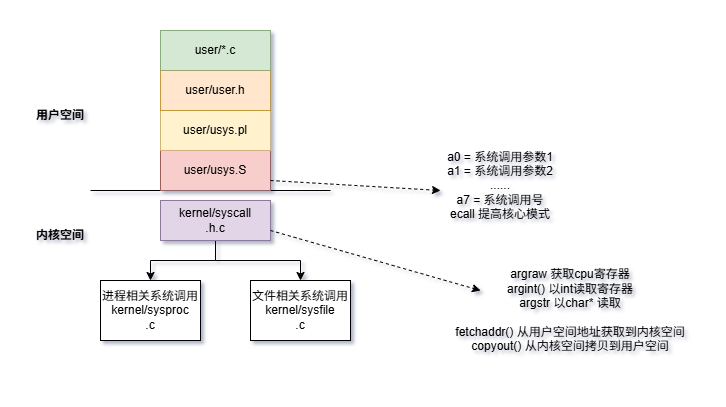

- [XV6 启动过程概述](#xv6-启动过程概述)
  - [启动过程的一些答疑](#启动过程的一些答疑)
    - [1. 为什么 C 语言必须要有栈？机器分得清吗？](#1-为什么-c-语言必须要有栈机器分得清吗)
    - [2. \_entry.S 里的栈：申请、大小与分布](#2-_entrys-里的栈申请大小与分布)
    - [3. mret 特性与 satp 的理解](#3-mret-特性与-satp-的理解)
    - [4. 中断委派（Delegation）：如何做到？](#4-中断委派delegation如何做到)
    - [5. userinit 创建的进程：内核还是用户空间？](#5-userinit-创建的进程内核还是用户空间)
    - [6. 从管理模式（S）切换到用户模式（U）的时机](#6-从管理模式s切换到用户模式u的时机)
    - [7. 什么是 Page（页）？](#7-什么是-page页)
    - [8. initcode.S是如何实现第一个exec系统调用的](#8-initcodes是如何实现第一个exec系统调用的)
      - [1. 触发者：用户态执行 ecall 指令](#1-触发者用户态执行-ecall-指令)
      - [2. 第一站：kernel/trampoline.S (汇编入口)](#2-第一站kerneltrampolines-汇编入口)
      - [3. 第二站：kernel/trap.c (C 语言逻辑)](#3-第二站kerneltrapc-c-语言逻辑)
      - [4. 终点站：kernel/syscall.c (查表执行)](#4-终点站kernelsyscallc-查表执行)
- [机器模式和管理员模式有什么区别吗](#机器模式和管理员模式有什么区别吗)
- [进程的页表，每个进程的内存结构，内核栈又是什么，他们在实际的ddr ram中是如何排布的](#进程的页表每个进程的内存结构内核栈又是什么他们在实际的ddr-ram中是如何排布的)
  - [一、物理内存(DDR RAM)的整体布局](#一物理内存ddr-ram的整体布局)
  - [二、内核的虚拟地址空间](#二内核的虚拟地址空间)
    - [三、用户进程的虚拟地址空间](#三用户进程的虚拟地址空间)
  - [四、页表结构 (三级页表)](#四页表结构-三级页表)
  - [五、内核栈详解](#五内核栈详解)
  - [六、完整的物理内存排布示例](#六完整的物理内存排布示例)
  - [七、关键数据结构](#七关键数据结构)
  - [八、图解：一次系统调用的内存使用](#八图解一次系统调用的内存使用)
- [关于文件系统](#关于文件系统)
  - [文件系统的两层含义](#文件系统的两层含义)
  - [你理解的流程基本正确](#你理解的流程基本正确)
  - [一个类比](#一个类比)
  - [补充：关于缓存](#补充关于缓存)
  - [lab2实验](#lab2实验)
    - [trace](#trace)
    - [sysinfo](#sysinfo)

# XV6 启动过程概述
XV6是MIT开发的一个教学用操作系统，基于Unix V6重新实现，运行在RISC-V架构上。其启动过程如下：

**1. 硬件初始化阶段**

机器上电后，RISC-V硬件首先执行ROM中的引导程序引导程序将**XV6内核**加载到内存地址 0x80000000，所有CPU的硬件寄存器被初始化

**2. entry.S - 内核入口**

位于 `kernel/entry.S`

这是**内核的第一段代码**，运行在机器模式(M-mode)

**主要工作**：
- 为每个CPU设置栈指针(sp)
- 跳转到 start() 函数

**3. start.c - 早期初始化**

位于 `kernel/start.c`

在机器模式下执行一些初始化：

1. 设置 mstatus 寄存器，准备**切换到监管模式(S-mode)**
2. 将 main 函数地址写入 mepc
3. 禁用分页（将 satp 设为0）
4. 配置中断和异常委托给S-mode
5. 初始化定时器中断
6. 调用 mret 指令切换到S-mode并跳转到 main()

**4. main.c - 内核主函数**

位于 `kernel/main.c`

只有CPU 0（引导CPU）执行完整初始化：
``` bash
consoleinit() - 初始化控制台
printfinit() - 初始化printf锁
kinit() - 初始化物理内存分配器
kvminit() - 创建内核页表
kvminithart() - 开启分页
procinit() - 初始化进程表
trapinit() - 初始化中断向量
trapinithart() - 安装内核中断处理器
plicinit() - 初始化PLIC中断控制器
plicinithart() - 为当前CPU配置PLIC
binit() - 初始化缓冲区缓存
iinit() - 初始化inode缓存
fileinit() - 初始化文件表
virtio_disk_init() - 初始化磁盘
userinit() - 创建第一个用户进程
scheduler() - 启动调度器
```

**5. 第一个用户进程**

userinit() 创建 init 进程

init 进程执行 `initcode.S`，调用 `exec("/init")`

/init 程序打开控制台，fork出shell
系统启动完成，等待用户输入

**启动流程图**
``` c
硬件上电 → ROM引导 → entry.S → start() → main() → scheduler()
                                              ↓
                                         userinit()
                                              ↓
                                         init进程
                                              ↓
                                           shell
```

## 启动过程的一些答疑

### 1. 为什么 C 语言必须要有栈？机器分得清吗？

**机器确实分不清**。

你说的没错，无论是 C 还是汇编，最后都是二进制指令。
**机器只负责执行 add、ld（加载）、st（存储）等指令**。


**汇编不需要栈吗？**：并非绝对。

汇编可以完全不用栈（如果你只用寄存器完成所有逻辑），但**一旦你需要函数调用（保存返回地址）或局部变量过多**寄存器放不下，汇编也得手动操作栈。

C 语言为什么必须有？：**C 语言的执行模型是基于堆栈的**。

**函数嵌套**与递归：当你调用 funcA 时，机器**需要记住从哪里跳回来的**。这个返回地址必须存起来，**最方便的地方就是栈**。

**局部变量**：每个函数内部定义的变量，其生命周期仅在函数内。C 编译器（如 **GCC）会将这些变量分配在 sp（栈指针）寄存器所指向的内存空间**。

>结论：如果 _entry.S 不给 sp 寄存器赋值一个有效的内存地址，C 代码里的第一行函数调用或变量声明就会导致程序往一个随机的地址写数据，直接导致系统崩溃。


### 2. _entry.S 里的栈：申请、大小与分布
- **申请标准与大小**：在 kernel/start.c 中，xv6 声明了 char stack0[4096 * NCPU]。

  - 大小：**每个 CPU 核心（Hart）分配 4096 字节（4KB）**。这在内核启动初期完全够用，因为此时没有复杂的深度递归。

  - 位置：它是**内核数据段的一部分**。当引导加载程序将 kernel 固件拷贝到 0x80000000 时，这个 stack0 数组也就随之存在于内存中了。

- **内存分布**： 由于 **RISC-V 的栈是向下增长**的（从高地址向低地址跑），_entry.S 的逻辑如下：

  - 获取当前 CPU 的编号（0, 1, 2...）。

  - 计算地址：sp = stack0 + (hartid + 1) * 4096。

- **存在多久**？：这个 stack0 在内核生命周期内一直存在。但要注意：一旦系统进入多进程调度阶段，每个用户进程都会有自己独立的 内核栈（kstack），stack0 主要用于系统启动和某些特定的中断处理。


### 3. mret 特性与 satp 的理解
你的理解基本完全正确，补充几个技术细节：

- **mret指令**：它是一个**硬件指令**，操作是：

  - 将特权级切换为 mstatus 中记录的模式（xv6 设置为 S 模式）。

  - 将 PC 指针跳转到 mepc 寄存器的值。

- **satp寄存器** (Supervisor Address Translation and Protection)：

  - 它就是 MMU 的开关和控制中心。

  - 当 satp = 0 时，禁用页表/MMU，此时 CPU 使用的是物理地址。

  - xv6 在 start 函数里关闭它是为了确保进入 main 时，内存访问是简单直接的，直到 main 后期手动初始化页表并再次开启它

### 4. 中断委派（Delegation）：如何做到？
在 RISC-V 中，**默认情况下，所有异常和中断**都会跳转到**机器模式**（M-Mode）处理。但内核通常运行在 管理模式（S-Mode），**如果每次时钟中断都要先跳进 M 模式再转手给 S 模式，太慢了**。

- **怎么做到**？：通过设置两个寄存器：**medeleg** (Machine Exception Delegation) 和 **mideleg** (Machine Interrupt Delegation)。

- **原理**：你只需要往这些寄存器的特定位**写 1**。
  - 比如，将“时钟中断”对应的位置 1，硬件就会在发生中断时，直接修改 S 模式的状态寄存器并跳转到 S 模式的中断向量表，完全绕过 M 模式。
### 5. userinit 创建的进程：内核还是用户空间？
这是一个很好的哲学问题。此时该进程处于 “胚胎期”：

-  **内存空间**：它占用的物理内存在内核初始化时划拨，但其内部存放的是用户代码（initcode）。所以从内容上看，它属于用户空间。

- **当前特权级**：此时 CPU 正在执行 userinit() 函数，依然处于 管理模式（S-Mode）。内核正在“通过上帝视角”为第一个进程配置环境。

> 结论：它是一个拥有用户空间内容、但尚未被剥离内核控制权的实体。

### 6. 从管理模式（S）切换到用户模式（U）的时机
在 **main.c 的最后**，你会看到 scheduler()（**调度器**）被调用。

- **调度**：调度器选中 userinit 创建的这个进程。

- **恢复上下文**：调度器会调用 swtch 进入该进程的内核态。

- **关键指令 sret**：在 kernel/trampoline.S 中，内核会执行 **sret 指令**。

  - sret 与 mret 类似：它会把特权级**从 S 模式降级到 用户模式（U-Mode）**，并根据 **sepc 寄存器**的值跳转到用户代码的第一行（即 initcode 的起点）。

总结：切换时机就在调度器第一次“恢复”该进程执行的那一刻。

### 7. 什么是 Page（页）？
在操作系统中，Page（页） 是**内存管理的最小物理单位**。

- **大小**：在 RISC-V 架构（以及大多数现代系统）中，一个页的标准大小是 **4096 字节** (4KB)。

- **作用**：内核不会按“字节”来给进程分配内存，而是按“页”来分配。

- **联系**：你在代码中看到的 PGSIZE 宏就代表 4096。p->sz = PGSIZE 意味着第一个进程目前只占用了一个页的虚拟内存空间。


### 8. initcode.S是如何实现第一个exec系统调用的
`initcode.S`
``` sh
# exec(init, argv)
.globl start
start:
        la a0, init
        la a1, argv
        li a7, SYS_exec
        ecall
```
> ecall 根本不是一个软件实现的函数，而是一条 RISC-V 硬件指令

我们可以把这个过程拆解为**四个关键步骤**：

#### 1. 触发者：用户态执行 ecall 指令
当用户程序（比如 initcode.S 或你写的 C 程序）需要系统服务时，它会将系统调用号（如 SYS_exec）放入 a7 寄存器，然后执行 ecall。

- 硬件反应：一旦 CPU 执行了 ecall 指令，硬件会自动完成以下动作：

  - 将当前特权级从 用户模式 (U-mode) 提升到 **管理模式** (S-mode)。

  - 把当前的程序计数器（PC）保存在 **sepc** 寄存器中（为了以后能跳回来）。

  - 跳转到 **stvec** (Supervisor Trap Vector Base Address Register) 寄存器所**指向的地址**。

#### 2. 第一站：kernel/trampoline.S (汇编入口)
内核在启动时，已经预先把 stvec 寄存器的值设置好了，它指向内核中一段叫 uservec 的汇编代码。

- **代码位置**：kernel/trampoline.S 里的 uservec 标号处。

- **作用**：因为刚从用户态跳进来，寄存器里全是用户的数据。这段汇编代码负责**把用户的所有寄存器保存到该进程的 trapframe 页面中**，并**切换到内核栈**，然后调用 C 函数 usertrap()。


#### 3. 第二站：kernel/trap.c (C 语言逻辑)
现在，我们终于从汇编进入了 C 语言的世界。

- 代码位置：`kernel/trap.c` 里的 `usertrap(void)` 函数。

- 关键逻辑：

```c
if(r_scause() == 8){ // 8 代表这是来自 U-mode 的 ecall
  if(p->killed) exit(-1);
  p->trapframe->epc += 4; // 将返回地址加4，跳过ecall指令本身，否则回来又执行一遍ecall
  intr_on();
  syscall(); // 真正的系统调用分发函数
}
```
内核通过读取 `scause` 寄存器发现：哦！是因为执行了 ecall 才进来的。

#### 4. 终点站：kernel/syscall.c (查表执行)
`usertrap` 会调用 `syscall()` 函数。

- **代码位置**：`kernel/syscall.c` 里的 `syscall(void)` 函数。

- **逻辑**：

  - 它从该进程的 `trapframe->a7` 中取出刚才用户放进去的系统调用号。

  - 它把这个数字作为索引，去查一个叫 `syscalls` 的函数指针数组。

  - **如果数字有效**，就调用对应的**内核函数**（比如 sys_exec）。


# 机器模式和管理员模式有什么区别吗
这是RISC-V架构中的**特权级别设计**，两者有明显区别：
```c
RISC-V 三种特权模式
模式	  缩写	特权级别	用途
机器模式	M-mode	最高 (3)	固件/引导程序
监管模式	S-mode	中等 (1)	操作系统内核
用户模式	U-mode	最低 (0)	用户程序
```

**主要区别**
1. **权限范围**

M-mode: 拥有对硬件的完全控制权，可以访问所有内存和寄存器，没有任何限制

S-mode: 权限受限，某些操作需要通过M-mode代理完成（如关机、设置定时器）

2. **可访问的CSR寄存器**

**M-mode专用**:  mstatus, mtvec, mepc, mcause, medeleg, mideleg...

**S-mode专用**:  sstatus, stvec, sepc, scause, satp...

S-mode无法直接访问 m 开头的寄存器。

3. **中断和异常处理**

M-mode: 默认接收所有中断和异常
S-mode: 只能处理M-mode委托(delegate)给它的中断和异常

// start.c 中的委托设置
w_medeleg(0xffff);  // 委托异常
w_mideleg(0xffff);  // 委托中断

4. **内存保护**

M-mode: 不受分页机制约束，可以访问任意物理地址
S-mode: 受 satp 寄存器控制的页表约束，通过虚拟地址访问内存


**实际用途**
``` c
┌─────────────────────────────────────┐
│  用户程序 (U-mode)                   │
├─────────────────────────────────────┤
│  操作系统内核 (S-mode) - XV6运行在这里 │
├─────────────────────────────────────┤
│  固件/SBI (M-mode) - OpenSBI/BBL    │
├─────────────────────────────────────┤
│  硬件                                │
└─────────────────────────────────────┘
```
**XV6中的体现
XV6启动时**：

entry.S 和 start() 在 M-mode 运行，完成最基本的硬件配置

通过 mret 指令切换到 S-mode，然后 main() 及之后的内核代码都在S-mode运行

用户程序在 U-mode 运行，通过系统调用(ecall)进入S-mode

这种**分层设计的好处**是：即使操作系统内核被攻破，M-mode的固件仍然安全，可以提供最基本的硬件保护。


# 进程的页表，每个进程的内存结构，内核栈又是什么，他们在实际的ddr ram中是如何排布的
## 一、物理内存(DDR RAM)的整体布局
XV6运行在QEMU模拟的RISC-V机器上，**物理内存从 0x80000000** 开始：

``` c
物理地址空间 (实际的DDR RAM)
┌────────────────────────┐ 0x88000000 (PHYSTOP, 128MB处)
│                        │
│   空闲物理页框          │  ← 由 kinit() 管理的空闲页
│   (被内核和用户进程     │    每个页 4KB
│    动态分配使用)        │
│                        │
├────────────────────────┤ end (内核代码结束处)
│   内核 BSS 段           │
├────────────────────────┤
│   内核 数据段           │
├────────────────────────┤
│   内核 代码段 (text)    │
├────────────────────────┤ 0x80000000 (KERNBASE)
│                        │
│   I/O 设备映射区        │  UART, PLIC, VIRTIO 等
│                        │
└────────────────────────┘ 0x00000000
```
## 二、内核的虚拟地址空间

内核使用直接映射：**虚拟地址 = 物理地址**

``` c
// kernel/memlayout.h 中定义
#define KERNBASE 0x80000000L
#define PHYSTOP  (KERNBASE + 128*1024*1024)  // 128MB
```
``` c
内核虚拟地址空间
┌────────────────────────┐ MAXVA (最高虚拟地址)
│   Trampoline (跳板页)   │  ← 映射到物理的 trampoline 代码
├────────────────────────┤ MAXVA - PGSIZE
│   Kstack for proc N    │  ← 进程N的内核栈
│   Guard page (无映射)   │  ← 栈溢出保护，访问会触发异常
├────────────────────────┤
│   ...                  │
├────────────────────────┤
│   Kstack for proc 1    │
│   Guard page           │
├────────────────────────┤
│   Kstack for proc 0    │
│   Guard page           │
├────────────────────────┤ 
│                        │
│   直接映射区            │  虚拟地址 == 物理地址
│   (内核代码、数据、     │
│    空闲内存)            │
│                        │
├────────────────────────┤ 0x80000000
│   设备 I/O 映射         │
└────────────────────────┘ 0x00000000
```
### 三、用户进程的虚拟地址空间
每个进程有自己**独立**的虚拟地址空间：

``` c
用户进程虚拟地址空间 (每个进程看到的)
┌────────────────────────┐ MAXVA
│   Trampoline           │  ← 与内核共享同一物理页
├────────────────────────┤ MAXVA - PGSIZE
│   Trapframe            │  ← 保存寄存器，陷入时使用
├────────────────────────┤ MAXVA - 2*PGSIZE
│                        │
│   (未使用)              │
│                        │
├────────────────────────┤ 
│   用户栈 (Stack)        │  ← 向下增长
│         ↓              │
├────────────────────────┤
│   Guard page           │  ← 栈溢出保护
├────────────────────────┤
│         ↑              │
│   堆 (Heap)            │  ← 向上增长 (sbrk)
├────────────────────────┤ p->sz (进程大小)
│   数据段 (Data/BSS)     │
├────────────────────────┤
│   代码段 (Text)         │
└────────────────────────┘ 0x00000000
```
## 四、页表结构 (三级页表)
RISC-V Sv39 使用**三级页表**，**虚拟地址39位**：

``` c
虚拟地址 (39位):
┌─────────┬─────────┬─────────┬──────────────┐
│ L2 (9位)│ L1 (9位)│ L0 (9位)│ Offset (12位)│
└─────────┴─────────┴─────────┴──────────────┘
    │          │          │
    ▼          ▼          ▼
┌────────┐ ┌────────┐ ┌────────┐
│ 页目录2 │→│ 页目录1 │→│ 页目录0 │→ 物理页框
│ 512项  │ │ 512项  │ │ 512项  │
└────────┘ └────────┘ └────────┘
   4KB        4KB        4KB
每个页表项(PTE) 64位：


┌────────────────────────────────────────────────────┬─────────────┐
│           PPN (物理页号, 44位)                      │ Flags (10位)│
└────────────────────────────────────────────────────┴─────────────┘
                                                      V R W X U G A D
```
## 五、内核栈详解
什么是**内核栈**？
**每个进程有两个栈**：

- 用户栈: 在用户空间，运行用户代码时使用
- 内核栈: 在内核空间，进程陷入内核(系统调用/中断)时使用


**为什么需要内核栈？**
``` c
用户程序调用 read() 系统调用:

用户态 (U-mode)          内核态 (S-mode)
┌──────────────┐         ┌──────────────┐
│  用户代码     │         │  sys_read()  │
│  调用 read() │ ──ecall──→│  使用内核栈  │
│  用户栈      │         │  执行内核代码 │
└──────────────┘         └──────────────┘
```
> 如果内核代码使用用户栈，恶意用户程序可以破坏内核数据。

**内核栈在物理内存中的位置**
``` c
// kernel/proc.c - procinit()
void procinit(void) {
  for(p = proc; p < &proc[NPROC]; p++) {
    // 为每个进程分配一个物理页作为内核栈
    char *pa = kalloc();  // 从空闲页分配 4KB
    
    // 映射到内核虚拟地址空间的高地址处
    uint64 va = KSTACK((int)(p - proc));
    kvmmap(kpgtbl, va, (uint64)pa, PGSIZE, PTE_R | PTE_W);
    
    p->kstack = va;
  }
}
```
## 六、完整的物理内存排布示例
假设系统有**3个进程运行**：

``` c
物理 DDR RAM 实际排布 (地址从低到高)
┌─────────────────────────────────────┐ 0x88000000
│                                     │
│  空闲页框池 (由 freelist 管理)       │
│                                     │
├─────────────────────────────────────┤ 
│  进程2的用户页 (代码+数据+栈+堆)     │ ← 分散在各处
├─────────────────────────────────────┤
│  进程2的页表 (3个或更多4KB页)        │
├─────────────────────────────────────┤
│  进程2的内核栈 (1个4KB页)            │
├─────────────────────────────────────┤
│  进程1的用户页                       │
├─────────────────────────────────────┤
│  进程1的页表                         │
├─────────────────────────────────────┤
│  进程1的内核栈                       │
├─────────────────────────────────────┤
│  进程0 (init) 的用户页               │
├─────────────────────────────────────┤
│  进程0的页表                         │
├─────────────────────────────────────┤
│  进程0的内核栈                       │
├─────────────────────────────────────┤
│  内核页表                            │
├─────────────────────────────────────┤ end
│  内核 BSS                            │
│  内核 Data                           │
│  内核 Text (包含 trampoline)         │
└─────────────────────────────────────┘ 0x80000000
```
## 七、关键数据结构
``` c
// kernel/proc.h
struct proc {
  struct spinlock lock;
  
  enum procstate state;      // 进程状态
  int pid;                   // 进程ID
  
  pagetable_t pagetable;     // 用户页表的物理地址
  uint64 kstack;             // 内核栈的虚拟地址
  uint64 sz;                 // 进程内存大小
  
  struct trapframe *trapframe; // 陷入帧，保存寄存器
  struct context context;    // 上下文，用于切换
  // ...
};
```
## 八、图解：一次系统调用的内存使用
``` c
1. 用户程序在用户空间运行
   ┌─────────────────┐
   │ 用户虚拟地址空间  │
   │ 使用用户栈       │  ← sp 指向用户栈
   └─────────────────┘

2. 执行 ecall，陷入内核
   ┌─────────────────┐
   │ trampoline 代码  │  ← 保存寄存器到 trapframe
   │ 切换到内核页表   │
   │ 切换到内核栈     │  ← sp 改为指向内核栈
   └─────────────────┘

3. 在内核中执行
   ┌─────────────────┐
   │ 内核虚拟地址空间  │
   │ 使用内核栈       │  ← 内核函数调用使用内核栈
   └─────────────────┘

4. 返回用户空间
   ┌─────────────────┐
   │ 恢复用户页表     │
   │ 恢复用户寄存器   │
   │ sret 返回       │  ← sp 恢复为用户栈
   └─────────────────┘
```
这样设计的**核心思想是隔离**：
- 每个进程有独立的虚拟地址空间，互不干扰；
- 用户态和内核态使用不同的栈，保证安全。


# 关于文件系统
## 文件系统的两层含义
**1. 文件系统代码（在内核中）**

文件系统的实现代码确实在内核代码段里。在 xv6 中主要是这些文件：

- `fs.c` - 文件系统核心逻辑
- `bio.c` - 块缓存层
- `log.c` - 日志层

这些代码在**内核启动后就加载到 RAM 中**，作为**内核的一部分**运行。

**2. 文件系统结构（在磁盘上）**
磁盘上按特定格式组织的数据结构：


`磁盘布局`:
``` c
+-------+-------+-------+--------+--------+--------+
| boot  | super | log   | inode  | bitmap | data   |
| block | block | blocks| blocks | blocks | blocks |
+-------+-------+-------+--------+--------+--------+
```
这是持久化存储的数据，不是代码。

## 你理解的流程基本正确

当执行 `ls` 程序时：

``` c
1. shell 调用 exec("ls", ...)
          ↓
2. 内核的文件系统代码（在RAM中）解析路径 "/bin/ls"
          ↓
3. 查找 inode，获取文件在磁盘上的位置
          ↓
4. 通过磁盘驱动读取 ls 的二进制到 RAM
          ↓
5. 创建新进程，设置页表，跳转执行
```
## 一个类比
可以这样理解：
``` c
概念	类比
文件系统代码	图书管理员（知道如何查找书籍）
磁盘上的文件系统结构	图书馆的索引卡片系统
磁盘上的文件数据	实际的书籍
```
图书管理员（代码）使用索引系统（磁盘结构）来定位和取出书籍（文件数据）。

## 补充：关于缓存
你提到"先到 RAM 中找"——xv6 确实有 buffer cache（`bio.c`），会缓存最近访问的磁盘块。但这是块级别的缓存，不是文件级别的。流程是：

``` c
读文件 → 检查 buffer cache → 命中则直接返回
                          → 未命中则从磁盘读取并缓存
```
所以你的理解方向是对的，只是缓存的粒度是磁盘块而不是整个文件。


## lab2实验



### trace
``` c
From 566bf1c4d43572f19676aaf6ffd9e4d3df77007b Mon Sep 17 00:00:00 2001
From: liangji-seu <15262272286@163.com>
Date: Mon, 26 Jan 2026 15:48:13 +0800
Subject: [PATCH 1/2] feat: support syscall trace

---
 Makefile         |  1 +
 kernel/defs.h    |  3 +++
 kernel/printf.c  | 57 ++++++++++++++++++++++++++++++++++++++++++
 kernel/proc.c    |  3 +++
 kernel/proc.h    |  4 +++
 kernel/syscall.c | 64 ++++++++++++++++++++++++++++++++++++++++++++++++
 kernel/syscall.h |  1 +
 kernel/sysproc.c | 16 ++++++++++++
 user/user.h      |  1 +
 user/usys.pl     |  1 +
 10 files changed, 151 insertions(+)

diff --git a/Makefile b/Makefile
index c926b7e..6647da5 100644
--- a/Makefile
+++ b/Makefile
@@ -193,6 +193,7 @@ UPROGS=\
 	$U/_grind\
 	$U/_wc\
 	$U/_zombie\
+	$U/_trace\
 
 
 
diff --git a/kernel/defs.h b/kernel/defs.h
index 3564db4..b8a90bf 100644
--- a/kernel/defs.h
+++ b/kernel/defs.h
@@ -80,6 +80,9 @@ int             pipewrite(struct pipe*, uint64, int);
 void            printf(char*, ...);
 void            panic(char*) __attribute__((noreturn));
 void            printfinit(void);
+void            print_binary(uint64, int);
+void            print_binary64(uint64);
+void            print_binary32(int);
 
 // proc.c
 int             cpuid(void);
diff --git a/kernel/printf.c b/kernel/printf.c
index e1347de..ecc8165 100644
--- a/kernel/printf.c
+++ b/kernel/printf.c
@@ -132,3 +132,60 @@ printfinit(void)
   initlock(&pr.lock, "pr");
   pr.locking = 1;
 }
+
+// 打印 uint64 类型数值的二进制形式
+// num: 要打印的数值
+// bits: 要显示的二进制位数（如32表示显示低32位，64表示显示全部）
+void print_binary(uint64 num, int bits) {
+  // 边界检查：bits 范围 1~64
+  if (bits < 1) bits = 1;
+  if (bits > 64) bits = 64;
+
+  // 从最高位开始逐位检查
+  for (int i = bits - 1; i >= 0; i--) {
+    // 按位与操作：检查第i位是否为1
+    uint64 mask = 1UL << i;
+    if (num & mask) {
+      printf("1");
+    } else {
+      printf("0");
+    }
+    // 每8位加一个空格，提升可读性（可选）
+    if (i % 8 == 0 && i != 0) {
+      printf(" ");
+    }
+  }
+  // 换行（可选，根据需要调整）
+  printf("\n");
+}
+
+// 简化版：默认打印64位二进制
+void print_binary64(uint64 num) {
+  print_binary(num, 64);
+}
+
+// 专门打印int类型的32位二进制形式
+// num: 要打印的int型数值（xv6中int为32位）
+// 输出格式：每8位加空格分隔，提升可读性
+void print_binary32(int num) {
+  // 转换为uint32_t避免负数符号位干扰（保证按位打印的准确性）
+  uint32 val = (uint32)num;
+  
+  // 从第31位（最高位）到第0位（最低位）逐位打印
+  for (int i = 31; i >= 0; i--) {
+    // 生成对应位的掩码（1左移i位）
+    uint32 mask = 1U << i;
+    // 按位与判断该位是1还是0
+    if (val & mask) {
+      printf("1");
+    } else {
+      printf("0");
+    }
+    // 每8位添加一个空格，方便阅读（如 10000000 00000000 00000000 00100000）
+    if (i % 8 == 0 && i != 0) {
+      printf(" ");
+    }
+  }
+  // 打印换行，使输出更整洁
+  printf("\n");
+}
diff --git a/kernel/proc.c b/kernel/proc.c
index 22e7ce4..83a84e7 100644
--- a/kernel/proc.c
+++ b/kernel/proc.c
@@ -305,6 +305,9 @@ fork(void)
 
   pid = np->pid;
 
+  // seu liangji add, copy trace_mask from parent to child process
+  np->trace_mask = p->trace_mask;
+
   release(&np->lock);
 
   acquire(&wait_lock);
diff --git a/kernel/proc.h b/kernel/proc.h
index f6ca8b7..b91b487 100644
--- a/kernel/proc.h
+++ b/kernel/proc.h
@@ -105,4 +105,8 @@ struct proc {
   struct file *ofile[NOFILE];  // Open files
   struct inode *cwd;           // Current directory
   char name[16];               // Process name (debugging)
+
+  // seu liangji add start
+  int trace_mask;
+  // seu liangji add end
 };
diff --git a/kernel/syscall.c b/kernel/syscall.c
index c1b3670..6ac8910 100644
--- a/kernel/syscall.c
+++ b/kernel/syscall.c
@@ -104,6 +104,7 @@ extern uint64 sys_unlink(void);
 extern uint64 sys_wait(void);
 extern uint64 sys_write(void);
 extern uint64 sys_uptime(void);
+extern uint64 sys_trace(void);
 
 static uint64 (*syscalls[])(void) = {
 [SYS_fork]    sys_fork,
@@ -127,13 +128,55 @@ static uint64 (*syscalls[])(void) = {
 [SYS_link]    sys_link,
 [SYS_mkdir]   sys_mkdir,
 [SYS_close]   sys_close,
+[SYS_trace]   sys_trace,
 };
 
+// 系统调用名称数组（索引对应系统调用编号）
+static const char* syscall_names[] = {
+    "",          // 0: 无对应系统调用
+    "fork",      // 1
+    "exit",      // 2
+    "wait",      // 3
+    "pipe",      // 4
+    "read",      // 5
+    "kill",      // 6
+    "exec",      // 7
+    "fstat",     // 8
+    "chdir",     // 9
+    "dup",       // 10
+    "getpid",    // 11
+    "sbrk",      // 12
+    "sleep",     // 13
+    "uptime",    // 14
+    "open",      // 15
+    "write",     // 16
+    "mknod",     // 17
+    "unlink",    // 18
+    "link",      // 19
+    "mkdir",     // 20
+    "close",     // 21
+    "trace"      // 22
+};
+
+void get_syscall_name(int id, char* buf)
+{
+    // 清空缓冲区
+    *buf = '\0';
+    
+    // 边界检查：确保id在有效范围内
+    if (id >= 1 && id < sizeof(syscall_names)/sizeof(syscall_names[0])) {
+        strncpy(buf, syscall_names[id], strlen(syscall_names[id]));
+    } else {
+        strncpy(buf, "unknown", strlen("unknown"));
+    }
+}
+
 void
 syscall(void)
 {
   int num;
   struct proc *p = myproc();
+  //printf("%d: syscall\n", p->pid);
 
   num = p->trapframe->a7;
   if(num > 0 && num < NELEM(syscalls) && syscalls[num]) {
@@ -143,4 +186,25 @@ syscall(void)
             p->pid, p->name, num);
     p->trapframe->a0 = -1;
   }
+
+  // seu liangji add, trace info print
+  int temp = p->trace_mask;
+  char syscall_name[32];
+  memset(syscall_name, 0, sizeof(syscall_name));
+  get_syscall_name(num, syscall_name);
+
+  /*
+  if(temp != 0)
+  {
+      printf("temp = %d,    num = %d\n", temp, num);
+      print_binary32(temp);
+      print_binary32(1<<num);
+      printf("%d\n", (temp & (1<<num)));
+  }
+  */
+
+  if((temp & (1<<num))!=0)
+  {
+      printf("%d: syscall %s -> %d\n", p->pid, syscall_name, p->trapframe->a0);
+  }
 }
diff --git a/kernel/syscall.h b/kernel/syscall.h
index bc5f356..cc112b9 100644
--- a/kernel/syscall.h
+++ b/kernel/syscall.h
@@ -20,3 +20,4 @@
 #define SYS_link   19
 #define SYS_mkdir  20
 #define SYS_close  21
+#define SYS_trace  22
diff --git a/kernel/sysproc.c b/kernel/sysproc.c
index e8bcda9..095982f 100644
--- a/kernel/sysproc.c
+++ b/kernel/sysproc.c
@@ -95,3 +95,19 @@ sys_uptime(void)
   release(&tickslock);
   return xticks;
 }
+
+// trace
+uint64
+sys_trace(void)
+{
+    //get trace(int) int to p
+    int p;
+    if(argint(0, &p) < 0)
+        return -1;
+
+    myproc()->trace_mask = p;
+    return 0;
+
+}
+
+
diff --git a/user/user.h b/user/user.h
index b71ecda..fdeeefc 100644
--- a/user/user.h
+++ b/user/user.h
@@ -23,6 +23,7 @@ int getpid(void);
 char* sbrk(int);
 int sleep(int);
 int uptime(void);
+int trace(int);
 
 // ulib.c
 int stat(const char*, struct stat*);
diff --git a/user/usys.pl b/user/usys.pl
index 01e426e..9c97b05 100755
--- a/user/usys.pl
+++ b/user/usys.pl
@@ -36,3 +36,4 @@ entry("getpid");
 entry("sbrk");
 entry("sleep");
 entry("uptime");
+entry("trace");
-- 
2.25.1


```


### sysinfo

> xv6 的kalloc.c中，空闲内存是通过链表（kmem.freelist） 管理的，而非连续的物理地址区间
``` c
From 42f4a5077d04d76130213378209d504169c9c853 Mon Sep 17 00:00:00 2001
From: liangji-seu <15262272286@163.com>
Date: Mon, 26 Jan 2026 18:34:18 +0800
Subject: [PATCH 2/2] feat: support sysinfo

---
 Makefile         |  1 +
 kernel/defs.h    |  3 +++
 kernel/kalloc.c  | 13 +++++++++++
 kernel/proc.c    | 15 +++++++++++++
 kernel/syscall.c |  3 +++
 kernel/syscall.h |  1 +
 kernel/sysproc.c | 57 ++++++++++++++++++++++++++++++++++++++++++++++++
 user/user.h      |  2 ++
 user/usys.pl     |  1 +
 9 files changed, 96 insertions(+)

diff --git a/Makefile b/Makefile
index 6647da5..cfb5119 100644
--- a/Makefile
+++ b/Makefile
@@ -194,6 +194,7 @@ UPROGS=\
 	$U/_wc\
 	$U/_zombie\
 	$U/_trace\
+	$U/_sysinfotest\
 
 
 
diff --git a/kernel/defs.h b/kernel/defs.h
index b8a90bf..0a6f5c1 100644
--- a/kernel/defs.h
+++ b/kernel/defs.h
@@ -63,6 +63,7 @@ void            ramdiskrw(struct buf*);
 void*           kalloc(void);
 void            kfree(void *);
 void            kinit(void);
+int             get_leave_mem(void);
 
 // log.c
 void            initlog(int, struct superblock*);
@@ -107,6 +108,8 @@ void            yield(void);
 int             either_copyout(int user_dst, uint64 dst, void *src, uint64 len);
 int             either_copyin(void *dst, int user_src, uint64 src, uint64 len);
 void            procdump(void);
+int             get_not_unused_proc_num(void);
+
 
 // swtch.S
 void            swtch(struct context*, struct context*);
diff --git a/kernel/kalloc.c b/kernel/kalloc.c
index fa6a0ac..8ac4961 100644
--- a/kernel/kalloc.c
+++ b/kernel/kalloc.c
@@ -80,3 +80,16 @@ kalloc(void)
     memset((char*)r, 5, PGSIZE); // fill with junk
   return (void*)r;
 }
+
+int
+get_leave_mem()
+{
+    struct run *r;
+    acquire(&kmem.lock);
+    int count= 0;
+    r = kmem.freelist;
+    for(r = kmem.freelist; r; r = r->next){
+        count++;
+    }
+    release(&kmem.lock);
+    //return bytes
+    return count * 4096;
+}
diff --git a/kernel/proc.c b/kernel/proc.c
index 83a84e7..68a8c29 100644
--- a/kernel/proc.c
+++ b/kernel/proc.c
@@ -657,3 +657,18 @@ procdump(void)
     printf("\n");
   }
 }
+
+int
+get_not_unused_proc_num()
+{
+    struct proc *p;
+    int num = 0;
+
+    for(p = proc; p < &proc[NPROC]; p++) {
+        if(p->state != UNUSED)
+        {
+            num++;
+        }
+    }
+    return num;
+}
diff --git a/kernel/syscall.c b/kernel/syscall.c
index 6ac8910..041f72a 100644
--- a/kernel/syscall.c
+++ b/kernel/syscall.c
@@ -105,6 +105,7 @@ extern uint64 sys_wait(void);
 extern uint64 sys_write(void);
 extern uint64 sys_uptime(void);
 extern uint64 sys_trace(void);
+extern uint64 sys_sysinfo(void);
 
 static uint64 (*syscalls[])(void) = {
 [SYS_fork]    sys_fork,
@@ -129,6 +130,7 @@ static uint64 (*syscalls[])(void) = {
 [SYS_mkdir]   sys_mkdir,
 [SYS_close]   sys_close,
 [SYS_trace]   sys_trace,
+[SYS_sysinfo]   sys_sysinfo,
 };
 
 // 系统调用名称数组（索引对应系统调用编号）
@@ -156,6 +158,7 @@ static const char* syscall_names[] = {
     "mkdir",     // 20
     "close",     // 21
     "trace"      // 22
+    "sysinfo"    // 23
 };
 
 void get_syscall_name(int id, char* buf)
diff --git a/kernel/syscall.h b/kernel/syscall.h
index cc112b9..0dfedc7 100644
--- a/kernel/syscall.h
+++ b/kernel/syscall.h
@@ -21,3 +21,4 @@
 #define SYS_mkdir  20
 #define SYS_close  21
 #define SYS_trace  22
+#define SYS_sysinfo 23
diff --git a/kernel/sysproc.c b/kernel/sysproc.c
index 095982f..fedc89c 100644
--- a/kernel/sysproc.c
+++ b/kernel/sysproc.c
@@ -6,6 +6,7 @@
 #include "memlayout.h"
 #include "spinlock.h"
 #include "proc.h"
+#include "sysinfo.h"
 
 uint64
 sys_exit(void)
@@ -110,4 +111,60 @@ sys_trace(void)
 
 }
 
+//sysinfo
+uint64
+sys_sysinfo(void)
+{
+  uint64 i; // user pointer to user space sysinfo
+
+  if(argaddr(0, &i) < 0)
+    return -1;
+
+  struct sysinfo temp;
+  temp.freemem = get_leave_mem();
+  temp.nproc = get_not_unused_proc_num();
+
+  struct proc *p = myproc();
+  if(copyout(p->pagetable, i, (char *)&temp, sizeof(temp)) < 0)
+    return -1;
+
+  //
+  return 0;
+}
 
diff --git a/user/user.h b/user/user.h
index fdeeefc..6ba24e6 100644
--- a/user/user.h
+++ b/user/user.h
@@ -1,5 +1,6 @@
 struct stat;
 struct rtcdate;
+struct sysinfo;
 
 // system calls
 int fork(void);
@@ -24,6 +25,7 @@ char* sbrk(int);
 int sleep(int);
 int uptime(void);
 int trace(int);
+int sysinfo(struct sysinfo*);
 
 // ulib.c
 int stat(const char*, struct stat*);
diff --git a/user/usys.pl b/user/usys.pl
index 9c97b05..bc109fd 100755
--- a/user/usys.pl
+++ b/user/usys.pl
@@ -37,3 +37,4 @@ entry("sbrk");
 entry("sleep");
 entry("uptime");
 entry("trace");
+entry("sysinfo");
-- 
2.25.1


```