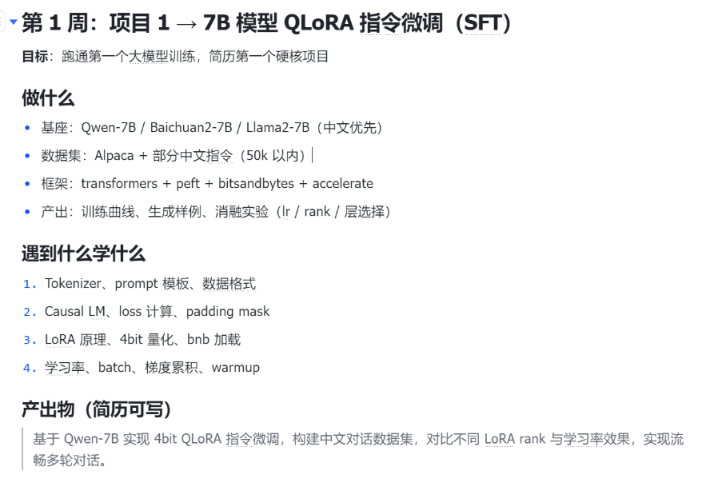
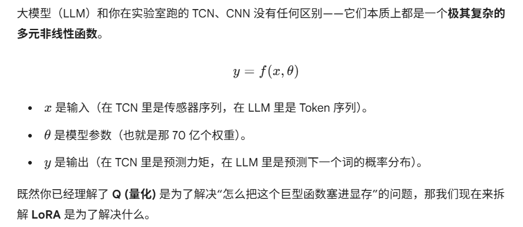
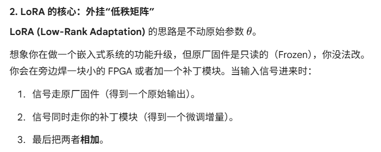

# 项目1：7B模型QLoRA 指令微调(SFT)

## 概念扫盲
Alpaca 格式 是最经典的指令微调格式。每一条数据通常包含：instruction, input, output

##
```py
# 2. 安装核心“四大件”
# transformers: 模型加载
# peft: LoRA 核心库
# bitsandbytes: 4-bit 量化工具（QLoRA 的灵魂）
# accelerate: 分布式训练加速
pip install torch torchvision torchaudio
pip install transformers peft bitsandbytes accelerate datasets trl
```


**量化**就是压缩模型体积，通过降低精度，来用更少的内存空间来存储模型



1. **为什么不能直接微调（全量微调）**？
假设你想让 Qwen 学会说“扬州话”。在传统的深度学习里，你会更新 $\theta$ 里的所有参数。但对于 7B 模型：
    显存灾难：训练时不仅要存参数，还要存梯度（Gradients）和优化器状态（Optimizer States）。
    
    全量微调一个 7B 模型通常需要 80GB~100GB 的显存。灾难性遗忘：如果你用力过猛，模型学会了扬州话，但可能把怎么写 Python 代码给忘了。


LoRA 的核心：外挂“低秩矩阵”，思路是不动原始参数 θ
