# 过拟合欠拟合

- 模型容量：
  - 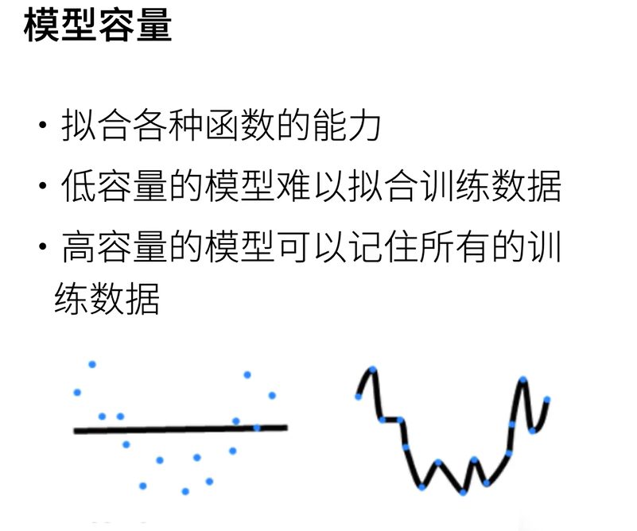
  - 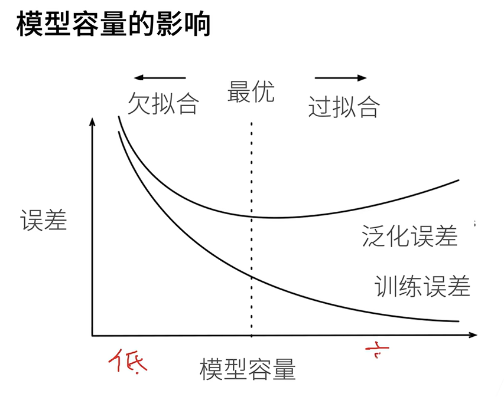
  - 线性模型就是简单
  - 多层感知机就是复杂模型
  - > 为了把泛化误差往下拉，往往要沾一点过拟合，过拟合不是很坏的事情，首先容量得够
  - > 深度学习核心就是在模型容量足够大的情况下，来控制模型容量，从而得到最低的泛化误差
  - 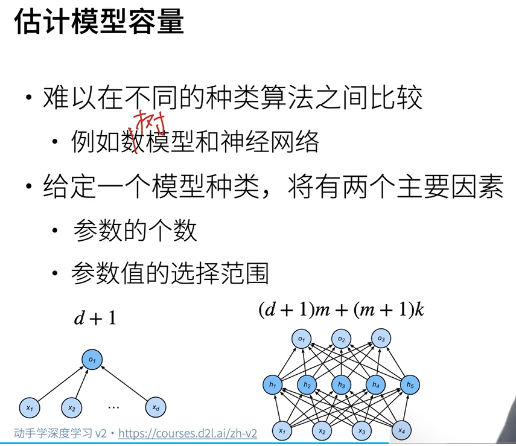
  - 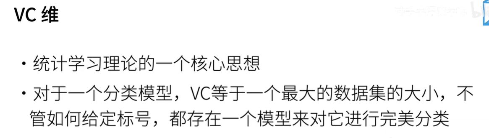
  - 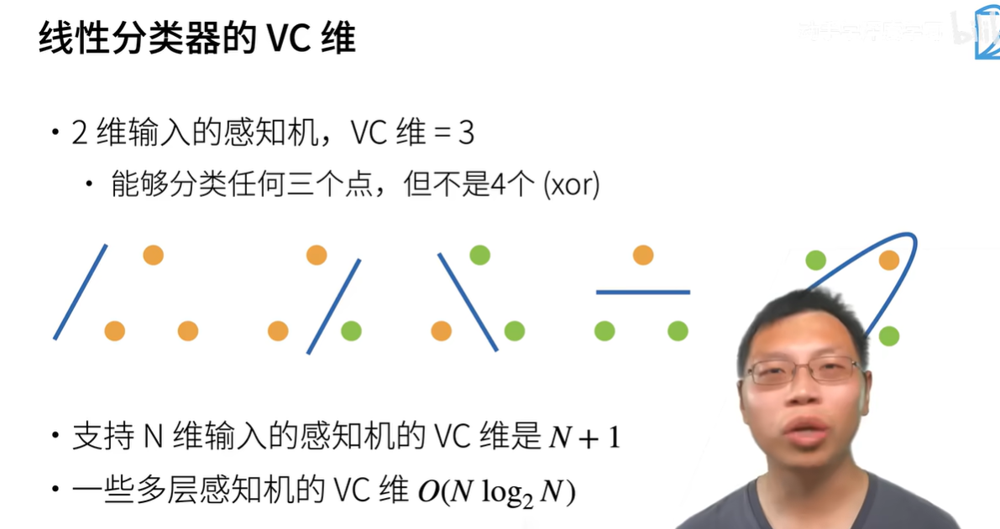
  - 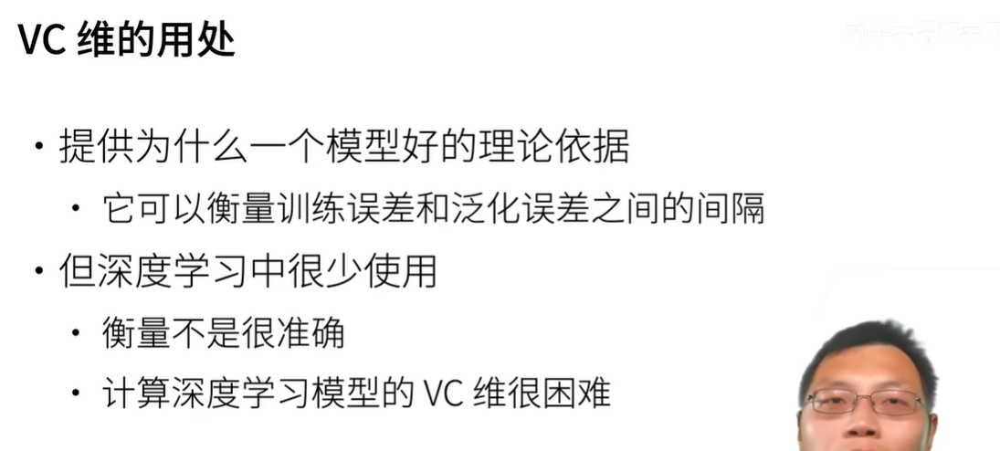
- 数据：
  - 根据数据集的复杂程度来选择模型容量
  - 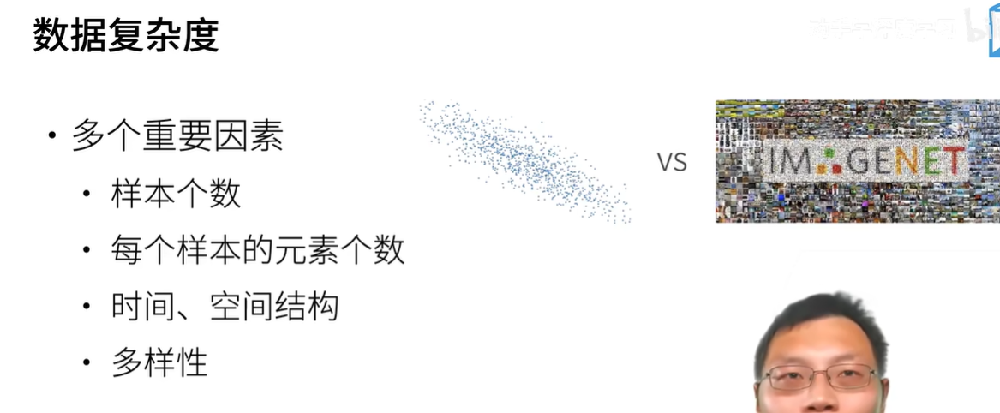

# 权重衰退
是一个常见的处理**过拟合**的方法

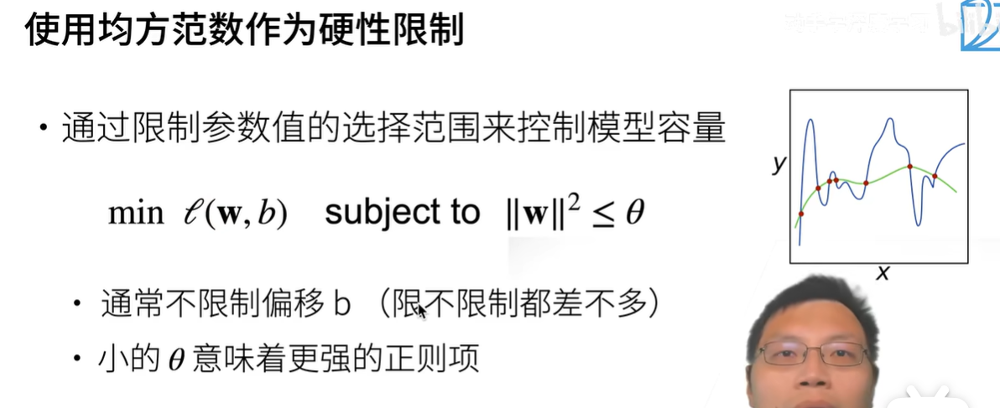
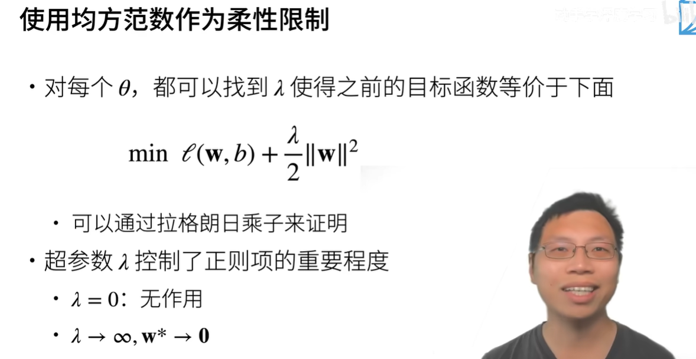

> **这个lamda好像就是吴恩达里面讲的正则项，来防止过拟合，就是让步长越来越小**

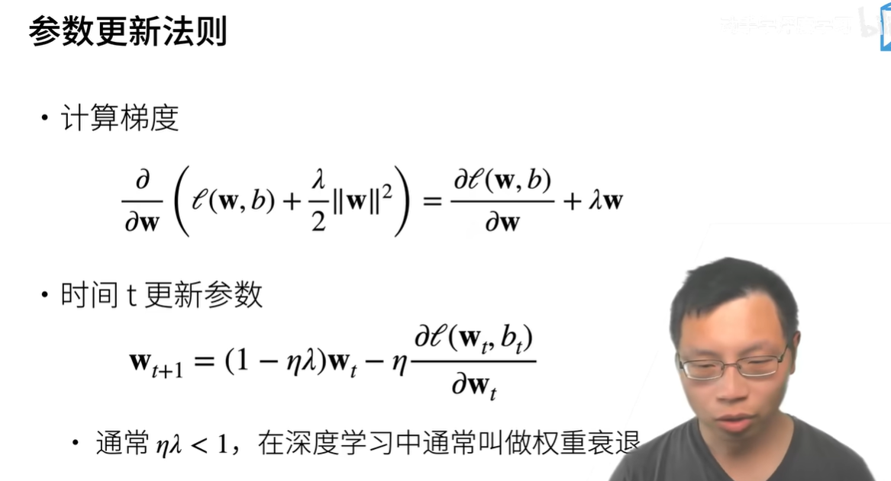
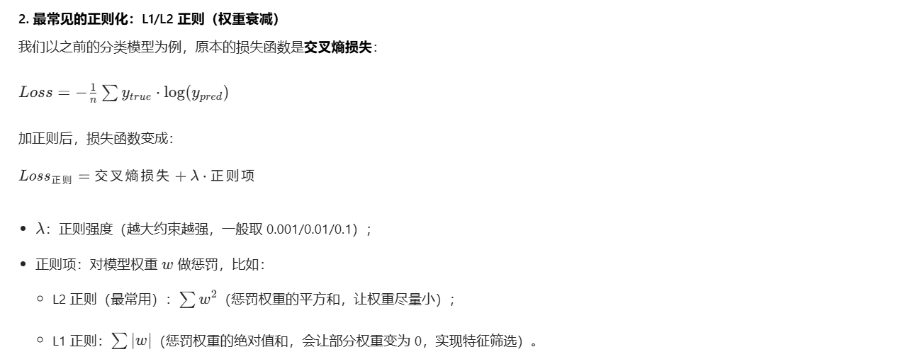

# 丢弃法dropout
这个比权重衰退效果更好

- 在数据里面加入噪声，等于正则（就是让你的权重不要过大）
- 丢弃法：
  - 不是在输入加噪音，是**层之间加噪音**
  - 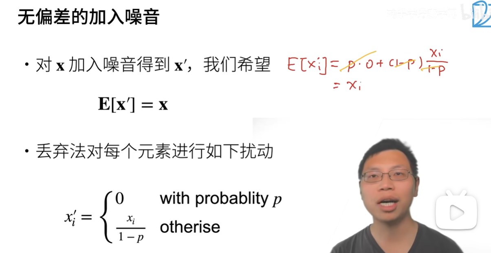
  - > 期望E没有变化， 但是有的神经元，有概率p被丢弃，但是整体期望不变
  - 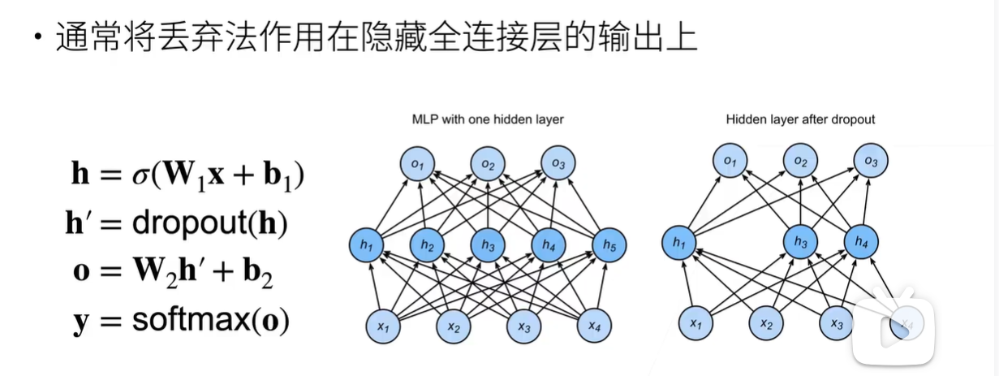
  - > 隐藏层的每一个hi，加了噪声，留下的变大了，概率p的丢弃了
  - > **训练就是上面这个样子**， 但是**在推理infer中，是不用dropout的**
  - 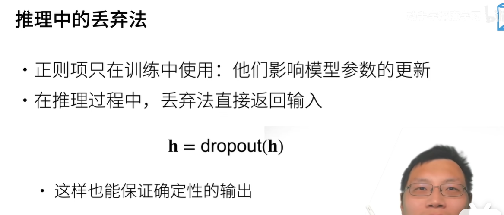
  - 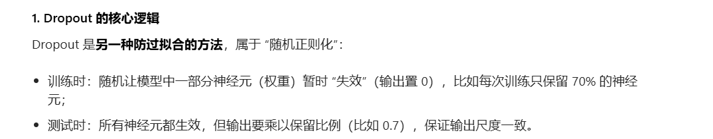

# 数值稳定性
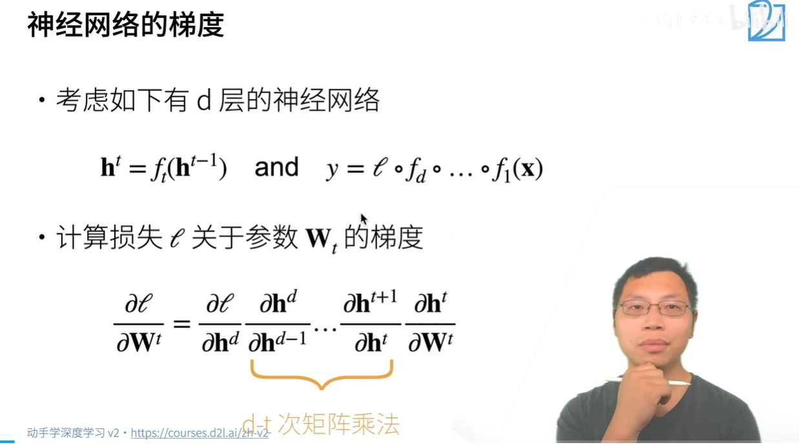

**向量对向量求导，就是矩阵，下面的式子就会导致太多的矩阵**

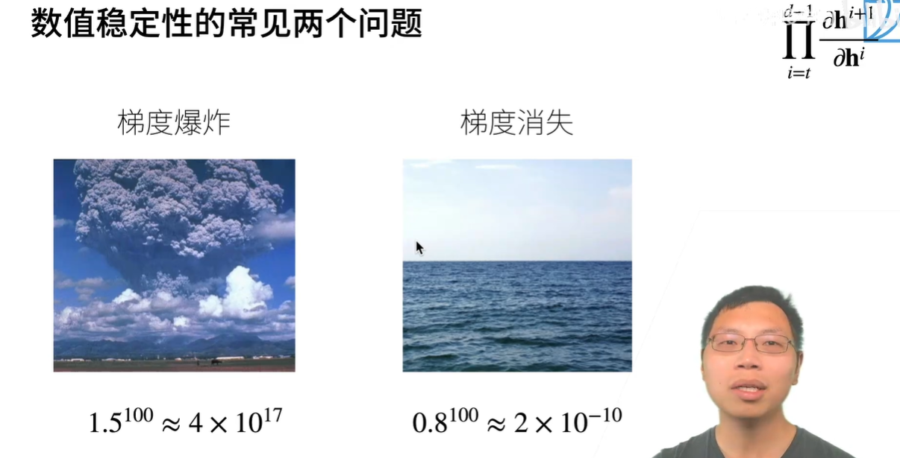

**多层感知机MLP的例子：**

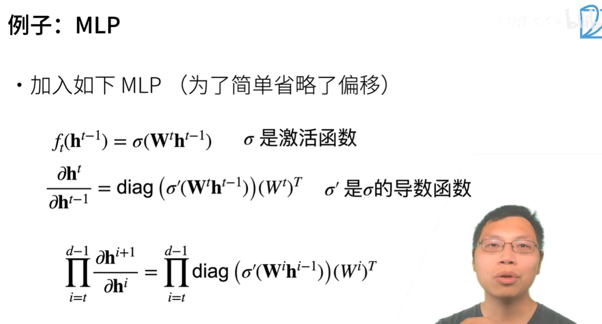
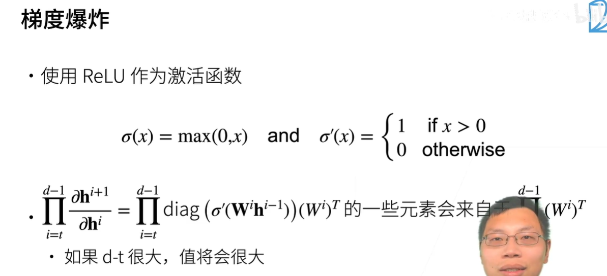
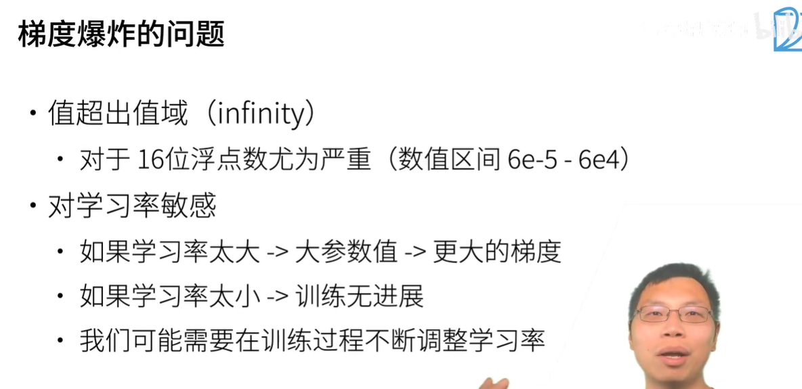
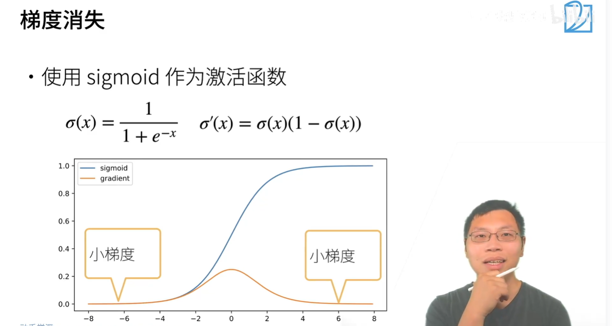
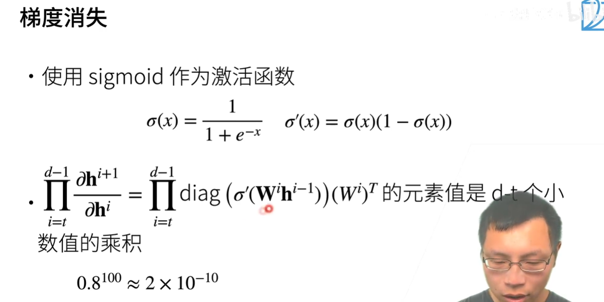

# 模型初始化和激活函数（如何让训练更稳定）

