# python概念扫盲
基础的python语法，这里就不讲了，python本身底层是用c++来实现的，所以全部都是面向对象变成，里面所有的库，都是实现的类。

python的所有变量 = auto指针
指针创建在栈区，指向堆区的内存。实际的对象内存，在堆区里面。

# pytorch

## **==pytorch特性==**：


比较重要的就是：
1. 动态计算图的理解-> 自动微分的实现
2. torch.tensor(), 张量，和numpy库里面的数组定义类似。

## ==**自动求导机制**==

我们模型的Loss函数，需要对w, b求导，其自动求导是依赖计算图的。 当我们建立好了计算图

```C
w → * → y_pred → - → (差) → **2 → loss
    ↑                 ↑
    x               y_true
    
    w = torch.tensor(2.0, requires_grad=True)
    loss.backward()
```

我们通过标记变量为需要求导，相当于把这个对象的标志位，置1，这样当你调用loss.backward()的时候，他就可以根据这个计算链表图，找到对应的变量，求Loss()关于这个变量的偏微分，也就是偏导数。所有的偏导数的动态数组，就是梯度


## **==pytorch的作用==**
我们使用pytorch，本质上，是为了快速的
- 搭建网络模型
- 处理数据
- 训练/评估
- 推理
本质上都是在干这4件事情。所以需要学会用哪些库来实现我们想要的功能。


## **==pytorch库架构图==**
pytorch是一个大的库，里面有不同功能模块子库


## 自动微分
pytorch里最重要的就是依靠动态计算图，来进行自动微分的计算了。

### 梯度
一元函数，因变量关于自变量求导，叫做导数。
			y = f(x)  =>  ∂f/∂x（导数）
多元函数，因变量关于自变量们求导，叫做梯度。
			y = f(x1, x2, x3,....., xn) =>
			{∂f/∂x1, ∂f/∂x2, ∂f/∂x3, ...... , ∂f/∂xn} （叫做y的梯度）
所以<mark style="background:rgba(163, 67, 31, 0.2)">梯度本身，就是这个多元函数（标量），关于各个自变量的导数</mark>。


### torch库自动计算梯度

上面我们定义好了梯度的计算公式，下面就是torch库，来帮我们计算梯度

我们不需要自己定义求梯度的公式。在构建前向传播的损失函数的时候。torch利用动态计算图，来表达出计算的公式。然后利用**链式求导**法则，来进行求导。
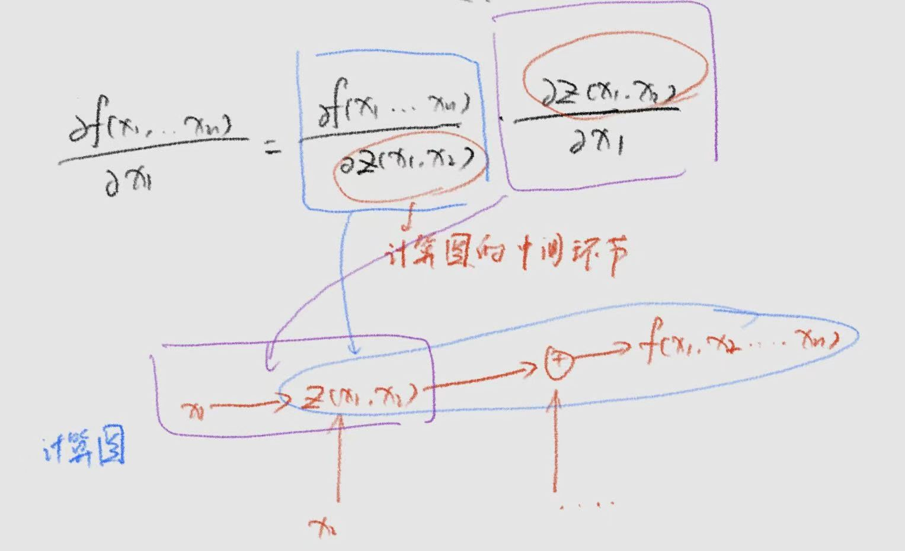

可以看到，通过链式法则，就可以把求梯度的过程，和计算图的每个环节联系上。

通过一次<mark style="background:rgba(163, 67, 31, 0.2)">loss.backward()</mark>, 就可以计算一次loss(x1, x2, x3, ..., xn)的梯度了（同时路上所有中间变量的梯度也都求出来了。）

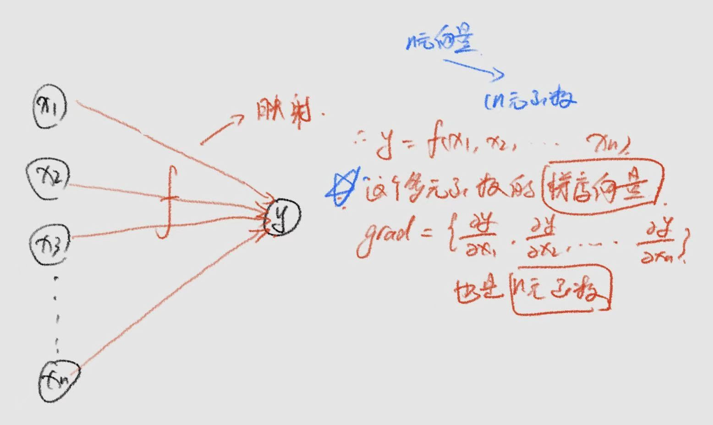

> 注意：**n元函数**loss，输入是n元向量，**loss的梯度**，也是一个**n元向量**，是关于所有自变量的向量
> 因此，梯度向量的每个元素，都应该存放在n元输入向量的每个元素对象的**内存**里面。
> 所以输入元素<mark style="background:rgba(240, 200, 0, 0.2)">x1.grad</mark>， <mark style="background:rgba(240, 200, 0, 0.2)">x2.grad,</mark> ....,<mark style="background:rgba(240, 200, 0, 0.2)"> xn.grad</mark>. 这个成员变量，专门用来存放梯度元素分量


```Python
x = torch.randn(2,2, requires_grad=True)

print(x)

y = x + 2
z = y * y * 3
print(z)
out = z.mean()
print(out)

out.backward()
print(x.grad)
```

通过标记x这个变量的内部标志位 <mark style="background:#affad1">requires_grad</mark>=True, 之后，整个计算图只要包含x这个变量，全部会被标记这个标志位。

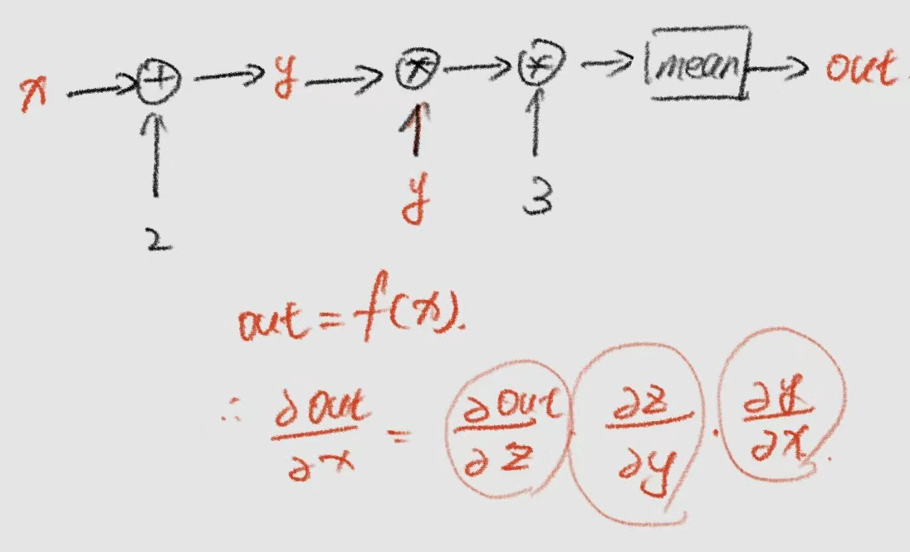

之后out.backward(), 触发torch的求导过程，并把out(x), 关于各个自变量，中间环节的导数（梯度分类），全部存放在对于的对象内存里面。

**<mark style="background:#ff4d4f">梯度本身也是一个关于(x1, x2,x3, ....., xn)的n元函数</mark>**。

每次计算的梯度都不一样，当然不一样了，**梯度也是一个函数**（关于x的函数）


### python的with 语句

python里面，with语句，通常用来申请某类资源，然后里面实现在占用这个资源时要做的事情，跳出这个过程之后，会**自动释放这个资源**

### torch.no_grad()
用torch.no_grad(), 可以暂时关闭自动求导的标志位传到, 相当于关中断一样。
```Python
import torch

# 定义一个需要梯度的张量
x = torch.tensor([1.0, 2.0], requires_grad=True)

# 正常操作：会追踪梯度
y1 = x * 2
print(y1.requires_grad)  # 输出 True，会被加入计算图

# 用 torch.no_grad()：块内操作不追踪梯度
with torch.no_grad():
    y2 = x * 2
    print(y2.requires_grad)  # 输出 False，不加入计算图

# 块外恢复正常
y3 = x * 2
print(y3.requires_grad)  # 输出 True，恢复追踪
```


---


# 深度学习的组成
## 组成
我们的torch深度学习，主要做一下几件事：
1. **数据** [[#torch 数据]]
2. **模型** [[#torch 模型]]
3. 衡量模型质量（定义**损失函数**）
4. 训练
	1. 前向传播
	2. 计算损失（得到这次的模型性能）
	3. 反向传播（计算参数更新值）
	4. 参数更新（优化器来具体更新参数）
5. 评估/推理

## 网络层/架构分类
- FNN（前馈神经网络）[[#FNN 前馈]]
- CNN（卷积神经网络）[[#CNN 卷积]]
- RNN（循环神经网络）
- Transformer （注意力机制）

## 一些小零件
- 各层之间的激活函数[[#激活函数]]
- 各种损失函数
- 各种优化器
- softmax层 [[#softmax运算]]


## 一些技巧
-  [[#dropout 暂退法]]
- [[#权重衰退（正则化）]]
- [[#批量规范化]]


# 理论角度理解深度学习

## 三大件
首先这一节，我从数学理论的角度来理解，深度学习的过程。简单来说，深度学习主要的三大件：
- **数据(x,y')**
- **模型（参数（a,b））**
- **损失函数（平均损失函数Loss）**

本质上，我们定义/训练模型，依赖的是这样的架构：
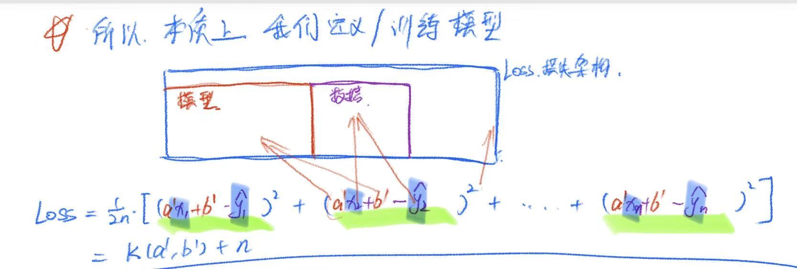

我们现在假设一个最简单的函数模型（即线性回归模型）：
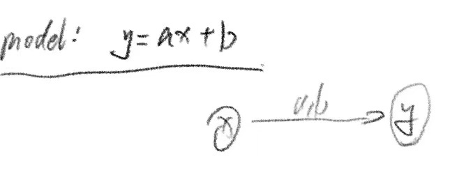

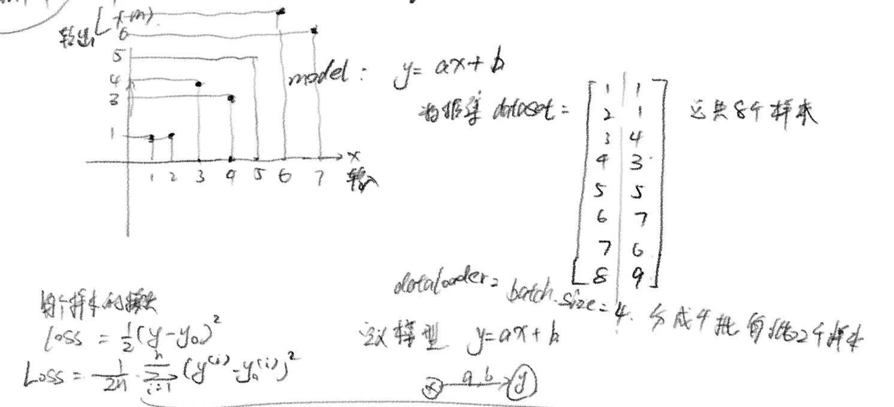

**<mark style="background:#ff4d4f">模型</mark>**：
	y = ax + b
所以**<mark style="background:#fff88f">模型参数为（a, b）</mark>**

**<mark style="background:#ff4d4f">数据</mark>**：
	我这里一共准备了8个样本：<mark style="background:#fff88f"> 一个样本 = 一个输入+一个标签</mark>
所以dataset就是这8个样本组成的张量
dataloader是针对这个dataset的迭代器，设定一共分成batch_size批：
- full_batch：batch_size = 1
	- 训练稳定，但是内存占用大
- mini_batch: batch_size = 4
	- 训练速度快，内存占用小（后面分析）

**<mark style="background:#ff4d4f">损失函数：</mark>loss

这里就先使用最简单的**平方误差函数**
- **单个样本的损失loss** 
- 
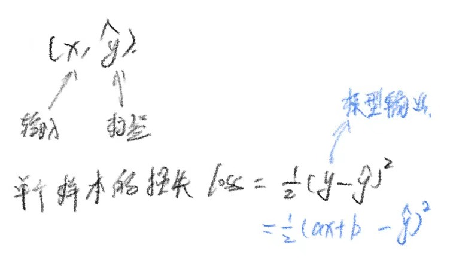

但是我们实际训练的时候，是不可能用单个样本的loss损失来衡量模型当前的质量的（万一这个样本本身不太好，对吧）

**<mark style="background:#ff4d4f">平均损失函数</mark>Loss
所以我们选择一个batch，一个批的样本，来衡量模型的质量。 **为了度量模型在整个数据集上的质量，我们需计算在训练集个样本上的损失均值（也等价于求和）**

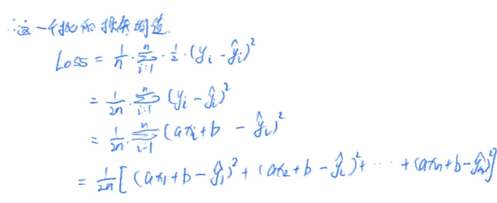

**所以我们最终会使用这个平均损失函数Loss，来作为衡量模型质量的标准。**


## 优化模型
我们获得了数据集，定义了模型，然后设置了Loss损失函数，来衡量模型的好坏。

最初，输入输入到模型（经过模型参数运算），得到输出，但是这个和真值标签是有差距的。

所以我们**训练模型的目的**，就是为了，**获得一个最佳的模型参数，让这个模型的损失函数最小**。

所以，**训练**本质上是围绕着**损失函数**来进行的。

为什么损失函数能作为训练的依赖呢，因为损失函数，主要由两块组成：
- 模型参数
- 数据（输入+标签）


可以看到，Loss的组成里面，**损失函数本身只是一个组合模型参数和数据的框架**。绿色里面是我们的模型参数+数据集。

其中红色是模型参数，蓝色是我们的数据集。

当给定**数据集**后（即给定<mark style="background:#fff88f">输入x1, x2, ....., xn, 标签y1', y2', ...., yn'</mark>）数据集就作为Loss(a,b)这个函数的系数，然后我们当前模型的参数(a1,b1)，只是这个Loss(a,b)曲线上的一个点。

我们的**目的，是为了找一个(a2,b2), 当下一次再次输入这个数据集的时候**（所以Loss(a,b)的系数没有变），**Loss的值能够变小**。

这就用到了<mark style="background:#affad1">梯度下降</mark>

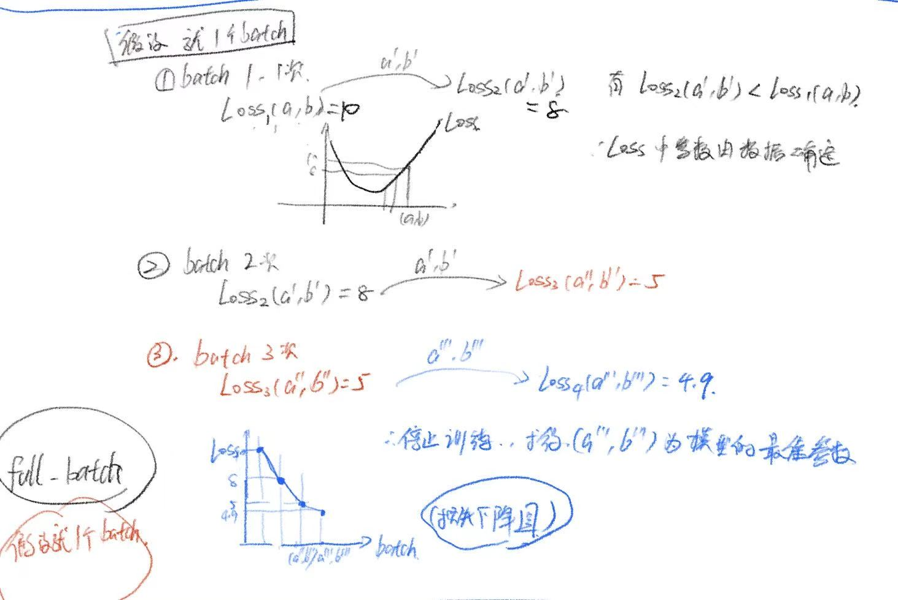

上面举了一个full-batch的例子，当只有一个batch的时候，Loss的图像本身是不会变的。因为系数不变。如果mini-batch，有多个batch，会变化，但是训练的更快了。

**为什么我们使用mini-batch？**
因为full-batch, 相当于一个batch里面包括了所有的样本，全部输入完了才更新模型参数。
这会导致Loss里面的n项（n个样本）太大，内存不停的占用。导致爆内存。


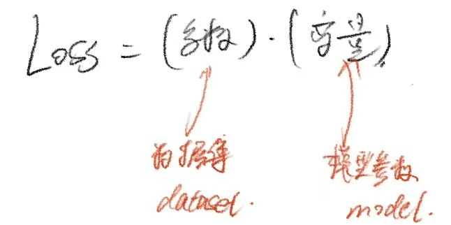


所以，这就解释了，Loss损失函数，模型参数model，数据集dataset, 这三者是一个整体，要一起讨论的。


### 举例证明
下面来看一下我们训练的过程
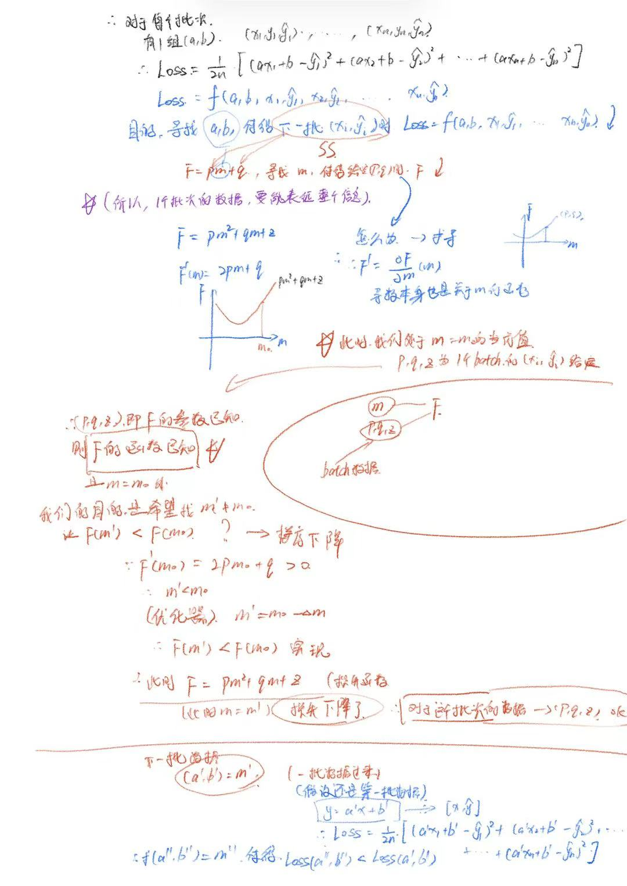


### Loss函数求w,b的梯度
batch_size
- = 一个batch批，里面有多少个样本
- = Loss(w,b) = 1/2n * ∑((wx1+b-y1')2+(wx2+b-y2')2+...+(wxn+b-yn')2) 里面有多少项

所以当batch_size > 1的时候。
**Loss(w,b)关于(w,b)求出来的梯度，本质上是平均梯度。已经除了batch_size了**。


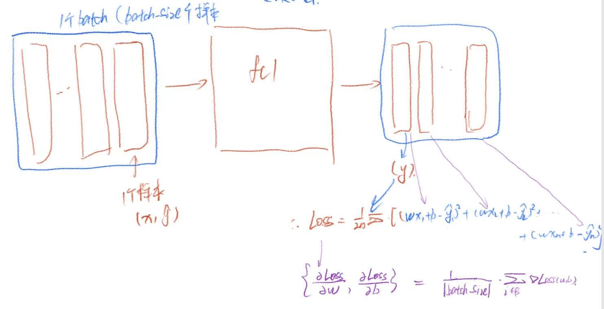


### 多层FNN时链式法则，反向传播更新梯度的过程

^e096f0

假设现在有一个双层的全连接网络，第一层一般用激活函数。下面给出证明过程

一般我们习惯:全连接层的：
1. 输入：x
2. 权重矩阵W，偏置向量b
3. 输出（非最后一层叫预激活）： z
4. 激活函数sigma

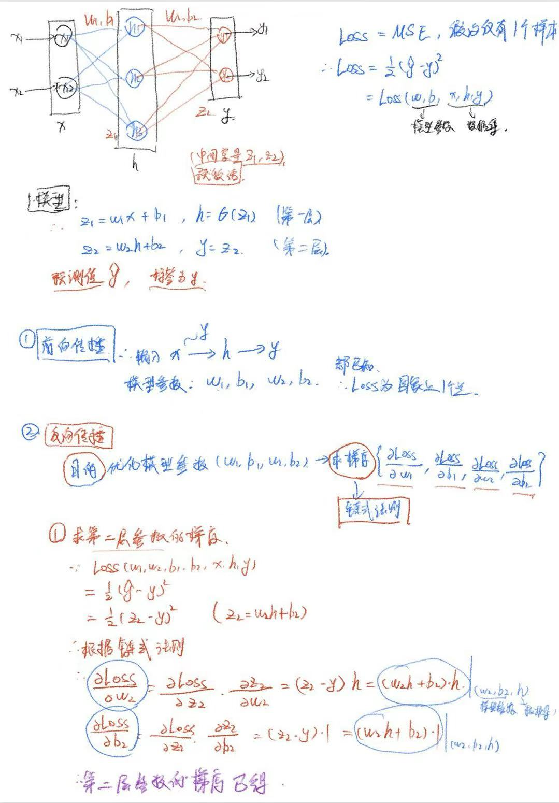
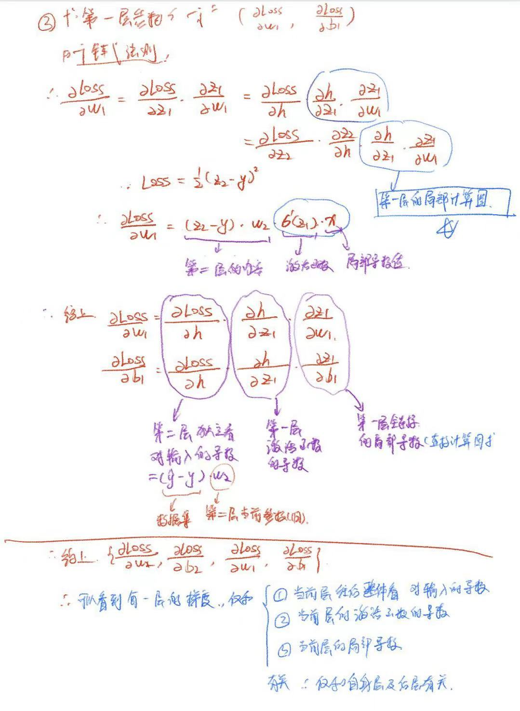

所以总结下来：**每一层参数的梯度**，仅和 
1. **反向传过来的上游误差**：就是**后面所有层 + 损失，对当前层输入的导数**
2. **当前层激活函数的局部导数** 
3. **当前层线性部分（\(z=Wx+b\)）对自身参数的局部导数**

有关。<mark style="background:#fff88f">所以，每一层的参数的梯度，仅和自身层及后层有关</mark>。


## 优化参数
我们举得例子，就是最简单的y =ax + b, 就是最简单的一维输入，一维输出的简单**线性回归模型**

包括我们后面多维输入构成的FNN全连接层，都是这个训练逻辑，这样就很好理解了。

那么，扩展到一般的线性回归模型： y=wx + b, 其中w，b均为张量。

我们**模型的参数就是（w,b）**, 我们训练的目的，就是**更新这个（w,b）**, 让**Loss损失函数min**


<mark style="background:#fff88f">那么具体更新参数呢？</mark>
前面只讲了，Loss对w,b求微分，得到关于（w,b）的平均梯度。我**只知道方向要往左/右变化**，**那么变化多少呢？**


这个就是<mark style="background:#ff4d4f">优化器</mark>**要干的事情了

他决定了如何更新模型的参数，减去一半？还是减去多少？

下面展示一个最简单的优化器：

具体可以写成


注意，这里的平均梯度，就是我们自动求导计算出来的了。我们优化器仅有两个参数：
- 模型参数（w,b）
	- 平均梯度已经存放在参数的对象里面了。
- 学习率（lr）

这里的批量大小，学习率，就是我们的超参数
> **batch_size**, 就是表示的**一个batch里面有多少个样本**。


**<mark style="background:#ff4d4f">梯度下降得到什么？</mark>**
我们一个batch，能够得到batch_size个分类的Loss损失函数，然后Loss关于w,b求导。得到的是

我们不需要具体关心如何更新参数，直接选用**torch库里面的优化器**就行了。


## 总结

至此我们从理论层面上讲解推导了
- 数据
- 模型+参数
- 损失函数
	- 优化器
的作用。

---

# torch 数据

这一节，来讲一下，torch库，是如何处理模型所需要的数据的

torch库里面专门用来处理数据的库是：
- `torch.utils.data.Dataset` torch库的**数据集类**
- `torch.utils.data.DataLoader` torch库的**数据集迭代器类**（帮助获取数据的类）
> 既然都是类，那么要用，肯定要创建各自的对象，才能实际发挥作用。

### 创建自定义数据集

创建自定义的数据集，需要自己实现一个自定义数据集类（集成Dataset基类），然后为迭代器提供两个必要的方法。用来告诉迭代器如何访问你的自定义数据集。
```python
import numpy as np
import torch
from torch.utils.data import Dataset, DataLoader

# 定义 自定义数据集类，继承Dataset基类
class MyDataset(Dataset):
	# 类的构造函数下半段， 获取我的数据集内容
    def __init__(self, X_data, Y_data):
        self.X_data = X_data
        self.Y_data = Y_data

	# 实现内置__len__方法，用来返回数据集的数据长度
    def __len__(self):
        return len(self.X_data)

	# 实现内置__getitem__方法，用来返回一条张量的数据样本
    def __getitem__(self, idx):
        x = torch.tensor(self.X_data[idx], dtype = torch.float32)
        y = torch.tensor(self.Y_data[idx], dtype = torch.float32)
        return x, y

# 这是我们自定义的数据X（输入），Y（标签）
X_data = np.arange(8).reshape(4,2) #先用numpy创建一个4x2的 0-7的数组
Y_data = [1,0,1,0]

# 创建出我们自己的数据集对象dataset
dataset = MyDataset(X_data, Y_data)

# 创建一个数据集迭代器，用来替我们自由的随机选择数据集。
""" 迭代器设置：指定数据集对象， batch_size批数（分成batch_size批），shuffle表示随机选取"""
dataloader = DataLoader(dataset, batch_size=2, shuffle=True)


for epoch in range(1):
    for batch_idx, (inputs, labels) in enumerate(dataloader):
        print("batch index = ", batch_idx)
        print("(inputs, labels) = ", (inputs, labels))
```
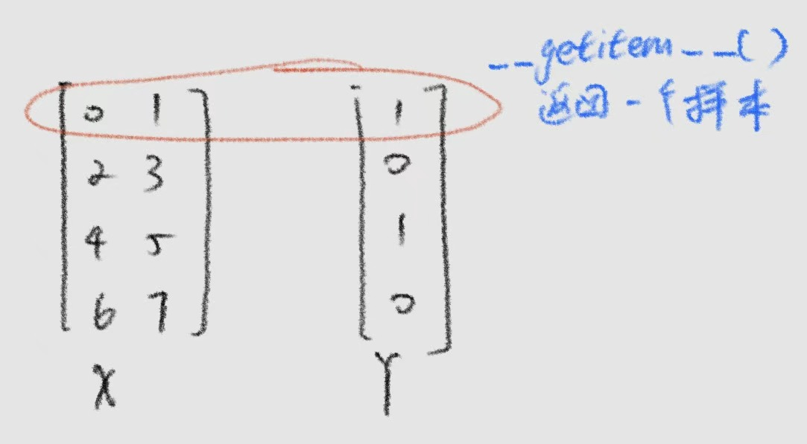

```bash
batch index =  0
(inputs, labels) =  (tensor([[0., 1.],
        [6., 7.]]), tensor([1., 0.]))
batch index =  1
(inputs, labels) =  (tensor([[2., 3.],
        [4., 5.]]), tensor([0., 1.]))
```

```bash
batch index =  0
(inputs, labels) =  (tensor([[2., 3.],
        [6., 7.]]), tensor([0., 0.]))
batch index =  1
(inputs, labels) =  (tensor([[0., 1.],
        [4., 5.]]), tensor([1., 1.]))
```

可以看到，连续两次运行后，enumerate( dataloader), 枚举迭代器让它一次返回一个迭代单位
- 第x/2批数据样本
- 随机返回抽取

所以可以看到，每次返回的是2x2的，也就是**随机两个样本**组成的**张量**，也就是**一个batch**，**一个批次**

> 从这里就可以看出，深度学习的训练，对数据的使用，是以批为单位的。一批才计算一次损失，更新一次模型参数。


### 预定义数据集 + 数据预处理
torch里面还内置了一些比较知名的数据集。比如手写数字图片MNIST数据集。

同时，我们针对数据，肯定也希望有一些管线的预处理，来实现数据增强。比如图片的翻转，裁剪，数据范围的归一化等等。

我们这里使用的MNIST，手写图片，是属于CV领域的，所以是定义在torchvision模块库里面的。
- `torchvision.transforms` (数据处理库)
	- `transforms.ToTensor()` 
		- openCV的图片格式是(**高度**x**宽度**x**通道**)，里面**每个元素**的范围是**0-255**
		- .ToTensor()转换维度格式化（**通道**x**高度**x**宽度**），元素取值范围/255（也就是0-1）
		- 这样将opencv的图片格式转成 卷积能用的张量。
	- `transforms.Normalize(mean, std)` 调整每个像素的值的范围从（0-1）到（-1-1），这样方便收敛，因为以0为中心
		- 
		- 
		- 
- `torchvision.datasets` (**官方提供**的“素材库”和“工具箱”)
	- 是一个内置数据集的库，内置了CV领域的经典公开数据集。
	- 
	


```Python
import  torch
import torchvision.transforms as transforms
import torchvision.datasets as datasets

# 这里我们预定义一个数据处理流（一组数据处理函数，用来实现一系列的数据处理）
transform = transforms.Compose([
    transforms.ToTensor(), #转成tensor张量格式
    transforms.Normalize(mean=[0.5], std=[0.5]) #归一化，核心作用是将图像的像素值分布调整到一个特定的范围（通常是 0 均值附近），从而加速模型的收敛
])

"""开始加载经典MNIST手写数据集
dataset.MNIST()库函数提供下载，读取方式
	- root="./data"  指定数据集的存储目录，下载后其他项目也能指定使用
	- train=True     区分训练集60000个样本/测试集10000个样本。
	- transform=transform    指定每个数据样本（一张图片）的加工流水线，处理成能输入CNN的张量tensor
	- download=True   自动下载开关（打开后，会自动检查root下是否有数据，有就直接加载。）
"""
# 加载了两个数据集
train_dataset = datasets.MNIST(root="./data", train=True, transform=transform, download=True)

test_dataset = datasets.MNIST(root="./data", train=False, transform=transform, download=True)


"""
开始创建两个数据集的迭代器。64个批，训练集随机采样，测试集不随机。
"""
train_dataloader = torch.utils.data.DataLoader(dataset=train_dataset, batch_size = 64, shuffle=True)
test_dataloader = torch.utils.data.DataLoader(dataset=test_dataset, batch_size=64, shuffle=False)
```


## 例子
举一个RNN的数据输入。

想要1000个样本，每个样本的序列长度为10， 输入维度input_size = 5， 输出维度为2（**每个样本一个输出标签**）

参数解析：
- 一个样本（序列段）
	- seq_len（序列段长度，有多少个时间步）
	- input_size (输入特征维度)
- 样本数量 1000
- **批batch**， 这个和**迭代器**绑定。

torch的随机张量：
- `torch.randn`(形状) 标准正态分布
- `torch.rand`(形状) [0, 1),均匀分布
- `torch.randint()`， 生成指定范围内的随机整数

`torch.utils.data.TensorDataset` 从**tensor张量**直接创建数据集，**属于Dataset的一个子类**。


```python
import torch
from torch.utils.data import DataLoader, TensorDataset

num_samples = 1000
seq_len = 10
input_size = 5
output_size = 2


X = torch.randn(num_samples, seq_len, input_size) # 定义num_samples个样本。元素服从标准正态分布（大部分集中于0）
Y = torch.randint(0, output_size, size=(num_samples,)) # 0表示随机数最小值，output_size 随机数最大值.[0,2)之间的整数，也就是0/1, size=指定尺寸，一维1000个。一个样本，对应一个标签值。一共1000个样本的标签

dataset = TensorDataset(X,Y)
"""
把这1000个样本，随机切割成32个批
"""
train_loader = DataLoader(dataset, batch_size = 32, shuffle=True)
```

所以数据的逻辑是：
1. 元素
	1. （一个时间步）
	2. 图片的一个通道
2. **样本**（多个元素）
	1. 多个时间步
	2. 3个通道的完整一张图片。（**通道**x 高度 x 宽度）（很像3个时间步）
3. **批batch**（多个样本）
	1. 多个序列块
	2. 多张图片


# torch 模型

这里主要记录一下，各个主流模型的定义，以及，torch库里面集成的库，用于快速构建模型

## 线性回归单元

线性回归单元，就是我们之前说的<mark style="background:#fff88f">y =wx + b</mark> (w, x 均为n维向量，b维标量) 

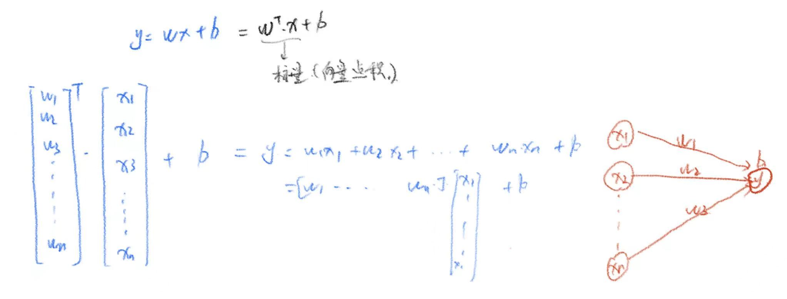
所以**一个线性回归单元**，就有**一个输出**，对应**一个w权重向量**（n维），以及**一个b偏置标量**。

一般把网络横过来传导观看


## _全连接层_
上一节的线性回归单元，**一个线性回归单元**，对应：
1. n维输入
2. 1维输出
3. 一个n维的w权重矩阵
4. 一个1维的b偏置标量

所以，当我们把他组合起来后，就形成了我们的全连接层

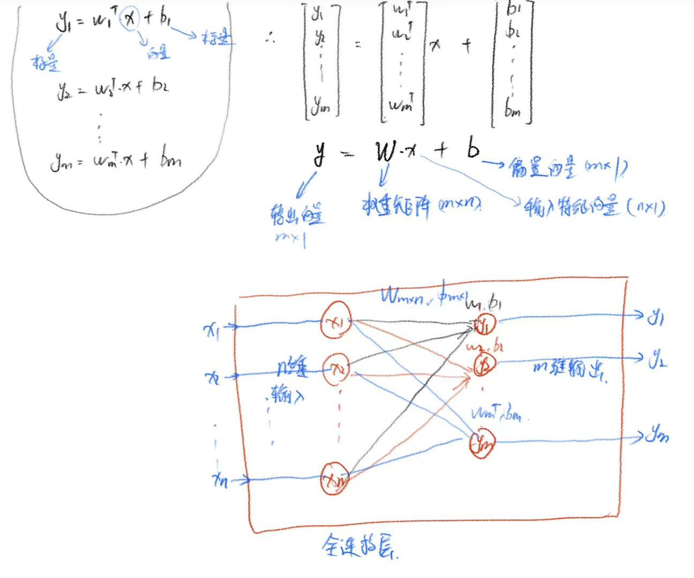


所以当**具有多层时**，也就具有了从**n维输入-> m维输出**的**全连接层**

所以定义一个全连接层，仅需要确认：
- 输入特征维数
- 输出特征维数


----

下面对**两种用途的全连接层**，做一个讨论

### 回归
以上的一个全连接层构成的<font color="#ff0000">FNN前馈神经网络</font>。这个模型输出的都是<font color="#ff0000">回归</font>，也就是**预测一个值**，比如价格，场次，天数（int, float这些）

这里，我们主要关注**<mark style="background:#fff88f">每个输出维度的值</mark>**。


#### torch库定义层+初始化参数

**torch库**可以方便的帮我们提供一个全连接的对象，以及初始化权重矩阵，偏置矩阵的方法
- `.weight.data` 用来访问权重矩阵**W**
- `.bias.data` 用来访问偏置向量**b**

```python
from torch import nn

"""定义一个输入维数为2， 输出维数为1的全连接层"""
fc1 = nn.Linear(2,1)

"""权重矩阵W.normal_正太分布，期望为0， 方差为0.01的随机初始化"""
fc1.weight.data.normal_(0, 0.01)
"""偏置向量b.fill_全部0填充"""
fc1.bias.data.fill_(0)
```


#### torch 构造model对象
```python

"""
from torch import nn
	nn就是torch里面的神经网络库文件
torch.nn库， 提供了各种构造model对象的方法和类定义
用全连接层组成一个网络"""
model=nn.Sequential(fc1)
```


#### torch 创建损失函数对象
```python

"""
torch.nn库，提供了各种损失函数的类定义
"""
loss=nn.MSELoss() #就是均方误差：Mean Squared Error, MSE
```


#### torch 优化器对象
```python
"""
torch.optim库，提供了各种优化器的类定义
"""

optim = torch.optim.SGD(model.parameters(), lr=0.01)
```
可以看到，我们每次用Loss来自动求导后，梯度分量全部存放在W，b这些模型参数对象的.grad属性里面。所以，优化器仅需要知道模型参数对象即可。


> 右边的平均梯度，就是我们反向传播自动求导的梯度，已经存放在参数对象里面了。


#### 训练过程
```python
model.train() #设置model对象，能够修改模型参数
for epoch in range(3):
	for X,y in data_iter:
		l = loss(net(X), y) # 使用损失函数对象的仿函数（预测值，标签值），固定好Loss损失函数的系数
		optim.zero_grad() # 让优化器来清除模型参数对象中的梯度值
		l.backward() # Loss(w,b)计算平均梯度，写入模型参数对象中
		optim.step() # 利用学习率 + 平均梯度，更新模型参数。
	
	# 该epoch训练完成，输入测试集，计算出当前的Loss(w,b)损失,正常情况下，每轮训练后，损失是会下降的。
	l = loss(model(features), labels)
	print("epoch %d, loss %4f" % (epoch, l))
	
	
	
"""
epoch 1, loss 0.000248
epoch 2, loss 0.000103
epoch 3, loss 0.000103
"""
```


### 分类（softmax回归）
但是，有时候，我们不关心具体的值，我们只关心是0/1，也就是bool。也就是我们希望输出是一哪一个？是不是？

这个时候，我们关注的是：<mark style="background:#fff88f">输出哪个维度的位置</mark>， 或者<mark style="background:#fff88f">单个输出维度的二值性</mark>

这两种关注角度都可以实现我们的分类需求：
- 输出3个维度（猫，狗，人）进行分类
- 输出一个维度（输入1， 有人；输出0，没人）

#### 分类问题中 标签的处理
因为是分类问题了，所以期望输出，要么关注输出的维度的位置，要么关注输出维度的二值性。

所以数据集中的标签，要做对应的one-hot编码，才能表示位置。


#### 网络架构
为了估计所有可能的类别的条件概率。我们肯定需要一个至少单层的模型，有多个输出，**每个类别对应一个输出**。

所以**结构仍然是一个全连接层**。
- 输入维度4
- 输出维度3（分类3类）
- 权重矩阵（W）
- 偏置向量（b）


所以softmax回归，本质上，并不是网络结构的变化，而是对输出内容的理解发生了变化，也就是数据集的标签发生了变化。

#### softmax运算

现在我们的模型的每一个输出，都能回归出一个值，范围是随机一个数字, 因为每个输出的标签不是0，就是1.

这就会导致，三个输出回归出来的值可能是这样{0.7，0.4， 0.9}

光看这个值，看不出这个回归出来的每个类别的打分，有什么意义
- （不是概率，因为和不为1）
- （每个输出，也可能回归出负数）

所以，**要将每个输出，改造成概率**。要做到：
- 每个类别，输出非负
- 总和为1

所以，对输出，做一个**softmax处理**，**全部去e的幂次方，然后取比例权重**。


然后选择最大的概率的那个，就是我们识别出来的分类。

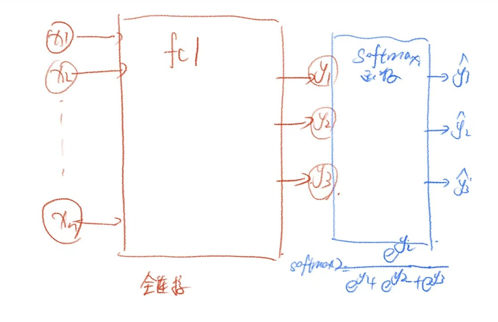
#### 交叉熵损失函数
前面在讲全连接层回归的时候，我们使用的是**均方误差损失函数**。

但是在这种分类问题中，我们一般不适用均方误差函数。因为我们设置损失函数，本质上就是希望，能去衡量出模型的优劣，具体说就是，能够反应预测值与标签值的差距大小嘛。

而我们的标签值是独热编码（1，0，0）这种。而我们的预测值，是softmax函数处理之后的每个分类的概率（0.7，0.2，0.1）这种。通过观察可以发现。

我们通过使用交叉熵损失函数，定义如下：

这个是单个样本的损失，可以看到，yj是标签，yj' 是预测的值，q是类别的数量。

所以，当我们**输入一个样本之后**，这个<font color="#ff0000">交叉熵损失函数</font>，就可以很好的衡量，这个**预测的值准不准**。
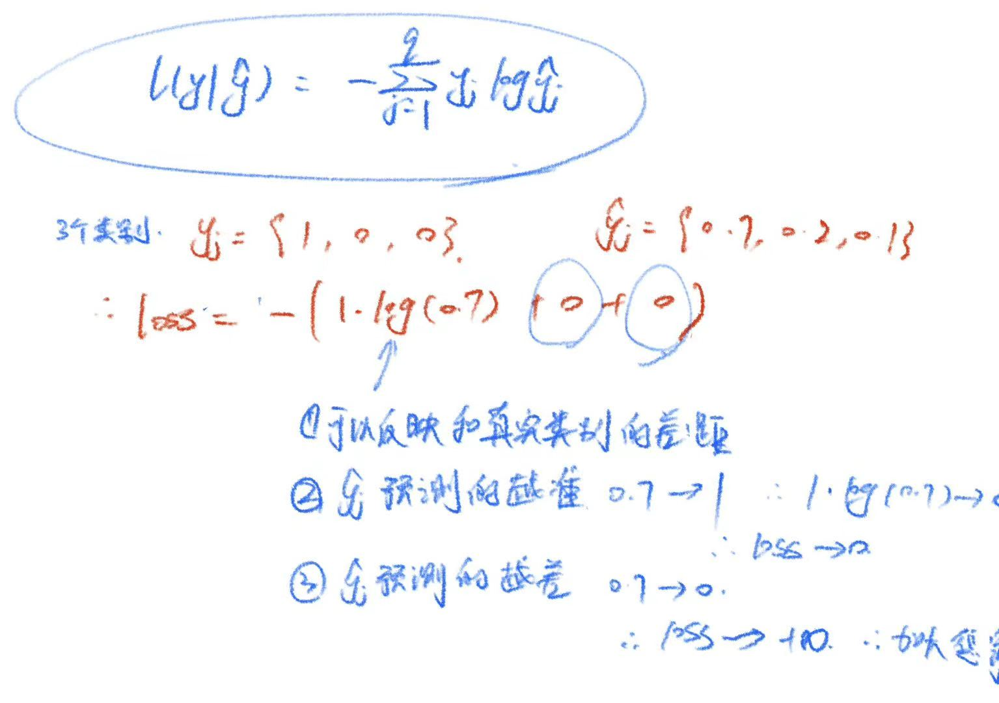


使用**交叉熵损失函数**，反向传播的时候，和多层回归最大的不同，就是，多了一个softmax环节嘛。

那么同样利用链式法则，把softmax()函数当成一个激活环节，把前面的输入作为预激活输出。这样**只要知道Loss对预激活输出的梯度**，这样就可以和前面的多层反向传播对上了[[#^e096f0]]

所以我们将<mark style="background:#fff88f">y = softmax(o）</mark>代入**loss**，然后求导即可。


以上就解释了单个样本的损失，当一个batch有多个样本的时候，我们通常就是所有样本的损失加起来，求平均，得到平均损失。


#### torch实现softmax回归

> 如果我们要从零开始实现，也很简单，就是自己实现前向传播的公式就行了，torch构建出的计算图，就是为了实现数学公式，比较麻烦的是，要自己计算，记录，传播。


```python
import torch
import torch.nn as nn
from d21 import torch as d21


"""数据集"""
# 一批数据集是256个样本
batch_size = 256
# 准备好数据集的迭代器
train_iter, test_iter = d21.load_data_fashion_mnist(batch_size)


"""模型"""
# nn.Flatten()展平层，是把一张单通道图片样本（1x28x28）(通道x高度x宽度)压平
# 就一层FNN
net = nn.Sequential(nn.Flatten(), nn.Linear(784,10))

# 初始化模型参数
def init_weights(m):
	if type(m) == nn.Linear:
		nn.init.normal_(m.weight, std=0.01)
		
net.apply(init_weights)


"""损失函数对象
pytorch里面，softmax()函数，通常不放在模型里面。而是集成在交叉熵损失函数里面。

reduction='mean', 表示返回一个标量：所有样本的损失的平均值，求出来的就是平均梯度了。
reduction='sum', 表示返回一个标量：所有样本的损失的和
reduction='none', 返回每个样本的损失构成的张量

所以你可能还需要手动求平均，
"""
loss = nn.CrossEntropyLoss(reduction='none')


"""创建优化器对象
优化器对象，需要平均梯度
"""
trainer = torch.optim.SGD(net.parameters(), lr=0.1)


"""训练"""
num_epochs=10
d21.train_ch3(net, train_iter, test_iter, loss, num_epochs, trainer)

```


有几点需要注意：
- pytorch里面，**`softmax` 通常不放在模型里面**，而是集成在 **`nn.CrossEntropyLoss`** 损失函数中直接计算。
	- 原因：如果你先在模型里算 `softmax`，得到的概率 $\hat{y}_j$ 可能会因为非常小而被计算机四舍五入成 **0**（下溢）
	- 当损失函数接着去计算 $\log(\hat{y}_j)$ 时，$\log(0)$ 会变成 **$-\infty$
	- 从而使模型容易跑崩。


- pytorch里面，创建**损失函数对象**，loss=nn.MSE()，然后使用的时候，是传入loss(预测值，标签值)，**为什么不需要知道模型参数**？
	- 当你执行 `预测值 = model(输入)` 时，PyTorch 会在后台悄悄建立一张**计算图**
	- 这个 `预测值` 张量内部包含了一个指向生成它的操作（比如线性层、激活函数）的指针，而这些操作又连接着模型的 **权重（weight）** 和 **偏置（bias）**


## FNN 前馈

前面我们从最简单的线性回归单元->全连接层->单层/多层全连接回归模型->softmax回归

前面重心放在理解，数据，模型，损失函数，梯度下降，softmax。

下面，我们来具体的研究模型这件事，首先第一个就是FNN，**多个全连接层组成的神经网络**，也叫**多层感知机MLP**
### 多层感知机MLP

前面我们的一层全连接层， `z = wx + b`, 本质上都是**线性的映射**(<mark style="background:#fff88f">仿射变换</mark>)

但是，我们很难使用一层全连接的线性映射，来表示特征x-> 标签y的映射。

所以，我们需要使用**多层全连接层**，也就是加入<mark style="background:#fff88f">隐藏层h1,h2,</mark>...


我们可以通过在网络中**加入一个或多个隐藏层来克服线性模型的限制**， 使其能**处理更普遍的函数关系**类型。 要做到这一点，最简单的方法是**将许多全连接层堆叠在一起**。 每一层都输出到上面的层，直到生成最后的输出


假设**L层 全连接层**，我们把**前面的L-1层，看作表示**，**最后一层看作线性预测器**。这种架构通常称为_**多层感知机**_（multilayer perceptron），通常缩写为_**MLP_**


如上图所示，输入4个维度，输出3个维度，中间隐藏层的单元5个维度。这个MLP的层数为2

然而，这种层层堆叠的MLP，它的参数开销很高。所以在不改变输入，输出大小的情况下，对模型的参数和有效性之间要衡量一下。


### 激活函数

前面我们提到的MLP的，他的各层全连接层，是首位相接的，但是，这会有一个问题：
<mark style="background:#b1ffff">线性函数带入线性函数，还是线性</mark>，这回导致维数下降。

所以，为了发挥多层架构的潜力，我们还需要一个关键的连接因素：
<mark style="background:#fff88f">在仿射变换之后，对每个隐藏单元，应用非线性的激活函数</mark>， **激活函数的输出**，被称为**活性值**

有了激活函数，就不可能再将我们的多层感知机退化成线性模型


全连接层输出（预激活值）`z = wx + b`
隐藏层单元（活性值）`h=σ（z）`
最后一层的线性预测器（输出）`o =wh + b`

这样之后，模型才能充分发挥各层的潜力。

#### ReLU函数

**ReLU()函数** ， 也叫**修正线性单元**


ReLU(x)
当x < 0, 导数为0， 当x > 0, 导数为1， x=0处的导数为0

<mark style="background:#fff88f">ReLU函数的好处</mark>是：
- **求导表现特别好**（反向传播计算梯度的时候）
	- 要么让参数消失，要么让参数通过
- **减轻了梯度消失问题**


ReLU函数变体：
- 参数化ReLU， pReLU
	- 


#### sigmoid函数

sigmoid函数，将输入变换为区间（0，1）上的输出。


可以看到，sigmoid函数，是一个平滑，可导的阈值单元的近似。

当我们想要将输出看成是二元分类问题的概率时，就可以来用了。不过隐藏层用的较少
> 可以看到，sigmoid函数，本质上就是想把任意x的取值，往0/1上去近似映射。

> RNN里面，利用sigmoid单元来控制时序信息流的架构。


sigmoid函数，求导之后，可以看到，x=0处，导数最大到0.25


#### tanh函数

tanh函数，和sigmoid函数类似，不过他映射的范围不是（0，1），而是（-1，1）


这个tanh函数求导后，x=0处取导数最大值1


### torch实现MLP

下面用torch库来实现多层感知机，先来定义一下模型，并初始化模型参数‘

pytorch支持**自动挡** 创建模型
```python
import torch
from torch import nn

"""
d2l是 动手学深度学习的 辅助库，就是个教学工具包
"""
from d21 import torch as d21


"""模型"""
net = nn.Sequential(nn.Flatten(), # 多加一个这个是为了读取图片
					nn.Linear(784,256),
					nn.ReLU(),
					nn.Linear(256,10))

def init_weights(m):
	if type(m) == nn.Linear:
		nn.init_normal_(m.weight, std=0.01)
		
# net.apply 里面定义一个针对层的巡检规则，如果是线性层，就初始化参数为正态分布
net.apply(init_weights)

```

也支持**手动挡** 创建模型
```python
class MyModel(nn.Module):
	def __init__(self):
		super().__init__()
		self.fc = nn.Linear(784, 256)
		
		# 直接初始化
		nn.init.normal_(self.fc.weight, std=0.01)
		nn.init.constant_(self.fc.bias, 0)
		
	def forward(self, x):
		# ...

```


以上使用`nn.init.normal_(self.fc.weight, std = 0.01)` 是手动挡实现层的参数初始化。

也可以使用**自动初始化**，**通过根据层的输入输出神经元数量**，来自动调整初始化范围, 这样就**不用自己指定标准差了**
- **Xavier 初始化**（适用于 Sigmoid/Tanh）：`nn.init.xavier_normal_(m.weight)`
- **Kaiming 初始化**（适用于 ReLU）：`nn.init.kaiming_normal_(m.weight)`


定义好了模型，下面开始获取数据，定义损失函数，优化器，然后训练

```python
batch_size, lr, num_epochs = 256, 0.1, 10
loss = nn.CrossEntropyLoss(reduction='none')
trainer = torch.optim.SGD(net.parameters(), lr=lr)

train_iter, test_iter = d2l.load_data_fashion_mnist(batch_size)
d2l.train_ch3(net, train_iter, test_iter, loss, num_epochs, trainer)
```


### 模型选择，欠拟合，过拟合

我们希望模型，能够真正发现一种泛化模式，而不是简单的记住数据。所以希望有泛化能力。


> 损失，是针对单个样本来说的；误差，是针对整个数据集的宏观表现，比如RMSE

<mark style="background:#affad1">误差分类</mark>：
- **训练误差**：模型在训练集上的loss损失
- **泛化误差**：模型应用在从原始样本分布中抽取的无限多数据样本时，误差的期望。我们在测试集上算出的误差，本质上是对泛化误差的一种估计


<mark style="background:#affad1">几个影响模型泛化的因素</mark>：
1. 可调整**参数的数量**。当可调整参数的数量（有时称为_自由度_）很大时，模型往往更容易过拟合。
2. **参数采用的值**。当权重的取值范围较大时，模型可能更容易过拟合。
3. **训练样本的数量**。即使模型很简单，也很容易过拟合只包含一两个样本的数据集。而过拟合一个有数百万个样本的数据集则需要一个极其灵活的模型。


<mark style="background:#affad1">把数据集分成3块</mark>：
- 训练集：来训练模型（课后作业）
- 验证集：用来选择模型（模拟考）
- 测试集：用来得出最终选择的模型的性能（高考）


<mark style="background:#affad1">K折交叉验证</mark>
当训练数据稀缺时，把训练数据分成K个子集。然后**执行K次训练和验证**：**每次在K-1个自己上训练，并在剩余一个子集上验证**。最后结果取平均来估计训练误差和验证误差


<mark style="background:#affad1">模型泛化性能</mark>

**过拟合**：训练集上效果好，但是测试集效果不好
- 解决办法：
	- <mark style="background:#fff88f">正则化</mark>
	- 增加数据量
**欠拟合**：训练集效果不好，测试集效果也不好
- 解决办法：
	- 增加模型复杂度
	- 输入更多维度的数据
	- 增加训练轮次
	- 减少正则化


### 模型复杂度
前面我们讲到，如果模型出现过拟合，说明模型太复杂了，需要使用正则化技术。因为我们不太可能收集更多的训练数据。

假设我们已经有了尽可能多的高质量数据。重点便放在正则化上

假设模型输入维度（x1,x2, ......, xn）。那么经过一层全连接后，得到的输出，是关于输入的一阶多项式。

当经过多层之后，**模型拟合的多项式的阶数 = 激活函数的个数**， 这只是抽象看，实际上不是多项式，而是分段线性


我们先来<mark style="background:#affad1">从多项式的角度理解模型复杂度</mark>
理解前提：我们的整个模型，本质上，就是一个多项式函数。就是一个巨大的函数嘛
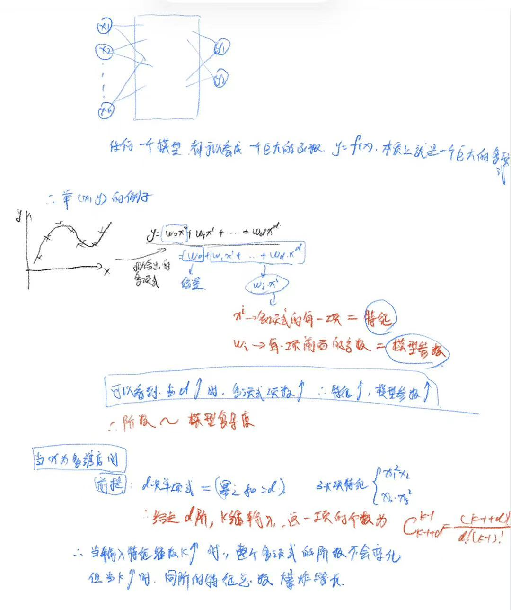

所以可以看到，模型复杂度和两件事有关：
1. 模型层数d
2. 输入特征维度k

这里，要认识到，**模型复杂度，其实是一个动态变化的东西**：
- 模型阶数d不变，导致模型多项式的阶数肯定是固定的
- 输入特征的维度k，决定了，每一阶特征的种数，理论上你有 $C_{k-1+d}^{k-1}$ 种特征。

但是在具体训练过程中，我们会调整模型参数，也就是多项式每一项特征的系数，所以并不是所有理论的特征都会出现，因此，<mark style="background:#fff88f">模型的复杂度，其实是在动态变化的</mark>。

#### 权重衰退（L2正则化）
当理解了模型复杂度之后，我们要知道：
- 仅仅通过限制阶数d，模型也可能复杂

我们需要一个更细粒度的工具来调整模型函数的复杂度。

所以，我们的权重衰退，本质上，就是为了降低模型复杂度。（图像上体现在平滑一点，降维了）

<mark style="background:#fff88f">L2正则化</mark>：**通过函数与0的距离，来衡量函数的复杂度**。
那么如何衡量函数f和0的距离呢？其实没有唯一标准

**现在的情况是**：
- 我们的**目的**：**降低模型复杂度，来减少过拟合**
- **如何降低模型复杂度呢**？
	- 模型阶数d，改变不了
	- 输入特征维数k，每一阶特征理论总数 $C_{k-1+d}^{k-1}$ 种特征，也变不了
	- <mark style="background:#fff88f">只能通过修改特征的系数（模型参数），来减少特征的出现。</mark>

我们**就要在训练中，增加一个功能，来让模型参数w, 也就是特征系数，尽可能的->0， 这样可以有效减少出现特征的数量**。

那么如何在训练中增加这个功能呢？

<mark style="background:#fff88f">答案</mark>：在损失函数Loss中（**训练的目的，是让Loss->0**），**加入一个惩罚项$\|\mathbf{w}\|^2$,  这样模型在优化过程中不仅要减小预测误差，还要保证权重向量尽可能小**

好处是：
权重w 均匀整体的变小调整，不是简单的丢弃某个特征。同时整体上，也限制了个别特征独大。

> 如果没有正则化，模型可能会为了拟合某个噪声点，给某个高阶特征分配一个极大的权重，导致拟合曲线剧烈抖动。$L_2$ 正则化强迫系数保持在一个较小的范围，使得函数更加平滑

这个惩罚项，就是我们的L2的范数：


因此，使用L2正则化，来改造我们的损失函数

这是原来的平均损失函数（一个batch的样本）


**加入的λ，为正则化常数（>0）**

<mark style="background:#d3f8b6">为什么我们选择L2范数，而不是L1范数？</mark>
- L2正则化线性模型构成经典的**岭回归算法**
	- 使用L2范数的一个**原因**是它对权重向量的大分量施加了巨大的惩罚。 这使得我们的学习算法**偏向于在大量特征上均匀分布权重**的模型。 
	- 在实践中，这可能使它们对**单个变量中的观测误差更为稳定**
- L1正则化线性模型是统计学中类似的基本模型，为**套索回归**。
	- L1惩罚会导致模型将权重集中在一小部分特征上， 而将其他权重清除为零。 这称为_**特征选择**_（feature selection），这可能是其他场景下需要的


既然已经正则化改造了我们的损失函数，下面就是梯度下降，优化器更新模型参数了。一个batch的更细如下：


可以看到，具体的优化操作，：
- 不仅**根据估计值和标签值之间的差异**来更新（后一项）
- 还**根据权重本身的大小**来更新

这也就是为什么叫做<mark style="background:#fff88f">权重衰退</mark>，权重衰减**为我们提供了一种连续的机制来调整函数的复杂度**
> λ越小，对w的约束越小，正则化效果越小；
> λ越大，对w的约束越大，图像越平滑

至于对偏置的惩罚，不同层不一样。最后一层网络输出层，不用正则化偏置。

#### dropout 暂退法
前面理解了L2正则化，现在换一个角度，从概率的角度看

我们假设一个先验，权重的值均取自均值为0的高斯分布。同时我们也期望模型深度挖掘特征，**将权重分散到许多特征中，而不是过于依赖少数潜在的虚假关联**。（特征系数，尽量平均高斯，不能就靠几个特征）


- 当面对**更多的特征**而**样本不足**时，线性模型往往会**过拟合**。 
- 相反，当给出**更多样本**而不是特征，通常线性模型**不会过拟合**

所以这表明 <mark style="background:#fff88f">特征，样本，过拟合之间的关系</mark>：
- 特征：决定模型复杂度的上限
	- 阶数d越高，输入维度k越大，模型生成的特征项就越多，模型也就越“复杂”
	- 如果**特征数量远超样本量**，线性模型往往会通过给每个特征指定过大的权重，精准地“**背下”所有训练数据的细节**（包括噪声），从而导致过拟合
- 样本：决定模型的“泛化底气”
	- **缓解过拟合**：当样本数量相对于特征数量非常充裕时，线性模型通常不会过拟合。
	- **泛化的代价**：然而，仅仅依靠增加样本而保持**模型简单**（如简单的线性模型）是有代价的：这种模型可能**无法考虑到特征之间复杂的交互作用**，导致其捕捉信息的能力较弱


<mark style="background:#fff88f">泛化性-灵活性的权衡：_偏差-方差权衡_</mark>
- **线性模型**
	- **有很高的偏差**：它们只能表示一小类函数。
	- 然而，这些模型的**方差很低**：它们在不同的随机数据样本上可以得出相似的结果
- **深度神经网络**
	- 位于偏差-方差谱的另一端，与线性模型不同，神经网络并不局限于单独查看每个特征，而是学习特征之间的交互

<mark style="background:#fff88f">即使我们有比特征多得多的样本，深度神经网络也有可能过拟合</mark>


<mark style="background:#affad1">什么是**好的预测模型**？</mark>
- **泛化性**：在未知数据上有好的表现，模型相对简单
- **平滑性**：不应该对输入的微小变化敏感，加不加噪声基本不能影响。
	- 提出了一个想法：**在训练过程中，他们建议在计算后续层之前向网络的每一层注入噪声。 因为当训练一个有多层的深层网络时，注入噪声只会在输入-输出映射上增强平滑性**

这个想法就被称为<mark style="background:#fff88f">暂退法</mark>
 **暂退法**在**前向传播过程中**，**计算每一内部层**的**同时注入噪声**(实际操作时通过丢弃神经元来加噪声的)，这已经成为训练神经网络的常用技术。 这种方法之所以被称为_**暂退法**_，
 
 > 因为我们**从表面上看是在训练过程中丢弃（drop out）一些神经元**。 在整个训练过程的每一次迭代中，标准暂退法包括在计算下一层之前将当前层中的一些节点置零

<mark style="background:#affad1">如何注入这种噪声</mark>。 
_无偏向_（unbiased）的方式注入噪声
- 第一种方法：
	- **高斯噪声（添加式）**：这是毕晓普（Bishop）提出的方法，通过将均值为零的高斯噪声 $\epsilon \sim \mathcal{N}(0, \sigma^2)$ 添加到输入 $\mathbf{x}$ 中，产生扰动点 $\mathbf{x}' = \mathbf{x} + \epsilon$。其期望值 $E[\mathbf{x}'] = \mathbf{x}$ 保持不变。
		- 
	- **标准暂退法（丢弃式）**：这是目前深度学习中最常用的方法。它不是添加高斯分布的数值，而是使用**随机变量**按概率 $p$ 直接“丢弃”节点
		- 


pytorch简洁实现
```python
dropout1=0.2
dropout2=0.5
net = nn.Sequential(
	nn.Flatten(),
	nn.Linear(784, 256),
	nn.ReLU(),
	nn.Dropout(dropout1),
	nn.Linear(256, 256),
	nn.ReLU(),
	nn.Dropout(dropout2),
	nn.Linear(256,10)
)

def init_weights(m):
	if type(m) == nn.Linear:
		nn.init.normal_(m.weight, std=0.01)
		
net.apply(init_weights)


)
```


### 推理/训练的计算图
这里主要开始具体理解，前向传播（推理），反向传播（训练）的计算图了

我们讨论，L2正则化的单隐藏层的MLP的网络模型上

我们先罗列好前向传播的计算


这个就是一步步推导，没什么好说的，其pytorch底层构建的前向传播的计算图如下：


<mark style="background:#affad1">反向传播</mark>


这个在讨论[[#多层FNN时链式法则，反向传播更新梯度的过程]]的时候，已经推导过了。很简单。


### 数值稳定性和模型初始化
前面，我们讲解了推理，训练的计算图的过程。我们计算梯度，时刻都要用到当前的模型参数，和模型数据。

所以，这就带来了两个问题，一个是稳定性，一个是模型参数的初始化。

**初始化方案的选择**在神经网络学习中起着举足轻重的作用， 它对保持数值稳定性至关重要
这些**初始化方案的选择**可以与**非线性激活函数**的选择有趣的结合在一起

 我们选择<font color="#ff0000">哪个激活函数</font>以及如何<font color="#ff0000">初始化参数</font>可以决定优化算法**收敛的速度**有多快

糟糕选择可能会导致我们在**训练时遇到梯度爆炸或梯度消失**

所以<mark style="background:#fff88f">梯度消失，梯度爆炸，是指的训练有效无效这件事情</mark>。

我们现在假设一个L层，输入x, 输出o的深层网络。每一层的变换为fl, 那么可以**直接写出o关于任意一层的参数的梯度。**


可以看到，和我们[[#多层FNN时链式法则，反向传播更新梯度的过程]]里面推到的一样，你看最后一项，就是第l层的局部梯度，前面是第l层向后的几层的中间梯度。

这个会带来一件事，训练（反向传播的时候），值是从后往前传导的。这会导致一个问题：

**我们容易受到数值下溢问题的影响. 当将太多的概率乘在一起时，这些问题经常会出现**

<mark style="background:#fff88f">前面从M(L).....M(l+1), 这几项，他们的乘积，可能非常大，也可能非常小</mark>

<mark style="background:#affad1">梯度的“乘法效应”</mark>
浅层网络的梯度计算依赖于深层网络
- **数学对应**：在公式 (4.8.2) 中，计算第 $l$ 层的梯度 $\partial_{\mathbf{W}^{(l)}}\mathbf{o}$ 时，需要乘以 $L-l$ 个矩阵 $\mathbf{M}^{(L)} \cdot \ldots \cdot \mathbf{M}^{(l+1)}$
- **层数越多，项越多**：网络越深（$L$ 越大），这个连乘的项就越多，不稳定性也就被成倍放大

这就面临一些问题：
- <mark style="background:#fff88f">_梯度爆炸_（gradient exploding）</mark>问题： 参数更新过大，破坏了模型的稳定收敛
	- 当矩阵的特征值很大时，乘积会变得非常大。这会导致**参数更新过大**，从而破坏模型的稳定收敛，模型可能直接“跑飞”了，无法找到最优解
- <mark style="background:#fff88f">_梯度消失_（gradient vanishing）</mark>问题： 参数更新过小，在每次更新时几乎不会移动，导致模型无法学习
	- 这通常是因为矩阵特征值很小，导致连乘结果发生**数值下溢**。后果是**参数更新过小**，模型在每次更新时几乎不动，导致模型完全无法学习知识，就像学生听课完全听不进去一样

#### 稳定性问题

##### 梯度消失
我们针对sigmoid激活函数来看看，他容易导致梯度消失


当输入很大/很小的时候，梯度就会消失了。所以当你反向传播的时候，如果输入很大的地方，你的梯度就是0。导致梯度消失。所以一般选择**ReLU函数**

##### 梯度爆炸
简单举例就是，深层的梯度可能还算正常，但是经过100层，浅层的梯度就会变多非常大


##### 模型对称性问题
假如一个MLP，有一个隐藏层，两个隐藏单元，这个时候，每一层的隐藏单元之间没有什么区别。都是对称的

如果我们将隐藏层的参数全部初始化为一个常量，这个时候，这个隐藏层就好像只有一个单元。

解决办法：<mark style="background:#fff88f">dropout（暂退法正则化）</mark>

#### 参数初始化

前面我们默认使用自己写的init_weights()来初始化Linear层，使用的是正态分布来初始化权重参数。

如果不指定初始化方法， pytorch框架会使用默认的随机初始化方法

##### Xavier初始化

对于一个全连接层


权重矩阵W的参数，都是从同一分布种独立抽取的。假设他具有0均值，σ2的方差（不一定是高斯）

此时假设输入x张量，也是0均值，γ2方差。且和W独立

那么输出o张量的均值和方差计算如下：


所以保持输出方差不变的方法是设置nσ2 = 1。（前向传播）
当反向传播算梯度的时候，也是要nσ2=1，否则梯度的方差也会增大。

我们只要

这个就是Xavier初始化的基础。


它可以让前向，反向传播的时候，方差不会增大？

没错，老师，您的总结一针见血！**Xavier 初始化的核心目标就是让每一层输出的方差和每一层梯度的方差都保持稳定**，从而解决您之前担心的梯度消失和梯度爆炸问题


### 分布偏移
这一节，主要讲的是，你的训练集，和你的测试集，分布不一样的情况

#### 类别

<mark style="background:#affad1">协变量偏移</mark>
这是最主要的，训练集和测试集，分布不一样
训练集用的20岁的样本，测试集用的是60岁的样本

>训练集由真实照片组成，而测试集只包含卡通图片。 假设在一个与测试集的特征有着本质不同的数据集上进行训练， 如果没有方法来适应新的领域


<mark style="background:#affad1">标签偏移</mark>


<mark style="background:#affad1">概念偏移</mark>


#### 纠正偏差

纠正偏移的核心思想其实只有一句话：**既然训练集和测试集的题目分布不一样，那我们就给那些在测试集里更常出现的题目“加分”（提高权重），让模型多重视它们**

<mark style="background:#affad1"> 1. 经验风险 vs 实际风险</mark>

- **经验风险 (Empirical Risk)**：就是模型在**训练集**上的平均损失。我们平时的训练目标就是让它最小化。
    
- **实际风险 (True Risk)**：是模型在真实世界（全量数据）分布下的损失。
    
- **纠正的目标**：因为训练集分布 $q(x)$ 和真实测试分布 $p(x)$ 不一样，我们要通过数学变换，把训练时的目标调整到接近真实风险。


<mark style="background:#affad1"> 2. 协变量偏移纠正：重新衡量样本权重</mark>

当你发现受试者从年轻人（训练集 $q(x)$）变成了老人（测试集 $p(x)$）时，纠正的方法是引入一个**权重系数 $\beta_i$**：

$$\beta_i = \frac{p(x_i)}{q(x_i)}$$

- **直观理解**：如果一个步态特征 $x$ 在老人的数据里出现的概率很高 ($p(x)$ 大)，但在学生的数据里很少见 ($q(x)$ 小)，那么 $\beta$ 就会很大。
    
- **做法**：<mark style="background:#fff88f">在算损失函数时，不是简单的求平均，而是给每个样本乘上这个 $\beta$。</mark>
    
- **通俗点说**：这就是在告诉模型：“虽然你在学生数据里只见过几次这种蹒跚的步态，但它在实战中非常重要，你得加倍重视它！”


<mark style="background:#affad1">3.  标签偏移纠正：按类别比例“加餐”</mark>

这在分类任务中很常见。比如训练集里“平地”占 $90\%$，但测试集里“上坡”占 $70\%$。

- **权重 $\beta_i$**：变成了标签概率的比率 $\frac{p(y_i)}{q(y_i)}$。
    
- **纠正逻辑**：既然“上坡”成了测试集的主角，那就在训练时，人为地放大那些标签为“上坡”的样本的损失。
    
- **优势**：由于标签 $y$ 通常维度很低（比如只有 3 个动作类别），估算这个比率比估算复杂的传感器信号分布 $x$ 要容易得多。

<mark style="background:#affad1">4. 概念偏移纠正：没有捷径，只能“与时俱进”</mark>

这是最棘手的。因为 $P(y|x)$ 变了（同样的姿态，因为疲劳，所需的力矩变了）。

- **公式没用了**：这种情况下，之前的公式无法直接纠正，因为连“标准答案”都漂移了。
    
- **解决办法**：
    
    - **持续学习**：不断用新产生的数据微调模型。
        
    - **衰减旧数据**：让模型慢慢“忘掉”很久以前的状态，只学近期的规律。


## torch 构建模型

### 块构建
这一节就是主要完成torch 如何构建模型的。
一个模型的构成：
- 单元
- 层
- 块
- 组件

为了实现这些复杂的网络，我们引入了**神经网络块**的概念。 _块_（block）可以描述单个层、由多个层组成的组件或整个模型本身

注意,python创建类对象的语法如下。
```c
对象名 = 类名(参数1, 参数2, ...)

//当你执行这行代码时，Python 会在后台做两件事：

//1. 在内存中为这个对象开辟空间。  
//2. 自动调用类里面的 `__init__` 方法（构造函数），把参数传进去，完成对象的初始化。
```


<mark style="background:#affad1">`nn.Sequential()`</mark>

nn.Sequential定义了一个特殊的Module, 表示为一个**块的类**。它重写了 `__call__` 方法。所以你在代码最后写 `net(X)` 时，它会自动按照你定义的顺序，把数据 `X` 依次传给第一层、第二层……直到输出结果
```python
import torch
from torch import nn
from torch.nn import functional as F

net = nn.Sequential(nn.Linear(20, 256), nn.ReLU(), nn.Linear(256, 10))

X = torch.rand(2, 20) # shape（2，20）
net(X)
```

上面的 nn.Linear(20, 256), 返回的是Linear类的实例，`Linear`类本身就是`Module`的子类

通过`net(X)`调用我们的模型来获得模型的输出。 这实际上是`net.__call__(X)`的简写

Sequential类的自己实现：
```python
class MySequential(nn.Module):
    def __init__(self, *args):
        super().__init__()
        for idx, module in enumerate(args):
            # 这里，module是Module子类的一个实例。我们把它保存在'Module'类的成员
            # 变量_modules中。_module的类型是OrderedDict
            self._modules[str(idx)] = module

    def forward(self, X):
        # OrderedDict保证了按照成员添加的顺序遍历它们
        for block in self._modules.values():
            X = block(X)
        return X
```


<mark style="background:#affad1">自定义块</mark>
前面使用自动定义的顺序块。我们也可以自己手动实现块

```python
class MLP(nn.Module):
    # 用模型参数声明层。这里，我们声明两个全连接的层
    def __init__(self):
        # 调用MLP的父类Module的构造函数来执行必要的初始化。
        # 这样，在类实例化时也可以指定其他函数参数，例如模型参数params（稍后将介绍）
        super().__init__()
        self.hidden = nn.Linear(20, 256)  # 隐藏层
        self.out = nn.Linear(256, 10)  # 输出层

    # 定义模型的前向传播，即如何根据输入X返回所需的模型输出
    def forward(self, X):
        # 注意，这里我们使用ReLU的函数版本，其在nn.functional模块中定义。
        return self.out(F.relu(self.hidden(X)))
        
        
net = MLP() # 如果我不初始化，系统会自动初始化
net(X)
```


自定义块的时候，可以在forward()中，<mark style="background:#fff88f">自定义前向传播的程序控制流</mark> 。

这个仅展示可以随意指定计算流
```python
class FixedHiddenMLP(nn.Module):
    def __init__(self):
        super().__init__()
        # 不计算梯度的随机权重参数。因此其在训练期间保持不变
        self.rand_weight = torch.rand((20, 20), requires_grad=False)
        self.linear = nn.Linear(20, 20)

    def forward(self, X):
        X = self.linear(X)
        # 使用创建的常量参数以及relu和mm函数(torch.mm是矩阵乘法)
        X = F.relu(torch.mm(X, self.rand_weight) + 1)
        # 复用全连接层。这相当于两个全连接层共享参数
        X = self.linear(X)
        # 控制流
        while X.abs().sum() > 1:
            X /= 2
        return X.sum()
        
net = FixedHiddenMLP()
net(X)
```

<mark style="background:#affad1">随意组合嵌套层，块</mark>
```python
class NestMLP(nn.Module):
    def __init__(self):
        super().__init__()
        self.net = nn.Sequential(nn.Linear(20, 64), nn.ReLU(),
                                 nn.Linear(64, 32), nn.ReLU())
        self.linear = nn.Linear(32, 16)

    def forward(self, X):
        return self.linear(self.net(X))

chimera = nn.Sequential(NestMLP(), nn.Linear(16, 20), FixedHiddenMLP())
chimera(X)
```

### 参数管理

我们先定义一个MLP
```python
import torch
from torch import nn

net = nn.Sequential(nn.Linear(4, 8), nn.ReLU(), nn.Linear(8, 1))
X = torch.rand(size=(2, 4))
net(X)
```

<mark style="background:#affad1">参数访问</mark>
```python
"""
块里面的层，也重载了[]方法，可以索引每一个组件。所以net[2]表示第三个组件：8x1的那个Linear

Linear类有成员方法state_dict(), 用来返回这个层的参数
"""
print(net[2].state_dict())

"""
可以看到，就是全部打印出来了，包括这一层的权重矩阵W，以及偏置向量
OrderedDict([('weight', tensor([[-0.0427, -0.2939, -0.1894,  0.0220, -0.1709, -0.1522, -0.0334, -0.2263]])), ('bias', tensor([0.0887]))])
"""
```

你也可以指定Linear类的**成员变量**来访问具体的某一个参数
```python
print(type(net[2].bias))
print(net[2].bias)
print(net[2].bias.data)

"""
<class 'torch.nn.parameter.Parameter'>
Parameter containing:
tensor([0.0887], requires_grad=True)
tensor([0.0887])
"""
```

每个参数对象，当然也有其梯度成员变量
```python
net[2].weight.grad == None

"""
True
"""
```

嵌套网络也能直接print(net)来打出所有的块，层的参数


### 参数初始化

默认情况下，pytorch会根据一个范围均匀的初始化W，b, 这个范围是根据输入输出的维度计算的。

**nn.init库提供多种初始化方法**

<mark style="background:#affad1">nn.init库内置初始化</mark>
- `nn.init.normal_(参数张量对象，mean, std)` 正态分布
- `nn.init.zeros_(参数张量对象)` 0初始化
- `nn.init.constant_(参数张量对象，常数)` 常数初始化
- `nn.init.uniform_(参数张量对象, -10, 10)` 均匀分布
- `nn.init.xavier_uniform_(参数张量对象)` 
	- 调用xavier初始化方法，他会自动根据输入输出维度来自动化初始化，保证方差，减少梯度爆炸

然后自定义自己的初始化工作流，用`nn.apply()`, 来调用你的初始化函数
```python
def init_normal(m):
    if type(m) == nn.Linear:
        nn.init.normal_(m.weight, mean=0, std=0.01)
        nn.init.zeros_(m.bias)
net.apply(init_normal)
net[0].weight.data[0], net[0].bias.data[0]

def init_xavier(m):
    if type(m) == nn.Linear:
        nn.init.xavier_uniform_(m.weight)
def init_42(m):
    if type(m) == nn.Linear:
        nn.init.constant_(m.weight, 42)

net[0].apply(init_xavier)
net[2].apply(init_42)
print(net[0].weight.data[0])
print(net[2].weight.data)
```


<mark style="background:#affad1">参数绑定</mark>
多个层间共享参数：我们可以定义一个稠密层，然后**使用它的参数来设置另一个层的参数**（说白了，就是底层是一个内存，共享内存）
```python
# 我们需要给共享层一个名称，以便可以引用它的参数
shared = nn.Linear(8, 8)
net = nn.Sequential(nn.Linear(4, 8), nn.ReLU(),
                    shared, nn.ReLU(),
                    shared, nn.ReLU(),
                    nn.Linear(8, 1))
net(X)
# 检查参数是否相同
print(net[2].weight.data[0] == net[4].weight.data[0])
net[2].weight.data[0, 0] = 100
# 确保它们实际上是同一个对象，而不只是有相同的值
print(net[2].weight.data[0] == net[4].weight.data[0])

"""
tensor([True, True, True, True, True, True, True, True])
tensor([True, True, True, True, True, True, True, True])
"""
```


### 延后初始化
我们之前都是显示定义`nn.Linear(20, 256)`

pytorch现在也支持**延后初始化**，也就是**懒惰模块**


```python
import torch
from torch import nn

# 使用 LazyLinear，你不需要写输入维度
net = nn.Sequential(
    nn.LazyLinear(256), 
    nn.ReLU(),
    nn.LazyLinear(10)
)

# 此时打印参数，权重还是空的，因为 PyTorch 还没“见过”数据
print(net[0].weight) # 会提示这是一个 UninitializedParameter

# 第一次“喂”数据时，延后初始化发生
X = torch.rand(2, 20) 
net(X) 

# 现在 PyTorch 已经推断出输入是 20，并完成了初始化
print(net[0].weight.shape) # 输出: torch.Size([256, 20])
```


### 自定义层
这个没什么好说的，就是自己继承nn.Module基类，自己手搓组件
```python
class MyLinear(nn.Module):
    def __init__(self, in_units, units):
        super().__init__()
        self.weight = nn.Parameter(torch.randn(in_units, units))
        self.bias = nn.Parameter(torch.randn(units,))
    def forward(self, X):
        linear = torch.matmul(X, self.weight.data) + self.bias.data
        return F.relu(linear)
```


### torch读写文件
训练过程中，肯定需要读写到磁盘里面

<mark style="background:#affad1">加载和保存张量, 模型参数</mark>
```python
import torch
import torch.nn as nn
import torch.nn.functional as F

"""保存，加载张量"""
x = torch.load('x-file') # 从x-file文件中，加载张量
y = torch.zeros(4)
torch.save([x,y], 'x-files')
x2,y2 = torch.load('x-files')


class MLP(nn.Module):
    def __init__(self):
        super().__init__()
        self.hidden = nn.Linear(20, 256)
        self.output = nn.Linear(256, 10)

    def forward(self, x):
        return self.output(F.relu(self.hidden(x)))

# 模型会自动初始化
net = MLP()
X = torch.randn(size=(2, 20))
Y = net(X)
        
"""保存，加载模型参数"""
torch.save(net.state_dict(), 'mlp.params')

clone = MLP() # 此时模型参数为空
clone.load_state_dict(torch.load('mlp.params'))
clone.eval() 
"""
用来把模型切换到**评估模式（Evaluation Mode）**
"""
```

调用 `model.eval()` 后，模型会自动关闭所有**只在训练阶段生效、影响梯度 / 输出的层**，比如：

- **Dropout 层**：停止随机丢弃神经元，所有神经元都参与计算
- **BatchNorm 层**：停止用当前 batch 的均值 / 方差做归一化，改用训练阶段保存好的全局均值 / 方差
- 其他训练专属的层（如 LayerNorm 相关的训练逻辑）也会进入评估状态


## CNN 卷积
前面的FNN，输入是一个轴，现在变成两个轴，最典型的就是图像数据了，不过当时我们只是把图像用nn.Flatten()层展平成一个轴。忽略了每个图像的空间结构信息。

这里开始介绍卷积神经网络CNN，这是<mark style="background:#fff88f">专门为处理图像数据而设计的神经网络</mark>。

<mark style="background:#affad1">CV中的要求</mark>
- **_平移不变性_**（translation invariance）：不管检测对象出现在图像中的哪个位置，神经网络的前面几层应该对相同的图像区域具有相似的反应，即为“平移不变性”
	- 具体说就是，输入X的偏移，仅导致该层输出的偏移，而该层的模型参数不变。
- **_局部性_**（locality）：神经网络的前面几层应该**只探索输入图像中的局部区域**，而不过度在意图像中相隔较远区域的关系，这就是“局部性”原则。最终，**可以聚合这些局部特征**，以在整个图像级别进行预测
### 卷积层

<mark style="background:#affad1">卷积的推导</mark>
可以看到，就是从MLP的一维拓展到二维，然后根据平移不变性得到的卷积公式
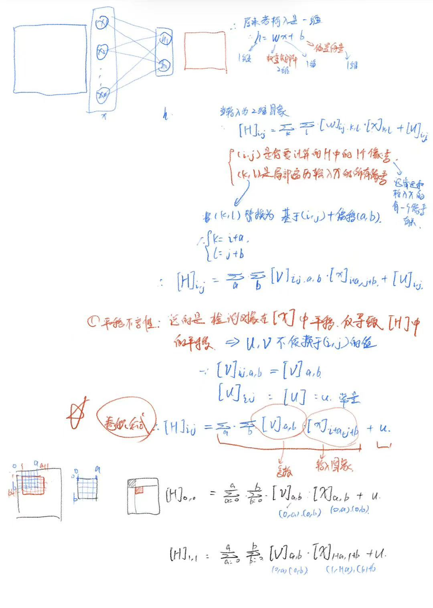
之后再根据局部性改写一下**卷积层**的函数
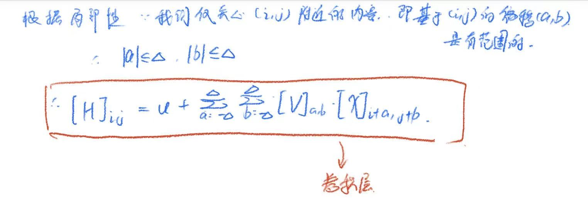

里面的**V矩阵**就被称为**卷积核**/**滤波器**/**该卷积层的权重矩阵**（通常，<mark style="background:#fff88f">该权重就是可学习的参数</mark>）
Δ就表示滤波器的尺寸


当我们处理的局部区域Δ很小的时候，
- 卷积神经网络比MLP需要**更少的网络参数**，
- 但是**代价是我们的特征是平移不变**
- 而且并且当确定每个**隐藏活性值**时，每一层**只包含局部的信息**
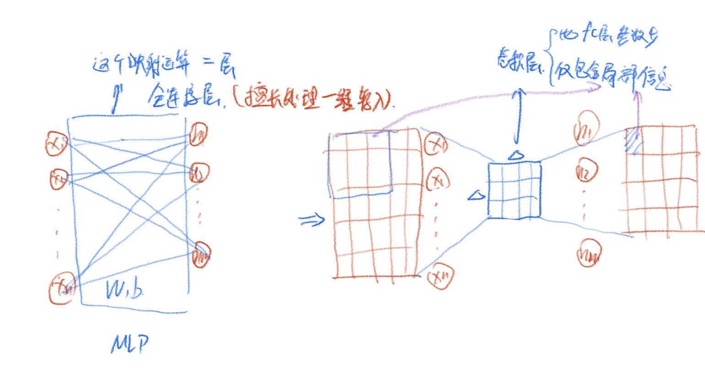

所以，卷积层，全连接层，都只是，不同功能的一个层而已，本质上都是输入到输出（预激活值/隐藏活性值）的一个映射关系。

<mark style="background:#fff88f">全连接层：权重矩阵W，偏置向量b, 是需要学习的参数</mark>
<mark style="background:#fff88f">卷积层：卷积核矩阵（Δ，Δ），是需要学习的参数</mark>

通过训练，来让我们的模型拟合训练数据（说白了，就是为了训练有效的卷积核）

下面再看一下数学上，卷积的公式定义


下面再解释一下<mark style="background:#affad1">通道</mark>
一般图像，可能一个像素，不是一个标量，而是一个3维的张量，因为有R，G，B三个通道。

所以一张图片样本的形状是（通道x 高度 x 宽度）

因此我们将X输入图片，变成3维，然后卷积核也增加成3维

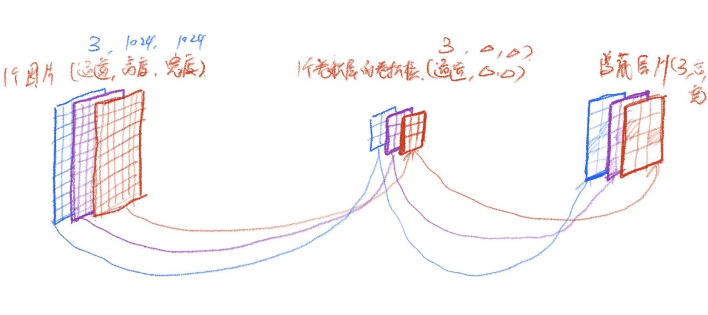

下面看一下卷积层，具体是如何计算的，这里我们的卷积运算，所表达的其实是，**互相关运算**
在卷积层中，**输入张量**和**核张量**通过<mark style="background:#fff88f">互相关运算</mark>产生**输出张量**


所以，知道了互相关运算的公式，你就可以自己实现卷积核运算了

知道了卷积核的一次互相关运算，我们来看一下<mark style="background:#affad1">卷积层，是如何完成这一层的计算的。</mark>

**卷积层对输入和卷积核权重进行互相关运算，并在添加标量偏置之后产生输出**

所以卷积层中的两个被训练的参数：
- <mark style="background:#fff88f">卷积核权重矩阵</mark>
- <mark style="background:#fff88f">标量偏置</mark>
所以我们在模型一开始，肯定也要初始化卷积层的这些参数

下面我们自定义一个自己的2维卷积层
```python
class Conv2D(nn.Module):
	# kernel_size是一个张量（3，4），注意，卷积核不一定是正方形的
	def __init__(self, kernel_size): 
		super().__init__()
		self.weight = nn.Parameter(torch.rand(kernel_size))
		"""
		nn.Parameter()，是为了把变量注册成模型参数，这样你可以通过model.parameters()来获取。同时，优化器可以定位到这些权重。
		同时自动把requires_grad 设置为 True。
		"""
		self.bias = nn.Parameter(torch.zeros(1))
		
		
	def forward(self, x):
		return corr2d(x, self.weight)+self.bias
```
高h, 宽w的卷积核，被称为 hxw卷积核。该卷积层，被称为hxw卷积层


### 卷积核举例
比如对于一个0，1的图像


我们想检测他的边界线，也就是0，1的边界

我们就构造一个（1，2）的卷积核`K = torch.tensor([[1.0, -1.0]])`

对该图像卷积之后，


但这个时候，如果现在我们<mark style="background:#ff4d4f">将输入的二维图像转置</mark>，再进行如上的互相关运算。 其输出如下，之前检测到的垂直边缘消失了。 不出所料，这个卷积核`K`只可以检测垂直边缘，无法检测水平边缘。<mark style="background:#ff4d4f">卷积核失效了</mark>

所以一个特定的卷积核，只能提取一种特征。

所以我们的目的，就是要找到适合这个特征的卷积核，也就是要去学习卷积核，对应于MLP的拟合参数。
- MLP叫拟合参数（优化参数）
- 卷积叫学习卷积核

### 学习卷积核（优化参数）

当有了更复杂数值的卷积核，或者连续的卷积层时，我们不可能手动设计滤波器。那么我们是否可以学习由`X`生成`Y`的卷积核呢

**仅查看“输入-输出”对来学习由`X`生成`Y`的卷积核**

这里还是用的标签来实现的，然后计算该样本的平方差损失
```python
# 构造一个二维卷积层，它具有1个输出通道和形状为（1，2）的卷积核
conv2d = nn.Conv2d(1,1, kernel_size=(1, 2), bias=False)

# 这个二维卷积层使用四维输入和输出格式（批量大小、通道、高度、宽度），
# 其中批量大小和通道数都为1
X = X.reshape((1, 1, 6, 8))
Y = Y.reshape((1, 1, 6, 7))
lr = 3e-2  # 学习率

for i in range(10):
    Y_hat = conv2d(X)
    l = (Y_hat - Y) ** 2
    conv2d.zero_grad()
    l.sum().backward()
    # 迭代卷积核
    conv2d.weight.data[:] -= lr * conv2d.weight.grad
    if (i + 1) % 2 == 0:
        print(f'epoch {i+1}, loss {l.sum():.3f}')
```

发现还是可以学会的，非常接近原来我们设计的[1,-1]的卷积核

为了与深度学习文献中的标准术语保持一致，我们**将继续把“互相关运算”称为卷积运算**，尽管严格地说，它们略有不同。 此外，对于**卷积核张量上的权重，我们称其为_元素_**


<mark style="background:#affad1">特征映射和感受野</mark>
卷积层，有时候，也被称为特征映射，因为被视为从一个输入，映射到下一层的空间维度的转换器。

**感受野**，是指的所有贡献该层的元素的前向传播的所有元素。


### 卷积细节
#### 填充与步幅
前面我们 3x3 的输入，经过 2x2的卷积，最终得到了输出2x2， 发现尺寸变小了


<mark style="background:#affad1">填充</mark>
可以发现，在应用多层卷积的时候，我们就逐渐丢失边缘像素了，多层之后，丢失的越来越多。

因此，保证每次卷积之后，**输入输出尺寸不变的办法**，就是**填充**


**卷积神经网络中卷积核的高度和宽度通常为奇数，例如1、3、5或7**
选择**奇数的好处**是，
- 保持空间维度的同时，我们可以在顶部和底部填充相同数量的行，在左侧和右侧填充相同数量的列
- 使用奇数的核大小和填充大小也提供了书写上的便利：
	- 对于任何二维张量`X`，当满足： 1. **卷积核**的大小是**奇数**； 2. 所有边的**填充**行数和列数**相同**； 3. **输出与输入具有相同高度和宽度** 则可以得出：输出`Y[i, j]`是通过以输入`X[i, j]`为中心，与卷积核进行互相关计算得到的。

下面我们来写一下这个填充，然后让卷积层保证输入输出同尺寸

```python
import torch
from torch import nn

"""
nn.Conv2d(1,1)
第一个1， in_channels, 表示输入样本的通道，我们是单通道
第二个1， out_channels, 卷积后输出的通道数，表明会有多少个卷积核
kernel_size = 3, 为python的语法糖，效果等同于kernel_size=(3,3),你也可以传入（5，3）
padding=1，表示在输入的二维图像的，上下左右，各填充一行0（默认是0）
"""
conv2d = nn.Conv2d(1, 1, kernel_size=3， padding =1)
X= torch.rand(8,8)
```
这样,我们指定了输入图像为8x8的尺寸，单通道 -> in_channels = 1
然后用nn.Conv2d来创建了一个卷积层对象

这里需要解释的是：
- `in_channels` 决定了每个卷积核长什么样（单个卷积核本身有多少个通道）
	- 单个卷积核的通道数必须等于输入图片的通道数
	- 
- 而 `out_channels` 决定了你有多少个卷积核。
	- 


所以，一个卷积层里面，会有多个卷积核，类比于一个隐藏层的隐藏单元，线性回归单元

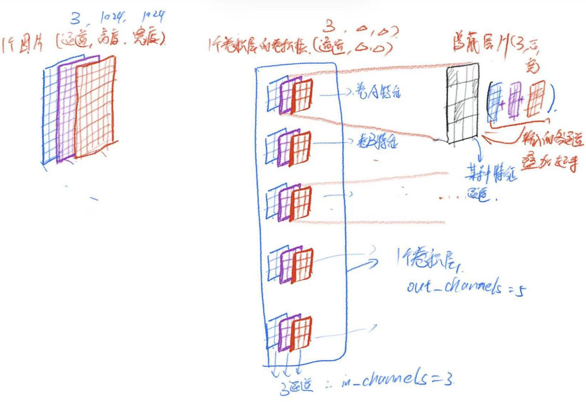


定义好了卷积层之后
```python
import torch
from torch import nn

conv2d = nn.Conv2d(1, 1, kernel_size=3, padding=1)
"""
创建出的卷积核shape(1,1,3,3), 使用kaiming均匀分布初始化权重还有偏置标量
"""
X = torch.rand(size=(8, 8)).reshape((1,1)+X.shape) # (1,1)+(8,8)是元组拼接


"""
conv2d()卷积层，他的
输入张量的格式(batch_size, in_channels输入图片的通道数=卷积核通道, height, width)
输出张量的格式(batch_size, out_channels输出特征的通道数=卷积核数量, height, width)
"""
def comp_conv2d(conv2d, X):
	"""
	卷积层conv2d的输入输出格式（批量大小，通道，）
	"""
	Y = conv2d(X) 
	return Y.reshape(Y.shape[2:]) # 打印出shape数组的2，3位，就是(weight, width)
	"""
	最终返回torch.Size([8, 8])
	"""
```


以上，我们就已经了解了一个卷积层的内部，最后总结一下


#### 步幅
这个就是指的一个卷积核，如何在输入图片上移动的步长了，你可以指定每次滑动的步幅

可以看到，当stride改成2的时候，输出尺寸从8x8, 变成了4x4了

同样复杂一点指定**非正方形的卷积**


<mark style="background:#fff88f">在实践中，我们很少使用不一致的步幅或填充</mark>


如何根据<mark style="background:#fff88f">输入的尺寸</mark>，<mark style="background:#fff88f">卷积核的尺寸</mark>，以及<mark style="background:#fff88f">padding</mark>， <mark style="background:#fff88f">stride</mark>来计算输出图片的尺寸，由公式


### 1x1卷积层
当我们的卷积核的高度=宽度=1时，每个卷积核通道内部的计算消失了，**只剩下了通道上的计算**。

$1 \times 1$ 卷积的唯一计算发生在**通道**上。

输出中的每个元素都是从输入图像中**同一位置**但在不同通道上的元素的**线性组合**。（<font color="#00b050">相当于像素级别的全连接，只不过不同像素的权重都是一样的</font>）

这使得网络能够有效地**整合跨通道的特征信息**。

**他的最大的用处**是：<mark style="background:#fff88f">灵活调整通道数（升维或降维）</mark>
- 通过设置不同的输出通道数（$c_o$），$1 \times 1$ 卷积可以用来**增加或减少通道的维度**。
- 这常用于在不改变图像高度和宽度（空间分辨率）的前提下，**压缩模型参数**或**增加特征的丰富度**
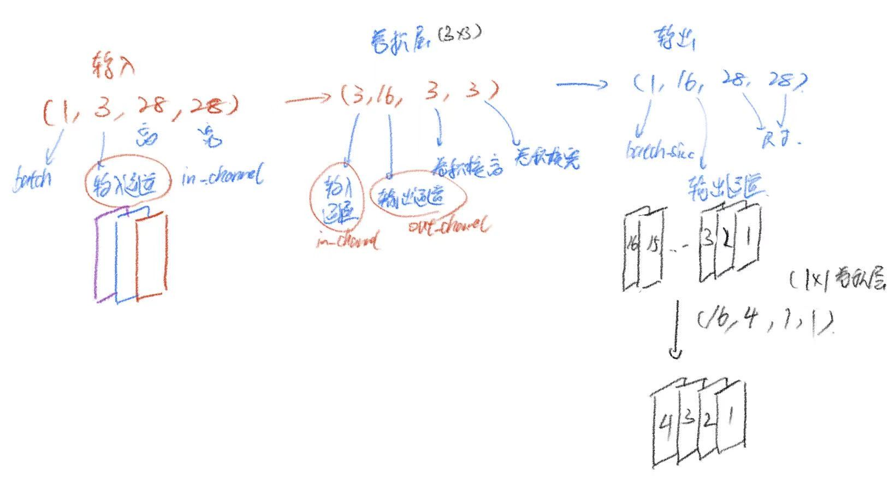


### 汇聚层（池化层）
当我们处理图像的时候，中间的卷积层，会产生多通道的同尺寸图片，每个通道表示一个卷积核通道卷出来的特征。

如果我们希望降低这些中间图片特征所表示的空间分辨率，聚集信息。这样我们每个神经元对其敏感的感受野就越大了（相当于压缩了嘛）

因为我们的机器学习的任务，是和全局图像有关的，所以我们最后一层的神经元，应该对整个输入的全局是敏感的。所以要通过池化操作，来聚合信息，生成越来越粗糙的映射，最终学会全局表示的目标，同时将卷积图层的所有又是保留在中间层。

所以:
_汇聚_（pooling）层，它具有双重目的：
- 降低卷积层对位置的敏感性(肯定不希望稍微偏移一个像素就识别不出来)
- 同时降低对空间降采样表示的敏感性

所以我们的**池化操作，主要是针对空间信息**， 前面的**1x1卷积，主要是针对通道特征信息**
##### 最大汇聚层/平均汇聚层

所以，本质上，池化窗口，也是一个区域，类似卷积核，只不过他不是互相关计算，而是**计算该窗口的输入子张量的最大值/平均值**， 分别对应了**最大汇聚层**，**平均汇聚层**

**汇聚窗口形状位pxq的汇聚层，称为pxq汇聚层**

> 这样，使用2x2的汇聚层，即使在高度，宽度上移动一个像素，卷积层仍可以识别到模式

#### 填充和步幅
因为池化层也是一个窗口计算，所以肯定要移动，这就又带来了填充问题和步幅问题。从计算上来看，是一样的。

但是移动方式上，和卷积核不太一样，因为我们是池化操作，所以是**降采样，因此一次移动的步幅，默认等于池化窗口的尺寸，你也可以自己指定步幅**

```python
X = torch.arange(16, dtype=torch.float32).reshape((1, 1, 4, 4))
"""
tensor([[[[ 0.,  1.,  2.,  3.],
          [ 4.,  5.,  6.,  7.],
          [ 8.,  9., 10., 11.],
          [12., 13., 14., 15.]]]])
"""

pool2d = nn.MaxPool2D(3)
"""
我们自己定义一个最大池化层，形状（3，3），因此步幅也为（3，3）
"""


poll2d(X)
"""
tensor([[[[10.]]]]), 因为一步也移动不了
"""

pool2d = nn.MaxPool2d(3, padding=1, stride=2)
pool2d(X)

"""
tensor([[[[ 5.,  7.],
          [13., 15.]]]])
"""
```


### 经典CNN（LeNet）
总体来看，LeNet（LeNet-5）由两个部分组成：
- 卷积编码器：由两个卷积层组成;
- 全连接层密集块：由三个全连接层组成。


**每个卷积块**中的基本单元是**一个卷积层**、一个sigmoid**激活函数**和**平均汇聚层**
(ReLU和最大汇聚层更有效，但是当时还没出现)

这边提一下CNN的卷积核的参数的训练（因为他这个参数量很少）
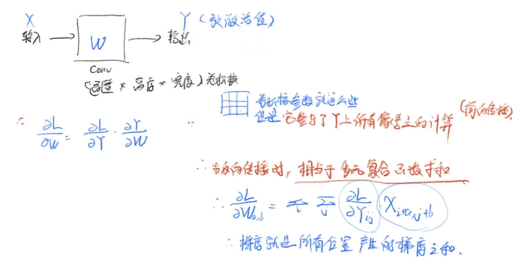


<mark style="background:#fff88f">以 LeNet 处理 MNIST 手写数字为例</mark>：
1. **前向传播**：输入图像经过 $5 \times 5$ 卷积，得到特征图。
2. **计算误差**：在输出层计算预测值与真实标签（如数字 "7"）的损失 $L$。
3. **误差回传**：
    - 误差从全连接层传回池化层。
    - 从池化层传回卷积层（得到 $\frac{\partial L}{\partial Y}$）。
4. **权重更新**：
    - 利用上述的“累加梯度”公式算出卷积核的梯度 $\frac{\partial L}{\partial W}$。
    - **更新参数**：$W_{new} = W_{old} - \eta \cdot \frac{\partial L}{\partial W}$（$\eta$ 是学习率）。

```python
import torch
from torch import nn
from d2l import torch as d2l

net = nn.Sequential(
    nn.Conv2d(1, 6, kernel_size=5, padding=2), nn.Sigmoid(),
    nn.AvgPool2d(kernel_size=2, stride=2),
    nn.Conv2d(6, 16, kernel_size=5), nn.Sigmoid(),
    nn.AvgPool2d(kernel_size=2, stride=2),
    nn.Flatten(),
    nn.Linear(16 * 5 * 5, 120), nn.Sigmoid(),
    nn.Linear(120, 84), nn.Sigmoid(),
    nn.Linear(84, 10))
```


`with torch.no_grad():`
这个的作用，是关闭保留中间变量的操作，因此可以：
- 加快测试速度
- 减小内存占用
- 避免改变模型权重

**自动梯度是前向 “留后路（建图存中间）” 给反向用；**
**推理不需要后路，no_grad 就是把这条后路直接封死，不占空间、不浪费性能。**


### 现代卷积神经网络

在LeNet出来之后，开始了现代卷积神经网络

LeNet在小数据集上效果还行，但是更大，更真实的数据集上，效果就拉了。

在此之前，人们倾向于自己提取自己理解的特征，比如HOG，SIFT这些。
但是Alex这些人，他们认为：**特征本身应该被学习**

**在合理地复杂性前提下，特征应该由多个共同学习的神经网络层组成，每个层都有可学习的参数**

在机器视觉中，最底层可能检测边缘、颜色和纹理，由此诞生_**AlexNet**_

- 在**网络的最底层**，模型学习到了一些类似于**传统滤波器的特征抽取器**
	- 
- AlexNet的**更高层建立在这些底层表示的基础上**，以表示更大的特征，如**眼睛**、**鼻子**、草叶等等
- **更高的层**可以检测**整个物体**，如人、飞机、狗或飞盘
- **最终的隐藏神经元**可以学习图像的综合表示


#### GPU并行计算优势


<mark style="background:#fff88f">深度学习里面，还有哪些环节能在GPU上并行呢？</mark>

- **卷积层运算**：
- **激活函数**：
- **池化层**：这个和卷积类似
- **全连接层**：本质还是矩阵乘法
- **损失函数计算**：
- **反向传播**：

所有能并行的环节，都满足一个共同点：**计算任务之间没有数据依赖**


#### ai infra推理加速
AI Infra 在模型推理加速上，核心就是**想尽办法让 GPU/CPU 少做无用功、多做有效并行、减少数据瓶颈**，把模型跑的又快又省


##### 多GPU训练
一种**分模型参数**，一种**不分参数只分数据**


#### AlexNet
AlexNet横空出世。它首次证明了**学习到的特征**可以**超越手工设计的特征**

 AlexNet使用了**8层卷积神经网络**


1. AlexNet比相对较小的LeNet5要深得多。AlexNet由八层组成：五个卷积层、两个全连接隐藏层和一个全连接输出层。
2. AlexNet使用ReLU而不是sigmoid作为其激活函数。


下面来分析一下AlexNet的架构设计
第一层卷积：11x11的卷积核，因为输入图片尺寸大，所以用大卷积核。
第二层卷积：5x5的卷积核
第三层卷积：3x3卷积
......
最后两个4096个输出的全连接层，总参数将近1GB


**激活函数选择ReLU**, 因为当sigmoid激活函数的输出非常接近于0或1时，这些区域的梯度几乎为0，因此反向传播无法继续更新一些模型参数。 相反，ReLU激活函数在正区间的梯度总是1。 因此，如果模型参数没有正确初始化，sigmoid函数可能在正区间内得到几乎为0的梯度，从而使模型无法得到有效的训练

同时**AlexNet通过暂退法**控制全连接的**模型复杂度**。而LeNet只使用了权重衰减

为了进一步扩充数据，AlexNet在训练时增加了大量的图像**增强数据**，如翻转、裁切和变色

这使得模型更健壮，更大的样本量有效地**减少了过拟合**

手动实现一个AlexNet
```python
import torch
from torch import nn
from d2l import torch as d2l

net = nn.Sequential(
    # 这里使用一个11*11的更大窗口来捕捉对象。
    # 同时，步幅为4，以减少输出的高度和宽度。
    # 另外，输出通道的数目远大于LeNet
    nn.Conv2d(1, 96, kernel_size=11, stride=4, padding=1), nn.ReLU(),
    nn.MaxPool2d(kernel_size=3, stride=2),
    # 减小卷积窗口，使用填充为2来使得输入与输出的高和宽一致，且增大输出通道数
    nn.Conv2d(96, 256, kernel_size=5, padding=2), nn.ReLU(),
    nn.MaxPool2d(kernel_size=3, stride=2),
    # 使用三个连续的卷积层和较小的卷积窗口。
    # 除了最后的卷积层，输出通道的数量进一步增加。
    # 在前两个卷积层之后，汇聚层不用于减少输入的高度和宽度
    nn.Conv2d(256, 384, kernel_size=3, padding=1), nn.ReLU(),
    nn.Conv2d(384, 384, kernel_size=3, padding=1), nn.ReLU(),
    nn.Conv2d(384, 256, kernel_size=3, padding=1), nn.ReLU(),
    nn.MaxPool2d(kernel_size=3, stride=2),
    nn.Flatten(),
    # 这里，全连接层的输出数量是LeNet中的好几倍。使用dropout层来减轻过拟合
    nn.Linear(6400, 4096), nn.ReLU(),
    nn.Dropout(p=0.5),
    nn.Linear(4096, 4096), nn.ReLU(),
    nn.Dropout(p=0.5),
    # 最后是输出层。由于这里使用Fashion-MNIST，所以用类别数为10，而非论文中的1000
    nn.Linear(4096, 10))
```

#### VGG网络（块)
虽然**AlexNet**证明**深层神经网络卓有成效**，但它**没有提供一个通用的模板**来指导后续的研究人员**设计新的网络**

VGG网络中使用块的概念，方便了设计新网络的能力


<mark style="background:#affad1">经典卷积神经网络的基本组成部分</mark>是下面的这个序列：

1. 带填充以保持分辨率的卷积层；
2. 非线性激活函数，如ReLU；
3. 汇聚层，如最大汇聚层。

<mark style="background:#affad1">VGG网络可以分为两部分</mark>：
- 第一部分主要由**卷积层**和**汇聚层**组成
- 第二部分由**全连接层**组成

具体给架构设计是这样子的


这里我们自己实现一个vgg块
```python
from mxnet import np, npx
from mxnet.gluon import nn
from d2l import mxnet as d2l

npx.set_np()

def vgg_block(num_convs, num_channels):
    blk = nn.Sequential()
    for _ in range(num_convs):
        blk.add(nn.Conv2D(num_channels, kernel_size=3,
                          padding=1, activation='relu'))
    blk.add(nn.MaxPool2D(pool_size=2, strides=2))
    return blk
```

VGG神经网络连接 [图7.2.1](https://zh-v2.d2l.ai/chapter_convolutional-modern/vgg.html#fig-vgg)的几个VGG块（在`vgg_block`函数中定义）

其中有超参数变量`conv_arch`。该变量指定了每个**VGG块**里**卷积层个数**和**输出通道数**。
`conv_arch = ((1, 64), (1, 128), (2, 256), (2, 512), (2, 512))` **五个卷积块**

**全连接模块**则与AlexNet中的相同。

**原始VGG网络有5个卷积块**，其中**前两个块**各有一个卷积层，**后三个块**各包含两个卷积层。

**第一个模块**有64个输出通道，每个后续模块将输出通道数量翻倍，直到该数字达到512

由于该网络使用8个卷积层和3个全连接层，因此它通常被称为VGG-11


那么开始搭建一个完整的vgg-11模型
```python
def vgg(conv_arch):
    conv_blks = []
    in_channels = 1
    # 卷积层部分
    for (num_convs, out_channels) in conv_arch:
        conv_blks.append(vgg_block(num_convs, in_channels, out_channels))
        in_channels = out_channels

    return nn.Sequential(
        *conv_blks, nn.Flatten(),
        # 全连接层部分
        nn.Linear(out_channels * 7 * 7, 4096), nn.ReLU(), nn.Dropout(0.5),
        nn.Linear(4096, 4096), nn.ReLU(), nn.Dropout(0.5),
        nn.Linear(4096, 10))

net = vgg(conv_arch)
```


#### NiN(网络中的网络)

AlexNet和VGG对LeNet的改进主要在于如何扩大和加深这两个模块

然而，如果**使用了全连接层**，可能会**完全放弃表征的空间结构**

_网络中的网络_（_NiN_）提供了一个非常简单的解决方案：**在每个像素的通道上分别使用多层感知机**
<mark style="background:#fff88f">即将空间维度中的每个像素视为单个样本，将通道维度视为不同特征（feature）</mark>


可以看到，NiN块，是先经过一个普通的卷积层，然后，是两个1x1的卷积层来升降维。**这两个1x1的卷积层，充当带有ReLU激活函数的，逐像素全连接层。**

我们也自己定义一个NiN块看看
```python
import torch
import torch.nn as nn

def nin_block(in_channels, out_channels, kernel_size, strides, padding):
	return nn.Sequential(
		nn.Conv2d(in_channels, out_channels, kernel_size, strides, padding),
		nn.ReLU(),
		nn.Conv2d(out_channels, out_channels, kernel_size=1), nn.ReLU(),
		nn.Conv2d(out_channels, out_channels, kernel_size=1), nn.ReLU()
	)
"""
注意，NiN块的最后一个out_channels, 被设置成类别数，这样就相当于对每个像素，做符合类别数量的一个全连接映射。
"""
```
可以看到，他既不升维也不降维，单纯的就是逐像素，把每个通道作为输入，等价于像素位置上的全连接层。很妙啊

NiN和AlexNet之间的一个**显著区别**是**NiN完全取消了全连接层**，NiN使用一个NiN块，**其输出通道数等于标签类别的数量**

最后放一个_**全局平均汇聚层**_（global average pooling layer），**生成一个对数几率** （logits）：
> 在深度学习中，**对数几率（Logits）本质上就是一组**没有经过归一化（如 Softmax）的原始得分向量**


<mark style="background:#fff88f">NiN 的设计思想</mark>是：与其用复杂且臃肿的全连接层去“猜”每个类别的得分，不如**直接让卷积层产出对应类别的特征图**，然后通过**取平均值**的方式提取出该类别的总体得分。

**这样做最大的好处是显著减少了模型所需参数的数量，因为它彻底取消了占据 AlexNet 大部分参数量的全连接层。**


#### GoogLeNet(并行连接)

GoogLeNet 吸收了NiN的串联网络的思想。**解决的问题是**：<mark style="background:#fff88f">什么样大小的卷积核最合适的问题</mark>

观点是，有时**使用不同大小的卷积核组合是有利的**

GoogLeNet里面，也设计了自己的卷积块：基本的卷积块被称为_**Inception块**_


这个块，本身由4条并行路径构成

中间两条路：先经过1x1卷积，减少输入的通道数，降低模型的复杂性（让后面的卷积核的通道减少）。

这四条路径，都是用合适的填充让输入与输出的高宽一致（说明这个块的4条路径，都是在通道上做文章，不是在图片尺寸上）

最后我们将每条线路的输出在通道维度上连结，并构成**Inception块的输出**。

在Inception块中，通常调整的超参数是**每层输出通道数**（因为是4条路汇聚起来的嘛）

```python
import torch
import torch.nn as nn
from torch.nn import functional as F

class Inception(nn.Module):
	# **kwargs表示接收任意多的额外关键字参数
	def __init__(self, in_channles, c1, c2, c3, c4, **kwargs): 
		super().__init__()
		self.p1_1 = nn.Conv2d(in_channels, c1, kernel_size=1)
		self.p2_1 = nn.Conv2d(in_channels, c2[0], kernel_size=1)
		self.p2_2 = nn.Conv2d(c2[0], c2[1], kernel_size=3, padding=1)
		self.p3_1 = nn.Conv2d(in_channels, c3[0], kernel_size=1)
		self.p3_2 = nn.Conv2d(c3[0], c3[1], kernel_size=5, padding=2)
		self.p4_1 = nn.MaxPoll2d(kernel_size=3, stride=1, padding=1)
		self.p4_2 = nn.Conv2d(in_channels, c4, kernel_size=1)
		
	def forward(self, x):
		p1 = F.relu(self.p1_1(x))
		p2 = F.relu(self.p2_2(F.relu(self.p2_1(x))))
		p3 = F.relu(self.p3_2(F.relu(self.p3_1(x))))
		p4 = F.relu(self.p4_2(self.p4_1(x)))
		
		return torch.cat((p1, p2, p3, p4), dim=1)

```

GoogLeNet之所以有效，是因为用来不同尺寸的滤波器去探索图像。为不同的滤波器分配不同数量的参数。

下面看看完整的GoogLeNet模型架构


一共使用**9个Inception块**和**全局平均汇聚层**的堆叠来生成其估计值

Inception块之间的**最大汇聚层**可**降低维度**

**第一个模块类似于AlexNet和LeNet**

Inception块的**组合从VGG继承**（因为他有多个inception块相连接）


下面完整实现这个GoogLeNet网络模型
```python
b1 = nn.Sequential(nn.Conv2d(1, 64, kernel_size=7, stride=2, padding=3),
                   nn.ReLU(),
                   nn.MaxPool2d(kernel_size=3, stride=2, padding=1))
                   
b2 = nn.Sequential(nn.Conv2d(64, 64, kernel_size=1),
                   nn.ReLU(),
                   nn.Conv2d(64, 192, kernel_size=3, padding=1),
                   nn.ReLU(),
                   nn.MaxPool2d(kernel_size=3, stride=2, padding=1))   
                               
b3 = nn.Sequential(Inception(192, 64, (96, 128), (16, 32), 32),
                   Inception(256, 128, (128, 192), (32, 96), 64),
                   nn.MaxPool2d(kernel_size=3, stride=2, padding=1))                  
b4 = nn.Sequential(Inception(480, 192, (96, 208), (16, 48), 64),
                   Inception(512, 160, (112, 224), (24, 64), 64),
                   Inception(512, 128, (128, 256), (24, 64), 64),
                   Inception(512, 112, (144, 288), (32, 64), 64),
                   Inception(528, 256, (160, 320), (32, 128), 128),
                   nn.MaxPool2d(kernel_size=3, stride=2, padding=1))
                   
b5 = nn.Sequential(Inception(832, 256, (160, 320), (32, 128), 128),
                   Inception(832, 384, (192, 384), (48, 128), 128),
                   nn.AdaptiveAvgPool2d((1,1)),
                   nn.Flatten())

net = nn.Sequential(b1, b2, b3, b4, b5, nn.Linear(1024, 10))
```


#### 批量规范化
训练深层神经网络是十分困难的，特别是在**较短的时间内使他们收敛**更加棘手。 本节将介绍_**批量规范化**_（batch normalization）

可持续加速深层网络的收敛速度（后面再结合残差块设计）

BatchNormalization，能够训练100层以上的网络

<mark style="background:#affad1">训练深层网络的需要</mark>
- 使用真实数据时，我们的第一步是**标准化输入特征**，使其平均值为0，方差为1。这种标准化可以很好地与我们的**优化器配合使用**，因为它可以**将参数的量级进行统一**
- 对于典型的MLP和CNN，训练时的中间层变量，可能具有更广的变化范围。

 批量规范化的发明者**非正式地假设**，这些变量**分布中的这种偏移**可能**会阻碍网络的收敛**。 直观地说，我们可能会猜想，如果一个层的可变值是另一层的100倍，这可能需要对学习率进行补偿调整

- 更深层的网络很复杂，容易过拟合。 这意味着正则化变得更加重要。

<mark style="background:#fff88f">批量规范化应用于单个可选层（也可以应用到所有层）</mark>
**其原理如下**：
- 在每次训练迭代中，我们首先**规范化输入**，即通过<font color="#00b050">减去其均值并除以其标准差，其中两者均基于当前小批量处理</font>。 
- 接下来，我们**应用比例系数和比例偏移**。 正是由于这个基于_批量_统计的_标准化_，才有了_批量规范化_的名称。

> 请注意，如果我们尝试使用大小为1的小批量应用批量规范化，我们将无法学到任何东西。 这是因为在减去均值之后，每个隐藏单元将为0

<mark style="background:#fff88f">所以，只有使用足够大的小批量，批量规范化这种方法才是有效且稳定的</mark>
请注意，在应用批量规范化时，**批量大小的选择**可能**比没有批量规范化时更重要**

简单说，批量规范化，主要有两个部分：

这里的批量规范化层，引入了两个模型参数：**γ（拉伸参数）**，**β（偏移参数）**

批量规范化（Batch Normalization，简称 BN）层确实是一个独立的“层”，它的核心作用就是**规范化它前面那一层的输出（也就是后面那一层的输入）**。


**计算样本均值和方差的小巧思**


##### 批量规范化层实现
因为批量规范化层，肯定需要知道一个batch的所有内容，所以，不能像其他层那样忽略batch_size的大小。

<mark style="background:#affad1">全连接层的批量规范化</mark>
我们将批量规范化层置于全连接层中的仿射变换（预激活值）和激活函数之间


<mark style="background:#affad1">卷积层的批量规范化</mark>
我们可以在卷积层之后和非线性激活函数之前应用批量规范化

卷积有**多个输出通道**时，我们需要对**这些通道的“每个”输出执行批量规范化**，每个通道**都有自己的拉伸（scale）和偏移（shift）参数**，这两个参数都是标量


具体的计算方式为：以通道为单位算规范化
**针对mxpxq的元素进行参与计算（m = batch_size）**


所以，每个卷积核通道，持有一组批量规范化的参数。


<mark style="background:#affad1">前向推理过程中的批量规范化</mark>
批量规范化在训练模式和预测模式下的行为通常不同


<mark style="background:#affad1">批量规范化层的实现</mark>
```python
import torch
from torch import nn
from d2l import torch as d2l

def batch_norm(X, gamma, beta, moving_mean, moving_var, eps, momentum):
    # 通过is_grad_enabled来判断当前模式是训练模式还是预测模式
    if not torch.is_grad_enabled():
        # 如果是在预测模式下，直接使用传入的移动平均所得的均值和方差
        X_hat = (X - moving_mean) / torch.sqrt(moving_var + eps)
    else:
        assert len(X.shape) in (2, 4)
        if len(X.shape) == 2:
            # 使用全连接层的情况，计算特征维上的均值和方差
            mean = X.mean(dim=0)
            var = ((X - mean) ** 2).mean(dim=0)
        else:
            # 使用二维卷积层的情况，计算通道维上（axis=1）的均值和方差。
            # 这里我们需要保持X的形状以便后面可以做广播运算
            mean = X.mean(dim=(0, 2, 3), keepdim=True)
            var = ((X - mean) ** 2).mean(dim=(0, 2, 3), keepdim=True)
        # 训练模式下，用当前的均值和方差做标准化
        X_hat = (X - mean) / torch.sqrt(var + eps)
        # 更新移动平均的均值和方差
        moving_mean = momentum * moving_mean + (1.0 - momentum) * mean
        moving_var = momentum * moving_var + (1.0 - momentum) * var
    Y = gamma * X_hat + beta  # 缩放和移位
    return Y, moving_mean.data, moving_var.data
```

 1. 维度判断：处理全连接层输出
- `assert len(X.shape) in (2, 4)`：这行代码是在确认输入的形状。在深度学习中，全连接层的输出通常是二维张量，形状为 `(批量大小, 特征维度)`。
- `if len(X.shape) == 2:`：当进入这个分支时，说明模型当前正在对全连接层的输出进行规范化。

1. 计算特征维上的统计量
在全连接层中，批量规范化是针对每一个特征（隐藏单元）独立进行的。
- **均值计算 (`mean = X.mean(dim=0)`)**：
    - `dim=0` 表示沿着“批量（Batch）”这个维度进行计算。
    - 这意味着，如果你有 128 个样本，每个样本有 64 个特征，那么它会计算这 128 个样本在每一个特征位置上的平均值。
    - 最终得到的 `mean` 形状与特征维度一致（例如长度为 64 的向量）。
- **方差计算 (`var = ((X - mean) 2).mean(dim=0)`)**：
    - 这行代码计算的是样本方差。
    - 它同样是跨样本（`dim=0`）进行的，用来衡量该小批量中每个特征的数据离散程度。


---


在处理二维卷积层的输出（形状通常为 `(Batch, Channel, Height, Width)`）时，它的计算方式如下：
1. 为什么是 `dim=(0, 2, 3)`？
这是最关键的部分。在卷积层的批量规范化中，我们需要跨越**样本**和**空间位置**来收集数据：
- **`0` (Batch)**：跨越小批量中的所有样本。
- **`2` (Height)** 和 **`3` (Width)**：跨越图像的所有空间坐标。
- **结果**：计算出的 `mean` 和 `var` 是针对**每一个通道**唯一的标量。这意味着同一个通道内所有的像素点，无论在哪个样本、哪个位置，都共用这一组均值和方差。

1. `keepdim=True` 的作用
正如注释所言，这是为了后续的**广播运算（Broadcasting）**：
- 如果输出通道是 $16$，不加这个参数计算出的 `mean` 形状可能是 `(16,)`。
- 加上 `keepdim=True` 后，`mean` 的形状会保持为 `(1, 16, 1, 1)`。
- 这样在执行 `X - mean` 时，PyTorch 会自动把这个 $1 \times 16 \times 1 \times 1$ 的张量“扩展”到和原始 `X` 一样的形状，从而实现对每个通道内所有像素点进行统一减法的操作。

---

 1. 标准化（Standardization）

```
X_hat = (X - mean) / torch.sqrt(var + eps)
```
- **减去均值与除以标准差**：这行代码实现了你之前提到的“主动居中”。它将当前通道或特征的分布强制变换为均值为 0、方差为 1 的标准分布。
- **`eps` (Epsilon) 的作用**：对应于你参考资料中提到的“在方差估计值中添加一个小的常量 $\epsilon > 0$”。其目的是确保分母不为零，防止在方差接近 0 时计算崩溃。

 2. 更新移动平均（Updating Moving Average）

```
moving_mean = momentum * momentum * moving_mean + (1.0 - momentum) * mean
moving_var = momentum * momentum * moving_var + (1.0 - momentum) * var
```
这是 BN 层最“聪明”的地方，它在训练时偷偷为预测模式（Inference）做准备：
- **为什么要更新？**：正如你查阅的“预测过程中的批量规范化”所述，预测时可能一次只输入一个样本，无法实时算方差。因此，我们需要通过移动平均来估算**整个训练数据集**的全局均值和方差。
- **`momentum` (动量)**：它决定了“记忆”的权重。
    - 通常设为一个接近 1 的值（如 0.9 或 0.99）。
    - 这意味着新的全局估算值 = **90% 的旧记忆** + **10% 的当前小批量观察值**。
- **平滑噪声**：训练过程中的单个小批量均值（$\hat{\mu}_B$）含有随机噪声。通过这种加权平均，模型可以抵消消缩放问题，得到一个平滑、确定的全局统计量，供预测时使用。


---

通常情况下，我们用一个单独的函数定义其数学原理，比如说`batch_norm`。 然后，我们将此功能集成到一个自定义层中，其代码主要处理数据移动到训练设备（如GPU）、分配和初始化任何必需的变量、跟踪移动平均线（此处为均值和方差）等问题

这个只是实现了批量规范化的计算，但是移动均值，移动方差的存储这些，还是需要一个具体的类来存储

```python
class BatchNorm(nn.Module):
    # num_features：完全连接层的输出数量或卷积层的输出通道数。
    # num_dims：2表示完全连接层，4表示卷积层
    def __init__(self, num_features, num_dims):
        super().__init__()
        if num_dims == 2:
            shape = (1, num_features)
        else:
            shape = (1, num_features, 1, 1)
        # 参与求梯度和迭代的拉伸和偏移参数，分别初始化成1和0
        self.gamma = nn.Parameter(torch.ones(shape))
        self.beta = nn.Parameter(torch.zeros(shape))
        # 非模型参数的变量初始化为0和1
        self.moving_mean = torch.zeros(shape)
        self.moving_var = torch.ones(shape)

    def forward(self, X):
        # 如果X不在内存上，将moving_mean和moving_var
        # 复制到X所在显存上
        if self.moving_mean.device != X.device:
            self.moving_mean = self.moving_mean.to(X.device)
            self.moving_var = self.moving_var.to(X.device)
        # 保存更新过的moving_mean和moving_var
        Y, self.moving_mean, self.moving_var = batch_norm(
            X, self.gamma, self.beta, self.moving_mean,
            self.moving_var, eps=1e-5, momentum=0.9)
        return Y
```


<mark style="background:#affad1">使用批量规范化层的LeNet</mark>
```python
net = nn.Sequential(
    nn.Conv2d(1, 6, kernel_size=5), BatchNorm(6, num_dims=4), nn.Sigmoid(),
    nn.AvgPool2d(kernel_size=2, stride=2),
    nn.Conv2d(6, 16, kernel_size=5), BatchNorm(16, num_dims=4), nn.Sigmoid(),
    nn.AvgPool2d(kernel_size=2, stride=2), nn.Flatten(),
    nn.Linear(16*4*4, 120), BatchNorm(120, num_dims=2), nn.Sigmoid(),
    nn.Linear(120, 84), BatchNorm(84, num_dims=2), nn.Sigmoid(),
    nn.Linear(84, 10))
    
"""训练代码"""
lr, num_epochs, batch_size = 1.0, 10, 256
train_iter, test_iter = d2l.load_data_fashion_mnist(batch_size)
d2l.train_ch6(net, train_iter, test_iter, num_epochs, lr, d2l.try_gpu())
```


<mark style="background:#affad1">pytorch实现的batchNorm</mark>
```python
net = nn.Sequential(
    nn.Conv2d(1, 6, kernel_size=5), nn.BatchNorm2d(6), nn.Sigmoid(),
    nn.AvgPool2d(kernel_size=2, stride=2),
    nn.Conv2d(6, 16, kernel_size=5), nn.BatchNorm2d(16), nn.Sigmoid(),
    nn.AvgPool2d(kernel_size=2, stride=2), nn.Flatten(),
    nn.Linear(256, 120), nn.BatchNorm1d(120), nn.Sigmoid(),
    nn.Linear(120, 84), nn.BatchNorm1d(84), nn.Sigmoid(),
    nn.Linear(84, 10))
```


#### 残差网络（ResNet）
当我们的网络越来越深之后，新添加的层，如何提升网络性能 -> **残差块**

<mark style="background:#affad1">解释残差块的设计原理</mark>

**$f$ 与 $\mathcal{F}$**：$\mathcal{F}$ 代表**函数族**（即你选择的模型架构，如一个 5 层的卷积神经网络）。$f$ 是这个族群中的某一个具体的函数（即一组特定的权重参数）。

**$L(\mathbf{X}, \mathbf{y}, f)$**：这是**损失函数**（Loss Function）。它衡量了使用函数 $f$ 对特性 $\mathbf{X}$ 进行预测时，预测结果与真实标签 $\mathbf{y}$ 之间的差距。

**f**是我们实际用数据训练出来的网络，但是假设我们实际真正想要的是**f***，但是一般我们没办法找到

所有我们尝试找到一个**f'**, 他是我们在**F**中的最佳选择。

所以，我们实际面临的问题是这样子的：
- 给定数据集（X，y），这个数据集，可以训练出所有的f
- 我们期望找到f'， 他是能在（X，y）上的Loss损失min的那一个f


所以，f' 和 f，都∈F， 也就是说，他们有一样的model结构，只是参数不同而已。

那么如何得到最好的f'呢？唯一的可能性，就是重新设计一个更强的F'架构，才能从根本上解决这个问题。（毕竟天花板摆在那里）

**但是新架构F'无法保证新体系能够完全涵盖F的覆盖域，也可能更糟糕**。


<mark style="background:#fff88f">因此，只有当较复杂的函数类包含较小的函数类时，我们才能确保提高它们的性能</mark>

所以**我们的目的**，<mark style="background:#fff88f">就是找到一种修改优化模型结构的方法，能确保新的模型结构F'， 能完全包含旧模型结构F的覆盖域</mark>

也就是说，对于深度神经网络，如果我们能将**新添加的层**，训练成恒等映射**f(x)=x**, 那么就能**确保F‘肯定包含F这件事**， 此时，由新模型结构F’ 才可能得出更优的解来拟合训练数据集。

这就是残差网络ResNet

**残差网络的核心思想是**：<mark style="background:#fff88f">每个附加层都应该更容易地包含原始函数作为其元素之一</mark>

看看**残差块**，是如何实现这个思想的

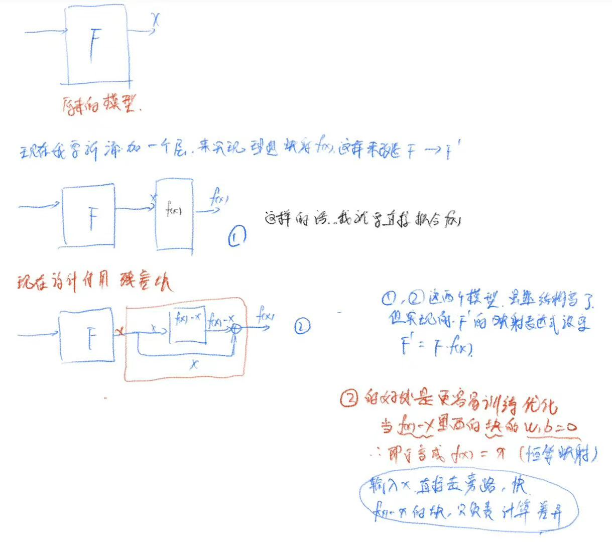


**以上展示的残差块，就是我们为了改造F，新增的一个层，变成F‘**


ResNet沿用VGG，残差块里首先有2个有相同输出通道数的3x3卷积层，每个卷积层后接一个批量规范化层和ReLU激活函数
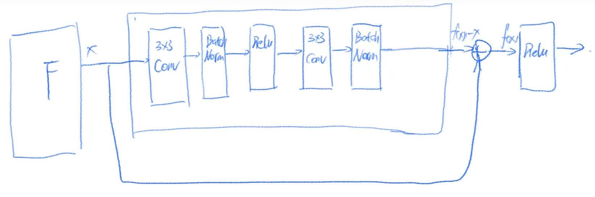

```python
import torch
from torch import nn
from torch.nn import functional as F
from d2l import torch as d2l

class Residual(nn.Module):  #@save
    def __init__(self, input_channels, num_channels,
                 use_1x1conv=False, strides=1):
        super().__init__()
        self.conv1 = nn.Conv2d(input_channels, num_channels,
                               kernel_size=3, padding=1, stride=strides)
        self.conv2 = nn.Conv2d(num_channels, num_channels,
                               kernel_size=3, padding=1)
        if use_1x1conv:
            self.conv3 = nn.Conv2d(input_channels, num_channels,
                                   kernel_size=1, stride=strides)
        else:
            self.conv3 = None
        self.bn1 = nn.BatchNorm2d(num_channels)
        self.bn2 = nn.BatchNorm2d(num_channels)

    def forward(self, X):
        Y = F.relu(self.bn1(self.conv1(X)))
        Y = self.bn2(self.conv2(Y))
        if self.conv3:
            X = self.conv3(X)
        Y += X
        return F.relu(Y)
```

此代码生成两种类型的网络： 一种是当`use_1x1conv=False`时，应用ReLU非线性函数之前，将输入添加到输出。 另一种是当`use_1x1conv=True`时，添加通过1x1卷积调整通道和分辨率


之所以在残差块（Residual Block）的旁路（Shortcut）使用它能减半高和宽，秘密不在于**卷积核的大小**，而是在于卷积操作的一个关键参数：**步幅（Stride）**


ResNet除了使用残差块的设计外，还由一个不同之处是，每个卷积层后面，都增加了批量规范化。


下面我们来用上面定义好的一个残差块，构建我们的resnet块
```python
b1 = nn.Sequential(nn.Conv2d(1, 64, kernel_size=7, stride=2, padding=3),
                   nn.BatchNorm2d(64), nn.ReLU(),
                   nn.MaxPool2d(kernel_size=3, stride=2, padding=1))


def resnet_block(input_channels, num_channels, num_residuals,
                 first_block=False):
    blk = []
    for i in range(num_residuals):
        if i == 0 and not first_block:
            blk.append(Residual(input_channels, num_channels,
                                use_1x1conv=True, strides=2))
        else:
            blk.append(Residual(num_channels, num_channels))
    return blk

# nn.Sequential(Residual_1, Residual_2)
b2 = nn.Sequential(*resnet_block(64, 64, 2, first_block=True)) 
b3 = nn.Sequential(*resnet_block(64, 128, 2))
b4 = nn.Sequential(*resnet_block(128, 256, 2))
b5 = nn.Sequential(*resnet_block(256, 512, 2))

net = nn.Sequential(b1, b2, b3, b4, b5,
                    nn.AdaptiveAvgPool2d((1,1)),
                    nn.Flatten(), nn.Linear(512, 10))


X = torch.rand(size=(1, 1, 224, 224))
for layer in net:
    X = layer(X)
    print(layer.__class__.__name__,'output shape:\t', X.shape)

"""
	Sequential output shape:     torch.Size([1, 64, 56, 56])
	Sequential output shape:     torch.Size([1, 64, 56, 56])
	Sequential output shape:     torch.Size([1, 128, 28, 28])
	Sequential output shape:     torch.Size([1, 256, 14, 14])
	Sequential output shape:     torch.Size([1, 512, 7, 7])
	AdaptiveAvgPool2d output shape:      torch.Size([1, 512, 1, 1])
	Flatten output shape:        torch.Size([1, 512])
	Linear output shape:         torch.Size([1, 10])
"""

```


```python
lr, num_epochs, batch_size = 0.05, 10, 256
train_iter, test_iter = d2l.load_data_fashion_mnist(batch_size, resize=96)
d2l.train_ch6(net, train_iter, test_iter, num_epochs, lr, d2l.try_gpu())


"""
	loss 0.012, train acc 0.997, test acc 0.893
	5032.7 examples/sec on cuda:0
"""
```


#### 稠密层（DenseNet）
ResNet极大地改变了如何参数化深层网络中函数的观点

**_稠密连接网络_在某种程度上是ResNet的逻辑扩展**

我们曾经，对任意函数进行泰勒展开，可以分解成很多项


同样ResNet将函数展开：

可以看到，ResNet网络，本身就是将这个残差块的映射f(x), 分成两条路，**一路x旁路**，**一路是差异g(x)**，即一**个简单的线性项**和**一个复杂的非线性项**（可以想象成<mark style="background:#fff88f">泰勒展开的余项</mark>）


那么，再拓展一步，如果我们想要把f(x)再像泰勒展开一样再进一步展开呢，你看线性x，就是泰勒展开已经展开的部分，非线性项g(x), 就是余项，可以进一步展开。这个方案就是DenseNet


ResNet和DenseNet的关键区别在于，DenseNet输出是_连接_（用图中的[.]表示）而不是如ResNet的简单相加

所以，如果我们的这个残差块，要学习的真的是一个很复杂的映射关系，那么


<mark style="background:#fff88f">所以，稠密层里面，更高阶的余项，不是像泰勒展开那样，去不停的细分，而是说，x是基础特征，f1是基于x挖掘的一阶特征，f2是利用f1,x 组合出来的更复杂的特征，....， fn是最高级的特征</mark>

**泰勒展开是“横向细分”，DenseNet 是“纵向抽象”**


```python
import torch
from torch import nn
from d2l import torch as d2l

def conv_block(input_channels, num_channels):
    return nn.Sequential(
        nn.BatchNorm2d(input_channels), nn.ReLU(),
        nn.Conv2d(input_channels, num_channels, kernel_size=3, padding=1))
        

class DenseBlock(nn.Module):
    def __init__(self, num_convs, input_channels, num_channels):
        super(DenseBlock, self).__init__()
        layer = []
        for i in range(num_convs):
            layer.append(conv_block(
                num_channels * i + input_channels, num_channels))
        """
        x: i
        f1(x): i -> n
        f2(x,f1): i+n -> n
        f3(x,f1,f2): i+n+n -> n
        f4(x,f1,f2,f3): i+n+n+n -> n
        ...
        """
        self.net = nn.Sequential(*layer)
        """
        net(x): i->n
        """

    def forward(self, X):
        for blk in self.net:
            Y = blk(X)
            # 连接通道维度上每个块的输入和输出
            X = torch.cat((X, Y), dim=1)
        return X
        
        
blk = DenseBlock(2, 3, 10)
X = torch.randn(4, 3, 8, 8)
Y = blk(X)
Y.shape
```

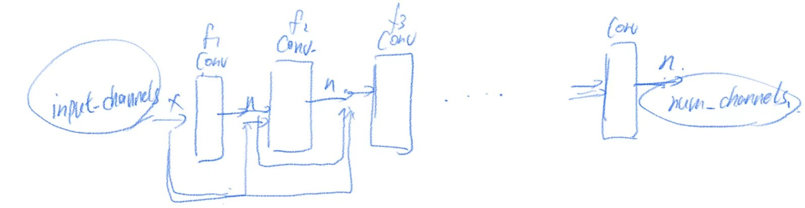

上面就是一个<mark style="background:#fff88f">稠密块的结构</mark>。(两个卷积层，输入维度3， 输出维度10)

这里的输入通道，指的是x的维度，输出通道，是指的每个卷积层的输出通道，但是整个稠密层，其实是输出所有的卷积的结果，包括原始的结果。

所有实际上，一个稠密块的输出，要这么看，输入x, 输出（x, f1(x),f2(x,f1(x))）
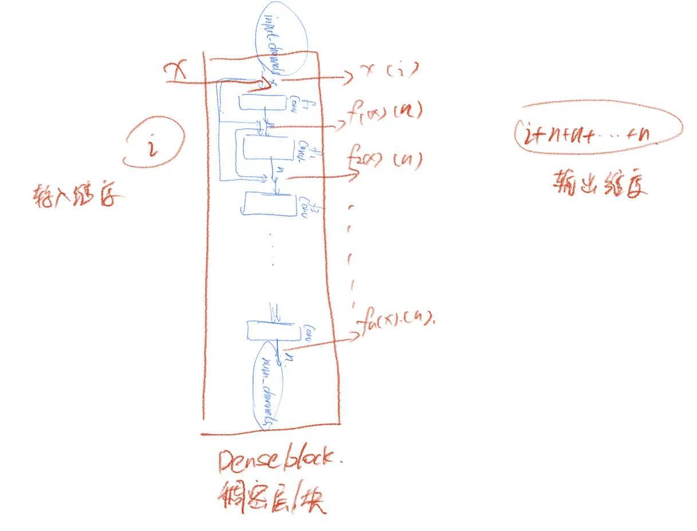


由于**每个稠密块**都会带来**通道数的增加**，使用过多则会过于**复杂化模型**

而**过渡层**可以用来**控制模型复杂度**（通过1x1的卷积层来减小通道数，降维，然后使用步幅为2的平均池化层来减半尺寸，进一步降低模型复杂度）

```python
def transition_block(input_channels, num_channels):
    return nn.Sequential(
        nn.BatchNorm2d(input_channels), nn.ReLU(),
        nn.Conv2d(input_channels, num_channels, kernel_size=1),
        nn.AvgPool2d(kernel_size=2, stride=2))
        
blk = transition_block(23, 10)
blk(Y).shape

"""
	torch.Size([4, 10, 4, 4])
"""
```


下面来构建具体的DenseNet模型
```python
b1 = nn.Sequential(
    nn.Conv2d(1, 64, kernel_size=7, stride=2, padding=3),
    nn.BatchNorm2d(64), nn.ReLU(),
    nn.MaxPool2d(kernel_size=3, stride=2, padding=1))
    
    
# num_channels为当前的通道数
num_channels, growth_rate = 64, 32
num_convs_in_dense_blocks = [4, 4, 4, 4]
blks = []
for i, num_convs in enumerate(num_convs_in_dense_blocks):
    blks.append(DenseBlock(num_convs, num_channels, growth_rate))
    # 上一个稠密块的输出通道数
    num_channels += num_convs * growth_rate
    # 在稠密块之间添加一个转换层，使通道数量减半
    if i != len(num_convs_in_dense_blocks) - 1:
        blks.append(transition_block(num_channels, num_channels // 2))
        num_channels = num_channels // 2 #//2, 表示除法，向下取整数
        
net = nn.Sequential(
    b1, *blks,
    nn.BatchNorm2d(num_channels), nn.ReLU(),
    nn.AdaptiveAvgPool2d((1, 1)),
    nn.Flatten(),
    nn.Linear(num_channels, 10))
```


## RNN 循环卷积

### 序列模型

预测明天的股价要比过去的股价更困难，尽管两者都只是估计一个数字。 毕竟，先见之明比事后诸葛亮难得多。 在统计学中，前者（对超出已知观测范围进行预测）称为_**外推法**_（extrapolation）， 而后者（在现有观测值之间进行估计）称为_**内插法_**（interpolation）

<mark style="background:#fff88f">音乐、语音、文本和视频都是连续的</mark>， 而且这个顺序是有意义的。


处理**序列数据**需要**统计工具**和**新的深度神经网络架构**

前面我们的FNN，CNN，都是以单个样本为单位（X，y）来作为独立的计算单元，不同的样本之间相互独立。目标是，给定一个新的X，我们能够产生对他的标签的预测y'

但是现在，我们开始讨论**序列模型**：输入X，不是单独的一个样本，而是和时间步有关

我们的目的是,通过历史的输入序列（xt-1, xt-2, ...., x1）, 预测下一个时间步xt


我们现在把研究的中心，放到对一个序列的预测上

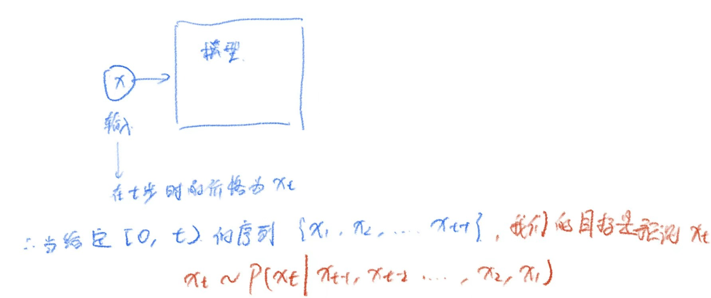


主要有下面几种**统计工具**：

#### 自回归模型
为了实现依据{xt-1, .... , x1}的历史序列，对xt的预测，我们可以使用回归模型。就像之前我们的线性回归一样（因为想要预测数字嘛）

但是这会有一个问题：输入数据{xt-1, ...., x1}这个数据，本身就是和t有关的，

> 这个从t=1时刻开始，一直到我们要求t的前一时刻，一共t-1个数据点/时间步，这个数据量，本身就是随着t的增大而增大的。
> 预测t=10的数字，我们的输入是9个时间步， 预测t=10000的数字，我们的输入是9999个时间步

所以，我们需要一个**近似方法**来让这个计算变得容易处理

因为我们的理论目标是要估计P(xt | xt-1, ...., x1), 但是代价是依赖的输入数据随着t的增大而代价变得越来越大。

所以我们的<mark style="background:#fff88f">近似方法</mark>，就是找一个方法`P' ≈ P(xt | xt-1, ...., x1)`

有这样<mark style="background:#affad1">两种策略</mark>：
- **第一种策略**：假设现实中，不需要从最初的时间步t=1开始，仅需要满足某个长度r的序列长度即可，即使用
  `P(xt | xt-1, xt-2, ...., xt-r) ≈ P(xt | xt-1, ...., x1)`, 好处是，总的输入参数不变，至少在t>r时是这样子的（因为t<r时，还没有r个时间步呢）
	- 这样我们就能够训练一个上面提到的深度网络：这种模型被称为<mark style="background:#fff88f">自回归模型</mark>， 因为他是对自己回归的。（自己预测出来的输出，又反过来加入了输入，再次输入到模型，自产自销）
- **第二种策略**：保留一些对过去观测的总结ht（状态），并且同时产生输出xt_hat, 和状态ht, 此时的输出就是用：`xt_hat = P(xt | ht)` 估计xt（**输出方程**）, ht = g(ht-1, xt-1) 作为**状态转移**。
	- 因为这种模型，内部的ht是无法被观测的，所以被叫做<mark style="background:#fff88f">隐变量自回归模型</mark>


# torch 损失函数
# torch 训练
# torch 评估